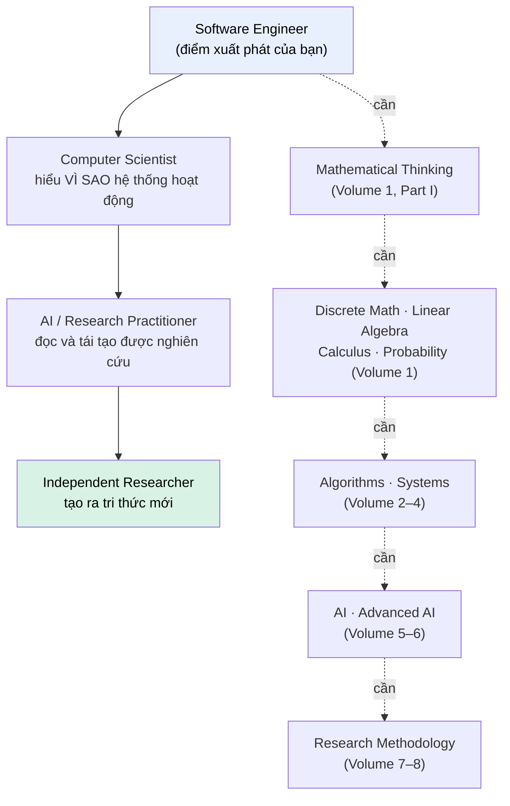
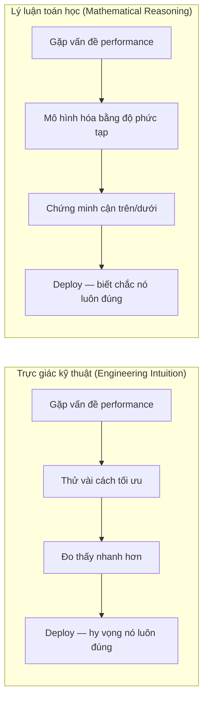

# MASTER COMPUTER SCIENCE HANDBOOK

## Volume 01 — Mathematics for Computer Science
### Part I — Mathematical Thinking
## Chương 1.1 — Vì sao Toán học quan trọng với người làm Khoa học Máy tính
### (Why Mathematics Matters for Computer Scientists)

---

### Thông tin chương

| Trường | Giá trị |
|---|---|
| Chương | 1.1 |
| Thuộc Part | I — Mathematical Thinking |
| Thuộc Volume | 01 — Mathematics for Computer Science |
| Thời gian đọc ước tính | 25–35 phút |
| Độ khó | ★☆☆☆☆ (Khởi động) |
| Kiến thức tiên quyết | Không — đây là điểm khởi đầu của toàn bộ Handbook |
| Chương liên quan | 1.2 — Mathematical Language and Notation; Volume 5, Part II — Machine Learning |
| Từ khóa | mathematical maturity, abstraction, computational thinking, Software Engineering, Computer Science |

---

### Mục tiêu học tập

Sau khi hoàn thành chương này, người đọc có thể:

- Phân biệt rõ ràng giữa **"kỹ thuật hoạt động được" (engineering that works)** và **"khoa học giải thích được vì sao nó hoạt động" (science that explains why)**.
- Nhận ra rằng bản thân, với tư cách một Software Engineer, đã và đang sử dụng tư duy toán học một cách ngầm định — dù chưa bao giờ gọi tên nó.
- Hiểu được lý do Volume 1 của Handbook này tồn tại, và nó sẽ đưa người đọc đi đến đâu.
- Có một kỳ vọng thực tế, không lo sợ, về hành trình toán học phía trước.

---

### Câu hỏi khơi gợi

Trước khi đọc tiếp, hãy dừng lại vài giây với câu hỏi sau:

> *Bạn đã từng tối ưu một đoạn code, thấy nó chạy nhanh hơn, rồi deploy — mà chưa bao giờ thực sự chắc chắn nó sẽ luôn nhanh hơn ở mọi quy mô dữ liệu chưa? Điều gì sẽ khác đi nếu bạn có thể* biết trước *thay vì* hy vọng*?*

Câu trả lời cho câu hỏi này chính là lý do chương này — và cả Volume 1 — tồn tại.

---

## 1. Tổng quan chương

Đây là chương đầu tiên của một cuốn Handbook dài. Trước khi đi vào bất kỳ định nghĩa, ký hiệu hay công thức nào, chúng ta cần trả lời một câu hỏi mà rất nhiều kỹ sư phần mềm — có lẽ cả bạn — đã tự hỏi ít nhất một lần trong sự nghiệp:

> *"Tôi đã viết phần mềm chạy tốt trong nhiều năm mà gần như không cần dùng đến toán. Vậy tại sao bây giờ tôi lại cần học nó?"*

Đây không phải một câu hỏi ngớ ngẩn. Nó là một câu hỏi rất hợp lý, và câu trả lời trung thực không phải là "vì toán học rất đẹp" hay "vì đó là nền tảng của mọi thứ" — những câu trả lời sáo rỗng mà bạn có thể đã nghe ở đâu đó. Câu trả lời thực sự nằm ở **sự khác biệt giữa hai cách hiểu một hệ thống**: hiểu để *sử dụng* nó, và hiểu để *dự đoán, chứng minh, và mở rộng* nó.

Chương này không dạy bất kỳ kỹ thuật toán học nào. Nhiệm vụ duy nhất của nó là định vị: bạn đang ở đâu, Handbook sẽ đưa bạn đến đâu, và vì sao con đường đó nhất thiết phải đi qua toán học chứ không có đường tắt nào khác.

> **💡 Insight**
> Nếu đây là lần đầu bạn đọc một cuốn sách Computer Science mà chương đầu tiên *không* chứa bất kỳ công thức nào — đó là chủ đích, không phải sơ suất. Toàn bộ Handbook này tuân theo nguyên tắc: trực giác luôn đi trước hình thức hóa.

---

## 2. Bối cảnh lịch sử

Sự phân chia giữa "người xây dựng phần mềm" và "người nghiên cứu tính toán" không phải lúc nào cũng tồn tại. Trên thực tế, trong những năm 1930–1950, không hề có "kỹ sư phần mềm" theo nghĩa hiện đại — chỉ có các nhà toán học đang cố gắng trả lời một câu hỏi thuần túy lý thuyết: **"Cái gì có thể tính toán được, và cái gì thì không?"**

Alan Turing, khi công bố *"On Computable Numbers, with an Application to the Entscheidungsproblem"* năm 1936, không hề nghĩ đến việc xây dựng một công ty công nghệ. Ông đang giải một bài toán logic học thuần túy — và trong quá trình đó, ông vô tình phát minh ra khái niệm **máy tính** dưới dạng một mô hình toán học trừu tượng (Turing Machine). Computer Science, với tư cách một ngành khoa học, ra đời **từ toán học**, không phải ngược lại.

Tương tự, khi Claude Shannon công bố *"A Mathematical Theory of Communication"* năm 1948, ông không viết một dòng code nào. Ông đang xây dựng một lý thuyết toán học về thông tin — và lý thuyết đó, hàng chục năm sau, trở thành nền tảng cho nén dữ liệu, mạng viễn thông, và — như bạn sẽ thấy ở Part VI của volume này — cả hàm mất mát (loss function) dùng để huấn luyện các mô hình Machine Learning hiện đại.

| Năm | Sự kiện | Ý nghĩa với Handbook này |
|---|---|---|
| 1936 | Alan Turing công bố Turing Machine | Khai sinh lý thuyết tính toán — nền tảng của Volume 2, Part IX |
| 1948 | Claude Shannon công bố Information Theory | Khai sinh khái niệm entropy — nền tảng của Volume 1, Part VI |
| ~1950s–nay | Lập trình tách thành nghề riêng | Sự tách biệt *thực dụng*, không phải *bản chất*, giữa kỹ sư và nhà khoa học máy tính |

Ngành "lập trình" như một nghề nghiệp độc lập, tách rời khỏi toán học, chỉ thực sự hình thành sau này — khi phần cứng đủ rẻ, ngôn ngữ lập trình đủ cao cấp, và nhu cầu công nghiệp đủ lớn để cần hàng triệu người viết phần mềm mà không nhất thiết phải hiểu lý thuyết tính toán đằng sau nó. Con đường bạn đang đi trong Handbook này, thực chất, là con đường quay ngược lại điểm khởi đầu: nối lại sợi dây giữa kỹ năng lập trình bạn đã có, và ngành khoa học đã sinh ra nó.

---

## 3. Động lực

Hãy xem xét một tình huống rất quen thuộc.

Bạn là một Backend Engineer. Một ngày nọ, hệ thống xử lý 10.000 request/giây bắt đầu chậm lại khi lượng dữ liệu tăng lên. Bạn thử vài cách tối ưu, một cách trong số đó tình cờ hiệu quả. Hệ thống chạy nhanh trở lại. Bạn deploy, mọi người vui vẻ, sprint tiếp theo bắt đầu.

Câu hỏi đặt ra: **bạn có thực sự biết vì sao cách tối ưu đó hiệu quả không?** Nó có hiệu quả với 100.000 request/giây không? Với 10 triệu bản ghi dữ liệu thì sao? Bạn có thể *chứng minh* rằng nó sẽ luôn hiệu quả, hay bạn chỉ đang *hy vọng* dựa trên việc nó đã từng hiệu quả một lần?

Đây chính là ranh giới giữa hai vai trò:

- Một **kỹ sư giỏi** biết cách thử, đo, và điều chỉnh cho đến khi hệ thống hoạt động.
- Một **nhà khoa học máy tính** biết *trước* — bằng lý luận, không phải bằng thử nghiệm — hệ thống sẽ hoạt động ra sao khi quy mô thay đổi, và có thể *chứng minh* điều đó cho người khác tin.

Cả hai kỹ năng đều quý giá. Nhưng chỉ kỹ năng thứ hai mới cho phép bạn: đọc một bài báo nghiên cứu và đánh giá được liệu phương pháp trong đó có thực sự tốt hơn phương pháp cũ hay không; thiết kế một thuật toán mới thay vì chỉ áp dụng thuật toán có sẵn; hoặc hiểu *tại sao* một mô hình Deep Learning học được từ dữ liệu, thay vì chỉ biết gọi `model.fit()`.

> **📌 Remember**
> Toán học, trong bối cảnh của Handbook này, không phải là một môn học riêng biệt bạn cần "học cho xong". Nó là **ngôn ngữ** để thực hiện kiểu lý luận "biết trước bằng chứng minh" thay vì "biết sau bằng thử nghiệm".

---

## 4. Trực giác

Có một sự thật đáng khích lệ mà chương này muốn khẳng định ngay từ đầu: **bạn đã tư duy toán học rồi, chỉ là chưa gọi tên nó.**

**Mô hình tinh thần (Mental Model) của chương này:**

> Học toán ở giai đoạn này giống như việc một người đã biết nói trôi chảy một ngôn ngữ bắt đầu học **ngữ pháp hình thức** của chính ngôn ngữ đó. Bạn không học một thứ hoàn toàn xa lạ — bạn học cách *đặt tên và hệ thống hóa* những gì mình đã làm đúng một cách bản năng.

Ba ví dụ cụ thể:

| Trực giác kỹ thuật bạn đã có | Tên gọi toán học tương ứng | Sẽ học chính thức ở đâu |
|---|---|---|
| Chữ ký hàm `function add(a: number, b: number): number` | Định nghĩa hàm số (function) trên các tập hợp | Chương 1.6 |
| Precondition `email` phải chứa `@` | Vị từ logic (predicate) | Chương 1.3 |
| "Vòng lặp lồng nhau này sẽ chậm với dữ liệu lớn" | Độ phức tạp tính toán (computational complexity) | Volume 3 |

Điều Handbook này làm không phải là "cấy" toán học vào một bộ não chưa từng nghĩ theo kiểu đó. Nó là **đặt tên, hình thức hóa, và mở rộng** những trực giác mà nghề kỹ sư phần mềm đã âm thầm rèn luyện cho bạn trong nhiều năm qua.

---

## 5. Trực quan hóa khái niệm

**Hình 1.1.1 — Hành trình từ Kỹ sư Phần mềm đến Nhà nghiên cứu độc lập**
*(Visual đặc trưng của chương — Chapter Identity)*



| Trường thông tin | Nội dung |
|---|---|
| Mục đích | Định vị chính xác chương này trong hành trình 8 volume, cho thấy không có nấc thang nào bị nhảy cóc |
| Hướng đọc | Từ trên xuống theo cột dọc trái (hành trình vai trò); nhánh chấm chấm bên phải chỉ điều kiện cần |
| Điểm mấu chốt | Volume 1 không phải "chương phụ" — nó là điều kiện cần cho *mọi* volume phía sau |

---

**Hình 1.1.2 — Hai cách tiếp cận cùng một vấn đề kỹ thuật**



*Mục đích:* Làm rõ trực quan sự khác biệt được nêu ở Mục 3. Hai cột không đối lập — cột phải là *phần mở rộng* của cột trái, không phải thay thế nó.

---

## 6. Định nghĩa hình thức

Chương này giới thiệu ba thuật ngữ nền tảng sẽ được dùng xuyên suốt Handbook. Đây là những khái niệm mang tính định hướng — định nghĩa hình thức có ký hiệu sẽ bắt đầu từ Chương 1.2.

> **📌 Remember — Ba thuật ngữ nền tảng**
>
> **Trưởng thành toán học (Mathematical Maturity)** — khả năng đọc một phát biểu toán học, nhận ra cấu trúc logic của nó, và đánh giá được một lập luận có chặt chẽ hay không, mà không nhất thiết phải nhớ mọi công thức. Đây là **mục tiêu cuối cùng của Volume 1**, không phải việc ghi nhớ công thức.
>
> **Trừu tượng hóa (Abstraction)** — quá trình loại bỏ các chi tiết không liên quan để chỉ giữ lại cấu trúc cốt lõi của một vấn đề. Kỹ năng bạn đã có sẵn (interface tách biệt khỏi implementation) — toán học chỉ đẩy nó đi xa hơn.
>
> **Mô hình hóa toán học (Mathematical Modeling)** — hành động biểu diễn một vấn đề thực tế bằng các đối tượng toán học (hàm số, phân phối xác suất, ma trận) để suy luận và dự đoán một cách có hệ thống, thay vì chỉ dựa vào trực giác hoặc thử-sai.

---

## 7. Nền tảng toán học

Vì đây là chương định hướng của toàn bộ volume, chương này **chưa đưa ra bất kỳ công thức nào** — điều đó là chủ đích, không phải thiếu sót. Ký hiệu và định nghĩa hình thức đầu tiên của Handbook sẽ xuất hiện ngay ở Chương 1.2.

Tuy nhiên, có một câu hỏi đáng để dừng lại suy nghĩ trước khi bước sang chương tiếp theo: **toán học, xét cho cùng, giải quyết vấn đề gì mà lập trình thuần túy không giải quyết được?**

Câu trả lời nằm ở khái niệm **tổng quát hóa (generalization)**. Khi bạn viết code, bạn luôn làm việc với các trường hợp cụ thể: mảng này, request này, model này. Toán học cho phép bạn phát biểu và chứng minh những khẳng định đúng cho **mọi** trường hợp cùng loại, mãi mãi — không phải "thuật toán này chạy nhanh trên tập dữ liệu tôi vừa test", mà "thuật toán này luôn chạy trong thời gian tỷ lệ với *n* log *n*, với *n* là kích thước bất kỳ của đầu vào".

> **⚠️ Common Mistake**
> Nhiều người mới bắt đầu nghĩ rằng "học toán cho Computer Science" nghĩa là ghi nhớ một danh sách công thức. Đây là hiểu lầm phổ biến nhất và cũng là lý do khiến nhiều người bỏ cuộc giữa chừng. Mục tiêu thực sự — như đã nêu ở Mục 6 — là **trưởng thành toán học**: khả năng *lý luận*, không phải khả năng *nhớ*. Một người có thể tra cứu công thức bất cứ lúc nào, nhưng không thể tra cứu khả năng suy luận.

---

## 8. Quy trình tư duy

Vì chương này không giới thiệu thuật toán cụ thể nào, mục này trình bày một **quy trình tư duy (mental process)** mà bạn có thể áp dụng ngay khi đọc phần còn lại của Handbook, mỗi khi gặp một khái niệm toán học mới:

```text
Bước 1 — Gặp một khái niệm mới (ví dụ: "eigenvalue")
        │
        ▼
Bước 2 — Hỏi: "Vấn đề kỹ thuật nào khiến khái niệm này cần tồn tại?"
        │
        ▼
Bước 3 — Tìm một analogy hoặc trực giác hình học/vật lý cho nó
        │
        ▼
Bước 4 — Chỉ SAU KHI có trực giác, mới đọc định nghĩa hình thức
        │
        ▼
Bước 5 — Thử áp dụng nó vào MỘT ví dụ số cụ thể, tự tay tính
        │
        ▼
Bước 6 — Hỏi: "Khái niệm này sẽ xuất hiện lại ở đâu trong Handbook?"
```

> **💡 Insight**
> Quy trình này chính là "hợp đồng ngầm" giữa Handbook và bạn: chương nào cũng sẽ trình bày theo đúng thứ tự Bước 2 → 6 (không bao giờ nhảy thẳng vào Bước 4), và đổi lại, bạn hãy chủ động thực hiện Bước 5 và 6 — không có nó, việc đọc sẽ chỉ dừng lại ở "biết", chứ không đạt đến "hiểu".

---

## 9. Triển khai

Để minh họa cụ thể cho Mục 4 (trực giác bạn đã có sẵn) và Mục 7 (giá trị của tổng quát hóa), hãy xem một thí nghiệm nhỏ, thực tế, có thể tự chạy lại.

Giả sử bạn cần viết một hàm kiểm tra xem một mảng số có phần tử trùng lặp hay không. Có ít nhất hai cách viết:

```python
# Cách 1 — "naive": so sánh từng cặp phần tử
def has_duplicate_naive(arr):
    n = len(arr)
    for i in range(n):
        for j in range(i + 1, n):
            if arr[i] == arr[j]:
                return True
    return False


# Cách 2 — dùng cấu trúc dữ liệu set để tra cứu nhanh
def has_duplicate_set(arr):
    seen = set()
    for x in arr:
        if x in seen:
            return True
        seen.add(x)
    return False
```

Cả hai hàm đều **đúng** — chúng luôn trả về cùng một kết quả. Nhưng "đúng" không phải là câu hỏi duy nhất đáng quan tâm. Câu hỏi tiếp theo là: **chúng có nhanh như nhau không khi *n* lớn lên?**

---

## 10. Trực quan hóa quá trình thực thi

Chạy thực tế hai hàm trên với mảng ngẫu nhiên có kích thước tăng dần, ta thu được:

| *n* (số phần tử) | Cách 1 — naive (giây) | Cách 2 — set-based (giây) | Cách 2 nhanh hơn |
|---:|---:|---:|---:|
| 500 | 0.007709 | 0.000302 | ≈ 25.5 lần |
| 1.000 | 0.016224 | 0.000132 | ≈ 122.9 lần |
| 2.000 | 0.062233 | 0.001134 | ≈ 54.9 lần |
| 4.000 | 0.335080 | 0.002746 | ≈ 122.0 lần |
| 8.000 | 1.059859 | 0.004521 | ≈ 234.4 lần |

*(Số liệu đo thực tế trên một máy đơn, chỉ mang tính minh họa xu hướng — con số tuyệt đối sẽ khác nhau giữa các lần chạy; điều đáng chú ý là **xu hướng**, không phải giá trị cụ thể.)*

Quan sát rõ nhất: khi *n* tăng gấp đôi (từ 4.000 lên 8.000), Cách 1 chậm đi hơn gấp ba lần, trong khi Cách 2 gần như không đổi.

> **🛠 Engineering Practice**
> Chương này **cố tình chưa** giải thích chính xác vì sao tỉ lệ chênh lệch tăng theo cách đó — đó là nội dung Complexity Analysis ở Volume 3, Part I. Điều cần mang theo từ đây: **bạn hoàn toàn có thể dự đoán hành vi này bằng toán học, mà không cần đo đạc thực nghiệm** — đó chính xác là năng lực Handbook đang xây dựng cho bạn.

---

## 11. Ứng dụng công nghiệp

> **🛠 Engineering Practice**
> Sự khác biệt giữa "code chạy được" và "code được chứng minh sẽ luôn chạy đúng và đủ nhanh" không phải là một mối bận tâm hàn lâm — nó là ranh giới sống còn ở quy mô công nghiệp thực tế.

| Công ty | Ứng dụng toán học nền tảng | Không phải |
|---|---|---|
| Google | PageRank — eigenvector của ma trận liên kết trang web (Volume 1, Part III) | Thuật toán heuristic thử-sai |
| Amazon | Hệ gợi ý dựa trên mô hình xác suất và tối ưu hóa có chứng minh (Volume 1, Part V, VII) | Luật "nếu-thì" viết tay |
| OpenAI / Anthropic | Sự hội tụ khi huấn luyện phụ thuộc trực tiếp vào đảm bảo toán học của thuật toán tối ưu hóa (Chương 7.3–7.5) | "Thử chạy xem có ra không" |

Điểm chung: ở quy mô đủ lớn, "thử và hy vọng" không còn là một chiến lược khả thi. Chi phí của một hệ thống thất bại không thể đoán trước vượt xa chi phí học toán một cách nghiêm túc.

---

## 12. Góc nhìn nghiên cứu

> **🔬 Research Connection**
> Việc coi toán học là ngôn ngữ nền tảng của Computer Science không phải là quan điểm riêng của Handbook này — nó là cách ngành khoa học này đã tự định nghĩa mình từ những công trình đầu tiên.

- **Alan Turing (1936)**, *"On Computable Numbers, with an Application to the Entscheidungsproblem"* — đặt nền móng lý thuyết tính toán bằng một mô hình toán học thuần túy. Gặp lại di sản trực tiếp ở Volume 2, Part IX.
- **Claude Shannon (1948)**, *"A Mathematical Theory of Communication"* — thiết lập Information Theory. Gặp lại khái niệm entropy ở Part VI của chính volume này, sau đó là nền tảng cross-entropy loss ở Volume 5.

**Câu hỏi nghiên cứu mở** để suy ngẫm: liệu có giới hạn nào cho việc toán học hóa tư duy công nghệ hay không? Có những khía cạnh của kỹ thuật phần mềm — thẩm mỹ thiết kế, trực giác trải nghiệm người dùng — dường như chống lại sự hình thức hóa hoàn toàn. Đây là câu hỏi đáng giữ trong đầu xuyên suốt hành trình phía trước.

---

## 13. Ưu điểm

- **Khả năng tổng quát hóa** — giải quyết được cả một *lớp* vấn đề, không chỉ một trường hợp cụ thể.
- **Khả năng dự đoán trước** — biết hệ thống hoạt động ra sao ở quy mô chưa từng thử nghiệm.
- **Khả năng giao tiếp chính xác** — một chứng minh hoặc công thức loại bỏ sự mơ hồ của ngôn ngữ tự nhiên.
- **Nền tảng để đọc nghiên cứu** — phần lớn các bài báo AI/CS hiện đại dùng ngôn ngữ toán học.

---

## 14. Hạn chế

> **⚠️ Common Mistake**
> Tư duy toán học **không phải** liều thuốc vạn năng. Việc lạm dụng nó cũng là một sai lầm cần tránh.

- **Không phải mọi vấn đề kỹ thuật đều cần một mô hình toán học chặt chẽ.** Nhiều quyết định (chọn framework, thiết kế API) chủ yếu dựa vào kinh nghiệm và ngữ cảnh.
- **Hình thức hóa quá sớm có thể phản tác dụng** — dẫn đến chứng minh sai thứ không cần thiết, hoặc bỏ lỡ giải pháp đơn giản hơn.
- **Toán học mô tả mô hình, không phải hiện thực.** Một chứng minh chỉ đúng trong phạm vi giả định của mô hình — nếu giả định không khớp thực tế, kết luận có thể sai khi áp dụng.

---

## 15. So sánh

**Bảng 1.1.1 — Trực giác kỹ thuật so với Lý luận toán học**

| Tiêu chí | Trực giác kỹ thuật (Engineering Intuition) | Lý luận toán học (Mathematical Reasoning) |
|---|---|---|
| Cách xác nhận | Thử nghiệm, đo đạc, quan sát | Chứng minh logic, suy luận hình thức |
| Phạm vi đúng | Đúng trong các trường hợp đã thử | Đúng cho mọi trường hợp thỏa mãn giả thiết |
| Tốc độ đạt được | Nhanh, phù hợp vòng lặp phát triển ngắn | Chậm hơn, đòi hỏi tư duy có cấu trúc |
| Khả năng mở rộng quy mô | Rủi ro cao khi ngoại suy | An toàn khi ngoại suy, miễn giả thiết còn đúng |
| Vai trò trong Handbook này | Điểm khởi đầu — trực giác bạn đã có (Mục 4) | Đích đến — năng lực Volume 1 xây dựng cho bạn |

**Phân tích:** Bảng trên không tuyên bố cột phải "tốt hơn" cột trái một cách tuyệt đối. Điều bảng này làm rõ là: **khi mức độ rủi ro và quy mô đủ lớn**, sự khác biệt giữa hai cột không còn là vấn đề học thuật, mà là vấn đề sống còn của dự án. Volume 1 không yêu cầu bạn từ bỏ cột trái; nó trang bị cho bạn quyền truy cập vào cột phải.

---

## 16. Tóm tắt

1. **Toán học không phải là một môn học tách biệt khỏi kỹ thuật phần mềm** — nó là ngôn ngữ hình thức hóa những trực giác nghề kỹ sư đã âm thầm rèn luyện cho bạn.
2. **Sự khác biệt cốt lõi** toán học mang lại là khả năng đi từ "quan sát thực nghiệm" sang "khẳng định đã chứng minh cho mọi trường hợp" — một bước nhảy về chất.
3. **Handbook này không đòi hỏi ghi nhớ công thức** — nó đòi hỏi bạn đạt được **trưởng thành toán học**: khả năng đọc, lý luận, và tự tin bước tiếp mà không sợ ký hiệu.

Chương 1.2 sẽ bắt đầu công việc cụ thể đầu tiên: học cách đọc và viết ngôn ngữ ký hiệu toán học trôi chảy.

---

## 17. Bài tập

Vì đây là chương định hướng, bài tập tập trung vào phản tư (reflection), không có bài tập tính toán.

### Mức Cơ bản (Basic)

1. Hãy nhớ lại một tình huống trong công việc gần đây khi bạn tối ưu một đoạn code hoặc hệ thống. Bạn đã dựa vào **thử nghiệm** hay **lý luận trước** để quyết định giải pháp? Viết 3–5 câu mô tả lại quá trình ra quyết định đó.
2. Xem lại Ví dụ 2 ở Mục 4 (Precondition của một API). Hãy viết ra một precondition khác mà bạn từng viết (hoặc từng thấy), và thử diễn đạt lại nó dưới dạng một mệnh đề "đúng hoặc sai" rõ ràng.
3. Bảng số liệu ở Mục 10 cho thấy Cách 2 luôn nhanh hơn Cách 1 trong mọi kích thước *n* được thử. Theo trực giác của bạn — điều đó có luôn đúng với *mọi* kích thước *n*, kể cả *n* rất nhỏ? Viết dự đoán; chúng ta sẽ kiểm chứng chính xác ở Volume 3.

---

## 18. Dự án nhỏ

**Không áp dụng cho chương này.**

Đây là chương định hướng, không giới thiệu công cụ kỹ thuật mới để triển khai thành dự án độc lập. Dự án nhỏ đầu tiên của Volume 1 xuất hiện ở cuối Part I, dưới dạng Dự án tích hợp *"Formal Specification Translator"*, tổng hợp Chương 1.3–1.6.

---

## 19. Tự đánh giá

- [ ] Tôi có thể giải thích, bằng lời của chính mình, sự khác biệt giữa "kỹ thuật hoạt động được" và "khoa học giải thích được vì sao" — không cần nhìn lại chương.
- [ ] Tôi có thể chỉ ra ít nhất một ví dụ, từ chính công việc của mình, nơi tôi đã ngầm sử dụng tư duy toán học.
- [ ] Tôi hiểu vì sao Volume 1 phải đi trước tất cả các volume khác (xem lại Hình 1.1.1 nếu chưa chắc chắn).
- [ ] Tôi cảm thấy sẵn sàng — không phải "đã biết toán", mà "sẵn sàng bắt đầu học có định hướng" — để bước vào Chương 1.2.

---

## 20. Đọc thêm

- **Sách:** Marc Peter Deisenroth, A. Aldo Faisal, Cheng Soon Ong, *Mathematics for Machine Learning* — đặc biệt Preface và Chương 1. *(Xem BOOKS.md — Volume 1.)*
- **Bài báo lịch sử (biết đến sự tồn tại, chưa cần đọc toàn văn):** Alan Turing (1936); Claude Shannon (1948). *(Xem PAPERS.md.)*
- **Chương tiếp theo:** Chương 1.2 — Mathematical Language and Notation.

---

### Liên kết chương (Cross References)

- **Chương tiếp theo:** 1.2 — Mathematical Language and Notation (bắt buộc, không thể bỏ qua).
- **Volume liên quan trực tiếp:** Volume 5, Part II (Machine Learning).
- **Vị trí trong Knowledge Graph:** Nút gốc (root node) của toàn bộ Volume 1 — không có kiến thức tiên quyết nào đứng trước chương này.

---

*Hết Chương 1.1. Phiên bản này đã áp dụng "Enhance Presentation Layer" theo PROMPT_LIBRARY.md và Presentation Layer trong WRITING_STANDARD.md (cập nhật): callout box, chapter identity visual, visual density được cải thiện — nội dung học thuật, mục tiêu học tập và độ chính xác kỹ thuật giữ nguyên không đổi so với bản trước.*
