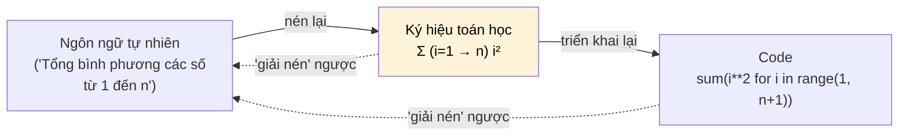

# MASTER COMPUTER SCIENCE HANDBOOK

## Volume 01 — Mathematics for Computer Science
### Part I — Mathematical Thinking
## Chương 1.2 — Ngôn ngữ và Ký hiệu Toán học
### (Mathematical Language and Notation)

---

### Thông tin chương

| Trường | Giá trị |
|---|---|
| Chương | 1.2 |
| Thuộc Part | I — Mathematical Thinking |
| Thuộc Volume | 01 — Mathematics for Computer Science |
| Thời gian đọc ước tính | 35–45 phút |
| Độ khó | ★☆☆☆☆ (Khởi động) |
| Kiến thức tiên quyết | Chương 1.1 — Why Mathematics Matters for Computer Scientists |
| Chương liên quan | 1.3 — Propositional and Predicate Logic (dùng trực tiếp ký hiệu của chương này) |
| Từ khóa | notation, quantifier, variable, constant, set notation, function notation, summation |

---

### Mục tiêu học tập

Sau khi hoàn thành chương này, người đọc có thể:

- Đọc trôi chảy các ký hiệu toán học phổ biến (∀, ∃, ∈, ⊆, Σ, Π, →) mà không cần dừng lại tra cứu.
- Phân biệt được biến (variable), hằng số (constant), và tham số (parameter) trong một biểu thức.
- Dịch qua lại giữa ba dạng biểu diễn của cùng một ý tưởng: **ngôn ngữ tự nhiên → ký hiệu toán học → code**.
- Phân biệt được một **định nghĩa (definition)**, một **khẳng định (claim/proposition)**, và một **định lý (theorem)** khi gặp trong tài liệu học thuật.

---

### Câu hỏi khơi gợi

> *Bạn đã bao giờ mở một bài báo nghiên cứu, thấy một dòng ký hiệu dày đặc, và đóng lại ngay lập tức vì cảm giác "cái này không dành cho mình" chưa? Điều gì sẽ khác đi nếu bạn biết rằng đằng sau mỗi ký hiệu lạ luôn có một câu văn xuôi đơn giản đang chờ được "giải mã"?*

---

## 1. Tổng quan chương

Chương 1.1 đã thuyết phục bạn rằng toán học là ngôn ngữ đáng học. Chương này bắt đầu dạy bạn *đọc* ngôn ngữ đó — theo đúng nghĩa đen.

Có một rào cản rất thực tế mà hầu hết kỹ sư phần mềm gặp phải khi lần đầu mở một bài báo nghiên cứu hoặc một giáo trình sau đại học: trang giấy đầy những ký hiệu như $\forall x \in \mathbb{R}, \exists y$ hoặc $\sum_{i=1}^{n}$, và cảm giác đầu tiên thường là **choáng ngợp** — không phải vì ý tưởng đằng sau khó, mà vì *ký hiệu* trông xa lạ. Đây là một rào cản về **cú pháp (syntax)**, không phải về **ngữ nghĩa (semantics)**.

> **💡 Insight**
> Rào cản cú pháp là loại rào cản dễ vượt qua nhất trong mọi loại rào cản học thuật — nó chỉ cần luyện tập có hệ thống, không cần tài năng đặc biệt. Chương này chính là buổi "học cú pháp" đó.

Chương này không giới thiệu bất kỳ khái niệm toán học sâu nào — không có định lý nào cần chứng minh ở đây. Nhiệm vụ duy nhất là làm cho bạn **thoải mái** với hình thức bên ngoài của toán học, trước khi Chương 1.3 bắt đầu dùng ngôn ngữ này để xây dựng nội dung logic thực sự.

---

## 2. Bối cảnh lịch sử

Ký hiệu toán học mà chúng ta xem là "hiển nhiên" ngày nay thực chất là kết quả của một quá trình chuẩn hóa kéo dài hàng thế kỷ, và nó từng rất hỗn loạn.

Một ví dụ nổi tiếng: vào thế kỷ 17, cả Isaac Newton và Gottfried Leibniz độc lập phát triển phép tính vi phân (Calculus — nội dung Part IV của volume này), nhưng dùng hai hệ ký hiệu hoàn toàn khác nhau. Newton dùng dấu chấm phía trên biến số ($\dot{x}$) để chỉ đạo hàm theo thời gian; Leibniz dùng ký hiệu $\frac{dy}{dx}$ mà chúng ta vẫn dùng phổ biến ngày nay. Ký hiệu của Leibniz cuối cùng thắng thế — không phải vì nó "đúng" hơn về mặt toán học, mà vì nó **truyền đạt trực giác tốt hơn** và **dễ mở rộng hơn**.

Sang đầu thế kỷ 20, các nhà toán học như Giuseppe Peano và Gottlob Frege đã phát minh phần lớn ký hiệu tập hợp và logic vị từ mà bạn sẽ học ngay trong chương này. Sau đó, nhóm bút danh chung **Nicolas Bourbaki** (Pháp, từ thập niên 1930) có công lớn trong việc *thống nhất* ký hiệu toán học hiện đại thành một hệ thống nhất quán được dùng đến ngày nay.

> **📌 Remember**
> Ký hiệu toán học không phải là "luật tự nhiên" bất biến — nó là một **giao thức giao tiếp (communication protocol)** do con người thiết kế và đồng thuận, giống hệt cách ngành phần mềm đồng thuận về HTTP hay JSON. Và giống bất kỳ giao thức nào, một khi hiểu logic thiết kế, việc "đọc" nó trở nên tự nhiên.

---

## 3. Động lực

Hãy tưởng tượng bạn đang đọc phần Methodology của một bài báo nghiên cứu Machine Learning, và gặp dòng sau:

$$\forall i \in \{1, \dots, n\}, \; \hat{y}_i = f_\theta(x_i)$$

Nếu ký hiệu này khiến bạn khựng lại, hãy thử điều này: **dịch nó sang code** mà bạn đã quen thuộc.

```python
for i in range(1, n + 1):
    y_hat[i] = f(theta, x[i])
```

Đây chính xác là cùng một ý tưởng, chỉ khác ngôn ngữ biểu đạt: "với mọi chỉ số *i* từ 1 đến *n*, giá trị dự đoán *ŷᵢ* bằng kết quả của hàm *f* (tham số hóa bởi *θ*) áp dụng lên đầu vào *xᵢ*". Ký hiệu $\forall$ đóng vai trò hệt như vòng lặp `for` trong code của bạn.

> **💡 Insight**
> Bạn không cần học một ngôn ngữ tư duy hoàn toàn mới — bạn cần học một bộ từ vựng mới cho một cách tư duy bạn đã có. Mỗi ký hiệu trong chương này sẽ luôn kèm một "bản dịch" sang code.

---

## 4. Trực giác

**Mô hình tinh thần (Mental Model) của chương này:**

> Ký hiệu toán học là một dạng **"nén dữ liệu" (compression)** cho ý tưởng — giống hệt lý do kỹ sư dùng `sum()` hay `reduce()` thay vì viết tay một vòng lặp mỗi lần cần cộng dồn.

So sánh hai cách diễn đạt cùng một ý:

> *Bằng lời:* "Tổng của bình phương tất cả các số nguyên từ 1 cho đến n." *(16 từ)*
>
> *Bằng ký hiệu:* $\displaystyle\sum_{i=1}^{n} i^2$ *(một biểu thức ngắn gọn)*

Đây không phải là toán học "làm khó" người đọc — đây là một cơ chế nén thông tin có chủ đích. Khi một bài báo có hàng chục công thức, khả năng "nén" này là điều giúp bài báo có thể đọc được trong vài trang, thay vì vài trăm trang văn xuôi.

Hệ quả trực tiếp: **muốn đọc nhanh, bạn phải học "giải nén"** — nhìn một ký hiệu và ngay lập tức khôi phục ý nghĩa đầy đủ bằng lời. Đó chính xác là kỹ năng chương này rèn luyện.

---

## 5. Trực quan hóa khái niệm

**Hình 1.2.1 — Ký hiệu như một lớp "nén" giữa Ngôn ngữ tự nhiên và Code**
*(Visual đặc trưng của chương — Chapter Identity)*



*Mục đích:* Ba dạng biểu diễn ở Mục 4 luôn chuyển đổi qua lại — không dạng nào "cao cấp hơn", chúng tối ưu cho mục đích khác nhau. *Điểm mấu chốt:* gặp ký hiệu lạ, luôn có hai đường "giải mã" — quay về ngôn ngữ tự nhiên, hoặc quay về code.

---

**Bảng 1.2.1 — Bảng tra cứu ký hiệu (Notation Reference Table)**

| Ký hiệu | Tên gọi | Ý nghĩa | Tương đương trong code |
|---|---|---|---|
| $\forall$ | For all (với mọi) | Đúng cho *mọi* phần tử trong một tập hợp | vòng lặp `for` bao trùm toàn bộ tập hợp |
| $\exists$ | There exists (tồn tại) | Đúng cho *ít nhất một* phần tử | `for` kèm `break`, hoặc `any()` |
| $\in$ | Element of (thuộc về) | Một phần tử nằm trong một tập hợp | toán tử `in` |
| $\subseteq$ | Subset of (tập con) | Mọi phần tử của tập này cũng thuộc tập kia | `set_a.issubset(set_b)` |
| $\rightarrow$ (trong $f: A \to B$) | Maps to (ánh xạ tới) | Khai báo miền xác định/miền giá trị của hàm | type signature, `def f(x: A) -> B` |
| $\sum$ | Summation (tổng) | Cộng dồn một biểu thức qua một khoảng chỉ số | `sum(...)` hoặc vòng lặp cộng dồn |
| $\prod$ | Product (tích) | Nhân dồn một biểu thức qua một khoảng chỉ số | `math.prod(...)` hoặc vòng lặp nhân dồn |
| $:=$ hoặc $\triangleq$ | Defined as (định nghĩa là) | Gán định nghĩa (khác khẳng định bằng nhau) | phép gán `=` khi khai báo mới |

*Bảng này dùng làm tài liệu tra cứu xuyên suốt Handbook — không cần ghi nhớ ngay, chỉ cần biết nó tồn tại và quay lại khi cần.*

---

## 6. Định nghĩa hình thức

> **📌 Remember — Ba loại đại lượng**
>
> **Biến (Variable)** — ký hiệu đại diện cho một giá trị *chưa xác định* hoặc *có thể thay đổi*. Ví dụ: trong $f(x) = x^2$, $x$ là biến.
>
> **Hằng số (Constant)** — ký hiệu đại diện cho một giá trị *cố định*, không đổi trong ngữ cảnh đang xét. Ví dụ: $\pi$, $e$, hoặc $n$ trong "một tập dữ liệu có $n$ phần tử cho trước".
>
> **Tham số (Parameter)** — về hình thức cũng là một biến, nhưng theo quy ước đại diện cho các giá trị *có thể điều chỉnh để cấu hình một họ hàm số*. Ví dụ: trong $f_\theta(x) = \theta_1 x + \theta_2$, $x$ là biến đầu vào, $\theta$ là tham số — ký hiệu bạn sẽ gặp lại liên tục ở Volume 5 khi $\theta$ đại diện cho trọng số (weights) của mô hình.

**Lượng từ phổ dụng (Universal Quantifier, $\forall$)** — phát biểu một mệnh đề đúng với *mọi* phần tử trong một tập hợp cho trước. Cú pháp: $\forall x \in S, P(x)$ — "với mọi $x$ thuộc $S$, mệnh đề $P(x)$ đúng".

**Lượng từ tồn tại (Existential Quantifier, $\exists$)** — phát biểu có *ít nhất một* phần tử thỏa mãn mệnh đề. Cú pháp: $\exists x \in S, P(x)$ — "tồn tại $x$ thuộc $S$ sao cho $P(x)$ đúng". Ký hiệu $\exists!$ là biến thể nghiêm ngặt hơn: "tồn tại **duy nhất một** $x$".

> **⚠️ Common Mistake**
> Nhầm lẫn phổ biến nhất khi mới học: nghĩ rằng **Định nghĩa**, **Khẳng định (Claim/Proposition)**, và **Định lý (Theorem)** đều là cùng một loại phát biểu. Chúng khác nhau về vai trò:
> - Một **định nghĩa** *đặt tên* cho một khái niệm — không cần chứng minh, chỉ cần tuân theo nhất quán.
> - Một **khẳng định** *phát biểu* điều có thể đúng/sai, cần được chứng minh trước khi chấp nhận.
> - Một **định lý** là khẳng định đã được chứng minh chặt chẽ, đủ quan trọng để được đặt tên riêng.
>
> Gặp một định nghĩa, bạn chỉ cần ghi nhớ; gặp một khẳng định hoặc định lý, bạn nên tự hỏi "tại sao điều này đúng?" trước khi chấp nhận nó.

---

## 7. Nền tảng toán học

Phần này đi sâu vào hai nhóm ký hiệu xuất hiện dày đặc nhất trong Handbook: **ký hiệu tổng/tích** và **ký hiệu tập hợp/hàm số**.

### 7.1 Ký hiệu tổng (Summation, Σ)

Trước khi xem công thức đầy đủ, hãy xây dựng nó từng bước:

- **Ý nghĩa (Meaning):** ta muốn cộng dồn nhiều số hạng có cùng một khuôn mẫu, thay vì viết tay từng số hạng.
- **Ký hiệu (Notation):** ta dùng chữ Hy Lạp $\Sigma$ (sigma hoa) để biểu thị "tổng", với chỉ số chạy phía dưới và phía trên.
- **Ví dụ đơn giản (Simple Example):** cộng $1 + 4 + 9 + 16 + 25$ (các số chính phương từ 1 đến 5).

> **📦 Formula Box — Ký hiệu Tổng (Summation)**
>
> $$\sum_{i=1}^{n} a_i = a_1 + a_2 + \dots + a_n$$
>
> | Thành phần | Ý nghĩa |
> |---|---|
> | Chỉ số dưới ($i = 1$) | Giá trị khởi đầu của chỉ số chạy |
> | Chỉ số trên ($n$) | Giá trị kết thúc (bao gồm cả giá trị này) |
> | Biểu thức bên phải ($a_i$) | Công thức được cộng dồn tại mỗi bước |
> | **Diễn giải kỹ thuật** | Tương đương một vòng lặp `for` cộng dồn vào một biến tích lũy |
> | **Ứng dụng thường gặp** | Tính tổng mất mát (loss) trên toàn bộ tập dữ liệu ở Volume 5; tính tổng trọng số trong mạng neural |

Ví dụ cụ thể, với $a_i = i^2$ và $n = 5$:

$$\sum_{i=1}^{5} i^2 = 1^2 + 2^2 + 3^2 + 4^2 + 5^2 = 1 + 4 + 9 + 16 + 25 = 55$$

Biểu thức này còn có một **công thức đóng (closed-form)** tương đương, không cần liệt kê từng số hạng:

> **📦 Formula Box — Công thức đóng cho tổng bình phương**
>
> $$\sum_{i=1}^{n} i^2 = \frac{n(n+1)(2n+1)}{6}$$
>
> | Thành phần | Ý nghĩa |
> |---|---|
> | $n$ | Số lượng số hạng cần cộng |
> | **Diễn giải kỹ thuật** | Tính trực tiếp trong thời gian hằng số, không cần vòng lặp — minh họa sớm cho khái niệm "độ phức tạp" ở Volume 3 |
> | **Ví dụ tính toán** | Với $n=5$: $\frac{5 \times 6 \times 11}{6} = \frac{330}{6} = 55$ — khớp chính xác kết quả cộng trực tiếp ở trên |

*(Mục 9–10 sẽ kiểm chứng công thức này bằng code thực tế, không chỉ bằng tay.)*

### 7.2 Ký hiệu tích (Product, Π)

Cấu trúc tương tự $\Sigma$, nhưng nhân thay vì cộng:

> **📦 Formula Box — Ký hiệu Tích (Product)**
>
> $$\prod_{i=1}^{n} a_i = a_1 \times a_2 \times \dots \times a_n$$
>
> | Thành phần | Ý nghĩa |
> |---|---|
> | Cấu trúc | Giống hệt $\Sigma$, chỉ thay phép cộng bằng phép nhân |
> | **Ứng dụng thường gặp** | Giai thừa $n! = \prod_{i=1}^{n} i$; tính xác suất của các sự kiện độc lập ở Part V |

### 7.3 Ký hiệu hàm số

> **📦 Formula Box — Ký hiệu Hàm số**
>
> $$f: A \to B, \quad f(x) = x^2$$
>
> | Thành phần | Ý nghĩa |
> |---|---|
> | $A$ | Miền xác định (domain) — nơi biến đầu vào được lấy ra |
> | $B$ | Miền giá trị đích (codomain) — nơi giá trị đầu ra thuộc về |
> | **Diễn giải kỹ thuật** | Chính là type signature của hàm, ví dụ `def f(x: float) -> float` |
> | **Lưu ý** | Chương 1.6 sẽ hình thức hóa đầy đủ khái niệm hàm theo lý thuyết tập hợp; ở đây chỉ cần nắm cú pháp đọc |

---

## 8. Quy trình giải mã ký hiệu

```text
Bước 1 — Xác định TẤT CẢ các ký hiệu xuất hiện trong biểu thức
        │
        ▼
Bước 2 — Với mỗi ký hiệu, phân loại: biến? hằng số? tham số?
         lượng từ? phép toán? (tra Bảng 1.2.1 nếu cần)
        │
        ▼
Bước 3 — Xác định PHẠM VI của mỗi lượng từ / chỉ số
         (từ đâu đến đâu? thuộc tập nào?)
        │
        ▼
Bước 4 — Đọc biểu thức thành câu văn đầy đủ, chậm rãi, từng phần
        │
        ▼
Bước 5 — (Nếu cần) Viết lại biểu thức dưới dạng code hoặc
         pseudocode để kiểm tra hiểu đúng
        │
        ▼
Bước 6 — Thử với MỘT giá trị số cụ thể để xác nhận
```

**Áp dụng thử** với biểu thức đã nêu ở Mục 3: $\forall i \in \{1, \dots, n\}, \; \hat{y}_i = f_\theta(x_i)$

| Bước | Kết quả áp dụng |
|---|---|
| 1–2 | $\forall$ (lượng từ), $i$ (biến chỉ số), $\{1,\dots,n\}$ (tập hợp — miền của $i$), $\hat{y}_i, f_\theta, x_i$ (các biến/hàm) |
| 3 | $i$ chạy từ $1$ đến $n$, bao gồm cả hai đầu mút |
| 4 | "Với mọi chỉ số $i$ từ 1 đến $n$, giá trị dự đoán tại vị trí $i$ bằng kết quả của hàm $f$ (tham số hóa bởi $\theta$) áp dụng lên đầu vào tại vị trí $i$." |
| 5–6 | Đã thực hiện ở Mục 3 (đoạn code Python) — có thể tự chạy thử với $n=3$ |

---

## 9. Triển khai

Hãy kiểm chứng công thức đóng của Mục 7.1 bằng code thực tế — không chỉ tin vào phép tính tay:

```python
def sum_loop(n):
    """Tính tổng bình phương bằng cách cộng dồn từng bước —
    bản dịch trực tiếp của ký hiệu Σ."""
    total = 0
    for i in range(1, n + 1):
        total += i ** 2
    return total


def sum_closed_form(n):
    """Tính bằng công thức đóng: n(n+1)(2n+1) / 6."""
    return n * (n + 1) * (2 * n + 1) // 6
```

Mỗi dòng trong `sum_loop` tương ứng trực tiếp với một thành phần của ký hiệu $\sum_{i=1}^{n} i^2$: vòng lặp `for i in range(1, n + 1)` chính là "$i$ chạy từ 1 đến $n$"; `total += i ** 2` chính là "cộng dồn $i^2$ vào tổng".

---

## 10. Trực quan hóa quá trình thực thi

| $n$ | Kết quả từ vòng lặp | Kết quả từ công thức đóng | Khớp? |
|---:|---:|---:|---:|
| 5 | 55 | 55 | ✓ |
| 10 | 385 | 385 | ✓ |
| 100 | 338.350 | 338.350 | ✓ |
| 1.000 | 333.833.500 | 333.833.500 | ✓ |

*(Số liệu tính toán trực tiếp, không làm tròn.)*

> **⚠️ Common Mistake**
> Việc hai cách tính luôn khớp nhau với 4 giá trị $n$ đã thử là một **minh chứng thực nghiệm**, chứ **chưa phải một chứng minh hình thức** rằng công thức đóng đúng với *mọi* $n$. Nhầm lẫn "kiểm tra vài trường hợp" với "chứng minh tổng quát" là lỗi tư duy phổ biến — chính là chủ đề Chương 1.4 (Proof Techniques, cụ thể là quy nạp toán học) sẽ giải quyết triệt để.

---

## 11. Ứng dụng công nghiệp

> **🛠 Engineering Practice**
> Khả năng đọc ký hiệu toán học trôi chảy không phải là một kỹ năng "học thuật thuần túy" — nó có tác động trực tiếp đến năng suất kỹ sư trong thực tế.

| Bối cảnh công nghiệp | Vai trò của ký hiệu toán học |
|---|---|
| Kỹ sư tại DeepMind/OpenAI triển khai một kỹ thuật mới từ paper | Phần lớn công việc là dịch công thức trong bài báo thành code — đúng quy trình ở Mục 8 |
| Chứng minh tính đúng đắn của Paxos/Raft (Volume 4) | Ngôn ngữ tự nhiên không đủ chính xác để đặc tả mọi tình huống race condition |
| Đặc tả giao thức bảo mật (TLS, chuẩn mã hóa) | Ký hiệu hình thức loại bỏ mơ hồ — lỗ hổng bảo mật đôi khi bắt nguồn từ đặc tả ngôn ngữ tự nhiên bị hiểu hai cách khác nhau |

---

## 12. Góc nhìn nghiên cứu

> **🔬 Research Connection**
> Việc chuẩn hóa ký hiệu toán học, như đề cập ở Mục 2, là chính nó một chủ đề nghiên cứu lịch sử — nhưng góc nhìn quan trọng hơn cho Handbook này là: **ký hiệu tốt có thể thúc đẩy tư duy, và ký hiệu tồi có thể cản trở nó.**

Đây là quan điểm được nhiều nhà toán học và khoa học máy tính lớn ủng hộ — tinh thần này gần với lập luận của Alfred North Whitehead rằng ký hiệu tốt "giải phóng bộ não khỏi công việc không cần thiết, giúp nó tự do tập trung vào những vấn đề cao cấp hơn". Ứng dụng cụ thể trong AI hiện đại: bài báo *"Attention Is All You Need"* (Vaswani et al., 2017 — sẽ nghiên cứu chi tiết ở Volume 6) trình bày toàn bộ kiến trúc Transformer chỉ bằng vài công thức ma trận cô đọng — chính khả năng "nén" bằng ký hiệu ma trận (Part III) cho phép một kiến trúc phức tạp được đặc tả gọn trong vài trang.

**Câu hỏi mở** để suy ngẫm: nếu ký hiệu định hình cách chúng ta tư duy, thì việc các lĩnh vực khác nhau (Vật lý và Machine Learning) đôi khi dùng ký hiệu khác nhau cho cùng một khái niệm có thực sự vô hại, hay nó âm thầm tạo rào cản giao tiếp giữa các cộng đồng nghiên cứu?

---

## 13. Ưu điểm

- **Độ chính xác tuyệt đối** — loại bỏ sự mơ hồ vốn có của ngôn ngữ tự nhiên.
- **Tính cô đọng (compression)** — một biểu thức ngắn có thể thay thế nhiều câu văn (Mục 4).
- **Tính phổ quát vượt ngôn ngữ nói** — một công thức có thể đọc được bởi bất kỳ ai được đào tạo, bất kể tiếng mẹ đẻ.
- **Khả năng thao tác hình thức** — một khi ý tưởng ở dạng ký hiệu, ta có thể *biến đổi* nó bằng quy tắc đại số/logic để suy ra hệ quả mới.

---

## 14. Hạn chế

> **⚠️ Common Mistake**
> Ba cạm bẫy phổ biến nhất khi làm việc với ký hiệu toán học:

- **Rào cản gia nhập (entry barrier)** — mật độ ký hiệu cao có thể che giấu một ý tưởng thực chất rất đơn giản.
- **Xung đột ký hiệu (notation clash)** — cùng một ký hiệu có thể mang nghĩa khác nhau ở các lĩnh vực khác nhau. Ví dụ: chữ $E$ có thể là **kỳ vọng toán học (expectation)** trong Xác suất thống kê, nhưng cũng là **năng lượng (energy)** trong Vật lý — luôn phải xác định ngữ cảnh trước khi diễn giải.
- **Mất trực giác nếu học ký hiệu trước ý tưởng** — đây chính là lý do toàn bộ Handbook luôn đặt trực giác *trước* ký hiệu hình thức (xem lại Chương 1.1, Mục 8). Ký hiệu là công cụ ghi lại và thao tác ý tưởng — nó không phải là bản thân ý tưởng.

---

## 15. So sánh

**Bảng 1.2.2 — Ba cách biểu diễn cùng một ý tưởng: "Tổng bình phương từ 1 đến n"**

| Tiêu chí | Ngôn ngữ tự nhiên | Ký hiệu toán học | Code |
|---|---|---|---|
| Độ dài | Dài (một câu văn đầy đủ) | Ngắn nhất | Trung bình |
| Độ chính xác | Có thể mơ hồ nếu diễn đạt kém | Chính xác tuyệt đối | Chính xác tuyệt đối |
| Khả năng thực thi trực tiếp | Không | Không (cần diễn giải) | Có (chạy được ngay) |
| Đối tượng phù hợp nhất | Người mới, giải thích trực giác | Giao tiếp học thuật, chứng minh | Triển khai, kiểm chứng thực nghiệm |
| Vai trò trong Handbook này | Mục Motivation/Intuition | Mục Formal Definition/Mathematical Foundation | Mục Implementation |

**Phân tích:** Bảng này, thực chất, mô tả lại chính cấu trúc của mọi chương trong Handbook — mỗi chương luôn trình bày một ý tưởng qua đúng ba lăng kính này, theo thứ tự từ trái sang phải. Không có cột nào là "phiên bản đúng duy nhất"; ba cột là ba công cụ cho ba mục đích khác nhau, và một nhà khoa học máy tính thành thạo là người **di chuyển tự do** giữa cả ba.

---

## 16. Tóm tắt

- Ký hiệu toán học là một **giao thức giao tiếp** được con người thiết kế và chuẩn hóa qua lịch sử — có thể *học được* bằng luyện tập có hệ thống, giống học một ngôn ngữ lập trình mới.
- Mọi ký hiệu đều **quy đổi qua lại** giữa ba dạng: ngôn ngữ tự nhiên, ký hiệu, và code — đây là "chìa khóa vạn năng" để giải mã bất kỳ công thức lạ nào.
- Chương này trang bị **bộ từ vựng nền tảng**: lượng từ ($\forall, \exists$), ký hiệu tập hợp ($\in, \subseteq$), ký hiệu hàm số ($f: A \to B$), và ký hiệu tổng/tích ($\Sigma, \Pi$).
- Phân biệt được **định nghĩa**, **khẳng định**, và **định lý** giúp bạn biết cách phản ứng phù hợp khi đọc bất kỳ tài liệu toán học nào từ đây trở đi.

Chương 1.3 sẽ dùng trực tiếp bộ ký hiệu này — đặc biệt $\forall, \exists$ — để xây dựng nội dung thực chất đầu tiên: Propositional and Predicate Logic.

---

## 17. Bài tập

### Mức Cơ bản (Basic)

1. Dịch phát biểu sau sang ngôn ngữ tự nhiên: $\exists x \in \mathbb{N}, \; x^2 = 16$.
2. Dịch câu sau sang ký hiệu toán học: "Với mọi phần tử $y$ thuộc tập $B$, tồn tại một phần tử $x$ thuộc tập $A$ sao cho $f(x) = y$."
3. Viết lại biểu thức $\prod_{i=1}^{4} i$ dưới dạng phép nhân đầy đủ, và tính giá trị của nó.
4. Cho hàm $f: \mathbb{Z} \to \mathbb{Z}$, $f(x) = 2x + 1$. Viết type signature tương ứng trong Python (dùng type hint).

### Mức Trung bình (Intermediate)

5. Biểu thức sau có một lỗi ký hiệu tinh vi: $\sum_{i=0}^{n} i^2 = \frac{n(n+1)(2n+1)}{6}$. So sánh với công thức chính xác ở Mục 7.1 (bắt đầu từ $i=1$) và giải thích: nếu chỉ số bắt đầu từ $i=0$ thay vì $i=1$, kết quả tổng có thay đổi không? Vì sao?
6. Cho hai phát biểu: (a) $\forall x \in S, \exists y \in S, x < y$ và (b) $\exists y \in S, \forall x \in S, x < y$. Hai phát biểu này có ý nghĩa giống nhau không? (Gợi ý: thử với $S = \{1, 2, 3\}$, xét mỗi phát biểu đúng hay sai.)

---

## 18. Dự án nhỏ

**Không áp dụng cho chương này.**

Chương 1.2 tập trung xây dựng kỹ năng đọc ký hiệu — cần luyện tập xuyên suốt các chương tiếp theo hơn là đóng gói thành dự án độc lập. Dự án tích hợp đầu tiên của Part I ("Formal Specification Translator") sẽ xuất hiện ở cuối Part I và trực tiếp dùng kỹ năng dịch ký hiệu được xây dựng ở đây.

---

## 19. Tự đánh giá

- [ ] Tôi có thể nhìn vào ký hiệu $\forall$ và $\exists$ và ngay lập tức đọc thành câu, không cần tra Bảng 1.2.1.
- [ ] Tôi có thể phân biệt được biến, hằng số, và tham số trong một biểu thức bất kỳ.
- [ ] Tôi có thể tự tay dịch một công thức $\Sigma$ đơn giản thành một vòng lặp code, và ngược lại.
- [ ] Tôi hiểu sự khác biệt giữa một định nghĩa (không cần chứng minh) và một khẳng định/định lý (cần chứng minh).
- [ ] Tôi hoàn thành được ít nhất 4/6 bài tập ở Mục 17 mà không cần xem lại toàn bộ chương.

Nếu chưa tự tin ở mục đầu tiên hoặc thứ ba, hãy quay lại Bảng 1.2.1 và Mục 8, thực hành thêm 2–3 ví dụ tự chọn trước khi sang Chương 1.3.

---

## 20. Đọc thêm

- **Sách:** Marc Peter Deisenroth, A. Aldo Faisal, Cheng Soon Ong, *Mathematics for Machine Learning* — phần phụ lục ký hiệu (notation appendix). *(Xem BOOKS.md — Volume 1.)*
- **Bài báo (tham khảo):** Vaswani et al. (2017), *"Attention Is All You Need"* — chỉ cần xem lướt phần công thức để cảm nhận mức độ cô đọng của ký hiệu ma trận trong AI hiện đại; nội dung đầy đủ ở Volume 6. *(Xem PAPERS.md.)*
- **Chương tiếp theo:** Chương 1.3 — Propositional and Predicate Logic.

---

### Liên kết chương (Cross References)

- **Chương trước:** 1.1 — Why Mathematics Matters for Computer Scientists (bắt buộc).
- **Chương tiếp theo:** 1.3 — Propositional and Predicate Logic (dùng trực tiếp $\forall, \exists$ vừa học).
- **Chương liên quan xa hơn:** 1.6 — Functions and Relations; Volume 5, Part IV (ký hiệu $f_\theta$ quay lại làm nền tảng cho toàn bộ ký hiệu mạng neural).
- **Vị trí trong Knowledge Graph:** Nút thứ hai của Volume 1, phụ thuộc trực tiếp và duy nhất vào Chương 1.1.

---

*Hết Chương 1.2. Phiên bản này đã áp dụng "Enhance Presentation Layer" theo PROMPT_LIBRARY.md và Presentation Layer trong WRITING_STANDARD.md (cập nhật): callout box, Formula Box cho mọi công thức quan trọng (Σ, Π, ký hiệu hàm số), chapter identity visual — nội dung học thuật, mục tiêu học tập và độ chính xác kỹ thuật giữ nguyên không đổi so với bản trước.*
