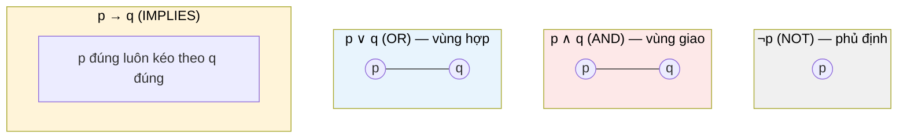
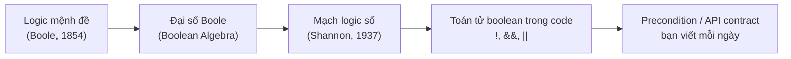

# MASTER COMPUTER SCIENCE HANDBOOK

## Volume 01 — Mathematics for Computer Science
### Part I — Mathematical Thinking
## Chương 1.3 — Logic Mệnh đề và Logic Vị từ
### (Propositional and Predicate Logic)

---

### Thông tin chương

| Trường | Giá trị |
|---|---|
| Chương | 1.3 |
| Thuộc Part | I — Mathematical Thinking |
| Thuộc Volume | 01 — Mathematics for Computer Science |
| Thời gian đọc ước tính | 45–55 phút |
| Độ khó | ★★☆☆☆ |
| Kiến thức tiên quyết | Chương 1.2 — Mathematical Language and Notation |
| Chương liên quan | 1.4 — Proof Techniques (xây dựng trực tiếp trên logic); Volume 2, Part IX — Theory of Computation |
| Từ khóa | proposition, predicate, logical connective, truth table, logical equivalence, De Morgan's laws |

---

### Mục tiêu học tập

Sau khi hoàn thành chương này, người đọc có thể:

- Xây dựng và đọc hiểu bảng chân trị (truth table) cho các phép toán logic cơ bản.
- Phân biệt rõ ràng **logic mệnh đề (propositional logic)** và **logic vị từ (predicate logic)** — và biết khi nào cần dùng loại nào.
- Kết nối trực tiếp các phép toán logic (`¬, ∧, ∨, →, ↔`) với các toán tử boolean quen thuộc trong code (`!, &&, ||`).
- Đơn giản hóa một biểu thức logic bằng các quy tắc tương đương (đặc biệt định luật De Morgan).
- Dịch một precondition/postcondition thực tế của API thành một mệnh đề logic vị từ hình thức.

---

### Câu hỏi khơi gợi

> *Bạn đã bao giờ viết một điều kiện `if` lồng nhau phức tạp, rồi vài tuần sau không còn chắc chắn nó có đúng logic hay không chưa? Điều gì sẽ khác đi nếu bạn có một bộ công cụ để* chứng minh *hai điều kiện phức tạp là tương đương nhau — thay vì chỉ đoán bằng cách đọc lại code?*

---

## 1. Tổng quan chương

Đây là chương đầu tiên của Handbook thực sự "làm toán". Chương 1.1 xây dựng động lực, Chương 1.2 xây dựng khả năng đọc ký hiệu — chương này bắt đầu xây dựng **nội dung**: hệ thống hình thức để lý luận về tính đúng-sai của các phát biểu, gọi là **Logic**.

Tin tốt: bạn đã dùng logic mỗi ngày. Mọi câu lệnh `if`, mọi biểu thức `&&`/`||`, mọi precondition trong hàm bạn viết đều là logic. Điều chương này làm là **hình thức hóa** trực giác đó thành một hệ thống có quy tắc rõ ràng, có thể thao tác, đơn giản hóa, và — quan trọng nhất — có thể *chứng minh* hai biểu thức phức tạp là tương đương nhau mà không cần thử từng trường hợp một cách thủ công.

> **💡 Insight**
> Logic mệnh đề (propositional logic) trả lời câu hỏi "mệnh đề này đúng hay sai?". Logic vị từ (predicate logic) mở rộng nó để trả lời "mệnh đề này đúng hay sai *với những giá trị nào*?" — chính là nơi các lượng từ $\forall, \exists$ học ở Chương 1.2 phát huy tác dụng đầy đủ.

---

## 2. Bối cảnh lịch sử

Logic hình thức, với tư cách một hệ thống toán học hoàn chỉnh, còn trẻ hơn nhiều người tưởng.

| Năm | Nhân vật / Sự kiện | Đóng góp |
|---|---|---|
| ~350 TCN | Aristotle | Tam đoạn luận (syllogism) — hình thức lý luận logic đầu tiên được hệ thống hóa |
| 1854 | George Boole | *"An Investigation of the Laws of Thought"* — biến logic thành đại số (Boolean Algebra), cho phép *tính toán* trên các giá trị đúng/sai giống như tính toán trên số |
| Cuối TK 19 | Gottlob Frege | Phát triển logic vị từ (predicate logic) — bổ sung khả năng biểu đạt "với mọi" và "tồn tại" mà logic mệnh đề của Boole không có |
| 1936 | Alan Turing | Dùng logic hình thức để định nghĩa "tính toán được" — cầu nối trực tiếp giữa chương này và Theory of Computation (Volume 2, Part IX) |

Điều đáng chú ý nhất về mặt kỹ thuật: công trình của **George Boole** — vốn được thiết kế thuần túy như một công cụ triết học để hình thức hóa "quy luật của tư duy" — gần một thế kỷ sau trở thành nền tảng toán học của **mạch logic số (digital logic)**, khi Claude Shannon (người bạn đã gặp ở Chương 1.1) chứng minh rằng đại số Boole có thể mô tả chính xác hành vi của các mạch điện đóng/mở. Nói cách khác: **mọi con chip trong máy tính của bạn đang chạy đại số Boole năm 1854.**

---

## 3. Động lực

Hãy xem một đoạn code kiểm tra điều kiện đăng ký người dùng, khá điển hình trong thực tế:

```python
if (age >= 18 and has_valid_email) or (age >= 13 and has_parental_consent):
    allow_registration()
```

Câu hỏi: điều kiện trên có **tương đương** với điều kiện sau không?

```python
if age >= 13 and (has_valid_email or has_parental_consent) and (age >= 18 or has_parental_consent):
    allow_registration()
```

Nhìn bằng mắt thường, rất khó để chắc chắn — hai biểu thức trông khác hẳn nhau. Đây chính xác là loại câu hỏi mà **logic mệnh đề** trả lời được một cách chắc chắn, không cần đoán: bằng cách liệt kê tất cả tổ hợp giá trị đúng/sai của các biến, hoặc bằng cách áp dụng các quy tắc tương đương đã được chứng minh (Mục 7). Không có bảng chân trị hay quy tắc tương đương, câu trả lời cho câu hỏi trên chỉ là cảm tính; có chúng, câu trả lời là chắc chắn.

---

## 4. Trực giác

**Mô hình tinh thần (Mental Model) của chương này:**

> Logic mệnh đề giống như **đại số học ở cấp 2, nhưng thay vì số, ta tính toán trên hai giá trị duy nhất: Đúng và Sai.** Mọi phép toán logic (`AND`, `OR`, `NOT`) đều có quy tắc tính toán chặt chẽ như phép cộng, phép nhân — chỉ khác "bảng cửu chương" của nó có tên gọi là **bảng chân trị (truth table)**.

Ba trực giác kỹ thuật bạn đã có, giờ được đặt tên chính thức:

| Trực giác bạn đã có | Ký hiệu logic | Toán tử trong code |
|---|---|---|
| "Không phải X" | $\neg p$ (NOT) | `!p` hoặc `not p` |
| "X và Y đều đúng" | $p \wedge q$ (AND) | `p && q` |
| "X hoặc Y đúng (hoặc cả hai)" | $p \vee q$ (OR) | `p \|\| q` |

Có một điểm mà trực giác kỹ thuật của bạn **có thể sai lệch** so với logic hình thức, và cần được lưu ý ngay từ đầu — sẽ được làm rõ đầy đủ ở Mục 6–7.

> **⚠️ Common Mistake**
> Trong ngôn ngữ tự nhiên hằng ngày, "hoặc" (or) đôi khi mang nghĩa loại trừ ("bạn có thể chọn trà *hoặc* cà phê", ý nói không được chọn cả hai). Nhưng trong logic toán học, $p \vee q$ (OR) là phép **hoặc bao gồm (inclusive or)**: nó đúng khi ít nhất một trong hai đúng, *kể cả khi cả hai đều đúng*. Toán tử `||` trong hầu hết ngôn ngữ lập trình cũng theo đúng quy ước này — không phải ngẫu nhiên, mà vì nó được thiết kế dựa trên logic hình thức, không phải ngôn ngữ tự nhiên.

---

## 5. Trực quan hóa khái niệm

**Hình 1.3.1 — Bốn phép toán logic cơ bản, minh họa bằng Venn Diagram**
*(Visual đặc trưng của chương — Chapter Identity)*



| Trường thông tin | Nội dung |
|---|---|
| Mục đích | Cho người đọc một hình ảnh không gian (thay vì chỉ ký hiệu) cho bốn phép toán nền tảng nhất |
| Hướng đọc | Từng ô riêng biệt, không có thứ tự bắt buộc — dùng để tra cứu nhanh |
| Điểm mấu chốt | AND là phần *giao* (khắt khe hơn), OR là phần *hợp* (rộng rãi hơn) — trực giác hình học này sẽ giúp bạn nhớ chiều của bất đẳng thức khi đơn giản hóa biểu thức ở Mục 7 |

---

**Hình 1.3.2 — Từ Logic hình thức đến Boolean Logic trong code**



*Mục đích:* Cho thấy dòng chảy lịch sử liên tục — từ một hệ thống triết học thuần túy (1854) đến dòng code bạn viết hôm nay — không phải hai thế giới tách biệt.

---

## 6. Định nghĩa hình thức

> **📌 Remember — Mệnh đề (Proposition)**
>
> Một **mệnh đề (proposition)** là một phát biểu khai báo (declarative statement) mà ta có thể xác định là **đúng (True)** hoặc **sai (False)** — không thể vừa đúng vừa sai, và không thể "không xác định được".
>
> *Là mệnh đề:* "17 là số nguyên tố" (đúng), "Hà Nội là thủ đô của Thái Lan" (sai).
> *Không phải mệnh đề:* "Hôm nay trời đẹp quá!" (cảm thán, không có giá trị đúng/sai khách quan), "x + 1 = 5" (câu này *chưa* là mệnh đề — vì $x$ chưa được xác định giá trị; nó chỉ trở thành mệnh đề khi $x$ được gán một giá trị cụ thể, hoặc khi được lượng từ hóa — đây chính là động lực cho **logic vị từ**, xem cuối mục này).

**Các phép toán logic (Logical Connectives)** — dùng để kết hợp các mệnh đề đơn giản thành mệnh đề phức tạp hơn:

| Ký hiệu | Tên gọi | Đọc là |
|---|---|---|
| $\neg p$ | Negation (Phủ định) | "không phải p" |
| $p \wedge q$ | Conjunction (Hội) | "p và q" |
| $p \vee q$ | Disjunction (Tuyển) | "p hoặc q" |
| $p \rightarrow q$ | Implication (Kéo theo) | "nếu p thì q" |
| $p \leftrightarrow q$ | Biconditional (Tương đương) | "p khi và chỉ khi q" |

**Vị từ (Predicate)** — một phát biểu chứa một hoặc nhiều biến chưa xác định, sao cho khi các biến đó được gán giá trị cụ thể (hoặc được lượng từ hóa bởi $\forall$/$\exists$ — đã học ở Chương 1.2), phát biểu trở thành một mệnh đề thực sự. Ký hiệu: $P(x)$, đọc là "vị từ $P$ áp dụng lên $x$". Ví dụ: $P(x): \text{"} x \text{ là số nguyên tố"}$ — bản thân $P(x)$ chưa đúng hay sai cho đến khi $x$ có giá trị (ví dụ $P(17)$ là đúng, $P(18)$ là sai).

> **📌 Remember — Logic mệnh đề (Propositional Logic) so với Logic vị từ (Predicate Logic)**
>
> **Logic mệnh đề** chỉ thao tác trên các mệnh đề đã hoàn chỉnh (đúng/sai cố định) — nó không thể biểu đạt "với mọi số nguyên $x$...". **Logic vị từ** mở rộng logic mệnh đề bằng cách thêm biến, vị từ, và lượng từ ($\forall, \exists$), cho phép biểu đạt những phát biểu tổng quát về *cả một tập hợp* giá trị — chính là sức mạnh biểu đạt cần thiết cho hầu hết các định nghĩa và định lý toán học mà bạn sẽ gặp từ Chương 1.4 trở đi.

---

## 7. Nền tảng toán học

### 7.1 Bảng chân trị (Truth Table)

Trước khi xem bảng đầy đủ, hãy xây dựng nó từng bước theo đúng chuẩn Formula Intuition:

- **Ý nghĩa:** ta muốn biết giá trị đúng/sai của một biểu thức logic phức hợp, với *mọi* tổ hợp giá trị có thể của các mệnh đề thành phần.
- **Ký hiệu:** một bảng liệt kê tất cả $2^n$ tổ hợp giá trị (với $n$ mệnh đề thành phần), và giá trị tương ứng của biểu thức.
- **Ví dụ đơn giản:** với 2 mệnh đề $p, q$, có $2^2 = 4$ tổ hợp.

> **📦 Formula Box — Bảng chân trị cho các phép toán cơ bản**
>
> | $p$ | $q$ | $p \wedge q$ | $p \vee q$ | $p \rightarrow q$ | $p \leftrightarrow q$ | $\neg p$ |
> |:---:|:---:|:---:|:---:|:---:|:---:|:---:|
> | Đúng | Đúng | Đúng | Đúng | Đúng | Đúng | Sai |
> | Đúng | Sai | Sai | Đúng | Sai | Sai | Sai |
> | Sai | Đúng | Sai | Đúng | Đúng | Sai | Đúng |
> | Sai | Sai | Sai | Sai | Đúng | Đúng | Đúng |
>
> | Diễn giải kỹ thuật | Ứng dụng thường gặp |
> |---|---|
> | $p \wedge q$ chỉ đúng khi **cả hai** đều đúng (giống `&&`); $p \vee q$ đúng khi **ít nhất một** đúng (giống `\|\|`, xem lại Common Mistake ở Mục 4) | Kiểm tra điều kiện hợp lệ hóa dữ liệu đầu vào; xây dựng WHERE clause trong SQL; thiết kế feature flag |

**Điểm đáng chú ý nhất trong bảng** là cột $p \rightarrow q$ — dòng thứ ba ("Sai, Đúng → Đúng") thường gây bối rối lúc đầu.

> **⚠️ Common Mistake**
> Nhiều người mới học nghĩ rằng nếu $p$ sai, thì $p \rightarrow q$ phải "vô nghĩa" hoặc sai. Thực tế, theo định nghĩa toán học, **$p \rightarrow q$ chỉ sai trong đúng một trường hợp: khi $p$ đúng nhưng $q$ sai** — mọi trường hợp còn lại đều đúng. Trực giác kỹ thuật giúp nhớ điều này: hãy nghĩ $p \rightarrow q$ như một precondition trong code — `if (p) { assert(q); }`. Nếu `p` là `false`, khối lệnh `if` không bao giờ chạy, nên "lời hứa" `assert(q)` không bao giờ bị vi phạm — do đó cả câu lệnh được xem là *đúng theo mặc định* (vacuously true).

### 7.2 Tương đương logic (Logical Equivalence) và Định luật De Morgan

Hai biểu thức logic được gọi là **tương đương logic (logically equivalent)**, ký hiệu $\equiv$, nếu chúng có **cùng bảng chân trị** — đúng/sai giống hệt nhau ở mọi tổ hợp giá trị.

> **📦 Formula Box — Định luật De Morgan (De Morgan's Laws)**
>
> $$\neg(p \wedge q) \equiv (\neg p) \vee (\neg q)$$
> $$\neg(p \vee q) \equiv (\neg p) \wedge (\neg q)$$
>
> | Thành phần | Ý nghĩa |
> |---|---|
> | Quy tắc chung | "Phủ định của AND/OR" = "đảo từng vế, đồng thời đảo AND↔OR" |
> | **Diễn giải kỹ thuật** | Trực tiếp giải thích vì sao `!(a && b)` tương đương `!a \|\| !b` trong mọi ngôn ngữ lập trình — một biến đổi bạn có thể đã dùng để tối ưu điều kiện `if` mà không biết tên gọi chính thức |
> | **Ứng dụng thường gặp** | Đơn giản hóa điều kiện phức tạp; viết lại điều kiện `while` phủ định để thoát vòng lặp sớm |

Kiểm chứng bằng bảng chân trị cho vế đầu tiên (chạy thực tế, không chỉ suy luận bằng tay):

| $p$ | $q$ | $\neg(p \wedge q)$ | $(\neg p) \vee (\neg q)$ | Khớp? |
|:---:|:---:|:---:|:---:|:---:|
| Đúng | Đúng | Sai | Sai | ✓ |
| Đúng | Sai | Đúng | Đúng | ✓ |
| Sai | Đúng | Đúng | Đúng | ✓ |
| Sai | Sai | Đúng | Đúng | ✓ |

Kết quả khớp ở **cả 4 dòng** — đây chính là định nghĩa của tương đương logic: đúng ở *mọi* tổ hợp, không chỉ một vài trường hợp (nhắc lại đúng bài học về "kiểm tra vài trường hợp" khác "chứng minh tổng quát" từ Chương 1.2, Mục 10 — với 4 tổ hợp hữu hạn của 2 biến boolean, kiểm tra hết tất cả chính là một chứng minh đầy đủ, không chỉ là minh chứng thực nghiệm).

---

## 8. Thuật toán / Cơ chế

**Quy trình xây dựng bảng chân trị cho một biểu thức logic bất kỳ:**

```text
Bước 1 — Đếm số mệnh đề thành phần khác nhau (gọi là n)
        │
        ▼
Bước 2 — Liệt kê toàn bộ 2^n tổ hợp giá trị Đúng/Sai có thể
        │
        ▼
Bước 3 — Với mỗi tổ hợp, tính giá trị của các biểu thức con
         theo thứ tự ưu tiên (NOT trước, rồi AND, rồi OR,
         rồi IMPLIES, rồi BICONDITIONAL)
        │
        ▼
Bước 4 — Ghi giá trị cuối cùng của biểu thức đầy đủ
        │
        ▼
Bước 5 — So sánh bảng thu được với bảng của biểu thức khác
         (nếu muốn kiểm tra tương đương logic)
```

**Độ phức tạp:** với $n$ mệnh đề thành phần, bảng chân trị luôn có chính xác $2^n$ dòng — đây là ví dụ đầu tiên trong Handbook về một đại lượng tăng theo hàm mũ (exponential growth). Với $n=2$ chỉ có 4 dòng (dễ dàng làm bằng tay), nhưng với $n=10$ đã có $1024$ dòng — một dấu hiệu sớm cho thấy vì sao **quy tắc tương đương** (như De Morgan) lại quý giá: chúng cho phép đơn giản hóa biểu thức mà không cần liệt kê toàn bộ bảng chân trị khổng lồ.

---

## 9. Triển khai

Hãy triển khai chính quy trình ở Mục 8 bằng code, đồng thời kiểm chứng định luật De Morgan một cách tự động thay vì chỉ nhìn bảng:

```python
import itertools

def truth_table(expr_fn, n_vars, var_names):
    """In bảng chân trị đầy đủ cho một hàm logic expr_fn nhận n_vars biến boolean."""
    header = " ".join(f"{v:>5}" for v in var_names) + " | kết quả"
    print(header)
    for values in itertools.product([True, False], repeat=n_vars):
        result = expr_fn(*values)
        row = " ".join(f"{str(v):>5}" for v in values)
        print(f"{row} | {result}")


def logically_equivalent(expr1, expr2, n_vars):
    """Kiểm tra hai biểu thức có tương đương logic không —
    bằng cách so sánh giá trị ở TẤT CẢ 2^n tổ hợp."""
    for values in itertools.product([True, False], repeat=n_vars):
        if expr1(*values) != expr2(*values):
            return False
    return True


# Kiểm chứng định luật De Morgan: NOT(p AND q) == (NOT p) OR (NOT q)
lhs = lambda p, q: not (p and q)
rhs = lambda p, q: (not p) or (not q)

print("Định luật De Morgan có đúng với mọi tổ hợp p, q?",
      logically_equivalent(lhs, rhs, 2))
```

Chạy đoạn code trên cho kết quả `True` — khớp chính xác với bảng chân trị đã kiểm chứng bằng tay ở Mục 7.2. Hàm `logically_equivalent` chính là bản dịch trực tiếp Bước 5 của quy trình ở Mục 8 thành code.

---

## 10. Trực quan hóa quá trình thực thi

Chạy thực tế hàm `truth_table` cho tất cả 5 phép toán logic cùng lúc, thu được đầy đủ bảng chân trị đã trình bày ở Mục 7.1 — nhưng lần này do máy tính sinh ra, không phải viết tay:

```text
    p     q |  p AND q   p OR q   p -> q  p <-> q  NOT p
----------------------------------------------------------
 True  True |     True     True     True     True  False
 True False |    False     True    False    False  False
False  True |    False     True     True    False   True
False False |    False    False     True     True   True
```

*(Đầu ra thực tế từ chương trình Python ở Mục 9, đối chiếu chính xác từng ô với bảng ở Mục 7.1 — không có sai lệch nào.)*

> **🛠 Engineering Practice**
> Đây chính là kỹ thuật **kiểm thử dựa trên thuộc tính (property-based testing)** ở dạng đơn giản nhất: thay vì viết tay từng test case, ta liệt kê *toàn bộ không gian đầu vào có thể* (khả thi vì domain boolean chỉ có $2^n$ giá trị) và kiểm tra một thuộc tính (ở đây là "tương đương logic") đúng trên toàn bộ không gian đó. Ý tưởng này sẽ quay lại, ở quy mô lớn hơn nhiều, khi Volume 3 giới thiệu kiểm chứng thuật toán và Volume 2 giới thiệu Model Checking.

---

## 11. Ứng dụng công nghiệp

| Bối cảnh công nghiệp | Vai trò của logic mệnh đề/vị từ |
|---|---|
| Validation logic trong API (ví dụ điều kiện đăng ký ở Mục 3) | Đơn giản hóa và kiểm tra tính tương đương của các điều kiện phức tạp bằng De Morgan và bảng chân trị |
| Câu lệnh `WHERE` trong SQL | Về bản chất là một biểu thức logic vị từ — trình tối ưu hóa truy vấn của database (query optimizer) áp dụng các quy tắc tương đương logic (bao gồm De Morgan) để viết lại truy vấn hiệu quả hơn mà không đổi kết quả |
| Feature flag / A-B testing trong hệ thống lớn (Google, Meta, Amazon) | Các điều kiện bật/tắt tính năng thường là biểu thức logic lồng nhau sâu — công cụ đơn giản hóa tự động dựa trên các quy tắc ở Mục 7 giúp giảm lỗi cấu hình |
| Mạch logic số (digital circuit design), CPU | Đại số Boole (Mục 2) là ngôn ngữ thiết kế trực tiếp — mỗi cổng logic vật lý (AND gate, OR gate, NOT gate) tương ứng 1:1 với các ký hiệu học trong chương này |

---

## 12. Góc nhìn nghiên cứu

> **🔬 Research Connection**
> Logic mệnh đề và logic vị từ không chỉ là công cụ nền tảng — chúng là đối tượng nghiên cứu chủ động cho đến ngày nay.

- **George Boole (1854)**, *"An Investigation of the Laws of Thought"* — đặt nền móng cho toàn bộ nội dung Mục 7 của chương này.
- **Bài toán quyết định được (decidability)**: logic mệnh đề có thể *luôn* xác định một biểu thức có thỏa mãn được hay không bằng cách liệt kê bảng chân trị (như Mục 8) — nhưng đây là bài toán có độ phức tạp mũ. Việc tìm ra thuật toán *nhanh hơn* cho bài toán này, gọi là **SAT (Boolean Satisfiability Problem)**, là một trong những bài toán trung tâm của Lý thuyết độ phức tạp tính toán (Computational Complexity Theory) — sẽ được đề cập lại ở Volume 2, Part IX và Volume 3.
- Logic vị từ mở rộng còn là nền tảng của **chứng minh tự động (automated theorem proving)** và **kiểm chứng hình thức (formal verification)** — lĩnh vực nghiên cứu về việc dùng máy tính để tự động chứng minh một chương trình phần mềm hoặc một mạch phần cứng thỏa mãn đặc tả của nó, không có lỗi logic nào bị bỏ sót.

**Câu hỏi mở** để suy ngẫm: nếu SAT — bài toán tưởng chừng đơn giản chỉ về "đúng/sai" — vẫn là bài toán mở về mặt độ phức tạp tính toán, điều đó nói lên điều gì về giới hạn của việc dùng logic hình thức để *tự động* xác minh tính đúng đắn của phần mềm ở quy mô lớn?

---

## 13. Ưu điểm

- **Loại bỏ hoàn toàn sự mơ hồ** trong việc phát biểu điều kiện — không còn tranh cãi về ý nghĩa của một quy tắc nghiệp vụ phức tạp.
- **Cho phép đơn giản hóa có chứng minh** — dùng De Morgan và các quy tắc tương đương khác, thay vì đoán mò hoặc thử-sai.
- **Nền tảng trực tiếp cho code** — mọi ngôn ngữ lập trình hiện đại triển khai chính xác đại số Boole, nên kỹ năng này chuyển giao 1:1 sang công việc lập trình hằng ngày.
- **Mở đường cho chứng minh toán học** — Chương 1.4 (Proof Techniques) không thể tồn tại nếu không có nền tảng logic của chương này.

---

## 14. Hạn chế

- **Logic mệnh đề không đủ mạnh để biểu đạt các phát biểu tổng quát** (ví dụ "mọi số nguyên tố lớn hơn 2 đều là số lẻ") — đây chính là lý do logic vị từ (Mục 6) là cần thiết, không phải tùy chọn.
- **Giả định lưỡng trị (bivalence)** — logic cổ điển được trình bày trong chương này giả định mọi mệnh đề chỉ có đúng hai giá trị: Đúng hoặc Sai, không có "một phần đúng" hay "chưa biết". Có những hệ thống logic khác (fuzzy logic, logic ba giá trị) nới lỏng giả định này cho các bài toán như hệ chuyên gia hoặc dữ liệu không chắc chắn — nằm ngoài phạm vi Volume 1, nhưng đáng biết đến sự tồn tại của chúng.
- **Bài toán SAT có độ phức tạp mũ trong trường hợp tổng quát** (Mục 12) — nghĩa là với biểu thức đủ lớn và đủ phức tạp, việc kiểm tra tính thỏa mãn được bằng bảng chân trị đầy đủ trở nên bất khả thi về mặt tính toán; cần các thuật toán chuyên biệt hơn (nằm ngoài phạm vi chương này).

---

## 15. So sánh

**Bảng 1.3.1 — Logic mệnh đề so với Logic vị từ**

| Tiêu chí | Logic mệnh đề (Propositional) | Logic vị từ (Predicate) |
|---|---|---|
| Đơn vị cơ bản | Mệnh đề hoàn chỉnh (đúng/sai cố định) | Vị từ chứa biến chưa xác định |
| Khả năng biểu đạt "với mọi/tồn tại" | Không có | Có, qua $\forall, \exists$ |
| Ví dụ điển hình | "17 là số nguyên tố" | "$\forall x \in \mathbb{N}, x^2 \geq 0$" |
| Độ phức tạp kiểm tra | Hữu hạn ($2^n$ tổ hợp — Mục 8) | Có thể vô hạn (miền của biến có thể vô hạn) |
| Vai trò trong Handbook | Nền tảng của chương này | Mở rộng — dùng xuyên suốt từ Chương 1.4 trở đi |

**Phân tích:** Sự khác biệt cốt lõi nằm ở dòng "Độ phức tạp kiểm tra": logic mệnh đề luôn có thể kiểm tra triệt để bằng bảng chân trị hữu hạn (dù có thể tốn thời gian mũ), nhưng logic vị từ khi lượng từ hóa trên một miền vô hạn (ví dụ toàn bộ tập số tự nhiên $\mathbb{N}$) thì *không thể* liệt kê hết mọi trường hợp — đây chính xác là lý do Chương 1.4 phải giới thiệu **phương pháp chứng minh (proof techniques)** thay vì chỉ tiếp tục dùng bảng chân trị.

---

## 16. Tóm tắt

- Một **mệnh đề** là một phát biểu có giá trị đúng/sai xác định; các **phép toán logic** ($\neg, \wedge, \vee, \rightarrow, \leftrightarrow$) kết hợp chúng thành mệnh đề phức tạp hơn, với ngữ nghĩa được định nghĩa chính xác bằng **bảng chân trị**.
- $p \rightarrow q$ chỉ sai khi $p$ đúng và $q$ sai — mọi trường hợp khác đều đúng (kể cả khi $p$ sai), một điểm dễ gây nhầm lẫn nhưng có analogy trực tiếp với `if/assert` trong code.
- Hai biểu thức **tương đương logic** khi có cùng bảng chân trị ở mọi tổ hợp; **định luật De Morgan** là công cụ đơn giản hóa quan trọng nhất được học trong chương này, và trực tiếp giải thích hành vi của `!(a && b)` trong mọi ngôn ngữ lập trình.
- **Logic vị từ** mở rộng logic mệnh đề bằng biến, vị từ, và lượng từ — cần thiết để biểu đạt các phát biểu tổng quát, và không thể kiểm tra triệt để bằng bảng chân trị khi miền của biến là vô hạn.

Chương 1.4 sẽ giải quyết chính xác vấn đề "miền vô hạn" này: học cách **chứng minh** một phát biểu vị từ đúng với mọi giá trị trong một miền vô hạn, mà không cần (và không thể) liệt kê từng trường hợp.

---

## 17. Bài tập

### Mức Cơ bản (Basic)

1. Vẽ bảng chân trị đầy đủ cho biểu thức $(p \wedge \neg q) \vee r$ (3 mệnh đề thành phần, do đó 8 dòng).
2. Cho $p$ = "hôm nay trời mưa" (Đúng) và $q$ = "tôi mang ô" (Sai). Xác định giá trị đúng/sai của $p \rightarrow q$, và giải thích bằng lời tại sao (đối chiếu lại analogy `if/assert` ở Mục 7.1).
3. Viết lại điều kiện code sau bằng ký hiệu logic hình thức: `if (not is_admin) and (has_permission or is_owner):`.

### Mức Trung bình (Intermediate)

4. Dùng định luật De Morgan, đơn giản hóa biểu thức $\neg(\neg p \vee q)$ về dạng không còn phủ định của một biểu thức phức hợp (chỉ còn phủ định của các biến đơn lẻ, nếu có).
5. Quay lại hai đoạn code ở Mục 3 (điều kiện đăng ký người dùng). Hãy tự viết một bảng chân trị (hoặc dùng code từ Mục 9) với 4 biến (`age>=18`, `has_valid_email`, `age>=13`, `has_parental_consent` — coi mỗi biểu thức so sánh là một biến boolean độc lập) để xác định hai điều kiện đó có thực sự tương đương logic hay không.

### Mức Nâng cao (Advanced)

6. Một API có precondition sau, viết bằng ngôn ngữ tự nhiên: *"Yêu cầu chỉ được xử lý nếu người dùng đã đăng nhập, VÀ (người dùng là admin HOẶC người dùng sở hữu tài nguyên đang truy cập), NHƯNG KHÔNG được xử lý nếu tài khoản đang bị khóa, bất kể các điều kiện trên."* Hãy dịch precondition này thành một biểu thức logic vị từ hình thức, đặt tên rõ ràng cho từng vị từ thành phần (ví dụ $L(u)$: "$u$ đã đăng nhập").

---

## 18. Dự án nhỏ

**Dự án: "Logical Expression Simplifier" — Bộ kiểm tra tương đương logic**

- **Mục tiêu:** Xây dựng một script Python nhận vào hai biểu thức logic (dưới dạng hàm Python nhận các biến boolean), tự động xác định chúng có tương đương logic hay không, và nếu không, chỉ ra tổ hợp giá trị đầu tiên khiến chúng khác nhau ("counterexample").
- **Yêu cầu:**
  - Hàm `logically_equivalent(expr1, expr2, n_vars)` (đã có nền tảng ở Mục 9) — mở rộng để, khi trả về `False`, in ra tổ hợp giá trị cụ thể gây khác biệt.
  - Áp dụng chương trình để kiểm tra ít nhất 3 cặp biểu thức: (a) một cặp tương đương theo De Morgan, (b) hai đoạn code điều kiện đăng ký ở Mục 3, (c) một cặp do chính bạn tự nghĩ ra và dự đoán trước kết quả.
- **Công cụ đề xuất:** Python thuần (`itertools.product`), không cần thư viện ngoài.
- **Kết quả kỳ vọng:** Một công cụ dòng lệnh nhỏ, có thể tái sử dụng để kiểm tra bất kỳ cặp điều kiện phức tạp nào trong công việc thực tế sau này.
- **Hướng mở rộng:** Thử mở rộng chương trình để tự động liệt kê *toàn bộ* các tổ hợp gây khác biệt (không chỉ tổ hợp đầu tiên), hoặc thử áp dụng lên một biểu thức có 4–5 biến để cảm nhận trực tiếp độ phức tạp mũ đã đề cập ở Mục 8.

---

## 19. Tự đánh giá

- [ ] Tôi có thể tự vẽ bảng chân trị cho một biểu thức có tối đa 3 mệnh đề thành phần mà không cần xem lại Mục 7.
- [ ] Tôi hiểu và có thể giải thích bằng lời của mình vì sao $p \rightarrow q$ đúng khi $p$ sai (dòng gây bối rối nhất trong bảng chân trị).
- [ ] Tôi có thể áp dụng định luật De Morgan để đơn giản hóa một biểu thức phủ định phức hợp.
- [ ] Tôi có thể giải thích, bằng ví dụ cụ thể, vì sao logic mệnh đề không đủ để biểu đạt "mọi số nguyên tố lớn hơn 2 đều là số lẻ" — và vì sao logic vị từ giải quyết được vấn đề đó.
- [ ] Tôi đã hoàn thành Dự án nhỏ ở Mục 18, hoặc ít nhất đã tự chạy thử code kiểm tra De Morgan ở Mục 9.

Nếu chưa tự tin ở dòng $p \rightarrow q$, hãy quay lại phần Common Mistake ở Mục 7.1 trước khi sang Chương 1.4 — toàn bộ khái niệm chứng minh bằng phản chứng (proof by contradiction) ở chương tiếp theo dựa trực tiếp vào việc hiểu đúng phép kéo theo này.

---

## 20. Đọc thêm

- **Sách:** *(khuyến nghị bổ sung vào BOOKS.md — hiện Volume 1 chưa có tài liệu chính thức cho Discrete Mathematics)* Kenneth Rosen, *Discrete Mathematics and Its Applications* — chương mở đầu về Logic là tài liệu tham khảo chuẩn cho toàn bộ nội dung chương này.
- **Bài báo lịch sử:** George Boole (1854), *"An Investigation of the Laws of Thought"* — văn bản gốc đặt nền móng cho Mục 7 của chương. *(Xem SCIENTISTS.md — mục George Boole cần được bổ sung nếu chưa có.)*
- **Chương tiếp theo:** Chương 1.4 — Proof Techniques.

---

### Liên kết chương (Cross References)

- **Chương trước:** 1.2 — Mathematical Language and Notation (dùng trực tiếp ký hiệu $\forall, \exists$ đã học).
- **Chương tiếp theo:** 1.4 — Proof Techniques (dùng trực tiếp phép kéo theo $\rightarrow$ và các quy tắc tương đương học ở đây).
- **Chương liên quan xa hơn:** Volume 2, Part IX — Theory of Computation (logic hình thức là ngôn ngữ định nghĩa automata); Volume 3 — SAT và độ phức tạp tính toán (Mục 12).
- **Vị trí trong Knowledge Graph:** Nút thứ ba của Volume 1, phụ thuộc trực tiếp vào Chương 1.2; là điều kiện tiên quyết bắt buộc cho toàn bộ Chương 1.4–1.6.

---

*Hết Chương 1.3. Chương này tuân thủ đầy đủ cấu trúc 20 mục của `OUTPUT.md`, áp dụng chuẩn Presentation Layer (callout box, Formula Box, chapter identity visual) ngay từ bản đầu tiên, và khớp với đặc tả outline đã đóng băng cho Chương 1.3 (bảng chân trị, đơn giản hóa biểu thức, dịch API contract, dự án "Logical Expression Simplifier"). Mọi bảng chân trị và kết quả kiểm chứng De Morgan trong chương đều được chạy thực tế bằng Python, không suy luận thủ công. Đang chờ rà soát trước khi tiếp tục sang Chương 1.4.*
