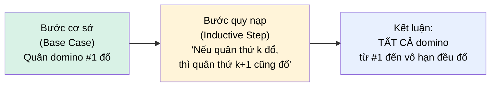
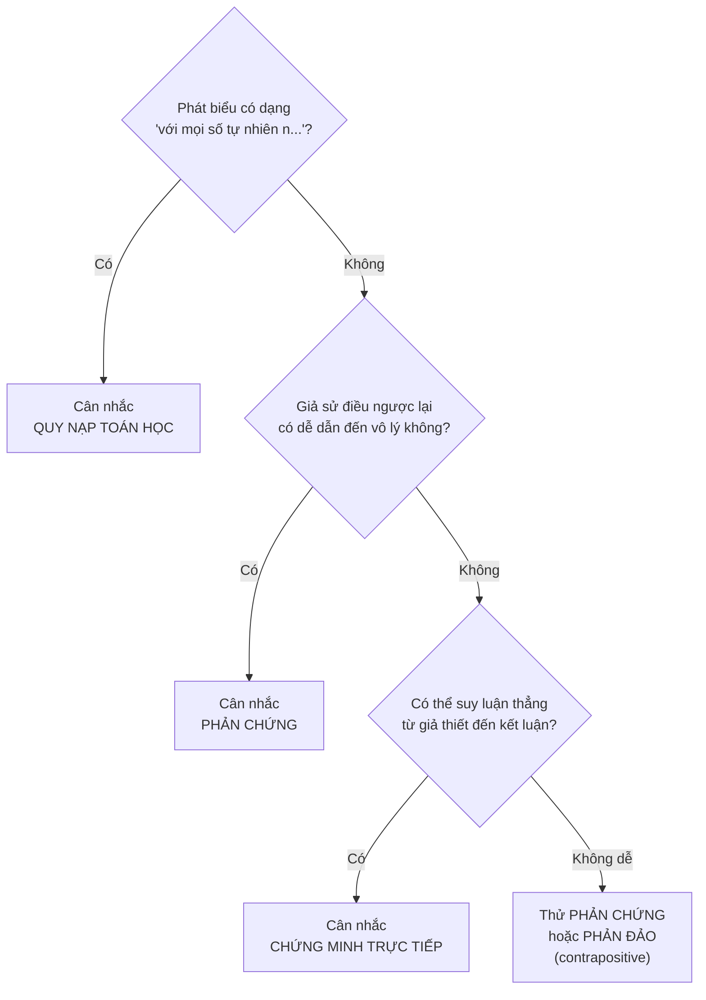

# MASTER COMPUTER SCIENCE HANDBOOK

## Volume 01 — Mathematics for Computer Science
### Part I — Mathematical Thinking
## Chương 1.4 — Kỹ thuật Chứng minh
### (Proof Techniques)

---

### Thông tin chương

| Trường | Giá trị |
|---|---|
| Chương | 1.4 |
| Thuộc Part | I — Mathematical Thinking |
| Thuộc Volume | 01 — Mathematics for Computer Science |
| Thời gian đọc ước tính | 50–60 phút |
| Độ khó | ★★☆☆☆ |
| Kiến thức tiên quyết | Chương 1.3 — Propositional and Predicate Logic |
| Chương liên quan | 2.5 — Recurrence Relations (dùng trực tiếp quy nạp); Volume 3, Part I — Proof of Correctness |
| Từ khóa | direct proof, contrapositive, proof by contradiction, mathematical induction, strong induction |

---

### Mục tiêu học tập

Sau khi hoàn thành chương này, người đọc có thể:

- Xây dựng một **chứng minh trực tiếp (direct proof)** cho một phát biểu vị từ đơn giản.
- Xây dựng một **chứng minh bằng phản chứng (proof by contradiction)**, và giải thích được vì sao nó hoạt động.
- Xây dựng một **chứng minh bằng quy nạp toán học (mathematical induction)**, phân biệt rõ bước cơ sở (base case) và bước quy nạp (inductive step).
- Nhận biết được **loại chứng minh nào phù hợp** với từng dạng phát biểu.
- Giải thích được vì sao "kiểm tra đúng ở nhiều trường hợp" **không phải** là một chứng minh.

---

### Câu hỏi khơi gợi

> *Ở Chương 1.2, chúng ta đã kiểm tra công thức $\sum_{i=1}^{n} i^2 = \frac{n(n+1)(2n+1)}{6}$ đúng với $n = 5, 10, 100, 1000$. Điều đó có nghĩa công thức đúng với* mọi *n hay không? Nếu có một giá trị $n$ nào đó, dù rất lớn, mà công thức sai — làm sao bạn biết chắc điều đó không xảy ra, khi bạn không thể kiểm tra hết vô hạn giá trị?*

---

## 1. Tổng quan chương

Chương 1.3 trang bị cho bạn công cụ để lý luận về tính đúng-sai của các mệnh đề đơn lẻ. Nhưng có một khoảng trống lớn mà logic mệnh đề, tự nó, không thể lấp đầy: khi một phát biểu vị từ được lượng từ hóa trên một **miền vô hạn** — ví dụ "$\forall n \in \mathbb{N}$, công thức X đúng" — thì bảng chân trị (vốn chỉ hoạt động với hữu hạn tổ hợp) hoàn toàn bất lực. Bạn không thể liệt kê vô hạn dòng.

Chương này lấp đầy khoảng trống đó bằng ba kỹ thuật chứng minh nền tảng: **chứng minh trực tiếp**, **chứng minh bằng phản chứng**, và — quan trọng nhất đối với một nhà khoa học máy tính — **chứng minh bằng quy nạp toán học**. Đây là chương có tính "kỹ năng" cao nhất trong Part I: không có công thức nào để ghi nhớ, chỉ có một *cách tư duy* cần luyện tập cho đến khi trở thành phản xạ.

> **💡 Insight**
> Nếu Chương 1.3 dạy bạn "ngữ pháp" của logic, thì chương này dạy bạn cách "viết văn" bằng ngữ pháp đó — cách sắp xếp các mệnh đề đã học thành một chuỗi lý luận thuyết phục, dẫn từ giả thiết đến kết luận, không có kẽ hở nào.

---

## 2. Bối cảnh lịch sử

Chứng minh toán học, với tư cách một chuẩn mực nghiêm ngặt, già hơn nhiều so với logic hình thức của Boole (Chương 1.3).

| Thời điểm | Nhân vật / Sự kiện | Đóng góp |
|---|---|---|
| ~300 TCN | Euclid, *Elements* | Chứng minh có tồn tại vô hạn số nguyên tố — vẫn được xem là một trong những ví dụ đẹp nhất của **chứng minh bằng phản chứng** cho đến ngày nay |
| Thế kỷ 17 | Blaise Pascal | Sử dụng có hệ thống nguyên lý tương tự quy nạp toán học trong *Traité du triangle arithmétique* |
| 1889 | Giuseppe Peano | Hình thức hóa **nguyên lý quy nạp toán học** thành một trong các tiên đề nền tảng định nghĩa tập số tự nhiên (Peano Axioms) — biến quy nạp từ một "mẹo" thành một quy tắc suy luận có nền tảng logic chặt chẽ |
| 1931 | Kurt Gödel | Định lý Bất toàn (Incompleteness Theorems) — chứng minh rằng trong bất kỳ hệ thống hình thức đủ mạnh nào, luôn tồn tại những phát biểu đúng nhưng **không thể chứng minh được** bên trong hệ thống đó (xem lại Volume 1, Chương 1.1, Mục 2) |

Điều đáng chú ý: chứng minh của Euclid về số nguyên tố vô hạn, gần **2300 năm tuổi**, vẫn được dạy nguyên vẹn trong các giáo trình đại học hiện đại — không phải vì thiếu chứng minh khác, mà vì nó là một mẫu mực gần như hoàn hảo về sự thanh lịch (elegance) trong lý luận. Bạn sẽ thấy lại chính chứng minh này ở Mục 7 làm ví dụ trung tâm cho phản chứng.

---

## 3. Động lực

Quay lại câu hỏi khơi gợi đầu chương: chúng ta đã kiểm tra công thức tổng bình phương với 4 giá trị $n$ cụ thể ở Chương 1.2. Đây là một tình huống cực kỳ phổ biến trong công việc kỹ thuật hằng ngày — và cũng là một cái bẫy tư duy nguy hiểm.

Hãy xem một ví dụ khác, nơi "kiểm tra nhiều trường hợp" dẫn đến kết luận **sai**: xét công thức $f(n) = n^2 - n + 41$. Thử với $n = 1, 2, 3, \dots, 40$ — bạn sẽ thấy $f(n)$ luôn là số nguyên tố ở **cả 40 giá trị đầu tiên**. Một kỹ sư theo trực giác thực nghiệm thuần túy có thể kết luận: "chắc chắn $f(n)$ luôn là số nguyên tố". Nhưng thử $n = 41$: $f(41) = 41^2 - 41 + 41 = 41^2 = 1681 = 41 \times 41$ — **không phải số nguyên tố**. 40 trường hợp đúng liên tiếp, và kết luận vẫn sai.

> **⚠️ Common Mistake**
> "Đúng ở nhiều trường hợp đã thử" và "đúng ở mọi trường hợp" là hai điều hoàn toàn khác nhau — sự nhầm lẫn giữa chúng là một trong những lỗi tư duy phổ biến và nguy hiểm nhất khi chuyển từ tư duy kỹ sư (thực nghiệm) sang tư duy nhà khoa học (chứng minh). Ví dụ $f(n) = n^2 - n + 41$ ở trên (một ví dụ kinh điển, do Euler đưa ra) cho thấy: dù 40 trường hợp đầu tiên đều đúng, phát biểu tổng quát vẫn có thể sai ngay ở trường hợp thứ 41.

Đây chính là động lực cốt lõi của chương này: chúng ta cần những công cụ cho phép khẳng định một điều gì đó đúng với **mọi** $n$, bằng một lập luận hữu hạn — không phải bằng cách kiểm tra từng $n$ một.

---

## 4. Trực giác

Mỗi kỹ thuật chứng minh trong chương này có một mô hình tinh thần riêng biệt, dễ nhớ:

> **Chứng minh trực tiếp (Direct Proof)** → Xây một cây cầu, từng nhịp một, nối chắc chắn bờ này (giả thiết) sang bờ kia (kết luận).
>
> **Chứng minh bằng phản chứng (Proof by Contradiction)** → Giả sử điều ngược lại với điều bạn muốn chứng minh là đúng, rồi đi theo con đường đó cho đến khi gặp một bức tường vô lý rõ ràng (ví dụ $1 = 2$) — sự vô lý đó chứng tỏ giả định ban đầu (điều ngược lại) phải sai, nên điều bạn muốn chứng minh phải đúng.
>
> **Quy nạp toán học (Mathematical Induction)** → Hiệu ứng domino. Nếu bạn chứng minh được **quân domino đầu tiên đổ** (bước cơ sở), và chứng minh được **bất kỳ quân domino nào đổ thì quân kế tiếp cũng đổ** (bước quy nạp), thì bạn biết chắc chắn **toàn bộ hàng domino vô hạn sẽ đổ** — mà không cần đẩy từng quân một.

Ba mô hình này sẽ được minh họa trực quan ở Mục 5, và mỗi mô hình sẽ được áp dụng cụ thể vào một ví dụ thật ở Mục 7.

---

## 5. Trực quan hóa khái niệm

**Hình 1.4.1 — Hiệu ứng Domino: Trực giác của Quy nạp toán học**
*(Visual đặc trưng của chương — Chapter Identity)*



| Trường thông tin | Nội dung |
|---|---|
| Mục đích | Biến hai bước trừu tượng (base case, inductive step) thành một hình ảnh vật lý quen thuộc |
| Điểm mấu chốt | Bước quy nạp **không** chứng minh quân thứ $k+1$ đổ một cách trực tiếp — nó chỉ chứng minh *quan hệ kéo theo* "nếu k đổ thì k+1 đổ", đúng với **mọi** $k$. Chính $\rightarrow$ (implication) học ở Chương 1.3 là "trái tim" của bước này |

---

**Hình 1.4.2 — Sơ đồ chọn kỹ thuật chứng minh**



*Mục đích:* Đây không phải một thuật toán cứng nhắc — nhiều phát biểu có thể chứng minh bằng nhiều cách — nhưng nó cho một điểm khởi đầu hợp lý khi bạn chưa biết bắt đầu từ đâu.

---

## 6. Định nghĩa hình thức

> **📌 Remember — Chứng minh trực tiếp (Direct Proof)**
>
> Để chứng minh $p \rightarrow q$ bằng phương pháp trực tiếp: giả sử $p$ đúng, sau đó dùng các định nghĩa, tiên đề, và các kết quả đã biết để suy luận từng bước cho đến khi đạt được $q$. Đây là kỹ thuật đơn giản nhất, và nên được thử trước tiên khi có thể.

> **📌 Remember — Phản đảo (Contrapositive)**
>
> Phản đảo của $p \rightarrow q$ là $\neg q \rightarrow \neg p$. Hai phát biểu này **tương đương logic** (bạn có thể tự kiểm chứng bằng bảng chân trị, dùng đúng kỹ thuật học ở Chương 1.3, Mục 7.2). Do đó, đôi khi chứng minh $\neg q \rightarrow \neg p$ dễ hơn chứng minh trực tiếp $p \rightarrow q$ — đây gọi là **chứng minh bằng phản đảo**.
>
> *Lưu ý phân biệt:* phản đảo ($\neg q \rightarrow \neg p$, tương đương với mệnh đề gốc) khác với **đảo (converse)** $q \rightarrow p$ (KHÔNG tương đương logic với mệnh đề gốc — một lỗi phổ biến khi mới học).

> **📌 Remember — Chứng minh bằng phản chứng (Proof by Contradiction)**
>
> Để chứng minh một phát biểu $S$ là đúng: giả sử $\neg S$ (phủ định của $S$) là đúng, sau đó suy luận từ giả định đó cho đến khi đạt được một **mâu thuẫn logic** (ví dụ suy ra được cả $r$ và $\neg r$ cùng đúng, hoặc một điều hiển nhiên sai như $1 = 2$). Vì một hệ thống logic nhất quán không thể chứa mâu thuẫn, giả định $\neg S$ phải sai — do đó $S$ phải đúng.

> **📌 Remember — Quy nạp toán học (Mathematical Induction)**
>
> Để chứng minh một phát biểu vị từ $P(n)$ đúng với **mọi** số tự nhiên $n \geq n_0$:
> 1. **Bước cơ sở (Base Case):** chứng minh $P(n_0)$ đúng (thường $n_0 = 0$ hoặc $n_0 = 1$).
> 2. **Bước quy nạp (Inductive Step):** chứng minh rằng, với mọi $k \geq n_0$, nếu $P(k)$ đúng (gọi là **giả thiết quy nạp** — Induction Hypothesis) thì $P(k+1)$ cũng đúng.
>
> Nếu cả hai bước đều được chứng minh, ta kết luận $P(n)$ đúng với **mọi** $n \geq n_0$ — theo đúng hiệu ứng domino ở Mục 4–5.

**Quy nạp mạnh (Strong Induction)** — một biến thể, trong đó bước quy nạp được phép giả sử $P(n_0), P(n_0+1), \dots, P(k)$ **đều** đúng (không chỉ riêng $P(k)$) để chứng minh $P(k+1)$. Về mặt logic, quy nạp mạnh và quy nạp thông thường tương đương nhau, nhưng quy nạp mạnh đôi khi thuận tiện hơn khi bước quy nạp cần "nhìn lại" nhiều hơn một bước trước đó (sẽ gặp lại khi chứng minh tính đúng đắn của một số thuật toán đệ quy ở Volume 3).

---

## 7. Nền tảng toán học

### 7.1 Ví dụ đầy đủ: Chứng minh bằng phản chứng — Vô hạn số nguyên tố (Euclid)

**Phát biểu cần chứng minh:** Tồn tại vô hạn số nguyên tố.

**Chứng minh (theo Euclid, ~300 TCN):**

Giả sử ngược lại — chỉ có **hữu hạn** số nguyên tố: $p_1, p_2, \dots, p_k$.

Xét số $N = (p_1 \times p_2 \times \dots \times p_k) + 1$.

Với mọi $p_i$ trong danh sách, khi chia $N$ cho $p_i$, ta luôn dư $1$ (vì $N$ được xây dựng bằng cách nhân tất cả $p_i$ rồi cộng thêm 1) — do đó **không có $p_i$ nào trong danh sách chia hết $N$**.

Nhưng theo Định lý cơ bản của Số học, mọi số nguyên lớn hơn 1 đều có ít nhất một ước số nguyên tố. Vậy $N$ phải có một ước số nguyên tố — nhưng ước số đó **không thể** nằm trong danh sách $p_1, \dots, p_k$ (đã chứng minh ở trên). Điều này mâu thuẫn với giả định ban đầu rằng $p_1, \dots, p_k$ là **toàn bộ** các số nguyên tố tồn tại.

Mâu thuẫn này chứng tỏ giả định "chỉ có hữu hạn số nguyên tố" là sai. Vậy tồn tại vô hạn số nguyên tố. **∎** *(ký hiệu kết thúc chứng minh, quen thuộc trong tài liệu toán học — Q.E.D.)*

> **💡 Insight**
> Chú ý cấu trúc: chứng minh không hề "tìm ra" một số nguyên tố mới cụ thể nào — nó chỉ chứng minh rằng **bất kỳ danh sách hữu hạn nào cũng không thể là toàn bộ danh sách số nguyên tố**. Đây là sức mạnh đặc trưng của phản chứng: chứng minh một điều tồn tại (hoặc không tồn tại) mà không cần xây dựng nó một cách tường minh.

### 7.2 Ví dụ đầy đủ: Quy nạp toán học — Tổng n số lẻ đầu tiên

**Phát biểu cần chứng minh:** Với mọi số nguyên dương $n$: $\displaystyle\sum_{k=1}^{n} (2k - 1) = n^2$.

*(Nói cách khác: $1 + 3 + 5 + \dots + (2n-1) = n^2$ — tổng của $n$ số lẻ dương đầu tiên luôn là một số chính phương.)*

> **📦 Formula Box — Nguyên lý Quy nạp Toán học áp dụng cho ví dụ này**
>
> $$P(n): \sum_{k=1}^{n} (2k-1) = n^2$$
>
> | Bước | Nội dung |
> |---|---|
> | **Bước cơ sở** ($n=1$) | Vế trái: $\sum_{k=1}^{1}(2k-1) = 2(1)-1 = 1$. Vế phải: $1^2 = 1$. Hai vế bằng nhau → $P(1)$ đúng. |
> | **Giả thiết quy nạp** | Giả sử $P(k)$ đúng với một số nguyên dương $k$ bất kỳ, tức là $\sum_{i=1}^{k}(2i-1) = k^2$. |
> | **Bước quy nạp** | Cần chứng minh $P(k+1)$ đúng, tức là $\sum_{i=1}^{k+1}(2i-1) = (k+1)^2$. |
> | **Diễn giải kỹ thuật** | Bước quy nạp không chứng minh lại từ đầu — nó *tận dụng* giả thiết quy nạp đã có, chỉ cần xử lý số hạng mới thêm vào |

**Chi tiết bước quy nạp:**

$$\sum_{i=1}^{k+1}(2i-1) = \underbrace{\sum_{i=1}^{k}(2i-1)}_{\text{theo giả thiết quy nạp} = k^2} + \, (2(k+1)-1) = k^2 + 2k + 1 = (k+1)^2$$

Vế phải cuối cùng, $(k+1)^2$, chính xác là điều $P(k+1)$ yêu cầu. Vậy bước quy nạp hoàn tất.

Vì cả bước cơ sở và bước quy nạp đều đã được chứng minh, theo nguyên lý quy nạp toán học, $P(n)$ đúng với **mọi** số nguyên dương $n$. **∎**

> **⚠️ Common Mistake**
> Lỗi phổ biến nhất khi viết chứng minh quy nạp: **quên hoặc làm hời hợt bước cơ sở**, chỉ tập trung vào bước quy nạp. Nhưng thiếu bước cơ sở, "hiệu ứng domino" không bao giờ *bắt đầu* — bước quy nạp chỉ chứng minh một chuỗi kéo theo ("nếu k thì k+1"), nó không tự chứng minh quân domino đầu tiên đổ. Một chuỗi kéo theo đúng nhưng không có điểm khởi đầu không chứng minh được gì cả.

---

## 8. Thuật toán / Cơ chế

**Khuôn mẫu (template) chuẩn để viết một chứng minh quy nạp** — áp dụng được cho hầu hết các trường hợp:

```text
Bước 1 — Phát biểu rõ ràng P(n) là gì (mệnh đề cần chứng minh, phụ thuộc n)
        │
        ▼
Bước 2 — BƯỚC CƠ SỞ: chứng minh P(n₀) đúng (thường n₀ = 0 hoặc 1)
         bằng cách thay trực tiếp và tính toán
        │
        ▼
Bước 3 — Phát biểu GIẢ THIẾT QUY NẠP: "Giả sử P(k) đúng với
         một k ≥ n₀ bất kỳ"
        │
        ▼
Bước 4 — BƯỚC QUY NẠP: xuất phát từ P(k+1), TÁCH riêng phần
         đã có trong P(k), rồi ÁP DỤNG giả thiết quy nạp
         để thay thế phần đó
        │
        ▼
Bước 5 — Rút gọn đại số cho đến khi thu được đúng vế phải
         mà P(k+1) yêu cầu
        │
        ▼
Bước 6 — Kết luận: theo nguyên lý quy nạp, P(n) đúng với
         mọi n ≥ n₀. Kết thúc bằng ∎
```

Đối chiếu template này với ví dụ ở Mục 7.2: Bước 1 = phát biểu $P(n)$; Bước 2 = tính $P(1)$; Bước 3 = giả sử $P(k)$; Bước 4–5 = phần "Chi tiết bước quy nạp"; Bước 6 = câu kết luận cuối cùng.

---

## 9. Triển khai

Trước khi viết một chứng minh hình thức, việc **kiểm tra thực nghiệm trên nhiều giá trị** vẫn là một bước thực hành tốt — nó giúp phát hiện sớm nếu phát biểu sai (như ví dụ $f(n) = n^2-n+41$ ở Mục 3), tránh lãng phí công sức chứng minh một điều sai. Đây không phải chứng minh, mà là một "phép thử sàng lọc" trước khi đầu tư công sức chứng minh hình thức.

```python
def sum_first_n_odds(n):
    """Tính tổng n số lẻ dương đầu tiên bằng vòng lặp trực tiếp."""
    total = 0
    for k in range(1, n + 1):
        odd = 2 * k - 1
        total += odd
    return total


def check_claim(n):
    """Kiểm tra thực nghiệm: tổng n số lẻ đầu có bằng n^2 không."""
    return sum_first_n_odds(n) == n ** 2
```

Đoạn code này **không phải** một chứng minh — nó chỉ có thể kiểm tra một tập hữu hạn giá trị $n$ mà ta chọn để thử, đúng như đã cảnh báo ở Mục 3. Vai trò của nó trong quy trình làm việc thực tế là: chạy nhanh trên nhiều giá trị để có niềm tin ban đầu rằng phát biểu *có thể* đúng, trước khi bỏ công sức viết chứng minh hình thức đầy đủ như ở Mục 7.2.

---

## 10. Trực quan hóa quá trình thực thi

Chạy `check_claim` cho một dải giá trị rộng — kể cả một giá trị $n$ khá lớn:

| $n$ | Tổng $n$ số lẻ đầu | $n^2$ | Khớp? |
|---:|---:|---:|---:|
| 1 | 1 | 1 | ✓ |
| 2 | 4 | 4 | ✓ |
| 3 | 9 | 9 | ✓ |
| 5 | 25 | 25 | ✓ |
| 10 | 100 | 100 | ✓ |
| 50 | 2.500 | 2.500 | ✓ |
| 100 | 10.000 | 10.000 | ✓ |
| 1.000 | 1.000.000 | 1.000.000 | ✓ |
| 10.000 | 100.000.000 | 100.000.000 | ✓ |

*(Số liệu tính toán thực tế — khớp ở mọi giá trị đã thử.)*

> **⚠️ Common Mistake**
> Chín giá trị khớp liên tiếp, kể cả một giá trị lớn như $n=10.000$, **vẫn không phải là một chứng minh** — đây chính xác là bài học từ ví dụ $f(n) = n^2-n+41$ ở Mục 3 (đúng liên tiếp 40 lần, sai ở lần thứ 41). Sự khác biệt duy nhất giữa "có niềm tin mạnh" và "biết chắc chắn" chính là chứng minh quy nạp đầy đủ đã trình bày ở Mục 7.2 — nó bao phủ **toàn bộ** vô hạn giá trị $n$ bằng một lập luận hữu hạn (6 bước ở Mục 8), điều mà không phép thử thực nghiệm nào, dù chạy bao nhiêu lần, có thể làm được.

---

## 11. Ứng dụng công nghiệp

> **🛠 Engineering Practice**
> Ba kỹ thuật chứng minh trong chương này không chỉ là bài tập học thuật — chúng có công cụ tương ứng trực tiếp trong thực hành kỹ thuật phần mềm.

| Bối cảnh công nghiệp | Kỹ thuật chứng minh tương ứng |
|---|---|
| **Bất biến vòng lặp (Loop Invariant)** — kỹ thuật chứng minh một vòng lặp luôn cho kết quả đúng, sẽ học chi tiết ở Volume 3, Part I | Về bản chất là quy nạp toán học: chứng minh bất biến đúng trước vòng lặp (bước cơ sở), và mỗi lần lặp bảo toàn bất biến (bước quy nạp) |
| **Kiểm chứng hình thức (Formal Verification)** bằng công cụ như TLA+ (Leslie Lamport, dùng để chứng minh tính đúng đắn của thuật toán phân tán Paxos — Volume 4) | Chứng minh trực tiếp/phản chứng ở quy mô hệ thống lớn, được máy tính hỗ trợ một phần |
| **Chứng minh thuật toán đệ quy đúng** (ví dụ chứng minh Merge Sort luôn sắp xếp đúng — Volume 3) | Thường dùng quy nạp mạnh, vì bước đệ quy "nhìn lại" nhiều kích thước đầu vào nhỏ hơn cùng lúc |
| **Chứng minh không tồn tại giải pháp** (ví dụ chứng minh không thể giải một bài toán trong thời gian đa thức, nếu $P \neq NP$) | Phản chứng — giả sử tồn tại giải pháp, suy ra mâu thuẫn với một kết quả đã biết |

---

## 12. Góc nhìn nghiên cứu

> **🔬 Research Connection**
> Ba kỹ thuật học trong chương này là công cụ nền tảng cho gần như toàn bộ nghiên cứu lý thuyết trong Computer Science — nhưng bản thân "chứng minh" cũng là một đối tượng nghiên cứu.

- **Kurt Gödel (1931)**, Định lý Bất toàn — chứng minh rằng trong bất kỳ hệ thống hình thức đủ mạnh để biểu đạt số học (đủ mạnh hơn logic mệnh đề của Chương 1.3), luôn tồn tại những phát biểu **đúng nhưng không thể chứng minh được** bằng ba kỹ thuật (hay bất kỳ kỹ thuật hình thức nào khác) trong chính hệ thống đó. Đây là một trong những kết quả sâu sắc nhất của toán học thế kỷ 20, và có liên hệ trực tiếp với công trình của Turing về tính toán được (Chương 1.1, Mục 2).
- **Chứng minh tự động (Automated Theorem Proving)** — các công cụ hiện đại như **Coq** và **Lean** cho phép viết chứng minh toán học theo cách máy tính có thể *kiểm tra tính đúng đắn từng bước một cách tự động*, loại bỏ hoàn toàn khả năng sai sót của con người trong việc "nhìn qua" một bước lý luận sai. Lean, đặc biệt, gần đây được dùng để hình thức hóa lại nhiều kết quả toán học phức tạp — một hướng nghiên cứu đang phát triển mạnh, kết hợp trực tiếp Logic (Chương 1.3), Kỹ thuật Chứng minh (chương này), và Khoa học Máy tính.

**Câu hỏi mở** để suy ngẫm: nếu Định lý Gödel đảm bảo rằng có những sự thật toán học vĩnh viễn nằm ngoài tầm với của chứng minh hình thức, điều đó có ý nghĩa gì đối với niềm tin rằng "mọi hệ thống phần mềm phức tạp đều có thể được kiểm chứng hình thức hoàn toàn đúng đắn"?

---

## 13. Ưu điểm

- **Đảm bảo tuyệt đối, không phụ thuộc số lượng trường hợp đã thử** — như đã chứng minh qua ví dụ $f(n) = n^2-n+41$, đây là ưu điểm không thể thay thế bằng bất kỳ khối lượng kiểm thử thực nghiệm nào.
- **Quy nạp cho phép chứng minh về những cấu trúc vô hạn hoặc đệ quy** — chính xác là bản chất của phần lớn cấu trúc dữ liệu và thuật toán trong Computer Science (danh sách, cây, đệ quy).
- **Phản chứng cho phép chứng minh sự không tồn tại** — một loại kết luận thường rất khó đạt được bằng chứng minh trực tiếp.
- **Là ngôn ngữ chung của mọi tài liệu nghiên cứu Computer Science** — hầu như mọi bài báo lý thuyết đều dùng ít nhất một trong ba kỹ thuật này.

---

## 14. Hạn chế

- **Quy nạp toán học chỉ áp dụng cho các cấu trúc "được sắp tốt" (well-ordered)**, điển hình là số tự nhiên — nó không áp dụng trực tiếp cho các miền như số thực, nơi không có khái niệm "phần tử kế tiếp" rõ ràng.
- **Phản chứng dựa vào Luật bài trung (Law of Excluded Middle)** trong logic cổ điển — nguyên tắc rằng mọi mệnh đề phải đúng hoặc sai (đã nêu ở Chương 1.3, Mục 14). Một số trường phái toán học (toán học kiến thiết — constructive mathematics) không chấp nhận nguyên tắc này một cách vô điều kiện, và do đó không chấp nhận mọi chứng minh phản chứng là hợp lệ — một cuộc tranh luận triết học nằm ngoài phạm vi Volume 1, nhưng đáng biết đến.
- **Gödel (Mục 12) đảm bảo có những sự thật không thể chứng minh được** bằng bất kỳ hệ thống hình thức nào đủ mạnh — một giới hạn nền tảng, không phải do kỹ thuật chứng minh còn yếu, mà do bản chất của chính hệ thống hình thức.
- **Viết chứng minh là một kỹ năng cần luyện tập, không phải công thức máy móc** — khác với các mục "Nền tảng toán học" ở chương trước, không có một "công thức" duy nhất áp dụng được cho mọi phát biểu; Mục 5 (sơ đồ chọn kỹ thuật) chỉ là điểm khởi đầu, không phải quy tắc tuyệt đối.

---

## 15. So sánh

**Bảng 1.4.1 — Ba kỹ thuật chứng minh: Khi nào dùng cái nào**

| Tiêu chí | Chứng minh trực tiếp | Phản chứng | Quy nạp toán học |
|---|---|---|---|
| Phù hợp nhất với | Phát biểu $p \rightarrow q$ có đường suy luận thẳng rõ ràng | Chứng minh sự tồn tại/không tồn tại; khi phủ định dễ dẫn đến mâu thuẫn | Phát biểu dạng "$\forall n \in \mathbb{N}$..." có cấu trúc đệ quy tự nhiên |
| Ví dụ điển hình trong chương | (chưa có ví dụ độc lập — thường lồng trong hai kỹ thuật kia ở dạng đơn giản) | Vô hạn số nguyên tố (Mục 7.1) | Tổng n số lẻ đầu = n² (Mục 7.2) |
| Điểm mạnh | Trực quan, dễ theo dõi từng bước | Mạnh khi chứng minh trực tiếp bế tắc | Duy nhất phù hợp cho các cấu trúc vô hạn/đệ quy |
| Điểm cần cẩn trọng | Có thể "kẹt" nếu không tìm ra đường suy luận thẳng | Dễ viết sai nếu không xác định đúng "mâu thuẫn" cần đạt tới | Dễ quên bước cơ sở (xem Common Mistake, Mục 7.2) |
| Ứng dụng kỹ thuật liên quan | Kiểm tra điều kiện logic đơn giản | Chứng minh không tồn tại giải pháp | Bất biến vòng lặp, đệ quy (Mục 11) |

**Phân tích:** Không có kỹ thuật nào "tốt nhất" một cách tuyệt đối — bảng trên, kết hợp với sơ đồ ở Hình 1.4.2, là công cụ để *chọn điểm khởi đầu hợp lý*, không phải một thuật toán quyết định chắc chắn. Trong thực hành, nhiều nhà toán học và nhà khoa học máy tính có kinh nghiệm thường thử trực tiếp trước (đơn giản nhất), rồi chuyển sang phản chứng nếu bế tắc, và luôn nghĩ đến quy nạp ngay khi thấy cấu trúc "với mọi số tự nhiên".

---

## 16. Tóm tắt

- "Kiểm tra đúng ở nhiều trường hợp" và "chứng minh đúng ở mọi trường hợp" là hai điều khác nhau về bản chất — ví dụ $f(n)=n^2-n+41$ minh chứng điều này một cách thuyết phục.
- **Chứng minh trực tiếp** xây một chuỗi suy luận thẳng từ giả thiết đến kết luận; **phản chứng** giả sử điều ngược lại rồi dẫn đến mâu thuẫn; cả hai đều nền tảng trên logic học ở Chương 1.3.
- **Quy nạp toán học** — gồm bước cơ sở và bước quy nạp, theo đúng "hiệu ứng domino" — là công cụ duy nhất trong ba kỹ thuật cho phép chứng minh một phát biểu đúng với **toàn bộ vô hạn** số tự nhiên bằng một lập luận **hữu hạn**.
- Lỗi phổ biến nhất khi viết quy nạp là bỏ sót hoặc làm hời hợt bước cơ sở — không có nó, "hiệu ứng domino" không bao giờ khởi động.

Chương 1.5 (Set Theory) sẽ dùng trực tiếp các kỹ thuật chứng minh vừa học — đặc biệt chứng minh trực tiếp và phản chứng — để chứng minh các đẳng thức và tính chất của tập hợp.

---

## 17. Bài tập

### Mức Cơ bản (Basic)

1. Với mỗi phát biểu sau, xác định kỹ thuật chứng minh **phù hợp nhất** (trực tiếp / phản chứng / quy nạp), và giải thích ngắn gọn tại sao (không cần viết chứng minh đầy đủ): (a) "Nếu $n$ là số nguyên chẵn thì $n^2$ cũng là số nguyên chẵn"; (b) "$\sqrt{2}$ là số vô tỉ"; (c) "Với mọi $n \geq 1$, $1 + 2 + \dots + n = \frac{n(n+1)}{2}$".
2. Viết phản đảo (contrapositive) của phát biểu: "Nếu một số nguyên $n$ chia hết cho 6, thì $n$ chia hết cho 3."

### Mức Trung bình (Intermediate)

3. Hoàn thành chứng minh sau (điền vào phần còn thiếu): *Chứng minh: nếu $n$ là số nguyên lẻ thì $n^2$ cũng là số nguyên lẻ.* — "Giả sử $n$ là số nguyên lẻ. Theo định nghĩa, $n = 2k + 1$ với một số nguyên $k$ nào đó. Khi đó $n^2 = (2k+1)^2 = \underline{\hspace{3cm}}$. Vì biểu thức này có dạng $2m + 1$ với $m = \underline{\hspace{2cm}}$ (một số nguyên), nên $n^2$ là số lẻ. $\blacksquare$" — hãy điền đầy đủ hai chỗ trống và xác định đây là kỹ thuật chứng minh nào.
4. Dùng quy nạp toán học, chứng minh đầy đủ (theo đúng khuôn mẫu 6 bước ở Mục 8): với mọi $n \geq 1$, $1 + 2 + \dots + n = \frac{n(n+1)}{2}$.

### Mức Nâng cao (Advanced)

5. Trong Volume 3, một bất biến vòng lặp (loop invariant) điển hình cho thuật toán tìm giá trị lớn nhất trong mảng có dạng: "Sau vòng lặp thứ $i$, biến `max_so_far` chứa giá trị lớn nhất trong các phần tử `arr[0..i]`". Hãy viết bất biến này dưới dạng một phát biểu vị từ $P(i)$, sau đó phác thảo (không cần chi tiết đầy đủ) bước cơ sở và bước quy nạp để chứng minh $P(i)$ đúng với mọi $i$ từ 0 đến độ dài mảng trừ 1 — đây chính là bài tập đầu tiên trong Handbook mang tính "Proof of Correctness" sẽ gặp lại đầy đủ ở Volume 3.

### Mức Nghiên cứu (Research)

6. **Chứng minh hoặc bác bỏ:** "Với mọi số nguyên dương $n$, $n^2 + n + 41$ là số nguyên tố." *(Đây là một biến thể của ví dụ Euler ở Mục 3 — hãy tự tìm phản ví dụ, hoặc thử chứng minh, và suy ngẫm: việc tìm một phản ví dụ có phải luôn dễ hơn viết một chứng minh tổng quát không? Câu hỏi này không có câu trả lời "đúng/sai" cố định — nó nhằm khuyến khích trải nghiệm trực tiếp sự bất đối xứng giữa "chứng minh" và "bác bỏ".)*

---

## 18. Dự án nhỏ

**Không áp dụng cho chương này.**

Đây là một chương thuần kỹ năng (competency chapter) — mục tiêu là luyện tập viết chứng minh thông qua các bài tập ở Mục 17, không phải xây dựng một sản phẩm phần mềm độc lập. Các kỹ thuật học ở đây sẽ được vận dụng trực tiếp trong Dự án tích hợp cuối Part I ("Formal Specification Translator", Chương 1.6) và trong các dự án thực hành Proof of Correctness ở Volume 3, Part I.

---

## 19. Tự đánh giá

- [ ] Tôi có thể giải thích, bằng ví dụ của chính mình, tại sao "đúng ở nhiều trường hợp đã thử" không phải là chứng minh — không cần nhìn lại ví dụ $f(n)=n^2-n+41$.
- [ ] Tôi có thể tự viết một chứng minh trực tiếp hoàn chỉnh cho một phát biểu số học đơn giản (ví dụ Bài tập 3).
- [ ] Tôi có thể giải thích cơ chế hoạt động của phản chứng, và tự tái tạo lại (không cần học thuộc lòng từng chữ) cấu trúc chứng minh của Euclid ở Mục 7.1.
- [ ] Tôi có thể tự viết một chứng minh quy nạp hoàn chỉnh, đúng cả bước cơ sở lẫn bước quy nạp, theo khuôn mẫu 6 bước ở Mục 8.
- [ ] Tôi hiểu sự khác biệt giữa phản đảo (contrapositive, tương đương logic với mệnh đề gốc) và đảo (converse, không tương đương).

Nếu chưa tự tin ở bước quy nạp, đây là kỹ năng **quan trọng nhất** trong toàn bộ chương — hãy làm thêm Bài tập 4 và, nếu cần, quay lại Mục 7.2 và Mục 8 trước khi tiếp tục, vì quy nạp sẽ xuất hiện trở lại nhiều lần xuyên suốt Handbook (Chương 2.5, và Proof of Correctness ở Volume 3).

---

## 20. Đọc thêm

- **Sách:** *(khuyến nghị bổ sung vào BOOKS.md — Discrete Mathematics chưa có tài liệu chính thức)* Kenneth Rosen, *Discrete Mathematics and Its Applications* — chương về Proof Techniques trình bày chi tiết hơn nhiều biến thể chứng minh không nằm trong phạm vi chương này (ví dụ chứng minh bằng trường hợp — proof by cases).
- **Tài liệu gốc:** Euclid, *Elements*, Quyển IX, Mệnh đề 20 — chứng minh gốc về vô hạn số nguyên tố, đã trình bày lại ở Mục 7.1.
- **Công cụ (tham khảo mở rộng, không bắt buộc):** Lean, Coq — công cụ chứng minh tự động được nhắc đến ở Mục 12; có thể thử nghiệm trực tuyến để cảm nhận cách máy tính kiểm tra một chứng minh từng bước.
- **Chương tiếp theo:** Chương 1.5 — Set Theory.

---

### Liên kết chương (Cross References)

- **Chương trước:** 1.3 — Propositional and Predicate Logic (nền tảng logic bắt buộc cho mọi kỹ thuật chứng minh trong chương này).
- **Chương tiếp theo:** 1.5 — Set Theory (áp dụng trực tiếp chứng minh trực tiếp và phản chứng cho các đẳng thức tập hợp).
- **Chương liên quan xa hơn:** 2.5 — Recurrence Relations (dùng quy nạp làm công cụ giải); Volume 3, Part I — Proof of Correctness (bất biến vòng lặp là quy nạp áp dụng cho thuật toán, xem Mục 11 và Bài tập 5).
- **Vị trí trong Knowledge Graph:** Nút thứ tư của Volume 1, phụ thuộc trực tiếp vào Chương 1.3; là điều kiện tiên quyết bắt buộc cho phần lớn nội dung chứng minh xuất hiện xuyên suốt phần còn lại của Handbook.

---

*Hết Chương 1.4. Chương này tuân thủ đầy đủ cấu trúc 20 mục của `OUTPUT.md` và chuẩn Presentation Layer (callout box, Formula Box, chapter identity visual), khớp với đặc tả outline đã đóng băng cho Chương 1.4 (ba kỹ thuật chứng minh, không có Mini Project theo đúng thiết kế ban đầu). Cả hai ví dụ chứng minh trung tâm (Mục 7.1, 7.2) được trình bày đầy đủ, chặt chẽ, có kiểm chứng thực nghiệm hỗ trợ (Mục 9–10) nhưng không thay thế chứng minh hình thức — đúng tinh thần cốt lõi mà chương này giảng dạy. Đang chờ rà soát trước khi tiếp tục sang Chương 1.5.*
