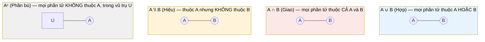

# MASTER COMPUTER SCIENCE HANDBOOK

## Volume 01 — Mathematics for Computer Science
### Part I — Mathematical Thinking
## Chương 1.5 — Lý thuyết Tập hợp
### (Set Theory)

---

### Thông tin chương

| Trường | Giá trị |
|---|---|
| Chương | 1.5 |
| Thuộc Part | I — Mathematical Thinking |
| Thuộc Volume | 01 — Mathematics for Computer Science |
| Thời gian đọc ước tính | 40–50 phút |
| Độ khó | ★★☆☆☆ |
| Kiến thức tiên quyết | Chương 1.3 — Propositional and Predicate Logic; Chương 1.4 — Proof Techniques |
| Chương liên quan | 1.6 — Functions and Relations (hàm số được định nghĩa như tập hợp các cặp có thứ tự); Volume 1, Part III — Linear Algebra (vector space định nghĩa trên tập hợp) |
| Từ khóa | set, subset, union, intersection, complement, power set, Cartesian product, cardinality |

---

### Mục tiêu học tập

Sau khi hoàn thành chương này, người đọc có thể:

- Định nghĩa tập hợp một cách hình thức và sử dụng ký hiệu tập hợp (set-builder notation) trôi chảy.
- Thực hiện các phép toán tập hợp: hợp, giao, hiệu, phần bù (union, intersection, difference, complement).
- Xây dựng tập lũy thừa (power set) và tích Descartes (Cartesian product) của một tập hợp, và tính đúng kích thước của chúng.
- Chứng minh một đẳng thức tập hợp đơn giản, áp dụng trực tiếp các kỹ thuật chứng minh học ở Chương 1.4.
- Phân biệt được lực lượng (cardinality) hữu hạn, đếm được, và không đếm được ở mức trực giác.

---

### Câu hỏi khơi gợi

> *Bạn đã bao giờ dùng `Set` trong JavaScript hoặc `set()` trong Python để loại bỏ phần tử trùng lặp trong một danh sách chưa? Bạn có biết rằng cấu trúc dữ liệu đó, cùng với toàn bộ các thao tác `union()`, `intersection()`, `difference()` đi kèm, là hiện thân trực tiếp — gần như không thay đổi một ký hiệu nào — của một lý thuyết toán học được phát triển từ cuối thế kỷ 19 không?*

---

## 1. Tổng quan chương

Chương 1.1 (Mục 4) đã giới thiệu sơ lược khái niệm tập hợp như một trực giác kỹ thuật bạn đã có sẵn. Chương này hình thức hóa đầy đủ trực giác đó thành **Lý thuyết Tập hợp (Set Theory)** — không chỉ vì đây là kiến thức toán học nền tảng, mà vì tập hợp là **vật liệu xây dựng (building block)** cho hầu như mọi khái niệm toán học khác sẽ xuất hiện trong Handbook: hàm số (Chương 1.6) là một tập hợp các cặp; không gian vector (Volume 1, Part III) là một tập hợp có cấu trúc đại số; miền xác định của một biến ngẫu nhiên (Volume 1, Part V) là một tập hợp các kết quả có thể.

Chương này cũng là nơi đầu tiên bạn sẽ **áp dụng thực chiến** các kỹ thuật chứng minh vừa học ở Chương 1.4 — không phải trên các phát biểu số học trừu tượng, mà trên các đẳng thức tập hợp cụ thể, trực quan, dễ kiểm tra bằng hình vẽ trước khi chứng minh bằng lời.

> **💡 Insight**
> Nếu bạn từng dùng `Set` trong TypeScript/JavaScript hoặc `set` trong Python, bạn đã dùng lý thuyết tập hợp — chỉ là chưa gọi tên các phép toán bằng ký hiệu toán học. Chương này chủ yếu là việc **đặt tên chính thức** cho những gì bạn đã thao tác hằng ngày, rồi mở rộng nó bằng hai khái niệm mới: tập lũy thừa và lực lượng.

---

## 2. Bối cảnh lịch sử

Lý thuyết tập hợp, dù là nền tảng của hầu hết toán học hiện đại, chỉ mới xuất hiện từ cuối thế kỷ 19 — khá muộn so với các nhánh toán học khác.

| Thời điểm | Nhân vật / Sự kiện | Đóng góp |
|---|---|---|
| 1874–1884 | Georg Cantor | Sáng lập Lý thuyết Tập hợp; chứng minh có nhiều "kích cỡ" vô hạn khác nhau (Mục 12) — một kết quả gây tranh cãi dữ dội thời bấy giờ |
| 1901 | Bertrand Russell | Phát hiện **Nghịch lý Russell (Russell's Paradox)** — cho thấy lý thuyết tập hợp "ngây thơ" (naive set theory) ban đầu của Cantor chứa mâu thuẫn logic nội tại (Mục 14) |
| 1908–1922 | Ernst Zermelo, Abraham Fraenkel | Xây dựng hệ tiên đề **ZFC (Zermelo–Fraenkel với Tiên đề Chọn)** — phiên bản lý thuyết tập hợp chặt chẽ, tránh được nghịch lý Russell, và vẫn là nền tảng chuẩn của toán học hiện đại cho đến ngày nay |

Cantor phải trả giá không nhỏ cho công trình của mình: nhiều nhà toán học cùng thời, bao gồm cả người thầy cũ của ông là Leopold Kronecker, đã công khai bác bỏ và chỉ trích gay gắt ý tưởng về "các cấp độ vô hạn khác nhau" — một khái niệm đi ngược trực giác đến mức bị xem là "phi lý" vào thời điểm đó. Ngày nay, chính khái niệm này (Mục 12) lại là nền tảng trực tiếp cho một trong những kết quả sâu sắc nhất về giới hạn của tính toán, mà bạn đã thấy thoáng qua ở Chương 1.1: công trình của Turing về tính toán được.

---

## 3. Động lực

Hãy xem xét một tình huống kỹ thuật quen thuộc: bạn có một hệ thống quản lý người dùng, và cần trả lời các câu hỏi nghiệp vụ như:

- "Những người dùng nào **vừa** đăng ký nhận bản tin **vừa** đã từng mua hàng?" — đây là phép **giao (intersection)**.
- "Những người dùng nào đăng ký nhận bản tin **hoặc** đã từng mua hàng (hoặc cả hai)?" — đây là phép **hợp (union)**.
- "Những người dùng nào đăng ký nhận bản tin nhưng **chưa từng** mua hàng?" — đây là phép **hiệu (difference)**.

Nếu bạn đã từng viết một câu lệnh SQL với `INTERSECT`, `UNION`, hoặc kết hợp `WHERE NOT EXISTS`, bạn đã trả lời chính xác những câu hỏi này — chỉ là chưa từng gọi chúng bằng ký hiệu toán học $\cap, \cup, \setminus$. Điều đáng giá mà chương này mang lại không phải là dạy bạn một kỹ năng hoàn toàn mới, mà là cho bạn một **ngôn ngữ chính xác và một bộ quy tắc đã được chứng minh** để suy luận về những thao tác này — thay vì chỉ dựa vào trực giác SQL.

---

## 4. Trực giác

**Mô hình tinh thần (Mental Model) của chương này:**

> Một tập hợp giống như một **cái túi chứa đồ vật, không quan tâm thứ tự, và không cho phép hai vật giống hệt nhau cùng tồn tại**. Đây chính xác là hành vi của cấu trúc dữ liệu `Set` trong hầu hết ngôn ngữ lập trình hiện đại — không phải sự trùng hợp, mà vì `Set` trong lập trình được thiết kế mô phỏng trực tiếp khái niệm toán học này.

| Trực giác kỹ thuật bạn đã có | Khái niệm toán học tương ứng |
|---|---|
| `new Set([1, 2, 2, 3])` tự động loại bỏ phần tử trùng | Một tập hợp không có phần tử lặp lại (theo định nghĩa) |
| `setA.has(x)` trong JavaScript | Ký hiệu $x \in A$ ("x thuộc A") |
| `[...setA].length` | Ký hiệu $|A|$ — lực lượng (cardinality) của tập hợp |
| Toán tử `UNION`, `INTERSECT` trong SQL | Ký hiệu $\cup$ (hợp), $\cap$ (giao) |

---

## 5. Trực quan hóa khái niệm

**Hình 1.5.1 — Các phép toán tập hợp cơ bản qua Venn Diagram**
*(Visual đặc trưng của chương — Chapter Identity)*



| Trường thông tin | Nội dung |
|---|---|
| Mục đích | Cho một hình ảnh không gian trực tiếp cho bốn phép toán tập hợp cơ bản — sẽ được đối chiếu với các phép toán logic tương ứng ở Bảng 1.5.2 |
| Điểm mấu chốt | So sánh trực tiếp với Hình 1.3.1 (Chương 1.3): $\cup$ có cùng "hình dạng trực giác" với $\vee$ (OR), $\cap$ có cùng hình dạng với $\wedge$ (AND) — đây không phải trùng hợp, xem Mục 15 |

---

**Hình 1.5.2 — Tích Descartes (Cartesian Product) dưới dạng lưới**

```text
        B = {x, y, z}
      ┌────┬────┬────┐
  A = │(1,x)│(1,y)│(1,z)│   ← hàng ứng với phần tử "1" của A
  {1,2}├────┼────┼────┤
      │(2,x)│(2,y)│(2,z)│   ← hàng ứng với phần tử "2" của A
      └────┴────┴────┘
```

*Mục đích:* Cho thấy trực quan vì sao $|A \times B| = |A| \times |B|$ — số ô trong lưới chính xác bằng số hàng nhân số cột. *Điểm mấu chốt:* mỗi ô là một **cặp có thứ tự (ordered pair)** — $(1, x) \neq (x, 1)$, khác với một tập hợp thông thường nơi thứ tự không quan trọng.

---

## 6. Định nghĩa hình thức

> **📌 Remember — Tập hợp (Set)**
>
> Một **tập hợp (set)** là một tuyển tập (collection) các đối tượng phân biệt, gọi là **phần tử (element)**, không quan tâm đến thứ tự và không cho phép lặp lại. Ký hiệu $x \in A$ nghĩa là "$x$ là một phần tử của $A$"; $x \notin A$ nghĩa là ngược lại. Tập hợp không có phần tử nào gọi là **tập rỗng (empty set)**, ký hiệu $\emptyset$ hoặc $\{\}$.
>
> Có hai cách chính để mô tả một tập hợp:
> - **Liệt kê (roster notation):** $A = \{1, 2, 3, 4, 5\}$.
> - **Ký hiệu xây dựng tập hợp (set-builder notation):** $A = \{x \in \mathbb{N} \mid x \leq 5\}$ — đọc là "tập hợp các $x$ thuộc $\mathbb{N}$ sao cho $x \leq 5$". Đây chính là nơi lượng từ và vị từ học ở Chương 1.2–1.3 quay lại: phần sau dấu $\mid$ (hoặc $:$) chính là một **vị từ** $P(x)$.

**Tập con (Subset)** — $A \subseteq B$ nghĩa là mọi phần tử của $A$ cũng là phần tử của $B$: $\forall x, (x \in A \rightarrow x \in B)$. Chú ý định nghĩa này dùng trực tiếp $\forall$ và $\rightarrow$ đã học — một tập con, về bản chất, là một phát biểu logic vị từ. $A \subsetneq B$ (tập con thực sự — proper subset) nghĩa là $A \subseteq B$ và $A \neq B$.

**Các phép toán tập hợp:**

| Ký hiệu | Tên gọi | Định nghĩa (set-builder) |
|---|---|---|
| $A \cup B$ | Hợp (Union) | $\{x \mid x \in A \vee x \in B\}$ |
| $A \cap B$ | Giao (Intersection) | $\{x \mid x \in A \wedge x \in B\}$ |
| $A \setminus B$ | Hiệu (Difference) | $\{x \mid x \in A \wedge x \notin B\}$ |
| $A^c$ (hoặc $\overline{A}$) | Phần bù (Complement) | $\{x \in U \mid x \notin A\}$, với $U$ là tập vũ trụ (universal set) |

**Tập lũy thừa (Power Set)** — $\mathcal{P}(A)$ là tập hợp gồm **tất cả các tập con** của $A$ (bao gồm cả $\emptyset$ và chính $A$).

**Tích Descartes (Cartesian Product)** — $A \times B = \{(a, b) \mid a \in A, b \in B\}$ — tập hợp tất cả **cặp có thứ tự (ordered pairs)** với phần tử đầu thuộc $A$, phần tử sau thuộc $B$.

---

## 7. Nền tảng toán học

### 7.1 Kích thước của Tập lũy thừa

- **Ý nghĩa:** với mỗi phần tử của $A$, khi xây dựng một tập con, ta có đúng hai lựa chọn độc lập: đưa phần tử đó vào tập con hay không.
- **Ký hiệu:** $|\mathcal{P}(A)|$ — lực lượng của tập lũy thừa.
- **Ví dụ đơn giản:** với $A = \{a, b\}$ (2 phần tử), các tập con có thể là: $\emptyset, \{a\}, \{b\}, \{a,b\}$ — đúng 4 tập con.

> **📦 Formula Box — Kích thước Tập lũy thừa**
>
> $$|\mathcal{P}(A)| = 2^{|A|}$$
>
> | Thành phần | Ý nghĩa |
> |---|---|
> | $|A|$ | Số phần tử của tập gốc $A$ |
> | **Diễn giải kỹ thuật** | Với mỗi phần tử, có đúng 2 lựa chọn (có mặt / không có mặt trong tập con) — theo nguyên lý nhân (Product Rule, sẽ học chính thức ở Chương 2.1), tổng số tổ hợp là $\underbrace{2 \times 2 \times \dots \times 2}_{|A| \text{ lần}} = 2^{|A|}$ |
> | **Ứng dụng thường gặp** | Đếm số cấu hình có thể của một tập cờ boolean (feature flags); ước lượng độ phức tạp của bài toán liệt kê tập con (Volume 3) |

**Kiểm chứng bằng tay** với $A=\{a,b,c\}$ ($|A|=3$): $\mathcal{P}(A)$ có $2^3 = 8$ phần tử — $\emptyset, \{a\}, \{b\}, \{c\}, \{a,b\}, \{a,c\}, \{b,c\}, \{a,b,c\}$ — đúng 8 tập con, khớp công thức. *(Mục 9–10 sẽ kiểm chứng lại bằng code cho nhiều kích thước khác nhau.)*

### 7.2 Định luật De Morgan cho Tập hợp

Chương 1.3 (Mục 7.2) đã giới thiệu định luật De Morgan cho logic mệnh đề. Vì các phép toán tập hợp được *định nghĩa* trực tiếp bằng các phép toán logic (xem bảng ở Mục 6: $\cup$ dùng $\vee$, $\cap$ dùng $\wedge$), định luật De Morgan có một phiên bản tương ứng chính xác cho tập hợp:

> **📦 Formula Box — Định luật De Morgan cho Tập hợp**
>
> $$(A \cup B)^c = A^c \cap B^c$$
> $$(A \cap B)^c = A^c \cup B^c$$
>
> | Thành phần | Ý nghĩa |
> |---|---|
> | Quy tắc chung | Giống hệt cấu trúc De Morgan cho logic (Chương 1.3): "phủ định của hợp/giao" = "đảo từng vế, đồng thời đảo hợp↔giao" |
> | **Diễn giải kỹ thuật** | Trực tiếp giải thích tại sao "không (đăng ký bản tin HOẶC đã mua hàng)" tương đương "(không đăng ký bản tin) VÀ (chưa từng mua hàng)" trong ví dụ ở Mục 3 |
> | **Ứng dụng thường gặp** | Viết lại truy vấn database phức tạp; đơn giản hóa điều kiện lọc dữ liệu (filter) nhiều tầng |

---

## 8. Thuật toán / Cơ chế

**Thuật toán sinh Tập lũy thừa (Power Set Generation)** — một trong những thuật toán liệt kê cơ bản nhất, sẽ gặp lại dưới nhiều biến thể ở Volume 3:

```text
Bước 1 — Nhận vào tập A gồm n phần tử, đánh số 0, 1, ..., n-1
        │
        ▼
Bước 2 — Với mỗi số nguyên i từ 0 đến 2ⁿ - 1:
        │
        ▼
Bước 3 —   Biểu diễn i dưới dạng nhị phân, đúng n chữ số
           (thêm số 0 ở đầu nếu cần)
        │
        ▼
Bước 4 —   Với mỗi vị trí bit bằng 1, đưa phần tử tương ứng
           của A vào tập con hiện tại
        │
        ▼
Bước 5 —   Tập con vừa xây dựng chính là một phần tử của P(A)
        │
        ▼
Bước 6 — Sau khi lặp hết 2ⁿ giá trị i, ta thu được toàn bộ P(A)
```

> **💡 Insight**
> Thuật toán này thực chất "vật chất hóa" chính chứng minh của công thức $|\mathcal{P}(A)| = 2^{|A|}$ ở Mục 7.1: mỗi số nguyên từ $0$ đến $2^n-1$, khi viết dưới dạng nhị phân, chính là một cách mã hóa "phần tử nào có mặt / không có mặt" — mỗi bit tương ứng với đúng một lựa chọn nhị phân đã đề cập ở Formula Box Mục 7.1.

---

## 9. Triển khai

```python
from itertools import chain, combinations

def power_set(s):
    """Sinh toàn bộ tập lũy thừa của s, dùng itertools.combinations
    để liệt kê tập con theo từng kích thước từ 0 đến |s|."""
    s = list(s)
    return list(chain.from_iterable(
        combinations(s, r) for r in range(len(s) + 1)
    ))


def de_morgan_check_sets(A, B, U):
    """Kiểm tra định luật De Morgan cho tập hợp: (A ∪ B)ᶜ == Aᶜ ∩ Bᶜ,
    với U là tập vũ trụ."""
    lhs = U - (A | B)
    rhs = (U - A) & (U - B)
    return lhs == rhs
```

Hàm `power_set` triển khai chính xác thuật toán ở Mục 8, chỉ khác cách mã hóa (dùng thư viện tổ hợp có sẵn thay vì tự đếm nhị phân — cả hai cách đều liệt kê đúng $2^n$ tập con). Hàm `de_morgan_check_sets` là bản dịch trực tiếp Formula Box ở Mục 7.2 thành code kiểm chứng được.

---

## 10. Trực quan hóa quá trình thực thi

**Kiểm chứng $|\mathcal{P}(A)| = 2^{|A|}$ cho nhiều kích thước:**

| $|A|$ | $|\mathcal{P}(A)|$ thực tế | $2^{|A|}$ | Khớp? |
|---:|---:|---:|---:|
| 0 | 1 | 1 | ✓ |
| 1 | 2 | 2 | ✓ |
| 2 | 4 | 4 | ✓ |
| 3 | 8 | 8 | ✓ |
| 4 | 16 | 16 | ✓ |
| 5 | 32 | 32 | ✓ |
| 10 | 1.024 | 1.024 | ✓ |

**Minh họa đầy đủ $\mathcal{P}(\{a,b,c\})$**, chạy thực tế:

```text
∅
{b}
{a}
{c}
{a, b}
{b, c}
{a, c}
{a, b, c}
```

**Kiểm chứng định luật De Morgan cho tập hợp** — chạy trên **2000 cặp tập hợp ngẫu nhiên** khác nhau (không chỉ một ví dụ đơn lẻ):

```text
De Morgan cho tập hợp — (A ∪ B)ᶜ = Aᶜ ∩ Bᶜ — đúng ở toàn bộ 2000 phép thử ngẫu nhiên: True
```

Một ví dụ cụ thể để minh họa trực quan, với $U = \{1,\dots,10\}$, $A=\{1,2,3,4,5\}$, $B=\{4,5,6,7,8\}$:

| Biểu thức | Kết quả |
|---|---|
| $A \cup B$ | $\{1,2,3,4,5,6,7,8\}$ |
| $(A \cup B)^c$ | $\{9, 10\}$ |
| $A^c$ | $\{6,7,8,9,10\}$ |
| $B^c$ | $\{1,2,3,9,10\}$ |
| $A^c \cap B^c$ | $\{9, 10\}$ |

Hai kết quả cuối cùng khớp nhau, đúng như công thức. *(Nhắc lại bài học từ Chương 1.4: 2000 phép thử ngẫu nhiên vẫn chỉ là minh chứng thực nghiệm mạnh mẽ, không thay thế chứng minh hình thức — chứng minh hình thức đầy đủ cho định luật De Morgan tập hợp là Bài tập 4 ở Mục 17, dùng trực tiếp kỹ thuật chứng minh trực tiếp học ở Chương 1.4.)*

---

## 11. Ứng dụng công nghiệp

> **🛠 Engineering Practice**
> Lý thuyết tập hợp không chỉ là nền tảng lý thuyết — nó là mô hình dữ liệu (data model) tường minh trong nhiều hệ thống công nghiệp.

| Bối cảnh công nghiệp | Vai trò của Lý thuyết Tập hợp |
|---|---|
| Truy vấn SQL (`UNION`, `INTERSECT`, `EXCEPT`) | Ánh xạ 1:1 với $\cup, \cap, \setminus$ — trình tối ưu hóa truy vấn dùng chính các định luật ở Mục 7 (bao gồm De Morgan) để viết lại truy vấn hiệu quả hơn |
| Kiểm thử phần mềm — phân tích độ phủ (test coverage) | Tập các trường hợp kiểm thử đã chạy so với tập tất cả trường hợp có thể — "độ phủ" chính là một phép so sánh tập con |
| Feature flags trong hệ thống lớn | Tập hợp các cờ tính năng đang bật là một phần tử của $\mathcal{P}(\text{toàn bộ cờ khả dụng})$ — giải thích trực tiếp vì sao số cấu hình có thể tăng theo hàm mũ khi số lượng cờ tăng |
| Type system (TypeScript Union Types) | Kiểu `string \| number` trong TypeScript chính là phép hợp tập hợp các giá trị hợp lệ — không phải ẩn dụ, mà là ứng dụng trực tiếp |

---

## 12. Góc nhìn nghiên cứu

> **🔬 Research Connection**
> Câu hỏi tưởng chừng đơn giản "một tập hợp có bao nhiêu phần tử?" trở nên sâu sắc bất ngờ khi tập hợp đó là vô hạn — và câu trả lời của Cantor cho câu hỏi này là một trong những khám phá gây chấn động nhất của toán học.

Cantor chứng minh rằng **không phải mọi tập vô hạn đều có cùng "kích cỡ"**. Cụ thể, bằng một kỹ thuật gọi là **lập luận đường chéo (diagonal argument)**, ông chứng minh rằng tập số thực $\mathbb{R}$ có nhiều phần tử hơn tập số tự nhiên $\mathbb{N}$ một cách không thể chối cãi — dù cả hai đều vô hạn. Tập $\mathbb{N}$ được gọi là **đếm được (countably infinite)**; tập $\mathbb{R}$ được gọi là **không đếm được (uncountable)**.

Kết quả này không chỉ là một sự tò mò triết học. Chính kỹ thuật lập luận đường chéo của Cantor, gần 50 năm sau, được Alan Turing sử dụng lại — theo một cách biến đổi tinh tế — để chứng minh **Bài toán Dừng (Halting Problem) là không thể giải quyết được bằng bất kỳ thuật toán nào**, một trong những kết quả nền tảng nhất của Theory of Computation (bạn sẽ gặp đầy đủ ở Volume 2, Part IX). Sợi dây nối liền Cantor (1874) → Gödel (1931, đã gặp ở Chương 1.4) → Turing (1936, đã gặp ở Chương 1.1) không phải là sự trùng hợp: cả ba đều dùng chung một họ kỹ thuật lập luận về giới hạn của các hệ thống hình thức.

**Câu hỏi mở** để suy ngẫm: nếu có nhiều "kích cỡ vô hạn" khác nhau, và tập số thực lớn hơn tập số tự nhiên — có tồn tại một tập hợp có kích cỡ *nằm giữa* hai tập đó không? Đây chính là **Giả thuyết Continuum (Continuum Hypothesis)**, một trong những bài toán nổi tiếng nhất lịch sử toán học, đã được chứng minh là **không thể chứng minh hay bác bỏ** trong hệ tiên đề ZFC chuẩn (một hệ quả trực tiếp liên quan đến Định lý Gödel, Chương 1.4, Mục 12).

---

## 13. Ưu điểm

- **Ngôn ngữ thống nhất cho hầu hết cấu trúc toán học khác** — hàm số, quan hệ, không gian vector, phân phối xác suất đều được định nghĩa trên nền tảng tập hợp.
- **Ánh xạ trực tiếp 1:1 với cấu trúc dữ liệu lập trình** — `Set`, các phép toán tập hợp trong SQL, type union — giúp chuyển giao kiến thức gần như không mất mát.
- **Các định luật (như De Morgan) cho phép đơn giản hóa và tối ưu hóa** biểu thức lọc/truy vấn dữ liệu phức tạp một cách có chứng minh, không phải đoán mò.
- **Là công cụ hình thức hóa đầu tiên cho khái niệm vô hạn** — mở đường cho những kết quả sâu sắc nhất của khoa học máy tính lý thuyết (Mục 12).

---

## 14. Hạn chế

> **⚠️ Common Mistake**
> Lý thuyết tập hợp "ngây thơ" (naive set theory) — định nghĩa tập hợp một cách tự do như ở Mục 6 — thực ra **không hoàn toàn nhất quán về mặt logic**, nếu không có thêm ràng buộc.

- **Nghịch lý Russell (Russell's Paradox):** xét tập hợp $R = \{x \mid x \notin x\}$ ("tập hợp của mọi tập hợp không chứa chính nó"). Câu hỏi: $R \in R$ hay $R \notin R$? Cả hai câu trả lời đều dẫn đến mâu thuẫn (nếu $R \in R$ thì theo định nghĩa $R \notin R$; nếu $R \notin R$ thì theo định nghĩa $R \in R$). Đây chính là lý do hệ tiên đề ZFC (Mục 2) ra đời — nó đặt ra các quy tắc chặt chẽ hơn về việc tập hợp nào "được phép" tồn tại, tránh xây dựng được những cấu trúc tự tham chiếu nghịch lý như $R$.
- **Giả thuyết Continuum không thể chứng minh hay bác bỏ** trong ZFC (Mục 12) — một ví dụ cụ thể, nổi tiếng, của Định lý Gödel về giới hạn của các hệ thống hình thức.
- Trong phạm vi Volume 1, Handbook này sử dụng lý thuyết tập hợp "ngây thơ" đơn giản hóa (như trình bày ở Mục 6) — đủ dùng cho mọi mục đích thực hành của Computer Science ứng dụng — và không đi sâu vào các tiên đề ZFC đầy đủ, vốn thuộc phạm vi nghiên cứu nền tảng toán học chuyên sâu hơn.

---

## 15. So sánh

**Bảng 1.5.1 — Phép toán Tập hợp tương ứng với Phép toán Logic**

| Phép toán Tập hợp | Ký hiệu | Phép toán Logic tương ứng (Chương 1.3) | Ký hiệu |
|---|---|---|---|
| Hợp (Union) | $A \cup B$ | Tuyển (Disjunction, OR) | $p \vee q$ |
| Giao (Intersection) | $A \cap B$ | Hội (Conjunction, AND) | $p \wedge q$ |
| Phần bù (Complement) | $A^c$ | Phủ định (Negation, NOT) | $\neg p$ |
| Tập con (Subset) | $A \subseteq B$ | Kéo theo (Implication) | $p \rightarrow q$ |

**Phân tích:** Đây không phải là một sự tương tự hời hợt — như đã nêu ở Mục 6, mỗi phép toán tập hợp được **định nghĩa bằng chính** phép toán logic tương ứng thông qua set-builder notation. Hệ quả trực tiếp: **mọi định luật đúng trong logic mệnh đề (Chương 1.3) đều có một định luật tương ứng đúng trong lý thuyết tập hợp** — De Morgan là ví dụ đã kiểm chứng ở Mục 7.2 và 10, nhưng nguyên tắc này áp dụng tổng quát cho mọi định luật khác (luật giao hoán, luật kết hợp, luật phân phối...). Đây là một minh chứng đẹp cho nguyên tắc "Knowledge Connections" xuyên suốt Handbook: hai chương tưởng như độc lập (Logic và Tập hợp) thực chất là hai cách nhìn của cùng một cấu trúc toán học.

---

## 16. Tóm tắt

- Một **tập hợp** là một tuyển tập phần tử phân biệt, không quan tâm thứ tự; các phép toán $\cup, \cap, \setminus, {}^c$ được định nghĩa trực tiếp bằng các phép toán logic tương ứng ($\vee, \wedge, \wedge\neg, \neg$).
- **Tập lũy thừa** $\mathcal{P}(A)$ có kích thước $2^{|A|}$ — hệ quả trực tiếp của việc mỗi phần tử có đúng hai lựa chọn (có mặt/không có mặt); **tích Descartes** $A \times B$ có kích thước $|A| \times |B|$, gồm các cặp có thứ tự.
- **Định luật De Morgan** có phiên bản tương ứng chính xác cho cả logic (Chương 1.3) và tập hợp (chương này) — không phải trùng hợp, mà là hệ quả của việc tập hợp được xây dựng trên nền logic vị từ.
- Lý thuyết tập hợp "ngây thơ" chứa mâu thuẫn nội tại (Nghịch lý Russell) nếu không có ràng buộc tiên đề (ZFC) — nhưng phiên bản đơn giản hóa dùng trong Handbook này đủ chặt chẽ cho mọi ứng dụng Computer Science thực hành.
- Có nhiều **kích cỡ vô hạn** khác nhau (Cantor) — một kết quả kết nối trực tiếp với giới hạn của tính toán (Turing) và giới hạn của chứng minh (Gödel).

Chương 1.6 (Functions and Relations) sẽ dùng trực tiếp tích Descartes vừa học: một hàm số, về bản chất hình thức nhất, chính là một tập con đặc biệt của $A \times B$.

---

## 17. Bài tập

### Mức Cơ bản (Basic)

1. Cho $A = \{1,2,3,4\}$, $B = \{3,4,5,6\}$. Tính $A \cup B$, $A \cap B$, $A \setminus B$, và $B \setminus A$.
2. Cho $A = \{x, y\}$. Liệt kê đầy đủ $\mathcal{P}(A)$ và $A \times A$.
3. Cho $|A| = 4$ và $|B| = 3$, với $A \cap B = \emptyset$. Tính $|A \cup B|$ và $|A \times B|$.

### Mức Trung bình (Intermediate)

4. Dùng chứng minh trực tiếp (Chương 1.4, Mục 6), chứng minh đẳng thức tập hợp: $(A \cup B)^c = A^c \cap B^c$, cho hai tập bất kỳ $A, B$ trong một tập vũ trụ $U$. *(Gợi ý: dùng chính định nghĩa set-builder ở Mục 6, chuyển bài toán tập hợp về bài toán logic mệnh đề, rồi áp dụng định luật De Morgan cho logic đã chứng minh ở Chương 1.3.)*
5. Chứng minh $A \subseteq B$ khi và chỉ khi $A \cap B = A$. *(Gợi ý: đây là một phát biểu "khi và chỉ khi" — cần chứng minh cả hai chiều kéo theo.)*

### Mức Nâng cao (Advanced)

6. Với $|A| = n$, có bao nhiêu tập con $S$ của $A$ sao cho $|S|$ là số chẵn? *(Gợi ý: liệt kê thử với $n=1,2,3$ trước, tìm quy luật, sau đó thử chứng minh quy luật đó bằng quy nạp — kết hợp trực tiếp kỹ năng Chương 1.4 với nội dung chương này.)*
7. Cho $A$ là một tập hợp bất kỳ. Chứng minh rằng **không tồn tại một hàm số toàn ánh (surjective — sẽ định nghĩa đầy đủ ở Chương 1.6) từ $A$ vào $\mathcal{P}(A)$** — nói cách khác, $\mathcal{P}(A)$ luôn "lớn hơn" $A$, kể cả khi $A$ là vô hạn. *(Đây chính là lập luận đường chéo của Cantor ở dạng tổng quát — bài tập này mang tính chất khám phá, không kỳ vọng lời giải hoàn chỉnh trong lần thử đầu tiên; hãy thử bắt đầu bằng phản chứng, theo đúng kỹ thuật Chương 1.4.)*

---

## 18. Dự án nhỏ

**Không áp dụng cho chương này.**

Chương này tập trung xây dựng nền tảng khái niệm và kỹ năng chứng minh (áp dụng trực tiếp Chương 1.4) hơn là một sản phẩm kỹ thuật độc lập. Kỹ năng thao tác tập hợp sẽ được vận dụng trực tiếp trong Dự án tích hợp cuối Part I ở Chương 1.6.

---

## 19. Tự đánh giá

- [ ] Tôi có thể tính $A \cup B$, $A \cap B$, $A \setminus B$ cho hai tập hợp cụ thể bất kỳ mà không cần tra lại định nghĩa.
- [ ] Tôi có thể tự liệt kê đầy đủ $\mathcal{P}(A)$ cho một tập nhỏ (3–4 phần tử), và giải thích được vì sao kích thước của nó là $2^{|A|}$.
- [ ] Tôi hiểu và có thể giải thích mối liên hệ giữa các phép toán tập hợp và các phép toán logic tương ứng (Bảng 1.5.1) — không chỉ ghi nhớ, mà hiểu *tại sao* chúng liên hệ.
- [ ] Tôi đã hoàn thành được chứng minh ở Bài tập 4, áp dụng đúng kỹ thuật chứng minh trực tiếp từ Chương 1.4.
- [ ] Tôi có một trực giác ban đầu (không cần chứng minh hoàn chỉnh) về vì sao có "nhiều kích cỡ vô hạn khác nhau".

Nếu Bài tập 4 vẫn còn khó khăn, đây là dấu hiệu nên quay lại ôn tập nhanh Chương 1.4 (đặc biệt Mục 6, chứng minh trực tiếp) trước khi tiếp tục — kỹ năng "chuyển bài toán tập hợp về bài toán logic" sẽ được dùng lặp lại nhiều lần trong các chương sau.

---

## 20. Đọc thêm

- **Sách:** Marc Peter Deisenroth, A. Aldo Faisal, Cheng Soon Ong, *Mathematics for Machine Learning*, Chương 2 — phần ôn tập lý thuyết tập hợp làm nền tảng cho đại số tuyến tính. *(Xem BOOKS.md — Volume 1.)*
- **Chủ đề mở rộng (không bắt buộc):** tìm đọc về lập luận đường chéo của Cantor (Cantor's diagonal argument) — cách trình bày trực quan, không cần ký hiệu nặng, có thể tìm thấy trong hầu hết giáo trình Discrete Mathematics nhập môn.
- **Chương tiếp theo:** Chương 1.6 — Functions and Relations.

---

### Liên kết chương (Cross References)

- **Chương trước:** 1.4 — Proof Techniques (áp dụng trực tiếp chứng minh trực tiếp cho các đẳng thức tập hợp ở Mục 17).
- **Chương tiếp theo:** 1.6 — Functions and Relations (hàm số định nghĩa như tập con đặc biệt của tích Descartes $A \times B$ vừa học).
- **Chương liên quan xa hơn:** Volume 1, Part III — Linear Algebra (không gian vector là tập hợp có cấu trúc đại số); Volume 2, Part IX — Theory of Computation (lập luận đường chéo của Cantor tái sử dụng bởi Turing, Mục 12).
- **Vị trí trong Knowledge Graph:** Nút thứ năm của Volume 1, phụ thuộc vào Chương 1.3 và 1.4; là điều kiện tiên quyết trực tiếp cho Chương 1.6 — chương cuối cùng, khép lại Part I.

---

*Hết Chương 1.5. Chương này tuân thủ đầy đủ cấu trúc 20 mục của `OUTPUT.md` và chuẩn Presentation Layer, khớp với đặc tả outline đã đóng băng cho Chương 1.5 (tập hợp, tập lũy thừa, tích Descartes, không có Mini Project theo đúng thiết kế ban đầu). Mọi kết quả về kích thước tập lũy thừa và định luật De Morgan cho tập hợp đều được kiểm chứng thực nghiệm bằng Python (bao gồm 2000 phép thử ngẫu nhiên cho De Morgan), đồng thời phân biệt rõ ràng kiểm chứng thực nghiệm với chứng minh hình thức — đúng nguyên tắc đã thiết lập từ Chương 1.4. Đang chờ rà soát trước khi tiếp tục sang Chương 1.6 — chương cuối cùng của Part I.*
