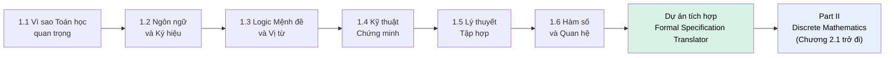

# MASTER COMPUTER SCIENCE HANDBOOK

## Volume 01 — Mathematics for Computer Science
### Part I — Mathematical Thinking
## Dự án tích hợp Part I — "Formal Specification Translator"
### (Bộ dịch Đặc tả Hình thức)

---

### Thông tin dự án

| Trường | Giá trị |
|---|---|
| Thuộc Part | I — Mathematical Thinking *(dự án khép lại Part)* |
| Thuộc Volume | 01 — Mathematics for Computer Science |
| Thời gian ước tính | 3–5 giờ làm việc tập trung |
| Độ khó | ★★★☆☆ |
| Kiến thức tiên quyết | Toàn bộ Chương 1.1 – 1.6 |
| Kỹ năng được tích hợp | Ký hiệu toán học (1.2), Logic mệnh đề/vị từ (1.3), Kỹ thuật chứng minh (1.4), Tập hợp (1.5), Hàm số/Quan hệ (1.6) |

---

## Vì sao dự án này tồn tại

Sáu chương vừa qua, mỗi chương xây dựng một công cụ riêng biệt: ký hiệu để *đọc*, logic để *phát biểu*, chứng minh để *xác nhận*, tập hợp và hàm số để *mô hình hóa*. Nhưng trong công việc thực tế, không ai áp dụng từng công cụ một cách tách biệt — một đặc tả kỹ thuật thực sự luôn đòi hỏi cả năm kỹ năng cùng lúc.

Dự án này có đúng một mục tiêu: buộc bạn dùng **cả sáu chương cùng một lúc**, trên những đặc tả API có thật về mặt hình thái (dù được đơn giản hóa cho mục đích học tập), theo đúng nguyên tắc "Learn by Building" của `PROJECT.md`. Đây không phải một chương mới — không có kiến thức mới nào được giới thiệu ở đây. Đây là bài kiểm tra thực chiến đầu tiên của Handbook.

> **💡 Insight**
> Nếu bạn hoàn thành được dự án này một cách trôi chảy, bạn đã đạt đúng mục tiêu tối thượng của Part I đề ra từ Chương 1.1: **trưởng thành toán học** — không phải khả năng nhớ định nghĩa, mà khả năng *dùng* một tổ hợp công cụ toán học để mô hình hóa một vấn đề kỹ thuật thật, một cách chủ động và tự tin.

---

## Mục tiêu

Sau khi hoàn thành dự án, bạn có thể:

- Đọc một precondition/postcondition API viết bằng ngôn ngữ tự nhiên (thường mơ hồ, như hầu hết tài liệu kỹ thuật thực tế) và **dịch nó thành một đặc tả hình thức chính xác**, dùng logic vị từ và ký hiệu tập hợp.
- Xác định đúng **loại đối tượng toán học** phù hợp cho từng bài toán (một mệnh đề logic đơn thuần? một hàm số? một quan hệ tương đương?) — đây chính là kỹ năng "chọn công cụ đúng" mà Hình 1.4.2 (sơ đồ chọn kỹ thuật chứng minh) chỉ là một phần nhỏ của nó.
- Chứng minh (hoặc bác bỏ, theo đúng tinh thần Chương 1.4, Mục "Nghiên cứu") một hệ quả cụ thể rút ra từ đặc tả hình thức bạn vừa xây dựng.
- Nhận ra được, qua kinh nghiệm trực tiếp, những "cái bẫy" phổ biến khi hình thức hóa yêu cầu nghiệp vụ thực tế — đặc biệt là trường hợp một quan hệ "trông có vẻ hợp lý" nhưng thực chất vi phạm một tính chất toán học quan trọng (xem Nhiệm vụ 3).

---

## Yêu cầu

Dự án gồm **ba nhiệm vụ**, mỗi nhiệm vụ dựa trên một đặc tả API viết bằng ngôn ngữ tự nhiên, cố tình mơ hồ ở một mức độ tương tự tài liệu kỹ thuật thực tế. Nhiệm vụ 1 được giải đầy đủ làm ví dụ chuẩn (worked example) để bạn hiệu chỉnh kỳ vọng về "thế nào là một lời giải đạt chuẩn publication-ready"; Nhiệm vụ 2 và 3 dành cho bạn tự thực hiện.

---

### Nhiệm vụ 1 — Đặc tả điều kiện xác nhận đơn hàng *(Ví dụ mẫu — đã giải đầy đủ)*

**Đặc tả gốc (ngôn ngữ tự nhiên, mơ hồ):**

> *"Đơn hàng chỉ được xác nhận nếu giỏ hàng không rỗng, và (người dùng có đủ số dư hoặc có mã giảm giá hợp lệ đưa tổng tiền về 0), nhưng không được xác nhận nếu tài khoản đang bị đóng băng, bất kể các điều kiện trên."*

**Bước 1 — Định danh các vị từ thành phần** (áp dụng Chương 1.3, Mục 6):

| Ký hiệu | Vị từ |
|---|---|
| $C(o)$ | "Giỏ hàng của đơn hàng $o$ không rỗng" |
| $B(o)$ | "Người dùng của đơn hàng $o$ có đủ số dư" |
| $V(o)$ | "Đơn hàng $o$ có mã giảm giá hợp lệ đưa tổng tiền về 0" |
| $F(o)$ | "Tài khoản của đơn hàng $o$ đang bị đóng băng" |
| $X(o)$ | "Đơn hàng $o$ được xác nhận" |

**Bước 2 — Dịch sang logic vị từ** (áp dụng Chương 1.2 và 1.3):

$$\forall o \in \text{Orders}, \; X(o) \leftrightarrow \Big( \big(C(o) \wedge (B(o) \vee V(o))\big) \wedge \neg F(o) \Big)$$

*Lưu ý kỹ thuật quan trọng:* đặc tả gốc dùng từ "chỉ được... nếu", về logic đây là một điều kiện **cần và đủ** ($\leftrightarrow$), không chỉ là điều kiện đủ ($\rightarrow$) — một chi tiết dễ bị bỏ sót khi đọc lướt ngôn ngữ tự nhiên, nhưng có ý nghĩa kỹ thuật quan trọng: nó khẳng định đơn hàng **sẽ luôn** được xác nhận khi điều kiện thỏa mãn, không chỉ "có thể".

**Bước 3 — Mô hình hóa bằng tập hợp** (áp dụng Chương 1.5): định nghĩa $\text{Confirmed} = \{o \in \text{Orders} \mid X(o)\}$ — tập con các đơn hàng thỏa mãn vị từ trên. Theo Bước 2, ta có thể viết lại:

$$\text{Confirmed} = \big(\text{NonEmptyCart} \cap (\text{SufficientBalance} \cup \text{ValidVoucher})\big) \setminus \text{Frozen}$$

*(mỗi tập ở vế phải là tập các đơn hàng thỏa mãn vị từ tương ứng — một bản dịch trực tiếp $\wedge \to \cap$, $\vee \to \cup$, $\wedge \neg \to \setminus$, đúng theo Bảng 1.5.1 của Chương 1.5.)*

**Bước 4 — Chứng minh một hệ quả** (áp dụng Chương 1.4):

*Hệ quả cần chứng minh:* Nếu một đơn hàng đang bị đóng băng ($F(o)$ đúng), nó chắc chắn không được xác nhận, bất kể $C(o), B(o), V(o)$ nhận giá trị gì.

*Chứng minh (trực tiếp):* Giả sử $F(o)$ đúng. Khi đó $\neg F(o)$ sai. Theo bảng chân trị của phép $\wedge$ (Chương 1.3, Mục 7.1): với bất kỳ mệnh đề $p$ nào, $p \wedge \text{Sai} = \text{Sai}$ — vì $\wedge$ chỉ đúng khi **cả hai** vế đúng. Áp dụng với $p = \big(C(o) \wedge (B(o) \vee V(o))\big)$: vế phải của phép $\leftrightarrow$ ở Bước 2 luôn là Sai khi $F(o)$ đúng, bất kể $p$ nhận giá trị gì. Do phép $\leftrightarrow$, $X(o)$ cũng phải Sai. Vậy đơn hàng không được xác nhận. $\blacksquare$

> **📌 Remember**
> Đây chính xác là cấu trúc "Dự án tích hợp" mà Part I hướng tới: Bước 1–2 dùng Chương 1.2–1.3; Bước 3 dùng Chương 1.5; Bước 4 dùng Chương 1.4 — không có bước nào đứng độc lập.

---

### Nhiệm vụ 2 — Đặc tả tính duy nhất của phiên đăng nhập *(Bạn tự thực hiện)*

**Đặc tả gốc:**

> *"Tại một thời điểm, hệ thống chỉ lưu cache cho đúng một phiên đăng nhập (session) đang hoạt động cho mỗi người dùng — nếu người dùng đăng nhập ở một thiết bị mới, phiên cũ phải bị vô hiệu hóa trước khi phiên mới được lưu cache."*

**Việc cần làm:**

1. Mô hình hóa ánh xạ "người dùng → phiên đang hoạt động" như một **hàm số** $f: \text{Users} \to \text{Sessions}$, sử dụng đúng định nghĩa hình thức ở Chương 1.6, Mục 6.
2. Đặc tả gốc, khi dịch đúng, mô tả một **tính chất** cụ thể mà $f$ phải luôn thỏa mãn tại mọi thời điểm — hãy xác định đó là tính chất nào trong ba tính chất đã học (đơn ánh / toàn ánh / song ánh), và giải thích bằng lời tại sao *không* phải hai tính chất còn lại.
3. Viết lại đặc tả gốc thành một phát biểu vị từ hình thức duy nhất, sử dụng ký hiệu $\forall, \exists!$ đã học ở Chương 1.2 và định nghĩa hàm số ở Chương 1.6 — gợi ý: định nghĩa hàm số *đã sẵn có* điều kiện $\exists!$ ở ngay trong bản thân nó; câu hỏi thật sự cần trả lời là: đặc tả gốc có đang mô tả lại chính định nghĩa hàm số, hay đang mô tả thêm một ràng buộc *khác*, mạnh hơn?

*(Gợi ý kiểm tra kết quả: nếu bạn đã hoàn thành Dự án nhỏ ở Chương 1.6 — bộ kiểm tra `is_injective`/`is_surjective` — hãy thử biểu diễn một vài "phiên đăng nhập" giả lập dưới dạng dictionary và chạy thử bộ kiểm tra đó để tự xác nhận trực giác của bạn ở bước 2 là đúng.)*

---

### Nhiệm vụ 3 — Đặc tả quy tắc gộp trùng khách hàng *(Bạn tự thực hiện — có cái bẫy)*

**Đặc tả gốc:**

> *"Hai bản ghi khách hàng được xem là trùng lặp (duplicate) và cần được gộp lại nếu chúng có cùng địa chỉ email, HOẶC nếu chúng có cùng số điện thoại VÀ cùng họ tên đầy đủ."*

**Việc cần làm:**

1. Định nghĩa hình thức quan hệ "trùng lặp" $D$ trên tập bản ghi khách hàng $\text{Customers}$, dùng logic vị từ (Chương 1.3) kết hợp ký hiệu quan hệ (Chương 1.6, Mục 6). Gợi ý cấu trúc: $r_1 \mathrel{D} r_2 \iff \big(\text{email}(r_1) = \text{email}(r_2)\big) \vee \big(\text{phone}(r_1)=\text{phone}(r_2) \wedge \text{name}(r_1)=\text{name}(r_2)\big)$.
2. Đội ngũ kỹ thuật giả định rằng $D$ là một **quan hệ tương đương**, và dựa vào giả định đó để thiết kế thuật toán gộp trùng theo lớp tương đương (đúng như đã học ở Chương 1.6, Mục 6 và Hình 1.6.2). **Hãy kiểm tra lại giả định này**: $D$ có thực sự thỏa mãn cả ba tính chất phản xạ, đối xứng, và bắc cầu không? Chứng minh hoặc đưa ra một **phản ví dụ (counterexample)** cụ thể, gồm ba bản ghi $r_1, r_2, r_3$, cho tính chất nào bạn nghi ngờ bị vi phạm.
3. Nếu bạn tìm ra $D$ **không** phải là quan hệ tương đương, hãy giải thích ngắn gọn (không cần code) hậu quả kỹ thuật thực tế nếu đội ngũ kỹ thuật vẫn triển khai thuật toán gộp trùng dựa trên giả định sai này.

> **⚠️ Common Mistake**
> Nhiệm vụ 3 được thiết kế có chủ đích để tái hiện một lỗi thiết kế rất thực tế và rất phổ biến trong các hệ thống deduplication/matching công nghiệp: ghép nhiều điều kiện bằng $\vee$ (HOẶC) để định nghĩa "giống nhau" là một thao tác trực giác hấp dẫn, nhưng — như bạn sẽ tự khám phá — nó **không đảm bảo** tạo ra một quan hệ tương đương hợp lệ. Đây không phải một lỗi lập trình; đây là một lỗi ở tầng mô hình hóa toán học, và không có lượng kiểm thử code nào phát hiện được nó nếu không có bước phân tích hình thức như bài tập này.

---

## Công cụ đề xuất

- **Không bắt buộc dùng code** — dự án này về bản chất là một bài tập viết đặc tả và chứng minh trên giấy/markdown, đúng kỹ năng cốt lõi của Part I.
- **Khuyến khích tái sử dụng** hai công cụ đã xây dựng ở các Dự án nhỏ trước: bộ kiểm tra tương đương logic (Chương 1.3) và bộ kiểm tra injective/surjective/equivalence relation (Chương 1.6) — dùng chúng để **xác nhận thực nghiệm** trực giác của bạn trước khi viết chứng minh hình thức, đúng quy trình làm việc đã luyện tập xuyên suốt Handbook (thực nghiệm trước, chứng minh sau).
- LaTeX hoặc Markdown với hỗ trợ công thức toán (như chính tài liệu này) để trình bày lời giải.

---

## Kết quả kỳ vọng

Một tài liệu (markdown hoặc PDF) gồm:

1. Đặc tả hình thức đầy đủ cho cả ba nhiệm vụ (Nhiệm vụ 1 dùng làm chuẩn đối chiếu).
2. Ít nhất **một chứng minh hoàn chỉnh** theo đúng khuôn mẫu Chương 1.4 (cho Nhiệm vụ 2 hoặc phần chứng minh/phản ví dụ của Nhiệm vụ 3).
3. Một đoạn phản tư ngắn (3–5 câu): loại "bẫy hình thức hóa" nào ở Nhiệm vụ 3 khiến bạn bất ngờ nhất, và bạn nghĩ nó có thể xuất hiện ở đâu trong hệ thống bạn từng làm việc.

---

## Tiêu chí đánh giá (Rubric)

| Tiêu chí | Yêu cầu đạt chuẩn |
|---|---|
| Độ chính xác hình thức | Mỗi vị từ được định danh rõ ràng trước khi dùng; ký hiệu logic/tập hợp dùng nhất quán với quy ước đã thiết lập ở Chương 1.2–1.6 |
| Phân biệt $\rightarrow$ và $\leftrightarrow$ | Nhận diện đúng khi đặc tả gốc yêu cầu điều kiện cần-và-đủ, không chỉ điều kiện đủ (xem Nhiệm vụ 1) |
| Chọn đúng loại đối tượng toán học | Nhiệm vụ 2 dùng đúng khái niệm hàm số/injective; Nhiệm vụ 3 dùng đúng khái niệm quan hệ (không nhầm với hàm số — xem lại Common Mistake, Chương 1.6, Mục 6) |
| Chất lượng chứng minh | Có bước cơ sở/giả thiết rõ ràng nếu dùng quy nạp; có mâu thuẫn rõ ràng nếu dùng phản chứng; mỗi bước suy luận có thể truy vết về một định nghĩa hoặc kết quả đã học |
| Nhận diện phản ví dụ (Nhiệm vụ 3) | Phản ví dụ cụ thể, có thể kiểm tra trực tiếp bằng ba giá trị thật, không mơ hồ |

---

## Hướng mở rộng

- **Nhiệm vụ 4 (tự thiết kế):** tìm một precondition/postcondition thật từ một dự án bạn từng làm việc (hoặc tài liệu API công khai của một dịch vụ bạn dùng hằng ngày), và tự thực hiện quy trình dịch hình thức hóa tương tự — đây là bài kiểm tra thực sự cho việc kỹ năng có "chuyển giao" được sang bối cảnh mới hay không.
- **Mở rộng kỹ thuật (tùy chọn, nâng cao):** viết một công cụ nhỏ bằng Python nhận vào một tập bản ghi giả lập và quan hệ $D$ ở Nhiệm vụ 3, tự động liệt kê tất cả bộ ba $(r_1,r_2,r_3)$ vi phạm tính bắc cầu — đây là bước khởi đầu rất tự nhiên hướng tới **kiểm chứng hình thức tự động (automated formal verification)**, một chủ đề nghiên cứu sẽ được nhắc đến chi tiết hơn ở Volume 4 (khi thảo luận TLA+ và các thuật toán đồng thuận phân tán) và Volume 7 (phương pháp luận nghiên cứu).

---

## Kết thúc Part I

Với dự án này, **Part I — Mathematical Thinking** hoàn tất. Sáu chương đã xây dựng đầy đủ bộ công cụ tư duy nền tảng:

Toàn bộ Part II (Discrete Mathematics — đếm, tổ hợp, đồ thị theo góc nhìn kết hợp, quan hệ đệ quy) sẽ dùng lại **không định nghĩa lại** mọi khái niệm đã xây dựng ở đây — logic, chứng minh, tập hợp, và hàm số giờ được xem là "đã biết", đúng nguyên tắc Concept Reuse của `PROJECT.md`. Nếu bất kỳ phần nào của dự án này còn gây khó khăn, đây là thời điểm tốt nhất để quay lại chương tương ứng — Part II sẽ không dừng lại để ôn tập.

---

*Hết Dự án tích hợp Part I. Tài liệu này khép lại Part I — Mathematical Thinking, tổng hợp toàn bộ Chương 1.1–1.6 theo đúng đặc tả outline đã đóng băng ("Formal Specification Translator" — dịch 3 precondition/postcondition API thực tế thành đặc tả hình thức, chứng minh một hệ quả). Nhiệm vụ 1 được giải đầy đủ làm chuẩn tham chiếu chất lượng; Nhiệm vụ 2–3 để ngỏ cho người học tự thực hiện, đúng nguyên tắc Active Learning của `LEARNING_PHILOSOPHY.md`. Đang chờ rà soát trước khi tiếp tục sang Part II.*
