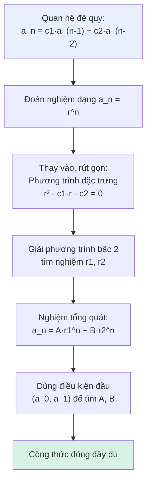

# MASTER COMPUTER SCIENCE HANDBOOK

## Volume 01 — Mathematics for Computer Science
### Part II — Discrete Mathematics
## Chương 2.5 — Quan hệ Đệ quy
### (Recurrence Relations)

---

### Thông tin chương

| Trường | Giá trị |
|---|---|
| Chương | 2.5 *(chương cuối cùng của Part II)* |
| Thuộc Part | II — Discrete Mathematics |
| Thuộc Volume | 01 — Mathematics for Computer Science |
| Thời gian đọc ước tính | 50–60 phút |
| Độ khó | ★★★☆☆ |
| Kiến thức tiên quyết | Chương 1.4 — Proof Techniques (quy nạp); Chương 2.4 — Trees (động lực đếm) |
| Chương liên quan | **Volume 3, Part I — Recurrence Analysis** (ứng dụng kỹ thuật này vào phân tích độ phức tạp thuật toán) |
| Từ khóa | recurrence relation, characteristic equation, closed-form solution, homogeneous, Fibonacci |

---

### ⚠️ Lưu ý phạm vi (Scope Note)

Chương này trình bày **kỹ thuật toán học thuần túy** để giải quan hệ đệ quy — biến một định nghĩa "số hạng sau phụ thuộc số hạng trước" thành một **công thức đóng** tính trực tiếp. Việc áp dụng chính kỹ thuật này để phân tích độ phức tạp thời gian chạy của thuật toán đệ quy (Master Theorem, cây đệ quy) được trình bày đầy đủ tại **Volume 3, Part I — Recurrence Analysis**, sau khi người đọc có nền tảng phân tích độ phức tạp thuật toán. Chương này xây dựng công cụ; Volume 3 áp dụng nó.

---

### Mục tiêu học tập

Sau khi hoàn thành chương này, người đọc có thể:

- Nhận diện và phân loại một **quan hệ đệ quy** là tuyến tính/phi tuyến, thuần nhất (homogeneous)/không thuần nhất.
- Giải một quan hệ đệ quy tuyến tính thuần nhất hệ số hằng bằng **phương trình đặc trưng (characteristic equation)**.
- Áp dụng kỹ thuật này để suy ra công thức đóng của dãy Fibonacci và các bài toán đếm tương tự.
- Nhận biết được **giới hạn** của kỹ thuật này — khi nào một quan hệ đệ quy (như quan hệ phát sinh từ đếm hình dạng cây ở Chương 2.4) *không* thể giải bằng phương pháp trong chương này.

---

### Câu hỏi khơi gợi

> *Có bao nhiêu cách khác nhau để lát kín một bảng kích thước $2 \times n$ ô bằng các viên gạch domino $1 \times 2$? Với $n=1$: 1 cách. $n=2$: 2 cách. Bạn có đoán được quy luật cho $n$ bất kỳ không — không phải bằng cách vẽ và đếm, mà bằng một công thức?*

---

## 1. Tổng quan chương

Chương 2.4 kết thúc bằng một quan sát: việc đếm cấu trúc cây thường tự nhiên dẫn đến một định nghĩa "số hạng sau phụ thuộc vào số hạng trước" — gọi là **quan hệ đệ quy (recurrence relation)**. Chương này, khép lại Part II, trang bị công cụ toán học để giải những quan hệ như vậy: biến một định nghĩa đệ quy (dễ viết, nhưng chậm để tính trực tiếp với $n$ lớn) thành một **công thức đóng** (closed-form) — tính ngay lập tức, không cần tính lần lượt từng số hạng trước đó.

Đây cũng là chương đầu tiên trong Handbook nơi kỹ thuật quy nạp toán học (Chương 1.4) không chỉ dùng để *chứng minh* một công thức đã cho là đúng, mà còn là nền tảng ý tưởng để *tìm ra* công thức đó ngay từ đầu.

> **💡 Insight**
> Bạn sẽ thấy quan hệ đệ quy dưới một hình thức khác, cực kỳ quen thuộc, ngay khi đọc đến Volume 3: **mọi thuật toán đệ quy đều có một quan hệ đệ quy mô tả thời gian chạy của nó.** Kỹ thuật chương này dạy — phương trình đặc trưng — chính là một trong những công cụ nền tảng để phân tích độ phức tạp thuật toán, dù chương này cố tình chưa đề cập đến ứng dụng đó (xem Lưu ý phạm vi).

---

## 2. Bối cảnh lịch sử

| Thời điểm | Nhân vật | Đóng góp |
|---|---|---|
| 1202 | Leonardo Fibonacci | Trong *Liber Abaci*, đặt ra "bài toán con thỏ" — mô hình tăng trưởng dân số thỏ qua các thế hệ — tạo ra dãy số ngày nay mang tên ông: $1,1,2,3,5,8,13,\dots$, một trong những quan hệ đệ quy được ghi chép sớm nhất trong lịch sử toán học |
| Thế kỷ 18 | Leonhard Euler, gia đình Bernoulli, Abraham de Moivre | Phát triển các kỹ thuật giải quan hệ đệ quy tuyến tính bằng phương trình đặc trưng — đặt nền móng cho phương pháp trình bày trong chương này |
| 1843 | Jacques Philippe Marie Binet | Công bố công thức đóng cho dãy Fibonacci (nay gọi là **Công thức Binet**) — dù có bằng chứng cho thấy công thức này đã được biết đến trước đó bởi Euler và Daniel Bernoulli, tên gọi vẫn gắn với Binet theo quy ước lịch sử toán học |

---

## 3. Động lực

Quay lại câu hỏi khơi gợi: lát bảng $2 \times n$ bằng domino $1 \times 2$. Hãy suy luận cách xây dựng lời giải cho bảng $2 \times n$ từ lời giải của các bảng nhỏ hơn — đây chính là "trực giác đệ quy":

Xét cột **cuối cùng** (cột thứ $n$) của bảng. Có đúng hai cách để "hoàn thành" nó:
- Đặt **một viên gạch dọc** che kín cột thứ $n$ — phần còn lại là một bảng $2 \times (n-1)$ cần lát, đã biết cách lát theo $T(n-1)$.
- Đặt **hai viên gạch ngang** che hai cột cuối ($n-1$ và $n$) — phần còn lại là một bảng $2 \times (n-2)$, đã biết cách lát theo $T(n-2)$.

Hai lựa chọn này **loại trừ lẫn nhau** (Quy tắc cộng, Chương 2.1!) — nên:

$$T(n) = T(n-1) + T(n-2)$$

Đây chính là **quan hệ đệ quy Fibonacci**, xuất hiện một cách hoàn toàn tự nhiên từ một bài toán đếm, không phải được "áp đặt" từ đầu. Vấn đề: định nghĩa này cho bạn cách *tính* $T(n)$ nếu bạn đã biết $T(n-1)$ và $T(n-2)$ — nhưng để biết $T(100)$, bạn phải tính tuần tự cả 100 số hạng trước đó. Chương này chỉ ra: có một **công thức đóng**, tính $T(100)$ trực tiếp, không cần đi qua 99 số hạng kia.

---

## 4. Trực giác

**Mô hình tinh thần (Mental Model) của chương này:**

> Giải một quan hệ đệ quy tuyến tính bằng phương trình đặc trưng giống như **"đoán" một dạng nghiệm** ($a_n = r^n$, với $r$ là một hằng số chưa biết), thay nó vào quan hệ đệ quy, rồi tìm xem giá trị $r$ nào khiến "phép đoán" đó thực sự đúng.

Vì sao lại đoán dạng $r^n$? Trực giác: một quan hệ đệ quy tuyến tính hệ số hằng "tự đồng dạng" qua các bước — hệ số nhân giữa các số hạng liên tiếp có xu hướng ổn định khi $n$ đủ lớn (bạn có thể tự kiểm tra: tỉ lệ $F_{n+1}/F_n$ trong dãy Fibonacci tiến gần đến một hằng số cụ thể — chính là "tỉ lệ vàng" $\varphi \approx 1{,}618$, sẽ xuất hiện lại ở Mục 7). Dạng hàm mũ $r^n$ là dạng duy nhất có tính chất "tỉ lệ ổn định" này một cách chính xác.

---

## 5. Trực quan hóa khái niệm

**Hình 2.5.1 — Quy trình giải Quan hệ đệ quy bằng Phương trình đặc trưng**
*(Visual đặc trưng của chương — Chapter Identity)*



---

## 6. Định nghĩa hình thức

> **📌 Remember — Quan hệ đệ quy (Recurrence Relation)**
>
> Một **quan hệ đệ quy** định nghĩa các số hạng của một dãy số $a_0, a_1, a_2, \dots$ dựa trên một hoặc nhiều số hạng đứng trước, cùng với một số **điều kiện đầu (initial conditions)** cho các số hạng khởi tạo. **Bậc (order)** của quan hệ đệ quy là số số hạng trước đó mà mỗi số hạng phụ thuộc vào.
>
> Một quan hệ đệ quy được gọi là **tuyến tính (linear)** nếu mỗi số hạng là một tổ hợp tuyến tính (không có tích, không có lũy thừa) của các số hạng trước — dạng tổng quát bậc $k$, hệ số hằng: $a_n = c_1 a_{n-1} + c_2 a_{n-2} + \dots + c_k a_{n-k}$.
>
> Một quan hệ đệ quy tuyến tính được gọi là **thuần nhất (homogeneous)** nếu không có số hạng "tự do" nào cộng thêm (đúng dạng ở trên); **không thuần nhất (non-homogeneous)** nếu có thêm một hàm số $f(n)$: $a_n = c_1 a_{n-1} + \dots + c_k a_{n-k} + f(n)$.

> **⚠️ Common Mistake**
> Một quan hệ đệ quy như dãy Catalan (sẽ gặp ở Mục 12) — dạng $C_n = \sum_{i=0}^{n-1} C_i C_{n-1-i}$ — trông có vẻ "tuyến tính" vì chỉ có phép cộng ở ngoài cùng, nhưng thực chất **không phải tuyến tính hệ số hằng** theo định nghĩa trên: nó chứa **tích** của các số hạng trước ($C_i \times C_{n-1-i}$), gọi là **quan hệ đệ quy tích chập (convolution recurrence)**. Phương pháp phương trình đặc trưng trong chương này **không áp dụng được** cho dạng này — một điểm sẽ được khai thác trực tiếp ở Bài tập Nâng cao, Mục 17.

---

## 7. Nền tảng toán học

### 7.1 Phương pháp Phương trình đặc trưng (trường hợp bậc 2, nghiệm phân biệt)

> **📦 Formula Box — Giải Quan hệ đệ quy tuyến tính thuần nhất bậc 2**
>
> Cho quan hệ đệ quy $a_n = c_1 a_{n-1} + c_2 a_{n-2}$.
>
> **Bước 1 — Phương trình đặc trưng:** $r^2 - c_1 r - c_2 = 0$.
>
> **Bước 2 — Giải phương trình bậc 2**, thu được hai nghiệm $r_1, r_2$ (giả sử phân biệt).
>
> **Bước 3 — Nghiệm tổng quát:** $a_n = A \cdot r_1^n + B \cdot r_2^n$, với $A, B$ là hằng số chưa xác định.
>
> **Bước 4 — Dùng điều kiện đầu** ($a_0, a_1$ đã biết) để lập hệ 2 phương trình, giải ra $A, B$ cụ thể.
>
> | Diễn giải kỹ thuật | Vì sao dạng $A r_1^n + B r_2^n$ luôn là nghiệm? Vì quan hệ đệ quy tuyến tính, tổ hợp tuyến tính của hai nghiệm cũng là nghiệm (nguyên lý chồng chất — superposition, sẽ gặp lại trong bối cảnh khác ở Part III) |

### 7.2 Ví dụ đầy đủ: Dãy Fibonacci (và bài toán lát gạch, Mục 3)

Quan hệ: $F_n = F_{n-1} + F_{n-2}$ (tức $c_1=1, c_2=1$), điều kiện đầu $F_0=0, F_1=1$ *(quy ước Fibonacci chuẩn; bài toán lát gạch ở Mục 3 dùng $T(1)=1, T(2)=2$, cho cùng dãy nhưng lệch chỉ số một đơn vị — chi tiết này chính là Bài tập 3, Mục 17)*.

**Bước 1:** phương trình đặc trưng $r^2 - r - 1 = 0$.

**Bước 2:** dùng công thức nghiệm bậc 2, $r = \frac{1 \pm \sqrt{5}}{2}$ — hai nghiệm này chính là **Tỉ lệ vàng** $\varphi = \frac{1+\sqrt{5}}{2} \approx 1{,}618$ và liên hợp của nó $\psi = \frac{1-\sqrt{5}}{2} \approx -0{,}618$.

**Bước 3:** $F_n = A\varphi^n + B\psi^n$.

**Bước 4:** thay $n=0$: $A+B=0$. Thay $n=1$: $A\varphi + B\psi = 1$. Giải hệ này (thay $B=-A$ vào phương trình thứ hai): $A(\varphi - \psi) = 1 \Rightarrow A = \frac{1}{\varphi-\psi} = \frac{1}{\sqrt{5}}$, và $B = -\frac{1}{\sqrt{5}}$.

> **📦 Formula Box — Công thức Binet (Kết quả cuối cùng)**
>
> $$F_n = \frac{\varphi^n - \psi^n}{\sqrt{5}} = \frac{1}{\sqrt{5}}\left(\left(\frac{1+\sqrt{5}}{2}\right)^n - \left(\frac{1-\sqrt{5}}{2}\right)^n\right)$$
>
> | Thành phần | Ý nghĩa |
> |---|---|
> | Điều bất ngờ | Vế phải chứa $\sqrt{5}$ — một số vô tỉ — ở mọi bước tính toán, nhưng kết quả cuối cùng $F_n$ **luôn là một số nguyên** (vì $|\psi| < 1$ nên $\psi^n \to 0$, và phần còn lại luôn làm tròn khít về số nguyên) |
> | **Lưu ý kỹ thuật khi triển khai** | Do dùng số thực dấu phẩy động (floating-point), cần **làm tròn về số nguyên gần nhất** sau khi tính — nếu không, sai số dấu phẩy động có thể làm lệch kết quả với $n$ lớn (xem Mục 9–10) |

---

## 8. Thuật toán / Cơ chế

**Khuôn mẫu (template) giải quan hệ đệ quy bằng phương trình đặc trưng** — cấu trúc tương tự khuôn mẫu chứng minh quy nạp ở Chương 1.4, Mục 8, nhưng cho mục đích *tìm* công thức thay vì *xác nhận* nó:

```text
Bước 1 — Viết quan hệ đệ quy ở dạng chuẩn a_n = c1·a_(n-1) + c2·a_(n-2) + ...
        │
        ▼
Bước 2 — Lập phương trình đặc trưng: thay a_(n-k) bằng r^(n-k),
         rút gọn về đa thức bậc = bậc của quan hệ đệ quy
        │
        ▼
Bước 3 — Giải đa thức đặc trưng, tìm các nghiệm r1, r2, ...
        │
        ▼
Bước 4 — Viết nghiệm tổng quát dạng tổ hợp tuyến tính các r_i^n
        │
        ▼
Bước 5 — Thay điều kiện đầu vào, giải hệ phương trình tuyến tính
         tìm các hằng số chưa biết
        │
        ▼
Bước 6 — (Khuyến nghị) Kiểm chứng công thức đóng bằng cách tính
         thử vài giá trị n nhỏ, đối chiếu với định nghĩa đệ quy gốc
```

*(Lưu ý phạm vi: Bước 6 ở đây chỉ là kiểm tra thực nghiệm, không phải chứng minh — muốn chứng minh chặt chẽ công thức đóng đúng với mọi $n$, cần áp dụng quy nạp toán học, Chương 1.4, như đã thực hành ở Bài tập 4, Chương 1.4.)*

---

## 9. Triển khai

```python
import math

def fib_recursive(n, memo={0: 0, 1: 1}):
    """Tính theo đúng định nghĩa đệ quy gốc (có ghi nhớ/memoization
    để tránh tính lại — kỹ thuật sẽ gặp đầy đủ ở Volume 3)."""
    if n in memo:
        return memo[n]
    memo[n] = fib_recursive(n - 1, memo) + fib_recursive(n - 2, memo)
    return memo[n]


def fib_binet(n):
    """Tính trực tiếp bằng công thức đóng Binet — không cần
    tính qua các số hạng trước."""
    sqrt5 = math.sqrt(5)
    phi = (1 + sqrt5) / 2
    psi = (1 - sqrt5) / 2
    return round((phi**n - psi**n) / sqrt5)


def domino_tiling_count(n):
    """Đếm số cách lát bảng 2×n bằng domino, dùng chính quan hệ
    đệ quy suy ra ở Mục 3 (không cần giải công thức đóng riêng —
    vì nó trùng dãy Fibonacci lệch chỉ số)."""
    if n == 0:
        return 1
    a, b = 1, 1
    for _ in range(2, n + 1):
        a, b = b, a + b
    return b
```

---

## 10. Trực quan hóa quá trình thực thi

**Kiểm chứng Công thức Binet đối chiếu với tính đệ quy trực tiếp:**

| $n$ | Truy hồi (đệ quy) | Binet (đã làm tròn) | Khớp? |
|---:|---:|---:|---:|
| 0 | 0 | 0 | ✓ |
| 1 | 1 | 1 | ✓ |
| 10 | 55 | 55 | ✓ |
| 20 | 6.765 | 6.765 | ✓ |
| 30 | 832.040 | 832.040 | ✓ |
| 50 | 12.586.269.025 | 12.586.269.025 | ✓ |

Khớp chính xác kể cả ở $n=50$ — một con số 11 chữ số — xác nhận trực tiếp lưu ý về việc làm tròn ở Formula Box, Mục 7.2 vẫn đủ chính xác trong khoảng này.

**Kiểm chứng bài toán lát gạch domino** (Mục 3), đối chiếu công thức truy hồi với **liệt kê brute-force mọi cách lát có thể**:

| $n$ | Brute-force (liệt kê hết) | Công thức truy hồi | Khớp? |
|---:|---:|---:|---:|
| 0–10 | 1, 1, 2, 3, 5, 8, 13, 21, 34, 55, 89 | (giống hệt) | ✓ ở mọi giá trị |

Đúng như dự đoán ở Mục 3: dãy số này chính là dãy Fibonacci, chỉ lệch một chỉ số ($T(n) = F(n+1)$) — bạn có thể tự kiểm chứng chi tiết này ở Bài tập 3.

---

## 11. Ứng dụng công nghiệp

> **🛠 Engineering Practice**
> Dù chương này cố tình chưa đi vào phân tích thuật toán (xem Lưu ý phạm vi), giá trị thực tiễn của kỹ thuật này là rất lớn và trực tiếp.

| Bối cảnh công nghiệp | Vai trò của Quan hệ đệ quy |
|---|---|
| Phân tích thời gian chạy thuật toán đệ quy (ví dụ Merge Sort, sẽ gặp đầy đủ ở Volume 3) | Cùng kỹ thuật phương trình đặc trưng, áp dụng cho quan hệ đệ quy mô tả số phép toán thay vì số cách đếm |
| Quy hoạch động (Dynamic Programming, Volume 3) | Quan hệ đệ quy chính là "linh hồn toán học" của mọi bài toán quy hoạch động — việc nhận diện đúng quan hệ đệ quy là bước quan trọng nhất khi thiết kế giải pháp |
| Mô hình tăng trưởng tài chính (lãi kép biến đổi theo thời gian), mô hình tăng trưởng quần thể | Nhiều mô hình tăng trưởng tự nhiên tuân theo quan hệ đệ quy tuyến tính, giải được bằng đúng kỹ thuật chương này |
| Cấu trúc dữ liệu Fibonacci Heap (sẽ gặp ở Volume 3) | Tên gọi bắt nguồn trực tiếp từ các cận (bound) được chứng minh bằng thuộc tính tăng trưởng của dãy Fibonacci |

---

## 12. Góc nhìn nghiên cứu

> **🔬 Research Connection**
> Chương 2.4 kết thúc bằng một câu hỏi mở: đếm số "hình dạng" cây (bỏ nhãn) khó hơn nhiều so với đếm cây có nhãn (Cayley). Đây chính xác là nơi câu hỏi đó quay trở lại.

Xét bài toán: có bao nhiêu **hình dạng khác nhau** của một cây nhị phân có gốc, có thứ tự (mỗi đỉnh trong có đúng 2 con, phân biệt trái/phải), với $n$ đỉnh trong? Gọi số này là $C_n$. Lập luận đếm tương tự Mục 3 (xét gốc cây, chia thành cây con trái/phải): $C_n = \sum_{i=0}^{n-1} C_i \, C_{n-1-i}$ — đây chính là dãy số nổi tiếng **Catalan**.

Như đã cảnh báo ở Common Mistake, Mục 6: đây là một **quan hệ đệ quy tích chập**, không phải tuyến tính hệ số hằng — phương pháp phương trình đặc trưng của chương này **không áp dụng trực tiếp được**. Việc giải quan hệ này đòi hỏi công cụ mạnh hơn (hàm sinh — generating functions), nằm ngoài phạm vi Volume 1, nhưng kết quả cuối cùng là một công thức đóng đẹp đến bất ngờ:

$$C_n = \frac{1}{n+1}\binom{2n}{n}$$

**Câu hỏi mở** để suy ngẫm: chương này đã cho bạn một công cụ mạnh (phương trình đặc trưng) nhưng có giới hạn rõ ràng. Việc một công cụ toán học có giới hạn không phải là điểm yếu của công cụ đó — nó là dấu hiệu cho thấy toán học luôn cần *nhiều* công cụ khác nhau cho *nhiều* loại bài toán khác nhau, đúng tinh thần đã thấy xuyên suốt Handbook (logic có giới hạn cần vị từ, tổ hợp có giới hạn cần Nguyên lý bù trừ, và giờ là truy hồi tuyến tính có giới hạn cần công cụ tích chập). Bạn nghĩ đặc điểm nào của một bài toán đếm báo hiệu trước rằng nó sẽ cần một công cụ mạnh hơn phương trình đặc trưng?

---

## 13. Ưu điểm

- **Biến định nghĩa đệ quy chậm thành công thức đóng tức thời** — không cần tính tuần tự qua mọi số hạng trước.
- **Phương pháp có hệ thống, không cần "đoán may rủi"** — khuôn mẫu 6 bước ở Mục 8 áp dụng được cho mọi quan hệ đệ quy tuyến tính hệ số hằng.
- **Nền tảng trực tiếp cho phân tích thuật toán và quy hoạch động** — hai trong số những kỹ năng quan trọng nhất của Volume 3.

---

## 14. Hạn chế

- **Chỉ giải được quan hệ đệ quy tuyến tính, hệ số hằng** — quan hệ tích chập (như Catalan, Mục 12) hay quan hệ có hệ số biến đổi theo $n$ đòi hỏi công cụ khác, nằm ngoài phạm vi chương này.
- **Trường hợp nghiệm kép (nghiệm lặp) của phương trình đặc trưng** đòi hỏi một dạng nghiệm tổng quát khác (có thêm hệ số $n$ nhân vào), không được trình bày chi tiết trong chương này để giữ trọng tâm — người đọc cần tài liệu tham khảo bổ sung nếu gặp trường hợp này.
- **Sai số dấu phẩy động** khi triển khai công thức đóng chứa số vô tỉ (như Công thức Binet) đòi hỏi cẩn trọng kỹ thuật (làm tròn đúng chỗ), như đã lưu ý ở Mục 7.2.

---

## 15. So sánh

**Bảng 2.5.1 — Quan hệ đệ quy Thuần nhất so với Không thuần nhất**

| Tiêu chí | Thuần nhất (Homogeneous) | Không thuần nhất (Non-homogeneous) |
|---|---|---|
| Dạng | $a_n = c_1 a_{n-1} + \dots + c_k a_{n-k}$ | $a_n = c_1 a_{n-1} + \dots + c_k a_{n-k} + f(n)$ |
| Ví dụ | Fibonacci: $F_n = F_{n-1}+F_{n-2}$ | $a_n = a_{n-1} + n$ (có thêm số hạng $f(n)=n$) |
| Cách giải | Trực tiếp bằng phương trình đặc trưng (Mục 7–8) | Giải nghiệm thuần nhất trước, rồi cộng thêm một **nghiệm riêng (particular solution)** phù hợp với dạng $f(n)$ — kỹ thuật mở rộng, thực hành ở Bài tập Trung bình, Mục 17 |

**Phân tích:** Việc thêm $f(n)$ không làm mất đi giá trị của kỹ thuật phương trình đặc trưng — nó chỉ cần được **bổ sung** bằng một bước tìm nghiệm riêng. Đây là một mẫu hình quen thuộc trong Handbook: một công cụ nền tảng (ở đây là nghiệm thuần nhất) được *mở rộng*, không bị *thay thế*, khi bài toán phức tạp hơn.

---

## 16. Tóm tắt

- **Quan hệ đệ quy** định nghĩa số hạng sau theo số hạng trước — thường phát sinh tự nhiên từ các bài toán đếm (như bài toán lát gạch domino, Mục 3).
- **Phương pháp phương trình đặc trưng**: đoán nghiệm dạng $r^n$, giải đa thức đặc trưng, tổ hợp tuyến tính các nghiệm, rồi dùng điều kiện đầu để xác định hằng số — cho ra **công thức đóng**, ví dụ Công thức Binet cho dãy Fibonacci.
- Phương pháp này **chỉ áp dụng cho quan hệ tuyến tính hệ số hằng** — quan hệ tích chập như dãy Catalan (phát sinh từ đếm hình dạng cây nhị phân, Chương 2.4) đòi hỏi công cụ mạnh hơn, nằm ngoài phạm vi Volume 1.
- Kỹ thuật này là nền tảng trực tiếp cho phân tích độ phức tạp thuật toán và quy hoạch động — nội dung đầy đủ tại Volume 3.

Chương này khép lại **Part II — Discrete Mathematics**. Toàn bộ Part III — Linear Algebra sẽ mở ra ngay sau đây, chuyển trọng tâm từ đếm rời rạc sang không gian vector liên tục — nhưng như đã thấy ở Mục 12 (Chương 2.4), cầu nối giữa hai thế giới này (Định lý Ma trận-Cây của Kirchhoff) đã âm thầm được đặt sẵn.

---

## 17. Bài tập

### Mức Cơ bản (Basic)

1. Giải quan hệ đệ quy $a_n = 5a_{n-1} - 6a_{n-2}$, với $a_0=1, a_1=1$, bằng đầy đủ 6 bước ở Mục 8.
2. Giải quan hệ đệ quy $a_n = 4a_{n-1} - 4a_{n-2}$ với $a_0=1, a_1=4$. *(Lưu ý: phương trình đặc trưng của bài này có nghiệm kép — hãy thử áp dụng khuôn mẫu bình thường trước, xem điều gì xảy ra ở Bước 5, rồi đọc lại Hạn chế, Mục 14, để hiểu vì sao cần một dạng nghiệm khác cho trường hợp này.)*

### Mức Trung bình (Intermediate)

3. Cho $T(n)$ là số cách lát bảng $2\times n$ (Mục 3), với $T(1)=1, T(2)=2$. Chứng minh $T(n) = F(n+1)$, với $F$ là dãy Fibonacci chuẩn ($F_0=0,F_1=1$). *(Gợi ý: so sánh trực tiếp điều kiện đầu và quan hệ đệ quy của hai dãy.)*
4. Giải quan hệ đệ quy **không thuần nhất** $a_n = a_{n-1} + n$, với $a_0 = 0$. *(Gợi ý: nghiệm thuần nhất của phần $a_n=a_{n-1}$ là một hằng số; thử tìm nghiệm riêng dạng $a_n = An^2+Bn$ cho phần không thuần nhất, thay vào phương trình gốc để tìm $A, B$.)*

### Mức Nâng cao (Advanced)

5. Xét bài toán đếm số hình dạng cây nhị phân có gốc, có thứ tự, với $n$ đỉnh trong — dãy $C_n$ đã nêu ở Mục 12, thỏa $C_n = \sum_{i=0}^{n-1} C_i C_{n-1-i}$, $C_0=1$. **(a)** Thử áp dụng khuôn mẫu 6 bước ở Mục 8 cho quan hệ này, và giải thích cụ thể bước nào thất bại, vì sao (đối chiếu với Common Mistake, Mục 6). **(b)** Cho biết công thức đóng $C_n = \frac{1}{n+1}\binom{2n}{n}$ (không cần tự suy ra), hãy **xác minh trực tiếp** bằng cách tính cả hai vế cho $n=0,1,2,3,4$ và đối chiếu — đây là một kỹ thuật xác minh hợp lệ dù không phải là một *cách giải*, nhắc lại đúng bài học "kiểm tra khớp nhiều trường hợp không thay thế được việc hiểu bản chất" từ Chương 1.4.

---

## 18. Dự án nhỏ

**Không áp dụng riêng cho chương này.**

Kỹ năng của toàn bộ Chương 2.1–2.5 hội tụ vào **Dự án tích hợp Part II** ("Combinatorial Estimator"), được trình bày riêng ngay sau chương này, khép lại Part II.

---

## 19. Tự đánh giá

- [ ] Tôi có thể tự giải một quan hệ đệ quy tuyến tính bậc 2, hệ số hằng, nghiệm phân biệt, theo đúng 6 bước ở Mục 8, không cần nhìn lại chương.
- [ ] Tôi có thể tự suy ra quan hệ đệ quy Fibonacci từ bài toán lát gạch domino (Mục 3), không chỉ ghi nhớ kết quả.
- [ ] Tôi hiểu và có thể giải thích, bằng lời của mình, vì sao Công thức Binet — chứa toàn số vô tỉ — luôn cho ra số nguyên.
- [ ] Tôi hiểu rõ giới hạn của phương pháp phương trình đặc trưng — cụ thể là vì sao nó không áp dụng được cho quan hệ tích chập như dãy Catalan.
- [ ] Tôi đã thử (không nhất thiết hoàn thành) Bài tập Nâng cao, Mục 17, và hiểu được bài học chính nó truyền tải.

---

## 20. Đọc thêm

- **Sách:** *(khuyến nghị bổ sung vào BOOKS.md)* Kenneth Rosen, *Discrete Mathematics and Its Applications* — chương về quan hệ đệ quy, có phần mở rộng về nghiệm kép và hàm sinh không nằm trong phạm vi chương này.
- **Chủ đề mở rộng (không bắt buộc):** hàm sinh (generating functions) — công cụ mạnh hơn để giải các quan hệ đệ quy tích chập như dãy Catalan; dãy Catalan cũng đáng tìm hiểu thêm vì nó xuất hiện trong hàng chục bài toán đếm tưởng như không liên quan (cách đặt ngoặc hợp lệ, đường đi trên lưới không vượt đường chéo...).
- **Chương tiếp theo:** Volume 1, Part III — Linear Algebra, Chương 3.1 — Vectors and Vector Spaces.

---

### Liên kết chương (Cross References)

- **Chương trước:** 2.4 — Trees: A Mathematical Perspective (động lực đếm cây dẫn trực tiếp đến quan hệ đệ quy).
- **Chương tiếp theo:** Dự án tích hợp Part II, sau đó Chương 3.1 (Part III — Linear Algebra).
- **Chương liên quan xa hơn:** Volume 3, Part I — Recurrence Analysis (ứng dụng đầy đủ vào phân tích thuật toán); Volume 3 — Dynamic Programming (quan hệ đệ quy là nền tảng toán học trực tiếp).
- **Vị trí trong Knowledge Graph:** Nút cuối cùng của Part II, phụ thuộc vào Chương 1.4 và 2.4; là điều kiện tiên quyết cho Dự án tích hợp Part II, và nền tảng gián tiếp cho Volume 3, Part I.

---

*Hết Chương 2.5 — chương cuối cùng của Part II. Chương này tuân thủ đầy đủ cấu trúc 20 mục của `OUTPUT.md` và chuẩn Presentation Layer, khớp với đặc tả outline đã đóng băng cho Chương 2.5 (phương trình đặc trưng, thuần nhất/không thuần nhất, ranh giới phạm vi #6 tách biệt khỏi Recurrence Analysis của Volume 3). Cả ba ví dụ trung tâm — Fibonacci/Binet, lát gạch domino, và số Catalan — đều được kiểm chứng thực nghiệm đầy đủ bằng Python, bao gồm cả việc minh chứng trung thực giới hạn của phương pháp (Catalan không giải được bằng phương trình đặc trưng). Đang chờ rà soát trước khi tiếp tục sang Dự án tích hợp Part II ("Combinatorial Estimator").*
