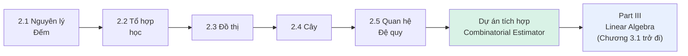

# MASTER COMPUTER SCIENCE HANDBOOK

## Volume 01 — Mathematics for Computer Science
### Part II — Discrete Mathematics
## Dự án tích hợp Part II — "Combinatorial Estimator"
### (Bộ ước lượng Tổ hợp)

---

### Thông tin dự án

| Trường | Giá trị |
|---|---|
| Thuộc Part | II — Discrete Mathematics *(dự án khép lại Part)* |
| Thuộc Volume | 01 — Mathematics for Computer Science |
| Thời gian ước tính | 3–5 giờ làm việc tập trung |
| Độ khó | ★★★☆☆ |
| Kiến thức tiên quyết | Toàn bộ Chương 2.1 – 2.5 |
| Kỹ năng được tích hợp | Nguyên lý đếm (2.1), Tổ hợp học (2.2), Đồ thị (2.3), Cây (2.4), Quan hệ đệ quy (2.5) |

---

## Vì sao dự án này tồn tại

Năm chương vừa qua xây dựng một chuỗi công cụ đếm ngày càng mạnh: từ Quy tắc cộng/nhân đơn giản nhất, đến hoán vị/tổ hợp, đến các cấu trúc tổ hợp phức tạp (đồ thị, cây), và cuối cùng là quan hệ đệ quy — công cụ cho phép đếm những cấu trúc mà không công thức đóng trực tiếp nào có thể xử lý ngay từ đầu. Dự án này, giống Dự án tích hợp Part I, có đúng một mục tiêu: buộc bạn phối hợp các công cụ này trên những bài toán đếm có thật, đồng thời **luôn đối chiếu kết quả lý thuyết với brute-force enumeration bằng code** — đúng phương pháp luận đã xuyên suốt cả Part II.

> **💡 Insight**
> Nhiệm vụ 3 của dự án này đưa bạn quay lại chính xác điểm kết thúc của Chương 2.5: một bài toán đếm mà công cụ bạn vừa học (phương trình đặc trưng) **không** giải quyết được trực tiếp. Đây không phải một "lỗi" trong thiết kế dự án — nó là bài học quan trọng nhất của Part II: biết công cụ nào áp dụng được, và **quan trọng không kém, biết khi nào nó không áp dụng được**.

---

## Mục tiêu

Sau khi hoàn thành dự án, bạn có thể:

- Phân tích một bài toán đếm thực tế, xác định đúng công cụ nào (Quy tắc cộng/nhân, Nguyên lý bù trừ, hoán vị/tổ hợp, hay quan hệ đệ quy) phù hợp nhất.
- Tự suy ra quan hệ đệ quy từ một mô tả bài toán bằng lời, thay vì được cho sẵn.
- Đối chiếu công thức lý thuyết với brute-force enumeration để xác nhận độ chính xác, theo đúng phương pháp luận đã luyện tập xuyên suốt Part II.
- Nhận diện được ranh giới của các kỹ thuật đã học — cụ thể là khi nào một bài toán đếm vượt ra ngoài phạm vi phương trình đặc trưng tuyến tính.

---

## Yêu cầu

Dự án gồm ba nhiệm vụ. Nhiệm vụ 1 được giải đầy đủ làm chuẩn tham chiếu; Nhiệm vụ 2 và 3 dành cho bạn tự thực hiện.

---

### Nhiệm vụ 1 — Đếm không gian mật khẩu có ràng buộc *(Ví dụ mẫu — đã giải đầy đủ)*

**Đề bài:** Một hệ thống yêu cầu mật khẩu dài đúng 8 ký tự, chỉ gồm chữ cái thường (26 chữ) và chữ số (10 chữ số), nhưng **phải chứa ít nhất một chữ số**. Có bao nhiêu mật khẩu hợp lệ?

**Bước 1 — Nhận diện công cụ** (áp dụng Chương 2.1): đây là bài toán đếm có ràng buộc "ít nhất một" — dấu hiệu kinh điển cho thấy nên đếm bằng **phần bù (complement)**, thay vì đếm trực tiếp (đếm trực tiếp số chuỗi "có ít nhất 1 chữ số" khó hơn nhiều so với đếm số chuỗi "không có chữ số nào" rồi lấy phần bù).

**Bước 2 — Đếm tổng số chuỗi có thể** (Quy tắc nhân, Chương 2.1): mỗi trong 8 vị trí có $36$ lựa chọn độc lập ($26+10$):

$$\text{Tổng} = 36^8 = 2{.}821{.}109{.}907{.}456$$

**Bước 3 — Đếm số chuỗi KHÔNG có chữ số nào** (chỉ dùng 26 chữ cái, Quy tắc nhân):

$$\text{Không có chữ số} = 26^8 = 208{.}827{.}064{.}576$$

**Bước 4 — Áp dụng phần bù:**

$$\text{Có ít nhất 1 chữ số} = 36^8 - 26^8 = 2{.}612{.}282{.}842{.}880$$

**Kiểm chứng bằng code** (chạy thực tế): $2{.}821{.}109{.}907{.}456 - 208{.}827{.}064{.}576 = 2{.}612{.}282{.}842{.}880$ — khớp. Tỉ lệ mật khẩu hợp lệ trên tổng số: **92,60%**.

> **📌 Remember**
> Bước 1 (nhận diện dùng phần bù) là bước quan trọng nhất, không phải Bước 2–4 (chỉ là tính toán cơ học). Đây chính là kỹ năng cốt lõi mà dự án này rèn luyện: nhận diện đúng cấu trúc bài toán trước khi tính.

---

### Nhiệm vụ 2 — Đếm cấu hình trạng thái server không xung đột *(Bạn tự thực hiện)*

**Đề bài:** Một chuỗi $n$ server được nối tuần tự (server $i$ chỉ "liền kề" với server $i-1$ và $i+1$). Mỗi server được gán một trong $k$ trạng thái vận hành khác nhau (ví dụ: "Active", "Standby", "Maintenance" nếu $k=3$). Ràng buộc: **hai server liền kề không được cùng trạng thái** (để tránh một lỗi cấu hình giả định gây xung đột). Có bao nhiêu cách gán trạng thái hợp lệ cho toàn bộ chuỗi $n$ server?

**Việc cần làm:**

1. Mô hình hóa bài toán này như một bài toán tô màu trên đồ thị (Chương 2.3) — cụ thể là đồ thị nào? (Gợi ý: chuỗi $n$ server liền kề chính là loại đồ thị đơn giản nhất bạn đã học ở Chương 2.3.)
2. Xây dựng **quan hệ đệ quy** cho $a_n$ = số cách gán trạng thái hợp lệ cho $n$ server, với $k$ trạng thái cho trước. *(Gợi ý: xét server cuối cùng — nó có bao nhiêu lựa chọn hợp lệ, phụ thuộc vào trạng thái của server ngay trước nó?)*
3. Giải quan hệ đệ quy này bằng **phương trình đặc trưng** (Chương 2.5) — hoặc nhận ra nó đủ đơn giản để suy ra công thức đóng trực tiếp bằng Quy tắc nhân (Chương 2.1), rồi *xác nhận* công thức đó thỏa mãn quan hệ đệ quy vừa xây dựng ở bước 2.
4. Viết code brute-force (dùng `itertools.product`, đúng phương pháp đã luyện tập xuyên suốt Part II) để đối chiếu công thức của bạn với ít nhất 5 cặp giá trị $(n,k)$ khác nhau.

*(Gợi ý kiểm tra kết quả: nếu công thức bạn suy ra là $a_n = k(k-1)^{n-1}$, hãy tự kiểm tra bằng brute-force trước khi xem đây là gợi ý xác nhận, không phải lời giải đầy đủ — bạn vẫn cần tự trình bày đầy đủ Bước 1–3.)*

---

### Nhiệm vụ 3 — Đếm hình dạng cây, và khám phá ranh giới của công cụ *(Bạn tự thực hiện — nhiệm vụ khám phá)*

**Đề bài:** Xét cây nhị phân có gốc, có thứ tự (mỗi đỉnh trong có đúng 2 con, phân biệt trái/phải — đúng khái niệm đã gặp ở Chương 2.4). Gọi $C_n$ là số **hình dạng khác nhau** (không xét nhãn — chỉ xét cấu trúc trái/phải) của cây có đúng $n$ đỉnh trong.

**Việc cần làm:**

1. Tự liệt kê bằng tay (vẽ hoặc mô tả) toàn bộ hình dạng có thể cho $C_0, C_1, C_2, C_3$ (gợi ý: $C_0=1$ ứng với cây rỗng, chỉ có 1 lá; $C_1=1$; hãy tự vẽ và đếm $C_2, C_3$).
2. Xây dựng quan hệ đệ quy cho $C_n$ bằng cách xét gốc cây: nếu cây con trái có $i$ đỉnh trong, cây con phải có bao nhiêu đỉnh trong (theo $n$ và $i$)? Số cách xây dựng ứng với mỗi cách chia $i$ là bao nhiêu, và bạn cần cộng dồn qua bao nhiêu giá trị $i$ khác nhau?
3. **Thử áp dụng khuôn mẫu 6 bước ở Chương 2.5, Mục 8** cho quan hệ đệ quy vừa xây dựng. Ghi lại chính xác bước nào thất bại, và giải thích bằng lời tại sao (đối chiếu Common Mistake, Chương 2.5, Mục 6).
4. Viết code brute-force đếm $C_n$ cho $n$ từ 0 đến 6 bằng cách sinh và đếm trực tiếp mọi hình dạng cây có thể (không dùng công thức đóng). Đối chiếu kết quả với công thức Catalan đã cho ở Chương 2.5, Mục 12: $C_n = \frac{1}{n+1}\binom{2n}{n}$.

> **⚠️ Common Mistake**
> Nhiệm vụ này được thiết kế có chủ đích để bạn **thất bại đúng cách** ở bước 3 — mục tiêu không phải là "giải được" quan hệ đệ quy bằng phương trình đặc trưng (điều đó là bất khả thi với công cụ đã học), mà là *nhận diện chính xác* vì sao nó bất khả thi, và biết cách xác minh một công thức đóng đã cho bằng phương pháp khác (brute-force + thay số trực tiếp) khi phương pháp suy luận trực tiếp chưa có sẵn trong tay bạn.

---

## Công cụ đề xuất

- Python với `itertools` (`product`, `combinations`) cho mọi phần brute-force enumeration.
- `math.comb`, `math.perm` cho tính toán tổ hợp trực tiếp.
- Tái sử dụng các hàm đã xây dựng xuyên suốt Chương 2.1–2.5 (`is_tree`, `count_labeled_trees_bruteforce`, các hàm truy hồi) — không cần viết lại từ đầu.

---

## Kết quả kỳ vọng

Một tài liệu (markdown hoặc PDF) gồm:

1. Lời giải đầy đủ cho cả ba nhiệm vụ, trình bày theo đúng cấu trúc "nhận diện công cụ → xây dựng công thức/quan hệ đệ quy → giải hoặc xác minh → đối chiếu code".
2. Đoạn code brute-force cho Nhiệm vụ 2 và 3, cùng bảng đối chiếu kết quả.
3. Một đoạn phản tư ngắn (3–5 câu) về trải nghiệm ở Nhiệm vụ 3: cảm giác "thất bại đúng cách" khi công cụ đã học không áp dụng được có gì khác so với việc chỉ đơn giản mắc lỗi tính toán?

---

## Tiêu chí đánh giá (Rubric)

| Tiêu chí | Yêu cầu đạt chuẩn |
|---|---|
| Nhận diện đúng công cụ | Mỗi nhiệm vụ xác định rõ ràng, ngay từ đầu, công cụ nào trong 5 chương sẽ được dùng, và vì sao |
| Xây dựng quan hệ đệ quy chính xác (Nhiệm vụ 2–3) | Quan hệ đệ quy phản ánh đúng lập luận đếm bằng lời (xét trường hợp cuối/gốc), không chỉ "đoán" công thức |
| Đối chiếu thực nghiệm | Mọi công thức/quan hệ đệ quy đều được kiểm chứng bằng code brute-force cho ít nhất 5 giá trị, đúng phương pháp luận Part II |
| Nhận diện ranh giới công cụ (Nhiệm vụ 3) | Giải thích chính xác, cụ thể (không mơ hồ) vì sao quan hệ đệ quy Catalan không phải dạng tuyến tính hệ số hằng |

---

## Hướng mở rộng

- **Nhiệm vụ 4 (tự thiết kế):** tìm một bài toán đếm từ chính công việc của bạn (ví dụ: số cấu hình quyền truy cập hợp lệ, số tổ hợp test case cần chạy với các ràng buộc phụ thuộc) và tự áp dụng quy trình 5 chương của Part II.
- **Mở rộng kỹ thuật (nâng cao):** với Nhiệm vụ 3, thử tìm hiểu (đọc thêm, không bắt buộc chứng minh) về hàm sinh (generating functions) — công cụ thực sự giải được quan hệ đệ quy Catalan, đã được nhắc đến như hướng đọc mở rộng ở Chương 2.5, Mục 20.

---

## Kết thúc Part II

Với dự án này, **Part II — Discrete Mathematics** hoàn tất.

Với việc hoàn thành cả Part I và Part II, **Volume 01** đã đi được **2/7 Part** theo đặc tả đã đóng băng. Part III — Linear Algebra sẽ chuyển trọng tâm từ đếm rời rạc sang không gian vector và ma trận — ngôn ngữ trực tiếp của embedding và weight matrix trong AI hiện đại (Volume 5). Đáng chú ý, một sợi dây đã được gieo sẵn ở Chương 2.4 (Định lý Ma trận-Cây của Kirchhoff) — Part III sẽ là nơi sợi dây đó lần đầu tiên có đủ công cụ để được kéo căng trở lại.

---

*Hết Dự án tích hợp Part II. Tài liệu này khép lại Part II — Discrete Mathematics, tổng hợp toàn bộ Chương 2.1–2.5 theo đúng đặc tả outline đã đóng băng ("Combinatorial Estimator" — đếm chính xác, giải quan hệ đệ quy, xác minh bằng brute-force enumeration). Nhiệm vụ 1 được giải đầy đủ làm chuẩn tham chiếu chất lượng; Nhiệm vụ 2 để ngỏ cho người học tự thực hiện; Nhiệm vụ 3 cố tình thiết kế để người học "thất bại đúng cách" và học được ranh giới của công cụ vừa xây dựng, tiếp nối trực tiếp bài học đóng chương của Chương 2.5. Đang chờ rà soát trước khi tiếp tục sang Part III — Linear Algebra.*
