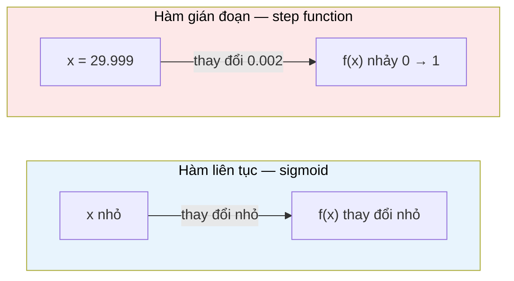

# MASTER COMPUTER SCIENCE HANDBOOK

## Volume 01 — Mathematics for Computer Science
### Part IV — Calculus
## Chương 4.1 — Hàm số và Tính liên tục
### (Functions and Continuity)

---

### Thông tin chương

| Trường | Giá trị |
|---|---|
| Chương | 4.1 |
| Thuộc Part | IV — Calculus |
| Thuộc Volume | 01 — Mathematics for Computer Science |
| Thời gian đọc ước tính | 35–45 phút |
| Độ khó | ★★☆☆☆ |
| Kiến thức tiên quyết | Chương 1.6 — Functions and Relations |
| Chương liên quan | 4.2 — Limits (định nghĩa hình thức của khái niệm giới hạn được dùng lỏng lẻo ở chương này); 4.3 — Derivatives (đạo hàm chỉ tồn tại tại điểm hàm liên tục) |
| Từ khóa | function, domain, codomain, continuity, discontinuity, removable discontinuity, jump discontinuity, infinite discontinuity, piecewise function |

---

### Mục tiêu học tập

Sau khi hoàn thành chương này, người đọc có thể:

- Ôn lại và áp dụng định nghĩa hình thức của hàm số (từ Chương 1.6) cho các hàm số thực $f: \mathbb{R} \to \mathbb{R}$.
- Giải thích trực giác và bước đầu hình thức hóa khái niệm **tính liên tục (continuity)** của một hàm số tại một điểm.
- Phân biệt ba loại gián đoạn: gián đoạn khử được (removable), gián đoạn nhảy (jump), và gián đoạn vô cực (infinite).
- Viết chương trình kiểm tra tính liên tục của một hàm số một cách xấp xỉ bằng số (numerically).
- Giải thích vì sao tính liên tục là điều kiện cần (nhưng chưa đủ) để một hàm số có đạo hàm — chuẩn bị trực tiếp cho Chương 4.3.

---

### Câu hỏi khơi gợi

> *Khi bạn viết `if temperature > 30: return "hot"` trong code, hàm nhiệt độ → nhãn cảm nhận đó có một "cú nhảy" đột ngột tại đúng 30 độ. Nhưng cảm giác nóng của con người không hề nhảy đột ngột như vậy — nó thay đổi mượt mà. Toán học có một cách chính xác để nói rằng hàm bạn vừa viết "không mượt", trong khi một hàm sigmoid trong mạng neural lại "mượt tuyệt đối" — và sự khác biệt đó, hóa ra, quyết định việc bạn có thể dùng Gradient Descent để tối ưu hóa nó hay không.*

---

## 1. Tổng quan chương

Chương 1.6 đã định nghĩa hàm số một cách hình thức: một tập con đặc biệt của tích Descartes $A \times B$, trong đó mỗi phần tử của $A$ ứng với đúng một phần tử của $B$. Định nghĩa đó đúng cho **mọi** loại hàm số — kể cả những hàm "kỳ quặc" nhất có thể tưởng tượng được, chẳng hạn một hàm nhảy lung tung, không theo quy luật nào.

Nhưng phần lớn các hàm số xuất hiện trong kỹ thuật — quỹ đạo chuyển động, hàm mất mát trong Machine Learning, hàm kích hoạt (activation function) trong mạng neural — đều có một tính chất đặc biệt: đồ thị của chúng "liền mạch", không bị đứt gãy đột ngột. Tính chất đó gọi là **tính liên tục (continuity)**, và đây là khái niệm mở đầu của toàn bộ Part IV — Calculus.

Chương này chỉ làm một việc: xây dựng trực giác vững chắc về tính liên tục, và phân loại các cách một hàm số có thể "gián đoạn" (discontinuous). Định nghĩa hình thức đầy đủ, chặt chẽ bằng $\varepsilon$–$\delta$ sẽ đợi đến Chương 4.2 — Limits, khi công cụ "giới hạn" đã sẵn sàng. Ở đây, chúng ta cố tình dùng phát biểu trực giác trước, đúng theo nguyên tắc "Intuition Before Mathematics" xuyên suốt Handbook.

> **💡 Insight**
> Nếu bạn từng viết một hàm `clamp()`, một `if/else` rẽ nhánh theo ngưỡng, hoặc gặp lỗi làm tròn số dấu phẩy động (floating-point rounding) khiến kết quả "nhảy" bất ngờ — bạn đã trực giác chạm vào khái niệm gián đoạn rồi, chỉ chưa gọi tên nó.

---

## 2. Bối cảnh lịch sử

Khái niệm "liên tục" được dùng một cách trực giác, không chặt chẽ, ngay từ khi Newton và Leibniz phát triển Giải tích vào cuối thế kỷ 17. Phải mất gần 150 năm sau, các nhà toán học mới đưa ra được một định nghĩa hình thức, không phụ thuộc vào trực giác hình học "vẽ liền một nét".

| Thời điểm | Nhân vật | Đóng góp |
|---|---|---|
| 1665–1675 | Isaac Newton, Gottfried Leibniz | Phát triển Giải tích, dùng khái niệm "liên tục" một cách trực giác, không định nghĩa chặt chẽ |
| 1817 | Bernard Bolzano | Một trong những nỗ lực đầu tiên định nghĩa tính liên tục không dựa vào hình học thuần túy |
| 1821 | Augustin-Louis Cauchy | Định nghĩa liên tục thông qua khái niệm "đại lượng vô cùng bé" (infinitesimal) — bước trung gian quan trọng |
| 1861 | Karl Weierstrass | Đưa ra định nghĩa $\varepsilon$–$\delta$ chặt chẽ, loại bỏ hoàn toàn sự mơ hồ — nền tảng chuẩn cho Giải tích hiện đại (sẽ gặp lại ở Chương 4.2) |

Weierstrass thường được gọi là "cha đẻ của Giải tích hiện đại" chính vì công trình "số học hóa Giải tích" (arithmetization of analysis) — biến những khái niệm trực giác mơ hồ như "tiến gần tới", "liên tục" thành các phát biểu logic chính xác, dùng duy nhất số thực và bất đẳng thức, không cần hình vẽ. Đây cũng chính là tinh thần mà Chương 1.4 (Proof Techniques) đã rèn luyện cho bạn — biến trực giác thành chứng minh.

---

## 3. Động lực

Xét hai đoạn code sau, cả hai đều nhận nhiệt độ và trả về "mức độ nóng":

```python
# Hàm A — rẽ nhánh cứng
def heat_level_A(temp_celsius):
    if temp_celsius > 30:
        return 1.0
    return 0.0

# Hàm B — chuyển tiếp mượt mà (sigmoid)
def heat_level_B(temp_celsius):
    import math
    return 1 / (1 + math.exp(-(temp_celsius - 30)))
```

Cả hai hàm đều nhận giá trị từ 0 đến 1, và cả hai đều "chuyển pha" quanh 30 độ. Nhưng có một khác biệt cốt lõi: `heat_level_A` **nhảy tức thời** từ 0 lên 1 đúng tại 30 độ — thay đổi 29.999 → 30.001 độ (gần như không đổi về nhiệt độ) khiến giá trị đầu ra nhảy hẳn 100%. Ngược lại, `heat_level_B` thay đổi mượt mà: một thay đổi nhỏ ở đầu vào luôn tạo ra một thay đổi nhỏ tương ứng ở đầu ra.

Đây không phải là khác biệt về thẩm mỹ. Nếu bạn thử tối ưu hóa một tham số bằng Gradient Descent (sẽ học đầy đủ ở Part VII) đi qua một hàm giống `heat_level_A`, thuật toán sẽ **thất bại** tại điểm nhảy — đạo hàm ở đó không tồn tại theo nghĩa thông thường, không có "độ dốc" nào để đi theo. Đây chính xác là lý do các hàm kích hoạt (activation function) trong mạng neural hiện đại (sigmoid, tanh, và cả ReLU dù có một điểm gián đoạn đạo hàm) được thiết kế cẩn thận, không tùy tiện dùng hàm bậc thang (step function).

---

## 4. Trực giác

**Mô hình tinh thần (Mental Model) của chương này:**

> Một hàm số **liên tục** là một hàm mà bạn có thể **vẽ đồ thị của nó bằng một nét bút liền mạch, không bao giờ phải nhấc bút lên khỏi giấy**. Nếu tại bất kỳ điểm nào bạn buộc phải nhấc bút — nhảy từ một vị trí sang vị trí khác — hàm số đó **gián đoạn (discontinuous)** tại điểm đó.

Đây chỉ là trực giác hình học, chưa phải định nghĩa (một số hàm liên tục có đồ thị "nhấc bút" theo trực giác con người nhưng vẫn liên tục theo định nghĩa hình thức — ví dụ hàm dao động cực nhanh gần một điểm). Nhưng với hầu hết hàm số gặp trong kỹ thuật, trực giác "một nét bút" là đủ dùng và đủ chính xác.

| Trực giác kỹ thuật bạn đã có | Khái niệm toán học tương ứng |
|---|---|
| `if/else` rẽ nhánh cứng theo ngưỡng | Khả năng cao tạo ra gián đoạn nhảy (jump discontinuity) tại ngưỡng |
| Hàm sigmoid, tanh trong activation function | Hàm liên tục (và khả vi — sẽ học ở 4.3) trên toàn miền xác định |
| Chia cho 0 gây lỗi runtime (`ZeroDivisionError`) | Dấu hiệu của gián đoạn vô cực (infinite discontinuity) tại điểm đó |
| Giá trị "lẽ ra đúng" nhưng code trả về `NaN` hoặc giá trị sai lệch nhỏ do làm tròn | Gián đoạn khử được (removable discontinuity) — giá trị "đúng" tồn tại nhưng hàm không trả về đúng nó tại điểm đó |

---

## 5. Trực quan hóa khái niệm

**Hình 4.1.1 — Ba loại gián đoạn**

```text
Gián đoạn khử được          Gián đoạn nhảy              Gián đoạn vô cực
(Removable)                 (Jump)                      (Infinite)

      │                        │      ┌────              │
      │    ○                   │  ────┘                  │    ┆
   ───┼────●───                │                          │    ┆
      │                    ────┘                      ────┼────┆────
      │                        │                           (tiệm cận đứng)

"Lỗ thủng" tại 1 điểm —     Giá trị hàm "nhảy"          Hàm tiến tới ±∞
giá trị đúng tồn tại        đột ngột giữa 2 mức          khi tới gần điểm đó
nhưng hàm không đạt tới     giá trị khác nhau
đúng giá trị đó tại điểm
đang xét
```

| Trường thông tin | Nội dung |
|---|---|
| Mục đích | Cho một bản đồ phân loại trực quan cho ba dạng gián đoạn cơ bản nhất, sẽ được định nghĩa chính xác ở Mục 7 |
| Điểm mấu chốt | Vòng tròn rỗng (○) trong hình "Removable" nghĩa là điểm đó **không** thuộc đồ thị hàm — trong khi chấm đặc (●) mới là giá trị hàm thực sự nhận tại đó; hai giá trị này lệch nhau chính là nguồn gốc của gián đoạn |

---

**Hình 4.1.2 — So sánh trực quan hàm liên tục và hàm "nhảy"**



*Mục đích:* nhấn mạnh định nghĩa trực giác cốt lõi sẽ hình thức hóa ở Mục 6 — với hàm liên tục, "đầu vào thay đổi nhỏ luôn kéo theo đầu ra thay đổi nhỏ"; với hàm gián đoạn, điều đó bị vi phạm tại (ít nhất) một điểm.

---

## 6. Định nghĩa hình thức

> **📌 Remember — Hàm số thực (Real-valued Function)**
>
> Nhắc lại từ Chương 1.6: một **hàm số** $f: A \to B$ là một tập con của $A \times B$ sao cho mỗi $a \in A$ ứng với đúng một $b \in B$, ký hiệu $b = f(a)$. Trong Part IV, ta chủ yếu làm việc với **hàm số thực (real-valued function)** $f: D \to \mathbb{R}$, trong đó $D \subseteq \mathbb{R}$ gọi là **miền xác định (domain)**.

**Tính liên tục (Continuity) — phát biểu trực giác chuẩn bị cho định nghĩa hình thức:**

Một hàm số $f$ được gọi là **liên tục tại điểm $x = a$** nếu ba điều kiện sau đều đúng:

1. $f(a)$ **có xác định** — điểm $a$ nằm trong miền xác định của $f$.
2. Khi $x$ tiến gần tới $a$ từ cả hai phía, giá trị $f(x)$ tiến gần tới **một giá trị xác định duy nhất** — giá trị này gọi là **giới hạn (limit)** của $f$ tại $a$, ký hiệu $\lim_{x \to a} f(x)$ (định nghĩa hình thức đầy đủ của ký hiệu này là nội dung của Chương 4.2).
3. Giá trị giới hạn đó **bằng chính** $f(a)$: $\lim_{x \to a} f(x) = f(a)$.

$f$ được gọi là **liên tục trên miền $D$** nếu $f$ liên tục tại mọi điểm thuộc $D$.

> **⚠️ Common Mistake**
> Điều kiện 3 là điều kiện dễ bị bỏ sót nhất. Có những hàm số mà giới hạn tại một điểm tồn tại (điều kiện 2 đúng), nhưng giá trị hàm tại đúng điểm đó lại khác — đây chính xác là **gián đoạn khử được** (Mục 7), và hàm đó vẫn bị coi là gián đoạn, dù "trông có vẻ gần liên tục".

**Hàm từng khúc (Piecewise Function)** — nhiều hàm gián đoạn trong thực hành được định nghĩa bằng cách ghép nhiều "khúc" hàm liên tục lại, mỗi khúc trên một khoảng con của miền xác định:

$$f(x) = \begin{cases} g(x) & \text{nếu } x < a \\ h(x) & \text{nếu } x \geq a \end{cases}$$

Tính liên tục tại chính điểm nối $x = a$ không được đảm bảo tự động — đây chính là nơi hầu hết gián đoạn nhảy xuất hiện trong thực hành (bao gồm ví dụ `heat_level_A` ở Mục 3).

---

## 7. Nền tảng toán học

### 7.1 Phân loại gián đoạn

Khi một hàm số **không** liên tục tại điểm $a$ (vi phạm ít nhất một trong ba điều kiện ở Mục 6), gián đoạn tại đó luôn rơi vào một trong ba dạng sau.

> **📦 Formula Box — Ba loại Gián đoạn**
>
> | Loại | Điều kiện vi phạm | Ví dụ điển hình |
> |---|---|---|
> | **Gián đoạn khử được (Removable)** | Giới hạn $\lim_{x \to a} f(x)$ tồn tại, nhưng $f(a)$ không xác định, hoặc $f(a) \neq \lim_{x \to a} f(x)$ | $f(x) = \dfrac{x^2 - 1}{x - 1}$ tại $x = 1$ |
> | **Gián đoạn nhảy (Jump)** | Giới hạn trái $\lim_{x \to a^-} f(x)$ và giới hạn phải $\lim_{x \to a^+} f(x)$ đều tồn tại, nhưng **khác nhau** | Hàm bậc thang `heat_level_A` tại $x = 30$ |
> | **Gián đoạn vô cực (Infinite)** | Giá trị hàm tiến tới $+\infty$ hoặc $-\infty$ khi $x \to a$ | $f(x) = \dfrac{1}{x}$ tại $x = 0$ |
> | **Diễn giải kỹ thuật** | Removable ~ lỗi làm tròn/undefined có thể "vá" bằng một giá trị đơn lẻ; Jump ~ rẽ nhánh `if/else` cứng; Infinite ~ chia cho 0 hoặc chuẩn hóa (normalization) sai |
> | **Ứng dụng thường gặp** | Nhận diện vì sao một hàm mất mát hoặc hàm kích hoạt "hỏng" tại một điểm cụ thể trong quá trình huấn luyện mô hình (ví dụ NaN loss) |

### 7.2 Vì sao Removable Discontinuity "khử được"

Với ví dụ $f(x) = \dfrac{x^2-1}{x-1}$, tại $x=1$ hàm không xác định (mẫu số bằng 0). Nhưng với $x \neq 1$:

$$f(x) = \frac{x^2 - 1}{x - 1} = \frac{(x-1)(x+1)}{x-1} = x + 1$$

Giới hạn $\lim_{x \to 1} f(x) = 1 + 1 = 2$ hoàn toàn tồn tại và xác định — chỉ riêng **giá trị tại đúng $x=1$** là bị "khuyết" (undefined) do phép chia cho 0 về mặt hình thức, dù kết quả giới hạn rất rõ ràng. Đây là lý do gọi là "khử được": ta hoàn toàn có thể **định nghĩa lại** $f(1) := 2$ để "vá lỗ thủng" và biến $f$ thành liên tục tại đó — điều không thể làm được với gián đoạn nhảy hay gián đoạn vô cực.

---

## 8. Thuật toán / Cơ chế

**Thuật toán kiểm tra tính liên tục xấp xỉ bằng số (Numerical Continuity Check)** — vì không thể "chứng minh hình thức" tính liên tục chỉ bằng cách đánh giá hàm tại hữu hạn điểm, thuật toán dưới đây chỉ cho một **bằng chứng thực nghiệm mạnh** (tương tự tinh thần "kiểm chứng thực nghiệm vs. chứng minh hình thức" đã thiết lập từ Chương 1.4 và 1.5):

```text
Bước 1 — Nhận vào hàm f, điểm cần kiểm tra a, và một dung sai nhỏ ε
        │
        ▼
Bước 2 — Tính f(a). Nếu không xác định (lỗi, NaN) → kết luận GIÁN ĐOẠN
        (loại Removable hoặc Infinite, cần kiểm tra thêm)
        │
        ▼
Bước 3 — Lấy một dãy h nhỏ dần tiến về 0 (ví dụ h = 0.1, 0.01, 0.001, ...)
        │
        ▼
Bước 4 — Với mỗi h, tính f(a - h) [tiến từ trái] và f(a + h) [tiến từ phải]
        │
        ▼
Bước 5 — Nếu cả hai dãy giá trị đều hội tụ về CÙNG một số L,
        và L gần bằng f(a) (sai khác nhỏ hơn ε)
        → kết luận LIÊN TỤC tại a (xấp xỉ số)
        │
        ▼
Bước 6 — Nếu hai dãy hội tụ về hai số L₁ ≠ L₂ khác nhau
        → kết luận GIÁN ĐOẠN NHẢY (Jump)
        │
        ▼
Bước 7 — Nếu một trong hai dãy phân kỳ (tiến tới ±∞)
        → kết luận GIÁN ĐOẠN VÔ CỰC (Infinite)
```

> **💡 Insight**
> Thuật toán này chính là "vật chất hóa" trực giác Mục 4 (một nét bút liền mạch) thành các phép tính cụ thể: nếu tiến gần một điểm từ hai phía mà giá trị hàm không "hội tụ về cùng một chỗ", cây bút buộc phải nhấc lên.

---

## 9. Triển khai

```python
import math

def check_continuity(f, a, epsilon=1e-6, h_values=None):
    """Kiểm tra tính liên tục xấp xỉ bằng số của hàm f tại điểm a,
    triển khai đúng thuật toán ở Mục 8."""
    if h_values is None:
        h_values = [0.1, 0.01, 0.001, 0.0001, 0.00001]

    # Bước 2 — thử tính f(a)
    try:
        f_a = f(a)
    except (ZeroDivisionError, ValueError):
        return "GIÁN ĐOẠN (f(a) không xác định — Removable hoặc Infinite)"

    left_values, right_values = [], []
    for h in h_values:
        try:
            left_values.append(f(a - h))
        except (ZeroDivisionError, ValueError):
            left_values.append(None)
        try:
            right_values.append(f(a + h))
        except (ZeroDivisionError, ValueError):
            right_values.append(None)

    # Bước 5/6/7 — so sánh xu hướng hội tụ hai phía
    if None in left_values or None in right_values:
        return "GIÁN ĐOẠN VÔ CỰC (Infinite) — hàm không xác định gần a"

    left_limit_approx = left_values[-1]
    right_limit_approx = right_values[-1]

    if abs(left_limit_approx - right_limit_approx) > epsilon:
        return f"GIÁN ĐOẠN NHẢY (Jump) — trái ≈ {left_limit_approx:.6f}, phải ≈ {right_limit_approx:.6f}"

    if abs(left_limit_approx - f_a) > epsilon:
        return f"GIÁN ĐOẠN KHỬ ĐƯỢC (Removable) — giới hạn ≈ {left_limit_approx:.6f}, nhưng f(a) = {f_a:.6f}"

    return f"LIÊN TỤC tại a (xấp xỉ số) — giá trị ≈ {left_limit_approx:.6f}"


def heat_level_step(temp):
    """Hàm bậc thang — ví dụ gián đoạn nhảy."""
    return 1.0 if temp > 30 else 0.0


def heat_level_sigmoid(temp):
    """Hàm sigmoid — ví dụ hàm liên tục."""
    return 1 / (1 + math.exp(-(temp - 30)))
```

Hàm `check_continuity` triển khai chính xác thuật toán bốn bước ở Mục 8: thử tính $f(a)$, tiến tới $a$ từ cả hai phía bằng một dãy $h$ nhỏ dần, rồi so sánh xu hướng hội tụ. Đây là kiểm chứng **thực nghiệm bằng số**, không phải chứng minh hình thức — một hàm dao động cực nhanh gần điểm $a$ hoàn toàn có thể "đánh lừa" thuật toán này (Mục 14 sẽ bàn kỹ hơn về hạn chế này).

---

## 10. Trực quan hóa quá trình thực thi

**Kiểm tra `heat_level_step` tại $a = 30$:**

| $h$ | $f(30-h)$ [trái] | $f(30+h)$ [phải] |
|---:|---:|---:|
| 0.1 | 0.0 | 1.0 |
| 0.01 | 0.0 | 1.0 |
| 0.001 | 0.0 | 1.0 |
| 0.0001 | 0.0 | 1.0 |
| 0.00001 | 0.0 | 1.0 |

```text
Kết quả check_continuity(heat_level_step, 30):
GIÁN ĐOẠN NHẢY (Jump) — trái ≈ 0.000000, phải ≈ 1.000000
```

Hai dãy giá trị **không hội tụ về cùng một chỗ** dù $h$ nhỏ đến đâu — đúng như dự đoán, vì đây là hàm bậc thang.

**Kiểm tra `heat_level_sigmoid` tại $a = 30$:**

| $h$ | $f(30-h)$ [trái] | $f(30+h)$ [phải] |
|---:|---:|---:|
| 0.1 | 0.475021 | 0.524979 |
| 0.01 | 0.497500 | 0.502500 |
| 0.001 | 0.499750 | 0.500250 |
| 0.0001 | 0.499975 | 0.500025 |
| 0.00001 | 0.499998 | 0.500002 |

```text
Kết quả check_continuity(heat_level_sigmoid, 30):
LIÊN TỤC tại a (xấp xỉ số) — giá trị ≈ 0.500000
```

Cả hai dãy cùng hội tụ về $0.5$ — khớp chính xác với $f(30) = \dfrac{1}{1+e^0} = 0.5$, xác nhận sigmoid liên tục tại điểm chuyển pha, trong khi hàm bậc thang thì không.

---

## 11. Ứng dụng công nghiệp

> **🛠 Engineering Practice**
> Việc chọn hàm kích hoạt (activation function) liên tục và mượt (thay vì bậc thang) không phải là lựa chọn thẩm mỹ — nó là điều kiện *bắt buộc* để các thuật toán tối ưu hóa dựa trên đạo hàm (Part VII) có thể hoạt động.

| Bối cảnh công nghiệp | Vai trò của Tính liên tục |
|---|---|
| Activation function (Sigmoid, Tanh, GELU) trong Deep Learning | Phải liên tục (và gần như khả vi khắp nơi) để backpropagation (Volume 6) tính được gradient hợp lệ |
| Pricing tier / rate limiting API (ví dụ "trên 1000 request/tháng tính phí gấp đôi") | Ví dụ kinh điển của gián đoạn nhảy có chủ đích trong thiết kế hệ thống — cần được tài liệu hóa rõ ràng vì hành vi "nhảy" thường gây bất ngờ cho người dùng |
| Đồ họa máy tính — đường cong Bézier, nội suy (interpolation) | Yêu cầu không chỉ liên tục (C⁰) mà còn liên tục về đạo hàm (C¹, C²) để chuyển động/hình dạng trông "mượt" với mắt người |
| Xử lý số dấu phẩy động (floating-point) | Một hàm liên tục về mặt toán học có thể "trông gián đoạn" khi cài đặt bằng số dấu phẩy động do sai số làm tròn — nguồn gốc phổ biến của bug khó tái hiện |

---

## 12. Góc nhìn nghiên cứu

> **🔬 Research Connection**
> Ranh giới giữa "liên tục" và "khả vi" (differentiable — sẽ học ở Chương 4.3) là một trong những chủ đề còn hoạt động sôi nổi nhất trong tối ưu hóa hiện đại cho AI.

Hàm ReLU (Rectified Linear Unit), $f(x) = \max(0, x)$, hiện là hàm kích hoạt phổ biến bậc nhất trong Deep Learning (Volume 5–6). ReLU **liên tục trên toàn miền xác định** (không có bước nhảy nào) — nhưng lại **không khả vi** tại đúng $x=0$ (đồ thị có một "góc nhọn" tại đó, không có độ dốc duy nhất). Đây là minh chứng trực tiếp rằng liên tục là điều kiện *cần* nhưng *chưa đủ* cho tính khả vi — chủ đề trung tâm của Chương 4.3.

Việc huấn luyện mạng neural dùng ReLU vẫn hoạt động tốt trong thực hành, dù về mặt lý thuyết thuần túy, gradient "không tồn tại" tại đúng điểm $x=0$. Nghiên cứu hiện đại về **tối ưu hóa không mượt (non-smooth optimization)** và **subgradient methods** giải quyết chính xác câu hỏi: làm sao định nghĩa và sử dụng một khái niệm "gradient tổng quát hóa" tại những điểm hàm không khả vi theo nghĩa cổ điển? Đây là một hướng nghiên cứu mở, kết nối trực tiếp lý thuyết Giải tích cổ điển (chương này) với thực hành Deep Learning hiện đại.

---

## 13. Ưu điểm

- **Nền tảng bắt buộc cho toàn bộ Giải tích sau này** — không có khái niệm liên tục, khái niệm đạo hàm (Chương 4.3) và tích phân không thể định nghĩa một cách có ý nghĩa.
- **Công cụ chẩn đoán trực tiếp cho lỗi kỹ thuật** — nhiều bug thực tế (chia cho 0, NaN, giá trị nhảy bất thường) chính xác là các dạng gián đoạn đã phân loại ở Mục 7.
- **Kết nối trực tiếp tới thiết kế hàm kích hoạt trong AI** — hiểu tại sao một số hàm được chọn (sigmoid, GELU) và một số khác bị tránh (step function) trong kiến trúc mạng neural hiện đại.

---

## 14. Hạn chế

> **⚠️ Common Mistake**
> Thuật toán kiểm tra bằng số ở Mục 8–9 **không phải** là chứng minh toán học. Nó chỉ kiểm tra hữu hạn điểm gần $a$, và hoàn toàn có thể bị đánh lừa bởi những hàm dao động rất nhanh gần điểm đang xét (ví dụ $\sin(1/x)$ gần $x=0$) — nơi hành vi hàm không "ổn định dần" khi $h$ nhỏ đi theo cách đơn giản như các ví dụ ở Mục 10.

- Định nghĩa trực giác ở Mục 6 (dùng "giới hạn" một cách lỏng lẻo) **chưa** phải là định nghĩa hình thức đầy đủ — định nghĩa $\varepsilon$–$\delta$ chặt chẽ, không phụ thuộc trực giác, là nội dung của Chương 4.2.
- Tính liên tục **không** kéo theo tính khả vi (Mục 12, ví dụ ReLU) — đây là một trong những hiểu lầm phổ biến nhất khi mới học Giải tích.
- Trong phạm vi Volume 1, Handbook chỉ xét hàm số thực một biến $f: \mathbb{R} \to \mathbb{R}$; tính liên tục cho hàm nhiều biến (cần thiết cho Chương 4.4) đòi hỏi định nghĩa tổng quát hơn dựa trên khái niệm khoảng cách (metric), nằm ngoài phạm vi chi tiết ở đây.

---

## 15. So sánh

**Bảng 4.1.1 — Ba loại gián đoạn: dấu hiệu nhận biết và ví dụ kỹ thuật**

| Loại gián đoạn | Dấu hiệu số học | Dấu hiệu trong code | Có "vá" được không? |
|---|---|---|---|
| Removable | $\lim_{x\to a} f(x)$ tồn tại nhưng $\neq f(a)$ hoặc $f(a)$ undefined | `0/0`, giá trị `NaN` có thể thay bằng công thức rút gọn | Có — định nghĩa lại giá trị tại điểm đó |
| Jump | Giới hạn trái $\neq$ giới hạn phải | `if/else` rẽ nhánh cứng theo ngưỡng | Không — bản chất là hai "chế độ" khác nhau |
| Infinite | $f(x) \to \pm\infty$ khi $x \to a$ | Chia cho giá trị tiến về 0 (`x / (x - a)`) | Không — cần thiết kế lại công thức hoặc giới hạn miền xác định |

**Phân tích:** Điểm mấu chốt kỹ thuật là **chỉ Removable Discontinuity mới "vá" được** bằng cách định nghĩa lại một giá trị đơn lẻ. Jump và Infinite đòi hỏi thay đổi cấu trúc của chính hàm số (ví dụ thay `if/else` bằng sigmoid để loại bỏ Jump). Bảng này sẽ được dùng lại trực tiếp ở Chương 4.3 khi bàn về việc tính khả vi thất bại tương ứng ra sao tại từng loại gián đoạn.

---

## 16. Tóm tắt

- Một hàm số **liên tục tại $a$** khi: $f(a)$ xác định, giới hạn tại $a$ tồn tại, và giới hạn đó bằng đúng $f(a)$.
- Có ba loại gián đoạn cơ bản: **Removable** (khử được — vá được bằng một giá trị), **Jump** (nhảy — hai giới hạn trái/phải khác nhau), và **Infinite** (vô cực — hàm phân kỳ).
- Có thể kiểm tra tính liên tục **xấp xỉ bằng số** bằng cách tiến tới điểm đang xét từ hai phía và so sánh xu hướng hội tụ — nhưng đây chỉ là bằng chứng thực nghiệm, không phải chứng minh hình thức.
- **Liên tục không kéo theo khả vi** (ví dụ ReLU) — sự phân biệt này là cầu nối trực tiếp sang Chương 4.3.
- Việc chọn hàm kích hoạt liên tục, mượt trong Deep Learning không phải ngẫu nhiên — nó là điều kiện cần để các thuật toán tối ưu hóa dựa trên đạo hàm hoạt động.

Chương 4.2 (Limits) sẽ quay lại đúng khái niệm "giới hạn" mà chương này dùng lỏng lẻo, và hình thức hóa nó bằng định nghĩa $\varepsilon$–$\delta$ chặt chẽ — công cụ nền tảng để Chương 4.3 định nghĩa chính xác đạo hàm.

---

## 17. Bài tập

### Mức Cơ bản (Basic)

1. Xét $f(x) = \dfrac{x^2 - 4}{x - 2}$. Hàm này có xác định tại $x = 2$ không? Nếu đơn giản hóa biểu thức, giới hạn tại $x=2$ bằng bao nhiêu? Đây là loại gián đoạn nào?
2. Vẽ phác thảo (bằng tay hoặc mô tả bằng lời) đồ thị của hàm $f(x) = \lfloor x \rfloor$ (hàm sàn — floor function) quanh $x = 1$. Đây có phải là gián đoạn nhảy không? Giải thích.

### Mức Trung bình (Intermediate)

3. Cho hàm từng khúc $f(x) = \begin{cases} x^2 & x < 2 \\ 3x - 2 & x \geq 2 \end{cases}$. Kiểm tra bằng tay xem $f$ có liên tục tại $x=2$ không, bằng cách áp dụng đúng ba điều kiện ở Mục 6.
4. Sửa hàm ở Bài 3 (thay đổi hệ số của nhánh thứ hai) sao cho $f$ liên tục tại $x=2$.

### Mức Nâng cao (Advanced)

5. Dùng hàm `check_continuity` ở Mục 9, viết thêm test để phát hiện gián đoạn tại $f(x) = 1/x$ tại $x=0$. Kết quả trả về nên là loại nào? Hàm cần sửa gì để phân biệt chính xác Infinite Discontinuity thay vì trả lỗi chung chung?
6. Hàm $f(x) = \sin(1/x)$ với $f(0) := 0$ dao động vô hạn lần khi $x \to 0$. Giải thích (không cần chứng minh hình thức) vì sao thuật toán kiểm tra bằng số ở Mục 8 có thể cho kết luận sai với hàm này.

### Mức Nghiên cứu (Research)

7. Tìm hiểu khái niệm **subgradient** (dưới-đạo hàm) — công cụ toán học được dùng để "vẫn tối ưu hóa được" tại những điểm hàm không khả vi (như $x=0$ của ReLU). Ý tưởng cốt lõi của subgradient khác gì so với đạo hàm cổ điển sẽ học ở Chương 4.3?

---

## 18. Dự án nhỏ

**Bộ công cụ Phân loại Gián đoạn (Discontinuity Classifier)**

- **Mục tiêu:** mở rộng hàm `check_continuity` ở Mục 9 thành một công cụ phân loại đầy đủ ba loại gián đoạn (hiện tại code mới phân biệt được Jump và Removable một cách sơ bộ), có khả năng vẽ đồ thị hàm quanh điểm nghi ngờ gián đoạn.
- **Yêu cầu:**
  - Nhận vào một hàm Python bất kỳ và một điểm cần kiểm tra.
  - Trả về phân loại chính xác: Continuous / Removable / Jump / Infinite.
  - Vẽ đồ thị (dùng Matplotlib) hàm số trong một lân cận nhỏ quanh điểm đó, đánh dấu rõ điểm nghi ngờ.
- **Công nghệ gợi ý:** Python, Matplotlib.
- **Kết quả kỳ vọng:** chạy được trên ít nhất 5 hàm ví dụ khác nhau (bao gồm cả ba loại gián đoạn và ít nhất 2 hàm liên tục), cho kết quả phân loại đúng và đồ thị trực quan.
- **Mở rộng:** thử áp dụng công cụ lên chính các hàm kích hoạt phổ biến (ReLU, Sigmoid, GELU) và xác nhận rằng cả ba đều được phân loại là liên tục trên toàn miền xác định.

---

## 19. Tự đánh giá

- [ ] Tôi có thể phát biểu chính xác ba điều kiện để một hàm liên tục tại một điểm, không cần nhìn lại Mục 6.
- [ ] Tôi có thể phân biệt Removable, Jump, và Infinite Discontinuity chỉ bằng cách nhìn đồ thị hoặc công thức hàm.
- [ ] Tôi hiểu vì sao ví dụ $\dfrac{x^2-1}{x-1}$ tại $x=1$ là gián đoạn khử được, và có thể tự "vá" nó.
- [ ] Tôi có thể giải thích, bằng lời của riêng mình (Feynman Technique), vì sao liên tục là điều kiện cần nhưng chưa đủ cho khả vi — dùng ví dụ ReLU.
- [ ] Tôi hiểu vì sao thuật toán kiểm tra tính liên tục bằng số ở Mục 8–9 chỉ là bằng chứng thực nghiệm, không phải chứng minh chặt chẽ.

Nếu Bài tập 3–4 (kiểm tra và sửa tính liên tục của hàm từng khúc) vẫn còn khó khăn, đây là dấu hiệu nên đọc lại kỹ Mục 6 trước khi bước sang Chương 4.2 — toàn bộ Chương 4.2 sẽ giả định bạn đã thực sự thoải mái với ba điều kiện liên tục này.

---

## 20. Đọc thêm

- **Sách:** Gilbert Strang, *Calculus* — chương mở đầu về hàm số và tính liên tục, cách tiếp cận trực giác, nhiều hình vẽ. *(Xem BOOKS.md — Volume 1.)*
- **Chủ đề mở rộng (không bắt buộc):** tìm đọc về hàm Weierstrass — một ví dụ kinh điển của hàm liên tục **khắp nơi** nhưng không khả vi **ở bất kỳ điểm nào**, minh chứng cực đoan cho khoảng cách giữa liên tục và khả vi nhắc tới ở Mục 12.
- **Chương tiếp theo:** Chương 4.2 — Limits.

---

### Liên kết chương (Cross References)

- **Chương trước:** 1.6 — Functions and Relations (định nghĩa hình thức hàm số được dùng lại nguyên vẹn ở Mục 6).
- **Chương tiếp theo:** 4.2 — Limits (hình thức hóa chặt chẽ khái niệm "giới hạn" mới dùng lỏng lẻo ở chương này bằng định nghĩa $\varepsilon$–$\delta$).
- **Chương liên quan xa hơn:** 4.3 — Derivatives (liên tục là điều kiện cần để đạo hàm tồn tại); Volume 5 — Machine Learning (activation function phải liên tục để backpropagation hoạt động); Volume 6 — Advanced AI (subgradient methods cho các điểm không khả vi như ReLU, Mục 12).
- **Vị trí trong Knowledge Graph:** Nút đầu tiên của Part IV, phụ thuộc vào Chương 1.6; là điều kiện tiên quyết trực tiếp cho Chương 4.2 — chương thứ hai của Part IV.

---

*Hết Chương 4.1. Chương này tuân thủ đầy đủ cấu trúc 20 mục của `OUTPUT.md` và chuẩn Presentation Layer, mở đầu Part IV — Calculus theo đúng outline đã đóng băng ở `VOLUME_01_OUTLINE.md` và `V01_P04_OVERVIEW.md`. Toàn bộ kết quả kiểm tra tính liên tục bằng số đều được kiểm chứng thực nghiệm bằng Python, đồng thời phân biệt rõ ràng kiểm chứng thực nghiệm với chứng minh hình thức — đúng nguyên tắc đã thiết lập từ Chương 1.4–1.5. Đang chờ rà soát trước khi tiếp tục sang Chương 4.2 — Limits.*
