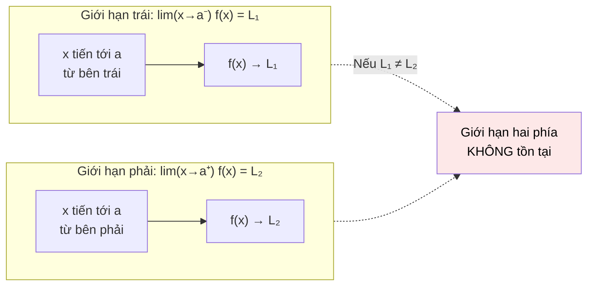

# MASTER COMPUTER SCIENCE HANDBOOK

## Volume 01 — Mathematics for Computer Science
### Part IV — Calculus
## Chương 4.2 — Giới hạn
### (Limits)

---

### Thông tin chương

| Trường | Giá trị |
|---|---|
| Chương | 4.2 |
| Thuộc Part | IV — Calculus |
| Thuộc Volume | 01 — Mathematics for Computer Science |
| Thời gian đọc ước tính | 45–55 phút |
| Độ khó | ★★★☆☆ |
| Kiến thức tiên quyết | Chương 4.1 — Functions and Continuity (đặc biệt khái niệm "giới hạn" dùng lỏng lẻo ở Mục 6 của chương đó) |
| Chương liên quan | 4.3 — Derivatives (đạo hàm được *định nghĩa bằng* một giới hạn cụ thể — chương này là điều kiện tiên quyết trực tiếp, không thể bỏ qua) |
| Từ khóa | limit, epsilon-delta, one-sided limit, indeterminate form, limit at infinity, infinite limit, limit laws |

---

### Mục tiêu học tập

Sau khi hoàn thành chương này, người đọc có thể:

- Phát biểu và giải thích trực giác định nghĩa hình thức $\varepsilon$–$\delta$ của giới hạn.
- Phân biệt giới hạn trái, giới hạn phải, và giới hạn hai phía; xác định khi nào một giới hạn hai phía tồn tại.
- Áp dụng các quy tắc tính giới hạn (limit laws) cho tổng, tích, thương của hàm số.
- Nhận diện và xử lý các **dạng vô định (indeterminate forms)** như $\frac{0}{0}$, bằng kỹ thuật đại số (nhân tử hóa, hữu tỷ hóa).
- Phân biệt giới hạn tại vô cực ($x \to \infty$) và giới hạn vô cực ($f(x) \to \infty$).
- Kết nối chính xác định nghĩa giới hạn ở đây với định nghĩa tính liên tục đã học lỏng lẻo ở Chương 4.1, và chuẩn bị trực tiếp cho định nghĩa đạo hàm ở Chương 4.3.

---

### Câu hỏi khơi gợi

> *Khi bạn tính đạo hàm số học (numerical derivative) trong code bằng công thức `(f(x + h) - f(x)) / h` với `h` là một số cực nhỏ như `1e-8`, bạn đang làm chính xác điều mà các nhà toán học thế kỷ 19 mất 150 năm mới định nghĩa chặt chẽ được: "điều gì xảy ra khi `h` tiến tới 0, dù không bao giờ thực sự bằng 0?" Và hóa ra, nếu chọn `h` quá nhỏ trong code thực tế, kết quả tính toán của bạn sẽ sai — vì máy tính, không giống toán học thuần túy, có một giới hạn vật lý cho "sự nhỏ".*

---

## 1. Tổng quan chương

Chương 4.1 đã dùng khái niệm "giới hạn" ($\lim_{x \to a} f(x)$) một cách trực giác, không định nghĩa chặt chẽ — chỉ nói rằng đó là "giá trị mà $f(x)$ tiến gần tới khi $x$ tiến gần tới $a$". Trực giác đó đủ dùng để hiểu tính liên tục ở mức khái niệm, nhưng không đủ chặt chẽ để làm nền tảng cho toàn bộ Giải tích phía sau.

Chương này lấp đầy khoảng trống đó. Đây là chương **quan trọng nhất về mặt kỹ thuật hình thức** trong toàn bộ Part IV — không phải vì nó khó, mà vì **mọi khái niệm Giải tích khác đều được xây trên nó**. Đạo hàm (Chương 4.3) là một giới hạn. Tích phân (ngoài phạm vi Handbook) là một giới hạn. Ngay cả việc huấn luyện một mạng neural hội tụ (converge) về một tập tham số tốt cũng là một phát biểu về giới hạn, theo nghĩa lỏng lẻo.

May mắn là, giống Chương 4.1, phần lớn công việc "khó" ở đây không phải là tính toán — mà là làm quen với **cách phát biểu chính xác** một ý tưởng vốn đã rất trực giác.

> **💡 Insight**
> Nếu bạn từng viết vòng lặp `while abs(x_new - x_old) > tolerance:` để kiểm tra một thuật toán số học đã "hội tụ" hay chưa, bạn đã lập trình chính xác tinh thần của định nghĩa $\varepsilon$–$\delta$ sắp học — chỉ là `tolerance` đóng vai trò của $\varepsilon$.

---

## 2. Bối cảnh lịch sử

| Thời điểm | Nhân vật | Đóng góp |
|---|---|---|
| 1660s–1670s | Newton, Leibniz | Dùng khái niệm "đại lượng vô cùng bé" (infinitesimal) một cách trực giác, không định nghĩa chặt chẽ, để xây dựng Giải tích |
| 1734 | George Berkeley | Chỉ trích gay gắt các "đại lượng vô cùng bé" là mơ hồ, phi logic (gọi chúng là "hồn ma của những đại lượng đã khuất") — thúc đẩy nhu cầu hình thức hóa |
| 1821 | Augustin-Louis Cauchy | Bước trung gian quan trọng, định nghĩa giới hạn gần với ngôn ngữ hiện đại nhưng vẫn còn mơ hồ về mặt logic |
| 1861 | Karl Weierstrass | Đưa ra định nghĩa $\varepsilon$–$\delta$ chặt chẽ (Mục 6) — chấm dứt 200 năm tranh cãi, trở thành chuẩn mực cho Giải tích hiện đại |
| 1960s | Abraham Robinson | Phát triển **Giải tích phi chuẩn (Non-standard Analysis)** — hồi sinh "đại lượng vô cùng bé" của Newton/Leibniz một cách hoàn toàn chặt chẽ về logic, dùng số siêu thực (hyperreal numbers), chứng minh trực giác ban đầu không hề sai, chỉ thiếu công cụ hình thức phù hợp |

Câu chuyện lịch sử ở đây đặc biệt thú vị: lời chỉ trích của Berkeley năm 1734 hoàn toàn chính đáng — "đại lượng vô cùng bé" như Newton và Leibniz dùng thực sự mơ hồ. Nhưng phải mất hơn 230 năm, hai hướng giải quyết chặt chẽ mới xuất hiện: hướng của Weierstrass (loại bỏ hoàn toàn "vô cùng bé", chỉ dùng số thực và bất đẳng thức — đây là hướng Handbook đi theo) và hướng của Robinson (giữ lại "vô cùng bé" nhưng đặt nó trên nền tảng logic chặt chẽ). Cả hai đều đúng, chỉ khác cách tiếp cận — một minh chứng đẹp rằng trực giác ban đầu của Newton/Leibniz không sai, chỉ cần thời gian để hình thức hóa đúng cách.

---

## 3. Động lực

Xét bài toán quen thuộc trong kỹ thuật: tính đạo hàm số học (numerical derivative) của một hàm $f$ khi không có công thức tường minh — ví dụ khi $f$ là kết quả của một mô phỏng vật lý phức tạp, không thể viết ra công thức đóng (closed-form). Cách tiếp cận tự nhiên:

```python
def numerical_derivative(f, x, h=1e-5):
    return (f(x + h) - f(x)) / h
```

Công thức này xấp xỉ độ dốc bằng cách lấy một bước nhảy `h` rất nhỏ. Nhưng câu hỏi tự nhiên nảy sinh: **`h` nên nhỏ đến mức nào?** Nếu chọn `h` quá lớn, xấp xỉ không chính xác. Nếu chọn `h` quá nhỏ (ví dụ `1e-16` trên số dấu phẩy động 64-bit), phép trừ `f(x+h) - f(x)` sẽ mất gần hết độ chính xác do hiện tượng **triệt tiêu chữ số có nghĩa (catastrophic cancellation)** — hai số gần bằng nhau bị trừ, phần "khác biệt thật sự" biến mất trong sai số làm tròn.

Đây chính xác là câu hỏi mà khái niệm giới hạn trả lời một cách chặt chẽ: về mặt lý thuyết thuần túy (không có sai số máy tính), giá trị $\lim_{h \to 0} \frac{f(x+h) - f(x)}{h}$ là một con số **xác định, duy nhất** — không phụ thuộc vào việc chọn `h` "nhỏ cỡ nào", miễn là đủ nhỏ. Hiểu rõ định nghĩa giới hạn giúp bạn phân biệt hai câu hỏi hoàn toàn khác nhau: "giá trị lý thuyết đúng là bao nhiêu?" (câu hỏi toán học, câu trả lời là giới hạn) và "làm sao xấp xỉ nó tốt nhất trên phần cứng thực tế?" (câu hỏi kỹ thuật số học, thuộc về numerical analysis).

---

## 4. Trực giác

**Mô hình tinh thần (Mental Model) của chương này:**

> Giới hạn giống như việc bạn **phóng to (zoom in) mãi mãi vào một điểm trên bản đồ bằng kính lúp**. Bạn không bao giờ *chạm tới* đúng điểm đó — kính lúp luôn giữ một khoảng cách — nhưng bạn có thể quan sát rằng, càng phóng to, vị trí đang nhìn càng ổn định quanh một tọa độ duy nhất. Tọa độ đó, dù không bao giờ được "chạm tới" trong quá trình phóng to, chính là **giới hạn**.

Điểm mấu chốt của mental model này: giới hạn nói về **hành vi khi tiến gần đến**, hoàn toàn tách biệt khỏi câu hỏi "giá trị hàm tại đúng điểm đó là bao nhiêu" (thậm chí hàm có thể không xác định tại đúng điểm đó, như $\frac{x^2-1}{x-1}$ tại $x=1$, Chương 4.1 Mục 7.2).

| Trực giác kỹ thuật bạn đã có | Khái niệm toán học tương ứng |
|---|---|
| `while abs(x_new - x_old) > tolerance:` — vòng lặp hội tụ số học | Định nghĩa $\varepsilon$–$\delta$: `tolerance` đóng vai trò $\varepsilon$ |
| Xấp xỉ đạo hàm bằng `(f(x+h) - f(x)) / h` với `h` rất nhỏ | Định nghĩa đạo hàm là một giới hạn khi $h \to 0$ (chuẩn bị cho Chương 4.3) |
| Learning rate schedule giảm dần về 0 nhưng không bao giờ chạm 0 | Giới hạn tại vô cực: $\lim_{t \to \infty} \text{lr}(t) = 0$ |
| `float('inf')` khi chia cho một số cực nhỏ | Giới hạn vô cực: $f(x) \to \infty$ |

---

## 5. Trực quan hóa khái niệm

**Hình 4.2.1 — Định nghĩa $\varepsilon$–$\delta$ minh họa bằng "ống dung sai"**

```text
                    L + ε ┄┄┄┄┄┄┄┄┄┄┄┄┄┄┄┄┄┄┄┄┄┄┄┄┄
                          │        ╭─────╮
                        L ┤       ╱       ╲   ← đồ thị f(x) phải nằm
                          │      ╱         ╲     trong "ống" [L-ε, L+ε]
                    L - ε ┄┄┄┄╱┄┄┄┄┄┄┄┄┄┄┄┄┄╲┄┄┄┄
                          │   ┊             ┊
                          │   ┊             ┊
                     ─────┼───┴─────●───────┴─────
                              a-δ   a    a+δ

              Với MỌI ε (ống dung sai theo trục dọc, có thể thu hẹp
              tùy ý), LUÔN tìm được δ (khoảng theo trục ngang quanh a)
              sao cho: hễ x nằm trong (a-δ, a+δ) [và x ≠ a],
              thì f(x) chắc chắn nằm trong ống [L-ε, L+ε].
```

| Trường thông tin | Nội dung |
|---|---|
| Mục đích | Chuyển định nghĩa $\varepsilon$–$\delta$ trừu tượng (Mục 6) thành một hình ảnh không gian cụ thể: hai "cửa sổ dung sai" lồng nhau |
| Điểm mấu chốt | Thứ tự logic **bắt buộc**: $\varepsilon$ được cho trước (bất kỳ, có thể rất nhỏ), rồi mới đi **tìm** $\delta$ tương ứng — không được làm ngược lại. Đây là điểm gây nhầm lẫn phổ biến nhất khi mới học (xem Mục 14) |

---

**Hình 4.2.2 — Giới hạn trái và giới hạn phải khác nhau (Jump Discontinuity, ôn lại Chương 4.1)**



*Mục đích:* liên kết trực tiếp với "Gián đoạn nhảy" đã học ở Chương 4.1 Mục 7 — giờ đây có thể phát biểu chính xác: gián đoạn nhảy xảy ra **chính xác khi** giới hạn trái và giới hạn phải đều tồn tại nhưng khác nhau.

---

## 6. Định nghĩa hình thức

**Giới hạn một phía (One-sided Limit):**

- **Giới hạn trái (left-hand limit):** $\lim_{x \to a^-} f(x) = L$ — giá trị $f(x)$ tiến gần tới khi $x$ tiến gần tới $a$ **chỉ từ phía nhỏ hơn** $a$.
- **Giới hạn phải (right-hand limit):** $\lim_{x \to a^+} f(x) = L$ — tương tự, chỉ từ phía lớn hơn $a$.

> **📌 Remember — Giới hạn hai phía tồn tại khi nào**
>
> $$\lim_{x \to a} f(x) = L \quad \Longleftrightarrow \quad \lim_{x \to a^-} f(x) = L \text{ và } \lim_{x \to a^+} f(x) = L$$
>
> Nói cách khác: giới hạn hai phía tồn tại **khi và chỉ khi** cả hai giới hạn một phía tồn tại **và bằng nhau**. Đây chính là tiêu chí chính xác mà thuật toán ở Chương 4.1, Mục 8 đã dùng một cách trực giác để phát hiện gián đoạn nhảy.

**Định nghĩa hình thức $\varepsilon$–$\delta$ (Weierstrass, 1861):**

> **📦 Formula Box — Định nghĩa Giới hạn**
>
> $$\lim_{x \to a} f(x) = L \quad \Longleftrightarrow \quad \forall \varepsilon > 0, \, \exists \delta > 0 \text{ sao cho: } 0 < |x - a| < \delta \implies |f(x) - L| < \varepsilon$$
>
> | Ký hiệu | Ý nghĩa |
> |---|---|
> | $\varepsilon$ (epsilon) | "Dung sai" cho phép trên **đầu ra** — $f(x)$ được phép lệch khỏi $L$ bao nhiêu |
> | $\delta$ (delta) | "Dung sai" tương ứng trên **đầu vào** — $x$ cần gần $a$ đến mức nào để đảm bảo dung sai $\varepsilon$ |
> | $0 < \|x-a\|$ | Loại trừ chính $x = a$ — giới hạn **không quan tâm** giá trị hàm tại đúng điểm $a$ (nhắc lại: đây là lý do Removable Discontinuity vẫn có giới hạn dù $f(a)$ không xác định) |
> | **Diễn giải kỹ thuật** | Với *bất kỳ* mức độ chính xác nào bạn yêu cầu ở đầu ra ($\varepsilon$), luôn tồn tại một mức độ gần đúng ở đầu vào ($\delta$) đủ để đạt được yêu cầu đó |
> | **Ứng dụng thường gặp** | Nền tảng logic cho mọi chứng minh hội tụ (convergence proof) trong Numerical Analysis và Optimization |

**Kết nối lại với Chương 4.1:** giờ đây có thể phát biểu lại định nghĩa tính liên tục một cách hoàn toàn chặt chẽ, không còn dùng "giới hạn" lỏng lẻo nữa:

$$f \text{ liên tục tại } a \iff \forall \varepsilon > 0, \exists \delta > 0: |x - a| < \delta \implies |f(x) - f(a)| < \varepsilon$$

So với định nghĩa giới hạn ở trên, chỉ có hai khác biệt: (1) không loại trừ $x=a$ nữa (vì ta *muốn* so sánh với chính $f(a)$), và (2) $L$ được thay trực tiếp bằng $f(a)$.

---

## 7. Nền tảng toán học

### 7.1 Quy tắc tính giới hạn (Limit Laws)

Trong thực hành, gần như không ai áp dụng trực tiếp định nghĩa $\varepsilon$–$\delta$ để tính một giới hạn cụ thể — thay vào đó, người ta dùng các quy tắc đã được chứng minh sẵn từ định nghĩa đó.

> **📦 Formula Box — Quy tắc tính Giới hạn**
>
> Giả sử $\lim_{x \to a} f(x) = L$ và $\lim_{x \to a} g(x) = M$ (cả hai đều tồn tại), khi đó:
>
> | Quy tắc | Công thức |
> |---|---|
> | Tổng | $\lim_{x \to a} [f(x) + g(x)] = L + M$ |
> | Tích | $\lim_{x \to a} [f(x) \cdot g(x)] = L \cdot M$ |
> | Thương (nếu $M \neq 0$) | $\lim_{x \to a} \dfrac{f(x)}{g(x)} = \dfrac{L}{M}$ |
> | Hằng số nhân | $\lim_{x \to a} [c \cdot f(x)] = c \cdot L$ |
> | **Diễn giải kỹ thuật** | Các quy tắc này cho phép "phân rã" một hàm phức tạp thành các hàm đơn giản hơn, tính giới hạn từng phần rồi ghép lại — thay vì phải quay lại định nghĩa $\varepsilon$–$\delta$ mỗi lần |
> | **Ứng dụng thường gặp** | Tính giới hạn của đa thức, hàm hữu tỷ (rational function) một cách máy móc, có hệ thống |

### 7.2 Dạng vô định (Indeterminate Forms)

Quy tắc thương ở trên yêu cầu $M \neq 0$. Khi cả tử và mẫu cùng tiến tới 0, ta gặp **dạng vô định $\frac{0}{0}$** — quy tắc thương *không áp dụng được trực tiếp*, và giới hạn có thể tồn tại (bằng bất kỳ giá trị nào) hoặc không tồn tại, tùy từng trường hợp cụ thể.

**Kỹ thuật xử lý dạng vô định — Nhân tử hóa (Factoring):**

Ví dụ kinh điển đã gặp ở Chương 4.1, Mục 7.2: $\lim_{x \to 1} \dfrac{x^2-1}{x-1}$. Thay trực tiếp $x=1$ cho dạng $\frac{0}{0}$ — vô định. Nhưng:

$$\lim_{x \to 1} \frac{x^2-1}{x-1} = \lim_{x \to 1} \frac{(x-1)(x+1)}{x-1} = \lim_{x \to 1} (x+1) = 2$$

Bước mấu chốt: **rút gọn nhân tử chung** $(x-1)$ trước khi thay giá trị — vì với $x \neq 1$ (đúng như điều kiện $0 < |x-a|$ trong định nghĩa giới hạn), phép rút gọn hoàn toàn hợp lệ.

**Kỹ thuật xử lý dạng vô định — Hữu tỷ hóa (Rationalizing):** với các biểu thức chứa căn, ví dụ $\lim_{x \to 0} \dfrac{\sqrt{x+1}-1}{x}$, nhân cả tử và mẫu với biểu thức liên hợp $\sqrt{x+1}+1$ để loại bỏ căn ở tử số, rồi rút gọn tương tự.

> **⚠️ Common Mistake**
> Dạng vô định $\frac{0}{0}$ **không** có nghĩa là "giới hạn không tồn tại" hay "giới hạn bằng bất kỳ số nào cũng được" — nó chỉ có nghĩa là **cần thêm kỹ thuật đại số** để xác định giá trị thật sự (nếu có). Có những trường hợp $\frac{0}{0}$ giới hạn tồn tại (như ví dụ trên, bằng 2), và có trường hợp không tồn tại.

### 7.3 Giới hạn tại vô cực và Giới hạn vô cực

Hai khái niệm dễ nhầm lẫn vì tên gọi gần giống nhau:

| Khái niệm | Ký hiệu | Ý nghĩa |
|---|---|---|
| **Giới hạn tại vô cực** (limit *at* infinity) | $\lim_{x \to \infty} f(x) = L$ | Khảo sát hành vi $f(x)$ khi **biến số** $x$ tiến tới vô cực |
| **Giới hạn vô cực** (infinite limit) | $\lim_{x \to a} f(x) = \infty$ | Khảo sát khi **giá trị hàm** $f(x)$ tiến tới vô cực, còn biến $x$ tiến tới một điểm hữu hạn $a$ |

Ví dụ giới hạn tại vô cực: $\lim_{x \to \infty} \frac{1}{x} = 0$ — đây chính xác là mô hình toán học cho một learning rate schedule giảm dần về 0 (Mục 4). Ví dụ giới hạn vô cực: $\lim_{x \to 0^+} \frac{1}{x} = \infty$ — đây là gián đoạn vô cực đã học ở Chương 4.1, Mục 7.1, giờ được viết bằng ký hiệu chính xác.

---

## 8. Thuật toán / Cơ chế

**Thuật toán ước lượng giới hạn bằng số (Numerical Limit Estimation)** — mở rộng trực tiếp thuật toán kiểm tra tính liên tục ở Chương 4.1, Mục 8, nhưng tổng quát hơn: không chỉ trả lời "có liên tục không" mà ước lượng **giá trị** của giới hạn, kể cả khi hàm không xác định tại chính điểm đó:

```text
Bước 1 — Nhận vào hàm f, điểm cần tính giới hạn a, một dãy h giảm dần về 0
        │
        ▼
Bước 2 — Với mỗi h trong dãy (không đánh giá f tại chính a):
        │
        ▼
Bước 3 —   Tính f(a - h) [tiến từ trái] và f(a + h) [tiến từ phải]
        │
        ▼
Bước 4 — Quan sát cả hai dãy giá trị khi h → 0:
        │
        ├── Nếu cả hai dãy cùng hội tụ về một số L ổn định
        │   → ước lượng: giới hạn ≈ L
        │
        ├── Nếu hai dãy hội tụ về hai số khác nhau
        │   → giới hạn hai phía KHÔNG tồn tại (dạng Jump)
        │
        └── Nếu một hoặc cả hai dãy phân kỳ (tăng/giảm không giới hạn)
            → giới hạn vô cực, hoặc không tồn tại
```

> **💡 Insight**
> Đây chính xác là thuật toán đứng sau công thức `numerical_derivative` ở Mục 3 — khi Chương 4.3 định nghĩa đạo hàm bằng $\lim_{h \to 0} \frac{f(x+h)-f(x)}{h}$, thuật toán này sẽ được áp dụng lại y nguyên, chỉ khác hàm đang khảo sát.

---

## 9. Triển khai

```python
def estimate_limit(f, a, h_values=None):
    """Ước lượng giới hạn của f tại a bằng số, triển khai thuật toán Mục 8.
    Không đánh giá f(a) trực tiếp — chỉ tiến tới a từ hai phía."""
    if h_values is None:
        h_values = [0.1, 0.01, 0.001, 0.0001, 0.00001]

    left_values, right_values = [], []
    for h in h_values:
        try:
            left_values.append(f(a - h))
        except (ZeroDivisionError, ValueError):
            left_values.append(None)
        try:
            right_values.append(f(a + h))
        except (ZeroDivisionError, ValueError):
            right_values.append(None)

    return h_values, left_values, right_values


def sinc(x):
    """f(x) = sin(x) / x — dạng vô định 0/0 tại x = 0."""
    import math
    return math.sin(x) / x


def exp_minus_one_over_x(x):
    """f(x) = (e^x - 1) / x — dạng vô định 0/0 tại x = 0."""
    import math
    return (math.exp(x) - 1) / x
```

Hàm `estimate_limit` là bản tổng quát hóa trực tiếp của `check_continuity` (Chương 4.1, Mục 9): thay vì kết luận "liên tục hay không", nó trả về chuỗi giá trị để người dùng (hoặc một hàm phân tích khác) tự đánh giá xu hướng hội tụ — đúng tinh thần định nghĩa $\varepsilon$–$\delta$: quan sát điều gì xảy ra khi khoảng cách tới $a$ ($\delta$) thu nhỏ dần.

---

## 10. Trực quan hóa quá trình thực thi

**Ước lượng $\lim_{x \to 0} \dfrac{\sin(x)}{x}$ (hàm `sinc`, dạng vô định $\frac{0}{0}$):**

| $h$ | $f(0-h)$ [trái] | $f(0+h)$ [phải] |
|---:|---:|---:|
| 0.1 | 0.99833417 | 0.99833417 |
| 0.01 | 0.99998333 | 0.99998333 |
| 0.001 | 0.99999983 | 0.99999983 |
| 0.0001 | 1.00000000 | 1.00000000 |
| 0.00001 | 1.00000000 | 1.00000000 |

```text
Kết quả: cả hai dãy cùng hội tụ ổn định về 1.0
→ ước lượng lim(x→0) sin(x)/x = 1
```

Đây là một trong những giới hạn nổi tiếng nhất của Giải tích — hàm `sinc` **không xác định tại $x=0$** (dạng $\frac{0}{0}$ khi thay trực tiếp), nhưng giới hạn của nó hoàn toàn xác định và bằng 1, đối xứng hoàn hảo từ cả hai phía vì $\sin(x)/x$ là hàm chẵn.

**Ước lượng $\lim_{x \to 0} \dfrac{e^x - 1}{x}$ (dạng vô định $\frac{0}{0}$, tiến không đối xứng):**

| $h$ | $f(0-h)$ [trái] | $f(0+h)$ [phải] |
|---:|---:|---:|
| 0.1 | 0.95162582 | 1.05170918 |
| 0.01 | 0.99501663 | 1.00501671 |
| 0.001 | 0.99950017 | 1.00050017 |
| 0.0001 | 0.99995000 | 1.00005000 |
| 0.00001 | 0.99999500 | 1.00000500 |

```text
Kết quả: hai dãy hội tụ KHÔNG đối xứng nhưng cùng tiến về 1.0
→ ước lượng lim(x→0) (e^x - 1)/x = 1
```

Khác với ví dụ `sinc`, ở đây hai dãy giá trị không bằng nhau tại mỗi bước — nhưng vẫn cùng hội tụ về một giới hạn chung. Đây là minh chứng số học cho một giới hạn quan trọng khác, làm nền tảng trực tiếp cho đạo hàm của hàm mũ $e^x$ ở Chương 4.3.

---

## 11. Ứng dụng công nghiệp

> **🛠 Engineering Practice**
> Định nghĩa giới hạn không chỉ là lý thuyết — nó là cơ sở lý luận cho mọi thuật toán số học "xấp xỉ dần đến kết quả đúng" trong kỹ thuật phần mềm.

| Bối cảnh công nghiệp | Vai trò của Giới hạn |
|---|---|
| Numerical Differentiation (đạo hàm số học) | Công thức `(f(x+h)-f(x))/h` chính là giới hạn ở Mục 3, xấp xỉ bằng một `h` hữu hạn thay vì giới hạn thật sự — sai số giữa hai giá trị này là chủ đề của Numerical Analysis |
| Big-O Notation / phân tích độ phức tạp thuật toán (Volume 3) | Định nghĩa $f(n) = O(g(n))$ về bản chất là một phát biểu về hành vi giới hạn khi $n \to \infty$ — cùng cấu trúc logic với Mục 7.3 |
| Learning Rate Schedule trong huấn luyện Deep Learning | Nhiều lịch trình learning rate (ví dụ cosine annealing) được thiết kế sao cho $\lim_{t \to \infty} \text{lr}(t) = 0$, đảm bảo mô hình "ổn định" dần |
| Kiểm tra hội tụ (Convergence check) trong thuật toán lặp | `while abs(x_new - x_old) > tolerance` (Mục 4) là bản triển khai thực dụng, gần đúng của điều kiện $\varepsilon$–$\delta$ |

---

## 12. Góc nhìn nghiên cứu

> **🔬 Research Connection**
> Định nghĩa $\varepsilon$–$\delta$ không phải là cách duy nhất để làm giới hạn chặt chẽ về mặt logic — và câu chuyện thay thế của nó mở ra một hướng nhìn hoàn toàn khác về nền tảng của Giải tích.

Như đã nhắc ở Mục 2, Abraham Robinson phát triển **Giải tích phi chuẩn (Non-standard Analysis)** vào những năm 1960, xây dựng một hệ thống số mở rộng gọi là **số siêu thực (hyperreal numbers)** — trong đó các "đại lượng vô cùng bé" (infinitesimals) mà Newton và Leibniz từng dùng một cách trực giác, mơ hồ, giờ đây tồn tại như những đối tượng toán học hoàn toàn hợp lệ, chặt chẽ. Trong hệ thống này, $\lim_{x \to a} f(x) = L$ có thể phát biểu đơn giản hơn nhiều: "nếu $x$ vô cùng gần $a$ (nhưng khác $a$), thì $f(x)$ vô cùng gần $L$" — không cần định lượng $\varepsilon, \delta$ tường minh.

Điều thú vị: hai cách tiếp cận (Weierstrass và Robinson) được chứng minh **tương đương logic hoàn toàn** — mọi định lý đúng trong hệ này đều đúng trong hệ kia. Đây là một ví dụ đẹp về việc cùng một sự thật toán học có thể được hình thức hóa theo nhiều cách khác nhau, mỗi cách phù hợp với một kiểu trực giác khác nhau.

**Câu hỏi mở gắn với thực hành AI:** khi nói một thuật toán huấn luyện "hội tụ", phát biểu đó thường không hình thức chặt chẽ như $\varepsilon$–$\delta$ — nó thường mang tính thực nghiệm ("loss không giảm thêm sau N epoch"). Một hướng nghiên cứu trong Optimization Theory là chứng minh các **cận hội tụ (convergence bounds)** hình thức cho Gradient Descent và các biến thể của nó (sẽ gặp ở Part VII) — biến phát biểu thực nghiệm "có vẻ hội tụ" thành một khẳng định toán học chặt chẽ, tương tự tinh thần $\varepsilon$–$\delta$ của chương này.

---

## 13. Ưu điểm

- **Nền tảng logic chặt chẽ, không mơ hồ** cho toàn bộ Giải tích — giải quyết dứt điểm 200 năm tranh cãi (Mục 2).
- **Tách biệt rõ ràng** giữa "giá trị hàm tại một điểm" và "hành vi hàm khi tiến gần điểm đó" — công cụ tư duy áp dụng được ngay cả khi hàm không xác định tại điểm đang xét (Removable Discontinuity, Chương 4.1).
- **Công thức hóa chính xác** trực giác "hội tụ dần" vốn đã quen thuộc trong kỹ thuật phần mềm (vòng lặp `while`, learning rate schedule).
- **Là nền tảng bắt buộc, không thể bỏ qua** cho định nghĩa đạo hàm (Chương 4.3) sắp tới.

---

## 14. Hạn chế

> **⚠️ Common Mistake**
> Nhầm lẫn thứ tự lượng từ (quantifier) trong định nghĩa $\varepsilon$–$\delta$ là lỗi phổ biến nhất khi mới học. Thứ tự **bắt buộc** là: "với mọi $\varepsilon$... tồn tại $\delta$..." — $\delta$ **phụ thuộc vào** $\varepsilon$ đã chọn trước đó, và **có thể** (thường là) khác nhau với mỗi $\varepsilon$ khác nhau. Đảo ngược thứ tự này ("tồn tại $\delta$... với mọi $\varepsilon$...") tạo ra một phát biểu hoàn toàn khác về mặt toán học, và sai với hầu hết hàm số.

- Thuật toán ước lượng bằng số ở Mục 8–9 **không chứng minh** giới hạn tồn tại — nó chỉ cho bằng chứng thực nghiệm bằng một dãy $h$ hữu hạn. Một hàm dao động bất thường vẫn có thể đánh lừa thuật toán này, đúng như đã cảnh báo ở Chương 4.1, Mục 14.
- Dạng vô định $\frac{0}{0}$ không phải lúc nào cũng giải được bằng nhân tử hóa đơn giản — nhiều trường hợp cần công cụ mạnh hơn (Quy tắc L'Hôpital, dùng đạo hàm) sẽ được giới thiệu ngắn gọn ở Chương 4.3 sau khi đạo hàm đã có định nghĩa.
- Trong phạm vi Volume 1, Handbook chỉ xét giới hạn của hàm một biến thực; giới hạn cho hàm nhiều biến (cần cho Chương 4.4–4.5) đòi hỏi định nghĩa tổng quát hơn, phức tạp hơn về mặt hình học (đường tiến tới điểm $a$ trong không gian nhiều chiều có vô số hướng, không chỉ trái/phải).

---

## 15. So sánh

**Bảng 4.2.1 — Giá trị hàm số vs. Giới hạn: hai khái niệm dễ nhầm nhưng khác biệt căn bản**

| Đặc điểm | $f(a)$ — Giá trị hàm | $\lim_{x \to a} f(x)$ — Giới hạn |
|---|---|---|
| Trả lời câu hỏi | "Hàm bằng bao nhiêu tại đúng điểm $a$?" | "Hàm tiến tới đâu khi $x$ áp sát $a$ (không bằng $a$)?" |
| Có cần $a$ thuộc miền xác định? | Có — bắt buộc | Không — có thể tồn tại dù $f(a)$ không xác định |
| Ví dụ minh họa | $f(x) = \frac{x^2-1}{x-1}$: $f(1)$ không xác định | Nhưng $\lim_{x \to 1} f(x) = 2$ vẫn tồn tại (Mục 7.2) |
| Khi nào hai giá trị này **bằng nhau**? | — | Chính xác là điều kiện thứ ba của định nghĩa liên tục (Chương 4.1, Mục 6) |

**Phân tích:** bảng này là bản tóm tắt cô đọng nhất cho toàn bộ mối quan hệ giữa Chương 4.1 và 4.2. Tính liên tục, xét cho cùng, chỉ là phát biểu rằng **hai cột trong bảng này trùng khớp nhau** tại một điểm cụ thể — không hơn không kém. Đây là lý do Chương 4.1 phải học trước, và tại sao chương này liên tục "quay lại" tham chiếu nó.

---

## 16. Tóm tắt

- **Giới hạn một phía** (trái/phải) mô tả hành vi hàm khi tiến tới $a$ chỉ từ một hướng; **giới hạn hai phía tồn tại khi và chỉ khi** cả hai giới hạn một phía tồn tại và bằng nhau.
- **Định nghĩa $\varepsilon$–$\delta$** (Weierstrass): với mọi dung sai đầu ra $\varepsilon$, luôn tìm được dung sai đầu vào $\delta$ tương ứng — hình thức hóa chặt chẽ trực giác "tiến gần tới".
- **Quy tắc tính giới hạn** (tổng, tích, thương) cho phép phân rã hàm phức tạp; **dạng vô định $\frac{0}{0}$** đòi hỏi kỹ thuật đại số (nhân tử hóa, hữu tỷ hóa) trước khi áp dụng các quy tắc này.
- **Giới hạn tại vô cực** ($x \to \infty$) và **giới hạn vô cực** ($f(x) \to \infty$) là hai khái niệm khác nhau, dễ nhầm vì tên gọi tương tự.
- Giá trị hàm $f(a)$ và giới hạn $\lim_{x\to a} f(x)$ là hai khái niệm độc lập; tính liên tục (Chương 4.1) chính xác là điều kiện hai giá trị này trùng nhau.

Chương 4.3 (Derivatives) sẽ dùng trực tiếp định nghĩa giới hạn vừa học để định nghĩa đạo hàm: $f'(x) = \lim_{h \to 0} \frac{f(x+h)-f(x)}{h}$ — một dạng vô định $\frac{0}{0}$ kinh điển mà kỹ thuật ở Mục 7.2 sẽ được áp dụng lặp đi lặp lại.

---

## 17. Bài tập

### Mức Cơ bản (Basic)

1. Tính $\lim_{x \to 3} (2x^2 - 5x + 1)$ bằng cách áp dụng trực tiếp quy tắc tổng/tích ở Mục 7.1 (không cần kỹ thuật đặc biệt).
2. Cho $f(x) = \begin{cases} x+1 & x < 2 \\ 5 - x & x \geq 2 \end{cases}$. Tính $\lim_{x \to 2^-} f(x)$ và $\lim_{x \to 2^+} f(x)$. Giới hạn hai phía tại $x=2$ có tồn tại không?

### Mức Trung bình (Intermediate)

3. Tính $\lim_{x \to 4} \dfrac{x^2 - 16}{x - 4}$ bằng kỹ thuật nhân tử hóa (Mục 7.2). Trình bày rõ bước "rút gọn nhân tử chung" và giải thích vì sao bước đó hợp lệ dù $x \to 4$ (gợi ý: liên hệ điều kiện $0 < |x-a|$ trong định nghĩa Mục 6).
4. Dùng hàm `estimate_limit` ở Mục 9, viết code kiểm tra $\lim_{x \to 0} \dfrac{1 - \cos(x)}{x}$. Dự đoán trước bằng trực giác, sau đó so sánh với kết quả code.

### Mức Nâng cao (Advanced)

5. Chứng minh (không dùng $\varepsilon$–$\delta$ hình thức, chỉ dùng lập luận trực giác chặt chẽ) rằng nếu $\lim_{x\to a} f(x) = L_1$ và $\lim_{x\to a} f(x) = L_2$ với $L_1 \ne L_2$, thì xảy ra mâu thuẫn — tức giới hạn (nếu tồn tại) phải là duy nhất. *(Gợi ý: nghĩ theo "ống dung sai" ở Hình 4.2.1 — nếu có hai giới hạn khác nhau, chọn $\varepsilon$ đủ nhỏ để hai "ống" không giao nhau.)*
6. Giải thích, dùng chính định nghĩa $\varepsilon$–$\delta$, vì sao $\lim_{x \to 0} \dfrac{1}{x}$ **không tồn tại** theo nghĩa hữu hạn (dù có thể nói "tiến tới $\infty$" một cách không chính thức).

### Mức Nghiên cứu (Research)

7. Tìm hiểu sơ lược về khái niệm **dãy Cauchy (Cauchy sequence)** — một cách định nghĩa "hội tụ" không cần biết trước giá trị giới hạn $L$ là bao nhiêu. Ý tưởng này khác gì so với định nghĩa $\varepsilon$–$\delta$ ở Mục 6 (vốn giả định đã biết $L$)? Tại sao ý tưởng này lại hữu ích khi phân tích thuật toán số học mà chưa biết trước điểm hội tụ?

---

## 18. Dự án nhỏ

**Máy tính Giới hạn Số học (Numerical Limit Calculator)**

- **Mục tiêu:** xây dựng công cụ nhận vào một hàm Python và một điểm, tự động ước lượng giới hạn, phát hiện dạng vô định $\frac{0}{0}$, và cảnh báo khi kết quả không đáng tin cậy (ví dụ do dao động hoặc phân kỳ).
- **Yêu cầu:**
  - Mở rộng `estimate_limit` (Mục 9) để tự động phát hiện xu hướng hội tụ/phân kỳ/dao động dựa trên dãy giá trị thu được, không chỉ in ra bảng thô.
  - Thêm cảnh báo khi hai dãy trái/phải không hội tụ về cùng một giá trị (nghi ngờ giới hạn không tồn tại).
  - Áp dụng thử trên ít nhất 5 hàm khác nhau, bao gồm cả dạng $\frac{0}{0}$ và giới hạn tại vô cực.
- **Công nghệ gợi ý:** Python, có thể dùng thêm `sympy` để đối chiếu kết quả tính giới hạn ký hiệu (symbolic) với kết quả ước lượng số học của bạn.
- **Kết quả kỳ vọng:** một báo cáo so sánh: với những hàm nào, ước lượng số học khớp chính xác với kết quả ký hiệu (symbolic) từ `sympy`; với hàm nào thì sai lệch, và tại sao (liên hệ Mục 14).
- **Mở rộng:** thử với `h` cực nhỏ (`1e-15`) và quan sát hiện tượng triệt tiêu chữ số có nghĩa (catastrophic cancellation) đã nhắc ở Mục 3 — đây là minh chứng thực tế cho khoảng cách giữa Giải tích lý thuyết (giới hạn đúng) và tính toán trên máy (xấp xỉ số).

---

## 19. Tự đánh giá

- [ ] Tôi có thể phát biểu chính xác định nghĩa $\varepsilon$–$\delta$, và giải thích đúng thứ tự lượng từ ("với mọi $\varepsilon$... tồn tại $\delta$...").
- [ ] Tôi có thể phân biệt giới hạn trái, giới hạn phải, và biết chính xác điều kiện để giới hạn hai phía tồn tại.
- [ ] Tôi có thể xử lý một dạng vô định $\frac{0}{0}$ đơn giản bằng kỹ thuật nhân tử hóa, không cần xem lại ví dụ mẫu.
- [ ] Tôi hiểu rõ và có thể giải thích (Feynman Technique) sự khác biệt giữa $f(a)$ và $\lim_{x\to a} f(x)$, dùng Bảng 4.2.1.
- [ ] Tôi hiểu vì sao thuật toán ước lượng giới hạn bằng số không thay thế được chứng minh hình thức.

Nếu Bài tập 3 (nhân tử hóa để xử lý dạng vô định) vẫn còn khó khăn, đây là dấu hiệu nên ôn lại kỹ Mục 7.2 trước khi bước sang Chương 4.3 — kỹ thuật xử lý dạng vô định $\frac{0}{0}$ sẽ được dùng lại **ngay lập tức** trong định nghĩa đạo hàm, vì bản thân đạo hàm luôn là một giới hạn dạng $\frac{0}{0}$.

---

## 20. Đọc thêm

- **Sách:** Gilbert Strang, *Calculus*, chương về Giới hạn — nhiều ví dụ trực quan, ít hình thức hóa nặng nề. *(Xem BOOKS.md — Volume 1.)*
- **Chủ đề mở rộng (không bắt buộc):** tìm đọc giới thiệu ngắn gọn về Non-standard Analysis của Abraham Robinson (Mục 12) — cách nhìn "đại lượng vô cùng bé" khác hoàn toàn nhưng tương đương logic với $\varepsilon$–$\delta$.
- **Chương tiếp theo:** Chương 4.3 — Derivatives.

---

### Liên kết chương (Cross References)

- **Chương trước:** 4.1 — Functions and Continuity (giới hạn được dùng lỏng lẻo ở đó, nay được hình thức hóa hoàn toàn; định nghĩa liên tục được viết lại chính xác bằng $\varepsilon$–$\delta$ ở Mục 6).
- **Chương tiếp theo:** 4.3 — Derivatives (đạo hàm được định nghĩa trực tiếp là một giới hạn dạng $\frac{0}{0}$, dùng nguyên vẹn kỹ thuật Mục 7.2).
- **Chương liên quan xa hơn:** Volume 2, Part IX — Theory of Computation (Big-O Notation dùng cấu trúc logic tương tự giới hạn tại vô cực, Mục 11); Part VII — Optimization for AI (cận hội tụ của Gradient Descent, Mục 12).
- **Vị trí trong Knowledge Graph:** Nút thứ hai của Part IV, phụ thuộc trực tiếp vào Chương 4.1; là điều kiện tiên quyết **bắt buộc, không thể bỏ qua** cho Chương 4.3 — vì đạo hàm được định nghĩa trực tiếp bằng công cụ của chương này.

---

*Hết Chương 4.2. Chương này tuân thủ đầy đủ cấu trúc 20 mục của `OUTPUT.md` và chuẩn Presentation Layer, tiếp nối trực tiếp Chương 4.1 theo outline đã đóng băng ở `VOLUME_01_OUTLINE.md` và `V01_P04_OVERVIEW.md`. Toàn bộ giá trị số trong Mục 10 đã được kiểm chứng thực nghiệm bằng Python, đồng thời phân biệt rõ ràng kiểm chứng thực nghiệm với chứng minh hình thức — đúng nguyên tắc xuyên suốt Handbook kể từ Chương 1.4. Đang chờ rà soát trước khi tiếp tục sang Chương 4.3 — Derivatives, chương trung tâm của Part IV.*
