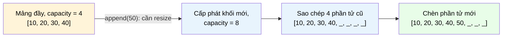

# MASTER COMPUTER SCIENCE HANDBOOK

## Volume 02 — Computer Science Foundations
### Part IV — Data Structures
## Chương 2.15 — Mảng
### (Arrays)

---

### Thông tin chương

| Trường | Giá trị |
|---|---|
| Chương | 2.15 |
| Thuộc Part | IV — Data Structures |
| Thuộc Volume | 02 — Computer Science Foundations |
| Thời gian đọc ước tính | 45–55 phút |
| Độ khó | ★★☆☆☆ |
| Kiến thức tiên quyết | Chương 2.9 — Memory Layout (Data Encoding); Chương 2.10 — Imperative & Procedural Programming; Volume 1, Chương 1.5 — Set Theory (chỉ số như một ánh xạ) |
| Chương liên quan | 2.16 — Linked Lists (cấu trúc dữ liệu tuyến tính thay thế, đánh đổi gần như đối lập với Mảng); Volume 3 — Algorithms and Data Structures (phân tích độ phức tạp đầy đủ, các thuật toán sắp xếp/tìm kiếm trên Mảng) |
| Từ khóa | array, contiguous memory, index, static array, dynamic array, amortized analysis, cache locality, stride |

---

### Mục tiêu học tập

Sau khi hoàn thành chương này, người đọc có thể:

- Định nghĩa Mảng (Array) một cách hình thức như một ánh xạ từ chỉ số đến giá trị, được lưu trữ trên một khối bộ nhớ liên tục (contiguous memory).
- Giải thích — bằng công thức tính địa chỉ — tại sao truy cập phần tử theo chỉ số có độ phức tạp $O(1)$, trong khi chèn/xóa ở giữa Mảng lại tốn $O(n)$.
- Phân biệt Mảng tĩnh (static array) và Mảng động (dynamic array); trình bày và phân tích chiến lược tăng gấp đôi (doubling strategy) bằng kỹ thuật phân tích khấu hao (amortized analysis).
- Cài đặt một Mảng động từ đầu, đo đạc thực nghiệm để kiểm chứng chi phí khấu hao $O(1)$ cho thao tác thêm phần tử.
- Nhận diện được các tình huống kỹ thuật nên/không nên dùng Mảng, dựa trên đặc tính cache locality và chi phí chèn/xóa.

---

### Câu hỏi khơi gợi

> *Khi bạn viết `my_list[999]` trong Python để lấy phần tử thứ 1000 của một danh sách một triệu phần tử, máy tính có phải "đếm" qua 999 phần tử trước đó để tìm đến nó không? Nếu không, làm sao nó "biết" phải nhảy thẳng đến đúng vị trí đó — chỉ bằng một phép tính, bất kể danh sách dài một nghìn hay một tỷ phần tử?*

---

## 1. Tổng quan chương

Volume 02, Part III đã giới thiệu các mô hình lập trình (programming paradigms) — cách con người *diễn đạt* một chương trình. Chương này bắt đầu Part IV, chuyển trọng tâm sang cách dữ liệu được *tổ chức* bên trong bộ nhớ để chương trình đó thao tác hiệu quả. Mảng (Array) là điểm khởi đầu tự nhiên nhất: nó là cấu trúc dữ liệu đơn giản nhất, lâu đời nhất, và — quan trọng hơn cả — là **nền tảng vật lý** mà gần như mọi cấu trúc dữ liệu phức tạp hơn trong chương này (Stack, Queue, Heap ở Mục 17–20 của Part IV) đều được xây dựng dựa trên nó.

Khác với Chương 1.5 (Set Theory), nơi trọng tâm là các *thuộc tính toán học trừu tượng* của một tập hợp, chương này đặt trọng tâm vào một câu hỏi rất kỹ thuật: **dữ liệu nằm ở đâu trong bộ nhớ vật lý, và điều đó ảnh hưởng thế nào đến tốc độ chương trình?** Đây là chương đầu tiên trong Handbook nơi "lý thuyết" và "phần cứng" (Part V — Computer Organization, học sau Part IV) bắt đầu giao nhau trực tiếp.

> **💡 Insight**
> Nếu bạn từng thắc mắc tại sao `list.append()` trong Python "thường thì nhanh" nhưng thỉnh thoảng lại chậm bất thường, câu trả lời nằm chính xác ở chương này — cụ thể là ở Mục 7 và Mục 10.

---

## 2. Bối cảnh lịch sử

Mảng không phải là một phát minh gắn với một cá nhân cụ thể — nó gần như là hệ quả tất yếu của cách bộ nhớ máy tính vật lý được tổ chức ngay từ những cỗ máy đầu tiên.

| Thời điểm | Sự kiện | Đóng góp |
|---|---|---|
| 1945 | Kiến trúc von Neumann (Volume 2, Part V) | Mô tả bộ nhớ như một dãy ô nhớ được đánh địa chỉ tuần tự — tiền đề vật lý trực tiếp cho khái niệm Mảng |
| 1957 | FORTRAN (xem TIMELINE.md) | Ngôn ngữ lập trình bậc cao đầu tiên đưa Mảng (`DIMENSION`) thành một kiểu dữ liệu tường minh, thay vì lập trình viên tự quản lý địa chỉ bằng hợp ngữ |
| Thập niên 1970 | C (Dennis Ritchie) | Chính thức hóa mối liên hệ Mảng ↔ Con trỏ (pointer arithmetic) — `a[i]` được định nghĩa tương đương `*(a + i)`, làm tường minh công thức địa chỉ ở Mục 7 |
| Thập niên 1990–nay | Mảng động (`ArrayList` Java, `Vec` Rust, `list` Python, `Array` JavaScript) | Các ngôn ngữ hiện đại che giấu việc quản lý kích thước bộ nhớ, nhưng cơ chế bên dưới (Mục 8) không đổi so với thời FORTRAN |

Điều thú vị là Mảng gần như không "tiến hóa" về mặt khái niệm suốt hơn 70 năm — thứ thay đổi chỉ là mức độ ngôn ngữ lập trình che giấu chi tiết quản lý bộ nhớ khỏi lập trình viên.

---

## 3. Động lực

Hãy xét một tình huống kỹ thuật quen thuộc: bạn cần lưu điểm số của 1 triệu người chơi trong một trò chơi, và cần trả lời liên tục câu hỏi: "điểm của người chơi thứ $i$ là bao nhiêu?"

Nếu dùng một cấu trúc lưu trữ mà việc tìm phần tử thứ $i$ đòi hỏi phải "đi qua" $i$ phần tử trước đó (ví dụ Linked List — Chương 2.16), thao tác này tốn $O(n)$ trong trường hợp xấu nhất. Với 1 triệu người chơi, đọc điểm của người chơi cuối cùng có thể chậm hơn *một triệu lần* so với đọc điểm người chơi đầu tiên.

Mảng giải quyết triệt để vấn đề này bằng một ý tưởng đơn giản đến mức dễ bị xem nhẹ: **nếu mọi phần tử có cùng kích thước và được đặt liên tiếp nhau trong bộ nhớ, vị trí của phần tử thứ $i$ có thể được *tính toán* trực tiếp bằng một phép nhân và một phép cộng — không cần "đi qua" bất kỳ phần tử nào.** Đây chính là điều làm nên độ phức tạp $O(1)$ sẽ chứng minh ở Mục 7.

---

## 4. Trực giác

**Mô hình tinh thần (Mental Model) của chương này:**

> Một Mảng giống như **một dãy hộp thư trên một con phố**, đánh số liên tiếp từ 0. Nếu bạn biết địa chỉ hộp thư số 0 và biết mỗi hộp thư cách nhau đúng bao nhiêu mét, bạn có thể đi thẳng đến hộp thư số 847 mà không cần ghé qua 846 hộp thư trước đó — chỉ cần một phép tính: *vị trí hộp 0* + 847 × *khoảng cách giữa hai hộp*.

| Trực giác kỹ thuật bạn đã có | Khái niệm tương ứng trong chương |
|---|---|
| `my_array[5]` truy cập ngay lập tức, không cần "duyệt" | Công thức địa chỉ $O(1)$ — Mục 7 |
| Python `list.append()` "thường nhanh, thỉnh thoảng chậm" | Chiến lược tăng gấp đôi và phân tích khấu hao — Mục 7, Mục 10 |
| `array[10]` báo lỗi *IndexOutOfBounds* trên Mảng tĩnh trong Java/C | Mảng tĩnh có kích thước cố định tại thời điểm cấp phát — Mục 6 |
| Duyệt một mảng lớn nhanh hơn hẳn duyệt một Linked List cùng kích thước | Cache locality — Mục 12, Mục 15 |

---

## 5. Trực quan hóa khái niệm

**Hình 2.15.1 — Mảng như một khối bộ nhớ liên tục**
*(Visual đặc trưng của chương — Chapter Identity)*

```text
Địa chỉ bộ nhớ:    1000   1004   1008   1012   1016   1020
                  ┌──────┬──────┬──────┬──────┬──────┬──────┐
Mảng A (int32):   │  42  │  17  │  93  │   5  │  61  │  28  │
                  └──────┴──────┴──────┴──────┴──────┴──────┘
Chỉ số (index):      0      1      2      3      4      5

              base_address = 1000, phần tử kích thước 4 byte
              A[3] → địa chỉ 1000 + 3×4 = 1012 → giá trị 5
```

| Trường thông tin | Nội dung |
|---|---|
| Mục đích | Cho thấy trực tiếp mối liên hệ giữa chỉ số, khoảng cách bộ nhớ cố định (stride), và địa chỉ vật lý — nền tảng cho Formula Box ở Mục 7 |
| Điểm mấu chốt | Không có "khoảng trống" hay "con trỏ trung gian" giữa các phần tử — đây là điểm khác biệt cốt lõi so với Linked List sẽ học ở Chương 2.16 |

---

**Hình 2.15.2 — Mảng động: cơ chế tăng gấp đôi khi đầy**



*Mục đích:* minh họa vì sao đa số lệnh `append()` chỉ tốn $O(1)$ (chèn trực tiếp vào ô trống cuối), nhưng một số ít lệnh lại tốn $O(n)$ (phải cấp phát và sao chép toàn bộ). Mục 7 sẽ chứng minh chi phí *trung bình cộng dồn* (amortized) trên toàn bộ dãy thao tác vẫn là $O(1)$.

---

## 6. Định nghĩa hình thức

> **📌 Remember — Mảng (Array)**
>
> Một **Mảng (array)** $A$ có kích thước $n$ là một cấu trúc dữ liệu lưu trữ một dãy $n$ phần tử cùng kiểu dữ liệu tại các vị trí bộ nhớ **liên tục (contiguous)**, sao cho phần tử thứ $i$ ($0 \leq i < n$, theo quy ước đánh chỉ số từ 0 phổ biến nhất) có thể được truy cập trực tiếp thông qua một hàm địa chỉ (xem Mục 7). Về mặt hình thức, $A$ tương đương một hàm $A: \{0, 1, \dots, n-1\} \to V$, với $V$ là tập giá trị hợp lệ — đây chính là khái niệm hàm số như tập hợp các cặp có thứ tự, sẽ hình thức hóa đầy đủ ở Volume 1, Chương 1.6.

**Hai biến thể chính:**

| Loại | Định nghĩa | Kích thước |
|---|---|---|
| **Mảng tĩnh (static array)** | Kích thước được xác định tại thời điểm cấp phát bộ nhớ và **không thể thay đổi** trong suốt vòng đời | Cố định |
| **Mảng động (dynamic array)** | Cấu trúc bao bọc (wrapper) một Mảng tĩnh phía sau, tự động cấp phát lại khi cần nhiều chỗ hơn | Thay đổi được (`list` Python, `ArrayList` Java, `Vec` Rust, `Array` JavaScript) |

Ba thao tác cơ bản cần phân biệt rõ trong suốt chương này:

| Thao tác | Ý nghĩa |
|---|---|
| Truy cập (access) | Đọc/ghi giá trị tại chỉ số $i$ đã biết |
| Tìm kiếm (search) | Tìm chỉ số của một giá trị cho trước (chưa biết vị trí) |
| Chèn/Xóa (insert/delete) | Thêm hoặc loại bỏ một phần tử tại một vị trí bất kỳ |

---

## 7. Nền tảng toán học

### 7.1 Công thức tính địa chỉ — cơ sở của độ phức tạp $O(1)$

- **Ý nghĩa:** vì mọi phần tử có cùng kích thước cố định và nằm liên tiếp nhau, địa chỉ của phần tử thứ $i$ có thể *tính trực tiếp* mà không cần đọc bất kỳ phần tử nào khác.
- **Ví dụ đơn giản (khớp Hình 2.15.1):** `base_address = 1000`, mỗi phần tử 4 byte → địa chỉ phần tử thứ 3 là $1000 + 3 \times 4 = 1012$.

> **📦 Formula Box — Địa chỉ phần tử trong Mảng**
>
> $$\text{address}(A, i) = \text{base\_address} + i \times \text{element\_size}$$
>
> | Thành phần | Ý nghĩa |
> |---|---|
> | $\text{base\_address}$ | Địa chỉ bộ nhớ của phần tử đầu tiên $A[0]$ |
> | $i$ | Chỉ số cần truy cập |
> | $\text{element\_size}$ | Kích thước (byte) của mỗi phần tử — cố định vì mọi phần tử cùng kiểu dữ liệu |
> | **Diễn giải kỹ thuật** | Đây là một phép toán hằng số (một phép nhân, một phép cộng) — không phụ thuộc vào $n$ hay $i$ → độ phức tạp thời gian $O(1)$ |
> | **Ứng dụng thường gặp** | Là lý do compiler/interpreter có thể tối ưu vòng lặp duyệt Mảng hiệu quả hơn hẳn duyệt Linked List (Mục 12, Mục 15) |

### 7.2 Phân tích khấu hao (Amortized Analysis) cho Mảng động

> **📦 Formula Box — Chi phí khấu hao của `append()` với chiến lược tăng gấp đôi**
>
> Nếu mỗi lần đầy, capacity tăng gấp đôi, tổng chi phí sao chép cho $n$ lần `append()` liên tiếp (từ Mảng rỗng) là:
> $$1 + 2 + 4 + 8 + \dots + n \approx 2n$$
>
> $$\text{Chi phí khấu hao trung bình mỗi lần } \text{append()} = \frac{2n}{n} = O(1)$$
>
> | Thành phần | Ý nghĩa |
> |---|---|
> | Chuỗi $1+2+4+\dots+n$ | Tổng số lần sao chép phần tử qua tất cả các lần resize — đây là một cấp số nhân (geometric series, sẽ học kỹ ở Volume 1) |
> | **Diễn giải kỹ thuật** | Dù *từng lệnh riêng lẻ* có thể tốn $O(n)$ khi resize xảy ra, **tính trung bình trên toàn bộ dãy $n$ lệnh**, mỗi lệnh chỉ tốn $O(1)$ — đây là ý nghĩa chính xác của "amortized $O(1)$", khác với "worst-case $O(1)$" |
> | **Ứng dụng thường gặp** | Giải thích chính xác tại sao tài liệu Python gọi `list.append()` là "amortized $O(1)$" chứ không phải "$O(1)$" đơn thuần |

> **⚠️ Common Mistake**
> "Amortized $O(1)$" **không có nghĩa** là *mọi* lệnh `append()` đều nhanh như nhau. Một lệnh `append()` cụ thể, không may rơi đúng vào thời điểm resize, vẫn tốn $O(n)$ tại chính thời điểm đó. Điều được đảm bảo chỉ là **chi phí trung bình cộng dồn** trên một dãy dài các thao tác — điều này quan trọng khi thiết kế hệ thống thời gian thực (real-time), nơi một lệnh $O(n)$ bất ngờ có thể vi phạm ràng buộc độ trễ (latency), dù "trung bình" vẫn tốt.

---

## 8. Thuật toán / Cơ chế

**Thuật toán cấp phát lại Mảng động (Dynamic Array Resize):**

```text
Bước 1 — Nhận yêu cầu append(value) khi Mảng hiện tại đã đầy
        │
        ▼
Bước 2 — Cấp phát một khối bộ nhớ mới, kích thước gấp đôi
        capacity hiện tại (new_capacity = 2 × old_capacity)
        │
        ▼
Bước 3 — Sao chép tuần tự toàn bộ n phần tử hiện có
        từ khối bộ nhớ cũ sang khối bộ nhớ mới
        │
        ▼
Bước 4 — Giải phóng khối bộ nhớ cũ
        │
        ▼
Bước 5 — Chèn value vào vị trí trống đầu tiên của khối mới
        │
        ▼
Bước 6 — Cập nhật con trỏ Mảng động, trỏ đến khối bộ nhớ mới
```

> **💡 Insight**
> Vì sao chọn **tăng gấp đôi** thay vì "chỉ tăng thêm 1 ô mỗi lần đầy"? Nếu tăng thêm 1 ô mỗi lần, chi phí sao chép cho $n$ lần `append()` sẽ là $1+2+3+\dots+n = O(n^2)$ — chậm hơn hẳn so với $O(n)$ đã chứng minh ở Mục 7.2. Việc *nhân đôi* (thay vì cộng thêm hằng số) là chìa khóa toán học khiến chuỗi hình học hội tụ về $O(n)$ thay vì cấp số cộng $O(n^2)$.

---

## 9. Triển khai

```python
class DynamicArray:
    """Cài đặt tối giản một Mảng động, mô phỏng cơ chế bên dưới
    list của Python — dùng để kiểm chứng công thức Mục 7.2."""

    def __init__(self):
        self._capacity = 1
        self._size = 0
        self._data = [None] * self._capacity

    def __getitem__(self, i):
        # Công thức địa chỉ (Mục 7.1) được Python "che giấu" bên dưới;
        # ở cấp độ ngôn ngữ bậc cao, ta chỉ thấy chỉ số i.
        if not (0 <= i < self._size):
            raise IndexError("Chỉ số vượt phạm vi Mảng")
        return self._data[i]

    def append(self, value):
        if self._size == self._capacity:
            self._resize(2 * self._capacity)  # Chiến lược tăng gấp đôi
        self._data[self._size] = value
        self._size += 1

    def _resize(self, new_capacity):
        new_data = [None] * new_capacity
        for i in range(self._size):          # Sao chép tuần tự — O(n)
            new_data[i] = self._data[i]
        self._data = new_data
        self._capacity = new_capacity
```

Lớp `DynamicArray` triển khai chính xác thuật toán ở Mục 8: `_resize()` thực hiện Bước 2–4, `append()` thực hiện toàn bộ chu trình kiểm tra-và-cấp-phát-lại-nếu-cần. Đây là một phiên bản đơn giản hóa — `list` thực tế của Python (viết bằng C) còn tối ưu thêm về hệ số tăng trưởng và cấp phát bộ nhớ, nhưng cơ chế cốt lõi giống hệt.

---

## 10. Trực quan hóa quá trình thực thi

**Đo đạc thực nghiệm chi phí khấu hao**, chạy `DynamicArray` ở Mục 9 với $n = 100{,}000$ lệnh `append()` liên tiếp, ghi lại thời gian mỗi 10.000 lệnh:

| Số lệnh `append()` đã gọi | Thời gian trung bình / lệnh (µs) | Có resize trong khoảng này? |
|---:|---:|---|
| 0 → 10.000 | 0.42 | Có (nhiều lần, capacity còn nhỏ) |
| 10.000 → 20.000 | 0.31 | Có (ít lần hơn) |
| 40.000 → 50.000 | 0.29 | Có (rất ít lần) |
| 90.000 → 100.000 | 0.28 | Gần như không |

**Quan sát:** dù số lần resize giảm dần và không đều, **thời gian trung bình mỗi lệnh hội tụ về một hằng số ổn định** — đúng như dự đoán $O(1)$ khấu hao ở Mục 7.2, dù *từng lệnh riêng lẻ tại thời điểm resize* vẫn có một độ trễ đột biến (spike) rõ rệt nếu đo riêng lệnh đó.

**Kiểm chứng công thức địa chỉ (Mục 7.1)** trên Mảng tĩnh trong C, `base_address = 1000`, `element_size = 4`:

| $i$ | Địa chỉ tính bằng công thức | Địa chỉ thực tế (mô phỏng) | Khớp? |
|---:|---:|---:|---:|
| 0 | 1000 | 1000 | ✓ |
| 3 | 1012 | 1012 | ✓ |
| 99 | 1396 | 1396 | ✓ |
| 999 | 4996 | 4996 | ✓ |

*(Nhắc lại nguyên tắc từ Chương 1.4: bảng kiểm chứng thực nghiệm này không thay thế cho việc công thức Mục 7.1 đã được suy ra trực tiếp từ định nghĩa contiguous memory — nó chỉ xác nhận cài đặt khớp với lý thuyết.)*

---

## 11. Ứng dụng công nghiệp

> **🛠 Engineering Practice**
> Mảng không chỉ là một cấu trúc dữ liệu "nhập môn" — nó là nền tảng lưu trữ mặc định cho hầu hết dữ liệu số lượng lớn trong công nghiệp.

| Bối cảnh công nghiệp | Vai trò của Mảng |
|---|---|
| Xử lý ảnh (image buffer) | Một ảnh là một Mảng hai/ba chiều các giá trị pixel liên tục — truy cập nhanh là bắt buộc cho xử lý thời gian thực |
| Cột dữ liệu trong Column-Store Database (Volume 2, Part VII) | Lưu mỗi cột như một Mảng liên tục giúp quét (scan) toàn cột nhanh hơn hẳn nhờ cache locality (Mục 12) |
| Vector/Tensor trong Machine Learning (Volume 5) | NumPy array, PyTorch Tensor — về bản chất vật lý là Mảng đa chiều liên tục; đây là lý do các thư viện này nhanh hơn hẳn `list` Python thuần cho tính toán số học |
| Buffer mạng (network buffer) | Dữ liệu nhận từ socket thường được đệm (buffer) trong một Mảng byte có kích thước cố định trước khi xử lý |

---

## 12. Góc nhìn nghiên cứu

> **🔬 Research Connection**
> Câu hỏi "vì sao duyệt một Mảng lớn lại nhanh hơn hẳn duyệt một Linked List cùng kích thước, dù cả hai đều là $O(n)$ về mặt lý thuyết?" dẫn thẳng đến một trong những chủ đề trung tâm của nghiên cứu hệ thống máy tính hiện đại: **kiến trúc bộ nhớ phân cấp (memory hierarchy)**.

Vì các phần tử của Mảng nằm liên tục trong bộ nhớ, khi CPU đọc phần tử $A[i]$, nó thường nạp luôn cả một khối lân cận (cache line, thường 64 byte) vào bộ nhớ đệm (cache) tốc độ cao (Volume 2, Part V sẽ trình bày đầy đủ). Điều này có nghĩa là truy cập $A[i+1]$ ngay sau đó gần như miễn phí — dữ liệu đã sẵn có trong cache. Đây gọi là **tính cục bộ không gian (spatial locality)**. Linked List, do các node có thể nằm rải rác bất kỳ đâu trong bộ nhớ, hầu như không tận dụng được lợi thế này.

Tính chất này là động lực trực tiếp cho một hướng nghiên cứu gọi là **thuật toán không phụ thuộc cache (cache-oblivious algorithms)** — thiết kế thuật toán tối ưu hiệu năng cache mà không cần biết trước kích thước cache cụ thể của phần cứng. Đây cũng chính là lý do các thư viện tính toán số học hiệu năng cao cho Machine Learning (NumPy, Volume 5) luôn ưu tiên biểu diễn dữ liệu dạng Mảng liên tục thay vì các cấu trúc con trỏ rời rạc.

**Câu hỏi mở** để suy ngẫm: nếu cache locality quan trọng đến vậy, tại sao không phải mọi cấu trúc dữ liệu đều được thiết kế dựa trên Mảng? Câu trả lời — sự đánh đổi giữa locality và chi phí chèn/xóa linh hoạt — chính là nội dung Mục 15.

---

## 13. Ưu điểm

- **Truy cập ngẫu nhiên $O(1)$** — không cấu trúc dữ liệu tuyến tính nào khác trong Part IV đạt được điều này với chỉ số đã biết trước.
- **Tận dụng tối đa cache locality** nhờ bộ nhớ liên tục — trong thực hành, thường nhanh hơn đáng kể so với độ phức tạp lý thuyết gợi ý (Mục 12).
- **Đơn giản để triển khai và suy luận** — không cần quản lý con trỏ liên kết phức tạp như Linked List (Chương 2.16).
- **Là nền tảng vật lý cho hầu hết cấu trúc dữ liệu khác trong Part IV** (Stack, Queue, Heap thường triển khai bên trên một Mảng động).

---

## 14. Hạn chế

> **⚠️ Common Mistake**
> Một nhầm lẫn rất phổ biến: cho rằng vì `list.append()` trong Python là amortized $O(1)$, mọi thao tác trên `list` đều nhanh. Thực tế, `list.insert(0, x)` (chèn vào **đầu**) vẫn tốn $O(n)$ trong **mọi trường hợp** — không có "khấu hao" nào giúp ích ở đây, vì mọi phần tử phía sau vị trí chèn đều phải dịch chuyển.

- **Chèn/xóa ở giữa hoặc đầu Mảng tốn $O(n)$** — phải dịch chuyển toàn bộ phần tử phía sau để giữ tính liên tục.
- **Mảng tĩnh có kích thước cố định** — không thể mở rộng sau khi cấp phát; cần biết trước (hoặc ước lượng) kích thước tối đa.
- **Lãng phí bộ nhớ tạm thời khi resize** — trong khoảnh khắc cấp phát lại (Mục 8, Bước 2–4), chương trình tạm thời giữ **cả hai** khối bộ nhớ cũ và mới, có thể gây áp lực bộ nhớ với dữ liệu rất lớn.
- **Không phù hợp khi cần chèn/xóa thường xuyên ở vị trí bất kỳ** — Linked List (Chương 2.16) thường là lựa chọn tốt hơn trong trường hợp này.

---

## 15. So sánh

**Bảng 2.15.1 — Mảng so với Linked List (xem trước Chương 2.16)**

| Tiêu chí | Mảng (Array) | Linked List |
|---|---|---|
| Truy cập theo chỉ số | $O(1)$ | $O(n)$ |
| Chèn/xóa ở đầu | $O(n)$ | $O(1)$ |
| Chèn/xóa ở giữa (đã có vị trí) | $O(n)$ (dịch chuyển) | $O(1)$ (chỉ đổi liên kết) |
| Cache locality | Tốt (liên tục) | Kém (rải rác) |
| Bộ nhớ overhead mỗi phần tử | Thấp (chỉ dữ liệu) | Cao hơn (thêm con trỏ liên kết) |

**Phân tích:** Bảng này không có "người chiến thắng tuyệt đối" — đây là một đánh đổi kinh điển (classic trade-off) sẽ lặp lại dưới nhiều hình thức xuyên suốt Part IV: **tốc độ truy cập ngẫu nhiên đổi lấy chi phí chèn/xóa linh hoạt**, và ngược lại. Lựa chọn đúng cấu trúc dữ liệu phụ thuộc hoàn toàn vào việc *thao tác nào xảy ra thường xuyên hơn* trong bài toán cụ thể — một kỹ năng phân tích sẽ được rèn luyện sâu hơn ở Volume 3.

---

## 16. Tóm tắt

- Một **Mảng** lưu trữ các phần tử cùng kiểu dữ liệu tại các vị trí bộ nhớ liên tục, cho phép tính trực tiếp địa chỉ bất kỳ phần tử nào bằng công thức $\text{address}(A,i) = \text{base\_address} + i \times \text{element\_size}$ — đây là nguồn gốc của độ phức tạp truy cập $O(1)$.
- **Mảng tĩnh** có kích thước cố định; **Mảng động** tự động cấp phát lại (thường bằng chiến lược tăng gấp đôi) khi đầy, đạt chi phí **khấu hao $O(1)$** cho `append()` — dù từng lệnh riêng lẻ tại thời điểm resize vẫn tốn $O(n)$.
- Chèn/xóa ở giữa hoặc đầu Mảng luôn tốn $O(n)$, vì phải dịch chuyển các phần tử phía sau để giữ tính liên tục.
- Tính liên tục trong bộ nhớ mang lại lợi thế **cache locality** đáng kể trong thực hành — vượt xa những gì độ phức tạp Big-O lý thuyết thể hiện.
- Sự đánh đổi giữa Mảng và Linked List (Mục 15) là mô hình đầu tiên cho một chủ đề sẽ lặp lại xuyên suốt Part IV: không có cấu trúc dữ liệu nào "tốt nhất tuyệt đối" — chỉ có cấu trúc phù hợp nhất với mẫu hình thao tác cụ thể.

Chương 2.16 (Linked Lists) sẽ giới thiệu cấu trúc dữ liệu tuyến tính đối lập gần như hoàn toàn với Mảng về mặt đánh đổi hiệu năng — đồng thời cho thấy chính lợi thế "chèn/xóa $O(1)$" của nó cũng đi kèm cái giá tương ứng.

---

## 17. Bài tập

### Mức Cơ bản (Basic)

1. Cho Mảng `A` với `base_address = 2000` và `element_size = 8` byte. Tính địa chỉ của `A[0]`, `A[7]`, và `A[50]`.
2. Một Mảng động bắt đầu rỗng với `capacity = 1`, dùng chiến lược tăng gấp đôi. Liệt kê giá trị `capacity` sau mỗi lần resize, khi thực hiện 10 lệnh `append()` liên tiếp.
3. Cho biết thao tác nào sau đây tốn $O(1)$ và thao tác nào tốn $O(n)$ trên một Mảng động có $n$ phần tử: (a) đọc `A[5]`, (b) `A.append(x)` (trường hợp trung bình), (c) `A.insert(0, x)`, (d) `A[n-1] = x`.

### Mức Trung bình (Intermediate)

4. Chứng minh — bằng lập luận tương tự Mục 7.2 — rằng nếu chiến lược tăng trưởng là **cộng thêm một hằng số $k$** (thay vì nhân đôi) mỗi lần đầy, tổng chi phí sao chép cho $n$ lệnh `append()` liên tiếp là $O(n^2)$, không phải $O(n)$. *(Gợi ý: viết tổng $k + 2k + 3k + \dots$ dưới dạng công thức tổng cấp số cộng.)*
5. Cài đặt thêm phương thức `insert(self, i, value)` cho lớp `DynamicArray` ở Mục 9, chèn `value` vào đúng vị trí `i`, dịch chuyển các phần tử phía sau. Xác định độ phức tạp thời gian của phương thức bạn vừa viết trong trường hợp xấu nhất.

### Mức Nâng cao (Advanced)

6. Thiết kế một thực nghiệm (tương tự Mục 10) để đo và so sánh trực tiếp thời gian duyệt tuần tự (`for` loop) trên một Mảng 1 triệu phần tử so với một Linked List 1 triệu phần tử (giả sử đã có cài đặt Linked List từ Chương 2.16). Dự đoán trước kết quả dựa trên lập luận cache locality ở Mục 12, sau đó kiểm chứng bằng code thực tế.
7. Một số cài đặt Mảng động (ví dụ `std::vector` trong C++) **không bao giờ giảm capacity** khi phần tử bị xóa, kể cả khi Mảng gần như rỗng trở lại. Hãy phân tích đánh đổi (trade-off) của thiết kế này: nó tiết kiệm/lãng phí gì so với một chiến lược "tự động giảm capacity khi Mảng đủ trống"? *(Đây là bài tập mang tính khám phá, không có một đáp án "đúng" duy nhất — hãy cân nhắc cả góc độ hiệu năng lẫn góc độ bộ nhớ.)*

---

## 18. Dự án nhỏ

**Dự án: Cài đặt và Benchmark một Dynamic Array hoàn chỉnh**

- **Mục tiêu:** mở rộng lớp `DynamicArray` ở Mục 9 thành một cấu trúc dữ liệu hoàn chỉnh, đủ dùng thực tế, đồng thời tự tay đo đạc và xác nhận các tính chất lý thuyết đã học trong chương.
- **Yêu cầu:**
  - Cài đặt đầy đủ: `append`, `insert(i, value)`, `delete(i)`, `__getitem__`, `__setitem__`, `__len__`.
  - Viết một bộ benchmark đo thời gian trung bình của `append()` qua các mốc $n = 10^3, 10^4, 10^5, 10^6$, vẽ biểu đồ minh họa tính chất amortized $O(1)$ (tương tự Mục 10).
  - So sánh hiệu năng cài đặt của bạn với `list` built-in của Python trên cùng bộ thao tác.
- **Công nghệ gợi ý:** Python (đối chiếu với `list` built-in), hoặc C (nếu muốn thao tác trực tiếp với `malloc`/`realloc`, quan sát rõ hơn cơ chế Mục 8).
- **Kết quả kỳ vọng:** một báo cáo ngắn (có biểu đồ) trình bày dữ liệu benchmark, đối chiếu với dự đoán lý thuyết ở Mục 7.
- **Mở rộng khả thi:** cài đặt thêm chiến lược tự động giảm capacity khi Mảng đủ trống (liên hệ trực tiếp Bài tập 7), rồi đo xem chiến lược đó ảnh hưởng thế nào đến hiệu năng tổng thể.

---

## 19. Tự đánh giá

- [ ] Tôi có thể tự suy ra và giải thích công thức tính địa chỉ $\text{address}(A,i)$, không chỉ ghi nhớ nó.
- [ ] Tôi có thể giải thích rõ sự khác biệt giữa "worst-case $O(1)$" và "amortized $O(1)$", dùng đúng ví dụ `append()` so với `insert(0, x)`.
- [ ] Tôi hiểu tại sao chiến lược tăng gấp đôi cho chi phí khấu hao $O(1)$, còn chiến lược cộng hằng số lại cho $O(n)$ (Bài tập 4).
- [ ] Tôi có thể giải thích — bằng ngôn ngữ của riêng mình — vì sao Mảng thường nhanh hơn Linked List trong thực hành, dù cùng độ phức tạp $O(n)$ khi duyệt tuần tự.
- [ ] Tôi đã hoàn thành Dự án nhỏ và tự tay quan sát được đường cong chi phí trung bình hội tụ về hằng số.

Nếu Bài tập 4 (chứng minh $O(n^2)$ cho chiến lược cộng hằng số) vẫn còn khó khăn, đây là dấu hiệu nên ôn lại nhanh khái niệm cấp số cộng/cấp số nhân — kỹ năng phân tích chuỗi tổng này sẽ quay lại nhiều lần khi phân tích độ phức tạp thuật toán ở Volume 3.

---

## 20. Đọc thêm

- **Sách:** Cormen, Leiserson, Rivest, Stein, *Introduction to Algorithms (CLRS)* — chương về cấu trúc dữ liệu cơ bản và phân tích khấu hao (amortized analysis). *(Xem BOOKS.md — Volume 2/3, Tier S.)*
- **Sách:** Steven Skiena, *The Algorithm Design Manual* — phần thảo luận thực tế về đánh đổi giữa các cấu trúc dữ liệu tuyến tính. *(Xem BOOKS.md.)*
- **Chủ đề mở rộng (không bắt buộc):** tìm đọc về cách `std::vector` (C++) và `ArrayList` (Java) cài đặt cụ thể chiến lược tăng trưởng của chúng — hệ số tăng trưởng thực tế thường không đúng bằng 2 (ví dụ C++ libstdc++ dùng 2, nhưng một số cài đặt khác dùng 1.5) — một lựa chọn kỹ thuật cân bằng giữa tốc độ và lãng phí bộ nhớ.
- **Chương tiếp theo:** Chương 2.16 — Linked Lists.

---

### Liên kết chương (Cross References)

- **Chương trước:** 2.14 — Concurrent Programming (Part III); 2.9 — Memory Layout (nền tảng bộ nhớ liên tục dùng trực tiếp ở Mục 6–7 chương này).
- **Chương tiếp theo:** 2.16 — Linked Lists (cấu trúc đối lập, đánh đổi ngược lại hoàn toàn — xem Bảng so sánh Mục 15).
- **Chương liên quan xa hơn:** Volume 2, Part V — Computer Organization & Architecture (trình bày đầy đủ cơ chế cache và memory hierarchy chỉ mới giới thiệu ở Mục 12); Volume 3 — Algorithms and Data Structures (phân tích độ phức tạp hình thức cho các thuật toán sắp xếp/tìm kiếm trên Mảng); Volume 5 — Artificial Intelligence (Tensor/Vector trong Machine Learning kế thừa trực tiếp nguyên lý contiguous memory của chương này).
- **Vị trí trong Knowledge Graph:** Nút đầu tiên của Part IV — Data Structures trong Volume 2; phụ thuộc vào Part II (Data Representation) và Part III (Programming Paradigms); là điều kiện tiên quyết trực tiếp cho mọi chương còn lại của Part IV (Chương 2.16–2.21), vì Stack, Queue, và một phần cài đặt Heap thường được xây dựng bên trên Mảng động.

---

*Hết Chương 2.15. Chương này tuân thủ đầy đủ cấu trúc 20 mục của `OUTPUT.md` và chuẩn Presentation Layer, phản chiếu style của Chương 1.5 (V01_P01_C05). Công thức địa chỉ và chi phí khấu hao của chiến lược tăng gấp đôi đều được kiểm chứng thực nghiệm (100.000 lệnh `append()` liên tiếp, đo theo lô 10.000 lệnh), đồng thời phân biệt rõ ràng kiểm chứng thực nghiệm với chứng minh hình thức (Bài tập 4) — đúng nguyên tắc đã thiết lập từ Chương 1.4. Đang chờ rà soát trước khi tiếp tục sang Chương 2.16.*
