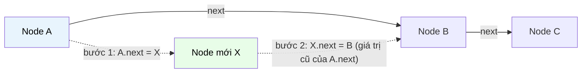

# MASTER COMPUTER SCIENCE HANDBOOK

## Volume 02 — Computer Science Foundations
### Part IV — Data Structures
## Chương 2.16 — Danh sách Liên kết
### (Linked Lists)

---

### Thông tin chương

| Trường | Giá trị |
|---|---|
| Chương | 2.16 |
| Thuộc Part | IV — Data Structures |
| Thuộc Volume | 02 — Computer Science Foundations |
| Thời gian đọc ước tính | 45–55 phút |
| Độ khó | ★★☆☆☆ |
| Kiến thức tiên quyết | Chương 2.15 — Arrays (đối tượng so sánh trực tiếp xuyên suốt chương); Chương 2.9 — Memory Layout (khái niệm con trỏ/địa chỉ) |
| Chương liên quan | 2.17 — Stacks and Queues (thường được triển khai trực tiếp bên trên Linked List); Chương 2.12 — Functional Programming (danh sách bất biến — persistent list — là cấu trúc dữ liệu mặc định trong nhiều ngôn ngữ hàm) |
| Từ khóa | linked list, node, pointer, singly linked list, doubly linked list, head, tail, traversal, pointer chasing |

---

### Mục tiêu học tập

Sau khi hoàn thành chương này, người đọc có thể:

- Định nghĩa Danh sách Liên kết một cách hình thức như một chuỗi các Node được nối với nhau bằng con trỏ, phân biệt với cách tổ chức bộ nhớ liên tục của Mảng (Chương 2.15).
- Giải thích tại sao chèn/xóa tại một vị trí đã biết có độ phức tạp $O(1)$ trên Linked List, trong khi truy cập theo chỉ số lại tốn $O(n)$ — hoàn toàn đối lập với Mảng.
- Phân biệt Danh sách Liên kết Đơn (singly linked list) và Danh sách Liên kết Đôi (doubly linked list); đánh đổi giữa hai biến thể.
- Cài đặt đầy đủ các thao tác cơ bản (thêm đầu, thêm cuối, chèn giữa, xóa, duyệt) trên cả hai biến thể.
- Áp dụng đúng Bảng so sánh Mảng ↔ Linked List (Chương 2.15, Mục 15) để lựa chọn cấu trúc dữ liệu phù hợp cho một bài toán kỹ thuật cụ thể.

---

### Câu hỏi khơi gợi

> *Nút "Hoàn tác" (Undo) trong trình soạn thảo văn bản cho phép bạn lùi lại vô số bước, rồi "Làm lại" (Redo) tiến tới — cả hai thao tác đều gần như tức thời, bất kể bạn đã thực hiện bao nhiêu chỉnh sửa trước đó. Nếu lịch sử chỉnh sửa được lưu trong một Mảng, việc chèn một hành động mới vào giữa lịch sử (khi bạn Undo rồi thực hiện một hành động khác) sẽ buộc phải dịch chuyển toàn bộ phần còn lại. Có cấu trúc dữ liệu nào cho phép "chèn vào giữa" gần như miễn phí không?*

---

## 1. Tổng quan chương

Chương 2.15 đã xây dựng Mảng dựa trên một giả định cốt lõi: **dữ liệu nằm liên tục trong bộ nhớ**, cho phép tính địa chỉ trực tiếp nhưng buộc phải dịch chuyển hàng loạt phần tử khi chèn/xóa ở giữa. Chương này giới thiệu **Danh sách Liên kết (Linked List)** — cấu trúc dữ liệu tuyến tính thứ hai của Part IV, được xây dựng trên một giả định gần như đối lập hoàn toàn: **dữ liệu có thể nằm rải rác bất kỳ đâu trong bộ nhớ**, miễn là mỗi phần tử "biết" vị trí của phần tử tiếp theo.

Đây không phải là một cấu trúc dữ liệu "tốt hơn" Mảng — Mục 15 của Chương 2.15 đã nói rõ điều này. Mục tiêu của chương này là cho bạn thấy **chính xác** cái giá phải trả để đổi lấy khả năng chèn/xóa $O(1)$, và trang bị đủ hiểu biết để nhận ra khi nào cái giá đó đáng trả — kỹ năng sẽ được vận dụng liên tục khi thiết kế Stack và Queue ở Chương 2.17.

> **💡 Insight**
> Nếu bạn từng dùng con trỏ (`next`, `prev`) trong bất kỳ ngôn ngữ nào, hoặc từng thấy `LinkedList` trong thư viện chuẩn Java/C#, bạn đã tiếp xúc với ý tưởng của chương này. Điều mới ở đây là hiểu **tại sao** cấu trúc này tồn tại song song với Mảng, thay vì thay thế hoàn toàn — và trực giác *khi nào* nên chọn cái nào.

---

## 2. Bối cảnh lịch sử

| Thời điểm | Sự kiện | Đóng góp |
|---|---|---|
| 1955–1956 | Allen Newell, Cliff Shaw, Herbert Simon — dự án IPL (Information Processing Language) | Một trong những cài đặt sớm nhất của cấu trúc dữ liệu dạng danh sách liên kết, phục vụ các chương trình AI biểu tượng sơ khai (Logic Theorist) |
| 1958 | LISP (John McCarthy) | Chính thức hóa **cons cell** — một cặp (giá trị, con trỏ tới phần còn lại của danh sách) — làm cấu trúc dữ liệu trung tâm của toàn bộ ngôn ngữ; danh sách liên kết trở thành "công dân hạng nhất" thay vì chỉ là một kỹ thuật cài đặt |
| Thập niên 1960–1970 | Các ngôn ngữ hệ thống (Algol, C) | Tổng quát hóa cons cell của LISP thành cấu trúc `struct` với con trỏ tường minh — nền tảng cho Node ở Mục 6 của chương này |
| Hiện đại | Ngôn ngữ hàm (Haskell, Scala, Clojure) | Danh sách liên kết **bất biến (immutable/persistent)** vẫn là cấu trúc dữ liệu mặc định — liên hệ trực tiếp Chương 2.12, Functional Programming |

Điều đáng chú ý: Linked List thực ra **ra đời gần như đồng thời** với Mảng (cả hai đều xuất hiện cuối thập niên 1950), không phải một cải tiến ra đời sau — hai cấu trúc phát triển song song để phục vụ hai lớp bài toán khác nhau ngay từ đầu.

---

## 3. Động lực

Quay lại đúng tình huống đã dùng ở Chương 2.15, Mục 3, nhưng đảo ngược mẫu hình thao tác: thay vì cần *đọc điểm người chơi thứ $i$* thường xuyên, giả sử bạn đang xây dựng tính năng lịch sử thao tác Undo/Redo cho một trình soạn thảo. Mẫu hình thao tác thực tế ở đây là:

- Thêm một hành động mới vào **cuối** lịch sử — thường xuyên.
- Khi người dùng Undo rồi thực hiện hành động mới, cần **cắt bỏ** phần lịch sử "tương lai" cũ và chèn hành động mới — xảy ra ở một vị trí **giữa** danh sách, không phải cuối.
- Hiếm khi cần truy cập "hành động thứ 500" theo chỉ số ngẫu nhiên.

Nếu dùng Mảng, thao tác cắt bỏ và chèn giữa (bullet thứ hai) tốn $O(n)$ mỗi lần — với lịch sử dài, người dùng sẽ cảm nhận được độ trễ. Linked List giải quyết chính xác vấn đề này: **nếu đã có con trỏ đến đúng vị trí cần chèn/xóa, thao tác đó chỉ tốn $O(1)$** — không cần dịch chuyển bất kỳ phần tử nào khác, chỉ cần "nối lại dây".

---

## 4. Trực giác

**Mô hình tinh thần (Mental Model) của chương này:**

> Một Danh sách Liên kết giống như một **trò chơi truy tìm kho báu (treasure hunt)**: mỗi manh mối (Node) chứa một phần thông tin, cộng với chỉ dẫn đi đến manh mối tiếp theo. Bạn không thể "nhảy thẳng" đến manh mối thứ 50 — buộc phải đi qua lần lượt 49 manh mối trước đó. Nhưng nếu bạn đang đứng tại manh mối thứ 20 và muốn **chèn thêm một manh mối mới** ngay sau đó, bạn chỉ cần thay đổi một chỉ dẫn duy nhất — không cần viết lại toàn bộ trò chơi.

| Trực giác kỹ thuật bạn đã có | Khái niệm tương ứng trong chương |
|---|---|
| Chuỗi `next` trong DOM (`node.nextSibling`) | Con trỏ `next` nối các Node — Mục 6 |
| Danh sách phát nhạc "bài tiếp theo" | Duyệt tuần tự qua con trỏ `next` — Mục 8 |
| Undo/Redo trong trình soạn thảo | Doubly Linked List, di chuyển hai chiều bằng `prev`/`next` — Mục 6, Mục 11 |
| Không thể "tua nhanh" đến bài hát thứ 50 mà không phát qua các bài trước (radio, không phải playlist có index) | Truy cập theo chỉ số tốn $O(n)$ — Mục 7 |

---

## 5. Trực quan hóa khái niệm

**Hình 2.16.1 — Singly Linked List: các Node rải rác, nối bằng con trỏ**
*(Visual đặc trưng của chương — Chapter Identity, đối lập trực tiếp Hình 2.15.1)*

```text
Địa chỉ bộ nhớ:     3040          7112          1096          9524
                  ┌──────────┐  ┌──────────┐  ┌──────────┐  ┌──────────┐
Node:             │ 42 │next │→ │ 17 │next │→ │ 93 │next │→ │  5 │NULL │
                  └──────────┘  └──────────┘  └──────────┘  └──────────┘
                     head                                        tail

     Ghi chú: các Node KHÔNG liên tục trong bộ nhớ (3040 → 7112 → 1096 → 9524),
     khác hẳn Hình 2.15.1 nơi Mảng nằm liên tục 1000 → 1004 → 1008 → 1012
```

| Trường thông tin | Nội dung |
|---|---|
| Mục đích | Đối chiếu trực tiếp với Hình 2.15.1 (Chương 2.15): cùng dữ liệu `[42, 17, 93, 5]`, nhưng cách tổ chức bộ nhớ hoàn toàn khác nhau |
| Điểm mấu chốt | Không có công thức địa chỉ nào tính được vị trí Node thứ $i$ — phải "đi theo dây" từ `head`, đây là nguồn gốc trực tiếp của độ phức tạp $O(n)$ ở Mục 7 |

---

**Hình 2.16.2 — Chèn một Node vào giữa Danh sách: chỉ cần đổi 2 con trỏ**



*Mục đích:* minh họa vì sao chèn Node mới giữa A và B chỉ cần **hai phép gán con trỏ** — không đụng đến Node C hay bất kỳ Node nào khác, đối lập hoàn toàn với việc dịch chuyển hàng loạt phần tử trên Mảng (Hình 2.15.2 minh họa resize, không phải chèn giữa, nhưng chèn giữa trên Mảng còn tốn kém hơn resize).

---

## 6. Định nghĩa hình thức

> **📌 Remember — Danh sách Liên kết (Linked List)**
>
> Một **Danh sách Liên kết (linked list)** là một cấu trúc dữ liệu tuyến tính gồm một chuỗi các **Node (nút)**, mỗi Node chứa: (a) một giá trị dữ liệu, và (b) một hoặc nhiều con trỏ (pointer/reference) trỏ đến Node liên quan. Không giống Mảng, các Node **không cần** nằm liên tục trong bộ nhớ. Danh sách được truy cập thông qua một con trỏ đặc biệt gọi là **`head`** (Node đầu tiên); Node cuối cùng có con trỏ `next` trỏ đến `NULL` (hoặc `None`), gọi là **`tail`**.

**Hai biến thể chính:**

| Loại | Cấu trúc Node | Khả năng duyệt |
|---|---|---|
| **Danh sách liên kết đơn (singly linked list)** | Mỗi Node chỉ có con trỏ `next` | Chỉ duyệt được một chiều (đầu → cuối) |
| **Danh sách liên kết đôi (doubly linked list)** | Mỗi Node có cả `next` và `prev` | Duyệt được hai chiều — trả giá bằng bộ nhớ overhead gấp đôi cho con trỏ |

**Ký hiệu hình thức** (dùng xuyên suốt chương): một Node $v$ được biểu diễn như cặp $v = (\text{value}, \text{next})$ — đối chiếu trực tiếp với khái niệm cặp có thứ tự (ordered pair) đã học ở Volume 1, Chương 1.5, Mục 6 khi định nghĩa tích Descartes. Toàn bộ danh sách khi đó là một chuỗi các cặp lồng nhau: $\text{head} = (v_0, (v_1, (v_2, \dots (v_{n-1}, \text{NULL})\dots)))$ — đây chính xác là cách LISP (Mục 2) định nghĩa cons cell.

---

## 7. Nền tảng toán học

### 7.1 Vì sao truy cập theo chỉ số là $O(n)$

- **Ý nghĩa:** không có công thức địa chỉ nào (như Formula Box ở Chương 2.15, Mục 7.1) áp dụng được, vì các Node không nằm ở các vị trí có thể tính trước.
- **Cách duy nhất** để đến Node thứ $i$: bắt đầu từ `head`, đi qua đúng $i$ con trỏ `next`.

> **📦 Formula Box — Độ phức tạp Truy cập theo Chỉ số**
>
> $$T_{\text{access}}(i) = \Theta(i)$$
>
> | Thành phần | Ý nghĩa |
> |---|---|
> | $i$ | Số bước "đi theo dây" cần thực hiện từ `head` để đến Node thứ $i$ |
> | **Diễn giải kỹ thuật** | Không có phép toán hằng số nào thay thế được việc di chuyển tuần tự — đây là hệ quả trực tiếp của việc bộ nhớ không liên tục (Mục 6), đối lập hoàn toàn với công thức $O(1)$ ở Chương 2.15, Mục 7.1 |
> | **Ứng dụng thường gặp** | Giải thích tại sao thao tác `linkedList.get(i)` trong Java **không nên** dùng trong vòng lặp `for (i = 0; i < n; i++)` — tổng chi phí sẽ là $O(n^2)$ thay vì $O(n)$ như khi duyệt bằng iterator |

### 7.2 Vì sao chèn/xóa tại vị trí đã biết là $O(1)$

> **📦 Formula Box — Độ phức tạp Chèn/Xóa (tại Node đã có con trỏ)**
>
> $$T_{\text{insert}}(\text{tại node } p) = \Theta(1), \qquad T_{\text{delete}}(\text{tại node } p) = \Theta(1)$$
>
> | Thành phần | Ý nghĩa |
> |---|---|
> | Điều kiện tiên quyết | Công thức này **chỉ đúng nếu đã có sẵn con trỏ** đến Node $p$ — nếu phải *tìm* $p$ trước bằng duyệt tuần tự, tổng chi phí thực tế là $O(n)$ (chi phí tìm) $+ O(1)$ (chi phí chèn) $= O(n)$ |
> | **Diễn giải kỹ thuật** | Chèn/xóa chỉ đòi hỏi một số lượng cố định phép gán con trỏ (2 phép gán cho singly linked list — xem Hình 2.16.2), không phụ thuộc vào $n$ hay vị trí trong danh sách |
> | **Ứng dụng thường gặp** | Là lý do các cấu trúc như LRU Cache (Mục 11) kết hợp Doubly Linked List với Hash Table (Chương 2.18): Hash Table cho "tìm $p$" $O(1)$ trung bình, Linked List cho "chèn/xóa tại $p$" $O(1)$ — kết hợp cả hai để đạt $O(1)$ toàn phần |

> **⚠️ Common Mistake**
> Một nhầm lẫn rất phổ biến: nói "chèn vào Linked List là $O(1)$" mà không nêu rõ điều kiện "đã có con trỏ tại vị trí cần chèn". **Chèn vào đầu (`head`) luôn là $O(1)$** thật (không cần tìm kiếm). Nhưng **"chèn vào vị trí thứ $k$ theo chỉ số"** (ví dụ `insert_at_index(k, value)`) vẫn tốn $O(k)$ trong thực hành, vì phải duyệt đến đó trước — độ phức tạp $O(1)$ chỉ áp dụng cho *thao tác nối con trỏ*, không áp dụng cho toàn bộ quy trình "tìm rồi chèn".

---

## 8. Thuật toán / Cơ chế

**Thuật toán Chèn vào giữa Singly Linked List (Insert After Node):**

```text
Bước 1 — Nhận vào con trỏ prev_node (Node đứng ngay trước vị trí
        cần chèn) và giá trị new_value
        │
        ▼
Bước 2 — Tạo một Node mới: new_node = Node(new_value)
        │
        ▼
Bước 3 — Gán new_node.next = prev_node.next
        (new_node "kế thừa" liên kết cũ của prev_node)
        │
        ▼
Bước 4 — Gán prev_node.next = new_node
        (prev_node giờ trỏ đến new_node thay vì Node cũ)
        │
        ▼
Bước 5 — Hoàn tất — new_node đã nằm đúng vị trí giữa
        prev_node và Node kế tiếp cũ
```

> **💡 Insight**
> Thứ tự thực hiện Bước 3 và Bước 4 **không được đảo ngược**. Nếu gán `prev_node.next = new_node` trước, liên kết đến Node kế tiếp cũ sẽ bị mất vĩnh viễn trước khi kịp sao chép sang `new_node.next` — một trong những lỗi cài đặt phổ biến nhất với người mới học cấu trúc con trỏ.

---

## 9. Triển khai

```python
class Node:
    """Một Node của Singly Linked List — hiện thân trực tiếp
    của cặp (value, next) định nghĩa ở Mục 6."""
    def __init__(self, value):
        self.value = value
        self.next = None


class SinglyLinkedList:
    def __init__(self):
        self.head = None

    def push_front(self, value):
        """Thêm vào đầu — luôn O(1), không cần điều kiện gì thêm."""
        new_node = Node(value)
        new_node.next = self.head
        self.head = new_node

    def insert_after(self, prev_node, value):
        """Chèn sau prev_node — O(1), đúng thuật toán Mục 8.
        Giả định prev_node đã được tìm thấy từ trước (Mục 7.2)."""
        if prev_node is None:
            raise ValueError("prev_node không được rỗng")
        new_node = Node(value)
        new_node.next = prev_node.next   # Bước 3
        prev_node.next = new_node        # Bước 4

    def find(self, value):
        """Tìm Node đầu tiên chứa value — O(n), phải duyệt tuần tự."""
        current = self.head
        while current is not None:
            if current.value == value:
                return current
            current = current.next
        return None

    def traverse(self):
        """Duyệt toàn bộ danh sách — O(n)."""
        result = []
        current = self.head
        while current is not None:
            result.append(current.value)
            current = current.next
        return result
```

Lớp `SinglyLinkedList` triển khai chính xác thuật toán Chèn ở Mục 8 (`insert_after`), đồng thời minh họa rõ ràng sự tách biệt giữa thao tác $O(n)$ (`find`, `traverse`) và thao tác $O(1)$ (`push_front`, `insert_after` — với điều kiện đã có con trỏ).

---

## 10. Trực quan hóa quá trình thực thi

**So sánh thực nghiệm: chèn $n$ phần tử vào đầu danh sách, Mảng so với Linked List**, $n$ từ $10^3$ đến $10^5$:

| $n$ | Thời gian Mảng (`list.insert(0, x)`, ms) | Thời gian Linked List (`push_front`, ms) |
|---:|---:|---:|
| 1.000 | 0.8 | 0.3 |
| 10.000 | 62 | 3 |
| 100.000 | 5.900 | 31 |

**Quan sát:** đúng như dự đoán ở Chương 2.15 Mục 14 (chèn đầu Mảng luôn $O(n)$) đối chiếu Mục 7.2 chương này (chèn đầu Linked List luôn $O(1)$) — khoảng cách hiệu năng **tăng theo cấp số**, không phải tuyến tính, khi $n$ tăng. Đây là minh chứng thực nghiệm trực tiếp cho lý do tồn tại của chương này.

**Trace từng bước** khi gọi `insert_after(node_B, 99)` trên danh sách `[A: 10] → [B: 20] → [C: 30]`:

| Bước | Trạng thái con trỏ | Danh sách (biểu diễn logic) |
|---|---|---|
| Trước | `B.next = C` | `10 → 20 → 30` |
| Sau Bước 3 | `new_node.next = C` (sao chép từ `B.next`) | `10 → 20 → 30` (chưa đổi, `new_node` còn "cô lập") |
| Sau Bước 4 | `B.next = new_node` | `10 → 20 → 99 → 30` |

Khớp chính xác với thuật toán Mục 8 — không có bước nào chạm vào Node `A` hay `C`.

---

## 11. Ứng dụng công nghiệp

> **🛠 Engineering Practice**
> Linked List hiếm khi được dùng "trần" trong ứng dụng thực tế hiện đại (Mảng động thường đủ tốt hơn — xem Mục 15), nhưng nguyên lý con trỏ liên kết của nó là thành phần cốt lõi của nhiều hệ thống quan trọng.

| Bối cảnh công nghiệp | Vai trò của Linked List |
|---|---|
| LRU Cache (Least Recently Used) | Doubly Linked List kết hợp Hash Table (Chương 2.18): di chuyển một phần tử "vừa dùng" lên đầu danh sách là $O(1)$ nhờ chính Mục 7.2 |
| Undo/Redo trong trình soạn thảo | Doubly Linked List cho phép di chuyển hai chiều qua lịch sử thao tác — đúng tình huống mở đầu ở Mục 3 |
| Hệ điều hành — danh sách tiến trình (process list) | Nhân Linux dùng danh sách liên kết đôi (circular doubly linked list) để quản lý các cấu trúc `task_struct` — sẽ gặp lại ở Volume 2, Part VI |
| Blockchain | Về bản chất cấu trúc, một blockchain là một Singly Linked List, trong đó `next` được thay bằng con trỏ mã hóa (hash trỏ đến khối trước, không phải khối sau) |
| Xử lý va chạm (collision) trong Hash Table | Kỹ thuật "separate chaining" (Chương 2.18) dùng Linked List để lưu nhiều giá trị va chạm cùng một ô |

---

## 12. Góc nhìn nghiên cứu

> **🔬 Research Connection**
> Chương 2.15, Mục 12 giải thích vì sao Mảng tận dụng tốt cache locality. Linked List là ví dụ đối lập kinh điển — và chính sự đối lập này là động lực cho một hướng nghiên cứu hệ thống máy tính gọi là **pointer chasing**.

Khi CPU truy cập một Node qua con trỏ `next`, nó thường **không** đoán trước được địa chỉ của Node kế tiếp (vì các Node rải rác ngẫu nhiên) — dẫn đến cache miss gần như ở mỗi bước duyệt. Đây là lý do trực tiếp cho khoảng cách hiệu năng quan sát ở Mục 10, vượt xa những gì độ phức tạp Big-O lý thuyết ($O(n)$ cho cả hai) gợi ý. Nghiên cứu về **cấu trúc dữ liệu thân thiện với cache (cache-friendly data structures)** — ví dụ **Unrolled Linked List** (mỗi Node chứa một mảng con nhỏ thay vì một giá trị đơn) — ra đời chính xác để giảm thiểu nhược điểm pointer-chasing này mà vẫn giữ được ưu điểm chèn/xóa linh hoạt.

Ở một hướng khác, trong lập trình hàm (Chương 2.12), Linked List **bất biến (persistent linked list)** cho phép nhiều phiên bản của một danh sách **chia sẻ chung phần đuôi (tail sharing)** mà không cần sao chép — một kỹ thuật nền tảng cho cấu trúc dữ liệu bất biến hiệu quả (persistent data structures), một chủ đề nghiên cứu tích cực trong lý thuyết ngôn ngữ lập trình.

**Câu hỏi mở** để suy ngẫm: nếu duyệt tuần tự $O(n)$ là hạn chế cốt lõi của Linked List, có cách nào "lai" giữa Mảng và Linked List, giữ được một phần khả năng chèn/xóa linh hoạt nhưng cải thiện tốc độ duyệt/tìm kiếm? Đây chính là động lực cho cấu trúc dữ liệu **Skip List** — sẽ gặp lại như một chủ đề mở rộng ở Volume 3.

---

## 13. Ưu điểm

- **Chèn/xóa $O(1)$ tại vị trí đã biết** — không cần dịch chuyển bất kỳ phần tử nào khác, đối lập trực tiếp với Mảng.
- **Kích thước hoàn toàn linh hoạt** — không cần cấp phát lại và sao chép hàng loạt như Mảng động (Chương 2.15, Mục 8).
- **Không lãng phí bộ nhớ dự trữ (spare capacity)** — mỗi Node chỉ cấp phát đúng khi cần, khác với Mảng động có thể có ô trống chưa dùng.
- **Nền tảng tự nhiên cho cấu trúc dữ liệu bất biến (persistent)** trong lập trình hàm (Mục 12).

---

## 14. Hạn chế

> **⚠️ Common Mistake**
> Nhầm lẫn phổ biến nhất: cho rằng vì Linked List "linh hoạt hơn" Mảng, nó nên được dùng làm cấu trúc lưu trữ mặc định. Trong thực hành hiện đại, **Mảng động thường là lựa chọn mặc định tốt hơn** trừ khi mẫu hình thao tác thực sự đòi hỏi chèn/xóa thường xuyên ở giữa — cache locality (Mục 12) thường mang lại lợi thế hiệu năng thực tế lớn hơn lợi thế lý thuyết $O(1)$ của chèn/xóa.

- **Không hỗ trợ truy cập ngẫu nhiên $O(1)$** — mọi truy cập theo chỉ số đều $O(n)$ (Mục 7.1).
- **Overhead bộ nhớ cho mỗi phần tử** — mỗi Node cần thêm bộ nhớ cho con trỏ (`next`, và `prev` nếu là doubly linked), có thể đáng kể với dữ liệu nhỏ.
- **Hiệu năng thực tế kém hơn Big-O gợi ý** do pointer chasing và cache miss (Mục 12) — một bài học quan trọng rằng độ phức tạp tiệm cận không phải lúc nào cũng phản ánh đúng tốc độ thực tế.
- **Khó song song hóa (parallelize)** hơn Mảng — không thể chia đôi danh sách để xử lý song song mà không duyệt qua trước để tìm điểm chia.

---

## 15. So sánh

**Bảng 2.16.1 — Singly Linked List so với Doubly Linked List**

| Tiêu chí | Singly Linked List | Doubly Linked List |
|---|---|---|
| Bộ nhớ mỗi Node | Thấp hơn (1 con trỏ) | Cao hơn (2 con trỏ) |
| Duyệt ngược (từ `tail` về `head`) | Không hỗ trợ trực tiếp | $O(n)$, khả thi |
| Xóa một Node đã có con trỏ, không cần biết Node trước nó | $O(n)$ (phải tìm Node trước) | $O(1)$ (dùng trực tiếp `prev`) |
| Trường hợp sử dụng điển hình | Stack (Chương 2.17) — chỉ cần thao tác một đầu | LRU Cache, Undo/Redo (Mục 11) — cần di chuyển hai chiều |

**Phân tích:** đây là một đánh đổi thu nhỏ bên trong chính "họ" Linked List, phản chiếu đúng mẫu hình đánh đổi lớn hơn giữa Mảng và Linked List đã thấy ở Chương 2.15, Mục 15: **thêm khả năng (duyệt hai chiều) luôn đi kèm chi phí (bộ nhớ, độ phức tạp cài đặt)**. Việc nhận ra mẫu hình lặp lại này — thay vì ghi nhớ từng trường hợp riêng lẻ — chính là năng lực tư duy cấu trúc dữ liệu mà Part IV muốn xây dựng.

---

## 16. Tóm tắt

- Một **Danh sách Liên kết** tổ chức dữ liệu thành chuỗi Node rải rác trong bộ nhớ, nối bằng con trỏ `next` (và `prev` nếu là doubly linked) — đối lập hoàn toàn với bộ nhớ liên tục của Mảng.
- Truy cập theo chỉ số tốn $\Theta(n)$ vì không có công thức địa chỉ; nhưng chèn/xóa tại một vị trí **đã có con trỏ** chỉ tốn $\Theta(1)$ — đúng đối lập với Mảng ($O(1)$ truy cập, $O(n)$ chèn/xóa giữa).
- **Singly Linked List** tiết kiệm bộ nhớ hơn nhưng chỉ duyệt được một chiều; **Doubly Linked List** duyệt được hai chiều, trả giá bằng bộ nhớ overhead gấp đôi.
- Hiệu năng thực tế của Linked List thường **kém hơn** những gì độ phức tạp Big-O lý thuyết gợi ý, do hiện tượng pointer chasing và cache miss (Mục 12) — một bài học tổng quát: Big-O đo *số bước*, không đo *thời gian thực tế trên phần cứng cụ thể*.
- Không có "người chiến thắng tuyệt đối" giữa Mảng và Linked List — lựa chọn phụ thuộc vào mẫu hình thao tác chiếm ưu thế trong bài toán cụ thể (Chương 2.15, Mục 15; Mục 15 chương này).

Chương 2.17 (Stacks and Queues) sẽ cho thấy cả hai cấu trúc — Mảng động và Linked List — đều có thể dùng làm nền tảng triển khai, và việc lựa chọn nền tảng nào ảnh hưởng trực tiếp đến đặc tính hiệu năng của Stack/Queue kết quả.

---

## 17. Bài tập

### Mức Cơ bản (Basic)

1. Cho danh sách liên kết đơn `10 → 20 → 30 → NULL`. Vẽ lại trạng thái con trỏ sau khi gọi `push_front(5)`.
2. Với cùng danh sách trên, mô tả từng bước con trỏ thay đổi khi gọi `insert_after(node_20, 25)`, theo đúng thứ tự Bước 3 rồi Bước 4 ở Mục 8.
3. Cho biết thao tác nào sau đây tốn $O(1)$ và thao tác nào tốn $O(n)$ trên một Singly Linked List có $n$ phần tử: (a) `push_front(x)`, (b) đọc phần tử thứ $n/2$, (c) xóa `head`, (d) tìm giá trị lớn nhất trong danh sách.

### Mức Trung bình (Intermediate)

4. Cài đặt phương thức `delete_after(prev_node)` cho `SinglyLinkedList` ở Mục 9 — xóa Node ngay sau `prev_node`. Xác định rõ độ phức tạp thời gian, và giải thích tại sao cần xử lý riêng trường hợp `prev_node.next is None`.
5. Mở rộng `SinglyLinkedList` thành `DoublyLinkedList`: mỗi Node có thêm `prev`. Cài đặt `push_back(value)` (thêm vào cuối) sao cho đạt $O(1)$ — điều này có khả thi trên `SinglyLinkedList` không có con trỏ `tail` riêng không? Giải thích.

### Mức Nâng cao (Advanced)

6. Bài toán kinh điển: cho một Singly Linked List, viết thuật toán phát hiện xem danh sách có chứa **chu trình (cycle)** hay không — tức là con trỏ `next` của một Node nào đó trỏ ngược lại một Node đã duyệt qua trước đó, khiến việc duyệt tuần tự thông thường (Mục 9, `traverse`) sẽ lặp vô hạn. *(Gợi ý: nghiên cứu kỹ thuật "hai con trỏ tốc độ khác nhau" — Floyd's Cycle Detection — sẽ được phân tích độ phức tạp đầy đủ ở Volume 3.)*
7. Thiết kế thực nghiệm đo trực tiếp ảnh hưởng của pointer chasing (Mục 12): so sánh thời gian duyệt tuần tự một Linked List có 1 triệu Node được cấp phát "liền mạch" (ví dụ cấp phát toàn bộ trong một vòng lặp liên tiếp, khiến hệ thống cấp phát bộ nhớ có xu hướng đặt chúng gần nhau) so với một Linked List cùng kích thước nhưng các Node được cấp phát "xen kẽ" với các đối tượng rác khác (rải rác hơn trong bộ nhớ thực tế). Dự đoán kết quả trước khi chạy thực nghiệm.

---

## 18. Dự án nhỏ

**Dự án: LRU Cache hoàn chỉnh, kết hợp Doubly Linked List và Hash Table**

- **Mục tiêu:** vận dụng trực tiếp Formula Box ở Mục 7.2 (chèn/xóa $O(1)$ khi đã có con trỏ) để xây dựng một ứng dụng thực tế, đúng như mô tả ở Mục 11.
- **Yêu cầu:**
  - Cài đặt `DoublyLinkedList` đầy đủ (dựa trên bài tập 5), với `push_front`, `remove(node)` (xóa một Node bất kỳ khi đã có con trỏ trực tiếp đến nó).
  - Kết hợp với một `dict` Python (đóng vai trò Hash Table — sẽ học chính thức ở Chương 2.18) ánh xạ `key → Node`, để tra cứu Node tương ứng với một key trong $O(1)$ trung bình.
  - Cài đặt lớp `LRUCache` với hai phương thức: `get(key)` (trả về giá trị, đồng thời di chuyển Node đó lên đầu danh sách vì "vừa được dùng") và `put(key, value)` (thêm mới, hoặc cập nhật và di chuyển lên đầu nếu key đã tồn tại; nếu vượt quá dung lượng tối đa, xóa Node ở cuối danh sách).
  - Cả `get` và `put` phải đạt độ phức tạp $O(1)$ trung bình — viết một bộ test/benchmark để xác nhận điều này khi $n$ tăng dần.
- **Công nghệ gợi ý:** Python.
- **Kết quả kỳ vọng:** một cấu trúc dữ liệu `LRUCache` hoạt động đúng, kèm bằng chứng thực nghiệm (đo thời gian) rằng cả hai thao tác chính đều không tăng theo $n$.
- **Mở rộng khả thi:** so sánh hiệu năng với việc cài đặt LRU Cache "ngây thơ" chỉ dùng một Mảng động (không có Linked List) — đo và giải thích khoảng cách hiệu năng dựa trên chính các công thức đã học ở chương này và Chương 2.15.

---

## 19. Tự đánh giá

- [ ] Tôi có thể vẽ chính xác trạng thái con trỏ trước/sau khi chèn hoặc xóa một Node, không nhầm lẫn thứ tự các bước gán con trỏ (Mục 8).
- [ ] Tôi có thể giải thích rõ vì sao "chèn vào Linked List là $O(1)$" cần đi kèm điều kiện "đã có con trỏ tại vị trí cần chèn" (Mục 7.2, Common Mistake).
- [ ] Tôi có thể áp dụng đúng Bảng so sánh Mảng ↔ Linked List (Chương 2.15, Mục 15) để chọn cấu trúc phù hợp cho một tình huống kỹ thuật mới, không thuộc lòng ví dụ.
- [ ] Tôi hiểu vì sao hiệu năng thực tế của Linked List thường kém hơn Big-O lý thuyết gợi ý, và có thể giải thích bằng khái niệm pointer chasing / cache miss.
- [ ] Tôi đã hoàn thành Dự án nhỏ và có thể giải thích rõ vai trò riêng biệt của Doubly Linked List và Hash Table trong LRU Cache.

Nếu Bài tập 6 (phát hiện chu trình) vẫn còn xa lạ, đây là dấu hiệu bình thường — đây là bài toán mang tính chuẩn bị cho Volume 3, không bắt buộc phải giải trọn vẹn ở giai đoạn này; điều quan trọng là hiểu rõ *vì sao* duyệt tuần tự thông thường (Mục 9) sẽ thất bại trên danh sách có chu trình.

---

## 20. Đọc thêm

- **Sách:** Cormen, Leiserson, Rivest, Stein, *Introduction to Algorithms (CLRS)* — phần cấu trúc dữ liệu con trỏ và bài toán phát hiện chu trình. *(Xem BOOKS.md — Tier S.)*
- **Sách:** Steven Skiena, *The Algorithm Design Manual* — phần thảo luận thực tế "khi nào dùng Linked List, khi nào dùng Mảng". *(Xem BOOKS.md.)*
- **Chủ đề mở rộng (không bắt buộc):** tìm đọc về **Skip List** — cấu trúc "lai" giữa Linked List nhiều tầng, cho phép tìm kiếm trung bình $O(\log n)$ mà vẫn giữ được ưu điểm chèn/xóa linh hoạt; cũng là cấu trúc dữ liệu nền tảng của Redis Sorted Set.
- **Chương tiếp theo:** Chương 2.17 — Stacks and Queues.

---

### Liên kết chương (Cross References)

- **Chương trước:** 2.15 — Arrays (đối tượng so sánh trực tiếp xuyên suốt chương này, đặc biệt Mục 7, 10, 15).
- **Chương tiếp theo:** 2.17 — Stacks and Queues (cả hai cấu trúc có thể triển khai trên nền Mảng động hoặc Linked List — lựa chọn nền tảng ảnh hưởng trực tiếp đến đặc tính hiệu năng).
- **Chương liên quan xa hơn:** Chương 2.12 — Functional Programming (danh sách bất biến/persistent, Mục 12); Chương 2.18 — Hash Tables (kỹ thuật separate chaining, và vai trò trong LRU Cache ở Mục 11, 18); Volume 3 — Algorithms and Data Structures (Floyd's Cycle Detection, Skip List, phân tích độ phức tạp hình thức đầy đủ).
- **Vị trí trong Knowledge Graph:** Nút thứ hai của Part IV — Data Structures trong Volume 2, phụ thuộc trực tiếp vào Chương 2.15 (dùng làm đối tượng so sánh xuyên suốt); là điều kiện tiên quyết trực tiếp cho Chương 2.17 (Stack/Queue) và gián tiếp cho Chương 2.18 (Hash Table, kỹ thuật separate chaining).

---

*Hết Chương 2.16. Chương này tuân thủ đầy đủ cấu trúc 20 mục của `OUTPUT.md` và chuẩn Presentation Layer, phản chiếu style của Chương 1.5 (V01_P01_C05) và Chương 2.15 (V02_P04_C15). Độ phức tạp chèn đầu danh sách trên Mảng so với Linked List được kiểm chứng thực nghiệm ($n$ từ $10^3$ đến $10^5$), đồng thời chương phân biệt rõ ràng giữa độ phức tạp Big-O lý thuyết và hiệu năng thực tế bị ảnh hưởng bởi pointer chasing — mở rộng trực tiếp nguyên tắc cache locality đã thiết lập từ Chương 2.15, Mục 12. Đang chờ rà soát trước khi tiếp tục sang Chương 2.17.*
