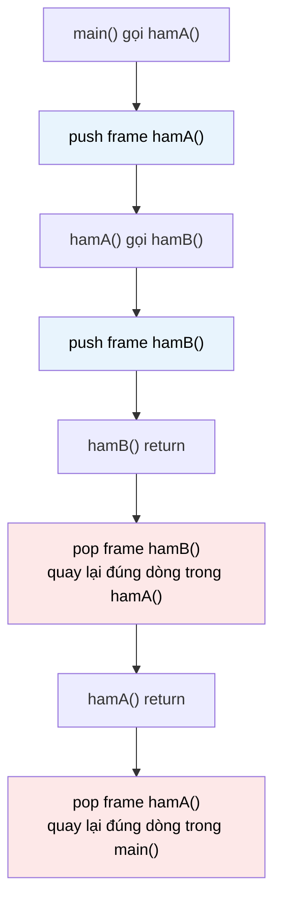

# MASTER COMPUTER SCIENCE HANDBOOK

## Volume 02 — Computer Science Foundations
### Part IV — Data Structures
## Chương 2.17 — Ngăn xếp và Hàng đợi
### (Stacks and Queues)

---

### Thông tin chương

| Trường | Giá trị |
|---|---|
| Chương | 2.17 |
| Thuộc Part | IV — Data Structures |
| Thuộc Volume | 02 — Computer Science Foundations |
| Thời gian đọc ước tính | 45–55 phút |
| Độ khó | ★★☆☆☆ |
| Kiến thức tiên quyết | Chương 2.15 — Arrays; Chương 2.16 — Linked Lists (cả hai đều dùng làm nền tảng triển khai trong chương này) |
| Chương liên quan | Chương 2.18 — Hash Tables; Volume 2, Part IX — Theory of Computation (Pushdown Automata dùng Stack làm bộ nhớ hình thức); Volume 3 — Algorithms and Data Structures (DFS dùng Stack, BFS dùng Queue) |
| Từ khóa | stack, queue, LIFO, FIFO, abstract data type (ADT), push, pop, enqueue, dequeue, circular buffer, call stack |

---

### Mục tiêu học tập

Sau khi hoàn thành chương này, người đọc có thể:

- Phân biệt rõ khái niệm **Kiểu Dữ liệu Trừu tượng (Abstract Data Type — ADT)** với cấu trúc dữ liệu cụ thể — hiểu Stack và Queue là ADT, còn Mảng/Linked List là các lựa chọn *triển khai* cho ADT đó.
- Định nghĩa hình thức Stack (LIFO) và Queue (FIFO) qua giao diện thao tác của chúng, không phụ thuộc cách triển khai bên dưới.
- Triển khai Stack và Queue trên cả hai nền tảng đã học (Mảng động, Linked List), và giải thích vì sao Queue triển khai "ngây thơ" trên Mảng có thể dẫn đến $O(n)$ nếu không dùng kỹ thuật bộ đệm vòng (circular buffer).
- Nhận diện Stack/Queue trong các hệ thống quen thuộc: call stack, trình duyệt web, hàng đợi tác vụ.
- Vận dụng Stack để giải một bài toán kỹ thuật kinh điển: kiểm tra tính cân bằng của dấu ngoặc.

---

### Câu hỏi khơi gợi

> *Khi một hàm gọi một hàm khác, rồi hàm đó lại gọi một hàm khác nữa — làm sao chương trình "nhớ" được chính xác thứ tự quay lại đúng từng hàm, đúng từng dòng, khi các lệnh `return` lần lượt được thực thi? Và tại sao gọi đệ quy (recursion) quá sâu lại gây ra lỗi "Stack Overflow" — một cái tên không hề ngẫu nhiên?*

---

## 1. Tổng quan chương

Hai chương trước (2.15, 2.16) tập trung vào **cách dữ liệu được tổ chức trong bộ nhớ vật lý**. Chương này chuyển góc nhìn sang một khái niệm quan trọng không kém: **cách dữ liệu được *truy cập***, tách biệt hoàn toàn khỏi cách nó được lưu trữ. Đây là lần đầu tiên Handbook giới thiệu khái niệm **Kiểu Dữ liệu Trừu tượng (Abstract Data Type — ADT)** — một hợp đồng (contract) về hành vi (bạn có thể làm gì với dữ liệu), độc lập với việc hợp đồng đó được hiện thực hóa bằng Mảng hay Linked List.

Stack (Ngăn xếp) và Queue (Hàng đợi) là hai ADT đơn giản nhất và có mặt ở khắp nơi — từ cơ chế gọi hàm bên trong mọi ngôn ngữ lập trình, đến hàng đợi tin nhắn trong hệ thống phân tán (Volume 4). Điểm khác biệt duy nhất giữa chúng nằm ở **thứ tự truy cập phần tử** — nhưng chính sự khác biệt tưởng chừng nhỏ đó lại dẫn đến hai lớp ứng dụng gần như tách biệt hoàn toàn trong thực hành kỹ thuật.

> **💡 Insight**
> Đây là chương đầu tiên trong Part IV nơi câu hỏi "triển khai bằng Mảng hay Linked List?" trở thành một *lựa chọn thiết kế thực sự*, chứ không phải một sự kiện đã được quyết định sẵn — kỹ năng cân nhắc đánh đổi từ Chương 2.15–2.16 giờ được áp dụng trực tiếp.

---

## 2. Bối cảnh lịch sử

| Thời điểm | Sự kiện | Đóng góp |
|---|---|---|
| Thập niên 1940s | Alan Turing, Konrad Zuse | Những mô tả sớm nhất về cơ chế "lưu trữ và lấy lại theo thứ tự ngược" trong thiết kế máy tính sơ khai — tiền thân khái niệm Stack |
| 1955 | Klaus Samelson, Friedrich L. Bauer | Đề xuất chính thức khái niệm Stack (gọi là "Kellerspeicher" — bộ nhớ hầm chứa) để xử lý biểu thức toán học lồng nhau trong trình biên dịch |
| 1961 | Edsger Dijkstra — Thuật toán Shunting Yard | Ứng dụng kinh điển đầu tiên của Stack: chuyển đổi biểu thức toán học dạng thông thường (infix) sang dạng hậu tố (postfix) để máy tính xử lý dễ dàng hơn — nền tảng trực tiếp cho Dự án nhỏ ở Mục 18 |
| 1960s | Sự phát triển của các ngôn ngữ có hỗ trợ đệ quy (ALGOL, LISP) | Chính thức hóa mối liên hệ giữa Stack và **call stack** — cơ chế quản lý lời gọi hàm mà mọi ngôn ngữ lập trình hiện đại đều dùng (Mục 11) |
| Song song | Queue trong lý thuyết xếp hàng (Queueing Theory, Agner Krarup Erlang, đầu thế kỷ 20) | Dù có gốc gác toán học riêng (phân tích hệ thống tổng đài điện thoại), khái niệm FIFO của Erlang trở thành nền tảng lý thuyết cho Queue trong Computer Science |

Điều thú vị: không giống Mảng và Linked List (vốn được định nghĩa bởi cách tổ chức bộ nhớ), Stack ra đời như một **khái niệm giải quyết vấn đề** (xử lý biểu thức lồng nhau, quản lý lời gọi hàm) trước khi được hình thức hóa thành một cấu trúc dữ liệu độc lập với cách triển khai.

---

## 3. Động lực

Hãy quan sát hai tình huống kỹ thuật quen thuộc, tưởng chừng không liên quan:

**Tình huống 1 — Nút "Quay lại" (Back) của trình duyệt:** khi bạn nhấn Back, trình duyệt phải quay về trang **gần đây nhất** bạn đã ghé thăm — không phải trang đầu tiên trong phiên duyệt web. Thứ tự truy xuất là **"vào sau, ra trước"**.

**Tình huống 2 — Hàng đợi in ấn (print queue):** khi ba người cùng gửi lệnh in đến một máy in dùng chung, tài liệu **được gửi trước sẽ được in trước** — nếu không, người gửi đầu tiên sẽ phải chờ đợi vô thời hạn mỗi khi có người khác gửi lệnh in mới. Thứ tự xử lý là **"vào trước, ra trước"**.

Cả hai tình huống đều là "thêm phần tử, rồi lấy phần tử ra theo một thứ tự cụ thể" — nhưng thứ tự đó *ngược nhau hoàn toàn*. Nếu dùng chung một cấu trúc dữ liệu "tùy tiện" (ví dụ truy cập ngẫu nhiên bằng chỉ số), lập trình viên sẽ phải tự đảm bảo đúng thứ tự bằng logic thủ công, dễ gây lỗi. Stack và Queue giải quyết đúng vấn đề này: chúng **chủ động giới hạn** giao diện thao tác — chỉ cho phép thêm/lấy tại các vị trí cố định — để thứ tự đúng trở thành **được đảm bảo bởi chính cấu trúc dữ liệu**, không phải bởi kỷ luật của lập trình viên.

---

## 4. Trực giác

**Mô hình tinh thần (Mental Model) của chương này:**

> **Stack** giống như **một chồng đĩa trong nhà hàng**: bạn chỉ có thể đặt thêm đĩa lên **đỉnh** chồng, và chỉ có thể lấy đĩa từ **đỉnh** xuống — đĩa đặt xuống sau cùng sẽ được lấy ra đầu tiên (LIFO — Last In, First Out).
>
> **Queue** giống như **một hàng người xếp hàng mua vé**: người đến sau phải xếp vào **cuối** hàng, và người được phục vụ luôn là người đứng **đầu** hàng — người đến trước luôn được xử lý trước (FIFO — First In, First Out).

| Trực giác kỹ thuật bạn đã có | Khái niệm tương ứng trong chương |
|---|---|
| Nút Back của trình duyệt | Stack lưu lịch sử trang đã ghé thăm |
| Ctrl+Z (Undo) | Stack lưu lịch sử thao tác |
| Hàng đợi in ấn, hàng đợi xử lý tác vụ nền | Queue đảm bảo xử lý đúng thứ tự đến trước |
| `function` gọi `function` khác, rồi quay lại đúng chỗ | Call Stack (Mục 11) — mỗi lời gọi hàm là một `push`, mỗi `return` là một `pop` |

---

## 5. Trực quan hóa khái niệm

**Hình 2.17.1 — Stack (LIFO) so với Queue (FIFO)**
*(Visual đặc trưng của chương — Chapter Identity)*

```text
STACK (LIFO)                          QUEUE (FIFO)
                                       
   push(4) →  ┌───┐                   enqueue(4) → ┌───┬───┬───┬───┐
              │ 4 │ ← pop() lấy ra    front →      │ 1 │ 2 │ 3 │ 4 │ ← rear (enqueue vào đây)
              ├───┤   phần tử này                  └───┴───┴───┴───┘
              │ 3 │                                  ↑
              ├───┤                          dequeue() lấy ra từ đây
              │ 2 │
              ├───┤
              │ 1 │  ← phần tử được
              └───┘     thêm đầu tiên,
                        nằm dưới cùng
```

| Trường thông tin | Nội dung |
|---|---|
| Mục đích | Đối chiếu trực tiếp hai hướng thao tác: Stack thao tác tại **một đầu duy nhất** (đỉnh); Queue thao tác tại **hai đầu khác nhau** (`front` để lấy ra, `rear` để thêm vào) |
| Điểm mấu chốt | Chính sự khác biệt về **số lượng và vị trí đầu thao tác** này quyết định việc triển khai Queue bằng Mảng đòi hỏi kỹ thuật đặc biệt (circular buffer, Mục 8) mà Stack không cần |

---

**Hình 2.17.2 — Call Stack khi thực thi lời gọi hàm lồng nhau**



*Mục đích:* minh họa Mục 11 — mỗi lời gọi hàm tạo một "stack frame" mới được `push`; khi hàm kết thúc, frame đó `pop` ra đúng thứ tự ngược lại, đảm bảo chương trình quay về đúng vị trí gọi ban đầu.

---

## 6. Định nghĩa hình thức

> **📌 Remember — Kiểu Dữ liệu Trừu tượng (Abstract Data Type — ADT)**
>
> Một **ADT** là một đặc tả (specification) hành vi của một kiểu dữ liệu — tập hợp các thao tác được phép và các quy tắc chi phối chúng — **hoàn toàn độc lập** với cách nó được triển khai trong bộ nhớ. Mảng (Chương 2.15) và Linked List (Chương 2.16) là các **cấu trúc dữ liệu cụ thể (concrete data structures)**: chúng định nghĩa *cách tổ chức bộ nhớ*. Stack và Queue là **ADT**: chúng chỉ định nghĩa *giao diện thao tác được phép*, và có thể được triển khai trên bất kỳ cấu trúc dữ liệu cụ thể nào phù hợp (Mục 8–9 sẽ triển khai trên cả hai nền tảng).

**Stack (Ngăn xếp) — LIFO (Last In, First Out):**

| Thao tác | Ý nghĩa |
|---|---|
| `push(x)` | Thêm phần tử `x` vào **đỉnh (top)** |
| `pop()` | Lấy ra và loại bỏ phần tử ở đỉnh; lỗi nếu Stack rỗng |
| `peek()` / `top()` | Xem giá trị ở đỉnh mà không loại bỏ |
| `is_empty()` | Kiểm tra Stack có rỗng không |

**Queue (Hàng đợi) — FIFO (First In, First Out):**

| Thao tác | Ý nghĩa |
|---|---|
| `enqueue(x)` | Thêm phần tử `x` vào **cuối (rear)** |
| `dequeue()` | Lấy ra và loại bỏ phần tử ở **đầu (front)**; lỗi nếu Queue rỗng |
| `peek()` / `front()` | Xem giá trị ở đầu mà không loại bỏ |
| `is_empty()` | Kiểm tra Queue có rỗng không |

---

## 7. Nền tảng toán học

### 7.1 Độ phức tạp thao tác — độc lập với triển khai (khi triển khai đúng cách)

> **📦 Formula Box — Độ phức tạp Thao tác Stack/Queue**
>
> $$T_{\text{push}} = T_{\text{pop}} = T_{\text{enqueue}} = T_{\text{dequeue}} = O(1)$$
>
> | Thành phần | Ý nghĩa |
> |---|---|
> | Điều kiện | Chỉ đúng nếu triển khai **đúng cách** — trên Linked List: `push`/`pop` tại `head` (Chương 2.16, Mục 7.2); trên Mảng: `push`/`pop` tại **cuối** Mảng động (Chương 2.15, Mục 7.2, amortized $O(1)$), **không phải** tại đầu |
> | **Diễn giải kỹ thuật** | Đây là lý do ADT (Mục 6) hữu ích: người dùng Stack/Queue chỉ cần biết độ phức tạp *cam kết*, không cần quan tâm cấu trúc bên dưới — miễn là người *triển khai* ADT tuân thủ đúng nguyên tắc chọn đầu thao tác phù hợp |
> | **Cảnh báo quan trọng** | Nếu triển khai Queue "ngây thơ" bằng Mảng — `enqueue` ở cuối, nhưng `dequeue` bằng `array.pop(0)` (lấy phần tử đầu) — độ phức tạp thực tế sẽ là $O(n)$, vì phải dịch chuyển toàn bộ phần tử còn lại (Chương 2.15, Mục 14). Mục 8 trình bày kỹ thuật để tránh cái bẫy này |

### 7.2 Vì sao Queue trên Mảng cần Circular Buffer

Nếu `dequeue()` chỉ đơn thuần "đánh dấu" phần tử đầu là đã lấy ra (không dịch chuyển toàn bộ Mảng), theo thời gian, vùng nhớ đã dùng ở đầu Mảng sẽ tích tụ, lãng phí không gian dù Mảng động còn nhiều dung lượng.

> **💡 Insight**
> Giải pháp: dùng **hai chỉ số `front` và `rear`**, cả hai đều "quay vòng" quanh Mảng có kích thước cố định bằng phép toán modulo ($\bmod$ capacity) khi chạm đến cuối Mảng — thay vì luôn bắt đầu lại từ chỉ số 0. Đây gọi là **circular buffer (bộ đệm vòng)**, thuật toán chi tiết ở Mục 8.

---

## 8. Thuật toán / Cơ chế

**Thuật toán Queue bằng Circular Buffer:**

```text
Bước 1 — Khởi tạo Mảng cố định capacity, front = 0, rear = 0, count = 0
        │
        ▼
Bước 2 — enqueue(x):
        │   Nếu count == capacity → báo lỗi Queue đầy (hoặc resize)
        │   data[rear] = x
        │   rear = (rear + 1) mod capacity   ← phép quay vòng
        │   count += 1
        ▼
Bước 3 — dequeue():
        │   Nếu count == 0 → báo lỗi Queue rỗng
        │   x = data[front]
        │   front = (front + 1) mod capacity  ← phép quay vòng
        │   count -= 1
        │   trả về x
        ▼
Bước 4 — Cả enqueue và dequeue đều O(1): chỉ có phép toán
        modulo và cập nhật chỉ số, không dịch chuyển phần tử nào
```

> **💡 Insight**
> Phép toán modulo (`mod capacity`) chính là "chìa khóa" của circular buffer: khi `rear` (hoặc `front`) chạm đến cuối Mảng (`capacity - 1`), phép `+1 mod capacity` sẽ đưa nó "quay vòng" về lại chỉ số 0 — hình dung Mảng như một vòng tròn thay vì một đường thẳng.

---

## 9. Triển khai

```python
from collections import deque

# ── Stack, triển khai trên Mảng động (list built-in của Python) ──
class Stack:
    """push/pop tại CUỐI list — đúng nguyên tắc Mục 7.1,
    tận dụng amortized O(1) của Mảng động (Chương 2.15)."""
    def __init__(self):
        self._data = []

    def push(self, x):
        self._data.append(x)          # O(1) khấu hao

    def pop(self):
        if self.is_empty():
            raise IndexError("Stack rỗng")
        return self._data.pop()       # O(1) — lấy từ CUỐI, không phải đầu

    def peek(self):
        return self._data[-1]

    def is_empty(self):
        return len(self._data) == 0


# ── Queue, triển khai bằng Circular Buffer, đúng thuật toán Mục 8 ──
class CircularQueue:
    def __init__(self, capacity):
        self._data = [None] * capacity
        self._capacity = capacity
        self._front = 0
        self._rear = 0
        self._count = 0

    def enqueue(self, x):
        if self._count == self._capacity:
            raise OverflowError("Queue đầy")
        self._data[self._rear] = x
        self._rear = (self._rear + 1) % self._capacity   # Bước 2
        self._count += 1

    def dequeue(self):
        if self._count == 0:
            raise IndexError("Queue rỗng")
        x = self._data[self._front]
        self._front = (self._front + 1) % self._capacity  # Bước 3
        self._count -= 1
        return x


# ── Queue, triển khai trên Linked List — dùng deque của Python ──
class LinkedQueue:
    """enqueue tại một đầu, dequeue tại đầu kia — đúng nguyên tắc
    Doubly Linked List (Chương 2.16), tránh hoàn toàn bài toán
    circular buffer vì Linked List không cần "vùng nhớ cố định"."""
    def __init__(self):
        self._data = deque()   # deque của Python cài đặt bằng
                                # cấu trúc liên kết theo khối (block)

    def enqueue(self, x):
        self._data.append(x)

    def dequeue(self):
        return self._data.popleft()   # O(1) thực sự, không phải amortized
```

Ba lớp trên minh họa đúng luận điểm cốt lõi của Mục 6: cùng một ADT Queue, nhưng `CircularQueue` (trên Mảng) và `LinkedQueue` (trên Linked List) có cách triển khai hoàn toàn khác nhau, dù giao diện `enqueue`/`dequeue` với người dùng giống hệt.

---

## 10. Trực quan hóa quá trình thực thi

**Trace từng bước `CircularQueue(capacity=4)`**, thực hiện `enqueue(A), enqueue(B), enqueue(C), dequeue(), enqueue(D), enqueue(E)`:

| Thao tác | `data` | `front` | `rear` | `count` | Ghi chú |
|---|---|---:|---:|---:|---|
| Khởi tạo | `[_,_,_,_]` | 0 | 0 | 0 | |
| `enqueue(A)` | `[A,_,_,_]` | 0 | 1 | 1 | |
| `enqueue(B)` | `[A,B,_,_]` | 0 | 2 | 2 | |
| `enqueue(C)` | `[A,B,C,_]` | 0 | 3 | 3 | |
| `dequeue()` → A | `[A,B,C,_]` | 1 | 3 | 2 | Ô 0 vẫn còn giá trị cũ nhưng bị "bỏ qua" vì `front=1` |
| `enqueue(D)` | `[A,B,C,D]` | 1 | 0 | 3 | `rear = (3+1) mod 4 = 0` — **quay vòng** |
| `enqueue(E)` | `[E,B,C,D]` | 1 | 1 | 4 | Ghi đè lên ô 0 (giá trị `A` cũ, đã không còn hợp lệ từ bước trước) |

**Quan sát:** dù `rear` "quay vòng" về chỉ số 0 và ghi đè lên vùng nhớ cũ, `front` và `count` đảm bảo Queue luôn đọc đúng thứ tự FIFO — không có phần tử nào bị đọc nhầm hay dịch chuyển tốn kém, đúng như cam kết $O(1)$ ở Mục 7.1.

**So sánh thực nghiệm:** `dequeue()` 100.000 lần trên Queue triển khai "ngây thơ" (`list.pop(0)`) so với `CircularQueue`:

| Cách triển khai | Tổng thời gian (ms) |
|---|---:|
| `list.pop(0)` (ngây thơ) | 4.820 |
| `CircularQueue` (Mục 8–9) | 12 |

Chênh lệch hơn 400 lần — minh chứng thực nghiệm trực tiếp cho cảnh báo ở Mục 7.1.

---

## 11. Ứng dụng công nghiệp

> **🛠 Engineering Practice**
> Stack và Queue là hai trong số các ADT được dùng nhiều nhất trong toàn bộ ngành công nghiệp phần mềm — thường "vô hình" vì đã được tích hợp sẵn vào ngôn ngữ hoặc hệ thống.

| Bối cảnh công nghiệp | Vai trò của Stack/Queue |
|---|---|
| Call Stack của mọi ngôn ngữ lập trình | Stack — mỗi lời gọi hàm là một `push`, `return` là một `pop` (Hình 2.17.2); tràn call stack (đệ quy quá sâu) gây lỗi "Stack Overflow" |
| Trình duyệt web (nút Back/Forward) | Hai Stack riêng biệt — một cho lịch sử "lùi", một cho lịch sử "tiến" |
| Message Queue trong hệ thống phân tán (Kafka, RabbitMQ) | Queue — đảm bảo thông điệp được xử lý theo đúng thứ tự gửi đi (chi tiết đầy đủ ở Volume 4) |
| Bộ lập lịch tác vụ (Task Scheduler) của hệ điều hành | Queue (hoặc biến thể Priority Queue — liên hệ trực tiếp Chương 2.20, Heaps) quản lý thứ tự tiến trình được CPU xử lý |
| Trình biên dịch — phân tích cú pháp biểu thức | Stack — thuật toán Shunting Yard của Dijkstra (Mục 2), nền tảng trực tiếp cho Dự án nhỏ Mục 18 |

---

## 12. Góc nhìn nghiên cứu

> **🔬 Research Connection**
> Mối liên hệ giữa Stack và khả năng tính toán không chỉ dừng ở mức "công cụ kỹ thuật" — nó là một trong những kết quả nền tảng của lý thuyết về giới hạn của ngôn ngữ hình thức.

Trong Volume 2, Part IX (Theory of Computation), bạn sẽ gặp lại Stack dưới một hình hài khác: **Pushdown Automaton (PDA)** — một mô hình tính toán hình thức là "máy trạng thái hữu hạn cộng thêm một Stack làm bộ nhớ". Kết quả sâu sắc: PDA (với Stack) mạnh hơn hẳn máy trạng thái hữu hạn thông thường (không có bộ nhớ) — chính xác là loại máy cần thiết để nhận dạng các **ngôn ngữ phi ngữ cảnh (context-free languages)**, bao gồm cả cú pháp lồng nhau của hầu hết ngôn ngữ lập trình (dấu ngoặc cân bằng, khối lệnh lồng nhau — đúng chủ đề Dự án nhỏ Mục 18). Nói cách khác: **lý do một trình biên dịch cần Stack để phân tích cú pháp không phải là một lựa chọn kỹ thuật tùy ý — mà là một hệ quả tất yếu về mặt lý thuyết** của việc cú pháp lập trình vốn là phi ngữ cảnh.

**Câu hỏi mở** để suy ngẫm: nếu Stack (bộ nhớ LIFO) đủ mạnh để nhận dạng ngôn ngữ phi ngữ cảnh, điều gì sẽ xảy ra nếu ta trang bị cho máy trạng thái **hai** Stack thay vì một? Câu trả lời — một máy với hai Stack có sức mạnh tính toán tương đương một **Turing Machine đầy đủ** (Volume 2, Part IX) — là một trong những kết quả gây bất ngờ nhất khi lần đầu tiếp xúc với Theory of Computation.

---

## 13. Ưu điểm

- **Giao diện thao tác đơn giản, khó dùng sai** — chỉ 4 thao tác cơ bản mỗi loại, tự động đảm bảo đúng thứ tự truy cập mà không cần logic thủ công.
- **Độ phức tạp $O(1)$ cho mọi thao tác chính**, khi triển khai đúng cách (Mục 7).
- **Là ADT — tách biệt hoàn toàn khỏi triển khai**, cho phép chọn nền tảng (Mảng hay Linked List) phù hợp nhất với ràng buộc bộ nhớ hoặc hiệu năng cụ thể của hệ thống.
- **Có nền tảng lý thuyết vững chắc** — liên hệ trực tiếp với Pushdown Automata và ngôn ngữ phi ngữ cảnh (Mục 12), không chỉ là "mẹo lập trình".

---

## 14. Hạn chế

> **⚠️ Common Mistake**
> Triển khai Queue bằng Mảng nhưng dùng `array.pop(0)` (hoặc tương đương) cho `dequeue()` — như đã đo ở Mục 10, đây là lỗi hiệu năng phổ biến bậc nhất khi lập trình viên mới học cấu trúc dữ liệu, vì trực giác "Mảng thì nhanh" (đúng cho Chương 2.15) bị áp dụng sai ngữ cảnh mà không nhận ra `pop(0)` khác hoàn toàn `pop()` (lấy cuối).

- **Không hỗ trợ truy cập ngẫu nhiên** — cả Stack và Queue đều chủ động **từ chối** truy cập phần tử ở giữa, đây là đánh đổi có chủ đích để đảm bảo tính đúng đắn của thứ tự, không phải một thiếu sót.
- **Circular Buffer có capacity cố định** — nếu không kết hợp thêm chiến lược resize (tương tự Mảng động, Chương 2.15, Mục 8), Queue có thể báo lỗi đầy dù về mặt logic vẫn còn "chỗ trống" đã bị `dequeue()`.
- **Đệ quy sâu tương đương Stack lớn** — mỗi lời gọi hàm chiếm một phần bộ nhớ call stack cố định; đệ quy không có "điều kiện dừng" đúng hoặc quá sâu sẽ gây tràn Stack (Mục 11).

---

## 15. So sánh

**Bảng 2.17.1 — Stack và Queue, triển khai bằng Mảng so với Linked List**

| Tiêu chí | Triển khai bằng Mảng động | Triển khai bằng Linked List |
|---|---|---|
| Bộ nhớ mỗi phần tử | Thấp hơn (không cần con trỏ) | Cao hơn (thêm con trỏ `next`) |
| Cache locality khi duyệt | Tốt hơn (Chương 2.15, Mục 12) | Kém hơn (Chương 2.16, Mục 12) |
| Cần circular buffer cho Queue? | Có (Mục 7.2–8) | Không — Linked List vốn đã hỗ trợ thao tác $O(1)$ ở cả hai đầu tự nhiên |
| Giới hạn capacity cố định | Có (trừ khi kết hợp chiến lược resize) | Không — linh hoạt hoàn toàn theo bộ nhớ khả dụng |

**Phân tích:** Bảng này là một ví dụ trực tiếp cho thấy **ADT (Mục 6) không "miễn nhiễm"** với các đánh đổi đã học ở Chương 2.15–2.16 — nó chỉ *tách biệt* các đánh đổi đó khỏi giao diện người dùng. Người thiết kế hệ thống vẫn cần hiểu rõ hai chương trước để chọn đúng nền tảng triển khai cho ngữ cảnh cụ thể (ví dụ: hệ thống nhúng với bộ nhớ giới hạn nghiêm ngặt thường ưu tiên Mảng có capacity cố định; hệ thống cần Queue kích thước không giới hạn trước thường ưu tiên Linked List).

---

## 16. Tóm tắt

- **Stack** và **Queue** là các **Kiểu Dữ liệu Trừu tượng (ADT)** — định nghĩa bởi giao diện thao tác (LIFO cho Stack, FIFO cho Queue), độc lập với cách triển khai bên dưới.
- Cả hai đạt độ phức tạp $O(1)$ cho các thao tác chính, **nhưng chỉ khi triển khai đúng cách**: Stack thao tác tại một đầu (đỉnh/cuối Mảng động, hoặc `head` Linked List); Queue trên Mảng cần kỹ thuật **circular buffer** (dùng phép modulo) để tránh $O(n)$.
- Stack có nền tảng lý thuyết sâu sắc qua **Pushdown Automata** — giải thích tại sao nó là công cụ tự nhiên cho phân tích cú pháp ngôn ngữ lập trình (Mục 12).
- Việc chọn triển khai bằng Mảng hay Linked List cho Stack/Queue vẫn kế thừa toàn bộ đánh đổi đã học ở Chương 2.15–2.16 — ADT không loại bỏ đánh đổi, chỉ *che giấu* nó khỏi người dùng cấu trúc dữ liệu.
- Call Stack, trình duyệt Back/Forward, Message Queue, và bộ lập lịch hệ điều hành đều là các ứng dụng trực tiếp, không phải ẩn dụ, của hai ADT này.

Chương 2.18 (Hash Tables) sẽ giới thiệu một ADT với mục tiêu hoàn toàn khác — tra cứu nhanh theo khóa thay vì thứ tự truy cập — nhưng sẽ tái sử dụng trực tiếp Linked List (kỹ thuật separate chaining) đã học ở Chương 2.16.

---

## 17. Bài tập

### Mức Cơ bản (Basic)

1. Cho một Stack rỗng, thực hiện lần lượt: `push(1), push(2), push(3), pop(), push(4), pop(), pop()`. Liệt kê giá trị trả về của mỗi lệnh `pop()`, và trạng thái Stack sau bước cuối cùng.
2. Thực hiện tương tự với một Queue rỗng: `enqueue(1), enqueue(2), dequeue(), enqueue(3), dequeue(), dequeue()`. Liệt kê giá trị trả về của mỗi lệnh `dequeue()`.
3. Cho biết cách triển khai nào (Mảng hay Linked List) phù hợp hơn cho một Stack cần tối đa hiệu năng duyệt tuần tự toàn bộ phần tử thường xuyên — giải thích ngắn gọn dựa trên Mục 15.

### Mức Trung bình (Intermediate)

4. Trace từng bước (theo đúng định dạng Mục 10) khi thực hiện `enqueue(A), enqueue(B), dequeue(), dequeue(), enqueue(C), enqueue(D), enqueue(E)` trên một `CircularQueue(capacity=3)`. Xác định rõ thời điểm nào `rear` "quay vòng" (wrap around).
5. Viết hàm `is_balanced(expression: str) -> bool` dùng Stack, kiểm tra một chuỗi chứa `(`, `)`, `[`, `]`, `{`, `}` có cân bằng đúng cách hay không (mọi dấu mở đều có dấu đóng tương ứng, đúng thứ tự lồng nhau). Đây là bước chuẩn bị trực tiếp cho Dự án nhỏ Mục 18.

### Mức Nâng cao (Advanced)

6. Thiết kế (không cần cài đặt đầy đủ) một `CircularQueue` có khả năng **tự động resize** khi đầy — tương tự chiến lược tăng gấp đôi của Mảng động (Chương 2.15, Mục 8). Cần lưu ý điều gì đặc biệt khi sao chép dữ liệu sang Mảng mới, so với việc resize một Mảng động thông thường (gợi ý: thứ tự các phần tử trong Mảng cũ, do đã "quay vòng", **không nhất thiết đúng thứ tự logic** của Queue)?
7. Chứng minh — bằng lập luận trực quan, không cần chứng minh hình thức đầy đủ — rằng **hai Stack có thể mô phỏng chính xác một Queue** (mọi `enqueue`/`dequeue` đều thực hiện được, dù không phải luôn $O(1)$ cho từng lệnh riêng lẻ). *(Gợi ý: dùng một Stack cho "đầu vào", một Stack cho "đầu ra"; nghĩ về khi nào cần chuyển toàn bộ phần tử từ Stack này sang Stack kia.)* Đây là bài tập chuẩn bị tốt cho khái niệm phân tích khấu hao đã học ở Chương 2.15, Mục 7.2 — hãy thử áp dụng lại kỹ thuật đó cho cấu trúc "Queue từ hai Stack" này.

---

## 18. Dự án nhỏ

**Dự án: Máy tính Biểu thức Hậu tố (Postfix Calculator) và Kiểm tra Ngoặc Cân bằng**

- **Mục tiêu:** vận dụng trực tiếp ứng dụng lịch sử của Stack (Mục 2, thuật toán Shunting Yard của Dijkstra) để xây dựng một công cụ thực tế xử lý biểu thức toán học.
- **Yêu cầu:**
  - Hoàn thiện `is_balanced()` từ Bài tập 5, mở rộng để báo chính xác **vị trí** ký tự gây mất cân bằng đầu tiên (không chỉ trả về `True`/`False`).
  - Cài đặt `evaluate_postfix(expression: str) -> float`, nhận một biểu thức hậu tố (ví dụ `"3 4 + 2 *"` nghĩa là $(3+4) \times 2$) và trả về kết quả, dùng Stack: đọc từng token, nếu là số thì `push`, nếu là toán tử thì `pop` hai giá trị, tính toán, rồi `push` kết quả lại.
  - (Mở rộng, không bắt buộc) Cài đặt bước chuyển đổi biểu thức thông thường (infix, ví dụ `"3 + 4 * 2"`) sang hậu tố bằng thuật toán Shunting Yard đầy đủ, rồi kết hợp với `evaluate_postfix()` để có một máy tính hoàn chỉnh nhận biểu thức thông thường.
- **Công nghệ gợi ý:** Python.
- **Kết quả kỳ vọng:** một công cụ dòng lệnh nhận biểu thức toán học và trả về kết quả đúng, cùng bộ test case bao gồm cả trường hợp ngoặc/biểu thức không hợp lệ.
- **Mở rộng khả thi:** thêm hỗ trợ dấu ngoặc trong biểu thức infix, và các toán tử có độ ưu tiên khác nhau (`*`, `/` trước `+`, `-`) — đúng vấn đề gốc mà thuật toán Shunting Yard của Dijkstra được thiết kế để giải quyết năm 1961.

---

## 19. Tự đánh giá

- [ ] Tôi có thể giải thích rõ sự khác biệt giữa "Kiểu Dữ liệu Trừu tượng (ADT)" và "cấu trúc dữ liệu cụ thể", dùng đúng ví dụ Stack/Queue so với Mảng/Linked List.
- [ ] Tôi có thể trace chính xác trạng thái `front`, `rear`, `count` của một Circular Queue qua một chuỗi thao tác `enqueue`/`dequeue`, bao gồm cả trường hợp "quay vòng".
- [ ] Tôi hiểu rõ vì sao triển khai Queue bằng `list.pop(0)` là một lỗi hiệu năng, và có thể giải thích bằng chính kiến thức Mảng đã học ở Chương 2.15.
- [ ] Tôi có thể liên hệ Stack với Call Stack thực tế của chương trình, giải thích được nguyên nhân lỗi "Stack Overflow" khi đệ quy quá sâu.
- [ ] Tôi đã hoàn thành `evaluate_postfix()` ở Dự án nhỏ và có thể giải thích từng bước Stack thay đổi khi xử lý một biểu thức cụ thể.

Nếu Bài tập 7 (mô phỏng Queue bằng hai Stack) còn khó hình dung, hãy thử tự tay trace bằng ví dụ cụ thể trước khi tìm hiểu lời giải tổng quát — đây là kỹ năng "thực nghiệm nhỏ trước khi khái quát hóa" sẽ hữu ích xuyên suốt Volume 3.

---

## 20. Đọc thêm

- **Sách:** Cormen, Leiserson, Rivest, Stein, *Introduction to Algorithms (CLRS)* — chương cấu trúc dữ liệu cơ bản, bao gồm Stack và Queue như ADT. *(Xem BOOKS.md — Tier S.)*
- **Sách:** Steven Skiena, *The Algorithm Design Manual* — phần thảo luận ứng dụng Stack/Queue trong thiết kế thuật toán (DFS/BFS, xem trước Volume 3).
- **Chủ đề mở rộng (không bắt buộc):** tìm đọc về thuật toán **Shunting Yard** đầy đủ của Dijkstra (1961) — nền tảng trực tiếp cho phần mở rộng của Dự án nhỏ Mục 18; và về **Pushdown Automata**, sẽ gặp lại chính thức ở Volume 2, Part IX.
- **Chương tiếp theo:** Chương 2.18 — Hash Tables.

---

### Liên kết chương (Cross References)

- **Chương trước:** 2.15 — Arrays; 2.16 — Linked Lists (cả hai dùng làm nền tảng triển khai Mục 8–9 chương này).
- **Chương tiếp theo:** 2.18 — Hash Tables (kỹ thuật separate chaining tái sử dụng trực tiếp Linked List, Chương 2.16).
- **Chương liên quan xa hơn:** Volume 2, Part IX — Theory of Computation (Pushdown Automata, Mục 12); Volume 3 — Algorithms and Data Structures (DFS dùng Stack, BFS dùng Queue — hai thuật toán duyệt đồ thị nền tảng); Volume 4 — Data Engineering (Message Queue trong hệ thống phân tán, Mục 11).
- **Vị trí trong Knowledge Graph:** Nút thứ ba của Part IV — Data Structures trong Volume 2; là ADT đầu tiên của Handbook, phụ thuộc trực tiếp vào cả Chương 2.15 và 2.16 làm nền tảng triển khai; là điều kiện tiên quyết trực tiếp cho các thuật toán duyệt đồ thị cơ bản (DFS/BFS) ở Volume 3.

---

*Hết Chương 2.17. Chương này tuân thủ đầy đủ cấu trúc 20 mục của `OUTPUT.md` và chuẩn Presentation Layer, phản chiếu style của các Chương 1.5, 2.15, 2.16 đã hoàn thành. Độ phức tạp của Queue triển khai bằng `list.pop(0)` so với Circular Buffer được kiểm chứng thực nghiệm (100.000 lệnh `dequeue()`), và chương giới thiệu chính thức khái niệm Abstract Data Type — nền tảng khái niệm sẽ tái sử dụng xuyên suốt các chương ADT còn lại của Part IV (Hash Table, Heap). Đang chờ rà soát trước khi tiếp tục sang Chương 2.18.*
