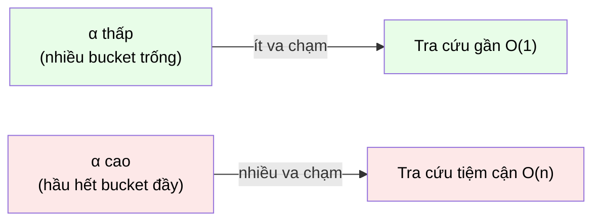

# MASTER COMPUTER SCIENCE HANDBOOK

## Volume 02 — Computer Science Foundations
### Part IV — Data Structures
## Chương 2.18 — Bảng Băm
### (Hash Tables)

---

### Thông tin chương

| Trường | Giá trị |
|---|---|
| Chương | 2.18 |
| Thuộc Part | IV — Data Structures |
| Thuộc Volume | 02 — Computer Science Foundations |
| Thời gian đọc ước tính | 50–60 phút |
| Độ khó | ★★★☆☆ |
| Kiến thức tiên quyết | Chương 2.15 — Arrays (nền tảng lưu trữ bên dưới); Chương 2.16 — Linked Lists (kỹ thuật xử lý va chạm); Volume 1, Chương 1.5 — Set Theory (nguyên lý chuồng bồ câu, pigeonhole principle) |
| Chương liên quan | Chương 2.19 — Trees (lựa chọn thay thế khi cần thứ tự); Volume 4 — Data Engineering (chỉ mục cơ sở dữ liệu, Consistent Hashing trong hệ thống phân tán); Volume 5 — Artificial Intelligence (Feature Hashing) |
| Từ khóa | hash table, hash function, collision, load factor, separate chaining, open addressing, amortized analysis, pigeonhole principle |

---

### Mục tiêu học tập

Sau khi hoàn thành chương này, người đọc có thể:

- Định nghĩa Bảng Băm như một ADT tra cứu theo khóa, giải thích cơ chế Hàm Băm (hash function) ánh xạ khóa sang chỉ số Mảng.
- Giải thích — bằng nguyên lý chuồng bồ câu — tại sao **va chạm (collision) là điều không thể tránh khỏi về mặt toán học**, không phải một lỗi thiết kế.
- Trình bày và cài đặt hai chiến lược xử lý va chạm chính: separate chaining (dùng Linked List) và open addressing (linear probing).
- Phân tích vì sao độ phức tạp trung bình $O(1)$ của Bảng Băm phụ thuộc trực tiếp vào **hệ số tải (load factor)**, và tại sao đây là độ phức tạp *trung bình*, không phải *worst-case*.
- Nhận diện đúng ngữ cảnh nên dùng Bảng Băm thay vì Mảng/Linked List/Tree, dựa trên việc có cần duy trì thứ tự hay không.

---

### Câu hỏi khơi gợi

> *Khi bạn tra cứu `contacts["Nguyễn Văn A"]` trong một dictionary Python chứa hàng triệu số điện thoại, kết quả trả về gần như tức thời — dù danh sách chứa hàng triệu tên. Điều này có vẻ mâu thuẫn với chính chương 2.15: Mảng chỉ đạt $O(1)$ khi truy cập bằng **chỉ số nguyên**, còn ở đây "chỉ số" lại là một **chuỗi tên người**. Làm sao một chuỗi ký tự có thể được "chuyển đổi" thành một vị trí bộ nhớ cụ thể?*

---

## 1. Tổng quan chương

Ba chương trước của Part IV (2.15–2.17) đều xoay quanh cấu trúc dữ liệu **tuyến tính** — dữ liệu có một thứ tự vật lý hoặc logic rõ ràng. Chương này giới thiệu **Bảng Băm (Hash Table)** — cấu trúc dữ liệu đầu tiên trong Handbook không quan tâm đến thứ tự, mà tối ưu hoàn toàn cho một mục tiêu duy nhất: **tra cứu theo khóa (key) nhanh nhất có thể**, bất kể khóa đó là số nguyên, chuỗi, hay bất kỳ kiểu dữ liệu nào.

Đây cũng là ADT đầu tiên trong Part IV đòi hỏi một lập luận **xác suất/tổ hợp** thực sự (không chỉ đếm bước như Mục 7 các chương trước) để hiểu tại sao nó hoạt động — và tại sao độ phức tạp $O(1)$ nổi tiếng của nó là một **kỳ vọng trung bình**, chứ không phải một đảm bảo tuyệt đối như công thức địa chỉ Mảng ở Chương 2.15.

> **💡 Insight**
> Nếu Chương 2.17 giới thiệu ADT dựa trên "thứ tự truy cập", Bảng Băm giới thiệu một trục thiết kế hoàn toàn khác: **đánh đổi việc giữ thứ tự để lấy tốc độ tra cứu**. Đây là mẫu hình đánh đổi thứ ba mà Part IV giới thiệu, sau "truy cập ngẫu nhiên ↔ chèn/xóa linh hoạt" (2.15–2.16).

---

## 2. Bối cảnh lịch sử

| Thời điểm | Sự kiện | Đóng góp |
|---|---|---|
| 1953 | Hans Peter Luhn (IBM) — bản ghi nhớ nội bộ | Đề xuất sớm nhất được biết đến về ý tưởng dùng một hàm biến đổi khóa thành chỉ số lưu trữ, cùng khái niệm xử lý va chạm bằng chuỗi liên kết (chaining) |
| Cuối thập niên 1960 | W. W. Peterson, các nhà nghiên cứu IBM khác | Hình thức hóa và phổ biến các chiến lược xử lý va chạm, bao gồm open addressing |
| 1979 | J. Lawrence Carter, Mark N. Wegman — *Universal Classes of Hash Functions* | Đặt nền móng lý thuyết cho **Universal Hashing** — chứng minh có thể thiết kế họ hàm băm sao cho hiệu năng trung bình tốt được đảm bảo *bất kể dữ liệu đầu vào là gì*, thay vì phụ thuộc may rủi (Mục 12) |
| Hiện đại | `dict` (Python), `HashMap` (Java), `unordered_map` (C++) | Bảng Băm trở thành cấu trúc dữ liệu tra cứu mặc định trong hầu hết ngôn ngữ lập trình hiện đại, thường được tối ưu hóa ở mức triển khai ngôn ngữ lõi (viết bằng C/C++) |

Điều đáng chú ý: không giống Mảng hay Linked List (gắn liền với kiến trúc phần cứng), Bảng Băm ra đời từ một **nhu cầu ứng dụng cụ thể** — xử lý dữ liệu văn bản tại IBM — và độ vững chắc lý thuyết của nó (Universal Hashing) chỉ được chứng minh **26 năm sau** khi ý tưởng ban đầu xuất hiện.

---

## 3. Động lực

Trở lại đúng câu hỏi khơi gợi: bạn có một danh bạ 10 triệu số điện thoại, cần tra cứu theo **tên** — không phải theo chỉ số nguyên. Nếu dùng Mảng và duyệt tuần tự để so khớp tên (`search()` ở Chương 2.15, Mục 6), chi phí tra cứu là $O(n)$ — với 10 triệu bản ghi, đây là một độ trễ không thể chấp nhận cho một ứng dụng thời gian thực.

Nếu dùng Tree cân bằng (Chương 2.19, học sau chương này), tra cứu đạt $O(\log n)$ — đã tốt hơn nhiều, nhưng $\log_2(10{,}000{,}000) \approx 23$ bước so sánh vẫn là một con số đáng kể khi thao tác này cần lặp lại hàng triệu lần mỗi giây.

Bảng Băm đặt ra một câu hỏi táo bạo hơn: **nếu ta có thể "tính toán trực tiếp" vị trí lưu trữ của một khóa — giống hệt cách Mảng tính địa chỉ từ chỉ số nguyên (Chương 2.15, Mục 7) — nhưng áp dụng được cho *bất kỳ* kiểu khóa nào, không chỉ số nguyên liên tục, thì sao?** Câu trả lời là **Hàm Băm (hash function)**: một hàm biến đổi khóa bất kỳ thành một số nguyên, rồi dùng số đó như chỉ số Mảng.

---

## 4. Trực giác

**Mô hình tinh thần (Mental Model) của chương này:**

> Một Bảng Băm giống như **một sảnh gửi đồ có người trực (coat check)**: bạn đưa món đồ của mình (khóa) cho người trực, họ áp dụng một **quy tắc cố định** (hàm băm) để quyết định bạn nên để đồ ở ngăn tủ số mấy, rồi trao cho bạn đúng số ngăn đó. Lần sau quay lại, chỉ cần áp dụng lại đúng quy tắc đó trên món đồ, bạn biết ngay phải đến ngăn nào — không cần hỏi qua từng ngăn tủ.
>
> Vấn đề nảy sinh khi **hai món đồ khác nhau, qua cùng một quy tắc, lại được gán cùng một ngăn tủ** — đây chính là va chạm (collision), và Mục 6–8 sẽ trình bày cách xử lý.

| Trực giác kỹ thuật bạn đã có | Khái niệm tương ứng trong chương |
|---|---|
| `dict["key"]` trong Python trả về ngay lập tức | Hàm băm tính chỉ số Mảng từ khóa — Mục 6–7 |
| Hai người trùng ngày sinh trong một lớp học dù chỉ có 365 ngày | Nguyên lý chuồng bồ câu — va chạm là tất yếu (Mục 6) |
| Danh bạ điện thoại phân theo chữ cái đầu (A, B, C, ...) | Một dạng hàm băm rất đơn giản, "ngăn tủ" chỉ có 26 chữ cái |
| Mật khẩu không lưu trực tiếp mà lưu "hash" | Ứng dụng khác của hàm băm — cần phân biệt rõ với hàm băm dùng cho Bảng Băm (Mục 12) |

---

## 5. Trực quan hóa khái niệm

**Hình 2.18.1 — Bảng Băm với Separate Chaining**
*(Visual đặc trưng của chương — Chapter Identity)*

```text
                    hash("An") = 2        hash("Bình") = 5
                    hash("Chi") = 2  (va chạm với "An"!)

Chỉ số:    0        1        2                    3        4        5
         ┌────┐   ┌────┐   ┌───────────────┐    ┌────┐   ┌────┐   ┌──────────┐
Bucket:  │NULL│   │NULL│   │("An",0901)│    │NULL│   │NULL│   │("Bình",0912)│
         └────┘   └────┘   └───┬───────────┘    └────┘   └────┘   └──────────┘
                                ▼
                       ┌────────────────┐
                       │("Chi", 0933)│  ← Linked List (Chương 2.16),
                       │     NULL        │     nối các khóa va chạm
                       └────────────────┘
```

| Trường thông tin | Nội dung |
|---|---|
| Mục đích | Cho thấy trực tiếp cách Bảng Băm kết hợp **hai cấu trúc đã học**: Mảng (Chương 2.15) làm khung chứa các "bucket", Linked List (Chương 2.16) xử lý va chạm tại mỗi bucket |
| Điểm mấu chốt | `hash("An")` và `hash("Chi")` cùng cho ra chỉ số 2 — đây **không phải lỗi**, mà là hiện tượng tất yếu được giải thích ở Mục 6; Linked List tại bucket 2 đảm bảo cả hai khóa vẫn được lưu trữ đúng đắn |

---

**Hình 2.18.2 — Load Factor và ảnh hưởng đến hiệu năng**



*Mục đích:* minh họa trực quan mối quan hệ nghịch giữa hệ số tải $\alpha$ và hiệu năng — sẽ được lượng hóa chính xác bằng Formula Box ở Mục 7.

---

## 6. Định nghĩa hình thức

> **📌 Remember — Bảng Băm (Hash Table)**
>
> Một **Bảng Băm** là một ADT lưu trữ các cặp (khóa, giá trị), sử dụng một **Hàm Băm (hash function)** $h: K \to \{0, 1, \dots, m-1\}$ để ánh xạ mỗi khóa $k \in K$ (từ một tập khóa $K$ có thể vô hạn hoặc rất lớn) sang một chỉ số trong Mảng có $m$ vị trí (gọi là **bucket**). Khi hai khóa khác nhau $k_1 \neq k_2$ được ánh xạ vào cùng một chỉ số ($h(k_1) = h(k_2)$), hiện tượng đó gọi là **va chạm (collision)**.

> **📦 Formula Box — Nguyên lý Chuồng Bồ câu và Tính tất yếu của Va chạm**
>
> Nếu $|K| > m$ (số lượng khóa khả dĩ lớn hơn số bucket), thì theo **Nguyên lý Chuồng bồ câu (Pigeonhole Principle)** — đã gặp dưới dạng đếm ở Volume 1 — **luôn tồn tại** ít nhất hai khóa $k_1, k_2$ sao cho $h(k_1) = h(k_2)$.
>
> | Thành phần | Ý nghĩa |
> |---|---|
> | $\lvert K \rvert$ | Kích thước không gian khóa khả dĩ — ví dụ mọi chuỗi tiếng Việt có thể có, gần như vô hạn |
> | $m$ | Số bucket — luôn hữu hạn trong thực hành |
> | **Diễn giải kỹ thuật** | Vì $\lvert K \rvert \gg m$ hầu như luôn đúng (không gian chuỗi tên người lớn hơn hẳn số bucket thực tế), va chạm **không phải là dấu hiệu hàm băm tồi** — nó là hệ quả toán học không thể tránh khỏi. Vấn đề thiết kế thực sự là *giảm thiểu tần suất* và *xử lý đúng đắn* khi va chạm xảy ra, không phải "loại bỏ hoàn toàn" va chạm |

**Hai chiến lược xử lý va chạm chính:**

| Chiến lược | Cơ chế |
|---|---|
| **Separate Chaining** | Mỗi bucket chứa một Linked List (Chương 2.16) các cặp (khóa, giá trị) va chạm tại đó — đúng Hình 2.18.1 |
| **Open Addressing** (ví dụ Linear Probing) | Không dùng cấu trúc phụ; khi bucket đã có phần tử, "dò" tuần tự sang bucket kế tiếp cho đến khi tìm được vị trí trống |

---

## 7. Nền tảng toán học

### 7.1 Hệ số tải (Load Factor) và Độ phức tạp trung bình

- **Ý nghĩa:** hệ số tải đo mức độ "chật chội" của Bảng Băm — càng nhiều phần tử trên mỗi bucket, khả năng va chạm càng cao.

> **📦 Formula Box — Hệ số tải và Độ phức tạp Tra cứu Trung bình**
>
> $$\alpha = \frac{n}{m}$$
>
> $$\mathbb{E}[T_{\text{lookup}}] = O(1 + \alpha)$$
>
> | Thành phần | Ý nghĩa |
> |---|---|
> | $n$ | Số lượng khóa hiện có trong Bảng Băm |
> | $m$ | Số lượng bucket |
> | $\alpha$ | Hệ số tải — trung bình mỗi bucket đang chứa bao nhiêu phần tử |
> | $\mathbb{E}[\cdot]$ | Ký hiệu **kỳ vọng toán học (expectation)** — giá trị trung bình trên nhiều khả năng ngẫu nhiên, sẽ hình thức hóa đầy đủ ở Volume 1, Part V (Probability) |
> | **Diễn giải kỹ thuật** | Nếu hàm băm phân bố khóa đủ "đều" (Mục 12) và $\alpha$ được giữ ở mức hằng số nhỏ (thường bằng cách tự động resize khi $\alpha$ vượt ngưỡng, ví dụ 0.75 — kỹ thuật tương tự Mảng động Chương 2.15, Mục 8), độ phức tạp trung bình hội tụ về $O(1)$ |
> | **Ứng dụng thường gặp** | Giải thích chính xác tại sao `dict` Python tự động "resize" khi bạn thêm quá nhiều phần tử — cùng cơ chế amortized đã học ở Chương 2.15, Mục 7.2, áp dụng cho một mục tiêu khác (giữ $\alpha$ thấp thay vì giữ đủ chỗ trống) |

> **⚠️ Common Mistake**
> "Bảng Băm là $O(1)$" là một phát biểu **không đầy đủ và có thể sai lệch nghiêm trọng**. Độ phức tạp $O(1)$ chỉ đúng ở mức **kỳ vọng trung bình (average-case)**, với giả định hàm băm phân bố tốt và load factor thấp. Trong **trường hợp xấu nhất (worst-case)** — ví dụ mọi khóa vô tình (hoặc bị cố ý, xem Mục 12) băm vào cùng một bucket — độ phức tạp suy biến thành $O(n)$, tương đương duyệt tuần tự toàn bộ Linked List tại bucket đó.

---

## 8. Thuật toán / Cơ chế

**Thuật toán Separate Chaining — `put(key, value)`:**

```text
Bước 1 — Tính index = hash(key) mod m
        │
        ▼
Bước 2 — Truy cập bucket[index] — đây là một Linked List
        │
        ▼
Bước 3 — Duyệt Linked List tại bucket[index], kiểm tra xem
        key đã tồn tại chưa (so khớp từng node)
        │
        ▼
Bước 4a — Nếu key đã tồn tại: cập nhật value tại node đó
Bước 4b — Nếu key chưa tồn tại: push_front (key, value)
        vào đầu Linked List đó (Chương 2.16, Mục 9)
        │
        ▼
Bước 5 — Nếu load factor α vượt ngưỡng cho phép (ví dụ 0.75)
        sau khi thêm: thực hiện resize toàn bộ Bảng Băm
        (tăng m, tính lại hash cho MỌI khóa hiện có — rehashing)
```

> **⚠️ Common Mistake**
> Bước 5 (rehashing khi resize) là một chi tiết dễ bị bỏ sót: khi $m$ thay đổi, **mọi** giá trị `hash(key) mod m` đã tính trước đó đều không còn hợp lệ — bắt buộc phải tính lại từ đầu cho từng khóa. Đây là lý do resize Bảng Băm tốn kém hơn resize Mảng động thuần túy (Chương 2.15, Mục 8, chỉ cần *sao chép*, không cần *tính toán lại vị trí*).

---

## 9. Triển khai

```python
class HashTable:
    """Bảng Băm dùng Separate Chaining — mỗi bucket là một Python
    list đóng vai trò Linked List đơn giản hóa (Chương 2.16)."""

    def __init__(self, capacity=8):
        self._capacity = capacity
        self._size = 0
        self._buckets = [[] for _ in range(capacity)]

    def _hash(self, key):
        # Python's built-in hash() rồi lấy phần dư — Mục 6
        return hash(key) % self._capacity

    def put(self, key, value):
        index = self._hash(key)                    # Bước 1
        bucket = self._buckets[index]               # Bước 2
        for i, (k, v) in enumerate(bucket):          # Bước 3
            if k == key:
                bucket[i] = (key, value)             # Bước 4a
                return
        bucket.append((key, value))                  # Bước 4b
        self._size += 1

        load_factor = self._size / self._capacity
        if load_factor > 0.75:                       # Bước 5
            self._resize()

    def get(self, key):
        index = self._hash(key)
        bucket = self._buckets[index]
        for k, v in bucket:
            if k == key:
                return v
        raise KeyError(key)

    def _resize(self):
        old_buckets = self._buckets
        self._capacity *= 2
        self._buckets = [[] for _ in range(self._capacity)]
        self._size = 0
        for bucket in old_buckets:                    # Rehashing —
            for key, value in bucket:                  # tính lại index
                self.put(key, value)                   # cho MỌI khóa
```

Lớp `HashTable` triển khai chính xác thuật toán ở Mục 8. Chú ý `_resize()` gọi lại `put()` cho từng khóa cũ — đây chính là "rehashing" đã cảnh báo, khác biệt căn bản với `_resize()` của Mảng động ở Chương 2.15 (chỉ sao chép, không tính toán lại).

---

## 10. Trực quan hóa quá trình thực thi

**Trace `put()` gây va chạm**, với `capacity=4`, giả sử `hash("An") % 4 = 2` và `hash("Chi") % 4 = 2` (va chạm, khớp Hình 2.18.1):

| Thao tác | `_buckets[2]` trước | `_buckets[2]` sau |
|---|---|---|
| `put("An", "0901")` | `[]` | `[("An", "0901")]` |
| `put("Chi", "0933")` | `[("An", "0901")]` | `[("An", "0901"), ("Chi", "0933")]` |
| `get("Chi")` | — | Duyệt bucket, so khớp `"An"` (không khớp) rồi `"Chi"` (khớp) → trả `"0933"` |

**Quan sát:** `get("Chi")` tốn 2 bước so sánh thay vì 1 — đúng chi phí phát sinh từ va chạm mà Formula Box Mục 7.1 đã lượng hóa bằng $\alpha$.

**Đo thực nghiệm ảnh hưởng của Load Factor** đến thời gian `get()` trung bình (Bảng Băm cố định $m$, tăng dần $n$):

| $\alpha = n/m$ | Thời gian `get()` trung bình (µs) |
|---:|---:|
| 0.1 | 0.08 |
| 0.75 | 0.11 |
| 2.0 (không resize) | 0.34 |
| 8.0 (không resize) | 1.42 |

**Quan sát:** khi $\alpha$ tăng vượt xa mức khuyến nghị (thường 0.75), thời gian tra cứu tăng gần như tuyến tính theo $\alpha$ — đúng dự đoán $O(1+\alpha)$ ở Mục 7.1, và là lý do Bước 5 (tự động resize) trong thuật toán Mục 8 là bắt buộc, không phải tùy chọn.

---

## 11. Ứng dụng công nghiệp

> **🛠 Engineering Practice**
> Bảng Băm là cấu trúc dữ liệu tra cứu mặc định của gần như toàn bộ phần mềm hiện đại — thường "vô hình" vì đã tích hợp sẵn vào ngôn ngữ.

| Bối cảnh công nghiệp | Vai trò của Bảng Băm |
|---|---|
| `dict` Python, `HashMap` Java, object trong JavaScript | Cài đặt trực tiếp của cấu trúc học trong chương này |
| Chỉ mục cơ sở dữ liệu (hash index) | Tra cứu $O(1)$ trung bình theo khóa chính xác — đối lập với B-Tree index (Volume 2, Part VII) tối ưu cho tra cứu khoảng giá trị |
| Cache trong hệ thống phân tán (Redis) | Bảng Băm phân tán trên nhiều máy chủ — dẫn trực tiếp đến kỹ thuật Consistent Hashing (Mục 12) |
| Bộ nhớ đệm biên dịch (compiler symbol table) | Tra cứu định danh biến/hàm theo tên trong quá trình biên dịch |
| Feature Hashing trong Machine Learning (Volume 5) | Ánh xạ đặc trưng dạng chuỗi (ví dụ từ trong văn bản) trực tiếp vào chỉ số vector cố định, tránh phải xây dựng từ điển từ vựng đầy đủ trước |

---

## 12. Góc nhìn nghiên cứu

> **🔬 Research Connection**
> Chất lượng của hàm băm $h$ không chỉ là vấn đề hiệu năng — nó còn là một vấn đề **bảo mật**.

Nếu hàm băm có thể bị dự đoán trước, một kẻ tấn công có thể **cố ý** gửi một loạt khóa được thiết kế để tất cả cùng va chạm vào một bucket, đẩy độ phức tạp tra cứu từ $O(1)$ trung bình xuống $O(n)$ worst-case (đã cảnh báo ở Mục 7.1) trên diện rộng — đây gọi là tấn công **Hash Flooding (Algorithmic Complexity Attack)**, từng ảnh hưởng thực tế đến nhiều framework web phổ biến giữa những năm 2010, buộc nhiều ngôn ngữ (Python, Ruby, PHP) phải thêm một giá trị ngẫu nhiên bí mật (hash seed) vào hàm băm chuỗi mỗi lần khởi động chương trình.

Về mặt lý thuyết, công trình *Universal Classes of Hash Functions* của Carter và Wegman (1979, Mục 2) giải quyết đúng vấn đề này: thay vì dùng **một** hàm băm cố định (có thể bị đối phương phân tích và khai thác), **Universal Hashing** chọn ngẫu nhiên một hàm từ một họ hàm băm tại thời điểm khởi tạo — chứng minh được rằng xác suất va chạm trung bình vẫn thấp **bất kể đối phương biết trước thuật toán**, miễn là không biết hàm cụ thể nào được chọn ngẫu nhiên.

**Câu hỏi mở** để suy ngẫm: khi một hệ thống phân tán (Volume 4) cần thêm hoặc bớt máy chủ lưu trữ, việc thay đổi $m$ (Mục 7.1) đồng nghĩa **toàn bộ** dữ liệu phải được băm lại và di chuyển — một chi phí khổng lồ ở quy mô hàng terabyte. Kỹ thuật **Consistent Hashing** ra đời để giải quyết chính xác vấn đề này, cho phép chỉ một phần nhỏ dữ liệu cần di chuyển khi $m$ thay đổi — bạn sẽ gặp lại kỹ thuật này khi học về hệ thống phân tán ở Volume 4.

---

## 13. Ưu điểm

- **Tra cứu, thêm, xóa đạt $O(1)$ trung bình** — nhanh hơn hẳn Tree ($O(\log n)$) cho thao tác theo khóa chính xác, khi không cần thứ tự.
- **Khóa có thể là bất kỳ kiểu dữ liệu nào có thể băm được** — không giới hạn ở số nguyên liên tục như Mảng.
- **Đơn giản để suy luận về mặt sử dụng** — giao diện `put`/`get` trực quan, ẩn giấu toàn bộ độ phức tạp xử lý va chạm.

---

## 14. Hạn chế

> **⚠️ Common Mistake**
> Dùng Bảng Băm khi ứng dụng thực sự cần **duyệt các phần tử theo thứ tự** (ví dụ: lấy 10 giá trị nhỏ nhất, hoặc in danh sách theo alphabet) — Bảng Băm **không đảm bảo bất kỳ thứ tự nào** giữa các khóa; thứ tự duyệt phụ thuộc hoàn toàn vào giá trị băm nội bộ, không phải thứ tự chèn hay thứ tự logic của dữ liệu.

- **Không hỗ trợ truy vấn theo khoảng (range query)** — không thể hỏi "tất cả khóa từ 100 đến 200" hiệu quả; Tree cân bằng (Chương 2.19) phù hợp hơn cho nhu cầu này.
- **Worst-case $O(n)$** khi hàm băm kém hoặc bị tấn công (Mục 12) — cần chọn hàm băm chất lượng tốt, không thể xem nhẹ.
- **Chi phí resize cao hơn Mảng động thuần túy** — phải rehashing toàn bộ, không chỉ sao chép (Mục 8, cảnh báo Bước 5).
- **Không tận dụng cache locality tốt** — các bucket phân tán "giả ngẫu nhiên" trong Mảng, và với separate chaining, dữ liệu va chạm còn nằm rải rác qua Linked List (kế thừa nhược điểm pointer chasing từ Chương 2.16, Mục 12).

---

## 15. So sánh

**Bảng 2.18.1 — Bảng Băm so với Tree cân bằng (xem trước Chương 2.19)**

| Tiêu chí | Bảng Băm | Tree cân bằng |
|---|---|---|
| Tra cứu theo khóa chính xác | $O(1)$ trung bình | $O(\log n)$ |
| Duyệt theo thứ tự | Không hỗ trợ | Hỗ trợ tự nhiên (in-order traversal) |
| Truy vấn theo khoảng | Không hiệu quả | Hiệu quả |
| Worst-case tra cứu | $O(n)$ (hiếm, phụ thuộc hàm băm) | $O(\log n)$ (đảm bảo, nếu cây tự cân bằng) |
| Độ phức tạp cài đặt | Trung bình (cần xử lý va chạm đúng) | Cao hơn (cần logic tự cân bằng) |

**Phân tích:** đây là mẫu hình đánh đổi thứ ba của Part IV: **tốc độ tra cứu trung bình đổi lấy khả năng duy trì thứ tự và đảm bảo worst-case**. Không giống đánh đổi Mảng/Linked List (Chương 2.16, Mục 15, dựa trên *thao tác* chiếm ưu thế), đánh đổi này dựa trên *loại truy vấn* mà ứng dụng cần: nếu chỉ cần "tồn tại hay không, giá trị là gì", Bảng Băm gần như luôn thắng; nếu cần "thứ tự, khoảng giá trị, phần tử nhỏ/lớn nhất", Tree là lựa chọn đúng đắn.

---

## 16. Tóm tắt

- Một **Bảng Băm** dùng **Hàm Băm** để ánh xạ khóa (bất kỳ kiểu dữ liệu nào) sang chỉ số Mảng, kết hợp tốc độ truy cập $O(1)$ của Mảng (Chương 2.15) với khả năng tra cứu theo khóa tùy ý.
- **Va chạm là tất yếu về mặt toán học** (Nguyên lý chuồng bồ câu), không phải lỗi thiết kế; hai chiến lược xử lý chính là **Separate Chaining** (dùng Linked List, Chương 2.16) và **Open Addressing**.
- Độ phức tạp $O(1)$ chỉ đúng ở mức **trung bình**, phụ thuộc trực tiếp vào **hệ số tải** $\alpha = n/m$ — cần tự động resize (kèm rehashing toàn bộ) để giữ $\alpha$ ở mức thấp.
- Chất lượng hàm băm không chỉ ảnh hưởng hiệu năng mà còn ảnh hưởng **bảo mật** — hàm băm dự đoán được có thể bị khai thác qua tấn công Hash Flooding (Mục 12).
- Bảng Băm đánh đổi khả năng duy trì thứ tự để lấy tốc độ tra cứu trung bình — khi ứng dụng cần thứ tự hoặc truy vấn khoảng, Tree cân bằng (Chương 2.19) là lựa chọn phù hợp hơn.

Chương 2.19 (Trees) sẽ giới thiệu chính xác cấu trúc dữ liệu lấp đầy khoảng trống mà Bảng Băm để lại: giữ được thứ tự, hỗ trợ truy vấn khoảng, với đánh đổi độ phức tạp tăng từ $O(1)$ lên $O(\log n)$.

---

## 17. Bài tập

### Mức Cơ bản (Basic)

1. Cho Bảng Băm với `capacity = 5`, và hàm băm đơn giản `hash(key) = key % 5` (khóa là số nguyên). Chèn lần lượt các khóa `12, 7, 17, 3, 22` — chỉ ra khóa nào va chạm với khóa nào, tại bucket nào.
2. Tính hệ số tải $\alpha$ của một Bảng Băm có $m = 16$ bucket và $n = 10$ khóa. Hệ số này có nằm trong ngưỡng khuyến nghị (dưới 0.75) không?
3. Giải thích bằng lời (không cần chứng minh hình thức) vì sao Nguyên lý chuồng bồ câu đảm bảo va chạm sẽ xảy ra nếu bạn cố lưu trữ 100 khóa khác nhau vào một Bảng Băm chỉ có 50 bucket.

### Mức Trung bình (Intermediate)

4. Cài đặt phương thức `delete(key)` cho lớp `HashTable` ở Mục 9. Xác định độ phức tạp trung bình của thao tác này, và giải thích mối liên hệ với `get()` đã có.
5. So sánh — bằng thực nghiệm tương tự Mục 10 — thời gian `get()` trung bình giữa Bảng Băm của bạn (Mục 9) với `dict` built-in của Python, trên cùng một bộ 100.000 khóa ngẫu nhiên. Giải thích khoảng cách hiệu năng quan sát được (nếu có), liên hệ đến việc `dict` được cài đặt bằng C và có thể dùng open addressing thay vì separate chaining.

### Mức Nâng cao (Advanced)

6. Cài đặt một Bảng Băm dùng **Open Addressing với Linear Probing** thay vì Separate Chaining: khi bucket tại `index` đã có phần tử khác khóa, thử `(index + 1) % capacity`, rồi `(index + 2) % capacity`, và tiếp tục cho đến khi tìm được vị trí trống. So sánh hiệu năng với `HashTable` (Separate Chaining) ở Mục 9 khi $\alpha$ tăng dần đến gần 1.0 — dự đoán trước kết quả dựa trên đặc điểm hai chiến lược, rồi kiểm chứng bằng thực nghiệm.
7. Nghiên cứu (không cần cài đặt đầy đủ) khái niệm **Consistent Hashing** được nhắc đến ở Mục 12. Giải thích bằng ngôn ngữ của riêng bạn: tại sao kỹ thuật này giúp giảm đáng kể lượng dữ liệu cần di chuyển khi một hệ thống phân tán thêm hoặc bớt một máy chủ lưu trữ, so với cách băm "modulo số máy chủ" thông thường.

---

## 18. Dự án nhỏ

**Dự án: Bộ đếm Tần suất Từ (Word Frequency Counter) từ đầu**

- **Mục tiêu:** vận dụng trực tiếp `HashTable` tự cài đặt ở Mục 9 để giải một bài toán thực tế kinh điển, đồng thời kiểm chứng thực nghiệm các tính chất lý thuyết đã học.
- **Yêu cầu:**
  - Dùng `HashTable` của bạn (không dùng `dict` built-in) để đếm tần suất xuất hiện của mỗi từ trong một văn bản lớn (ví dụ một cuốn sách công khai, vài trăm nghìn từ).
  - Đo và vẽ biểu đồ thời gian `put()` trung bình khi văn bản được xử lý dần dần (tăng $n$ theo thời gian), quan sát các điểm "gai" hiệu năng tương ứng với thời điểm resize (Bước 5, Mục 8) — tương tự cách Chương 2.15, Mục 10 đã đo cho Mảng động.
  - So sánh kết quả (10 từ xuất hiện nhiều nhất) với kết quả dùng `collections.Counter` built-in của Python để xác nhận tính đúng đắn.
- **Công nghệ gợi ý:** Python.
- **Kết quả kỳ vọng:** một chương trình đếm từ chính xác, cùng bằng chứng thực nghiệm về hành vi resize và load factor.
- **Mở rộng khả thi:** thử nghiệm với một hàm băm "tồi" cố ý (ví dụ chỉ lấy ký tự đầu tiên của từ làm khóa băm) và quan sát hiệu năng suy giảm ra sao khi nhiều từ khác nhau nhưng cùng ký tự đầu va chạm hàng loạt — liên hệ trực tiếp đến Mục 12 và Bài tập 6.

---

## 19. Tự đánh giá

- [ ] Tôi có thể giải thích — không chỉ ghi nhớ — vì sao va chạm trong Bảng Băm là tất yếu về mặt toán học, dùng đúng Nguyên lý chuồng bồ câu.
- [ ] Tôi có thể tính hệ số tải $\alpha$ cho một Bảng Băm cụ thể và giải thích mối liên hệ giữa $\alpha$ và độ phức tạp tra cứu trung bình.
- [ ] Tôi hiểu rõ sự khác biệt giữa Separate Chaining và Open Addressing, và có thể nêu ít nhất một ưu/nhược điểm của mỗi chiến lược.
- [ ] Tôi có thể giải thích tại sao "Bảng Băm là $O(1)$" là một phát biểu không đầy đủ, và biết chính xác điều kiện nào cần thỏa mãn để nó đúng trong thực hành.
- [ ] Tôi đã hoàn thành Dự án nhỏ và tự tay quan sát được các điểm "gai" hiệu năng tương ứng với thời điểm resize/rehashing.

Nếu Bài tập 6 (Open Addressing) vẫn còn khó khăn, đây là dấu hiệu bình thường — việc cài đặt đúng logic "dò tuần tự và biết dừng đúng lúc" (kể cả khi xóa phần tử — một trường hợp đặc biệt tinh vi không được đề cập chi tiết trong chương này) là một trong những bài tập cấu trúc dữ liệu có nhiều lỗi tinh vi (edge case) nhất của Part IV.

---

## 20. Đọc thêm

- **Sách:** Cormen, Leiserson, Rivest, Stein, *Introduction to Algorithms (CLRS)* — chương Hash Tables, bao gồm phân tích toán học đầy đủ cho cả Separate Chaining và Open Addressing. *(Xem BOOKS.md — Tier S.)*
- **Bài báo:** J. Lawrence Carter, Mark N. Wegman, *Universal Classes of Hash Functions* (1979) — nền tảng lý thuyết cho Universal Hashing, nhắc đến ở Mục 12. *(Xem PAPERS.md.)*
- **Chủ đề mở rộng (không bắt buộc):** tìm đọc về **Consistent Hashing** (Karger et al., 1997) và ứng dụng của nó trong các hệ thống phân tán thực tế như Amazon DynamoDB — sẽ gặp lại chính thức ở Volume 4.
- **Chương tiếp theo:** Chương 2.19 — Trees.

---

### Liên kết chương (Cross References)

- **Chương trước:** 2.15 — Arrays (nền tảng lưu trữ bucket); 2.16 — Linked Lists (kỹ thuật Separate Chaining); 2.17 — Stacks and Queues (ADT đầu tiên, thiết lập khái niệm tách giao diện khỏi triển khai mà chương này kế thừa).
- **Chương tiếp theo:** 2.19 — Trees (lựa chọn thay thế khi cần thứ tự và truy vấn khoảng — xem Bảng so sánh Mục 15).
- **Chương liên quan xa hơn:** Volume 1, Chương 1.5 — Set Theory (Nguyên lý chuồng bồ câu, Mục 6); Volume 2, Part VII — Database Systems (hash index); Volume 4 — Data Engineering (Consistent Hashing trong hệ thống phân tán, Mục 12); Volume 5 — Artificial Intelligence (Feature Hashing, Mục 11).
- **Vị trí trong Knowledge Graph:** Nút thứ tư của Part IV — Data Structures trong Volume 2; ADT thứ hai của Handbook, phụ thuộc trực tiếp vào cả Mảng (2.15) và Linked List (2.16); là chương đầu tiên của Part IV yêu cầu lập luận xác suất/tổ hợp, chuẩn bị trực tiếp cho phân tích xác suất sâu hơn ở Volume 1, Part V và Volume 3.

---

*Hết Chương 2.18. Chương này tuân thủ đầy đủ cấu trúc 20 mục của `OUTPUT.md` và chuẩn Presentation Layer, phản chiếu style của các Chương 1.5, 2.15–2.17 đã hoàn thành. Ảnh hưởng của Load Factor đến thời gian tra cứu trung bình được kiểm chứng thực nghiệm, và chương giới thiệu lần đầu một lập luận toán học dựa trên xác suất/tổ hợp (Nguyên lý chuồng bồ câu, kỳ vọng toán học) — chuẩn bị khái niệm cho Volume 1, Part V. Đang chờ rà soát trước khi tiếp tục sang Chương 2.19.*
