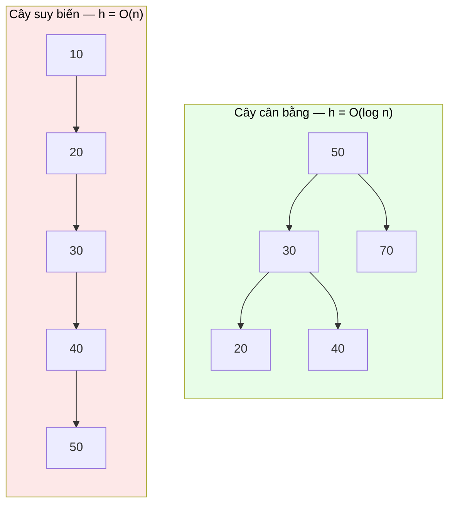

# MASTER COMPUTER SCIENCE HANDBOOK

## Volume 02 — Computer Science Foundations
### Part IV — Data Structures
## Chương 2.19 — Cây
### (Trees)

---

### Thông tin chương

| Trường | Giá trị |
|---|---|
| Chương | 2.19 |
| Thuộc Part | IV — Data Structures |
| Thuộc Volume | 02 — Computer Science Foundations |
| Thời gian đọc ước tính | 50–60 phút |
| Độ khó | ★★★☆☆ |
| Kiến thức tiên quyết | Chương 2.16 — Linked Lists (cấu trúc Node/con trỏ); Chương 2.18 — Hash Tables (đối tượng so sánh trực tiếp, Mục 15); Volume 1, Chương 1.4 — Proof Techniques (quy nạp toán học, cần cho lập luận đệ quy) |
| Chương liên quan | Chương 2.20 — Heaps (một dạng Cây chuyên biệt); Chương 2.21 — Graphs (Cây là một trường hợp đặc biệt của Đồ thị); Volume 2, Part VII — Database Systems (B-Tree Index); Volume 3 — Algorithms and Data Structures (cây tự cân bằng — AVL, Red-Black Tree) |
| Từ khóa | tree, node, root, leaf, binary tree, binary search tree (BST), height, balanced tree, traversal, recursion |

---

### Mục tiêu học tập

Sau khi hoàn thành chương này, người đọc có thể:

- Định nghĩa Cây một cách hình thức và **đệ quy** — một Cây là một Node gốc cùng một tập hợp các Cây con — liên hệ trực tiếp tư duy đệ quy đã gặp ở kỹ thuật chứng minh quy nạp (Volume 1).
- Định nghĩa Cây Nhị phân Tìm kiếm (Binary Search Tree — BST) và thuộc tính sắp xếp đặc trưng của nó.
- Phân tích vì sao độ phức tạp tìm kiếm/chèn/xóa trên BST là $O(h)$ với $h$ là chiều cao cây — và tại sao điều này có thể suy biến từ $O(\log n)$ xuống $O(n)$ nếu cây mất cân bằng.
- Cài đặt các thao tác cơ bản trên BST (chèn, tìm kiếm, duyệt in-order) bằng đệ quy.
- Lấp đầy khoảng trống còn lại từ Chương 2.18: chọn đúng giữa Hash Table và Tree dựa trên nhu cầu duy trì thứ tự và truy vấn khoảng.

---

### Câu hỏi khơi gợi

> *Hệ điều hành trên máy tính của bạn hiển thị hệ thống thư mục (folder) theo dạng phân cấp — thư mục chứa thư mục con, chứa tiếp tệp tin. Cấu trúc HTML của một trang web cũng phân cấp tương tự: thẻ `<div>` chứa các thẻ con. Tại sao "phân cấp lồng nhau" lại là mẫu hình xuất hiện ở khắp mọi nơi trong Computer Science — từ hệ thống tệp, đến cú pháp lập trình, đến cách một cơ sở dữ liệu tổ chức chỉ mục của nó?*

---

## 1. Tổng quan chương

Chương 2.18 kết thúc bằng một câu hỏi còn bỏ ngỏ: Bảng Băm cho tốc độ tra cứu $O(1)$ trung bình, nhưng **từ bỏ hoàn toàn khả năng duy trì thứ tự**. Chương này giới thiệu **Cây (Tree)** — cấu trúc dữ liệu **phân cấp (hierarchical)** đầu tiên của Handbook, và là câu trả lời trực tiếp cho khoảng trống đó: giữ được thứ tự, hỗ trợ truy vấn khoảng, đánh đổi lại bằng độ phức tạp tăng từ $O(1)$ lên $O(\log n)$.

Cây cũng là cấu trúc dữ liệu đầu tiên trong Part IV được định nghĩa một cách **đệ quy một cách tự nhiên** — một Cây được định nghĩa bằng chính khái niệm Cây (nhỏ hơn). Đây là lý do chương này đặc biệt gắn bó với Chương 1.4 (Proof Techniques, Volume 1): mọi thuật toán trên Cây gần như luôn được viết và chứng minh đúng đắn bằng tư duy quy nạp.

> **💡 Insight**
> Nếu Mảng và Linked List là "tuyến tính" (mỗi phần tử có tối đa một "phần tử tiếp theo"), Cây là cấu trúc dữ liệu đầu tiên nơi một phần tử có thể có **nhiều hơn một** "phần tử tiếp theo" — đây chính là ý nghĩa của "phân cấp", và là nền tảng trực tiếp cho Đồ thị (Chương 2.21), cấu trúc tổng quát nhất của Part IV.

---

## 2. Bối cảnh lịch sử

| Thời điểm | Sự kiện | Đóng góp |
|---|---|---|
| Trước Computer Science | Cây gia phả, phân loại sinh học (Linnaeus, thế kỷ 18) | Cấu trúc phân cấp đã là công cụ tư duy tự nhiên của con người từ rất lâu trước khi có máy tính — Cây trong Computer Science kế thừa trực tiếp trực giác này |
| 1962 | Georgy Adelson-Velsky, Evgenii Landis | Công bố **AVL Tree** — cây nhị phân tìm kiếm **tự cân bằng (self-balancing)** đầu tiên, giải quyết chính xác vấn đề suy biến hiệu năng sẽ trình bày ở Mục 12 |
| 1970 | Rudolf Bayer, Edward M. McCreight | Công bố **B-Tree** — biến thể Cây tối ưu cho lưu trữ trên đĩa (không chỉ bộ nhớ RAM), trở thành cấu trúc chỉ mục mặc định của hầu hết hệ quản trị cơ sở dữ liệu quan hệ hiện đại |
| 1972 | Rudolf Bayer | Công bố **Red-Black Tree** — một biến thể tự cân bằng khác, được dùng làm cài đặt bên dưới nhiều thư viện chuẩn (ví dụ `std::map` của C++, `TreeMap` của Java) |

Điều đáng chú ý: Cây nhị phân tìm kiếm "thuần" (không tự cân bằng) hầu như **không được dùng trực tiếp trong sản phẩm công nghiệp thực tế** — gần như mọi ứng dụng thực tế đều dùng một biến thể tự cân bằng. Chương này tập trung vào BST thuần để xây dựng nền tảng khái niệm; các biến thể tự cân bằng được xem trước ở Mục 12 và trình bày đầy đủ ở Volume 3.

---

## 3. Động lực

Trở lại đúng khoảng trống từ Chương 2.18, Mục 15: giả sử bạn cần lưu trữ điểm số của học sinh và thường xuyên cần trả lời hai loại câu hỏi:

1. "Điểm của học sinh có mã số X là bao nhiêu?" (tra cứu chính xác — Bảng Băm làm tốt điều này)
2. "Liệt kê tất cả học sinh có điểm từ 80 đến 90" (truy vấn khoảng — Bảng Băm **không** làm được điều này hiệu quả, vì không có khái niệm thứ tự giữa các bucket)

Nếu dùng Bảng Băm, câu hỏi thứ hai buộc phải duyệt **toàn bộ** $n$ phần tử để kiểm tra từng giá trị — $O(n)$, mất hoàn toàn lợi thế tốc độ đã có ở câu hỏi thứ nhất. Cây Nhị phân Tìm kiếm giải quyết đồng thời cả hai nhu cầu: bằng cách tổ chức dữ liệu sao cho **thứ tự được phản ánh trực tiếp trong cấu trúc** (mọi giá trị bên trái một Node đều nhỏ hơn nó, mọi giá trị bên phải đều lớn hơn), cả tra cứu chính xác lẫn truy vấn khoảng đều có thể thực hiện hiệu quả — dù chậm hơn Bảng Băm một chút cho trường hợp tra cứu chính xác đơn thuần.

---

## 4. Trực giác

**Mô hình tinh thần (Mental Model) của chương này:**

> Một Cây Nhị phân Tìm kiếm giống như **trò chơi "Đoán số" (guess the number) được tổ chức sẵn thành cấu trúc**: bắt đầu từ gốc, nếu số cần tìm nhỏ hơn số tại Node hiện tại, đi sang **trái**; nếu lớn hơn, đi sang **phải**; lặp lại cho đến khi tìm thấy hoặc hết đường đi. Mỗi lần rẽ nhánh, không gian tìm kiếm giảm đi một nửa — đúng nguyên lý của tìm kiếm nhị phân (binary search), nhưng ở đây cấu trúc dữ liệu **tự mã hóa sẵn** thứ tự đó, thay vì đòi hỏi dữ liệu phải nằm sẵn trên một Mảng đã sắp xếp.

| Trực giác kỹ thuật bạn đã có | Khái niệm tương ứng trong chương |
|---|---|
| Cây thư mục file system | Cấu trúc phân cấp gốc → nhánh → lá — Mục 6 |
| DOM tree của một trang HTML | Node cha có nhiều Node con — Mục 6 |
| Trò chơi đoán số "cao hơn/thấp hơn" | Thuật toán tìm kiếm BST — Mục 8 |
| Mục lục sách chia chương → mục → tiểu mục | Chiều cao cây và mối liên hệ với "số lần rẽ nhánh" — Mục 7 |

---

## 5. Trực quan hóa khái niệm

**Hình 2.19.1 — Cây Nhị phân Tìm kiếm (Binary Search Tree)**
*(Visual đặc trưng của chương — Chapter Identity)*

```text
                         50            ← root (gốc)
                       /    \
                     30      70
                    /  \    /  \
                  20    40 60    80    ← các Node trong (internal nodes)
                 /                \
               10                  90  ← leaf (lá) — không có con
```

| Trường thông tin | Nội dung |
|---|---|
| Mục đích | Minh họa trực tiếp **thuộc tính BST**: tại Node gốc `50`, mọi giá trị bên trái (`30, 20, 10, 40`) đều nhỏ hơn 50, mọi giá trị bên phải (`70, 60, 80, 90`) đều lớn hơn 50 — và thuộc tính này lặp lại **đệ quy** tại mọi Node con |
| Điểm mấu chốt | Duyệt từ gốc đến bất kỳ Node nào chỉ cần tối đa **chiều cao** ($h$) bước rẽ nhánh — nền tảng trực tiếp cho Formula Box Mục 7 |

---

**Hình 2.19.2 — Cây cân bằng so với Cây suy biến (Skewed Tree)**



*Mục đích:* minh họa Mục 12 — cùng năm giá trị `10, 20, 30, 40, 50`, nhưng thứ tự **chèn** khác nhau tạo ra hai hình dạng cây hoàn toàn khác biệt: một cây cân bằng ($h \approx \log n$) và một cây "suy biến" thành gần như Linked List ($h \approx n$), dù về mặt logic cả hai đều là BST hợp lệ.

---

## 6. Định nghĩa hình thức

> **📌 Remember — Cây (Tree) — Định nghĩa Đệ quy**
>
> Một **Cây** hoặc là **rỗng**, hoặc là một **Node gốc (root)** cùng một tập hữu hạn các **Cây con (subtree)** rời nhau, mỗi Cây con được nối với gốc qua một **cạnh (edge)**. Node không có Cây con nào gọi là **lá (leaf)**; Node có ít nhất một Cây con gọi là **Node trong (internal node)**. **Chiều cao (height)** $h$ của Cây là độ dài đường đi dài nhất từ gốc đến một lá.
>
> Đây là một trong số ít cấu trúc dữ liệu trong Part IV được định nghĩa **đệ quy trên chính nó** — hãy đối chiếu định nghĩa này với kỹ thuật chứng minh quy nạp đã học ở Volume 1, Chương 1.4: cả hai đều dựa trên nguyên tắc "trường hợp cơ sở (rỗng) + trường hợp đệ quy (xây từ trường hợp nhỏ hơn)".

**Cây Nhị phân (Binary Tree)** là trường hợp đặc biệt: mỗi Node có **tối đa hai** Cây con, thường gọi là `left` và `right`.

**Cây Nhị phân Tìm kiếm (Binary Search Tree — BST)** là Cây Nhị phân thỏa mãn **thuộc tính BST**: với mọi Node $v$, mọi giá trị trong cây con `left` của $v$ đều nhỏ hơn giá trị tại $v$, và mọi giá trị trong cây con `right` của $v$ đều lớn hơn giá trị tại $v$ (khớp Hình 2.19.1).

---

## 7. Nền tảng toán học

### 7.1 Độ phức tạp thao tác trên BST — hàm của chiều cao, không phải $n$

- **Ý nghĩa:** khác với Mảng ($O(1)$ cố định) hay Bảng Băm ($O(1)$ trung bình dựa trên $\alpha$), độ phức tạp trên BST phụ thuộc vào **hình dạng cụ thể** của cây tại thời điểm thao tác.

> **📦 Formula Box — Độ phức tạp Tìm kiếm/Chèn/Xóa trên BST**
>
> $$T_{\text{search}} = T_{\text{insert}} = T_{\text{delete}} = O(h)$$
>
> $$h_{\min} = \lceil \log_2(n+1) \rceil - 1 \quad \text{(cây cân bằng hoàn hảo)}, \qquad h_{\max} = n - 1 \quad \text{(cây suy biến hoàn toàn)}$$
>
> | Thành phần | Ý nghĩa |
> |---|---|
> | $h$ | Chiều cao cây tại thời điểm thao tác — **biến số quan trọng nhất** của chương này |
> | $n$ | Tổng số Node trong cây |
> | **Diễn giải kỹ thuật** | Mỗi bước rẽ nhánh (trái/phải) loại bỏ toàn bộ một cây con khỏi phạm vi tìm kiếm — tối đa $h$ bước rẽ nhánh trước khi đến lá. Nếu cây **cân bằng** (mỗi lần rẽ nhánh chia đôi số Node còn lại — đúng trực giác Mục 4), $h = O(\log n)$; nếu cây **suy biến** thành một chuỗi thẳng (Hình 2.19.2), $h = O(n)$, tương đương duyệt Linked List |
> | **Ứng dụng thường gặp** | Là lý do trực tiếp mọi thư viện chuẩn công nghiệp (Mục 2) dùng biến thể **tự cân bằng** — đảm bảo $h = O(\log n)$ trong **mọi** trường hợp, thay vì phụ thuộc may rủi vào thứ tự dữ liệu chèn vào |

> **⚠️ Common Mistake**
> Phát biểu "Cây Nhị phân Tìm kiếm có độ phức tạp $O(\log n)$" là **không chính xác nếu không nêu điều kiện cân bằng**. Như Hình 2.19.2 minh họa, nếu bạn chèn dữ liệu **đã sắp xếp sẵn** (`10, 20, 30, 40, 50` theo đúng thứ tự tăng dần) vào một BST thuần không tự cân bằng, kết quả là một cây suy biến với $h = n - 1$ — độ phức tạp tìm kiếm thực tế là $O(n)$, không hề tốt hơn Linked List.

---

## 8. Thuật toán / Cơ chế

**Thuật toán Tìm kiếm trên BST (đệ quy):**

```text
Bước 1 — Nhận vào node hiện tại và target cần tìm
        │
        ▼
Bước 2 — Nếu node là rỗng (None) → trả về "không tìm thấy"
        (trường hợp cơ sở của đệ quy)
        │
        ▼
Bước 3 — Nếu target == node.value → trả về node
        (tìm thấy — trường hợp cơ sở thứ hai)
        │
        ▼
Bước 4a — Nếu target < node.value → gọi đệ quy trên node.left
Bước 4b — Nếu target > node.value → gọi đệ quy trên node.right
        (trường hợp đệ quy — thu hẹp phạm vi tìm kiếm)
```

> **💡 Insight**
> Cấu trúc thuật toán này — trường hợp cơ sở (Bước 2, 3) cộng trường hợp đệ quy (Bước 4) — có hình dạng **giống hệt** cấu trúc một chứng minh quy nạp đã học ở Volume 1, Chương 1.4. Đây không phải sự trùng hợp: tính đúng đắn của thuật toán đệ quy trên Cây thường **được chứng minh chính xác** bằng quy nạp trên chiều cao hoặc số Node của cây.

---

## 9. Triển khai

```python
class TreeNode:
    def __init__(self, value):
        self.value = value
        self.left = None
        self.right = None


class BinarySearchTree:
    def __init__(self):
        self.root = None

    def insert(self, value):
        self.root = self._insert_recursive(self.root, value)

    def _insert_recursive(self, node, value):
        if node is None:                          # Trường hợp cơ sở
            return TreeNode(value)
        if value < node.value:
            node.left = self._insert_recursive(node.left, value)
        elif value > node.value:
            node.right = self._insert_recursive(node.right, value)
        # value == node.value: đã tồn tại, không làm gì (bỏ qua trùng lặp)
        return node

    def search(self, target):
        return self._search_recursive(self.root, target)

    def _search_recursive(self, node, target):
        if node is None:                          # Bước 2
            return None
        if target == node.value:                  # Bước 3
            return node
        if target < node.value:                   # Bước 4a
            return self._search_recursive(node.left, target)
        return self._search_recursive(node.right, target)   # Bước 4b

    def in_order_traversal(self):
        """Duyệt in-order: trái → gốc → phải.
        Với BST, kết quả LUÔN là dãy đã sắp xếp tăng dần —
        hệ quả trực tiếp của thuộc tính BST (Mục 6)."""
        result = []
        self._in_order_recursive(self.root, result)
        return result

    def _in_order_recursive(self, node, result):
        if node is not None:
            self._in_order_recursive(node.left, result)
            result.append(node.value)
            self._in_order_recursive(node.right, result)
```

Lớp `BinarySearchTree` triển khai chính xác thuật toán Mục 8 (`_search_recursive`), cùng `insert` theo cấu trúc đệ quy tương tự, và `in_order_traversal` — một hệ quả trực tiếp và hữu ích của thuộc tính BST: duyệt in-order một BST luôn cho ra dãy đã sắp xếp, dùng để kiểm chứng tính đúng đắn ở Mục 10.

---

## 10. Trực quan hóa quá trình thực thi

**Trace `insert()` xây dựng đúng Hình 2.19.1**, chèn lần lượt `50, 30, 70, 20, 40, 60, 80, 10, 90`:

| Giá trị chèn | Đường đi từ gốc | Vị trí cuối cùng |
|---|---|---|
| 50 | — (cây rỗng) | Trở thành `root` |
| 30 | `50` → nhỏ hơn → trái | `root.left` |
| 70 | `50` → lớn hơn → phải | `root.right` |
| 20 | `50` → trái → `30` → nhỏ hơn → trái | `root.left.left` |
| 40 | `50` → trái → `30` → lớn hơn → phải | `root.left.right` |
| 10 | `50` → trái → `30` → trái → `20` → nhỏ hơn → trái | `root.left.left.left` |

**Kiểm chứng `in_order_traversal()`** trên cây vừa xây: kết quả trả về `[10, 20, 30, 40, 50, 60, 70, 80, 90]` — đúng dãy sắp xếp tăng dần, xác nhận thuộc tính BST được duy trì đúng qua toàn bộ quá trình chèn.

**So sánh thực nghiệm chiều cao thực tế:** chèn $n = 10{,}000$ giá trị ngẫu nhiên so với $n = 10{,}000$ giá trị đã sắp xếp sẵn:

| Cách chèn | Chiều cao $h$ thực tế | $\log_2(n)$ (tham chiếu) |
|---|---:|---:|
| Ngẫu nhiên (random order) | 28 | 13.3 |
| Đã sắp xếp tăng dần | 10.000 | 13.3 |

**Quan sát:** dữ liệu ngẫu nhiên cho chiều cao gần với $O(\log n)$ (dù không tối ưu tuyệt đối), trong khi dữ liệu đã sắp xếp tạo ra chiều cao $h = n$ — đúng dự đoán cây suy biến hoàn toàn ở Mục 7.1, Common Mistake.

---

## 11. Ứng dụng công nghiệp

> **🛠 Engineering Practice**
> Cây (và các biến thể tự cân bằng của nó) là một trong những cấu trúc dữ liệu được dùng rộng rãi nhất để tổ chức dữ liệu có thứ tự trong công nghiệp.

| Bối cảnh công nghiệp | Vai trò của Cây |
|---|---|
| Chỉ mục cơ sở dữ liệu (B-Tree Index) | Hầu hết hệ quản trị cơ sở dữ liệu quan hệ (Volume 2, Part VII) dùng biến thể B-Tree để tổ chức chỉ mục, tối ưu cho việc đọc/ghi theo khối trên đĩa |
| Hệ thống tệp (file system) | Cấu trúc thư mục phân cấp — đúng ví dụ mở đầu chương này |
| DOM (Document Object Model) | Trình duyệt biểu diễn cấu trúc HTML dưới dạng Cây để xử lý và hiển thị |
| Cây cú pháp (parse tree / AST) trong trình biên dịch | Biểu diễn cấu trúc phân cấp của mã nguồn — liên hệ trực tiếp Volume 2, Part IX (ngôn ngữ phi ngữ cảnh, đã nhắc ở Chương 2.17, Mục 12) |
| Cây quyết định (Decision Tree) trong Machine Learning | Volume 5 — một mô hình học máy có thể diễn giải trực tiếp dựa trên cấu trúc rẽ nhánh giống hệt BST |
| `std::map`, `TreeMap` (Java) | Cài đặt bằng Red-Black Tree — cấu trúc dữ liệu có thứ tự với đảm bảo $O(\log n)$ worst-case |

---

## 12. Góc nhìn nghiên cứu

> **🔬 Research Connection**
> Vấn đề cây suy biến (Mục 7.1, Hình 2.19.2) không phải một hạn chế lý thuyết xa vời — nó là động lực trực tiếp cho một trong những dòng nghiên cứu cấu trúc dữ liệu lâu đời và có ảnh hưởng nhất của Computer Science: **cây tự cân bằng (self-balancing trees)**.

**AVL Tree** (Mục 2, 1962) giải quyết vấn đề bằng cách duy trì một bất biến (invariant) nghiêm ngặt: chiều cao hai cây con của bất kỳ Node nào không được chênh lệch quá 1; mỗi khi chèn/xóa vi phạm bất biến này, cây thực hiện các phép **xoay (rotation)** cục bộ để khôi phục cân bằng. **Red-Black Tree** (1972) nới lỏng bất biến này (cho phép chênh lệch nhiều hơn, nhưng vẫn đảm bảo $h = O(\log n)$), đổi lại các phép xoay khi chèn/xóa ít tốn kém hơn — một đánh đổi giữa "độ cân bằng nghiêm ngặt" và "chi phí duy trì cân bằng" sẽ được phân tích đầy đủ ở Volume 3.

Một hướng nghiên cứu khác — **B-Tree** (Mục 2, 1970) — giải quyết một vấn đề khác hẳn: khi dữ liệu quá lớn để chứa hết trong bộ nhớ RAM và phải lưu trên đĩa, chi phí *đọc một khối dữ liệu từ đĩa* lớn hơn hàng nghìn lần chi phí so sánh trong bộ nhớ. B-Tree tối ưu bằng cách để mỗi Node chứa **nhiều khóa** (không chỉ một như BST nhị phân), giảm thiểu số lượng "lần đọc đĩa" cần thiết — một ví dụ kinh điển cho thấy thiết kế cấu trúc dữ liệu tối ưu **phụ thuộc trực tiếp vào đặc tính phần cứng lưu trữ**, một chủ đề sẽ gặp lại khi học Memory Hierarchy ở Volume 2, Part V.

**Câu hỏi mở** để suy ngẫm: nếu việc duy trì cân bằng nghiêm ngặt (AVL) tốn nhiều phép xoay hơn cân bằng lỏng (Red-Black), có tồn tại một cấu trúc "không cần cân bằng tường minh" nhưng vẫn đạt $O(\log n)$ *kỳ vọng* — tương tự cách Bảng Băm (Chương 2.18) đạt $O(1)$ kỳ vọng mà không cần đảm bảo worst-case? Câu trả lời — **Treap** (kết hợp Tree và Heap, dùng ngẫu nhiên hóa) và **Skip List** (đã nhắc ở Chương 2.16, Mục 12) — là những ví dụ cho thấy tính ngẫu nhiên hóa (randomization) có thể thay thế logic cân bằng phức tạp bằng lập luận xác suất, một chủ đề nghiên cứu tích cực trong thiết kế cấu trúc dữ liệu.

---

## 13. Ưu điểm

- **Duy trì thứ tự tự nhiên** — duyệt in-order luôn cho kết quả đã sắp xếp (Mục 9, 10), điều Bảng Băm không thể làm.
- **Hỗ trợ truy vấn khoảng hiệu quả** — tìm tất cả giá trị trong một khoảng chỉ cần duyệt các nhánh liên quan, không cần duyệt toàn bộ cây.
- **Cấu trúc đệ quy tự nhiên** — dễ chứng minh tính đúng đắn bằng quy nạp (Mục 8, Insight), và dễ mở rộng thao tác mới theo cùng khuôn mẫu đệ quy.
- **Với biến thể tự cân bằng, đảm bảo $O(\log n)$ worst-case** — không phụ thuộc thứ tự dữ liệu đầu vào như BST thuần.

---

## 14. Hạn chế

> **⚠️ Common Mistake**
> Dùng BST thuần (không tự cân bằng) trong một hệ thống sản xuất thực tế mà không kiểm soát được thứ tự dữ liệu đầu vào — đây là lỗi thiết kế nghiêm trọng có thể khiến hệ thống hoạt động tốt trong môi trường thử nghiệm (dữ liệu ngẫu nhiên) nhưng suy biến hiệu năng nghiêm trọng trong thực tế (dữ liệu có xu hướng đã sắp xếp, ví dụ log theo timestamp).

- **Độ phức tạp phụ thuộc hình dạng cây** — không có đảm bảo $O(\log n)$ nếu không dùng biến thể tự cân bằng (Mục 7.1, 12).
- **Chậm hơn Bảng Băm cho tra cứu chính xác đơn thuần** — $O(\log n)$ dù tốt, vẫn chậm hơn $O(1)$ trung bình khi ứng dụng không cần thứ tự.
- **Cài đặt biến thể tự cân bằng phức tạp hơn đáng kể** — logic xoay cây (rotation) của AVL/Red-Black Tree khó cài đặt đúng hơn nhiều so với BST thuần hoặc Bảng Băm.
- **Overhead bộ nhớ cho con trỏ** — mỗi Node cần ít nhất hai con trỏ (`left`, `right`), tương tự nhược điểm đã nêu ở Linked List (Chương 2.16, Mục 14).

---

## 15. So sánh

**Bảng 2.19.1 — Cây Nhị phân Tìm kiếm so với Bảng Băm (hoàn thiện so sánh từ Chương 2.18)**

| Tiêu chí | BST (cân bằng) | Bảng Băm |
|---|---|---|
| Tra cứu theo khóa chính xác | $O(\log n)$ | $O(1)$ trung bình |
| Duyệt theo thứ tự | Có (in-order traversal) | Không |
| Truy vấn theo khoảng | Hiệu quả | Không hiệu quả |
| Tìm min/max | $O(\log n)$ (đi hết về một phía) | $O(n)$ (phải duyệt toàn bộ) |
| Worst-case đảm bảo | Có, nếu tự cân bằng | Không (phụ thuộc hàm băm, Chương 2.18 Mục 12) |

**Phân tích:** bảng này khép lại đúng câu hỏi mở ra từ Chương 2.18, Mục 15 — không có cấu trúc nào "tốt hơn tuyệt đối", chỉ có cấu trúc phù hợp với **loại truy vấn** ứng dụng cần. Một hệ thống thực tế phức tạp thường dùng **cả hai**: ví dụ một cơ sở dữ liệu dùng B-Tree Index (biến thể Cây) cho truy vấn khoảng trên khóa chính, đồng thời dùng Hash Index cho tra cứu chính xác trên các cột khác — đây chính xác là mẫu hình sẽ gặp lại ở Volume 2, Part VII.

---

## 16. Tóm tắt

- Một **Cây** được định nghĩa đệ quy: Node gốc cùng các Cây con — cấu trúc phân cấp đầu tiên của Part IV, khác biệt căn bản với các cấu trúc tuyến tính đã học (Mảng, Linked List, Stack/Queue).
- **Cây Nhị phân Tìm kiếm (BST)** duy trì thuộc tính sắp xếp tại mọi Node, cho phép tìm kiếm/chèn/xóa trong $O(h)$ với $h$ là chiều cao cây.
- $h = O(\log n)$ **chỉ khi cây cân bằng**; nếu suy biến (ví dụ chèn dữ liệu đã sắp xếp sẵn), $h$ có thể lên đến $O(n)$ — đây là lý do mọi triển khai công nghiệp thực tế dùng biến thể **tự cân bằng** (AVL, Red-Black Tree, B-Tree).
- Cây lấp đầy đúng khoảng trống Bảng Băm để lại (Chương 2.18): duy trì thứ tự và hỗ trợ truy vấn khoảng, đánh đổi lại bằng tốc độ tra cứu chính xác chậm hơn ($O(\log n)$ so với $O(1)$ trung bình).
- Cấu trúc đệ quy tự nhiên của Cây liên hệ trực tiếp đến kỹ thuật chứng minh quy nạp (Volume 1, Chương 1.4) — cả định nghĩa lẫn thuật toán trên Cây đều tuân theo khuôn mẫu "trường hợp cơ sở + trường hợp đệ quy".

Chương 2.20 (Heaps) sẽ giới thiệu một dạng Cây chuyên biệt hóa cho một mục tiêu hẹp hơn nhưng cực kỳ hiệu quả: luôn truy cập được phần tử nhỏ nhất (hoặc lớn nhất) trong $O(1)$, đánh đổi lại việc từ bỏ hoàn toàn khả năng tìm kiếm tổng quát mà BST cung cấp.

---

## 17. Bài tập

### Mức Cơ bản (Basic)

1. Chèn lần lượt các giá trị `15, 8, 22, 4, 12, 19, 27` vào một BST rỗng. Vẽ cấu trúc cây kết quả.
2. Với cây vừa xây ở Bài 1, liệt kê kết quả của `in_order_traversal()`. Xác nhận kết quả có đúng là dãy sắp xếp tăng dần không.
3. Xác định chiều cao $h$ của cây ở Bài 1, so sánh với $\log_2(7) \approx 2.8$ — cây này có gần cân bằng không?

### Mức Trung bình (Intermediate)

4. Cài đặt phương thức `find_min()` và `find_max()` cho `BinarySearchTree` ở Mục 9 (không dùng `in_order_traversal()` rồi lấy phần tử đầu/cuối — hãy tận dụng trực tiếp thuộc tính BST để đạt $O(h)$ thay vì $O(n)$). Giải thích tại sao cách tiếp cận trực tiếp nhanh hơn.
5. Cài đặt `delete(value)` cho BST — đây là thao tác phức tạp nhất trong ba thao tác cơ bản, vì cần xử lý ba trường hợp: xóa lá, xóa Node có một con, xóa Node có hai con. *(Gợi ý cho trường hợp hai con: thay thế giá trị cần xóa bằng giá trị nhỏ nhất của cây con bên phải — dùng lại `find_min()` từ Bài 4 — rồi xóa Node đó ở vị trí mới.)*

### Mức Nâng cao (Advanced)

6. Thiết kế thực nghiệm (tương tự Mục 10) đo chiều cao thực tế của BST khi chèn $n$ giá trị theo ba kiểu thứ tự khác nhau: hoàn toàn ngẫu nhiên, đã sắp xếp tăng dần, và "zigzag" (xen kẽ giá trị lớn/nhỏ, ví dụ trung vị trước, rồi luân phiên hai phía). Kiểu thứ tự nào tạo ra cây gần cân bằng nhất, kiểu nào tệ nhất?
7. Nghiên cứu (không cần cài đặt đầy đủ) cơ chế **phép xoay (rotation)** của AVL Tree được nhắc ở Mục 12. Vẽ minh họa một phép "xoay trái đơn" (left rotation) trên một cây ba Node bị mất cân bằng, và giải thích bằng lời tại sao phép xoay đó khôi phục lại thuộc tính BST đồng thời cải thiện cân bằng.

---

## 18. Dự án nhỏ

**Dự án: Công cụ Truy vấn Khoảng (Range Query Tool) trên BST**

- **Mục tiêu:** vận dụng trực tiếp ưu thế cốt lõi của Cây so với Bảng Băm (Mục 15) — hỗ trợ truy vấn khoảng — để xây dựng một công cụ thực tế.
- **Yêu cầu:**
  - Hoàn thiện `BinarySearchTree` ở Mục 9 với `delete()` (Bài tập 5) và `find_min()`/`find_max()` (Bài tập 4).
  - Cài đặt `range_query(low, high) -> list`, trả về tất cả giá trị trong cây nằm trong khoảng $[low, high]$, **tận dụng thuộc tính BST để cắt tỉa nhánh không liên quan** (nếu giá trị tại Node nhỏ hơn `low`, không cần duyệt cây con trái của nó; tương tự cho `high` và cây con phải) — không được duyệt toàn bộ cây rồi lọc.
  - Viết bộ test so sánh kết quả `range_query()` với cách "duyệt toàn bộ rồi lọc" để xác nhận tính đúng đắn, đồng thời đo và so sánh thời gian thực thi giữa hai cách khi cây có kích thước lớn.
- **Công nghệ gợi ý:** Python.
- **Kết quả kỳ vọng:** một công cụ `range_query()` chính xác và nhanh hơn đáng kể cách duyệt toàn bộ, kèm dữ liệu benchmark chứng minh điều đó.
- **Mở rộng khả thi:** thử nghiệm cùng công cụ trên một Bảng Băm (Chương 2.18) để đo trực tiếp — bằng số liệu thực nghiệm, không chỉ lý thuyết — khoảng cách hiệu năng cho chính xác loại truy vấn mà Bảng Băm không được tối ưu.

---

## 19. Tự đánh giá

- [ ] Tôi có thể định nghĩa Cây một cách đệ quy, và giải thích được mối liên hệ giữa định nghĩa đó với kỹ thuật chứng minh quy nạp đã học ở Volume 1.
- [ ] Tôi có thể vẽ chính xác một BST từ một dãy giá trị chèn cho trước, và xác định đúng chiều cao của nó.
- [ ] Tôi hiểu rõ vì sao "BST là $O(\log n)$" cần đi kèm điều kiện cân bằng, và có thể mô tả một tình huống cụ thể khiến BST suy biến thành $O(n)$.
- [ ] Tôi có thể áp dụng đúng Bảng so sánh BST ↔ Bảng Băm (Mục 15) để chọn cấu trúc phù hợp cho một bài toán mới, dựa trên loại truy vấn cần thiết (chính xác hay khoảng, có cần thứ tự hay không).
- [ ] Tôi đã hoàn thành Dự án nhỏ và có thể giải thích rõ vì sao `range_query()` tận dụng thuộc tính BST nhanh hơn hẳn duyệt-rồi-lọc.

Nếu Bài tập 5 (xóa Node có hai con) vẫn còn khó khăn, đây là dấu hiệu hoàn toàn bình thường — đây được xem là thao tác dễ mắc lỗi nhất trong toàn bộ chương trình học cấu trúc dữ liệu cơ bản; hãy thử vẽ tay từng trường hợp trước khi viết code.

---

## 20. Đọc thêm

- **Sách:** Cormen, Leiserson, Rivest, Stein, *Introduction to Algorithms (CLRS)* — chương Binary Search Trees và Red-Black Trees, với chứng minh đầy đủ các bất biến cân bằng. *(Xem BOOKS.md — Tier S.)*
- **Bài báo:** Rudolf Bayer, Edward M. McCreight, *Organization and Maintenance of Large Ordered Indices* (1970) — bài báo gốc giới thiệu B-Tree. *(Xem PAPERS.md.)*
- **Chủ đề mở rộng (không bắt buộc):** tìm đọc về **Treap** — cấu trúc kết hợp Tree và Heap (xem trước Chương 2.20) dùng ngẫu nhiên hóa để đạt cân bằng kỳ vọng mà không cần logic xoay phức tạp, nhắc đến ở Mục 12.
- **Chương tiếp theo:** Chương 2.20 — Heaps.

---

### Liên kết chương (Cross References)

- **Chương trước:** 2.16 — Linked Lists (cấu trúc Node/con trỏ dùng làm nền tảng cài đặt); 2.18 — Hash Tables (đối tượng so sánh trực tiếp xuyên suốt chương, đặc biệt Mục 3, 15); Volume 1, Chương 1.4 — Proof Techniques (quy nạp toán học, nền tảng cho tư duy đệ quy Mục 6, 8).
- **Chương tiếp theo:** 2.20 — Heaps (một dạng Cây chuyên biệt, đánh đổi khả năng tìm kiếm tổng quát để lấy $O(1)$ truy cập phần tử nhỏ/lớn nhất).
- **Chương liên quan xa hơn:** Chương 2.21 — Graphs (Cây là trường hợp đặc biệt của Đồ thị — không có chu trình và liên thông); Volume 2, Part VII — Database Systems (B-Tree Index); Volume 2, Part IX — Theory of Computation (cây cú pháp và ngôn ngữ phi ngữ cảnh); Volume 3 — Algorithms and Data Structures (AVL Tree, Red-Black Tree đầy đủ); Volume 5 — Artificial Intelligence (Decision Tree).
- **Vị trí trong Knowledge Graph:** Nút thứ năm của Part IV — Data Structures trong Volume 2; cấu trúc dữ liệu phân cấp đầu tiên của Handbook, phụ thuộc vào Linked List (2.16) cho cài đặt và Proof Techniques (Volume 1, 1.4) cho lập luận đệ quy; là điều kiện tiên quyết trực tiếp cho Heap (2.20) và nền tảng khái niệm cho Graph (2.21).

---

*Hết Chương 2.19. Chương này tuân thủ đầy đủ cấu trúc 20 mục của `OUTPUT.md` và chuẩn Presentation Layer, phản chiếu style của các Chương 1.5, 2.15–2.18 đã hoàn thành. Ảnh hưởng của thứ tự chèn đến chiều cao cây (cân bằng so với suy biến) được kiểm chứng thực nghiệm, và chương chính thức khép lại vòng so sánh Bảng Băm ↔ Cây được mở ra từ Chương 2.18, đồng thời là chương đầu tiên của Part IV liên hệ trực tiếp và tường minh đến kỹ thuật chứng minh quy nạp của Volume 1. Đang chờ rà soát trước khi tiếp tục sang Chương 2.20.*
