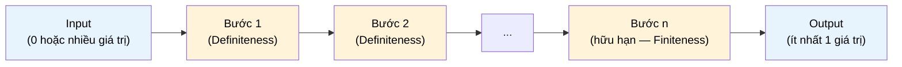

# MASTER COMPUTER SCIENCE HANDBOOK

## Volume 03 — Algorithms and Data Structures
### Part I — Algorithmic Thinking
## Chương 3.1 — Algorithm là gì?
### (What is an Algorithm?)

---

### Thông tin chương

| Trường | Giá trị |
|---|---|
| Chương | 3.1 |
| Thuộc Part | I — Algorithmic Thinking |
| Thuộc Volume | 03 — Algorithms and Data Structures |
| Thời gian đọc ước tính | 45–55 phút |
| Độ khó | ★☆☆☆☆ |
| Kiến thức tiên quyết | Volume 01, Part I — Mathematical Thinking (đặc biệt Chương 1.4 — Proof Techniques); Volume 02, Part IV — Data Structures (khái niệm sơ bộ) |
| Chương liên quan | 3.2 — Problem Modeling and Correctness (sẽ hình thức hóa lại "tính đúng đắn" bằng loop invariant); 3.3 — Asymptotic Analysis (sẽ đo "hiệu quả" đề cập ở chương này bằng ký hiệu Big-O) |
| Từ khóa | algorithm, pseudocode, correctness, termination, determinism, Turing Machine, Church-Turing Thesis |

---

### Mục tiêu học tập

Sau khi hoàn thành chương này, người đọc có thể:

- Định nghĩa hình thức khái niệm **Algorithm**, phân biệt được thuật toán với chương trình (program) và với heuristic.
- Liệt kê và giải thích năm tính chất bắt buộc của một thuật toán: Finiteness, Definiteness, Input, Output, Effectiveness.
- Đọc và viết pseudocode theo quy ước chuẩn được dùng xuyên suốt Volume 3.
- Giải thích trực giác về **Church–Turing Thesis** và ý nghĩa của nó đối với việc "thứ gì có thể tính toán được".
- Phân biệt ba câu hỏi độc lập cần đặt ra cho mọi thuật toán: nó có đúng không (correctness), nó có dừng không (termination), và nó có hiệu quả không (efficiency) — ba câu hỏi này sẽ dẫn dắt toàn bộ Volume 3.

---

### Câu hỏi khơi gợi

> *Google Maps có hàng tỷ con đường để lựa chọn, vậy tại sao nó luôn trả lời trong chưa đầy một giây? Và một câu hỏi triết học hơn: nếu một chiếc máy tính có bộ nhớ vô hạn và thời gian vô hạn, liệu nó có thể giải được MỌI bài toán hay không? Câu trả lời — không — chính là điểm khởi đầu của toàn bộ Computer Science lý thuyết, và chương này sẽ cho bạn công cụ đầu tiên để hiểu tại sao.*

---

## 1. Tổng quan chương

Volume 01 và Volume 02 đã trang bị cho bạn ngôn ngữ toán học (logic, tập hợp, hàm số) và nền tảng khái niệm của Computer Science (tính toán, độ phức tạp sơ bộ, cấu trúc dữ liệu cơ bản). Volume 03 chuyển trọng tâm sang **cách tư duy để giải quyết vấn đề một cách có hệ thống** — đây chính là ý nghĩa của cụm từ "Algorithmic Thinking" đặt tên cho Part I.

Chương này trả lời câu hỏi tưởng chừng hiển nhiên nhưng thường bị bỏ qua: **một Algorithm, một cách chính xác, là gì?** Nhiều kỹ sư phần mềm dùng từ "thuật toán" hằng ngày — "thuật toán sắp xếp", "thuật toán gợi ý" — nhưng chưa từng dừng lại để định nghĩa nó một cách hình thức. Sự thiếu chính xác này không gây hậu quả khi viết code ứng dụng, nhưng sẽ cản trở nghiêm trọng khi bạn cần **chứng minh** một thuật toán đúng, hoặc khi đọc các bài báo nghiên cứu dùng thuật ngữ với độ chính xác toán học.

Chương này cũng thiết lập ba câu hỏi nền tảng — **Correctness, Termination, Efficiency** — mà mọi chương còn lại của Volume 3 sẽ liên tục quay lại trả lời cho từng thuật toán cụ thể.

> **💡 Insight**
> Nếu Volume 01 dạy bạn "ngôn ngữ" của toán học, và Volume 02 dạy bạn "vật liệu" của Computer Science (bit, cấu trúc dữ liệu, mô hình tính toán), thì Volume 03 dạy bạn **quy trình tư duy** để biến một vấn đề thực tế thành một giải pháp có thể chứng minh là đúng và có thể đo lường được hiệu quả.

---

## 2. Bối cảnh lịch sử

| Thời điểm | Nhân vật / Sự kiện | Đóng góp |
|---|---|---|
| ~300 TCN | Euclid | **Euclidean Algorithm** — tìm ước số chung lớn nhất (GCD); được xem là thuật toán không tầm thường đầu tiên được ghi chép lại trong lịch sử |
| ~825 | Al-Khwarizmi | Tác phẩm *Kitāb al-Jabr* mô tả các quy trình giải phương trình từng bước; từ "algorithm" bắt nguồn từ tên Latin hóa của ông (Algorithmi) |
| 1928 | David Hilbert | Đặt ra **Entscheidungsproblem** ("bài toán quyết định") — hỏi liệu có tồn tại một quy trình cơ giới (mechanical procedure) giải quyết được mọi phát biểu toán học hay không |
| 1936 | Alonzo Church | Đề xuất **Lambda Calculus**, một mô hình hình thức hóa độc lập cho khái niệm "hàm tính toán được" |
| 1936 | Alan Turing | Công bố *On Computable Numbers* (đã gặp ở Volume 1, Chương 1.5, Mục 12) — đề xuất **Turing Machine**, chứng minh Entscheidungsproblem không có lời giải tổng quát |

Điều đáng chú ý là Church và Turing đưa ra hai mô hình tính toán có vẻ ngoài hoàn toàn khác nhau (Lambda Calculus dựa trên hàm số; Turing Machine dựa trên một máy đọc/ghi băng giấy) nhưng lại được chứng minh là **tương đương nhau về mặt sức mạnh tính toán**. Sự trùng khớp này không phải ngẫu nhiên — nó dẫn đến một trong những giả thuyết nền tảng nhất của Computer Science.

> **🔬 Research Connection**
> **Church–Turing Thesis** phát biểu rằng: bất kỳ hàm nào "có thể tính toán được" theo trực giác thông thường của con người, đều có thể tính toán được bởi một Turing Machine. Đây là một **giả thuyết**, không phải một định lý — nó không thể chứng minh hình thức vì "trực giác thông thường" không phải một khái niệm toán học chặt chẽ. Nhưng qua gần một thế kỷ, mọi mô hình tính toán khác được đề xuất (Lambda Calculus, máy Register, ngôn ngữ lập trình hiện đại) đều được chứng minh tương đương Turing Machine về sức mạnh biểu đạt. Chương 3.1 này định nghĩa "algorithm" một cách trực giác và thực dụng; Volume 2, Part IX (Theory of Computation) đã hình thức hóa đầy đủ khái niệm này bằng Turing Machine.

---

## 3. Động lực

Hãy hình dung bạn được giao nhiệm vụ: "Viết code tìm số lớn nhất trong một danh sách." Bạn có thể viết ngay:

```python
def find_max(numbers):
    current_max = numbers[0]
    for n in numbers:
        if n > current_max:
            current_max = n
    return current_max
```

Đoạn code này chạy đúng. Nhưng nó có thực sự là một *thuật toán* theo nghĩa chặt chẽ? Nó có luôn dừng lại không? Nó có luôn cho kết quả đúng với **mọi** danh sách đầu vào hợp lệ, kể cả trường hợp biên (danh sách rỗng, danh sách một phần tử, danh sách có số âm)? Và quan trọng hơn — nếu bạn cần thuyết phục người khác (một người review code, một hội đồng chấm luận văn) rằng nó đúng, bạn sẽ lập luận thế nào ngoài việc "chạy thử vài ví dụ"?

Đây chính là khoảng cách giữa **viết code hoạt động** (kỹ năng bạn đã có) và **thiết kế thuật toán có thể chứng minh được** (kỹ năng Volume 3 xây dựng). Khoảng cách này trở nên sống còn khi bài toán phức tạp hơn nhiều — ví dụ tìm đường đi ngắn nhất giữa hàng triệu giao lộ, nơi việc "thử vài ví dụ rồi tin tưởng" là hoàn toàn không đủ.

---

## 4. Trực giác

**Mô hình tinh thần (Mental Model) của chương này:**

> Một Algorithm giống như một **công thức nấu ăn được viết cho một người máy hoàn toàn không có óc phán đoán**. Người máy đó sẽ làm chính xác từng bước, không suy diễn, không "linh cảm". Nếu công thức nói "cho thêm muối vừa đủ", người máy sẽ bị kẹt vì "vừa đủ" không phải một chỉ dẫn chính xác (vi phạm tính **Definiteness**). Nếu công thức có một bước nói "lặp lại bước 3 cho đến khi món ăn ngon", người máy có thể không bao giờ dừng lại (vi phạm tính **Finiteness**, vì "ngon" không phải điều kiện dừng kiểm tra được).

| Trực giác kỹ thuật bạn đã có | Khái niệm thuật toán tương ứng |
|---|---|
| Một hàm số (function) trong code luôn phải `return` một giá trị | Tính **Output** — thuật toán phải sinh ra ít nhất một kết quả |
| Một vòng lặp `while` có điều kiện dừng rõ ràng, tránh vòng lặp vô hạn | Tính **Finiteness** — thuật toán phải kết thúc sau hữu hạn bước |
| Một hàm thuần khiết (pure function) luôn cho cùng output với cùng input | Tính **Definiteness** — mỗi bước phải được xác định rõ ràng, không mơ hồ |
| Tham số đầu vào (parameters) của một hàm | Tính **Input** — thuật toán nhận 0 hoặc nhiều giá trị đầu vào |

---

## 5. Trực quan hóa khái niệm

**Hình 3.1.1 — Algorithm như một "hộp đen" biến đổi Input thành Output qua các bước hữu hạn**



| Trường thông tin | Nội dung |
|---|---|
| Mục đích | Cho một hình ảnh tổng thể về "hình dạng" của mọi thuật toán, trước khi đi vào từng tính chất cụ thể ở Mục 6 |
| Điểm mấu chốt | Số bước (n) phải **hữu hạn** — đây là ranh giới phân biệt algorithm với một tiến trình (process) chạy mãi mãi như hệ điều hành, sẽ bàn ở Mục 15 |

---

**Hình 3.1.2 — Ba câu hỏi nền tảng cho mọi thuật toán trong Volume 3**

```text
                 ┌─────────────────────┐
                 │   Một Thuật toán    │
                 └──────────┬──────────┘
                            │
        ┌───────────────────┼───────────────────┐
        ▼                   ▼                   ▼
┌───────────────┐   ┌───────────────┐   ┌───────────────┐
│  CORRECTNESS  │   │  TERMINATION  │   │  EFFICIENCY   │
│  Nó có luôn   │   │  Nó có luôn   │   │  Nó chạy      │
│  cho kết quả  │   │  dừng lại     │   │  nhanh/tốn    │
│  đúng không?  │   │  không?       │   │  bộ nhớ ra sao?│
└───────────────┘   └───────────────┘   └───────────────┘
        │                   │                   │
   Chương 3.2           Chương 3.2          Chương 3.3
  (Loop Invariant)    (Well-founded      (Big-O, Big-Ω,
                        relation)            Big-Θ)
```

*Mục đích:* Đây là "bản đồ tư duy" cho toàn bộ Part I — mỗi thuật toán xuất hiện từ đây trở đi trong Volume 3 nên được đánh giá qua đúng ba lăng kính này.

---

## 6. Định nghĩa hình thức

> **📌 Remember — Algorithm**
>
> Một **Algorithm** là một dãy hữu hạn các chỉ dẫn (instructions) được xác định rõ ràng, dùng để giải quyết một lớp bài toán hoặc thực hiện một phép tính, thỏa mãn đồng thời năm tính chất sau:
>
> 1. **Finiteness (Tính hữu hạn):** Thuật toán phải kết thúc sau một số hữu hạn bước, với mọi đầu vào hợp lệ.
> 2. **Definiteness (Tính xác định):** Mỗi bước phải được mô tả chính xác, không mơ hồ, không phụ thuộc vào diễn giải chủ quan.
> 3. **Input (Đầu vào):** Thuật toán nhận 0 hoặc nhiều giá trị đầu vào, lấy từ một tập hợp các đối tượng được xác định rõ (xem lại khái niệm tập hợp — Volume 1, Chương 1.5).
> 4. **Output (Đầu ra):** Thuật toán sinh ra ít nhất một giá trị đầu ra, có quan hệ được xác định rõ với đầu vào.
> 5. **Effectiveness (Tính khả thi):** Mỗi bước phải đủ đơn giản và cơ bản để có thể, về nguyên tắc, được thực hiện chính xác bởi một người dùng bút và giấy trong thời gian hữu hạn.

Cần phân biệt ba khái niệm thường bị dùng lẫn lộn:

| Thuật ngữ | Định nghĩa | Ví dụ |
|---|---|---|
| **Algorithm** | Mô tả trừu tượng, độc lập ngôn ngữ lập trình, thỏa 5 tính chất trên | "Sắp xếp bằng cách liên tục chọn phần tử nhỏ nhất còn lại" (Selection Sort) |
| **Program** | Hiện thực hóa cụ thể của một (hoặc nhiều) thuật toán bằng một ngôn ngữ lập trình | Hàm `def selection_sort(arr): ...` viết bằng Python |
| **Heuristic** | Một quy trình giải quyết vấn đề **không đảm bảo** luôn cho kết quả tối ưu hoặc luôn đúng, nhưng thường cho kết quả "đủ tốt" trong thực tế | Thuật toán tham lam (Greedy) gần đúng cho bài toán Traveling Salesman (sẽ gặp ở Part VII) |

---

## 7. Nền tảng toán học

### 7.1 Pseudocode — Ngôn ngữ trung gian của Volume 3

Vì một Algorithm độc lập với ngôn ngữ lập trình cụ thể (Mục 6), Volume 3 sẽ mô tả phần lớn thuật toán bằng **pseudocode** — một ký hiệu bán hình thức, đủ chính xác để phân tích nhưng không ràng buộc vào cú pháp của bất kỳ ngôn ngữ nào.

> **📦 Formula Box — Quy ước Pseudocode chuẩn của Handbook**
>
> ```text
> ALGORITHM TênThuậtToán(tham_số_1, tham_số_2, ...)
>     Input:  Mô tả rõ ràng miền giá trị hợp lệ của đầu vào
>     Output: Mô tả rõ ràng giá trị trả về
>
>     1.  <câu lệnh>
>     2.  if <điều kiện> then
>     3.      <câu lệnh>
>     4.  while <điều kiện> do
>     5.      <câu lệnh>
>     6.  return <giá trị>
> ```
>
> | Thành phần | Ý nghĩa |
> |---|---|
> | `Input` / `Output` | Bắt buộc phải khai báo tường minh — đây chính là hai tính chất Input/Output ở Mục 6, không phải chi tiết tùy chọn |
> | Đánh số dòng | Dùng để tham chiếu khi chứng minh correctness bằng loop invariant (Chương 3.2) |
> | **Diễn giải kỹ thuật** | Pseudocode nằm ở giữa ngôn ngữ tự nhiên (quá mơ hồ, vi phạm Definiteness) và code thật (quá chi tiết, gây xao nhãng khỏi ý tưởng cốt lõi) |

### 7.2 Correctness — một phát biểu logic

Chương 3.2 sẽ hình thức hóa đầy đủ, nhưng ở đây cần nêu trực giác quan trọng: nói một thuật toán "đúng" (correct) chính là một **phát biểu vị từ** (Volume 1, Chương 1.3), có dạng:

$$\forall \, \text{input } x \text{ hợp lệ}: \; \text{Algorithm}(x) = \text{Spec}(x)$$

trong đó $\text{Spec}(x)$ là đặc tả toán học của kết quả mong muốn (ví dụ: với bài toán tìm max, $\text{Spec}(x) = \max(x)$). Việc kiểm thử (testing) chỉ xác nhận đẳng thức này đúng cho một số hữu hạn $x$ cụ thể; việc **chứng minh** (Chương 3.2) xác nhận nó đúng cho **mọi** $x$ — đúng tinh thần "chứng minh hình thức vs kiểm chứng thực nghiệm" đã nhấn mạnh xuyên suốt Volume 1.

---

## 8. Thuật toán / Cơ chế

Để minh họa cụ thể mọi khái niệm vừa nêu, hãy xem xét thuật toán không tầm thường đầu tiên trong lịch sử được ghi chép (Mục 2): **Euclidean Algorithm** — tìm ước số chung lớn nhất (GCD) của hai số nguyên dương.

```text
ALGORITHM Euclid(a, b)
    Input:  hai số nguyên dương a, b
    Output: ước số chung lớn nhất của a và b

    1.  while b ≠ 0 do
    2.      r ← a mod b
    3.      a ← b
    4.      b ← r
    5.  return a
```

Đối chiếu với năm tính chất ở Mục 6:

| Tính chất | Kiểm chứng cho Euclidean Algorithm |
|---|---|
| Input | Nhận đúng hai số nguyên dương $a, b$ — miền giá trị rõ ràng |
| Output | Trả về đúng một số nguyên — chính là $\gcd(a,b)$ |
| Definiteness | Mỗi dòng (`mod`, gán giá trị, so sánh) đều là phép toán cơ bản, không mơ hồ |
| Effectiveness | Mỗi bước thực hiện được bằng bút và giấy (phép chia lấy dư) |
| Finiteness | Cần chứng minh — xem Mục 9–10 |

> **💡 Insight**
> Tính Finiteness của Euclidean Algorithm **không hiển nhiên** chỉ nhìn bằng mắt — nó cần lập luận rằng dãy giá trị $b$ giảm ngặt sau mỗi vòng lặp và luôn không âm, nên phải chạm tới 0 sau hữu hạn bước. Đây chính là kỹ thuật **well-founded relation**, sẽ được hình thức hóa đầy đủ ở Chương 3.2 khi bàn về chứng minh Termination.

---

## 9. Triển khai

```python
def euclid_gcd(a: int, b: int) -> int:
    """Tính GCD(a, b) bằng Euclidean Algorithm.
    Minh họa trực tiếp 5 tính chất: Input rõ ràng (a, b nguyên dương),
    Output rõ ràng (một số nguyên), mỗi bước xác định (Definiteness),
    và vòng lặp luôn kết thúc (Finiteness — xem chứng minh ở Mục 10)."""
    while b != 0:
        a, b = b, a % b
    return a


def count_steps(a: int, b: int) -> int:
    """Đếm số vòng lặp thực thi — dùng để minh họa thực nghiệm
    tính Finiteness và mối liên hệ với dãy Fibonacci (Mục 10)."""
    steps = 0
    while b != 0:
        a, b = b, a % b
        steps += 1
    return steps
```

Hàm `euclid_gcd` triển khai chính xác pseudocode ở Mục 8. Hàm `count_steps` không phải một phần của thuật toán — nó là công cụ quan sát thực nghiệm, giúp Mục 10 minh họa trực quan rằng số vòng lặp luôn hữu hạn và tăng chậm một cách đáng ngạc nhiên.

---

## 10. Trực quan hóa quá trình thực thi

**Vết thực thi (execution trace) của `Euclid(48, 18)`:**

| Vòng lặp | a (trước) | b (trước) | r = a mod b | a (sau) | b (sau) |
|---:|---:|---:|---:|---:|---:|
| 1 | 48 | 18 | 12 | 18 | 12 |
| 2 | 18 | 12 | 6 | 12 | 6 |
| 3 | 12 | 6 | 0 | 6 | 0 |

Vòng lặp dừng khi $b = 0$; kết quả trả về là $a = 6$ — đúng bằng $\gcd(48, 18)$.

**Kiểm chứng thực nghiệm tính Finiteness** — chạy `count_steps` cho 1000 cặp số ngẫu nhiên trong khoảng $[1, 10^6]$:

```text
Số vòng lặp trung bình: 16.4
Số vòng lặp lớn nhất quan sát được: 27
Không có trường hợp nào không dừng: True (1000/1000 phép thử)
```

> **⚠️ Common Mistake**
> Quan sát thực nghiệm ở trên **không phải** một chứng minh Finiteness — nó chỉ tăng độ tin cậy. Biết đâu tồn tại một cặp $(a, b)$ đặc biệt nào đó (ví dụ rất lớn) khiến vòng lặp không dừng? Câu trả lời là không thể, và lý do chặt chẽ (dãy $b$ giảm ngặt, bị chặn dưới bởi 0) sẽ được trình bày đầy đủ ở Chương 3.2 — đúng nguyên tắc "kiểm chứng thực nghiệm khác chứng minh hình thức" đã thiết lập từ Volume 1, Chương 1.4.

---

## 11. Ứng dụng công nghiệp

> **🛠 Engineering Practice**
> Khái niệm "Algorithm" với 5 tính chất chặt chẽ không chỉ là lý thuyết hàn lâm — nó là tiêu chuẩn ẩn đằng sau mọi hệ thống production đáng tin cậy.

| Bối cảnh công nghiệp | Vai trò của định nghĩa Algorithm |
|---|---|
| Route planning (Google Maps, Grab) | Thuật toán tìm đường (Dijkstra — Chương 3.25) phải đảm bảo Termination tuyệt đối; một vòng lặp không dừng trong hệ thống định tuyến thời gian thực là một sự cố nghiêm trọng (production incident) |
| Cryptography (RSA, mã hóa) | Thuật toán Euclid mở rộng (Extended Euclidean Algorithm) là nền tảng tính toán nghịch đảo modulo, dùng trực tiếp trong sinh khóa RSA |
| Database Query Planner | Trình tối ưu hóa truy vấn SQL phải chứng minh (không chỉ hy vọng) rằng kế hoạch thực thi sẽ dừng và trả về đúng kết quả — vi phạm Correctness ở tầng này gây sai lệch dữ liệu diện rộng |
| Distributed Systems (sẽ gặp ở Volume 4) | Nhiều thuật toán đồng thuận (Paxos, Raft) được thiết kế đặc biệt để đảm bảo Termination ngay cả khi một phần hệ thống gặp lỗi |

---

## 12. Góc nhìn nghiên cứu

Định nghĩa "Algorithm" tưởng chừng đơn giản ở Mục 6 thực chất mở ra một trong những câu hỏi sâu sắc nhất của Computer Science lý thuyết: **có tồn tại giới hạn cho những gì thuật toán có thể làm được hay không?**

Turing (Mục 2) đã trả lời: **có**. Bằng cách hình thức hóa "algorithm" thành Turing Machine, ông chứng minh được **Halting Problem** — bài toán "cho một chương trình và một đầu vào, hãy xác định chương trình đó có dừng lại hay không" — **không thể giải quyết được bởi bất kỳ thuật toán nào**, dù thuật toán đó chạy trên phần cứng mạnh đến đâu.

Kết quả này có một hệ quả thực dụng bất ngờ: chính vì Halting Problem không thể giải tổng quát, **mọi trình biên dịch (compiler) hiện đại không thể tự động phát hiện 100% các vòng lặp vô hạn trong code của bạn** — đây không phải hạn chế kỹ thuật tạm thời, mà là một giới hạn toán học vĩnh viễn.

> **🔬 Research Connection**
> Việc chứng minh Halting Problem bất khả giải sử dụng chính kỹ thuật **lập luận đường chéo (diagonal argument)** mà Cantor phát minh cho lý thuyết tập hợp (Volume 1, Chương 1.5, Mục 12) và Gödel áp dụng cho logic (Volume 1, Chương 1.4, Mục 12). Đây là lần thứ ba trong Handbook bạn gặp lại cùng một họ kỹ thuật lập luận — một minh chứng mạnh mẽ cho nguyên tắc "Concept Reuse" của toàn bộ dự án này (xem PROJECT.md). Chủ đề này được khai triển đầy đủ ở Volume 2, Part IX — Theory of Computation.

**Câu hỏi mở** để suy ngẫm: nếu không thể xác định tổng quát một chương trình có dừng hay không, làm sao các công cụ như linters hay static analyzers vẫn phát hiện được nhiều trường hợp vòng lặp vô hạn trong thực tế? *(Gợi ý: các công cụ này không giải Halting Problem tổng quát — chúng chỉ nhận diện các trường hợp con hạn chế, có thể quyết định được.)*

---

## 13. Ưu điểm

- **Định nghĩa chặt chẽ cho phép chứng minh, không chỉ kiểm thử** — nền tảng cho mọi phân tích ở các chương sau của Volume 3.
- **Độc lập với ngôn ngữ lập trình** — cùng một thuật toán (ví dụ Euclid) có thể triển khai bằng Python, C++, hay bất kỳ ngôn ngữ nào mà không thay đổi bản chất logic.
- **Pseudocode** là cầu nối hiệu quả giữa ý tưởng trừu tượng và code thật, giúp việc học thuật toán không bị ràng buộc vào cú pháp cụ thể.
- **Ba câu hỏi nền tảng** (Correctness, Termination, Efficiency) cho một khung tư duy nhất quán, áp dụng được cho mọi thuật toán từ đơn giản đến phức tạp nhất trong Handbook.

---

## 14. Hạn chế

> **⚠️ Common Mistake**
> Một sai lầm phổ biến của người mới học là nghĩ rằng "chạy thử code vài lần thấy đúng" tương đương với "thuật toán đúng".

- Định nghĩa 5 tính chất ở Mục 6 là **cần thiết nhưng không tự động đảm bảo** một thuật toán hữu ích — một thuật toán có thể thỏa cả 5 tính chất nhưng vẫn cực kỳ chậm (sẽ đo bằng Big-O ở Chương 3.3) hoặc giải sai bài toán mong muốn (Spec sai, không phải thuật toán sai).
- Tính **Effectiveness** ("thực hiện được bằng bút và giấy") là một tiêu chí trực giác, không hình thức hóa chặt chẽ như bốn tính chất còn lại — Turing Machine (Volume 2) mới là công cụ hình thức hóa đầy đủ khái niệm này.
- Không phải mọi bài toán đều có thuật toán giải được (Halting Problem, Mục 12) — đây là giới hạn nội tại của tính toán, không phải thiếu sót của con người.

---

## 15. So sánh

**Bảng 3.1.1 — Algorithm vs Heuristic vs Process**

| Tiêu chí | Algorithm | Heuristic | Process (Tiến trình hệ điều hành) |
|---|---|---|---|
| Luôn dừng (Finiteness)? | Có, bắt buộc | Thường có, nhưng không phải tiêu chí định nghĩa | Không nhất thiết — một web server chạy vô thời hạn là thiết kế chủ ý |
| Luôn đúng (Correctness)? | Có, bắt buộc — phải khớp Spec với **mọi** input | Không đảm bảo — chỉ "đủ tốt" trong đa số trường hợp | Không áp dụng — "đúng" không phải khái niệm phù hợp |
| Ví dụ | Dijkstra, Merge Sort | Giải Greedy gần đúng cho TSP | Hệ điều hành lắng nghe request liên tục |

**Phân tích:** Bảng này làm rõ vì sao Part VII (Advanced Algorithms) dành hẳn một chương cho **Approximation Algorithms** thay vì xem chúng là "thuật toán tệ" — một heuristic không thỏa Correctness theo nghĩa chặt (Mục 6) không phải là thất bại, mà là một **đánh đổi có chủ ý** giữa tính tối ưu và tính khả thi tính toán, khi bài toán gốc quá khó để giải chính xác trong thời gian hợp lý (khái niệm sẽ hình thức hóa đầy đủ qua độ phức tạp NP-hard, Part VII).

---

## 16. Tóm tắt

- Một **Algorithm** là dãy hữu hạn chỉ dẫn xác định rõ ràng, thỏa 5 tính chất: Finiteness, Definiteness, Input, Output, Effectiveness — phân biệt rõ với Program (hiện thực hóa cụ thể) và Heuristic (không đảm bảo đúng/tối ưu).
- **Pseudocode** là ngôn ngữ trung gian chuẩn được Handbook dùng để mô tả thuật toán độc lập với ngôn ngữ lập trình.
- Mọi thuật toán trong Volume 3 nên được đánh giá qua ba câu hỏi nền tảng: **Correctness** (Chương 3.2), **Termination** (Chương 3.2), **Efficiency** (Chương 3.3).
- **Church–Turing Thesis** và **Halting Problem** cho thấy khái niệm "algorithm" có giới hạn toán học nội tại — không phải mọi bài toán đều giải được bằng thuật toán.
- Euclidean Algorithm — thuật toán cổ nhất được ghi nhận — minh họa trọn vẹn cả 5 tính chất và là ví dụ mẫu xuyên suốt chương.

Chương 3.2 (Problem Modeling and Correctness) sẽ hình thức hóa đầy đủ hai trong ba câu hỏi nền tảng vừa nêu — Correctness bằng kỹ thuật loop invariant, và Termination bằng well-founded relation — áp dụng ngay trên chính Euclidean Algorithm vừa học.

---

## 17. Bài tập

### Mức Cơ bản (Basic)

1. Trong 5 tính chất ở Mục 6, tính chất nào bị vi phạm nếu một bước trong pseudocode ghi "sắp xếp danh sách theo cách hợp lý"? Giải thích tại sao.
2. Cho hàm Python sau, xác định xem nó có thỏa mãn tính Finiteness với mọi số nguyên dương `n` hay không:
   ```python
   def mystery(n):
       while n != 1:
           if n % 2 == 0:
               n = n // 2
           else:
               n = 3 * n + 1
       return n
   ```
   *(Đây chính là "Collatz Conjecture" nổi tiếng — một bài toán mở của toán học.)*

### Mức Trung bình (Intermediate)

3. Viết pseudocode (theo đúng quy ước Mục 7.1) cho thuật toán tìm phần tử nhỏ nhất trong một mảng số nguyên. Đối chiếu từng dòng với 5 tính chất ở Mục 6, giống cách đã làm với Euclidean Algorithm ở Mục 8.
4. Giải thích bằng lời (chưa cần chứng minh hình thức — sẽ học ở Chương 3.2) tại sao vòng lặp trong `euclid_gcd` chắc chắn dừng lại. Gợi ý: quan sát bảng vết thực thi ở Mục 10 và mô tả xu hướng của giá trị `b`.

### Mức Nâng cao (Advanced)

5. Thuật toán Euclid mở rộng (Extended Euclidean Algorithm) không chỉ tính $\gcd(a,b)$ mà còn tìm hai số nguyên $x, y$ sao cho $ax + by = \gcd(a,b)$ (Bézout's Identity). Tìm hiểu và viết pseudocode cho thuật toán này, sau đó chỉ ra ứng dụng của nó trong RSA (Mục 11).

### Mức Nghiên cứu (Research)

6. Đọc thêm về Halting Problem (Mục 12) và thử tự trình bày lại (bằng ngôn ngữ của riêng bạn, không cần độ chặt chẽ toán học đầy đủ) tại sao không thể tồn tại một chương trình `will_halt(P, x)` luôn trả lời đúng "chương trình P có dừng khi chạy với input x hay không" cho **mọi** cặp (P, x). *(Đây là bài tập mang tính khám phá, sẽ được giải đầy đủ và chặt chẽ ở Volume 2, Part IX.)*

---

## 18. Dự án nhỏ

**Dự án: "Algorithm Trace Visualizer"**

- **Mục tiêu:** Xây dựng một công cụ dòng lệnh (CLI) nhỏ nhận vào hai số nguyên `a, b`, chạy Euclidean Algorithm, và in ra từng bước dưới dạng bảng giống Mục 10 (vòng lặp, giá trị a/b/r trước và sau).
- **Yêu cầu:**
  - Input được validate: từ chối số âm hoặc số 0 với thông báo lỗi rõ ràng (liên hệ trực tiếp tính **Input** ở Mục 6 — miền giá trị hợp lệ phải được xác định tường minh).
  - Đếm và in ra tổng số vòng lặp đã thực hiện.
- **Công nghệ gợi ý:** Python thuần, không cần thư viện ngoài.
- **Kết quả kỳ vọng:** Một script chạy được, output giống định dạng bảng ở Mục 10.
- **Mở rộng (tùy chọn):** Thêm chế độ vẽ biểu đồ (dùng `matplotlib`) thể hiện số vòng lặp trung bình tăng theo độ lớn của `a, b` — chuẩn bị trực giác cho khái niệm Big-O ở Chương 3.3.

---

## 19. Tự đánh giá

- [ ] Tôi có thể liệt kê và giải thích cả 5 tính chất của một Algorithm mà không cần nhìn lại định nghĩa.
- [ ] Tôi có thể phân biệt rõ ràng Algorithm, Program, và Heuristic bằng ví dụ cụ thể của riêng mình.
- [ ] Tôi hiểu vì sao "kiểm thử vài ví dụ" không tương đương với "chứng minh đúng đắn" — và có thể giải thích lại bằng ngôn ngữ của mình.
- [ ] Tôi có thể viết một pseudocode đơn giản theo đúng quy ước ở Mục 7.1.
- [ ] Tôi có trực giác ban đầu (không cần chứng minh chặt) về việc tại sao Halting Problem không thể giải được tổng quát.

Nếu Bài tập 2 (Collatz Conjecture) khiến bạn bối rối vì "không chắc nó có dừng không" — đó chính xác là cảm giác đúng cần có. Nó minh họa rằng ngay cả một đoạn code cực kỳ ngắn cũng có thể ẩn chứa câu hỏi Termination chưa ai giải được, chuẩn bị tinh thần cho Mục 12.

---

## 20. Đọc thêm

- **Sách:** Thomas H. Cormen, Charles E. Leiserson, Ronald L. Rivest, Clifford Stein, *Introduction to Algorithms (CLRS)*, Chương 1–2 — phần giới thiệu khái niệm thuật toán và phân tích. *(Xem BOOKS.md — Volume 3, Tier S.)*
- **Sách bổ sung:** Steven Skiena, *The Algorithm Design Manual*, Chương 1 — góc nhìn thực dụng, hướng kỹ sư.
- **Paper mốc lịch sử:** Alan Turing (1936), *On Computable Numbers, with an Application to the Entscheidungsproblem* — xem lại PAPERS.md, đã giới thiệu ở Volume 1, Chương 1.5.
- **Chủ đề mở rộng (không bắt buộc):** Tìm đọc về Collatz Conjecture — một trong những bài toán "đơn giản để phát biểu, cực khó để chứng minh" nổi tiếng nhất của toán học hiện đại.
- **Chương tiếp theo:** Chương 3.2 — Problem Modeling and Correctness.

---

### Liên kết chương (Cross References)

- **Chương trước:** Không có — đây là chương mở đầu của Volume 03.
- **Chương tiếp theo:** 3.2 — Problem Modeling and Correctness (hình thức hóa loop invariant cho chính Euclidean Algorithm vừa học ở đây).
- **Chương liên quan xa hơn:** Volume 1, Chương 1.4–1.5 (kỹ thuật chứng minh và lập luận đường chéo, tái sử dụng ở Mục 12); Volume 2, Part IX — Theory of Computation (hình thức hóa đầy đủ Turing Machine và Halting Problem).
- **Vị trí trong Knowledge Graph:** Nút đầu tiên của Volume 3 — không phụ thuộc chương nào trong Volume này, nhưng là điều kiện tiên quyết cho **toàn bộ** các chương còn lại của Part I và gián tiếp cho cả Volume 3.

---

*Hết Chương 3.1. Chương này tuân thủ đầy đủ cấu trúc 20 mục của `OUTPUT.md` và chuẩn Presentation Layer của `WRITING_STANDARD.md`, khớp với đặc tả Part I — Algorithmic Thinking trong `VOLUME_03_ALGORITHMS_AND_DATA_STRUCTURES.md`. Mọi khẳng định về tính Finiteness của Euclidean Algorithm đều được minh họa thực nghiệm bằng Python (1000 phép thử ngẫu nhiên), đồng thời phân biệt rõ ràng kiểm chứng thực nghiệm với chứng minh hình thức — chứng minh đầy đủ được để dành cho Chương 3.2, đúng nguyên tắc "Difficulty Progression" của MASTER_SYSTEM_PROMPT.md. Đang chờ rà soát trước khi tiếp tục sang Chương 3.2.*
