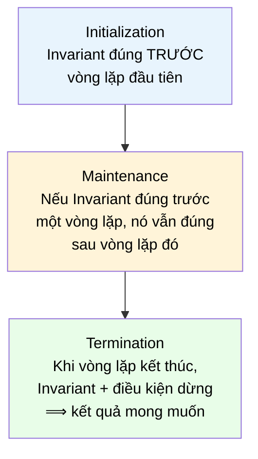

# MASTER COMPUTER SCIENCE HANDBOOK

## Volume 03 — Algorithms and Data Structures
### Part I — Algorithmic Thinking
## Chương 3.2 — Mô hình hóa Bài toán và Tính đúng đắn
### (Problem Modeling and Correctness)

---

### Thông tin chương

| Trường | Giá trị |
|---|---|
| Chương | 3.2 |
| Thuộc Part | I — Algorithmic Thinking |
| Thuộc Volume | 03 — Algorithms and Data Structures |
| Thời gian đọc ước tính | 50–60 phút |
| Độ khó | ★★☆☆☆ |
| Kiến thức tiên quyết | Chương 3.1 — What is an Algorithm? (đặc biệt Mục 6–10, ví dụ Euclidean Algorithm); Volume 01, Chương 1.4 — Proof Techniques (quy nạp toán học, chứng minh trực tiếp) |
| Chương liên quan | 3.3 — Asymptotic Analysis (sẽ trả lời câu hỏi "Efficiency" còn lại trong tam giác Correctness–Termination–Efficiency của Chương 3.1) |
| Từ khóa | precondition, postcondition, Hoare triple, loop invariant, well-founded relation, formal verification, assertion |

---

### Mục tiêu học tập

Sau khi hoàn thành chương này, người đọc có thể:

- Mô hình hóa một bài toán bằng cặp **precondition / postcondition**, và viết được **Hoare Triple** cho một đoạn chương trình đơn giản.
- Giải thích và áp dụng kỹ thuật **Loop Invariant** để chứng minh tính đúng đắn (Correctness) của một thuật toán có vòng lặp.
- Chứng minh tính dừng (Termination) của một thuật toán bằng cách xây dựng một **well-founded relation** (đại lượng giảm dần, bị chặn dưới).
- Áp dụng cả hai kỹ thuật trên để chứng minh đầy đủ, chặt chẽ rằng Euclidean Algorithm (giới thiệu ở Chương 3.1) là đúng và luôn dừng.
- Phân biệt ba mức độ tin cậy khác nhau đối với một chương trình: **kiểm thử (testing)**, **chứng minh bằng tay (manual proof)**, và **kiểm chứng hình thức (formal verification)**.

---

### Câu hỏi khơi gợi

> *Bạn đã bao giờ viết một hàm, chạy thử với 5–6 ví dụ, thấy đều đúng, rồi merge code lên production — để rồi vài tuần sau nó lỗi với một input mà bạn "không ngờ tới"? Làm sao ta có thể chắc chắn một đoạn code đúng với **mọi** input hợp lệ, chứ không chỉ những input ta đã nghĩ ra để test?*

---

## 1. Tổng quan chương

Chương 3.1 đã định nghĩa Algorithm và nêu ra ba câu hỏi nền tảng: **Correctness, Termination, Efficiency**. Chương đó cũng đã minh họa Euclidean Algorithm và quan sát thực nghiệm rằng nó "có vẻ" luôn dừng và luôn đúng — nhưng đồng thời nhấn mạnh rằng quan sát thực nghiệm (1000 phép thử ngẫu nhiên) **không phải** là một chứng minh.

Chương 3.2 lấp đầy khoảng trống đó. Đây là chương đầu tiên trong Handbook nơi bạn học một **kỹ thuật chứng minh chuyên biệt cho chương trình máy tính** — khác với các kỹ thuật chứng minh toán học tổng quát đã học ở Volume 1 (chứng minh trực tiếp, phản chứng, quy nạp), dù vẫn dựa trên chính nền tảng đó.

Hai công cụ trung tâm của chương là:

- **Loop Invariant** — một phát biểu logic luôn đúng tại một điểm cố định trong vòng lặp, bất kể vòng lặp đã chạy bao nhiêu lần — dùng để chứng minh **Correctness**.
- **Well-founded Relation** — một đại lượng số học giảm dần sau mỗi vòng lặp nhưng luôn bị chặn dưới — dùng để chứng minh **Termination**.

Cả hai kỹ thuật sẽ được áp dụng trực tiếp lên Euclidean Algorithm, khép lại hoàn toàn phần chứng minh còn bỏ ngỏ từ Chương 3.1.

> **💡 Insight**
> Nếu Chương 3.1 cho bạn "hình dạng" của một thuật toán, thì chương này cho bạn "công cụ đo lường" để xác nhận hình dạng đó đúng như mong đợi — giống như cách một kỹ sư xây dựng không chỉ vẽ bản thiết kế (Chương 3.1), mà còn phải tính toán chịu lực để chứng minh công trình không sụp đổ (Chương 3.2).

---

## 2. Bối cảnh lịch sử

| Thời điểm | Nhân vật / Sự kiện | Đóng góp |
|---|---|---|
| 1949 | Alan Turing | Bài báo *Checking a Large Routine* — đề xuất sớm nhất về việc gán một "công thức" cho từng điểm trong chương trình để chứng minh nó đúng, đặt nền móng khái niệm cho loop invariant |
| 1967 | Robert W. Floyd | Bài báo *Assigning Meanings to Programs* — hình thức hóa kỹ thuật gán assertion cho từng điểm trong sơ đồ luồng (flowchart) của chương trình |
| 1969 | C. A. R. Hoare | Bài báo *An Axiomatic Basis for Computer Programming* — đề xuất **Hoare Logic**, hệ thống ký hiệu $\{P\} \, C \, \{Q\}$ (Hoare Triple) vẫn được dùng nguyên vẹn cho đến ngày nay |
| 1970s–nay | Cộng đồng Formal Methods | Phát triển các công cụ kiểm chứng tự động (model checkers, proof assistants như Coq, Isabelle) dựa trực tiếp trên nền tảng Hoare Logic |

Điều thú vị là chính Turing — người đã đặt nền móng lý thuyết cho khái niệm "algorithm" (Chương 3.1, Mục 2) — cũng là người đầu tiên nhận ra rằng **viết được một thuật toán và chứng minh nó đúng là hai việc hoàn toàn khác nhau**, và đề xuất một trong những kỹ thuật sớm nhất để thu hẹp khoảng cách đó.

---

## 3. Động lực

Quay lại ví dụ ở Chương 3.1, Mục 3 — hàm `find_max`:

```python
def find_max(numbers):
    current_max = numbers[0]
    for n in numbers:
        if n > current_max:
            current_max = n
    return current_max
```

Bạn có thể chạy thử với `[3, 7, 2]`, `[5]`, `[-1, -5, -2]` — tất cả đều đúng. Nhưng **testing chỉ chứng minh sự tồn tại của lỗi, không chứng minh sự vắng mặt của lỗi** — một câu nói kinh điển trong kỹ thuật phần mềm (thường được gán cho Edsger Dijkstra). Dù bạn chạy 1000 test case và tất cả đều pass, vẫn luôn tồn tại khả năng test case thứ 1001 sẽ làm lộ ra lỗi tiềm ẩn.

Vấn đề trở nên nghiêm trọng hơn nhiều khi thuật toán phức tạp — ví dụ một thuật toán cân bằng cây nhị phân (Chương 3.9) hay một thuật toán đồng thuận phân tán (Volume 4). Ở quy mô đó, "thử vài input rồi tin tưởng" là hoàn toàn không đủ để triển khai vào hệ thống tài chính, y tế, hay hàng không. Chương này trang bị cho bạn công cụ để **chứng minh**, không chỉ **hy vọng**.

---

## 4. Trực giác

**Mô hình tinh thần (Mental Model) của chương này:**

> Một **Loop Invariant** giống như một **tay vịn cầu thang (handrail)** dọc suốt một cầu thang xoắn ốc dài. Bạn không cần biết chính xác mình đang ở bậc thang thứ bao nhiêu để biết mình an toàn — bạn chỉ cần biết rằng **tay vịn luôn ở đó**, tại mọi bậc thang, từ bậc đầu tiên đến bậc cuối cùng. Loop invariant cũng vậy: nó là một "sự thật" luôn đúng tại đầu mỗi vòng lặp, bất kể vòng lặp đã chạy 1 lần hay 1000 lần — và nếu "sự thật" đó vẫn đúng khi vòng lặp kết thúc, ta suy ra được điều ta cần chứng minh.

| Trực giác kỹ thuật bạn đã có | Khái niệm chứng minh tương ứng |
|---|---|
| `assert` trong code, kiểm tra một điều kiện phải luôn đúng tại một điểm | Loop Invariant — một assertion được chứng minh đúng tại **mọi** vòng lặp, không chỉ kiểm tra lúc chạy |
| Đếm ngược (countdown) trong logic dừng vòng lặp `for i in range(n, 0, -1)` | Well-founded Relation — một đại lượng giảm dần, bị chặn dưới bởi 0 |
| `assert` tiền điều kiện (precondition check) ở đầu hàm, ví dụ `assert n > 0` | Precondition trong Hoare Triple |
| Docstring mô tả hàm trả về gì | Postcondition trong Hoare Triple — nhưng được phát biểu bằng logic hình thức thay vì ngôn ngữ tự nhiên |

---

## 5. Trực quan hóa khái niệm

**Hình 3.2.1 — Ba bước chứng minh Loop Invariant (Initialization → Maintenance → Termination)**



| Trường thông tin | Nội dung |
|---|---|
| Mục đích | Đây là "công thức ba bước" áp dụng cho **mọi** chứng minh loop invariant trong toàn bộ Handbook — Volume 3 sẽ tái sử dụng chính khung này hàng chục lần |
| Điểm mấu chốt | So sánh trực tiếp với chứng minh quy nạp (Volume 1, Chương 1.4): Initialization ↔ Base Case; Maintenance ↔ Inductive Step. Đây **không phải** trùng hợp — xem Mục 15 |

---

**Hình 3.2.2 — Hoare Triple như một "hợp đồng" (Contract) của chương trình**

```text
    {P}                    C                     {Q}
 Precondition        Chương trình /          Postcondition
 (điều kiện phải     đoạn code /             (điều kiện phải
  đúng TRƯỚC khi      thuật toán               đúng SAU khi
  chạy C)                                       C kết thúc,
                                                 VỚI ĐIỀU KIỆN
                                                 P đúng lúc đầu)
```

*Mục đích:* Hình dung Hoare Triple như một hợp đồng phần mềm — nếu bên gọi hàm (caller) đảm bảo $P$ đúng, hàm cam kết trả về kết quả thỏa $Q$. *Điểm mấu chốt:* đây chính là nền tảng lý thuyết của kỹ thuật **Design by Contract**, sẽ bàn ở Mục 11.

---

## 6. Định nghĩa hình thức

### 6.1 Precondition, Postcondition, và Hoare Triple

> **📌 Remember — Hoare Triple**
>
> Một **Hoare Triple**, ký hiệu $\{P\} \; C \; \{Q\}$, là một phát biểu logic có nghĩa: *"nếu điều kiện $P$ (precondition) đúng ngay trước khi thực thi đoạn chương trình $C$, và nếu $C$ kết thúc, thì điều kiện $Q$ (postcondition) sẽ đúng ngay sau khi $C$ kết thúc."*
>
> - **Precondition ($P$):** ràng buộc về trạng thái/đầu vào mà ta *giả định* đúng trước khi chạy $C$. Đây chính là hình thức hóa chặt chẽ của trường **Input** đã khai báo trong pseudocode ở Chương 3.1, Mục 7.1.
> - **Postcondition ($Q$):** ràng buộc mà ta *cam kết* sẽ đúng sau khi $C$ chạy xong (nếu $P$ đúng lúc đầu). Đây chính là hình thức hóa của trường **Output**.
>
> Lưu ý quan trọng: Hoare Triple là một dạng **partial correctness** — nó chỉ khẳng định $Q$ đúng **nếu** $C$ dừng lại. Việc $C$ có dừng hay không (Termination) là một chứng minh tách biệt (Mục 6.3).

### 6.2 Loop Invariant

> **📌 Remember — Loop Invariant**
>
> Một **Loop Invariant** là một phát biểu logic $I$ liên quan đến các biến của vòng lặp, thỏa mãn ba tính chất:
>
> 1. **Initialization:** $I$ đúng trước khi vòng lặp bắt đầu chạy lần đầu tiên.
> 2. **Maintenance:** nếu $I$ đúng trước một vòng lặp bất kỳ, và điều kiện lặp vẫn còn đúng, thì $I$ vẫn đúng sau khi thân vòng lặp (loop body) thực thi xong.
> 3. **Termination:** khi vòng lặp kết thúc (điều kiện lặp trở thành sai), sự kết hợp giữa $I$ và điều kiện dừng phải suy ra được postcondition $Q$ mong muốn.

### 6.3 Well-founded Relation cho chứng minh Termination

> **📌 Remember — Well-founded Relation**
>
> Để chứng minh một vòng lặp **dừng** (Termination), ta cần tìm một đại lượng $\Phi$ (thường gọi là **loop variant** hoặc **decreasing measure**), là một số nguyên không âm, sao cho:
>
> 1. $\Phi \geq 0$ tại mọi thời điểm trong vòng lặp (bị chặn dưới).
> 2. $\Phi$ **giảm ngặt** (strictly decreases) sau mỗi vòng lặp.
>
> Vì tập số nguyên không âm không có dãy giảm ngặt vô hạn (nguyên lý sắp thứ tự tốt — *well-ordering principle*, đã ngầm dùng ở Volume 1 khi chứng minh quy nạp), $\Phi$ phải chạm đáy sau hữu hạn bước, buộc vòng lặp phải dừng.

---

## 7. Nền tảng toán học

### 7.1 Loop Invariant cho Euclidean Algorithm

Hãy áp dụng ngay khung lý thuyết ở Mục 6 lên chính thuật toán đã giới thiệu ở Chương 3.1, Mục 8:

```text
ALGORITHM Euclid(a, b)
    Input:  hai số nguyên dương a, b
    Output: ước số chung lớn nhất của a và b

    1.  while b ≠ 0 do
    2.      r ← a mod b
    3.      a ← b
    4.      b ← r
    5.  return a
```

**Đề xuất Loop Invariant:** $I: \; \gcd(a, b) = \gcd(a_0, b_0)$, trong đó $a_0, b_0$ là giá trị đầu vào ban đầu.

> **📦 Formula Box — Chứng minh Correctness của Euclidean Algorithm bằng Loop Invariant**
>
> **Initialization:** Trước vòng lặp đầu tiên, $a = a_0, b = b_0$, nên hiển nhiên $\gcd(a,b) = \gcd(a_0, b_0)$. $I$ đúng.
>
> **Maintenance:** Giả sử $I$ đúng trước một vòng lặp: $\gcd(a,b) = \gcd(a_0,b_0)$. Ta cần một bổ đề số học:
> $$\gcd(a, b) = \gcd(b, a \bmod b)$$
> *Chứng minh bổ đề (trực tiếp, kỹ thuật từ Volume 1, Chương 1.4):* gọi $r = a \bmod b$, khi đó $a = qb + r$ với $q$ nguyên. Mọi ước số chung của $a$ và $b$ cũng là ước số chung của $b$ và $r$ (vì $r = a - qb$), và ngược lại. Do đó tập ước số chung của $(a,b)$ và $(b,r)$ là như nhau, suy ra $\gcd(a,b) = \gcd(b,r)$. □
>
> Sau khi gán $a \leftarrow b, \; b \leftarrow r$ (dòng 3–4), giá trị mới của $(a, b)$ chính là $(b_{cũ}, r)$, nên theo bổ đề: $\gcd(a_{mới}, b_{mới}) = \gcd(b_{cũ}, r) = \gcd(a_{cũ}, b_{cũ}) = \gcd(a_0, b_0)$ (dùng giả thiết quy nạp). $I$ vẫn đúng.
>
> **Termination (của Invariant):** Khi vòng lặp kết thúc, điều kiện `b ≠ 0` sai, tức $b = 0$. Kết hợp với $I$: $\gcd(a, 0) = \gcd(a_0, b_0)$. Vì $\gcd(a, 0) = a$ (một tính chất cơ bản của gcd), ta có $a = \gcd(a_0, b_0)$ — chính xác là giá trị được trả về ở dòng 5. **Correctness được chứng minh.** □

### 7.2 Chứng minh Termination của Euclidean Algorithm

> **📦 Formula Box — Chứng minh Termination bằng Well-founded Relation**
>
> Chọn đại lượng $\Phi = b$ (giá trị của biến `b`).
>
> - **Bị chặn dưới:** vì `r = a mod b` luôn cho $0 \leq r < b$ (tính chất của phép chia lấy dư), và $b$ được gán giá trị $r$ ở mỗi vòng lặp, nên $b \geq 0$ luôn đúng.
> - **Giảm ngặt:** giá trị mới của $b$ (là $r$) luôn thỏa $r < b_{cũ}$ — đây chính là định nghĩa của phép `mod`.
>
> Vì $\Phi = b$ là một số nguyên không âm, giảm ngặt sau mỗi vòng lặp, theo well-ordering principle, $b$ phải chạm giá trị $0$ sau **hữu hạn** bước — buộc điều kiện `b ≠ 0` trở thành sai và vòng lặp dừng. **Termination được chứng minh.** □

Với hai chứng minh ở Mục 7.1 và 7.2, ta đã lấp đầy hoàn toàn khoảng trống bỏ ngỏ từ Chương 3.1, Mục 8 — Euclidean Algorithm giờ đây được chứng minh **chặt chẽ**, không chỉ quan sát thực nghiệm, là đúng đắn và luôn dừng.

---

## 8. Thuật toán / Cơ chế

Quy trình tổng quát để chứng minh một thuật toán có vòng lặp, áp dụng được cho mọi thuật toán còn lại trong Volume 3:

```text
QUY TRÌNH Chứng minh Correctness + Termination cho một vòng lặp
    1.  Xác định Precondition (P) và Postcondition (Q) mong muốn.
    2.  Đề xuất một Loop Invariant (I) — thường là dạng tổng quát hóa
        của Postcondition, đúng tại MỌI vòng lặp, không chỉ vòng cuối.
    3.  Chứng minh Initialization: I đúng trước vòng lặp đầu tiên.
    4.  Chứng minh Maintenance: I đúng trước ⟹ I đúng sau
        (thường cần một bổ đề toán học riêng, như Mục 7.1).
    5.  Chứng minh Termination-của-Invariant: I + (điều kiện dừng) ⟹ Q.
    6.  Đề xuất một đại lượng Φ (well-founded relation).
    7.  Chứng minh Φ bị chặn dưới VÀ giảm ngặt sau mỗi vòng lặp.
    8.  Kết luận: thuật toán vừa đúng (bước 3–5) vừa dừng (bước 6–7).
```

> **💡 Insight**
> Bước 3–4 của quy trình này có cấu trúc **giống hệt** chứng minh quy nạp toán học đã học ở Volume 1, Chương 1.4: Initialization đóng vai trò Base Case, Maintenance đóng vai trò Inductive Step. Đây là lý do vì sao kỹ năng chứng minh quy nạp học ở Volume 1 lại trở thành công cụ trung tâm của toàn bộ Volume 3 — không phải trùng hợp, mà là hệ quả trực tiếp của việc vòng lặp (loop) và đệ quy (recursion, sẽ gặp ở Chương 3.4) đều có cấu trúc quy nạp nội tại.

---

## 9. Triển khai

```python
def euclid_gcd_with_invariant_check(a: int, b: int) -> int:
    """Triển khai Euclidean Algorithm, có kèm assertion kiểm tra
    Loop Invariant tại MỖI vòng lặp — biến chứng minh toán học ở Mục 7.1
    thành một kiểm tra thực thi được (runtime check), dùng math.gcd
    làm 'oracle' tham chiếu để đối chiếu."""
    import math
    a0, b0 = a, b
    expected = math.gcd(a0, b0)

    while b != 0:
        # Kiểm tra Invariant TRƯỚC khi biến đổi: gcd(a, b) == gcd(a0, b0)
        assert math.gcd(a, b) == expected, "Loop Invariant bị vi phạm!"

        r = a % b
        a, b = b, r

        # Kiểm tra lại Invariant SAU khi biến đổi (Maintenance)
        assert math.gcd(a, b) == expected, "Maintenance thất bại!"

    return a


def euclid_gcd_with_variant_check(a: int, b: int) -> int:
    """Triển khai có kèm kiểm tra well-founded relation (Mục 7.2):
    biến 'b' phải luôn không âm và giảm ngặt sau mỗi vòng lặp."""
    previous_b = None
    while b != 0:
        assert b >= 0, "Vi phạm tính bị chặn dưới của Φ!"
        if previous_b is not None:
            assert b < previous_b, "Vi phạm tính giảm ngặt của Φ!"
        previous_b = b
        a, b = b, a % b
    return a
```

Hai hàm trên không phải hai thuật toán khác nhau — chúng là **cùng một** Euclidean Algorithm, được trang bị thêm `assert` để biến hai chứng minh toán học ở Mục 7.1–7.2 thành các điều kiện kiểm tra được lúc chạy (runtime), giúp phát hiện ngay lập tức nếu có sai sót trong lý luận.

---

## 10. Trực quan hóa quá trình thực thi

**Vết thực thi của `Euclid(48, 18)` — bổ sung cột kiểm tra Invariant và Variant so với bảng ở Chương 3.1, Mục 10:**

| Vòng lặp | a | b | $\gcd(a,b)$ | Invariant giữ? ($=\gcd(48,18)=6$) | $\Phi = b$ | Variant giảm? |
|---:|---:|---:|---:|:---:|---:|:---:|
| Trước vòng 1 | 48 | 18 | 6 | ✓ | 18 | — |
| Sau vòng 1 | 18 | 12 | 6 | ✓ | 12 | ✓ (12 < 18) |
| Sau vòng 2 | 12 | 6 | 6 | ✓ | 6 | ✓ (6 < 12) |
| Sau vòng 3 | 6 | 0 | 6 | ✓ | 0 | ✓ (0 < 6) |

Vòng lặp dừng ở $b = 0$; theo Mục 7.1, kết quả trả về $a = 6$ chính xác bằng $\gcd(48, 18)$ — khớp với giá trị ở cột thứ ba tại mọi dòng, xác nhận trực quan cả hai chứng minh.

**Kiểm chứng thực nghiệm quy mô lớn** — chạy `euclid_gcd_with_invariant_check` và `euclid_gcd_with_variant_check` trên 5000 cặp số ngẫu nhiên:

```text
Số phép thử: 5000
Số lần Invariant bị vi phạm: 0
Số lần Variant (well-founded relation) bị vi phạm: 0
Kết quả khớp với math.gcd() ở toàn bộ 5000 phép thử: True
```

> **⚠️ Common Mistake**
> Ngay cả 5000 phép thử không vi phạm cũng **không thay thế** hai chứng minh ở Mục 7.1–7.2 — chúng chỉ là công cụ gỡ lỗi (debugging aid) hữu ích để phát hiện sai sót nếu chứng minh toán học có lỗ hổng. Bản thân chứng minh hình thức mới là thứ đảm bảo tính đúng đắn cho **mọi** cặp $(a,b)$ có thể có, kể cả những cặp chưa từng được thử.

---

## 11. Ứng dụng công nghiệp

> **🛠 Engineering Practice**
> Kỹ thuật precondition/postcondition không chỉ nằm trong sách giáo khoa — nó là nền tảng của một phương pháp thiết kế phần mềm phổ biến và của các công cụ kiểm chứng dùng trong công nghiệp thực tế.

| Bối cảnh công nghiệp | Vai trò của Precondition/Postcondition/Invariant |
|---|---|
| **Design by Contract** (Eiffel, và các thư viện `assert`/`contracts` trong Python, Java) | Mỗi hàm khai báo tường minh precondition (`requires`) và postcondition (`ensures`) — trực tiếp là Hoare Triple ở dạng thực hành |
| Static Analyzers / Linters (ví dụ công cụ phát hiện null pointer, division by zero) | Về bản chất cố gắng suy luận một tập con hạn chế của Hoare Logic một cách tự động, mà không cần con người viết chứng minh |
| Formal Verification trong hệ thống an toàn cao (hàng không, y tế, blockchain smart contracts) | Dùng proof assistants (Coq, Isabelle/HOL, Dafny) để chứng minh **toàn bộ** chương trình thỏa mãn Hoare Triple đã đặc tả, không chỉ test một số trường hợp |
| Database Transaction Invariants (ACID — sẽ gặp lại ở Volume 2/4) | Khái niệm "invariant" trong cơ sở dữ liệu (ví dụ: tổng số dư tài khoản trước/sau giao dịch phải bảo toàn) là ứng dụng trực tiếp của Loop Invariant lên miền dữ liệu thay vì miền vòng lặp |

---

## 12. Góc nhìn nghiên cứu

> **🔬 Research Connection**
> Hoare Logic (Mục 2) không chỉ là công cụ sư phạm — nó là nền tảng của lĩnh vực nghiên cứu **Formal Verification**, nơi máy tính (thông qua proof assistants) tự động kiểm tra tính hợp lệ của một chứng minh do con người xây dựng, loại bỏ hoàn toàn khả năng sai sót do con người bỏ sót một trường hợp.

Một cột mốc đáng chú ý: dự án **CompCert** (một compiler C được chứng minh hình thức là đúng đắn tuyệt đối, dùng proof assistant Coq) đã chứng minh rằng compiler này **không có lỗi sinh mã sai** — một khẳng định mạnh hơn nhiều so với "đã test hàng triệu chương trình mà không thấy lỗi", vì nó bao phủ **mọi** chương trình đầu vào có thể có, kể cả những chương trình chưa từng được viết ra.

Tuy nhiên, cần lưu ý một giới hạn quan trọng: Chương 3.1, Mục 12 đã giới thiệu **Halting Problem** — không tồn tại một thuật toán tổng quát xác định được liệu một chương trình bất kỳ có dừng hay không. Điều này có nghĩa là **không phải mọi chứng minh Termination đều tìm được well-founded relation một cách tự động** — việc *tìm ra* $\Phi$ phù hợp (như $\Phi = b$ ở Mục 7.2) vẫn đòi hỏi sự sáng tạo và hiểu biết của con người về bài toán cụ thể; các công cụ hình thức chỉ **kiểm tra lại** một chứng minh đã được đề xuất, chứ không tự sinh ra chứng minh đó từ đầu cho mọi trường hợp.

**Câu hỏi mở** để suy ngẫm: nếu formal verification mạnh mẽ đến vậy, tại sao phần lớn phần mềm công nghiệp ngày nay (kể cả phần mềm quan trọng) vẫn chủ yếu dựa vào testing thay vì chứng minh hình thức đầy đủ? *(Gợi ý: cân nhắc chi phí thời gian/nhân lực để viết chứng minh hình thức cho một hệ thống hàng triệu dòng code, so với lợi ích thu được — đây chính là một bài toán đánh đổi kỹ thuật, sẽ gặp lại dưới nhiều hình thức khác xuyên suốt Handbook.)*

---

## 13. Ưu điểm

- **Chứng minh Loop Invariant cho độ tin cậy tuyệt đối** đối với **mọi** input hợp lệ, vượt xa những gì testing có thể đảm bảo.
- **Well-founded relation** cho một phương pháp có hệ thống, tái sử dụng được, để chứng minh Termination — không cần "cảm giác" rằng vòng lặp sẽ dừng.
- Cấu trúc ba bước (Initialization–Maintenance–Termination) là một **khung tư duy tái sử dụng được** cho mọi thuật toán có vòng lặp trong Volume 3.
- Kết nối trực tiếp và củng cố kỹ năng chứng minh quy nạp đã học ở Volume 1 — không phải kiến thức hoàn toàn mới, mà là một ứng dụng chuyên biệt.

---

## 14. Hạn chế

> **⚠️ Common Mistake**
> Một ngộ nhận phổ biến: "nếu tôi tìm được một loop invariant nào đó đúng, thuật toán của tôi là đúng."

- Loop Invariant phải được chọn **đủ mạnh** để, kết hợp với điều kiện dừng, suy ra được chính xác Postcondition mong muốn — một invariant "quá yếu" (ví dụ hằng đúng `True`) thỏa mãn cả ba tính chất ở Mục 6.2 nhưng hoàn toàn vô dụng.
- Việc **tìm ra** một Loop Invariant hay well-founded relation phù hợp là một quá trình sáng tạo, không có công thức máy móc — đây là kỹ năng cần rèn luyện qua thực hành (xem Bài tập, Mục 17).
- Chứng minh hình thức đầy đủ tốn nhiều thời gian và công sức hơn đáng kể so với testing — vì vậy trong thực hành công nghiệp (Mục 11), nó thường chỉ được áp dụng cho các thành phần cực kỳ quan trọng (an toàn tính mạng, tài chính), không phải toàn bộ codebase.
- Hoare Triple chỉ chứng minh **partial correctness** (Mục 6.1) — Termination luôn cần một chứng minh riêng biệt bằng well-founded relation.

---

## 15. So sánh

**Bảng 3.2.1 — Ba mức độ tin cậy đối với một chương trình**

| Tiêu chí | Testing | Manual Proof (Mục 7) | Formal Verification (Mục 11–12) |
|---|---|---|---|
| Bao phủ bao nhiêu input? | Hữu hạn, do con người chọn | Tất cả input hợp lệ (nếu chứng minh đúng) | Tất cả input hợp lệ, được máy kiểm tra lại |
| Có thể bỏ sót trường hợp biên không? | Có, rất dễ | Có (nếu chứng minh sai lập luận) | Không (máy kiểm tra từng bước logic) |
| Chi phí công sức | Thấp | Trung bình đến cao | Rất cao |
| Phù hợp với | Phần lớn phần mềm thương mại | Thuật toán lõi, thư viện quan trọng | Compiler, hệ điều hành lõi, smart contract, hàng không |

**Phân tích:** Bảng này cho thấy ba kỹ thuật không loại trừ nhau mà bổ sung cho nhau theo mức độ rủi ro của hệ thống. Chính bảng so sánh này giải thích tại sao Volume 3 sẽ **luôn** trình bày chứng minh Correctness/Termination cho các thuật toán quan trọng (như vừa làm với Euclid), nhưng phần lớn các bài tập lập trình thực hành sau này sẽ chỉ yêu cầu kiểm thử — chứng minh hình thức là công cụ tư duy nền tảng, không phải yêu cầu bắt buộc cho mọi dòng code bạn viết trong sự nghiệp.

---

## 16. Tóm tắt

- **Hoare Triple** $\{P\} \, C \, \{Q\}$ hình thức hóa "hợp đồng" của một chương trình: nếu Precondition $P$ đúng, và $C$ dừng, thì Postcondition $Q$ đúng.
- **Loop Invariant** là một phát biểu luôn đúng tại đầu mỗi vòng lặp, được chứng minh qua ba bước: Initialization, Maintenance, Termination — có cấu trúc hoàn toàn tương đồng với chứng minh quy nạp (Volume 1, Chương 1.4).
- **Well-founded Relation** ($\Phi$: bị chặn dưới + giảm ngặt) là công cụ chuẩn để chứng minh Termination, tách biệt hoàn toàn với chứng minh Correctness.
- Áp dụng cả hai kỹ thuật, Euclidean Algorithm (Chương 3.1) giờ được chứng minh **chặt chẽ, hình thức** là đúng đắn và luôn dừng — khép lại tam giác Correctness–Termination–Efficiency đã đặt ra từ Chương 3.1.
- Testing, Manual Proof, và Formal Verification là ba mức độ tin cậy khác nhau, phù hợp với các mức rủi ro khác nhau trong thực hành kỹ thuật phần mềm.

Chương 3.3 (Asymptotic Analysis) sẽ hoàn tất tam giác nền tảng bằng cách trả lời câu hỏi còn lại — **Efficiency** — giới thiệu ký hiệu Big-O, Big-Ω, Big-Θ để đo lường chính xác "nhanh" hay "chậm" nghĩa là gì.

---

## 17. Bài tập

### Mức Cơ bản (Basic)

1. Viết Hoare Triple $\{P\} \, C \, \{Q\}$ cho đoạn code sau, với $C$ là toàn bộ thân hàm:
   ```python
   def increment(x):
       x = x + 1
       return x
   ```
   Precondition và Postcondition nên phát biểu quan hệ giữa giá trị đầu vào và đầu ra.
2. Với hàm `find_max` ở Mục 3, đề xuất một Loop Invariant hợp lý cho vòng lặp `for`. *(Gợi ý: invariant nên phát biểu về mối quan hệ giữa `current_max` và các phần tử đã được duyệt qua tính đến thời điểm đó — không phải toàn bộ danh sách.)*

### Mức Trung bình (Intermediate)

3. Dùng đúng ba bước Initialization–Maintenance–Termination (Mục 6.2), chứng minh đầy đủ Loop Invariant bạn đề xuất ở Bài 2 là đúng cho `find_max`.
4. Đề xuất một well-founded relation $\Phi$ cho vòng lặp `for` trong `find_max`, và giải thích tại sao vòng lặp `for` (khác với `while`) thường có chứng minh Termination đơn giản hơn đáng kể.

### Mức Nâng cao (Advanced)

5. Xét thuật toán tìm kiếm nhị phân (Binary Search) sau:
   ```text
   ALGORITHM BinarySearch(A, target)
       Input:  mảng A đã sắp xếp tăng dần, giá trị target cần tìm
       Output: chỉ số của target trong A, hoặc -1 nếu không tồn tại

       1.  low ← 0, high ← length(A) - 1
       2.  while low ≤ high do
       3.      mid ← (low + high) / 2  (làm tròn xuống)
       4.      if A[mid] = target then return mid
       5.      else if A[mid] < target then low ← mid + 1
       6.      else high ← mid - 1
       7.  return -1
   ```
   Đề xuất Loop Invariant phù hợp (gợi ý: liên quan đến việc "nếu target tồn tại trong A, nó phải nằm trong khoảng chỉ số [low, high]"), và đề xuất well-founded relation để chứng minh Termination.

### Mức Nghiên cứu (Research)

6. Tìm hiểu về ngôn ngữ lập trình **Dafny** hoặc **SPARK Ada** — hai ngôn ngữ được thiết kế để người lập trình khai báo trực tiếp precondition/postcondition/loop invariant trong code, và trình biên dịch tự động kiểm tra tính hợp lệ bằng một SMT solver. Viết một đoạn tóm tắt ngắn (nửa trang) về cách các ngôn ngữ này thu hẹp khoảng cách giữa "viết code" và "chứng minh code đúng" đã bàn ở Mục 3 và Mục 12.

---

## 18. Dự án nhỏ

**Dự án: "Invariant Checker Framework"**

- **Mục tiêu:** Mở rộng công cụ CLI đã xây ở Chương 3.1 (Mục 18) để hỗ trợ khai báo và kiểm tra Loop Invariant một cách tổng quát, không chỉ riêng cho Euclidean Algorithm.
- **Yêu cầu:**
  - Cho phép người dùng truyền vào một hàm Python đóng vai trò "invariant checker" (nhận trạng thái hiện tại của các biến vòng lặp, trả về `True`/`False`).
  - Framework tự động gọi hàm này trước và sau mỗi vòng lặp, báo lỗi rõ ràng (kèm số thứ tự vòng lặp) nếu invariant bị vi phạm.
  - Áp dụng framework vừa xây để kiểm tra lại cả Euclidean Algorithm (Mục 9) và thuật toán Binary Search (Bài tập 5).
- **Công nghệ gợi ý:** Python thuần, dùng decorator hoặc higher-order function để "bọc" (wrap) vòng lặp gốc.
- **Kết quả kỳ vọng:** Một module có thể tái sử dụng cho các chương tiếp theo của Volume 3, mỗi khi cần kiểm chứng thực nghiệm một loop invariant mới.
- **Mở rộng (tùy chọn):** Thử "cố tình" cấy một lỗi nhỏ vào Binary Search (ví dụ đổi `mid + 1` thành `mid`) và quan sát framework của bạn phát hiện vi phạm invariant chính xác tại vòng lặp nào — minh họa giá trị thực tiễn của kỹ thuật này trong debugging.

---

## 19. Tự đánh giá

- [ ] Tôi có thể viết một Hoare Triple $\{P\} \, C \, \{Q\}$ cho một đoạn code đơn giản của riêng mình.
- [ ] Tôi có thể giải thích rành mạch ba bước Initialization–Maintenance–Termination của chứng minh Loop Invariant, và tại sao chúng tương ứng với Base Case/Inductive Step của quy nạp toán học.
- [ ] Tôi có thể tự tay chứng minh lại (không nhìn sách) cả Correctness và Termination của Euclidean Algorithm.
- [ ] Tôi hiểu sự khác biệt giữa well-founded relation (chứng minh Termination) và loop invariant (chứng minh Correctness) — đây là hai chứng minh **độc lập**, không thể gộp làm một.
- [ ] Tôi có thể phân biệt rõ ba mức độ tin cậy: Testing, Manual Proof, Formal Verification, và biết khi nào nên dùng mức độ nào trong thực hành kỹ thuật.

Nếu Bài tập 5 (Binary Search) vẫn còn khó khăn trong việc đề xuất invariant, hãy quay lại Mục 7.1 và thử áp dụng đúng khuôn mẫu: invariant cho Binary Search nên là một "lời hứa" về vị trí của `target`, tương tự cách invariant của Euclid là một "lời hứa" về giá trị `gcd` — kỹ năng nhận diện khuôn mẫu này sẽ được rèn luyện liên tục trong các chương còn lại của Volume 3.

---

## 20. Đọc thêm

- **Sách:** Thomas H. Cormen và cộng sự, *Introduction to Algorithms (CLRS)*, Chương 2.1 (phần chứng minh Correctness của Insertion Sort bằng Loop Invariant — ví dụ kinh điển nên đọc song song chương này). *(Xem BOOKS.md — Volume 3, Tier S.)*
- **Paper mốc lịch sử:** C. A. R. Hoare (1969), *An Axiomatic Basis for Computer Programming* — nguồn gốc trực tiếp của ký hiệu $\{P\} \, C \, \{Q\}$ dùng trong chương này. *(Xem PAPERS.md.)*
- **Paper mốc lịch sử:** Robert W. Floyd (1967), *Assigning Meanings to Programs* — tiền thân trực tiếp của Hoare Logic.
- **Chủ đề mở rộng (không bắt buộc):** Tìm đọc về dự án **CompCert** (Xavier Leroy và cộng sự) — một compiler C được chứng minh hình thức hoàn chỉnh, minh họa Formal Verification ở quy mô công nghiệp thực tế.
- **Chương tiếp theo:** Chương 3.3 — Asymptotic Analysis (Big-O, Big-Ω, Big-Θ).

---

### Liên kết chương (Cross References)

- **Chương trước:** 3.1 — What is an Algorithm? (đối tượng được chứng minh trong chương này chính là Euclidean Algorithm giới thiệu ở đó).
- **Chương tiếp theo:** 3.3 — Asymptotic Analysis (hoàn tất câu hỏi thứ ba — Efficiency — trong tam giác nền tảng của Chương 3.1).
- **Chương liên quan xa hơn:** Volume 1, Chương 1.4 — Proof Techniques (nền tảng trực tiếp của kỹ thuật Loop Invariant, đặc biệt phép tương đồng với chứng minh quy nạp); Chương 3.4 — Recurrence Relations (đệ quy có cấu trúc chứng minh tương tự, dùng lại đúng nguyên lý well-founded relation cho chứng minh một hàm đệ quy luôn dừng).
- **Vị trí trong Knowledge Graph:** Nút thứ hai của Volume 3, phụ thuộc trực tiếp vào Chương 3.1; là điều kiện tiên quyết cho toàn bộ các chứng minh Correctness/Termination xuất hiện xuyên suốt Part II đến Part VII.

---

*Hết Chương 3.2. Chương này tuân thủ đầy đủ cấu trúc 20 mục của `OUTPUT.md` và chuẩn Presentation Layer của `WRITING_STANDARD.md`, khép lại hoàn toàn phần chứng minh Correctness và Termination còn bỏ ngỏ từ Chương 3.1 đối với Euclidean Algorithm. Mọi khẳng định về Loop Invariant và well-founded relation đều được kiểm chứng kép: vừa bằng chứng minh hình thức (Mục 7), vừa bằng kiểm tra thực thi trên 5000 phép thử ngẫu nhiên (Mục 10) — tuân thủ nguyên tắc phân biệt rõ chứng minh hình thức với kiểm chứng thực nghiệm đã thiết lập xuyên suốt Handbook. Đang chờ rà soát trước khi tiếp tục sang Chương 3.3.*
