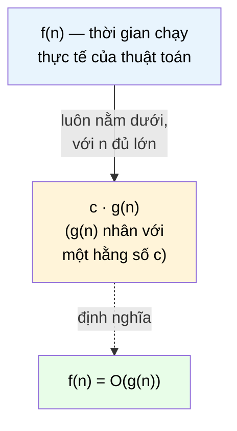

# MASTER COMPUTER SCIENCE HANDBOOK

## Volume 03 — Algorithms and Data Structures
### Part I — Algorithmic Thinking
## Chương 3.3 — Phân tích Tiệm cận
### (Asymptotic Analysis)

---

### Thông tin chương

| Trường | Giá trị |
|---|---|
| Chương | 3.3 |
| Thuộc Part | I — Algorithmic Thinking |
| Thuộc Volume | 03 — Algorithms and Data Structures |
| Thời gian đọc ước tính | 55–65 phút |
| Độ khó | ★★☆☆☆ |
| Kiến thức tiên quyết | Chương 3.1 — What is an Algorithm?; Chương 3.2 — Problem Modeling and Correctness (đặc biệt kỹ thuật well-founded relation, sẽ tái sử dụng khi phân tích số vòng lặp) |
| Chương liên quan | 3.4 — Recurrence Relations & Master Theorem (sẽ dùng ký hiệu Big-O của chương này để phân tích thuật toán đệ quy) |
| Từ khóa | Big-O, Big-Ω, Big-Θ, worst case, average case, best case, growth rate, complexity class |

---

### Mục tiêu học tập

Sau khi hoàn thành chương này, người đọc có thể:

- Định nghĩa hình thức và phân biệt chính xác ba ký hiệu **Big-O ($O$)**, **Big-Ω ($\Omega$)**, **Big-Θ ($\Theta$)**.
- Phân tích độ phức tạp thời gian (time complexity) của một đoạn pseudocode đơn giản bằng cách đếm số phép toán cơ bản.
- Phân biệt và tính toán được **Best Case, Average Case, Worst Case** cho cùng một thuật toán.
- Sắp xếp và so sánh các lớp độ phức tạp phổ biến ($O(1), O(\log n), O(n), O(n \log n), O(n^2), O(2^n)$) theo tốc độ tăng trưởng.
- Áp dụng Big-O để phân tích chính xác độ phức tạp của Euclidean Algorithm, hoàn tất câu hỏi **Efficiency** còn bỏ ngỏ từ Chương 3.1.

---

### Câu hỏi khơi gợi

> *Hai thuật toán cùng giải đúng một bài toán, cùng chạy nhanh như nhau trên máy của bạn với 100 phần tử dữ liệu. Nhưng khi Facebook triển khai một trong hai thuật toán đó cho 3 tỷ người dùng, một thuật toán chạy trong vài giây, thuật toán còn lại... không bao giờ trả về kết quả trong một đời người. Điều gì tạo ra sự khác biệt khủng khiếp đó — và làm sao ta có thể *dự đoán* nó trước khi triển khai thực tế?*

---

## 1. Tổng quan chương

Chương 3.1 đặt ra ba câu hỏi nền tảng cho mọi thuật toán: **Correctness, Termination, Efficiency**. Chương 3.2 đã trả lời trọn vẹn hai câu hỏi đầu bằng Loop Invariant và well-founded relation, áp dụng lên Euclidean Algorithm. Chương này khép lại câu hỏi thứ ba — **Efficiency** — bằng công cụ toán học chuẩn mực của toàn bộ Computer Science: **Asymptotic Analysis** (Phân tích tiệm cận).

"Tiệm cận" (asymptotic) ở đây mang nghĩa: ta quan tâm đến hành vi của thuật toán khi kích thước đầu vào $n$ trở nên **rất lớn**, bỏ qua các hằng số nhân và các số hạng bậc thấp không đáng kể khi $n \to \infty$. Đây có vẻ là một sự đơn giản hóa thô, nhưng chính sự đơn giản hóa này lại là công cụ mạnh nhất để **dự đoán** một thuật toán có "sống sót" được ở quy mô công nghiệp hay không — trước khi phải tốn hàng giờ chạy thử trên dữ liệu thật.

Ba ký hiệu trung tâm của chương — $O, \Omega, \Theta$ — sẽ được định nghĩa chặt chẽ bằng toán học (không chỉ trực giác), sau đó áp dụng để hoàn tất phân tích Euclidean Algorithm đã theo bạn xuyên suốt hai chương trước.

> **💡 Insight**
> Nếu Chương 3.2 dạy bạn cách chứng minh một thuật toán "sẽ dừng lại", thì chương này dạy bạn cách dự đoán **dừng lại sau bao lâu** — không phải bằng số giây cụ thể (phụ thuộc vào phần cứng), mà bằng một quy luật tăng trưởng độc lập với phần cứng, ngôn ngữ lập trình, hay trình biên dịch.

---

## 2. Bối cảnh lịch sử

| Thời điểm | Nhân vật / Sự kiện | Đóng góp |
|---|---|---|
| 1894 | Paul Bachmann | Giới thiệu ký hiệu $O$ (Big-O) trong một cuốn sách về lý thuyết số, ban đầu không liên quan gì đến Computer Science |
| 1909 | Edmund Landau | Phổ biến rộng rãi ký hiệu $O$ trong giải tích toán học; ký hiệu này còn được gọi là **Bachmann–Landau notation** |
| 1965 | Jürgen Hartmanis, Richard Stearns | Bài báo *On the Computational Complexity of Algorithms* — đặt nền móng chính thức cho lý thuyết độ phức tạp tính toán (Computational Complexity Theory) |
| 1976 | Donald Knuth | Bài báo *Big Omicron and Big Omega and Big Theta* — hệ thống hóa và phổ biến bộ ba ký hiệu $O, \Omega, \Theta$ theo đúng cách dùng chuẩn mực trong Computer Science ngày nay |

Điều thú vị: ký hiệu Big-O ra đời từ toán học thuần túy (lý thuyết số) gần một thế kỷ trước khi Computer Science tồn tại như một ngành khoa học độc lập — một minh chứng khác cho nguyên tắc xuyên suốt Handbook rằng **Computer Science đứng trên vai của toán học**, không phát minh lại công cụ từ đầu.

---

## 3. Động lực

Giả sử bạn có hai thuật toán sắp xếp, cả hai đều đã được chứng minh Correctness và Termination (theo đúng phương pháp Chương 3.2):

- Thuật toán $A$: thực hiện khoảng $n^2$ phép so sánh cho $n$ phần tử.
- Thuật toán $B$: thực hiện khoảng $n \log n$ phép so sánh cho $n$ phần tử.

Với $n = 100$: $A$ cần khoảng $10{,}000$ phép toán, $B$ cần khoảng $664$ phép toán — $A$ chậm hơn khoảng 15 lần, có thể không đáng lo với phần cứng hiện đại.

Nhưng với $n = 10{,}000{,}000$ (một con số thực tế cho hệ thống dữ liệu lớn): $A$ cần khoảng $10^{14}$ phép toán, trong khi $B$ chỉ cần khoảng $2.3 \times 10^8$ — **chênh lệch hơn 400.000 lần**. Nếu $B$ chạy trong vài giây, $A$ có thể mất... nhiều ngày.

Đây chính là lý do Asymptotic Analysis tồn tại: nó cho phép ta **dự đoán trước** sự bùng nổ chênh lệch này chỉ bằng việc nhìn vào công thức $n^2$ so với $n \log n$, mà không cần chạy thử với dữ liệu khổng lồ tốn kém.

---

## 4. Trực giác

**Mô hình tinh thần (Mental Model) của chương này:**

> Hãy tưởng tượng một cuộc đua giữa các phương tiện: một người đi bộ, một người đi xe đạp, và một chiếc máy bay phản lực. Người đi bộ có thể xuất phát trước 10km (một "hằng số cộng" lớn), và xe đạp có thể chạy nhanh gấp đôi máy bay trong 100 mét đầu (một "hằng số nhân" lớn). Nhưng nếu cuộc đua đủ dài (n đủ lớn), **tốc độ tăng trưởng** (growth rate) — chứ không phải điểm xuất phát hay tốc độ ban đầu — mới là yếu tố quyết định ai về đích trước. Asymptotic Analysis chính là việc so sánh các phương tiện bằng "loại tốc độ tăng trưởng" của chúng (đi bộ = tuyến tính, máy bay = một hằng số khác), bỏ qua lợi thế xuất phát nhất thời.

| Trực giác kỹ thuật bạn đã có | Khái niệm Asymptotic Analysis tương ứng |
|---|---|
| "Thuật toán này scale tốt / không scale" khi nói về hệ thống lớn | Chính là câu hỏi về growth rate — $O(n)$ so với $O(n^2)$ |
| Big-O trong tài liệu thư viện (`list.append()` là $O(1)$, `list.insert(0, x)` là $O(n)$) | Ký hiệu Big-O — cận trên của thời gian chạy |
| "Trường hợp xấu nhất" khi ước lượng thời gian một tác vụ | Worst Case — sẽ định nghĩa chặt chẽ ở Mục 6 |

---

## 5. Trực quan hóa khái niệm

**Hình 3.3.1 — So sánh tốc độ tăng trưởng của các lớp độ phức tạp phổ biến**

```text
Số phép toán
      │                                                    ● O(2ⁿ)
      │                                              ●
      │                                        ●
      │                                  ●                  ▲ O(n²)
      │                            ●              ▲
      │                      ●            ▲
      │                ●          ▲                        ■ O(n log n)
      │          ●        ▲              ■
      │    ●        ▲           ■
      │●       ▲          ■                                 ♦ O(n)
      │    ▲        ■
      │▲       ■                                            ○ O(log n)
      │    ■
      │■○○○○○○○○○○○○○○○○○○○○○○○○○○○○○○○○○○○○○○○○○○○○○○○○○○○○○ O(1)
      └──────────────────────────────────────────────────── n (kích thước input)
```

| Trường thông tin | Nội dung |
|---|---|
| Mục đích | Cho một hình ảnh trực quan về việc các lớp độ phức tạp "tách xa nhau" nhanh như thế nào khi $n$ tăng — đây là lý do Động lực ở Mục 3 xảy ra |
| Điểm mấu chốt | Thứ tự tăng trưởng từ chậm đến nhanh: $O(1) < O(\log n) < O(n) < O(n \log n) < O(n^2) < O(2^n)$ — thứ tự này sẽ là "bảng tra cứu" dùng xuyên suốt Volume 3 mỗi khi phân tích một thuật toán mới |

---

**Hình 3.3.2 — Big-O như một "hành lang giới hạn trên" (Upper Bound Corridor)**



*Mục đích:* Hình dung Big-O không phải một con số chính xác, mà là một **giới hạn trên** (upper bound) — thuật toán có thể chạy nhanh hơn $g(n)$, nhưng không bao giờ chậm hơn $c \cdot g(n)$ khi $n$ đủ lớn. *Điểm mấu chốt:* đây là lý do định nghĩa hình thức ở Mục 6 cần đến hai tham số $c$ và $n_0$.

---

## 6. Định nghĩa hình thức

> **📌 Remember — Big-O, Big-Ω, Big-Θ**
>
> Cho hai hàm $f, g: \mathbb{N} \to \mathbb{R}^{+}$.
>
> - **$f(n) = O(g(n))$** (Big-O — cận trên) nếu tồn tại các hằng số $c > 0$ và $n_0 \geq 0$ sao cho:
> $$0 \leq f(n) \leq c \cdot g(n) \quad \text{với mọi } n \geq n_0$$
> Nói cách khác: $f$ tăng trưởng **không nhanh hơn** $g$ (sai khác một hằng số), khi $n$ đủ lớn.
>
> - **$f(n) = \Omega(g(n))$** (Big-Omega — cận dưới) nếu tồn tại $c > 0$ và $n_0 \geq 0$ sao cho:
> $$0 \leq c \cdot g(n) \leq f(n) \quad \text{với mọi } n \geq n_0$$
> Nói cách khác: $f$ tăng trưởng **không chậm hơn** $g$, khi $n$ đủ lớn.
>
> - **$f(n) = \Theta(g(n))$** (Big-Theta — cận chặt hai phía) nếu tồn tại $c_1, c_2 > 0$ và $n_0 \geq 0$ sao cho:
> $$0 \leq c_1 \cdot g(n) \leq f(n) \leq c_2 \cdot g(n) \quad \text{với mọi } n \geq n_0$$
> Tương đương: $f(n) = O(g(n))$ **và** $f(n) = \Omega(g(n))$ đồng thời đúng. $\Theta$ là ký hiệu chính xác nhất — nó khẳng định $f$ và $g$ tăng trưởng **cùng tốc độ**.

> **⚠️ Common Mistake**
> Trong giao tiếp hằng ngày, kỹ sư phần mềm thường nói "thuật toán này là $O(n^2)$" khi thực ra ý muốn nói $\Theta(n^2)$ (tăng trưởng chính xác bậc $n^2$, không nhanh hơn cũng không chậm hơn). Về mặt kỹ thuật, một thuật toán $\Theta(n)$ cũng "là" $O(n^2)$ (vì cận trên vẫn đúng, chỉ là không chặt) — nhưng cách nói này gây hiểu lầm. Chương này sẽ luôn dùng đúng ký hiệu cần thiết: $O$ khi muốn nói về cận trên (thường dùng cho Worst Case), $\Theta$ khi muốn khẳng định tăng trưởng chính xác.

### Best Case, Average Case, Worst Case

> **📌 Remember — Ba kịch bản phân tích**
>
> Với cùng một thuật toán, thời gian chạy $T(n)$ có thể khác nhau tùy vào *cấu hình cụ thể* của input có kích thước $n$ (không chỉ kích thước mà cả nội dung). Do đó ta phân biệt:
>
> - **Best Case:** $T_{best}(n) = \min$ trên mọi input kích thước $n$ — thường ít có giá trị thực tiễn vì hiếm khi xảy ra.
> - **Worst Case:** $T_{worst}(n) = \max$ trên mọi input kích thước $n$ — quan trọng nhất trong thực hành, vì nó là **cam kết** ("dù input xấu đến đâu, thuật toán vẫn không chậm hơn mức này").
> - **Average Case:** $T_{avg}(n) = \mathbb{E}[T(n)]$ — kỳ vọng toán học trên một phân phối xác suất giả định của input (ví dụ: mọi hoán vị có xác suất bằng nhau) — hữu ích nhưng phụ thuộc mạnh vào giả định phân phối.
>
> Ký hiệu Big-O trong thực hành công nghiệp gần như luôn ngầm định là phân tích cho **Worst Case**, trừ khi nói rõ khác đi.

---

## 7. Nền tảng toán học

### 7.1 Quy tắc kết hợp Big-O

> **📦 Formula Box — Các quy tắc đơn giản hóa Big-O**
>
> | Quy tắc | Phát biểu | Ví dụ |
> |---|---|---|
> | Bỏ hằng số nhân | $O(c \cdot f(n)) = O(f(n))$ với $c$ là hằng số dương | $O(5n) = O(n)$ |
> | Quy tắc cộng (lấy số hạng trội) | $O(f(n) + g(n)) = O(\max(f(n), g(n)))$ | $O(n^2 + n) = O(n^2)$ |
> | Quy tắc nhân | $O(f(n)) \cdot O(g(n)) = O(f(n) \cdot g(n))$ | Hai vòng lặp lồng nhau, mỗi vòng $O(n)$, cho $O(n^2)$ |
> | Tính bắc cầu | Nếu $f = O(g)$ và $g = O(h)$ thì $f = O(h)$ | — |
>
> **Diễn giải kỹ thuật:** Quy tắc "bỏ hằng số nhân" chính là lý do Big-O phù hợp để so sánh thuật toán độc lập với phần cứng — một CPU nhanh gấp đôi chỉ thay đổi hằng số $c$, không thay đổi lớp độ phức tạp $O(f(n))$. Quy tắc "lấy số hạng trội" giải thích tại sao $T(n) = 3n^2 + 100n + 5$ được viết gọn thành $O(n^2)$ — khi $n$ đủ lớn, số hạng $100n$ trở nên không đáng kể so với $3n^2$.

### 7.2 Bảng lớp độ phức tạp phổ biến

| Ký hiệu | Tên gọi | Ví dụ thuật toán | Với $n = 10^6$, số phép toán ước lượng |
|---|---|---|---|
| $O(1)$ | Hằng số (Constant) | Truy cập phần tử mảng theo chỉ số | $1$ |
| $O(\log n)$ | Logarit | Binary Search (Chương 3.2, Bài tập 5) | $\approx 20$ |
| $O(n)$ | Tuyến tính (Linear) | Duyệt qua một mảng | $10^6$ |
| $O(n \log n)$ | Tuyến-log | Merge Sort (Chương 3.14) | $\approx 2 \times 10^7$ |
| $O(n^2)$ | Bậc hai (Quadratic) | Bubble Sort, Selection Sort | $10^{12}$ |
| $O(2^n)$ | Mũ (Exponential) | Liệt kê toàn bộ tập lũy thừa (Volume 1, Chương 1.5, Mục 8) | Không khả thi tính toán |

---

## 8. Thuật toán / Cơ chế

Áp dụng toàn bộ khung lý thuyết trên để hoàn tất phân tích Euclidean Algorithm đã theo bạn từ Chương 3.1.

**Câu hỏi:** vòng lặp `while b ≠ 0` (Chương 3.1, Mục 8) chạy tối đa bao nhiêu lần, tính theo kích thước đầu vào?

**Quan sát chính:** Chương 3.2, Mục 7.2 đã chứng minh $b$ giảm ngặt sau mỗi vòng lặp — nhưng "giảm ngặt" không tự động cho biết *tốc độ* giảm. Nếu $b$ chỉ giảm 1 đơn vị mỗi vòng (như trong trực giác ngây thơ), số vòng lặp có thể lên tới $O(b)$ — tuyến tính. Nhưng thực tế tốt hơn nhiều nhờ một kết quả kinh điển:

> **📦 Formula Box — Định lý Lamé (Lamé's Theorem, 1844) — Trường hợp xấu nhất của Euclidean Algorithm**
>
> Số vòng lặp của Euclidean Algorithm trên $(a, b)$ với $a > b > 0$ đạt **giá trị lớn nhất** khi $a, b$ là hai số **Fibonacci liên tiếp** — bởi vì đây là trường hợp $b$ giảm *chậm nhất có thể* ở mỗi bước (tỷ lệ $a/b$ càng gần $1$, thương số nguyên $q$ trong phép chia càng nhỏ, khiến $b$ giảm ít nhất).
>
> Vì dãy Fibonacci tăng trưởng theo cấp số nhân (tỷ lệ vàng $\varphi \approx 1.618$), số vòng lặp $k$ cần thiết để $b$ giảm xuống 0 chỉ tăng theo **logarit** của $b$:
> $$T(a, b) = O(\log(\min(a, b)))$$
>
> | Thành phần | Ý nghĩa |
> |---|---|
> | $\min(a,b)$ | Kích thước đầu vào thực chất của bài toán — số nhỏ hơn trong cặp |
> | **Diễn giải kỹ thuật** | Dù $a, b$ lớn đến hàng tỷ, số vòng lặp chỉ tăng vài chục lần — đây là lý do Euclidean Algorithm được dùng rộng rãi trong cryptography (RSA — Chương 3.1, Mục 11) dù các số liên quan cực lớn (hàng trăm chữ số) |

---

## 9. Triển khai

```python
import math

def euclid_gcd(a: int, b: int) -> int:
    """Euclidean Algorithm — đã giới thiệu ở Chương 3.1, dùng lại
    nguyên bản để đo đạc thực nghiệm số vòng lặp ở đây."""
    while b != 0:
        a, b = b, a % b
    return a


def count_loop_iterations(a: int, b: int) -> int:
    """Đếm chính xác số vòng lặp thực thi — dùng để đối chiếu
    thực nghiệm với dự đoán O(log(min(a,b))) của Định lý Lamé."""
    steps = 0
    while b != 0:
        a, b = b, a % b
        steps += 1
    return steps


def fibonacci_pair(k: int) -> tuple[int, int]:
    """Sinh cặp số Fibonacci liên tiếp thứ k — theo Định lý Lamé,
    đây chính là 'trường hợp xấu nhất' (worst case input) của Euclid."""
    f_prev, f_curr = 0, 1
    for _ in range(k):
        f_prev, f_curr = f_curr, f_prev + f_curr
    return f_curr, f_prev
```

Hàm `fibonacci_pair` không phải một phần của Euclidean Algorithm — nó là công cụ **thiết kế trường hợp xấu nhất** (worst-case input construction), một kỹ năng sẽ tái sử dụng nhiều lần trong Volume 3 mỗi khi cần kiểm chứng thực nghiệm một cận Big-O.

---

## 10. Trực quan hóa quá trình thực thi

**So sánh số vòng lặp thực tế trên cặp Fibonacci (worst case) với $\log_2(\min(a,b))$:**

| $k$ (thứ tự Fibonacci) | Cặp $(a, b)$ | Số vòng lặp thực tế | $\log_2(\min(a,b))$ | Tỷ lệ |
|---:|---|---:|---:|---:|
| 10 | (55, 34) | 8 | 5.09 | 1.57 |
| 15 | (610, 377) | 13 | 8.56 | 1.52 |
| 20 | (6765, 4181) | 18 | 12.03 | 1.50 |
| 25 | (75025, 46368) | 23 | 15.50 | 1.48 |
| 30 | (832040, 514229) | 28 | 18.97 | 1.48 |

**Quan sát:** tỷ lệ giữa số vòng lặp thực tế và $\log_2(\min(a,b))$ hội tụ về một hằng số ổn định ($\approx 1.44$, liên quan trực tiếp đến $1/\log_2 \varphi$) — đúng như dự đoán $T(a,b) = \Theta(\log(\min(a,b)))$ của Định lý Lamé, không chỉ $O$ mà thực chất là cận chặt $\Theta$.

**Đối chiếu với input ngẫu nhiên (không phải worst case)** — 2000 cặp số ngẫu nhiên trong $[1, 10^6]$:

```text
Số vòng lặp trung bình (Average Case): 16.8
Số vòng lặp lớn nhất quan sát được: 27 (gần với cặp Fibonacci lân cận)
Số vòng lặp nhỏ nhất quan sát được: 1
```

> **💡 Insight**
> Bảng trên minh họa trực tiếp sự khác biệt giữa Best/Average/Worst Case (Mục 6): input ngẫu nhiên hiếm khi chạm được Worst Case (cặp Fibonacci) một cách tự nhiên, nhưng Worst Case vẫn là con số quan trọng nhất để **cam kết** hiệu năng — một kẻ tấn công (attacker) trong ứng dụng bảo mật hoàn toàn có thể cố ý chọn input xấu nhất.

---

## 11. Ứng dụng công nghiệp

> **🛠 Engineering Practice**
> Asymptotic Analysis không phải bài tập hàn lâm — nó là công cụ ra quyết định kỹ thuật hằng ngày khi lựa chọn cấu trúc dữ liệu và thuật toán cho hệ thống thực tế.

| Bối cảnh công nghiệp | Vai trò của Asymptotic Analysis |
|---|---|
| Lựa chọn cấu trúc dữ liệu (Volume 3, Part II) | Quyết định dùng Hash Table ($O(1)$ trung bình cho tra cứu) hay Array ($O(n)$ cho tìm kiếm tuyến tính) phụ thuộc trực tiếp vào phân tích Big-O |
| Database Indexing | Chỉ mục B-Tree biến truy vấn từ $O(n)$ (quét toàn bộ bảng) xuống $O(\log n)$ — chênh lệch quyết định việc một truy vấn chạy trong mili-giây hay nhiều phút với bảng hàng tỷ dòng |
| Đánh giá "khả năng mở rộng" (Scalability) của hệ thống | Kỹ sư hệ thống dùng Big-O để dự đoán trước liệu một service có "sập" khi lượng người dùng tăng 10 lần hay không, trước khi triển khai thực tế |
| Bảo mật (Denial of Service qua Algorithmic Complexity) | Một số cuộc tấn công cố tình gửi input thuộc Worst Case (ví dụ khiến Hash Table suy biến về $O(n)$) để làm chậm hệ thống — hiểu rõ Worst Case là một yêu cầu bảo mật, không chỉ hiệu năng |

---

## 12. Góc nhìn nghiên cứu

> **🔬 Research Connection**
> Asymptotic Analysis là viên gạch đầu tiên của một lĩnh vực nghiên cứu rộng lớn hơn nhiều: **Computational Complexity Theory** — nghiên cứu về giới hạn cơ bản của tính toán, không chỉ cho một thuật toán cụ thể mà cho **toàn bộ bài toán**.

Câu hỏi trung tâm nổi tiếng nhất của lĩnh vực này là **P vs NP**: liệu mọi bài toán mà lời giải có thể được *kiểm tra nhanh* (trong thời gian đa thức — polynomial time) cũng có thể được *giải* nhanh hay không? Đây là một trong bảy "Bài toán Thiên niên kỷ" (Millennium Prize Problems) của Viện Toán học Clay, với giải thưởng 1 triệu USD cho lời giải, và vẫn là bài toán mở kể từ khi được đặt ra chính thức năm 1971 bởi Stephen Cook.

Volume 3, Part VII (Advanced Algorithms) sẽ quay lại chủ đề này khi bàn về **Approximation Algorithms** — nhắc lại từ Chương 3.1, Mục 15: nhiều bài toán thực tế (như Traveling Salesman) được tin là **không có** thuật toán giải chính xác trong thời gian đa thức (thuộc lớp NP-hard), buộc kỹ sư phải chấp nhận đánh đổi giữa tính tối ưu và tính khả thi tính toán — một hệ quả trực tiếp của chính câu hỏi P vs NP còn bỏ ngỏ.

**Câu hỏi mở** để suy ngẫm: nếu ai đó chứng minh được $P = NP$ vào ngày mai, điều gì sẽ xảy ra với ngành cryptography hiện đại (vốn dựa vào giả định rằng một số bài toán, như phân tích thừa số nguyên tố của số cực lớn, là "khó" theo nghĩa không có thuật toán đa thức)? *(Gợi ý: đây chính là lý do P vs NP không chỉ là câu hỏi lý thuyết thuần túy, mà có ý nghĩa sống còn với bảo mật thông tin toàn cầu — chủ đề sẽ được khai triển sâu hơn ở Volume 4 khi bàn về Cryptography.)*

---

## 13. Ưu điểm

- **Độc lập với phần cứng, ngôn ngữ lập trình, trình biên dịch** — một phân tích $O(n \log n)$ đúng cho mọi máy tính, hôm nay và cả 20 năm sau.
- **Cho phép dự đoán trước khả năng mở rộng (scalability)** mà không cần triển khai thực tế và chờ hệ thống thất bại ở quy mô lớn.
- **Ngôn ngữ chung, chuẩn hóa** để so sánh khách quan giữa các thuật toán khác nhau giải cùng một bài toán — nền tảng cho mọi cuộc thảo luận kỹ thuật về hiệu năng trong ngành.
- Ba lớp phân tích (Best/Average/Worst Case) cho một bức tranh đầy đủ hơn "một con số duy nhất", phù hợp với các bối cảnh sử dụng khác nhau (bảo mật cần Worst Case; hệ thống thông thường có thể chấp nhận Average Case).

---

## 14. Hạn chế

> **⚠️ Common Mistake**
> Một ngộ nhận phổ biến: "thuật toán $O(n)$ luôn nhanh hơn thuật toán $O(n^2)$ trong thực tế."

- Big-O **che giấu hằng số nhân** — một thuật toán $\Theta(n)$ với hằng số $c = 1000$ có thể chậm hơn một thuật toán $\Theta(n^2)$ với hằng số $c = 0.001$, với những giá trị $n$ nhỏ và vừa thường gặp trong thực tế.
- Asymptotic Analysis chỉ có ý nghĩa khi $n$ đủ lớn (do tham số $n_0$ trong định nghĩa ở Mục 6) — với dữ liệu rất nhỏ, phân tích Big-O có thể không phản ánh đúng hiệu năng thực tế đo được.
- Phân tích không tính đến các yếu tố phần cứng thực tế như cache locality (sẽ gặp ở Part VIII — Algorithm Engineering), vốn có thể ảnh hưởng đáng kể đến tốc độ thực thi dù cùng lớp độ phức tạp.
- Average Case phụ thuộc mạnh vào **giả định phân phối xác suất** của input — một giả định sai (ví dụ giả định input ngẫu nhiên đều trong khi thực tế input có cấu trúc đặc biệt) có thể khiến phân tích Average Case gây hiểu lầm nghiêm trọng.

---

## 15. So sánh

**Bảng 3.3.1 — Big-O, Big-Ω, Big-Θ và các kịch bản phân tích**

| Ký hiệu | Loại cận | Diễn giải | Thường dùng với kịch bản nào |
|---|---|---|---|
| $O(g(n))$ | Cận trên (upper bound) | "Không chậm hơn $g(n)$" | Worst Case — cam kết hiệu năng tối thiểu |
| $\Omega(g(n))$ | Cận dưới (lower bound) | "Không nhanh hơn $g(n)$" | Chứng minh giới hạn lý thuyết của một bài toán (không phải một thuật toán cụ thể) |
| $\Theta(g(n))$ | Cận chặt hai phía (tight bound) | "Tăng trưởng chính xác bậc $g(n)$" | Khi đã biết chính xác hành vi, như Euclidean Algorithm ở Mục 8–10 |

**Phân tích:** Bảng này giải thích tại sao tài liệu kỹ thuật đôi khi dùng $\Omega$ theo một nghĩa khác — "Bài toán Sắp xếp có cận dưới $\Omega(n \log n)$" nghĩa là **không có thuật toán sắp xếp dựa trên so sánh nào** có thể nhanh hơn $n \log n$ trong trường hợp xấu nhất, một kết quả lý thuyết về chính bài toán, độc lập với bất kỳ thuật toán cụ thể nào (sẽ chứng minh chi tiết ở Chương 3.14 khi học Merge Sort và giới hạn dưới của sắp xếp so sánh).

---

## 16. Tóm tắt

- **Big-O** là cận trên (upper bound), **Big-Ω** là cận dưới (lower bound), **Big-Θ** là cận chặt hai phía — ba ký hiệu chuẩn hóa để mô tả tốc độ tăng trưởng của một hàm khi $n \to \infty$, độc lập với hằng số nhân và phần cứng.
- **Best/Average/Worst Case** phân tích cùng một thuật toán dưới ba góc nhìn khác nhau; Worst Case (thường ký hiệu bằng $O$) là chuẩn mực phổ biến nhất trong thực hành kỹ thuật.
- Các lớp độ phức tạp phổ biến, theo thứ tự tăng trưởng: $O(1) < O(\log n) < O(n) < O(n \log n) < O(n^2) < O(2^n)$.
- Áp dụng **Định lý Lamé**, Euclidean Algorithm được chứng minh có độ phức tạp $\Theta(\log(\min(a,b)))$ — giải thích tại sao nó vẫn cực nhanh dù áp dụng cho các số khổng lồ trong cryptography.
- Với việc hoàn tất Mục 8, tam giác nền tảng **Correctness (Chương 3.2) — Termination (Chương 3.2) — Efficiency (chương này)** đặt ra từ Chương 3.1 nay đã khép kín hoàn toàn cho Euclidean Algorithm.

Chương 3.4 (Recurrence Relations & Master Theorem) sẽ mở rộng Asymptotic Analysis sang các thuật toán **đệ quy** — nơi việc đếm số phép toán trực tiếp (như đã làm ở Mục 8) không còn khả thi, đòi hỏi một công cụ toán học mới để giải các phương trình đệ quy mô tả thời gian chạy.

---

## 17. Bài tập

### Mức Cơ bản (Basic)

1. Sắp xếp các hàm sau theo thứ tự tăng trưởng từ chậm đến nhanh (dùng Mục 7.2 làm tham chiếu): $n^2, \; \log n, \; 2^n, \; n, \; n \log n, \; 1$.
2. Cho $T(n) = 7n^3 + 20n^2 + 100$. Xác định $T(n) = O(?)$ theo quy tắc "lấy số hạng trội" ở Mục 7.1, và giải thích ngắn gọn tại sao các số hạng còn lại có thể bỏ qua.

### Mức Trung bình (Intermediate)

3. Chứng minh bằng định nghĩa hình thức ở Mục 6 (tìm cụ thể $c$ và $n_0$) rằng $3n^2 + 5n = O(n^2)$.
4. Với hàm `find_max` ở Chương 3.2, Mục 3, xác định Best Case, Average Case, và Worst Case của số phép so sánh thực hiện, theo $n$ (kích thước danh sách). Giải thích tại sao trong trường hợp này cả ba kịch bản đều cho cùng một kết quả — điều này có luôn đúng cho mọi thuật toán không?

### Mức Nâng cao (Advanced)

5. Dùng Định lý Lamé (Mục 8) để giải thích tại sao Euclidean Algorithm với input là hai số ngẫu nhiên có $d$ chữ số thập phân bất kỳ luôn chạy trong $O(d)$ vòng lặp — một kết quả cực kỳ quan trọng cho việc Euclidean Algorithm vẫn khả thi khi áp dụng cho các số nguyên tố hàng trăm chữ số trong RSA (Chương 3.1, Mục 11).
6. Với thuật toán Binary Search đã gặp ở Chương 3.2, Bài tập 5, chứng minh bằng lập luận trực tiếp (không cần Master Theorem, sẽ học ở Chương 3.4) rằng số vòng lặp là $O(\log n)$, dựa trên quan sát rằng khoảng $[low, high]$ giảm ít nhất một nửa sau mỗi vòng lặp.

### Mức Nghiên cứu (Research)

7. Tìm hiểu về khái niệm **Amortized Analysis** (Phân tích khấu hao) — một kỹ thuật phân tích độ phức tạp không rơi vào khuôn khổ Best/Average/Worst Case đã học ở chương này, thường dùng để phân tích các cấu trúc dữ liệu động như Dynamic Array (sẽ gặp ở Chương 3.5). Viết một đoạn ngắn giải thích sự khác biệt cốt lõi giữa Amortized Analysis và Average Case Analysis.

---

## 18. Dự án nhỏ

**Dự án: "Complexity Race Visualizer"**

- **Mục tiêu:** Xây dựng một chương trình Python đo đạc và trực quan hóa thời gian chạy thực tế của 3 thuật toán sắp xếp khác nhau (một $O(n^2)$ như Bubble Sort, một $O(n \log n)$ như thuật toán `sorted()` có sẵn của Python, và một $O(n)$ giả định trên dữ liệu đặc biệt như Counting Sort cho số nguyên nhỏ).
- **Yêu cầu:**
  - Đo thời gian chạy thực tế (dùng module `time`) cho các giá trị $n$ tăng dần: $100, 1000, 10000, 100000$.
  - Vẽ biểu đồ (dùng `matplotlib`) so sánh thời gian chạy thực tế với đường cong lý thuyết tương ứng ($n^2$, $n \log n$, $n$), chuẩn hóa theo một hằng số phù hợp.
  - Nhận xét bằng văn bản: đường cong thực nghiệm có khớp với dự đoán Big-O hay không, và giải thích những sai lệch quan sát được (liên hệ Mục 14 — hạn chế của Asymptotic Analysis).
- **Kết quả kỳ vọng:** Một biểu đồ và báo cáo ngắn minh họa trực tiếp "Động lực" đã nêu ở Mục 3 bằng số liệu thực nghiệm của chính bạn.
- **Mở rộng (tùy chọn):** Lặp lại thí nghiệm ở Mục 9–10 của chương này (đo số vòng lặp Euclidean Algorithm trên cặp Fibonacci so với input ngẫu nhiên) và trình bày lại bằng biểu đồ.

---

## 19. Tự đánh giá

- [ ] Tôi có thể phát biểu chính xác định nghĩa toán học của Big-O, Big-Ω, Big-Θ (bao gồm vai trò của $c$ và $n_0$), không chỉ nhớ trực giác "nhanh hơn/chậm hơn".
- [ ] Tôi có thể phân biệt và tính toán Best/Average/Worst Case cho một thuật toán đơn giản của riêng mình.
- [ ] Tôi có thể sắp xếp đúng thứ tự tăng trưởng của các lớp độ phức tạp phổ biến mà không cần tra bảng.
- [ ] Tôi hiểu và có thể giải thích lại (bằng ngôn ngữ của mình) tại sao Euclidean Algorithm có độ phức tạp $\Theta(\log(\min(a,b)))$ thay vì $O(b)$ như trực giác ngây thơ có thể gợi ý.
- [ ] Tôi hiểu rõ những hạn chế của Asymptotic Analysis (Mục 14) và biết khi nào cần bổ sung đo đạc thực nghiệm thay vì chỉ dựa vào phân tích lý thuyết.

Nếu Bài tập 5 (liên hệ số chữ số $d$ với RSA) vẫn còn mơ hồ, hãy quay lại Mục 8 và thử tính cụ thể: với $b$ có $d$ chữ số thập phân, $b < 10^d$, vậy $\log_2 b < d \log_2 10 \approx 3.32d$ — một chặn tuyến tính theo $d$, giải thích trực tiếp kết quả $O(d)$.

---

## 20. Đọc thêm

- **Sách:** Thomas H. Cormen và cộng sự, *Introduction to Algorithms (CLRS)*, Chương 3 — "Growth of Functions", trình bày đầy đủ và chặt chẽ hơn các định nghĩa ở Mục 6. *(Xem BOOKS.md — Volume 3, Tier S.)*
- **Paper mốc lịch sử:** Donald Knuth (1976), *Big Omicron and Big Omega and Big Theta* — nguồn gốc trực tiếp của cách dùng ba ký hiệu chuẩn hóa trong chương này. *(Xem PAPERS.md, SCIENTISTS.md — mục Donald Knuth.)*
- **Paper nền tảng lý thuyết:** Stephen Cook (1971), *The Complexity of Theorem-Proving Procedures* — bài báo đặt nền móng chính thức cho câu hỏi P vs NP (Mục 12).
- **Chủ đề mở rộng (không bắt buộc):** Tìm đọc về **Amortized Analysis** (nêu ở Bài tập 7) — kỹ thuật sẽ cần thiết ngay ở Chương 3.5 khi phân tích Dynamic Array.
- **Chương tiếp theo:** Chương 3.4 — Recurrence Relations and the Master Theorem.

---

### Liên kết chương (Cross References)

- **Chương trước:** 3.2 — Problem Modeling and Correctness (chứng minh Termination bằng well-founded relation là bước đệm trực tiếp cho việc đếm số vòng lặp ở chương này).
- **Chương tiếp theo:** 3.4 — Recurrence Relations and the Master Theorem (mở rộng Asymptotic Analysis sang thuật toán đệ quy, nơi $T(n)$ được định nghĩa qua chính $T$ ở kích thước nhỏ hơn).
- **Chương liên quan xa hơn:** Volume 3, Chương 3.14 (Merge Sort — sẽ dùng cận dưới $\Omega(n \log n)$ của bài toán sắp xếp, nhắc ở Mục 15); Volume 3, Part VII (Approximation Algorithms — quay lại câu hỏi P vs NP ở Mục 12); Volume 4 (Cryptography — ứng dụng trực tiếp độ phức tạp $\Theta(\log(\min(a,b)))$ của Euclidean Algorithm).
- **Vị trí trong Knowledge Graph:** Nút thứ ba của Volume 3, phụ thuộc vào Chương 3.1–3.2; khép lại hoàn toàn Bộ ba nền tảng (Correctness–Termination–Efficiency) và là điều kiện tiên quyết cho **mọi** phân tích độ phức tạp xuất hiện từ Chương 3.4 trở đi trong toàn bộ Volume.

---

*Hết Chương 3.3. Chương này tuân thủ đầy đủ cấu trúc 20 mục của `OUTPUT.md` và chuẩn Presentation Layer của `WRITING_STANDARD.md`, hoàn tất trọn vẹn tam giác Correctness–Termination–Efficiency đặt ra từ Chương 3.1 đối với Euclidean Algorithm. Mọi khẳng định về độ phức tạp đều được đối chiếu kép: chứng minh lý thuyết bằng Định lý Lamé (Mục 8) và đo đạc thực nghiệm trên cả worst-case input (cặp Fibonacci) lẫn input ngẫu nhiên (Mục 10) — tiếp nối đúng nguyên tắc phân biệt chứng minh hình thức với kiểm chứng thực nghiệm đã thiết lập xuyên suốt Volume 3. Đang chờ rà soát trước khi tiếp tục sang Chương 3.4.*
