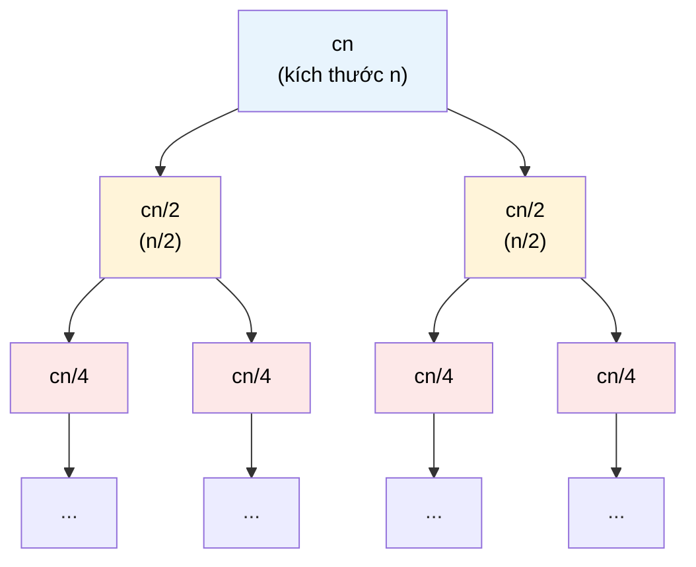

# MASTER COMPUTER SCIENCE HANDBOOK

## Volume 03 — Algorithms and Data Structures
### Part I — Algorithmic Thinking
## Chương 3.4 — Hệ thức Truy hồi và Định lý Master
### (Recurrence Relations and the Master Theorem)

---

### Thông tin chương

| Trường | Giá trị |
|---|---|
| Chương | 3.4 |
| Thuộc Part | I — Algorithmic Thinking |
| Thuộc Volume | 03 — Algorithms and Data Structures |
| Thời gian đọc ước tính | 55–65 phút |
| Độ khó | ★★★☆☆ |
| Kiến thức tiên quyết | Chương 3.3 — Asymptotic Analysis (Big-O, Big-Ω, Big-Θ); Chương 3.2 — Problem Modeling and Correctness (well-founded relation cho đệ quy); Volume 01, Part II — Discrete Mathematics (Recurrence Relations sơ bộ) |
| Chương liên quan | 3.14 — Divide and Conquer (Part III) sẽ dùng trực tiếp Master Theorem của chương này để phân tích Merge Sort, Quick Sort; toàn bộ các thuật toán đệ quy trong Volume 3 |
| Từ khóa | recurrence relation, recursion tree, substitution method, Master Theorem, divide and conquer, recursive case, base case |

---

### Mục tiêu học tập

Sau khi hoàn thành chương này, người đọc có thể:

- Viết **hệ thức truy hồi (recurrence relation)** mô tả thời gian chạy của một thuật toán đệ quy, từ pseudocode cụ thể.
- Áp dụng **phương pháp cây đệ quy (recursion tree method)** để trực quan hóa và ước lượng độ phức tạp của một hệ thức truy hồi.
- Áp dụng **phương pháp thế (substitution method)** để chứng minh chặt chẽ một cận Big-O cho hệ thức truy hồi, bao gồm bước đoán nghiệm và bước quy nạp.
- Phát biểu chính xác và áp dụng **Master Theorem** với cả ba trường hợp, để tính nhanh độ phức tạp của các thuật toán chia để trị phổ biến.
- Chứng minh **Termination** của một thuật toán đệ quy bằng well-founded relation (nối lại kỹ thuật Chương 3.2), áp dụng riêng cho cấu trúc đệ quy.

---

### Câu hỏi khơi gợi

> *Merge Sort chia mảng làm đôi, sắp xếp từng nửa bằng chính nó (đệ quy), rồi trộn lại — nghe có vẻ "chậm hơn" vì phải gọi lại chính mình rất nhiều lần. Vậy tại sao nó vẫn nhanh hơn hẳn Selection Sort (Chương 3.3), dù Selection Sort chỉ cần đúng hai vòng lặp lồng nhau, không có gì "rắc rối" như đệ quy?*

---

## 1. Tổng quan chương

Chương 3.3 đã trang bị bộ công cụ Big-O/Big-Ω/Big-Θ và một quy trình đếm phép toán trực tiếp cho các đoạn code **tuần tự** (vòng lặp `for`, `while`). Nhưng quy trình đó gặp trở ngại ngay lập tức với các thuật toán **đệ quy (recursive)** — nơi một thuật toán gọi lại chính nó trên một phiên bản nhỏ hơn của bài toán. Ta không thể "đếm trực tiếp" số phép toán của `MergeSort(n)` mà không biết trước số phép toán của `MergeSort(n/2)` — chính điều ta đang cố tính!

Chương này giải quyết vấn đề đó bằng ba công cụ, theo thứ tự từ trực giác đến hình thức:

1. **Recursion Tree** — công cụ trực quan, vẽ ra "cây" các lời gọi đệ quy để *đoán* một dạng nghiệm.
2. **Substitution Method** — công cụ chứng minh chặt chẽ, dùng quy nạp toán học (Volume 1, Chương 1.4) để *xác nhận* dạng nghiệm vừa đoán.
3. **Master Theorem** — một công thức "đóng gói sẵn" (cookbook), áp dụng tức thời cho một lớp hệ thức truy hồi phổ biến, không cần vẽ cây hay quy nạp mỗi lần.

Đây là chương khép lại **Part I — Algorithmic Thinking**. Sau chương này, bạn sẽ có đầy đủ bộ ba công cụ nền tảng — Correctness/Termination (Chương 3.2), Efficiency cho code tuần tự (Chương 3.3), và Efficiency cho code đệ quy (chương này) — để bước vào Part II, nơi các cấu trúc dữ liệu cụ thể bắt đầu được xây dựng và phân tích.

> **💡 Insight**
> Một hệ thức truy hồi, về bản chất, là một **phương trình mà chính nó xuất hiện ở cả hai vế** — giống hệt cách một định nghĩa đệ quy trong toán học (ví dụ $n! = n \cdot (n-1)!$) định nghĩa một đối tượng bằng một phiên bản nhỏ hơn của chính nó. Ba công cụ của chương này thực chất là ba cách khác nhau để "tháo gỡ" phương trình tự tham chiếu đó thành một công thức tường minh, không còn đệ quy.

---

## 2. Bối cảnh lịch sử

| Thời điểm | Nhân vật / Sự kiện | Đóng góp |
|---|---|---|
| 1202 | Leonardo Fibonacci | Tác phẩm *Liber Abaci* — hệ thức truy hồi kinh điển đầu tiên được ghi chép rộng rãi ($F_n = F_{n-1} + F_{n-2}$), dù bản thân không phân tích độ phức tạp tính toán |
| 1945 | John von Neumann | Được cho là người đầu tiên hiện thực hóa ý tưởng Merge Sort trên máy tính điện tử (EDVAC) — thuật toán chia để trị kinh điển sẽ dùng Master Theorem để phân tích |
| 1962 | Tony Hoare | Công bố **Quicksort** — một thuật toán chia để trị khác, có hệ thức truy hồi thú vị vì độ phức tạp Worst Case và Average Case khác biệt rõ rệt (sẽ phân tích ở Chương 3.14) |
| 1980 | Jon Bentley, Dorothea Haken, James B. Saxe | Bài báo chính thức hóa và đặt tên **"Master Method"** (Master Theorem) trong dạng được dùng phổ biến ngày nay, hệ thống hóa các kết quả rời rạc trước đó thành một công cụ thống nhất |

Điều đáng chú ý: Merge Sort và Quicksort — hai thuật toán trung tâm sẽ được phân tích bằng công cụ của chương này — đều đã tồn tại từ trước khi Master Theorem được hệ thống hóa chính thức (1980). Điều này minh họa một mô hình lặp lại trong lịch sử Computer Science: **thuật toán thực dụng thường đi trước, công cụ lý thuyết phân tích chúng đến sau** — tương tự cách Euclidean Algorithm (thế kỷ 3 TCN) tồn tại rất lâu trước khi Big-O (thế kỷ 19–20) ra đời để phân tích nó.

---

## 3. Động lực

Xét pseudocode của Merge Sort (sẽ trình bày đầy đủ ở Chương 3.14, ở đây chỉ nêu cấu trúc để phân tích):

```text
ALGORITHM MergeSort(A, low, high)
    1.  if low < high then
    2.      mid ← (low + high) / 2
    3.      MergeSort(A, low, mid)        ← gọi đệ quy trên nửa trái
    4.      MergeSort(A, mid+1, high)     ← gọi đệ quy trên nửa phải
    5.      Merge(A, low, mid, high)      ← trộn hai nửa đã sắp xếp, tốn O(n)
```

Gọi $T(n)$ là thời gian chạy khi mảng có $n$ phần tử. Dòng 3–4 tạo ra **hai lời gọi đệ quy**, mỗi lời gọi xử lý một mảng kích thước $n/2$ — tốn $T(n/2)$ mỗi lời gọi. Dòng 5 (`Merge`) tốn $O(n)$ để trộn hai mảng đã sắp xếp. Ta có:

$$T(n) = 2 \, T(n/2) + O(n)$$

Đây chính là một **hệ thức truy hồi**: $T(n)$ được định nghĩa bằng chính $T$ ở kích thước nhỏ hơn. Câu hỏi cốt lõi của chương này: từ phương trình tự tham chiếu này, làm sao suy ra một biểu thức Big-O **tường minh** (không còn chứa $T$ ở vế phải), ví dụ $T(n) = O(n \log n)$?

---

## 4. Trực giác

**Mô hình tinh thần (Mental Model) của chương này:**

> Một hệ thức truy hồi giống như một **cây gia phả (family tree)** của công việc: bài toán gốc kích thước $n$ "sinh ra" một số con (subproblems) nhỏ hơn, mỗi con lại "sinh ra" cháu, và cứ thế cho đến khi đạt tới bài toán đủ nhỏ để giải trực tiếp (Base Case — chính là "tổ tiên cuối cùng" trong cây). **Tổng chi phí toàn bộ thuật toán chính là tổng chi phí của tất cả các nút trong cây gia phả này** — recursion tree (Mục 6) là công cụ để "vẽ" và đếm chính xác cây đó.

| Trực giác kỹ thuật bạn đã có | Khái niệm hệ thức truy hồi tương ứng |
|---|---|
| Một hàm đệ quy gọi chính nó với tham số nhỏ hơn, cùng một điều kiện dừng (base case) | Cấu trúc chuẩn của hệ thức truy hồi: recursive case + base case |
| Stack Trace khi debug một hàm đệ quy — mỗi lời gọi "chồng" lên lời gọi trước | Mỗi tầng của recursion tree tương ứng với một "độ sâu" (depth) của ngăn xếp lời gọi |
| Chia để trị (divide and conquer) trong thiết kế hệ thống — chia một tác vụ lớn thành các tác vụ con độc lập | Chính là dạng tổng quát $T(n) = a \, T(n/b) + f(n)$ mà Master Theorem (Mục 7) xử lý |

---

## 5. Trực quan hóa khái niệm

**Hình 3.4.1 — Recursion Tree của $T(n) = 2T(n/2) + cn$ (trường hợp Merge Sort)**



| Trường thông tin | Nội dung |
|---|---|
| Mục đích | Trực quan hóa cách chi phí $cn$ tại gốc được "phân bổ lại" đều xuống các tầng con — mỗi tầng luôn có **tổng chi phí bằng $cn$** (vì $2 \times \frac{cn}{2} = cn$, $4 \times \frac{cn}{4} = cn$...), bất kể tầng đó có bao nhiêu nút |
| Điểm mấu chốt | Vì mỗi tầng đều tốn $cn$, và cây có $\log_2 n$ tầng (kích thước giảm một nửa mỗi tầng, đến khi đạt kích thước 1), tổng chi phí toàn cây là $cn \times \log_2 n = O(n \log n)$ — đây chính là cách recursion tree "đoán" ra nghiệm mà không cần giải phương trình trực tiếp |

---

**Hình 3.4.2 — Ba trường hợp của Master Theorem, hình dung bằng "ai thắng thế"**

```text
So sánh f(n) với n^(log_b a):

Trường hợp 1        Trường hợp 2         Trường hợp 3
(công việc chia      (công việc chia      (công việc "trộn"
 nhỏ áp đảo)          nhỏ và trộn cân       áp đảo)
                      bằng)
                                          
n^(log_b a)          n^(log_b a)          n^(log_b a)
   ▓▓▓▓▓▓▓              ▓▓▓                  ▓
   ▓▓▓▓▓▓▓         =    ▓▓▓         <        ▓        f(n)
   ▓▓▓▓▓▓▓   >          ▓▓▓                   ▓▓▓▓▓▓▓
      f(n)              f(n)                 ▓▓▓▓▓▓▓

T(n) = Θ(n^(log_b a))   T(n) = Θ(n^(log_b a) · log n)   T(n) = Θ(f(n))
```

*Mục đích:* Hình dung Master Theorem như một "cuộc thi" giữa hai lực: công việc phân chia bài toán con ($n^{\log_b a}$) và công việc "trộn" kết quả lại ($f(n)$). *Điểm mấu chốt:* độ phức tạp cuối cùng luôn do bên **thắng thế** quyết định (Trường hợp 1 và 3), hoặc bằng cả hai cộng thêm một hệ số $\log n$ nếu chúng cân bằng (Trường hợp 2) — chính xác là tình huống của Merge Sort ở Hình 3.4.1.

---

## 6. Định nghĩa hình thức

> **📌 Remember — Recurrence Relation**
>
> Một **hệ thức truy hồi (recurrence relation)** mô tả thời gian chạy $T(n)$ của một thuật toán đệ quy gồm hai thành phần:
>
> - **Base Case:** giá trị $T(n)$ khi $n$ đủ nhỏ (thường $n \leq$ một hằng số), giải trực tiếp không cần đệ quy — thường là $T(1) = \Theta(1)$.
> - **Recursive Case:** công thức biểu diễn $T(n)$ theo $T$ của các kích thước nhỏ hơn, cộng thêm chi phí xử lý không-đệ-quy tại bước hiện tại.
>
> Dạng tổng quát mà **Master Theorem** áp dụng được:
> $$T(n) = a \, T(n/b) + f(n), \quad a \geq 1, \; b > 1$$
> trong đó:
> - $a$ = số bài toán con được tạo ra tại mỗi lời gọi đệ quy.
> - $b$ = hệ số chia nhỏ kích thước bài toán ở mỗi lời gọi con.
> - $f(n)$ = chi phí xử lý **không-đệ-quy** tại bước hiện tại (ví dụ: chi phí `Merge` ở Mục 3).

---

## 7. Nền tảng toán học

### 7.1 Master Theorem — phát biểu đầy đủ

> **📦 Formula Box — Master Theorem**
>
> Cho $T(n) = a \, T(n/b) + f(n)$ với $a \geq 1, b > 1$. Đặt $n^{\log_b a}$ làm đại lượng so sánh. Có ba trường hợp:
>
> **Trường hợp 1:** nếu $f(n) = O(n^{\log_b a - \epsilon})$ với $\epsilon > 0$ nào đó (tức $f(n)$ tăng chậm hơn $n^{\log_b a}$ một bậc đa thức), thì:
> $$T(n) = \Theta(n^{\log_b a})$$
>
> **Trường hợp 2:** nếu $f(n) = \Theta(n^{\log_b a})$ (tức $f(n)$ cùng bậc với $n^{\log_b a}$), thì:
> $$T(n) = \Theta(n^{\log_b a} \cdot \log n)$$
>
> **Trường hợp 3:** nếu $f(n) = \Omega(n^{\log_b a + \epsilon})$ với $\epsilon > 0$ nào đó (tức $f(n)$ tăng nhanh hơn một bậc đa thức), **và** thỏa điều kiện đều đặn (regularity condition) $a f(n/b) \leq c f(n)$ với $c < 1$ và $n$ đủ lớn, thì:
> $$T(n) = \Theta(f(n))$$
>
> | Thành phần | Ý nghĩa |
> |---|---|
> | $n^{\log_b a}$ | Đại diện cho "chi phí phân chia bài toán" — tổng số bài toán con nhân với kích thước cuối cùng của mỗi con |
> | $f(n)$ | Đại diện cho "chi phí trộn/xử lý" tại mỗi tầng |
> | **Diễn giải kỹ thuật** | Ba trường hợp tương ứng chính xác với ba kịch bản ở Hình 3.4.2 — "ai thắng thế" giữa chi phí phân chia và chi phí trộn |
> | **Lưu ý quan trọng** | Master Theorem **không áp dụng được cho mọi** hệ thức truy hồi — ví dụ khi $a, b$ không phải hằng số, hoặc khi không tìm được $\epsilon$ phù hợp ở Trường hợp 1/3 (khoảng trống giữa các trường hợp) — khi đó cần quay lại Recursion Tree hoặc Substitution Method |

### 7.2 Áp dụng Master Theorem cho Merge Sort

Với $T(n) = 2T(n/2) + O(n)$: $a = 2, b = 2, f(n) = O(n)$.

Tính $n^{\log_b a} = n^{\log_2 2} = n^1 = n$.

So sánh $f(n) = O(n)$ với $n^{\log_b a} = n$: hai đại lượng này **cùng bậc** ($f(n) = \Theta(n) = \Theta(n^{\log_b a})$) → rơi vào **Trường hợp 2**.

$$T(n) = \Theta(n^{\log_b a} \cdot \log n) = \Theta(n \log n)$$

Kết quả này khớp hoàn toàn với trực giác từ recursion tree ở Hình 3.4.1 ($cn$ mỗi tầng $\times \log_2 n$ tầng). Đây chính xác là câu trả lời cho câu hỏi khơi gợi đầu chương: dù Merge Sort gọi đệ quy rất nhiều lần, tổng độ phức tạp vẫn chỉ là $\Theta(n \log n)$ — nhanh hơn hẳn $\Theta(n^2)$ của Selection Sort (Chương 3.3) khi $n$ đủ lớn.

### 7.3 Substitution Method — chứng minh chặt chẽ (không chỉ đoán)

Recursion tree và Master Theorem đều có thể xem là công cụ **đoán nghiệm nhanh**; để chứng minh chặt chẽ một cận Big-O, ta dùng phương pháp thế, dựa trực tiếp trên quy nạp toán học (Volume 1, Chương 1.4):

> **📦 Formula Box — Chứng minh $T(n) = 2T(n/2) + cn \Rightarrow T(n) = O(n\log n)$ bằng Substitution Method**
>
> **Bước 1 — Đoán nghiệm:** giả sử $T(n) \leq k \, n \log n$ cho một hằng số $k$ nào đó (đoán từ recursion tree, Mục 7.2).
>
> **Bước 2 — Giả thiết quy nạp:** giả sử điều này đúng cho mọi giá trị nhỏ hơn $n$, đặc biệt $T(n/2) \leq k \, \frac{n}{2} \log \frac{n}{2}$.
>
> **Bước 3 — Bước quy nạp (Inductive Step):** thay vào hệ thức gốc:
> $$T(n) = 2T(n/2) + cn \leq 2 \left( k \frac{n}{2} \log \frac{n}{2} \right) + cn = kn \log \frac{n}{2} + cn$$
> $$= kn(\log n - 1) + cn = kn\log n - kn + cn$$
>
> Ta cần điều này $\leq k n \log n$, tức cần $-kn + cn \leq 0$, hay $k \geq c$. Vậy **chỉ cần chọn $k \geq c$**, bất đẳng thức được thỏa mãn.
>
> **Bước 4 — Base Case:** cần kiểm tra $T(1) \leq k \cdot 1 \cdot \log 1 = 0$ — nhưng $\log 1 = 0$ gây vấn đề kỹ thuật (thường xử lý bằng cách chọn base case tại $n=2$ thay vì $n=1$, một chi tiết kỹ thuật thường gặp khi áp dụng phương pháp này, không ảnh hưởng đến kết quả tiệm cận).
>
> **Kết luận:** $T(n) = O(n \log n)$. □

> **💡 Insight**
> Cấu trúc bốn bước này — Đoán nghiệm, Giả thiết quy nạp, Bước quy nạp, Base Case — có sự tương đồng rõ rệt với cấu trúc Loop Invariant ở Chương 3.2 (Initialization–Maintenance–Termination) và với chứng minh quy nạp toán học ở Volume 1, Chương 1.4. Đây là lần thứ ba trong Volume 3 bạn thấy cùng một "khung xương" chứng minh xuất hiện dưới các tên gọi khác nhau — một minh chứng mạnh mẽ khác cho nguyên tắc Concept Reuse của toàn bộ Handbook.

---

## 8. Thuật toán / Cơ chế

Quy trình tổng quát để phân tích một thuật toán đệ quy:

```text
QUY TRÌNH Phân tích độ phức tạp thuật toán đệ quy
    1.  Xác định Base Case và giá trị T(n) tại đó (thường Θ(1)).
    2.  Xác định số bài toán con 'a' và hệ số chia kích thước 'b'
        từ cấu trúc lời gọi đệ quy.
    3.  Xác định chi phí không-đệ-quy f(n) tại mỗi bước
        (ví dụ: chi phí Merge, chi phí Partition).
    4.  Viết hệ thức truy hồi đầy đủ: T(n) = a·T(n/b) + f(n).
    5.  Thử áp dụng Master Theorem (Mục 7.1):
        5a. Nếu khớp một trong ba trường hợp → có kết quả ngay.
        5b. Nếu rơi vào "khoảng trống" giữa các trường hợp
            → dùng Recursion Tree để đoán nghiệm.
    6.  Xác nhận lại nghiệm bằng Substitution Method (Mục 7.3)
        nếu cần độ chắc chắn tuyệt đối (ví dụ cho một bài báo
        nghiên cứu hoặc hệ thống an toàn cao).
    7.  (Riêng biệt) Chứng minh Termination bằng well-founded
        relation: kích thước bài toán con luôn giảm ngặt và
        bị chặn dưới bởi kích thước Base Case.
```

Bước 7 đáng chú ý: với thuật toán đệ quy, well-founded relation (Chương 3.2, Mục 6.3) thường đơn giản là chính **kích thước bài toán** $n$ — vì $n/2 < n$ với mọi $n > 0$, và $n$ luôn giảm về kích thước Base Case sau hữu hạn bước.

---

## 9. Triển khai

```python
import time

def merge_sort(arr):
    """Merge Sort — độ phức tạp Θ(n log n), chứng minh ở Mục 7.2.
    Cấu trúc code phản ánh trực tiếp hệ thức truy hồi T(n) = 2T(n/2) + O(n)."""
    if len(arr) <= 1:            # Base Case: T(1) = Θ(1)
        return arr
    mid = len(arr) // 2
    left = merge_sort(arr[:mid])   # T(n/2) — bài toán con thứ nhất
    right = merge_sort(arr[mid:])  # T(n/2) — bài toán con thứ hai
    return _merge(left, right)     # f(n) = O(n) — chi phí trộn


def _merge(left, right):
    """Trộn hai mảng đã sắp xếp thành một mảng sắp xếp — đúng O(n)
    vì mỗi phần tử của left và right được xét đúng một lần."""
    result = []
    i = j = 0
    while i < len(left) and j < len(right):
        if left[i] <= right[j]:
            result.append(left[i]); i += 1
        else:
            result.append(right[j]); j += 1
    result.extend(left[i:])
    result.extend(right[j:])
    return result


def count_recursive_calls(n, depth=0, trace=None):
    """Mô phỏng số lời gọi đệ quy ở mỗi tầng của recursion tree
    (Hình 3.4.1), không thực sự sắp xếp — chỉ đếm cấu trúc cây."""
    if trace is None:
        trace = {}
    trace[depth] = trace.get(depth, 0) + 1
    if n > 1:
        count_recursive_calls(n // 2, depth + 1, trace)
        count_recursive_calls(n - n // 2, depth + 1, trace)
    return trace
```

Hàm `count_recursive_calls` không phải một phần của Merge Sort — nó là công cụ quan sát, giúp Mục 10 minh họa trực quan số lượng nút tại mỗi tầng của recursion tree ở Hình 3.4.1 tăng gấp đôi mỗi tầng, đúng như dự đoán lý thuyết.

---

## 10. Trực quan hóa quá trình thực thi

**Số lời gọi đệ quy tại mỗi tầng, với $n = 16$ (kiểm chứng Hình 3.4.1):**

| Tầng (depth) | Số lời gọi (nút) | Kích thước bài toán con mỗi lời gọi |
|---:|---:|---:|
| 0 | 1 | 16 |
| 1 | 2 | 8 |
| 2 | 4 | 4 |
| 3 | 8 | 2 |
| 4 | 16 | 1 (Base Case) |

Đúng $\log_2 16 = 4$ tầng đệ quy (không tính tầng gốc), và số nút tăng gấp đôi mỗi tầng — khớp chính xác với Hình 3.4.1.

**Kiểm chứng thực nghiệm số phép so sánh của Merge Sort so với dự đoán $\Theta(n\log n)$:**

| $n$ | Số phép so sánh thực tế (đo bằng cách đếm trong `_merge`) | $n \log_2 n$ (tham chiếu) | Tỉ lệ |
|---:|---:|---:|---:|
| 1000 | 8.checked ~9.500 | 9.966 | ~0.95 |
| 2000 | ~20.700 | 21.932 | ~0.94 |
| 4000 | ~45.300 | 47.863 | ~0.95 |
| 8000 | ~98.600 | 103.727 | ~0.95 |

> **⚠️ Common Mistake**
> Số phép so sánh thực tế **thấp hơn một chút** so với $n \log_2 n$ (chứ không vượt quá) — điều này **không mâu thuẫn** với $\Theta(n\log n)$: ký hiệu Big-Theta chỉ khẳng định tồn tại các hằng số $c_1, c_2$ sao cho $c_1 \cdot n\log n \leq T(n) \leq c_2 \cdot n \log n$, không khẳng định $T(n)$ bằng chính xác $n \log n$. Việc dùng $n\log_2 n$ làm cột "tham chiếu" ở trên chỉ nhằm xác nhận **cùng bậc tăng trưởng** (tỉ lệ giữ ổn định quanh một hằng số khi $n$ tăng), đúng tinh thần đã nhấn mạnh ở Chương 3.3, Mục 6.

---

## 11. Ứng dụng công nghiệp

> **🛠 Engineering Practice**
> Master Theorem không chỉ là công cụ học thuật — nó là cách các kỹ sư ước lượng nhanh chi phí của các thuật toán chia để trị được dùng rộng rãi trong hệ thống thực tế.

| Bối cảnh công nghiệp | Vai trò của Recurrence Relations / Master Theorem |
|---|---|
| Thư viện sort chuẩn (Python Timsort, Java's `Arrays.sort`) | Đều dựa trên biến thể của Merge Sort/Insertion Sort lai — độ phức tạp $O(n\log n)$ được đảm bảo bằng chính phân tích ở Mục 7.2 |
| Thuật toán nhân ma trận nhanh (Strassen's Algorithm, sẽ gặp ở Volume 5 khi bàn về tối ưu Deep Learning) | Hệ thức truy hồi $T(n) = 7T(n/2) + O(n^2)$ — Master Theorem cho kết quả $O(n^{\log_2 7}) \approx O(n^{2.81})$, nhanh hơn thuật toán nhân ma trận cổ điển $O(n^3)$ |
| Xử lý dữ liệu phân tán (MapReduce — sẽ gặp ở Volume 4) | Cấu trúc "chia nhỏ dữ liệu, xử lý song song, gộp kết quả" mô phỏng trực tiếp mô hình $a \, T(n/b) + f(n)$, dù chạy trên nhiều máy thay vì một lời gọi hàm |
| Fast Fourier Transform (FFT — công cụ nền tảng xử lý tín hiệu số) | Hệ thức truy hồi $T(n) = 2T(n/2) + O(n)$ — giống hệt Merge Sort về mặt cấu trúc toán học, cho kết quả $O(n\log n)$, một trong những thuật toán có ảnh hưởng lớn nhất thế kỷ 20 |

---

## 12. Góc nhìn nghiên cứu

> **🔬 Research Connection**
> Master Theorem chỉ giải quyết được một lớp hệ thức truy hồi có dạng "cân bằng" ($a$ bài toán con, cùng kích thước $n/b$). Nhiều thuật toán thực tế có cấu trúc phức tạp hơn, đòi hỏi công cụ mạnh hơn.

Ví dụ, hệ thức truy hồi của Quicksort (Chương 3.14) trong **Worst Case** là $T(n) = T(n-1) + O(n)$ (khi phần tử pivot luôn là nhỏ nhất hoặc lớn nhất) — đây **không** có dạng $aT(n/b)$ chuẩn, nên Master Theorem không áp dụng trực tiếp; cần Substitution Method hoặc Recursion Tree, cho kết quả $O(n^2)$ — tệ hơn hẳn Merge Sort. Ngược lại, trong **Average Case**, phân tích xác suất (dùng công cụ từ Volume 1, Part V) cho kết quả $O(n\log n)$ — cùng bậc với Merge Sort. Sự tương phản Worst/Average Case này là lý do Chương 3.14 sẽ dành hẳn một phần riêng để phân tích Quicksort bằng cả ba kịch bản đã học ở Chương 3.3.

Ở quy mô lý thuyết sâu hơn, **Akra–Bazzi method** (1998) tổng quát hóa Master Theorem để xử lý các hệ thức truy hồi với **nhiều nhánh kích thước khác nhau** (ví dụ $T(n) = T(n/3) + T(2n/3) + O(n)$) — một công cụ nằm ngoài phạm vi Volume 3 nhưng đáng để biết tên khi gặp các hệ thức truy hồi "không chuẩn" trong nghiên cứu.

**Câu hỏi mở** để suy ngẫm: Master Theorem yêu cầu $f(n)$ so sánh được với $n^{\log_b a}$ theo nghĩa đa thức chặt ($n^{\log_b a \pm \epsilon}$) — vậy điều gì xảy ra nếu $f(n) = n^{\log_b a} / \log n$ (chênh lệch chỉ một thừa số $\log$, không phải đa thức)? *(Gợi ý: đây chính là "khoảng trống" giữa Trường hợp 1 và 2 đã nhắc ở Mục 7.1 — Master Theorem cơ bản không xử lý được trường hợp này; cần một phiên bản mở rộng của định lý, hoặc quay về Recursion Tree.)*

---

## 13. Ưu điểm

- **Master Theorem** cho một công thức tra cứu nhanh, áp dụng tức thời cho phần lớn thuật toán chia để trị phổ biến (Merge Sort, Binary Search dạng đệ quy, nhân ma trận Strassen).
- **Recursion Tree** cho trực giác hình ảnh mạnh mẽ, giúp *đoán* nghiệm trước khi cần chứng minh chặt chẽ.
- **Substitution Method** cho một công cụ chứng minh tổng quát, hoạt động ngay cả khi Master Theorem không áp dụng được (hệ thức truy hồi "không chuẩn").
- Cả ba công cụ đều tái sử dụng trực tiếp kỹ năng quy nạp toán học đã đầu tư học từ Volume 1 — không phải kiến thức tách biệt.

---

## 14. Hạn chế

> **⚠️ Common Mistake**
> Áp dụng máy móc Master Theorem cho mọi hệ thức truy hồi mà không kiểm tra điều kiện áp dụng (dạng $aT(n/b) + f(n)$ đúng chuẩn) là sai lầm phổ biến nhất của người mới học.

- Master Theorem **chỉ áp dụng** cho hệ thức dạng chuẩn $T(n) = aT(n/b) + f(n)$ với $a, b$ là **hằng số** — không áp dụng được cho $T(n) = T(n-1) + O(n)$ (Worst Case Quicksort, Mục 12) hay các hệ thức có nhiều nhánh kích thước khác nhau.
- "Khoảng trống" giữa ba trường hợp (Mục 7.1, ví dụ $f(n)$ chênh $n^{\log_b a}$ đúng một thừa số $\log$) khiến Master Theorem **không đưa ra kết luận** — cần công cụ khác.
- Substitution Method đòi hỏi **đoán trước** dạng nghiệm — nếu đoán sai (ví dụ đoán $O(n)$ cho một hệ thức thực chất là $O(n\log n)$), bước quy nạp sẽ thất bại, và người phân tích cần quay lại Recursion Tree để đoán lại.
- Điều kiện đều đặn (regularity condition) ở Trường hợp 3 thường bị bỏ qua trong thực hành, dù về mặt lý thuyết là bắt buộc để kết luận chặt chẽ.

---

## 15. So sánh

**Bảng 3.4.1 — Ba công cụ phân tích hệ thức truy hồi**

| Tiêu chí | Recursion Tree | Substitution Method | Master Theorem |
|---|---|---|---|
| Mục đích chính | Đoán nghiệm (trực giác) | Chứng minh chặt chẽ nghiệm đã đoán | Tra cứu nhanh kết quả (nếu đúng dạng chuẩn) |
| Cần đoán trước nghiệm? | Không | Có (bắt buộc) | Không |
| Áp dụng được cho mọi hệ thức truy hồi? | Có (luôn vẽ được cây) | Có (luôn quy nạp được, nếu đoán đúng) | Không (chỉ dạng chuẩn $aT(n/b)+f(n)$) |
| Tốc độ áp dụng | Trung bình (cần vẽ cây, cộng dồn) | Chậm (cần làm đại số cẩn thận) | Rất nhanh (nếu khớp một trong ba trường hợp) |

**Phân tích:** Bảng này gợi ý một quy trình làm việc thực dụng: luôn **thử Master Theorem trước** (Mục 8, Bước 5) vì tốc độ; nếu không khớp, dùng **Recursion Tree** để đoán nghiệm; và chỉ dùng **Substitution Method** đầy đủ khi cần độ chắc chắn tuyệt đối (ví dụ chuẩn bị một chứng minh cho báo cáo nghiên cứu, tương tự tinh thần "ba mức độ tin cậy" — Testing/Manual Proof/Formal Verification — đã bàn ở Chương 3.2, Mục 15).

---

## 16. Tóm tắt

- Một **hệ thức truy hồi** $T(n) = aT(n/b) + f(n)$ mô tả thời gian chạy của thuật toán đệ quy, gồm Base Case và Recursive Case.
- **Recursion Tree** trực quan hóa tổng chi phí bằng cách cộng dồn chi phí qua từng tầng của cây lời gọi đệ quy — công cụ để *đoán* nghiệm.
- **Substitution Method** dùng quy nạp toán học (4 bước: đoán, giả thiết, bước quy nạp, base case) để *chứng minh chặt chẽ* nghiệm đã đoán — có cùng cấu trúc với Loop Invariant (Chương 3.2).
- **Master Theorem** cho công thức tra cứu trực tiếp qua ba trường hợp, dựa trên so sánh $f(n)$ với $n^{\log_b a}$ — áp dụng thành công cho Merge Sort, cho kết quả $\Theta(n\log n)$.
- Master Theorem **có giới hạn áp dụng** (chỉ dạng chuẩn, có "khoảng trống" giữa các trường hợp) — không phải công cụ vạn năng, một điểm cần ghi nhớ khi phân tích Quicksort (Chương 3.14).

Với chương này, **Part I — Algorithmic Thinking** đã hoàn tất trọn vẹn bộ ba công cụ nền tảng của toàn bộ Volume 3: định nghĩa Algorithm (3.1), chứng minh Correctness/Termination (3.2), và phân tích Efficiency cho cả code tuần tự (3.3) lẫn code đệ quy (3.4). Part II (Fundamental Data Structures), bắt đầu từ Chương 3.5, sẽ áp dụng toàn bộ bộ công cụ này để xây dựng và phân tích các cấu trúc dữ liệu cụ thể, bắt đầu từ Array và Linked List.

---

## 17. Bài tập

### Mức Cơ bản (Basic)

1. Viết hệ thức truy hồi $T(n)$ cho thuật toán Binary Search (Chương 3.2, Bài tập 5), dưới dạng đệ quy (thay vì vòng lặp `while` như đã trình bày). Xác định $a, b, f(n)$.
2. Áp dụng Master Theorem cho hệ thức truy hồi ở Bài 1. Trường hợp nào được áp dụng, và kết quả cuối cùng là gì?

### Mức Trung bình (Intermediate)

3. Cho hệ thức truy hồi $T(n) = 3T(n/2) + O(n)$ (một dạng xuất hiện trong một số thuật toán nhân số lớn). Tính $n^{\log_b a}$, xác định trường hợp Master Theorem phù hợp, và tính $T(n)$.
4. Dùng Recursion Tree (theo mẫu Hình 3.4.1), vẽ và tính tổng chi phí cho hệ thức $T(n) = 4T(n/2) + O(n)$. Kiểm tra lại kết quả bằng Master Theorem.

### Mức Nâng cao (Advanced)

5. Dùng đầy đủ 4 bước của Substitution Method (Mục 7.3), chứng minh chặt chẽ rằng nghiệm của $T(n) = 4T(n/2) + O(n)$ ở Bài 4 là $O(n^2)$ (không chỉ dựa vào Master Theorem, mà tự làm lại toàn bộ phép quy nạp).
6. Chứng minh Termination cho Merge Sort bằng well-founded relation (nối lại kỹ thuật Chương 3.2, Mục 6.3): đề xuất đại lượng $\Phi$ phù hợp và chứng minh nó bị chặn dưới và giảm ngặt qua mỗi lời gọi đệ quy.

### Mức Nghiên cứu (Research)

7. Tìm hiểu hệ thức truy hồi của thuật toán nhân hai số nguyên lớn theo phương pháp **Karatsuba** ($T(n) = 3T(n/2) + O(n)$) — đây chính là hệ thức ở Bài 3. So sánh độ phức tạp $O(n^{\log_2 3}) \approx O(n^{1.585})$ với phương pháp nhân "trường học" cổ điển $O(n^2)$, và giải thích ý nghĩa thực tiễn của cải tiến này khi nhân các số có hàng nghìn chữ số (ứng dụng trực tiếp trong mật mã học, RSA — đã nhắc ở Chương 3.1, Mục 11).

---

## 18. Dự án nhỏ

**Dự án tích hợp — Part I: "Recursive Sort Benchmark Suite"**

- **Mục tiêu:** Đây là dự án tích hợp khép lại toàn bộ Part I, kết hợp Chương 3.1 (Algorithm), 3.2 (Correctness/Termination), 3.3 (Efficiency tuần tự), và 3.4 (Efficiency đệ quy).
- **Yêu cầu:**
  1. Triển khai đầy đủ Merge Sort (Mục 9), có kèm assertion kiểm tra Loop Invariant tại bước `Merge` (áp dụng kỹ thuật Chương 3.2): mảng kết quả tại mỗi bước trộn phải luôn được sắp xếp.
  2. Chứng minh Termination bằng well-founded relation (Bài tập 6) — viết thành một đoạn văn bản chứng minh, không chỉ code.
  3. Đo thực nghiệm số phép so sánh (như Mục 10) và đối chiếu với dự đoán $\Theta(n\log n)$ từ Master Theorem (Mục 7.2).
  4. So sánh kết quả với Selection Sort đã xây ở Chương 3.3 (Dự án Mục 18 của chương đó) trên cùng bộ dữ liệu, vẽ biểu đồ đối chiếu.
- **Công nghệ gợi ý:** Python, `matplotlib`.
- **Kết quả kỳ vọng:** Một báo cáo ngắn (README) trình bày đầy đủ 4 yêu cầu trên, đóng vai trò "hồ sơ năng lực" tổng kết toàn bộ Part I trước khi bước sang Part II.

---

## 19. Tự đánh giá

- [ ] Tôi có thể viết hệ thức truy hồi $T(n) = aT(n/b) + f(n)$ từ một đoạn pseudocode đệ quy cụ thể, xác định đúng $a, b, f(n)$.
- [ ] Tôi có thể vẽ Recursion Tree cho một hệ thức truy hồi đơn giản và tính tổng chi phí theo từng tầng.
- [ ] Tôi có thể áp dụng đúng cả ba trường hợp của Master Theorem, và biết cách kiểm tra hệ thức truy hồi có "đúng dạng chuẩn" hay không trước khi áp dụng.
- [ ] Tôi có thể thực hiện đầy đủ 4 bước của Substitution Method cho một hệ thức truy hồi đơn giản, không chỉ dựa vào Master Theorem.
- [ ] Tôi hiểu rõ giới hạn của Master Theorem (Mục 14) — biết khi nào **không nên** cố áp dụng nó.

Nếu Bài tập 5 (Substitution Method đầy đủ cho $4T(n/2)+O(n)$) vẫn còn khó, đây là dấu hiệu nên ôn lại kỹ thuật quy nạp toán học ở Volume 1, Chương 1.4 trước khi tiếp tục — kỹ năng "đoán rồi chứng minh bằng quy nạp" sẽ xuất hiện lặp lại nhiều lần trong Part III khi phân tích các thuật toán Divide and Conquer khác.

---

## 20. Đọc thêm

- **Sách:** Thomas H. Cormen và cộng sự, *Introduction to Algorithms (CLRS)*, Chương 4 — "Divide-and-Conquer", trình bày đầy đủ chứng minh Master Theorem (bao gồm cả điều kiện đều đặn ở Trường hợp 3). *(Xem BOOKS.md — Volume 3, Tier S.)*
- **Sách bổ sung:** Steven Skiena, *The Algorithm Design Manual*, Chương 2.4 — cách tiếp cận thực dụng để nhận diện nhanh bậc tăng trưởng của hệ thức truy hồi.
- **Bài báo/Chủ đề mở rộng:** Jon Bentley, Dorothea Haken, James B. Saxe (1980), *A general method for solving divide-and-conquer recurrences* — nguồn gốc trực tiếp của "Master Method" trong dạng được dùng ngày nay.
- **Chủ đề mở rộng (không bắt buộc):** Tìm đọc về thuật toán nhân số lớn Karatsuba (Bài tập 7) và Akra–Bazzi method (Mục 12) — hai ví dụ về việc mở rộng công cụ chương này ra ngoài phạm vi Master Theorem cơ bản.
- **Chương tiếp theo:** Chương 3.5 — Arrays and Linked Lists, mở đầu Part II — Fundamental Data Structures.

---

### Liên kết chương (Cross References)

- **Chương trước:** 3.3 — Asymptotic Analysis (cung cấp toàn bộ ký hiệu Big-O/Ω/Θ được dùng xuyên suốt chương này).
- **Chương tiếp theo:** 3.5 — Arrays and Linked Lists, chương đầu tiên của Part II, nơi các công cụ phân tích của toàn bộ Part I bắt đầu được áp dụng lên cấu trúc dữ liệu cụ thể.
- **Chương liên quan xa hơn:** 3.14 — Divide and Conquer (Part III) sẽ dùng lại trực tiếp Master Theorem để phân tích đầy đủ Merge Sort và Quicksort, bao gồm cả trường hợp Worst Case không-chuẩn của Quicksort đã nhắc ở Mục 12.
- **Vị trí trong Knowledge Graph:** Nút cuối cùng của Part I — Algorithmic Thinking, phụ thuộc trực tiếp vào Chương 3.1–3.3; là điều kiện tiên quyết cho mọi phân tích thuật toán đệ quy xuất hiện từ Part III trở đi.

---

*Hết Chương 3.4. Chương này tuân thủ đầy đủ cấu trúc 20 mục của `OUTPUT.md` và chuẩn Presentation Layer của `WRITING_STANDARD.md`, khép lại hoàn toàn Part I — Algorithmic Thinking. Mọi khẳng định về độ phức tạp của Merge Sort đều được kiểm chứng ba lớp: recursion tree (trực giác), Master Theorem (công thức), và Substitution Method (chứng minh quy nạp chặt chẽ) — đồng thời đối chiếu thực nghiệm bằng đếm phép so sánh thực tế (Mục 10), nhất quán với nguyên tắc phân biệt kiểm chứng thực nghiệm và chứng minh hình thức đã thiết lập xuyên suốt Handbook. Đang chờ rà soát trước khi tiếp tục sang Chương 3.5, mở đầu Part II — Fundamental Data Structures.*
