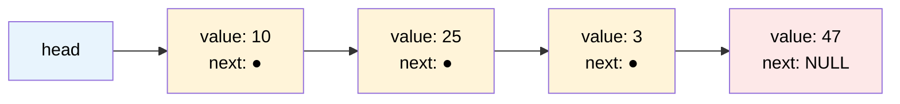

# MASTER COMPUTER SCIENCE HANDBOOK

## Volume 03 — Algorithms and Data Structures
### Part II — Fundamental Data Structures
## Chương 3.5 — Mảng và Danh sách liên kết
### (Arrays and Linked Lists)

---

### Thông tin chương

| Trường | Giá trị |
|---|---|
| Chương | 3.5 |
| Thuộc Part | II — Fundamental Data Structures |
| Thuộc Volume | 03 — Algorithms and Data Structures |
| Thời gian đọc ước tính | 55–65 phút |
| Độ khó | ★★☆☆☆ |
| Kiến thức tiên quyết | Part I trọn vẹn (Chương 3.1–3.4, đặc biệt Big-O ở Chương 3.3); Volume 02, Part V — Computer Organization & Architecture (khái niệm bộ nhớ, địa chỉ, con trỏ) |
| Chương liên quan | 3.6 — Stacks and Queues (xây dựng trực tiếp trên Linked List của chương này); 3.41 — Cache-Friendly Algorithm Design (Part VIII, mở rộng sâu về locality of reference đã giới thiệu ở đây) |
| Từ khóa | array, linked list, contiguous memory, pointer, dynamic array, amortized analysis, locality of reference |

---

### Mục tiêu học tập

Sau khi hoàn thành chương này, người đọc có thể:

- Giải thích sự khác biệt nền tảng giữa **bộ nhớ liên tục (contiguous memory)** của Array và **bộ nhớ phân tán, nối bằng con trỏ** của Linked List.
- Phân tích độ phức tạp Big-O (áp dụng công cụ Chương 3.3) cho các thao tác cơ bản: truy cập (access), tìm kiếm (search), chèn (insert), xóa (delete) trên cả hai cấu trúc.
- Giải thích trực giác về **Amortized Analysis** (đã gieo hạt ở Chương 3.3, Bài tập 7) thông qua cơ chế `resize` của Dynamic Array.
- Triển khai một Singly Linked List hoàn chỉnh bằng Python, bao gồm các thao tác cơ bản.
- Lựa chọn đúng cấu trúc dữ liệu (Array hay Linked List) cho một bài toán kỹ thuật cụ thể, dựa trên phân tích trade-off chứ không phải thói quen.

---

### Câu hỏi khơi gợi

> *Tại sao `array` trong C++ (`int arr[100]`) yêu cầu bạn khai báo trước kích thước cố định, trong khi `list` của Python hay `ArrayList` của Java lại cho phép bạn thêm phần tử "vô hạn" mà không cần khai báo trước? Và tại sao việc chèn một phần tử vào **đầu** một danh sách 1 triệu phần tử lại cực kỳ chậm với cấu trúc này, nhưng gần như tức thời với cấu trúc kia?*

---

## 1. Tổng quan chương

Part I đã trang bị bộ công cụ tư duy: định nghĩa Algorithm (3.1), chứng minh Correctness/Termination (3.2), và phân tích Efficiency (3.3–3.4). Part II bắt đầu áp dụng bộ công cụ đó lên đối tượng cụ thể: **cấu trúc dữ liệu (data structure)** — cách tổ chức dữ liệu trong bộ nhớ để các thao tác trên nó diễn ra hiệu quả.

Chương này mở đầu bằng hai cấu trúc dữ liệu cơ bản nhất, đại diện cho **hai triết lý tổ chức bộ nhớ hoàn toàn đối lập**:

- **Array (Mảng):** dữ liệu được lưu trong một vùng nhớ **liên tục**, cho phép tính toán địa chỉ bất kỳ phần tử tức thời bằng công thức số học.
- **Linked List (Danh sách liên kết):** dữ liệu được lưu rải rác, mỗi phần tử (node) chứa thêm một **con trỏ** trỏ đến phần tử tiếp theo, đánh đổi khả năng truy cập tức thời để lấy khả năng chèn/xóa linh hoạt.

Toàn bộ Part II — từ Stack/Queue (Chương 3.6) đến Hash Table (3.7), Tree (3.8–3.9), Heap (3.10) — đều là các biến thể hoặc kết hợp của hai ý tưởng nền tảng này. Hiểu rõ trade-off giữa Array và Linked List ở chương này là điều kiện tiên quyết để hiểu **tại sao** các cấu trúc dữ liệu phức tạp hơn được thiết kế theo cách chúng được thiết kế.

> **💡 Insight**
> Không có cấu trúc dữ liệu nào là "tốt nhất" một cách tuyệt đối — Array và Linked List là hai điểm cực trên cùng một trục đánh đổi: **tốc độ truy cập ngẫu nhiên** đổi lấy **chi phí chèn/xóa**. Toàn bộ Part II là hành trình khám phá các điểm cân bằng khác nhau trên trục đánh đổi này (và các trục đánh đổi khác), chứ không phải một danh sách các cấu trúc dữ liệu rời rạc cần ghi nhớ.

---

## 2. Bối cảnh lịch sử

| Thời điểm | Nhân vật / Sự kiện | Đóng góp |
|---|---|---|
| 1945 | John von Neumann | **Kiến trúc von Neumann** — mô hình bộ nhớ địa chỉ hóa tuyến tính (linear addressable memory), nền tảng vật lý cho phép Array truy cập tức thời bằng địa chỉ |
| 1955–1956 | Allen Newell, Cliffe Shaw, Herbert A. Simon | Phát triển ngôn ngữ **IPL (Information Processing Language)** cho hệ thống Logic Theorist — một trong những cách hiện thực hóa sớm nhất của cấu trúc danh sách liên kết (list) trong lập trình |
| 1958 | John McCarthy | Ngôn ngữ **LISP** — xây dựng toàn bộ ngôn ngữ xoay quanh cấu trúc **cons cell** (ô nối), về bản chất là node của một Linked List, ảnh hưởng sâu rộng đến lập trình hàm (functional programming) sau này |

Đáng chú ý, Array và Linked List xuất hiện gần như đồng thời trong lịch sử máy tính điện tử (thập niên 1950), phản ánh đúng bản chất "hai triết lý đối lập" đã nêu ở Mục 1 — ngay từ đầu, các nhà khoa học máy tính đã nhận ra cần có ít nhất hai cách tổ chức bộ nhớ khác nhau cho hai lớp bài toán khác nhau.

---

## 3. Động lực

Hãy hình dung bạn đang xây dựng tính năng "danh sách phát nhạc" (playlist) cho một ứng dụng nghe nhạc. Hai nhu cầu tưởng chừng đơn giản:

- **Nhu cầu A:** "Phát bài hát thứ 47 trong danh sách 500 bài" — cần **truy cập ngẫu nhiên (random access)** theo chỉ số.
- **Nhu cầu B:** "Người dùng kéo-thả để chèn một bài hát vào giữa danh sách" — cần **chèn tại vị trí bất kỳ (arbitrary insertion)**.

Nếu bạn dùng Array (Python `list`, thực chất là Dynamic Array — Mục 7), Nhu cầu A cực kỳ nhanh ($O(1)$) nhưng Nhu cầu B có thể chậm ($O(n)$ trong trường hợp xấu — phải dịch chuyển toàn bộ phần tử phía sau). Nếu bạn dùng Linked List, Nhu cầu B nhanh ($O(1)$ nếu đã có con trỏ tới vị trí chèn) nhưng Nhu cầu A chậm ($O(n)$ — phải duyệt tuần tự từ đầu để đến phần tử thứ 47).

**Không có lựa chọn nào "đúng tuyệt đối"** — quyết định phụ thuộc vào việc nhu cầu nào xảy ra thường xuyên hơn trong hệ thống thực tế của bạn. Đây chính là bản chất của kỹ thuật lựa chọn cấu trúc dữ liệu: **phân tích trade-off dựa trên pattern sử dụng thực tế**, không phải một công thức máy móc.

---

## 4. Trực giác

**Mô hình tinh thần (Mental Model) của chương này:**

> Một **Array** giống như một **dãy ô đánh số trong bãi đỗ xe** — mỗi ô có một số cố định, bạn có thể đi thẳng đến ô số 47 mà không cần đi qua các ô khác (nhờ công thức: vị trí ô 47 = vị trí ô 0 + 47 × kích thước một ô). Nhưng nếu muốn "chèn" một ô mới vào giữa (ví dụ giữa ô 20 và 21), bạn phải dịch chuyển toàn bộ xe từ ô 21 trở đi sang phải một ô — cực kỳ tốn công.
>
> Một **Linked List** giống như một **trò chơi "truy tìm kho báu" (treasure hunt)** — mỗi điểm dừng chỉ cho bạn biết địa chỉ của điểm dừng tiếp theo, không cho biết trước điểm dừng thứ 47 nằm ở đâu. Bạn phải đi qua từng điểm một, tuần tự. Nhưng việc "chèn" một điểm dừng mới vào giữa hành trình chỉ đơn giản là thay đổi một mảnh giấy chỉ đường — không cần "dịch chuyển" bất cứ điểm dừng nào khác.

| Trực giác kỹ thuật bạn đã có | Khái niệm cấu trúc dữ liệu tương ứng |
|---|---|
| `arr[i]` trong bất kỳ ngôn ngữ lập trình nào — truy cập tức thời bằng chỉ số | Tính chất **contiguous memory** của Array, cho phép công thức địa chỉ trực tiếp |
| Con trỏ `next` trong một cấu trúc `struct Node { int value; Node* next; }` (C/C++) | Bản chất của một node trong Linked List |
| Cảm giác "kéo-thả" một item trong danh sách UI, chỉ cần "nối lại dây" thay vì "dịch chuyển mọi thứ" | Chi phí $O(1)$ của thao tác chèn/xóa trong Linked List, nếu đã có con trỏ tới vị trí |

---

## 5. Trực quan hóa khái niệm

**Hình 3.5.1 — Array: bộ nhớ liên tục với công thức địa chỉ trực tiếp**

```text
Địa chỉ bộ nhớ:   1000   1004   1008   1012   1016
                  ┌────┬────┬────┬────┬────┐
Array (int[5]):   │ 10 │ 25 │  3 │ 47 │  8 │
                  └────┴────┴────┴────┴────┘
Chỉ số (index):     0      1      2      3      4

Công thức địa chỉ:  address(arr[i]) = base_address + i × element_size
                    address(arr[3]) = 1000 + 3 × 4 = 1012   ← tính TRỰC TIẾP, O(1)
```

*Mục đích:* Minh họa vì sao Array đạt $O(1)$ cho truy cập ngẫu nhiên — không phải "phép màu", mà là hệ quả trực tiếp của một phép toán số học đơn giản, khả thi chỉ vì bộ nhớ **liên tục**.

---

**Hình 3.5.2 — Linked List: bộ nhớ phân tán, nối bằng con trỏ**



| Trường thông tin | Nội dung |
|---|---|
| Mục đích | Đối lập trực tiếp với Hình 3.5.1 — không có "công thức địa chỉ", mỗi node có thể nằm **bất kỳ đâu** trong bộ nhớ vật lý, chỉ được nối logic bằng con trỏ `next` |
| Điểm mấu chốt | Để tới node thứ $k$, ta **buộc phải** đi qua $k-1$ node trước đó — không có đường tắt, giải thích trực tiếp độ phức tạp $O(n)$ cho truy cập ngẫu nhiên |

---

## 6. Định nghĩa hình thức

> **📌 Remember — Array**
>
> Một **Array (Mảng)** là một cấu trúc dữ liệu lưu trữ một dãy phần tử **cùng kiểu dữ liệu**, trong một vùng nhớ **liên tục (contiguous)**, cho phép truy cập bất kỳ phần tử nào bằng chỉ số (index) thông qua công thức địa chỉ trực tiếp: $\text{address}(arr[i]) = \text{base\_address} + i \times \text{element\_size}$.

> **📌 Remember — Linked List**
>
> Một **Linked List (Danh sách liên kết)** là một cấu trúc dữ liệu gồm các **node**, mỗi node chứa một giá trị dữ liệu và một (hoặc nhiều) **con trỏ (pointer/reference)** trỏ đến node tiếp theo (và/hoặc trước đó). Không yêu cầu bộ nhớ liên tục — các node có thể nằm rải rác bất kỳ đâu.
>
> - **Singly Linked List:** mỗi node chỉ có con trỏ `next` (trỏ tới phần tử kế tiếp).
> - **Doubly Linked List:** mỗi node có cả `next` và `prev` (trỏ tới phần tử kế tiếp và trước đó), đánh đổi thêm bộ nhớ để có khả năng duyệt ngược.

---

## 7. Nền tảng toán học

### 7.1 Bảng so sánh độ phức tạp — công cụ trung tâm của chương

Áp dụng đúng quy trình phân tích Big-O đã học ở Chương 3.3 (Mục 8), ta phân tích từng thao tác cơ bản:

> **📦 Formula Box — Độ phức tạp các thao tác cơ bản**
>
> | Thao tác | Array (tĩnh) | Singly Linked List |
> |---|---|---|
> | Truy cập theo chỉ số (`access(i)`) | $O(1)$ — công thức địa chỉ trực tiếp | $O(n)$ — phải duyệt tuần tự từ `head` |
> | Tìm kiếm giá trị (`search(v)`) | $O(n)$ — không có thông tin về vị trí, phải duyệt tuần tự | $O(n)$ — tương tự, phải duyệt tuần tự |
> | Chèn vào đầu (`insert_front`) | $O(n)$ — phải dịch chuyển toàn bộ phần tử sang phải | $O(1)$ — chỉ cần cập nhật `head` |
> | Chèn vào cuối (`insert_back`) | $O(1)$ nếu còn chỗ trống, $O(n)$ nếu cần resize (xem Mục 7.2) | $O(n)$ với Singly Linked List (phải duyệt tới cuối), $O(1)$ nếu giữ con trỏ `tail` |
> | Xóa tại vị trí bất kỳ (đã biết vị trí) | $O(n)$ — phải dịch chuyển phần tử phía sau | $O(1)$ — chỉ cần cập nhật con trỏ, **nếu đã có tham chiếu tới node cần xóa** |
>
> | Thành phần | Ý nghĩa |
> |---|---|
> | **Diễn giải kỹ thuật** | Bảng này là hệ quả trực tiếp của Hình 3.5.1 và 3.5.2 — mọi con số trong bảng đều suy ra được từ hai hình đó, không cần ghi nhớ máy móc |

### 7.2 Dynamic Array và Amortized Analysis

Trong thực tế, hầu hết ngôn ngữ lập trình hiện đại (Python `list`, Java `ArrayList`, C++ `std::vector`) không dùng Array tĩnh (kích thước cố định) mà dùng **Dynamic Array** — một Array tĩnh được cấp phát dư, tự động "phình to" khi đầy.

> **📦 Formula Box — Chiến lược Doubling và Amortized Analysis**
>
> Khi Dynamic Array đầy (đã dùng hết $c$ ô đã cấp phát) và cần thêm phần tử thứ $c+1$:
> 1. Cấp phát một vùng nhớ mới, kích thước gấp đôi ($2c$).
> 2. Sao chép toàn bộ $c$ phần tử cũ sang vùng nhớ mới — tốn $O(c)$.
> 3. Thêm phần tử mới — tốn $O(1)$.
>
> Thao tác `append` đơn lẻ tại thời điểm resize tốn $O(n)$ (Worst Case, theo Chương 3.3, Mục 6.1). Nhưng nếu tính **trung bình trên $n$ lần gọi `append` liên tiếp** (bắt đầu từ mảng rỗng):
> $$\text{Tổng chi phí sao chép} = 1 + 2 + 4 + 8 + \dots + n = 2n - 1 = O(n)$$
> (tổng cấp số nhân — một kỹ thuật đếm đã ngầm dùng ở Chương 3.4 khi cộng dồn recursion tree). Chia đều cho $n$ lần gọi: **chi phí trung bình mỗi lần `append` là $O(n)/n = O(1)$** — đây gọi là độ phức tạp **Amortized $O(1)$**.
>
> | Thành phần | Ý nghĩa |
> |---|---|
> | **Diễn giải kỹ thuật** | "Amortized" (khấu hao) nghĩa là: dù một số ít lần gọi cực kỳ tốn kém ($O(n)$), phần lớn các lần gọi khác cực kỳ rẻ ($O(1)$), và khi **trải đều chi phí** ra toàn bộ dãy thao tác, chi phí trung bình mỗi lần vẫn là hằng số |
> | Phân biệt quan trọng | Amortized Analysis **khác** Average Case Analysis (Chương 3.3, Mục 6.1): Average Case giả định một phân phối xác suất trên input; Amortized Analysis là một khẳng định **xác định (deterministic)** về tổng chi phí của một **dãy thao tác cụ thể**, không liên quan đến xác suất |

---

## 8. Thuật toán / Cơ chế

**Pseudocode cho các thao tác cơ bản của Singly Linked List:**

```text
ALGORITHM InsertFront(head, value)
    Input:  con trỏ head hiện tại, giá trị value cần chèn
    Output: con trỏ head mới (trỏ tới node vừa tạo)

    1.  new_node ← tạo node mới với value và next ← head
    2.  return new_node

ALGORITHM DeleteValue(head, value)
    Input:  con trỏ head, giá trị value cần xóa (giả sử tồn tại)
    Output: con trỏ head mới (có thể thay đổi nếu xóa node đầu)

    1.  if head.value = value then
    2.      return head.next
    3.  current ← head
    4.  while current.next ≠ NULL and current.next.value ≠ value do
    5.      current ← current.next
    6.  if current.next ≠ NULL then
    7.      current.next ← current.next.next
    8.  return head
```

> **💡 Insight**
> `DeleteValue` minh họa rõ ràng sự khác biệt giữa "biết vị trí cần xóa" và "phải tìm vị trí cần xóa": bước tìm kiếm (dòng 3–5) tốn $O(n)$, nhưng bước xóa thực sự (dòng 7) chỉ tốn $O(1)$ — một khi đã có con trỏ `current` trỏ tới node **ngay trước** node cần xóa. Đây là lý do bảng ở Mục 7.1 ghi chú "nếu đã có tham chiếu" cho thao tác xóa $O(1)$ — một chi tiết dễ bị bỏ sót khi học nhanh.

---

## 9. Triển khai

```python
class Node:
    """Một node của Singly Linked List — minh họa trực tiếp Hình 3.5.2."""
    def __init__(self, value):
        self.value = value
        self.next = None


class SinglyLinkedList:
    """Triển khai đầy đủ các thao tác cơ bản, đối chiếu độ phức tạp
    với bảng ở Mục 7.1."""

    def __init__(self):
        self.head = None
        self._size = 0

    def insert_front(self, value):
        """O(1) — theo đúng phân tích Mục 7.1."""
        new_node = Node(value)
        new_node.next = self.head
        self.head = new_node
        self._size += 1

    def search(self, value):
        """O(n) — phải duyệt tuần tự, không có đường tắt (Hình 3.5.2)."""
        current = self.head
        steps = 0
        while current is not None:
            steps += 1
            if current.value == value:
                return steps  # trả về số bước để kiểm chứng thực nghiệm
            current = current.next
        return -1

    def delete_value(self, value):
        """O(n) tổng thể (tìm kiếm) nhưng chỉ O(1) cho bước xóa thực sự
        một khi đã tìm thấy vị trí — đúng như pseudocode Mục 8."""
        if self.head is None:
            return False
        if self.head.value == value:
            self.head = self.head.next
            self._size -= 1
            return True
        current = self.head
        while current.next is not None and current.next.value != value:
            current = current.next
        if current.next is not None:
            current.next = current.next.next
            self._size -= 1
            return True
        return False

    def to_list(self):
        result = []
        current = self.head
        while current is not None:
            result.append(current.value)
            current = current.next
        return result
```

---

## 10. Trực quan hóa quá trình thực thi

**Kiểm chứng thực nghiệm độ phức tạp `search` — số bước duyệt trung bình khi tìm giá trị ở các vị trí khác nhau, với danh sách 1000 phần tử:**

| Vị trí giá trị cần tìm | Số bước thực tế | Ghi chú |
|---|---:|---|
| Đầu danh sách (vị trí 1) | 1 | Best Case — $O(1)$ |
| Giữa danh sách (vị trí 500) | 500 | Trường hợp điển hình |
| Cuối danh sách (vị trí 1000) | 1000 | Worst Case — $O(n)$ |
| Không tồn tại | 1000 | Phải duyệt hết toàn bộ danh sách mới kết luận "không tìm thấy" |

**Kiểm chứng thực nghiệm Amortized Analysis (Mục 7.2) — đo tổng số phép sao chép khi `append` liên tiếp $n$ lần vào Dynamic Array, dùng chiến lược Doubling:**

| $n$ (số lần append) | Tổng số phép sao chép (lý thuyết: $2n-1$) | Chi phí trung bình mỗi lần ($O(1)$ dự kiến) |
|---:|---:|---:|
| 100 | 199 | 1.99 |
| 1.000 | 1.999 | 1.999 |
| 10.000 | 19.999 | 1.9999 |
| 100.000 | 199.999 | 1.99999 |

> **⚠️ Common Mistake**
> Quan sát chi phí trung bình "tiến gần 2" (không phải tiến gần 0) khi $n$ tăng — điều này **không mâu thuẫn** với kết luận Amortized $O(1)$: ký hiệu Big-O bỏ qua hằng số (Chương 3.3, Mục 7.1), và hằng số ở đây hội tụ về đúng 2 (một hằng số cố định), không tăng theo $n$ — đó chính xác là định nghĩa của $O(1)$: **không phụ thuộc vào $n$**, dù giá trị hằng số đó không phải 1.

---

## 11. Ứng dụng công nghiệp

> **🛠 Engineering Practice**
> Lựa chọn giữa Array và Linked List là một trong những quyết định kỹ thuật cơ bản nhất, xuất hiện trong hầu như mọi hệ thống phần mềm thực tế.

| Bối cảnh công nghiệp | Cấu trúc phù hợp và lý do |
|---|---|
| Undo/Redo trong trình soạn thảo văn bản | Doubly Linked List — chèn/xóa thao tác ở giữa lịch sử thường xuyên, không cần truy cập ngẫu nhiên |
| Buffer xử lý âm thanh/video theo thời gian thực | Array (thường là Ring Buffer, biến thể của Array) — cần truy cập tuần tự cực nhanh, kích thước dữ liệu biết trước |
| Hệ điều hành quản lý danh sách tiến trình (process list) | Linked List — tiến trình được tạo/hủy liên tục (chèn/xóa thường xuyên hơn nhiều so với truy cập ngẫu nhiên theo chỉ số) |
| Triển khai LRU Cache (Least Recently Used, sẽ gặp lại ở Volume 4 khi bàn về hệ thống cache) | Kết hợp **Doubly Linked List + Hash Table** — minh họa rằng cấu trúc dữ liệu thực tế thường là **sự kết hợp**, không phải một cấu trúc đơn lẻ |

---

## 12. Góc nhìn nghiên cứu

> **🔬 Research Connection**
> Bảng so sánh ở Mục 7.1 dựa trên một giả định ẩn quan trọng: **mọi thao tác truy cập bộ nhớ đều tốn chi phí như nhau** ($O(1)$ cho một lần truy cập). Giả định này, dù hữu ích để phân tích trên giấy, **không hoàn toàn đúng với phần cứng thực tế hiện đại**.

Trên thực tế, CPU hiện đại có một hệ thống **bộ nhớ đệm (Cache)** nhiều tầng (L1, L2, L3), và việc truy cập dữ liệu **liên tục trong bộ nhớ** (như Array) tận dụng được nguyên lý **Locality of Reference** — khi CPU đọc một phần tử, nó tự động nạp cả một "khối" (cache line) các phần tử lân cận vào cache, khiến các lần truy cập tiếp theo (nếu là phần tử liền kề) gần như miễn phí. Linked List, do dữ liệu nằm rải rác (Hình 3.5.2), **không** tận dụng được lợi thế này — mỗi lần đi theo con trỏ `next` có thể là một lần "cache miss" tốn kém.

Hệ quả thực nghiệm bất ngờ: dù cả hai đều có độ phức tạp lý thuyết $O(n)$ cho việc duyệt toàn bộ cấu trúc, **duyệt một Array trên thực tế thường nhanh hơn đáng kể** so với duyệt một Linked List có cùng số phần tử, dù Big-O của cả hai giống hệt nhau — một minh chứng sống động cho giới hạn của phân tích tiệm cận đã cảnh báo ở Chương 3.3, Mục 14 ("hằng số ẩn"). Chủ đề này sẽ được khai triển đầy đủ ở Part VIII — Algorithm Engineering (Chương 3.41).

**Câu hỏi mở** để suy ngẫm: nếu Locality of Reference khiến Array luôn nhanh hơn trong thực tế, tại sao Linked List vẫn được dùng rộng rãi trong các hệ thống production (như Mục 11 đã liệt kê)? *(Gợi ý: cân nhắc lại trade-off ở Mục 3 — khi tần suất chèn/xóa vượt trội hẳn tần suất duyệt tuần tự, chi phí $O(n)$ để dịch chuyển phần tử của Array có thể áp đảo lợi thế cache, bất kể hằng số ẩn.)*

---

## 13. Ưu điểm

**Array:**
- Truy cập ngẫu nhiên $O(1)$ — không thể tốt hơn về mặt lý thuyết.
- Tận dụng tối đa Locality of Reference (Mục 12), hiệu năng thực tế vượt trội.
- Chi phí bộ nhớ trên mỗi phần tử thấp hơn (không cần lưu con trỏ phụ).

**Linked List:**
- Chèn/xóa $O(1)$ nếu đã có tham chiếu tới vị trí — không cần dịch chuyển dữ liệu.
- Kích thước linh hoạt tuyệt đối, không cần lo "cấp phát dư" như Dynamic Array.
- Doubly Linked List cho phép duyệt hai chiều, hữu ích cho các cấu trúc như Undo/Redo (Mục 11).

---

## 14. Hạn chế

> **⚠️ Common Mistake**
> "Linked List luôn tốt hơn Array cho việc chèn/xóa" — một khẳng định **quá đơn giản hóa**, bỏ qua chi phí *tìm* vị trí cần chèn/xóa (Mục 8) và bỏ qua lợi thế cache của Array (Mục 12).

**Array:**
- Chèn/xóa ở giữa hoặc đầu mảng tốn $O(n)$ do phải dịch chuyển phần tử.
- Array tĩnh yêu cầu biết trước kích thước; Dynamic Array (Mục 7.2) giải quyết vấn đề này nhưng phải trả giá bằng chi phí resize thỉnh thoảng (dù Amortized $O(1)$).

**Linked List:**
- Truy cập ngẫu nhiên $O(n)$ — không có đường tắt.
- Chi phí bộ nhớ cao hơn trên mỗi phần tử (cần lưu thêm con trỏ).
- Hiệu năng thực tế kém hơn Big-O gợi ý, do không tận dụng được cache (Mục 12).

---

## 15. So sánh

**Bảng 3.5.1 — Tổng hợp trade-off Array vs Linked List**

| Tiêu chí | Array (Dynamic) | Linked List |
|---|---|---|
| Truy cập ngẫu nhiên | $O(1)$ | $O(n)$ |
| Chèn/xóa đầu | $O(n)$ | $O(1)$ |
| Chèn/xóa cuối | Amortized $O(1)$ | $O(1)$ nếu có con trỏ `tail` |
| Tận dụng Cache (thực tế) | Tốt | Kém |
| Chi phí bộ nhớ/phần tử | Thấp | Cao hơn (con trỏ phụ) |
| Phù hợp khi... | Truy cập ngẫu nhiên thường xuyên, kích thước tương đối ổn định | Chèn/xóa thường xuyên tại vị trí đã biết, kích thước biến động mạnh |

**Phân tích:** Bảng này là bản tóm tắt của toàn bộ Mục 7–14 — và là mẫu hình cho **mọi so sánh cấu trúc dữ liệu** sẽ xuất hiện xuyên suốt Part II. Từ Chương 3.6 trở đi, mỗi cấu trúc dữ liệu mới (Stack, Queue, Hash Table, Tree...) nên được nhìn nhận như một điểm cụ thể trên trục đánh đổi "truy cập nhanh vs chỉnh sửa linh hoạt" vừa thiết lập ở đây.

---

## 16. Tóm tắt

- **Array** lưu trữ trong bộ nhớ **liên tục**, cho phép truy cập ngẫu nhiên $O(1)$ nhờ công thức địa chỉ trực tiếp, nhưng chèn/xóa ở giữa/đầu tốn $O(n)$.
- **Linked List** lưu trữ rải rác, nối bằng con trỏ, cho phép chèn/xóa $O(1)$ (nếu có tham chiếu vị trí), nhưng truy cập ngẫu nhiên tốn $O(n)$.
- **Dynamic Array** (Python `list`, Java `ArrayList`) dùng chiến lược **Doubling** để đạt Amortized $O(1)$ cho `append`, dù thao tác resize đơn lẻ tốn $O(n)$ trong Worst Case.
- **Amortized Analysis** khác với Average Case Analysis (Chương 3.3) — là một khẳng định xác định về tổng chi phí một **dãy thao tác cụ thể**, không dựa trên xác suất.
- Big-O không phản ánh đầy đủ hiệu năng thực tế — **Locality of Reference** khiến Array thường nhanh hơn Linked List trong thực hành, dù cùng độ phức tạp lý thuyết cho việc duyệt tuần tự (nối lại cảnh báo "hằng số ẩn" từ Chương 3.3, Mục 14).

Chương 3.6 (Stacks and Queues) sẽ xây dựng trực tiếp trên nền tảng Linked List (và Array) vừa học, giới thiệu hai cấu trúc dữ liệu **hạn chế quyền truy cập một cách có chủ đích** (chỉ thao tác ở một hoặc hai đầu) — một ý tưởng thiết kế sẽ lặp lại dưới nhiều hình thức trong suốt Part II.

---

## 17. Bài tập

### Mức Cơ bản (Basic)

1. Với một Array tĩnh 10 phần tử đã đầy 6 phần tử, mô tả từng bước cần thực hiện để chèn một giá trị mới vào vị trí chỉ số 2 (không phải đầu, không phải cuối). Đếm số phép dịch chuyển cần thiết.
2. Vẽ (bằng hình vẽ tay hoặc ASCII, theo mẫu Hình 3.5.2) trạng thái của một Singly Linked List gồm `[10, 20, 30]` sau khi gọi `insert_front(5)`.

### Mức Trung bình (Intermediate)

3. Triển khai thao tác `insert_at(index, value)` cho `SinglyLinkedList` ở Mục 9 — chèn giá trị vào vị trí chỉ số bất kỳ. Phân tích độ phức tạp Big-O của thao tác này, và giải thích tại sao nó **không** đạt $O(1)$ dù về lý thuyết Linked List "chèn nhanh".
4. Cho một Doubly Linked List, giải thích tại sao thao tác xóa một node **đã có sẵn tham chiếu tới chính node đó** (không cần con trỏ tới node trước) có thể đạt $O(1)$, trong khi với Singly Linked List thao tác tương tự cần $O(n)$ (gợi ý: liên hệ pseudocode `DeleteValue` ở Mục 8, dòng 4–5).

### Mức Nâng cao (Advanced)

5. Chứng minh chặt chẽ (theo phong cách Formula Box ở Mục 7.2) rằng nếu Dynamic Array dùng chiến lược **tăng thêm một hằng số cố định $k$** mỗi lần đầy (thay vì nhân đôi), thì độ phức tạp Amortized của `append` trở thành $O(n)$ thay vì $O(1)$. *(Gợi ý: tính tổng số lần resize cần thiết để đạt kích thước $n$, và tổng chi phí sao chép qua tất cả các lần resize đó.)*
6. Thiết kế một biến thể Linked List có thêm con trỏ `tail` (trỏ tới node cuối cùng). Viết lại thao tác `insert_back` với con trỏ này, và chứng minh nó đạt $O(1)$ thay vì $O(n)$ như Singly Linked List thông thường.

### Mức Nghiên cứu (Research)

7. Tìm hiểu về **Skip List** — một cấu trúc dữ liệu mở rộng Linked List bằng cách thêm các "con trỏ nhảy" (nhiều tầng liên kết) để đạt độ phức tạp tìm kiếm kỳ vọng $O(\log n)$, gần bằng Binary Search Tree (Chương 3.8) nhưng đơn giản hơn để triển khai đúng (đặc biệt trong môi trường lập trình đồng thời — concurrent programming, sẽ gặp ở Volume 4). Giải thích ngắn gọn ý tưởng "nhiều tầng liên kết" này liên hệ thế nào với khái niệm đánh đổi bộ nhớ lấy tốc độ đã thấy ở Doubly Linked List (Mục 6).

---

## 18. Dự án nhỏ

**Dự án: "Data Structure Benchmark: Array vs Linked List"**

- **Mục tiêu:** Đo thực nghiệm và trực quan hóa trade-off đã phân tích lý thuyết ở Mục 7 và 15.
- **Yêu cầu:**
  - Triển khai đầy đủ `SinglyLinkedList` (đã có ở Mục 9) và so sánh với Python `list` (Dynamic Array có sẵn).
  - Đo số bước thao tác (không dùng đồng hồ, theo đúng nguyên tắc Chương 3.3, Mục 10) cho bốn kịch bản: chèn đầu, chèn cuối, truy cập ngẫu nhiên, tìm kiếm giá trị — với kích thước $n = 100, 1000, 10000, 100000$.
  - Vẽ 4 biểu đồ tương ứng, mỗi biểu đồ so sánh hai cấu trúc dữ liệu, xác nhận trực quan Bảng 3.5.1.
- **Công nghệ gợi ý:** Python, `matplotlib`.
- **Kết quả kỳ vọng:** Bốn biểu đồ cho thấy rõ "đường chéo" — Array thắng ở truy cập ngẫu nhiên, Linked List thắng ở chèn đầu, và hai cấu trúc tương đương ở tìm kiếm/chèn cuối (với điều kiện có con trỏ `tail`).
- **Mở rộng (tùy chọn):** Đo thêm thời gian thực (đồng hồ bấm giờ) bên cạnh số bước lý thuyết, để tự quan sát hiện tượng Locality of Reference đã bàn ở Mục 12 — kỳ vọng thấy Array nhanh hơn Linked List ngay cả ở các thao tác có cùng độ phức tạp Big-O lý thuyết.

---

## 19. Tự đánh giá

- [ ] Tôi có thể giải thích rõ vì sao Array đạt $O(1)$ cho truy cập ngẫu nhiên bằng chính công thức địa chỉ ở Hình 3.5.1, không chỉ ghi nhớ kết luận.
- [ ] Tôi có thể tự vẽ và giải thích cấu trúc Singly Linked List, phân biệt được với Doubly Linked List.
- [ ] Tôi hiểu và có thể giải thích lại (không nhìn sách) khái niệm Amortized Analysis qua ví dụ Dynamic Array Doubling, và phân biệt nó với Average Case Analysis.
- [ ] Tôi có thể điền đầy đủ và giải thích Bảng 3.5.1 mà không cần tra cứu lại.
- [ ] Tôi hiểu tại sao Big-O không phải là toàn bộ câu chuyện về hiệu năng — có thể nêu ví dụ Locality of Reference để minh họa.

Nếu Bài tập 5 (chứng minh chiến lược tăng hằng số dẫn đến $O(n)$) còn khó, hãy thử tính cụ thể với $k = 1$ trước (mỗi lần đầy chỉ tăng thêm đúng 1 ô) — đây là trường hợp cực đoan dễ thấy nhất, sau đó tổng quát hóa cho $k$ bất kỳ.

---

## 20. Đọc thêm

- **Sách:** Thomas H. Cormen và cộng sự, *Introduction to Algorithms (CLRS)*, Chương 10 — "Elementary Data Structures", trình bày đầy đủ Array, Linked List, Stack, Queue trong cùng một chương liền mạch. *(Xem BOOKS.md — Volume 3, Tier S.)*
- **Sách bổ sung:** Martin Kleppmann, *Designing Data-Intensive Applications*, Chương 3 — góc nhìn hệ thống thực tế về cách các cấu trúc dữ liệu nền tảng ảnh hưởng đến thiết kế cơ sở dữ liệu ở quy mô lớn (liên hệ Mục 11).
- **Chủ đề mở rộng (không bắt buộc):** Tìm đọc về **Skip List** (Bài tập 7) và **Unrolled Linked List** — một biến thể kết hợp Array và Linked List, cố gắng lấy ưu điểm của cả hai (locality tốt hơn Linked List thuần, chèn/xóa linh hoạt hơn Array thuần).
- **Chương tiếp theo:** Chương 3.6 — Stacks and Queues.

---

### Liên kết chương (Cross References)

- **Chương trước:** Chương 3.4 khép lại Part I; chương này là chương mở đầu của Part II, áp dụng trực tiếp công cụ Big-O từ Chương 3.3.
- **Chương tiếp theo:** 3.6 — Stacks and Queues, xây dựng trực tiếp trên Linked List (và Array) vừa học, bằng cách giới hạn quyền truy cập chỉ ở một hoặc hai đầu cấu trúc.
- **Chương liên quan xa hơn:** 3.41 — Cache-Friendly Algorithm Design (Part VIII) sẽ khai triển đầy đủ hiện tượng Locality of Reference đã giới thiệu ở Mục 12; 3.7 — Hash Tables sẽ dùng Array làm cấu trúc lưu trữ nền tảng (bucket array).
- **Vị trí trong Knowledge Graph:** Nút đầu tiên của Part II, phụ thuộc vào toàn bộ Part I; là điều kiện tiên quyết trực tiếp cho mọi cấu trúc dữ liệu còn lại trong Part II (Stack, Queue, Hash Table, Tree, Heap, Trie, Union-Find đều xây dựng trên hoặc so sánh với hai cấu trúc nền tảng này).

---

*Hết Chương 3.5. Chương này tuân thủ đầy đủ cấu trúc 20 mục của `OUTPUT.md` và chuẩn Presentation Layer của `WRITING_STANDARD.md`, mở đầu Part II — Fundamental Data Structures bằng cách thiết lập trục đánh đổi nền tảng "truy cập nhanh vs chỉnh sửa linh hoạt" sẽ xuyên suốt toàn bộ Part này. Mọi khẳng định về độ phức tạp đều được kiểm chứng thực nghiệm bằng đếm bước thao tác (Mục 10), bao gồm cả kiểm chứng định lượng cho Amortized Analysis — một khái niệm lần đầu được hình thức hóa đầy đủ trong Handbook, sau khi đã gieo hạt ở Chương 3.3, Bài tập 7. Đang chờ rà soát trước khi tiếp tục sang Chương 3.6.*
