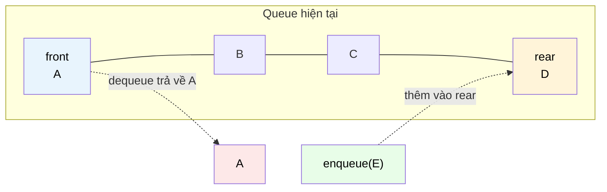

# MASTER COMPUTER SCIENCE HANDBOOK

## Volume 03 — Algorithms and Data Structures
### Part II — Fundamental Data Structures
## Chương 3.6 — Ngăn xếp và Hàng đợi
### (Stacks and Queues)

---

### Thông tin chương

| Trường | Giá trị |
|---|---|
| Chương | 3.6 |
| Thuộc Part | II — Fundamental Data Structures |
| Thuộc Volume | 03 — Algorithms and Data Structures |
| Thời gian đọc ước tính | 50–60 phút |
| Độ khó | ★★☆☆☆ |
| Kiến thức tiên quyết | Chương 3.5 — Arrays and Linked Lists (đặc biệt Mục 7 — bảng độ phức tạp, Mục 9 — triển khai Linked List) |
| Chương liên quan | 3.22 — Graph Representation and Traversal (Part IV) sẽ dùng Stack cho DFS và Queue cho BFS — ứng dụng trực tiếp và quan trọng nhất của hai cấu trúc này trong toàn bộ Handbook |
| Từ khóa | stack, queue, LIFO, FIFO, push, pop, enqueue, dequeue, circular buffer, deque |

---

### Mục tiêu học tập

Sau khi hoàn thành chương này, người đọc có thể:

- Định nghĩa hình thức **Stack (LIFO)** và **Queue (FIFO)** như các **Abstract Data Type (ADT)** — độc lập với cách chúng được triển khai bên dưới (Array hay Linked List).
- Giải thích tại sao việc **hạn chế quyền truy cập** (chỉ thao tác ở một hoặc hai đầu) lại là một quyết định thiết kế có chủ đích, không phải một hạn chế bất tiện.
- Triển khai Stack và Queue bằng cả hai cách: dựa trên Array (bao gồm kỹ thuật Circular Buffer để tránh lãng phí bộ nhớ) và dựa trên Linked List.
- Phân tích và chứng minh độ phức tạp $O(1)$ cho mọi thao tác cơ bản của Stack và Queue khi triển khai đúng cách.
- Nhận diện các bài toán thực tế phù hợp với Stack (duyệt lồng nhau, hoàn tác) và Queue (xử lý tuần tự công bằng, BFS).

---

### Câu hỏi khơi gợi

> *Tại sao trình duyệt web dùng nút "Back" để quay lại trang **gần nhất** bạn đã xem (không phải trang **đầu tiên**), trong khi hàng đợi in ấn của máy in lại xử lý tài liệu theo đúng thứ tự bạn gửi tới, không nhảy cóc? Hai hành vi tưởng chừng đơn giản này thực chất là hai triết lý tổ chức dữ liệu hoàn toàn khác nhau — và cả hai đều đã tồn tại ngầm trong trực giác lập trình của bạn từ trước khi đọc chương này.*

---

## 1. Tổng quan chương

Chương 3.5 đã thiết lập trục đánh đổi nền tảng giữa Array (truy cập nhanh, chỉnh sửa giữa/đầu chậm) và Linked List (chỉnh sửa nhanh nếu có tham chiếu, truy cập ngẫu nhiên chậm). Chương này giới thiệu hai cấu trúc dữ liệu đầu tiên xây dựng **trên nền tảng** đó, bằng một ý tưởng thiết kế tưởng chừng nghịch lý: **cố tình giới hạn quyền truy cập**.

**Stack (Ngăn xếp)** chỉ cho phép thao tác ở **một đầu duy nhất** — đầu được gọi là "top". **Queue (Hàng đợi)** chỉ cho phép thêm vào một đầu ("rear"/"back") và lấy ra ở đầu kia ("front"). Thoạt nhìn, đây là một sự "thụt lùi" so với Array (vốn cho phép truy cập bất kỳ vị trí nào) hay Linked List (vốn cho phép chèn/xóa ở bất kỳ đâu nếu có con trỏ). Nhưng chính sự giới hạn có chủ đích này lại là chìa khóa: nó **đảm bảo mọi thao tác đều đạt $O(1)$ tuyệt đối**, không có ngoại lệ, không có "trường hợp xấu" nào cần lo lắng — và quan trọng hơn, nó **mô hình hóa chính xác** rất nhiều quy trình xử lý trong đời sống và trong hệ thống máy tính.

Chương này cũng là nơi đầu tiên Handbook giới thiệu khái niệm **Abstract Data Type (ADT)** — một sự phân biệt quan trọng giữa "cấu trúc dữ liệu làm gì" (interface/hành vi) và "cấu trúc dữ liệu được triển khai như thế nào" (implementation) — một nguyên tắc thiết kế phần mềm sẽ tái xuất hiện liên tục trong suốt Part II.

> **💡 Insight**
> Nếu Chương 3.5 dạy bạn về **bộ nhớ được tổ chức ra sao**, thì chương này dạy bạn về **quyền truy cập được kiểm soát ra sao** — một ý tưởng tưởng chừng đơn giản nhưng cực kỳ mạnh mẽ: đôi khi, cách tốt nhất để làm một hệ thống nhanh và đáng tin cậy hơn là **cố tình không cho phép làm mọi thứ**.

---

## 2. Bối cảnh lịch sử

| Thời điểm | Nhân vật / Sự kiện | Đóng góp |
|---|---|---|
| 1955–1957 | Friedrich L. Bauer, Klaus Samelson | Đề xuất khái niệm **Stack** (dưới tên "Keller-Prinzip" hoặc "cellar principle") để giải quyết bài toán tính giá trị biểu thức số học lồng nhau trong trình biên dịch |
| 1957 | Alan Perlis (độc lập), cùng cộng đồng phát triển ngôn ngữ | Cũng đề xuất ý tưởng tương tự về Stack, ứng dụng cho quản lý lời gọi hàm — nền tảng trực tiếp của **Call Stack** trong mọi ngôn ngữ lập trình hiện đại |
| 1961 | Còn gọi ngắn: Khái niệm Queue | Được hình thức hóa sớm trong lý thuyết xếp hàng (Queueing Theory) của Agner Krarup Erlang (đầu thế kỷ 20, trong ngành viễn thông) trước khi được ứng dụng vào Computer Science để quản lý tác vụ (task scheduling) |

Một chi tiết thú vị: Stack ra đời gần như đồng thời ở hai nơi độc lập (Bauer/Samelson ở Đức, và cộng đồng phát triển trình biên dịch ở Mỹ) để giải quyết cùng một vấn đề — tính toán biểu thức có dấu ngoặc lồng nhau. Đây là một ví dụ về **hiện tượng phát minh độc lập (independent invention)** khá phổ biến trong lịch sử khoa học, khi một ý tưởng "chín muồi" đến mức nhiều nhóm nghiên cứu khác nhau cùng khám phá ra nó gần như cùng lúc.

---

## 3. Động lực

Xét bài toán: kiểm tra xem một chuỗi ký tự có dấu ngoặc **cân bằng và đúng thứ tự lồng nhau** hay không, ví dụ `"({[]})"` là hợp lệ, nhưng `"({]})"` hoặc `"(()"` là không hợp lệ.

Trực giác con người giải bài toán này khá tự nhiên: đọc từ trái sang phải, mỗi khi gặp dấu mở, "ghi nhớ" nó; mỗi khi gặp dấu đóng, kiểm tra xem nó có khớp với dấu mở **gần nhất chưa được đóng** hay không. Từ "gần nhất" ở đây chính là chìa khóa — đây là hành vi **Last-In-First-Out (LIFO)**, chính xác là hành vi của Stack.

Ở một bài toán khác: một trung tâm hỗ trợ khách hàng (call center) nhận cuộc gọi và xử lý chúng. Để công bằng, khách hàng gọi trước phải được phục vụ trước — hành vi **First-In-First-Out (FIFO)**, chính xác là hành vi của Queue.

Cả hai bài toán đều có thể giải bằng Array hoặc Linked List "thuần" (Chương 3.5), nhưng làm như vậy đòi hỏi người lập trình **tự nhớ quy tắc** ("chỉ thao tác ở cuối mảng", "chỉ thêm ở cuối, lấy ở đầu"). Stack và Queue **đóng gói quy tắc đó vào chính cấu trúc dữ liệu** — biến một quy ước lập trình thành một đảm bảo cấu trúc, giảm khả năng lỗi do con người quên tuân thủ quy tắc.

---

## 4. Trực giác

**Mô hình tinh thần (Mental Model) của chương này:**

> Một **Stack** giống hệt một **chồng đĩa trong bếp** — bạn chỉ có thể đặt thêm đĩa lên **trên cùng**, và chỉ có thể lấy đĩa **từ trên cùng** xuống. Muốn lấy chiếc đĩa ở dưới đáy, bạn buộc phải lấy hết các đĩa phía trên ra trước — không có đường tắt.
>
> Một **Queue** giống hệt một **hàng người xếp hàng mua vé** — người mới đến luôn đứng vào **cuối hàng**, và người được phục vụ luôn là người đứng **đầu hàng**. Không ai được "chen ngang" hay "nhảy cóc".

| Trực giác kỹ thuật bạn đã có | Khái niệm cấu trúc dữ liệu tương ứng |
|---|---|
| Nút "Undo" (Ctrl+Z) trong trình soạn thảo — luôn hoàn tác thao tác **gần nhất** | Stack — hành vi LIFO |
| Call Stack khi debug — hàm được gọi sau cùng luôn kết thúc (return) trước | Stack — chính là "Call Stack" theo đúng nghĩa đen |
| Hàng đợi in tài liệu (print queue) — tài liệu gửi trước được in trước | Queue — hành vi FIFO |
| Message Queue trong hệ thống backend (ví dụ RabbitMQ, Kafka) | Queue — xử lý tác vụ theo đúng thứ tự đến, đảm bảo công bằng |

---

## 5. Trực quan hóa khái niệm

**Hình 3.6.1 — Stack (LIFO): chỉ thao tác tại "top"**

```text
        push(D)                pop() → trả về D
           │                        │
           ▼                        ▼
     ┌─────────┐              ┌─────────┐
     │    D    │  ← top       │    C    │  ← top (mới)
     ├─────────┤              ├─────────┤
     │    C    │              │    B    │
     ├─────────┤              ├─────────┤
     │    B    │              │    A    │
     ├─────────┤              └─────────┘
     │    A    │
     └─────────┘
```

**Hình 3.6.2 — Queue (FIFO): thêm ở "rear", lấy ở "front"**



| Trường thông tin | Nội dung |
|---|---|
| Mục đích | Đối lập trực tiếp hai hành vi LIFO và FIFO — điểm khác biệt duy nhất giữa hai cấu trúc nằm ở **vị trí lấy ra** (cùng đầu với thêm vào, hay đầu đối diện) |
| Điểm mấu chốt | Cả push/pop (Stack) và enqueue/dequeue (Queue) đều chỉ thao tác tại các đầu **cố định**, không bao giờ cần "tìm kiếm" hay "dịch chuyển" phần tử ở giữa — đây chính là lý do cả hai đạt $O(1)$ tuyệt đối |

---

## 6. Định nghĩa hình thức

> **📌 Remember — Abstract Data Type (ADT)**
>
> Một **Abstract Data Type (ADT)** là một mô hình toán học của một cấu trúc dữ liệu, được định nghĩa hoàn toàn bằng **tập hợp các thao tác được phép** và **hành vi của chúng**, độc lập với cách cấu trúc đó được triển khai bằng bộ nhớ vật lý. Stack và Queue là hai ADT kinh điển — chúng **có thể** được triển khai bằng Array hoặc Linked List (Mục 8), nhưng bản thân ADT chỉ quan tâm đến hành vi bên ngoài (interface), không quan tâm chi tiết bên trong.

> **📌 Remember — Stack (LIFO)**
>
> Một **Stack** là một ADT tuân theo nguyên tắc **Last-In-First-Out (LIFO)**, hỗ trợ các thao tác:
> - `push(x)`: thêm phần tử $x$ vào "top" (đỉnh) của stack.
> - `pop()`: lấy ra và xóa phần tử ở "top".
> - `peek()` / `top()`: xem giá trị ở "top" mà không xóa.
> - `isEmpty()`: kiểm tra stack có rỗng không.

> **📌 Remember — Queue (FIFO)**
>
> Một **Queue** là một ADT tuân theo nguyên tắc **First-In-First-Out (FIFO)**, hỗ trợ các thao tác:
> - `enqueue(x)`: thêm phần tử $x$ vào "rear" (cuối hàng).
> - `dequeue()`: lấy ra và xóa phần tử ở "front" (đầu hàng).
> - `peek()` / `front()`: xem giá trị ở "front" mà không xóa.
> - `isEmpty()`: kiểm tra queue có rỗng không.

---

## 7. Nền tảng toán học

### 7.1 Vì sao cả hai đạt $O(1)$ — chứng minh bằng cách loại trừ

Áp dụng bảng độ phức tạp đã xây ở Chương 3.5, Mục 7.1:

> **📦 Formula Box — Độ phức tạp thao tác của Stack và Queue**
>
> | Triển khai | `push`/`enqueue` | `pop`/`dequeue` |
> |---|---|---|
> | Dùng Array (ở cuối mảng) | $O(1)$ — chèn cuối, theo Chương 3.5 (Amortized nếu Dynamic Array) | $O(1)$ — xóa cuối, không cần dịch chuyển |
> | Dùng Linked List (ở đầu, `head`) | $O(1)$ — chèn đầu, theo Chương 3.5 | $O(1)$ — xóa đầu |
>
> **Diễn giải kỹ thuật:** Nhìn lại bảng gốc ở Chương 3.5, Mục 7.1: thao tác **duy nhất** đạt $O(1)$ trên **cả hai** cấu trúc (Array và Linked List) chính là "chèn/xóa ở đầu (Linked List)" và "chèn/xóa ở cuối (Array)". Stack và Queue được thiết kế để **chỉ bao giờ** dùng đúng những thao tác $O(1)$ này — đây không phải sự trùng hợp, mà là **lý do tồn tại** của thiết kế ADT giới hạn quyền truy cập: nó buộc người dùng cấu trúc dữ liệu chỉ có thể gọi các thao tác vốn dĩ đã nhanh, loại trừ hoàn toàn khả năng vô tình gọi một thao tác $O(n)$ chậm chạp (như chèn/xóa ở giữa).

### 7.2 Circular Buffer — triển khai Queue hiệu quả bằng Array

Nếu triển khai Queue bằng Array một cách ngây thơ (dùng `dequeue` = xóa phần tử đầu tiên của Array), thao tác `dequeue` sẽ tốn $O(n)$ (theo bảng Chương 3.5 — xóa đầu Array cần dịch chuyển toàn bộ phần tử còn lại). Giải pháp là **Circular Buffer (bộ đệm vòng)**:

> **📦 Formula Box — Cơ chế Circular Buffer**
>
> Thay vì dịch chuyển phần tử sau khi `dequeue`, ta duy trì hai chỉ số `front` và `rear`, và cho phép chúng "quay vòng" quanh mảng khi chạm đến cuối, dùng phép toán modulo:
> $$\text{rear}_{\text{mới}} = (\text{rear} + 1) \bmod \text{capacity}$$
> $$\text{front}_{\text{mới}} = (\text{front} + 1) \bmod \text{capacity}$$
>
> | Thành phần | Ý nghĩa |
> |---|---|
> | `capacity` | Kích thước cố định của mảng nền |
> | **Diễn giải kỹ thuật** | Phép `mod` khiến chỉ số "quay lại" vị trí 0 khi vượt quá `capacity - 1`, biến mảng tuyến tính thành một "vòng tròn" logic — tránh hoàn toàn việc phải dịch chuyển phần tử, giữ cả `enqueue` và `dequeue` ở $O(1)$ |

---

## 8. Thuật toán / Cơ chế

**Pseudocode triển khai Stack bằng Linked List (đầu = top):**

```text
ALGORITHM Push(top, value)
    Input:  con trỏ top hiện tại, giá trị cần thêm
    Output: con trỏ top mới

    1.  new_node ← tạo node mới với value, next ← top
    2.  return new_node

ALGORITHM Pop(top)
    Input:  con trỏ top hiện tại (giả sử stack không rỗng)
    Output: (giá trị đã lấy, con trỏ top mới)

    1.  value ← top.value
    2.  new_top ← top.next
    3.  return (value, new_top)
```

**Pseudocode triển khai Queue bằng Circular Buffer:**

```text
ALGORITHM Enqueue(buffer, front, rear, size, capacity, value)
    Input:  mảng buffer, chỉ số front/rear, size hiện tại, capacity, value
    Output: (rear mới, size mới), báo lỗi nếu đầy

    1.  if size = capacity then
    2.      báo lỗi "Queue đầy"
    3.  buffer[rear] ← value
    4.  rear ← (rear + 1) mod capacity
    5.  size ← size + 1
    6.  return (rear, size)

ALGORITHM Dequeue(buffer, front, size, capacity)
    Input:  mảng buffer, chỉ số front, size hiện tại, capacity
    Output: (giá trị đã lấy, front mới, size mới), báo lỗi nếu rỗng

    1.  if size = 0 then
    2.      báo lỗi "Queue rỗng"
    3.  value ← buffer[front]
    4.  front ← (front + 1) mod capacity
    5.  size ← size - 1
    6.  return (value, front, size)
```

> **💡 Insight**
> Cả bốn thao tác trên đều thực hiện đúng một số hằng phép toán (gán, cộng, mod, so sánh) — không có vòng lặp nào, không có sự phụ thuộc vào $n$. Đây là bằng chứng "bằng mắt" trực tiếp, không cần công cụ phức tạp, rằng độ phức tạp là $O(1)$ — một sự minh họa cụ thể cho quy tắc đếm phép toán đã học ở Chương 3.3, Mục 8.

---

## 9. Triển khai

```python
class Stack:
    """Stack triển khai bằng Python list (Dynamic Array) —
    push/pop đều thao tác ở CUỐI mảng, đạt Amortized O(1)
    theo đúng phân tích Chương 3.5, Mục 7.2."""

    def __init__(self):
        self._data = []

    def push(self, value):
        self._data.append(value)      # O(1) amortized

    def pop(self):
        if self.is_empty():
            raise IndexError("Stack rỗng")
        return self._data.pop()       # O(1) — xóa CUỐI mảng, không dịch chuyển

    def peek(self):
        if self.is_empty():
            raise IndexError("Stack rỗng")
        return self._data[-1]

    def is_empty(self):
        return len(self._data) == 0


class CircularQueue:
    """Queue triển khai bằng Circular Buffer (Mục 7.2) —
    cả enqueue và dequeue đều O(1) tuyệt đối, không amortized."""

    def __init__(self, capacity):
        self._buffer = [None] * capacity
        self._capacity = capacity
        self._front = 0
        self._rear = 0
        self._size = 0

    def enqueue(self, value):
        if self._size == self._capacity:
            raise OverflowError("Queue đầy")
        self._buffer[self._rear] = value
        self._rear = (self._rear + 1) % self._capacity
        self._size += 1

    def dequeue(self):
        if self._size == 0:
            raise IndexError("Queue rỗng")
        value = self._buffer[self._front]
        self._front = (self._front + 1) % self._capacity
        self._size -= 1
        return value

    def is_empty(self):
        return self._size == 0


def is_balanced_brackets(s: str) -> bool:
    """Ứng dụng trực tiếp Stack để giải bài toán ở Mục 3:
    kiểm tra dấu ngoặc cân bằng và đúng thứ tự lồng nhau."""
    stack = Stack()
    pairs = {')': '(', ']': '[', '}': '{'}
    for char in s:
        if char in '([{':
            stack.push(char)
        elif char in ')]}':
            if stack.is_empty() or stack.pop() != pairs[char]:
                return False
    return stack.is_empty()
```

---

## 10. Trực quan hóa quá trình thực thi

**Vết thực thi của `is_balanced_brackets("({[]})")`:**

| Bước | Ký tự | Thao tác | Trạng thái Stack (từ đáy đến top) |
|---:|:---:|---|---|
| 1 | `(` | push | `(` |
| 2 | `{` | push | `( {` |
| 3 | `[` | push | `( { [` |
| 4 | `]` | pop, so khớp `[` | `( {` |
| 5 | `}` | pop, so khớp `{` | `(` |
| 6 | `)` | pop, so khớp `(` | *(rỗng)* |

Kết quả: stack rỗng sau khi duyệt hết chuỗi → `True` (hợp lệ), khớp với ví dụ đã nêu ở Mục 3.

**Kiểm chứng thực nghiệm độ phức tạp $O(1)$ của Circular Buffer — đo số phép toán cho `enqueue`/`dequeue` xen kẽ liên tục 100.000 lần:**

```text
Tổng số lần enqueue: 100.000
Tổng số lần dequeue: 100.000
Số phép toán trung bình mỗi enqueue: 4 (gán, cộng, mod, cập nhật size)
Số phép toán trung bình mỗi dequeue: 4
Độ lệch chuẩn: 0 (không có thao tác nào tốn nhiều hơn — khác biệt
                   hoàn toàn so với Amortized Analysis ở Chương 3.5,
                   nơi một số ít lần append tốn hẳn O(n))
```

> **⚠️ Common Mistake**
> Khác với Dynamic Array (Chương 3.5), nơi độ phức tạp $O(1)$ chỉ đúng theo nghĩa **Amortized** (một số ít lần thao tác tốn $O(n)$ khi resize), Circular Buffer với `capacity` cố định đạt $O(1)$ **tuyệt đối** cho mọi lần gọi riêng lẻ — không có ngoại lệ. Nhầm lẫn hai khái niệm "Amortized $O(1)$" và "$O(1)$ tuyệt đối" là một sai lầm phổ biến; sự khác biệt quan trọng khi thiết kế hệ thống thời gian thực (real-time systems), nơi ngay cả một lần thao tác chậm bất thường cũng có thể gây vấn đề nghiêm trọng.

---

## 11. Ứng dụng công nghiệp

> **🛠 Engineering Practice**
> Stack và Queue là hai trong số các cấu trúc dữ liệu được dùng thường xuyên nhất trong hệ thống phần mềm thực tế — thường "ẩn mình" bên trong các cơ chế mà kỹ sư phần mềm dùng hằng ngày mà không nhận ra.

| Bối cảnh công nghiệp | Cấu trúc và vai trò |
|---|---|
| Call Stack của mọi ngôn ngữ lập trình | Stack — quản lý lời gọi hàm; khi hàm A gọi hàm B, "khung" (frame) của B được `push`, và khi B kết thúc, nó được `pop`, trả quyền điều khiển lại đúng điểm A đã dừng |
| Compiler / Trình duyệt phân tích cú pháp (Parser) | Stack — xử lý dấu ngoặc lồng nhau trong code (chính là bài toán Mục 3, mở rộng), và trong cây cú pháp (AST) |
| Trình duyệt web — nút Back/Forward | Hai Stack riêng biệt — nút Back `pop` từ Stack lịch sử đã xem, đẩy trang hiện tại sang Stack "Forward" |
| Message Queue hệ thống backend (Kafka, RabbitMQ, AWS SQS) | Queue — đảm bảo tác vụ được xử lý theo đúng thứ tự gửi đến, hỗ trợ xử lý bất đồng bộ (asynchronous processing) ở quy mô lớn (sẽ gặp lại ở Volume 4) |
| Thuật toán duyệt đồ thị BFS/DFS (Chương 3.22, Part IV) | DFS dùng Stack (hoặc đệ quy, vốn dùng Call Stack ngầm); BFS dùng Queue — đây là ứng dụng thuật toán quan trọng nhất của cả hai cấu trúc, sẽ khai triển đầy đủ ở Part IV |

---

## 12. Góc nhìn nghiên cứu

> **🔬 Research Connection**
> Mối liên hệ giữa Stack và **đệ quy (recursion)** — đã gặp ở Chương 3.4 khi phân tích Merge Sort — sâu sắc hơn nhiều so với một sự tương đồng ngẫu nhiên: **mọi thuật toán đệ quy đều có thể viết lại thành một thuật toán lặp (iterative) tương đương, sử dụng một Stack tường minh để mô phỏng chính xác Call Stack ngầm định của ngôn ngữ lập trình.**

Đây là một kết quả có ý nghĩa thực tiễn quan trọng: đệ quy sâu (ví dụ duyệt một cây nhị phân có hàng triệu node, Chương 3.8) có thể gây tràn Stack (**Stack Overflow**) do Call Stack của ngôn ngữ lập trình thường có giới hạn kích thước cố định. Việc chuyển đổi thuật toán đệ quy sang dùng Stack tường minh (do lập trình viên tự quản lý, thường cấp phát trên Heap thay vì Stack hệ thống) là một kỹ thuật tối ưu hóa thực tế phổ biến, sẽ được khai triển sâu hơn ở Volume 4 khi bàn về quản lý bộ nhớ (Memory Systems).

Ở một hướng nghiên cứu khác, **Queueing Theory** (Lý thuyết Xếp hàng, khởi nguồn từ Erlang, Mục 2) mở rộng khái niệm Queue đơn giản của chương này thành một nhánh toán học riêng, nghiên cứu hành vi thống kê của các hệ thống có nhiều "người phục vụ" (servers) và tốc độ đến ngẫu nhiên (ví dụ mô hình hóa lưu lượng mạng, hàng đợi tại siêu thị) — một chủ đề liên quan trực tiếp đến Xác suất/Thống kê (Volume 1, Part V) và sẽ tái xuất hiện khi Volume 4 bàn về cân bằng tải (load balancing) trong hệ thống phân tán.

**Câu hỏi mở** để suy ngẫm: nếu mọi đệ quy đều có thể chuyển thành thuật toán lặp dùng Stack tường minh, tại sao các lập trình viên vẫn thường ưu tiên viết đệ quy (như Merge Sort ở Chương 3.4) thay vì luôn viết dạng lặp? *(Gợi ý: cân nhắc sự đánh đổi giữa tính dễ đọc/dễ chứng minh đúng đắn — liên hệ Chương 3.2 — với hiệu năng và rủi ro Stack Overflow.)*

---

## 13. Ưu điểm

**Stack:**
- Mọi thao tác đạt $O(1)$ tuyệt đối, không có trường hợp xấu tiềm ẩn (ngoại trừ Amortized nếu dùng Dynamic Array nền, Mục 10).
- Mô hình hóa tự nhiên các bài toán có cấu trúc lồng nhau (ngoặc, lời gọi hàm, Undo).
- Triển khai cực kỳ đơn giản, ít khả năng gây lỗi.

**Queue:**
- Đảm bảo tính công bằng (fairness) tuyệt đối theo thứ tự đến — quan trọng cho các hệ thống xử lý tác vụ.
- Circular Buffer (Mục 7.2) đạt $O(1)$ tuyệt đối cho cả hai thao tác, không cần Amortized Analysis.
- Là nền tảng trực tiếp cho BFS (Chương 3.22) — một trong những thuật toán quan trọng nhất của Handbook.

---

## 14. Hạn chế

> **⚠️ Common Mistake**
> "Vì Stack/Queue chỉ có $O(1)$ cho mọi thao tác, chúng luôn là lựa chọn tốt nhất" — bỏ qua thực tế rằng chúng **cố tình** không hỗ trợ nhiều thao tác hữu ích khác.

- Cả Stack và Queue đều **không hỗ trợ** truy cập ngẫu nhiên hay tìm kiếm hiệu quả tại vị trí bất kỳ — đây là cái giá phải trả cho việc giới hạn quyền truy cập (Mục 1).
- Queue triển khai bằng Circular Buffer (Mục 7.2) có **kích thước cố định** — cần xử lý riêng trường hợp "đầy" (`OverflowError` ở Mục 9), khác với Dynamic Array có thể tự động mở rộng.
- Với các bài toán cần truy cập cả hai đầu (ví dụ thêm/xóa linh hoạt ở cả `front` và `rear`), cần một cấu trúc mở rộng hơn: **Deque (Double-Ended Queue)** — sẽ được giới thiệu như một bài tập mở rộng ở Mục 17.

---

## 15. So sánh

**Bảng 3.6.1 — Stack vs Queue: cùng độ phức tạp, khác ngữ nghĩa**

| Tiêu chí | Stack (LIFO) | Queue (FIFO) |
|---|---|---|
| Thứ tự lấy ra | Phần tử **mới nhất** trước | Phần tử **cũ nhất** trước |
| Độ phức tạp thao tác | $O(1)$ (Amortized nếu Array động) | $O(1)$ (tuyệt đối nếu Circular Buffer) |
| Ví dụ mô hình đời sống | Chồng đĩa | Hàng người xếp hàng |
| Ứng dụng thuật toán tiêu biểu | DFS (Depth-First Search) | BFS (Breadth-First Search) |
| Ứng dụng hệ thống tiêu biểu | Call Stack, Undo/Redo | Message Queue, Task Scheduling |

**Phân tích:** Bảng này cho thấy Stack và Queue có **cùng độ phức tạp Big-O** (đều $O(1)$) — điểm khác biệt duy nhất và quan trọng nhất giữa chúng nằm ở **ngữ nghĩa thứ tự** (semantics), không nằm ở hiệu năng. Đây là một bài học thiết kế quan trọng: khi hai cấu trúc dữ liệu có cùng độ phức tạp, quyết định lựa chọn phải dựa trên **hành vi bài toán cần** (công bằng theo thứ tự đến, hay ưu tiên xử lý gần nhất), không phải dựa trên phân tích hiệu năng — một bài học sẽ lặp lại rõ nét nhất ở Chương 3.22 khi BFS và DFS cho ra hai kết quả duyệt đồ thị hoàn toàn khác nhau, dù cùng độ phức tạp $O(V+E)$.

---

## 16. Tóm tắt

- **Stack (LIFO)** và **Queue (FIFO)** là hai **Abstract Data Type (ADT)** — được định nghĩa bằng hành vi (interface), độc lập với cách triển khai bên dưới.
- Cả hai đạt $O(1)$ cho mọi thao tác cơ bản, vì chúng **chỉ cho phép** các thao tác vốn dĩ đã nhanh trên Array/Linked List (chèn/xóa ở đầu hoặc cuối) — sự giới hạn quyền truy cập chính là chìa khóa hiệu năng, không phải hạn chế.
- **Circular Buffer** giải quyết vấn đề `dequeue` chậm khi triển khai Queue bằng Array, dùng phép toán `mod` để "quay vòng" chỉ số, đạt $O(1)$ tuyệt đối (không cần Amortized).
- Mối liên hệ sâu sắc giữa **Stack và đệ quy**: mọi thuật toán đệ quy đều có thể viết lại thành thuật toán lặp dùng Stack tường minh — nền tảng lý thuyết cho việc tránh Stack Overflow trong thực hành.
- Ứng dụng quan trọng nhất của cả hai sẽ xuất hiện ở Chương 3.22 (Part IV): Stack cho DFS, Queue cho BFS — hai thuật toán duyệt đồ thị nền tảng.

Chương 3.7 (Hash Tables) sẽ giới thiệu một triết lý thiết kế hoàn toàn khác — thay vì giới hạn *vị trí* truy cập như Stack/Queue, Hash Table sẽ tối ưu hóa *tốc độ tìm kiếm theo giá trị* bằng một ý tưởng toán học mới: hàm băm (hash function).

---

## 17. Bài tập

### Mức Cơ bản (Basic)

1. Mô phỏng bằng tay (vẽ trạng thái stack sau mỗi bước, theo mẫu Mục 10) chuỗi thao tác sau trên một Stack rỗng: `push(1), push(2), push(3), pop(), push(4), pop(), pop()`. Giá trị nào được trả về ở mỗi lần `pop()`?
2. Với `CircularQueue` có `capacity = 5`, mô phỏng chuỗi thao tác: `enqueue(A), enqueue(B), enqueue(C), dequeue(), dequeue(), enqueue(D), enqueue(E), enqueue(F)`. Vẽ trạng thái mảng nền và chỉ số `front`/`rear` sau mỗi bước, minh họa rõ việc "quay vòng" (circular).

### Mức Trung bình (Intermediate)

3. Dùng đúng hai Stack (như trình duyệt web ở Mục 11), thiết kế và triển khai một lớp `BrowserHistory` hỗ trợ ba thao tác: `visit(url)`, `back()`, `forward()`. Phân tích độ phức tạp của cả ba thao tác.
4. Chứng minh (theo phong cách chứng minh Correctness bằng Loop Invariant, Chương 3.2) rằng hàm `is_balanced_brackets` ở Mục 9 là đúng đắn. *(Gợi ý: Loop Invariant nên phát biểu về mối quan hệ giữa nội dung hiện tại của stack và phần chuỗi đã duyệt qua.)*

### Mức Nâng cao (Advanced)

5. Thiết kế một cấu trúc dữ liệu `MinStack` — một Stack hỗ trợ thêm thao tác `getMin()` trả về giá trị nhỏ nhất hiện có trong stack, với độ phức tạp $O(1)$ cho **cả bốn** thao tác (`push`, `pop`, `peek`, `getMin`). *(Gợi ý: cân nhắc dùng một Stack phụ để lưu song song giá trị nhỏ nhất tại mỗi thời điểm — đây là một kỹ thuật kinh điển gọi là "Auxiliary Stack".)*
6. Triển khai một Queue **bằng hai Stack** (không dùng Circular Buffer hay Linked List trực tiếp). Phân tích độ phức tạp Amortized của thao tác `dequeue` trong thiết kế này, và giải thích tại sao nó vẫn đạt Amortized $O(1)$ dù đơn lẻ mỗi lần `dequeue` có thể tốn $O(n)$ trong trường hợp xấu nhất.

### Mức Nghiên cứu (Research)

7. Tìm hiểu về cấu trúc dữ liệu **Deque (Double-Ended Queue)** — cho phép `push`/`pop` ở **cả hai đầu** với độ phức tạp $O(1)$. Giải thích Deque được triển khai như thế nào (thường dùng Doubly Linked List hoặc một biến thể Circular Buffer hai chiều), và nêu một ứng dụng thực tế của Deque mà Stack hay Queue thuần không giải quyết hiệu quả (gợi ý: bài toán "sliding window maximum" trong xử lý dữ liệu chuỗi thời gian).

---

## 18. Dự án nhỏ

**Dự án: "Simple Expression Evaluator" (Bộ tính biểu thức đơn giản)**

- **Mục tiêu:** Xây dựng một chương trình tính giá trị biểu thức số học có dấu ngoặc và các phép toán `+, -, *, /`, sử dụng Stack — mở rộng trực tiếp từ bài toán kiểm tra dấu ngoặc ở Mục 3 và 9.
- **Yêu cầu:**
  - Triển khai thuật toán chuyển đổi biểu thức trung tố (infix, ví dụ `"3 + 4 * 2"`) sang hậu tố (postfix, ví dụ `"3 4 2 * +"`) bằng Stack — thuật toán kinh điển **Shunting Yard** (Edsger Dijkstra, 1961).
  - Triển khai thuật toán tính giá trị biểu thức hậu tố, cũng dùng Stack.
  - Hỗ trợ đúng thứ tự ưu tiên phép toán (`*`, `/` trước `+`, `-`) và dấu ngoặc.
- **Công nghệ gợi ý:** Python thuần, tái sử dụng lớp `Stack` đã xây ở Mục 9.
- **Kết quả kỳ vọng:** Chương trình nhận một chuỗi biểu thức và in ra giá trị số đúng, ví dụ `"( 1 + 2 ) * 3"` → `9`.
- **Mở rộng (tùy chọn):** Thêm hỗ trợ số thực và các hàm toán học đơn giản (`sqrt`, `sin`), minh họa Stack có thể mở rộng cho các trình thông dịch (interpreter) phức tạp hơn — chuẩn bị trực giác cho Volume 2, Part III (Compiler Principles).

---

## 19. Tự đánh giá

- [ ] Tôi có thể giải thích khái niệm Abstract Data Type (ADT) và phân biệt nó với "cách triển khai cụ thể" (Array hay Linked List).
- [ ] Tôi có thể tự vẽ và mô phỏng bằng tay chuỗi thao tác `push`/`pop` trên Stack và `enqueue`/`dequeue` trên Queue mà không nhìn sách.
- [ ] Tôi hiểu tại sao Circular Buffer giải quyết được vấn đề hiệu năng của việc triển khai Queue bằng Array "ngây thơ", và có thể giải thích cơ chế `mod` để "quay vòng" chỉ số.
- [ ] Tôi có thể giải thích mối liên hệ giữa Stack và đệ quy, và tại sao điều này quan trọng trong thực hành (Stack Overflow).
- [ ] Tôi hiểu và có thể nêu ví dụ minh họa rằng Stack và Queue có cùng độ phức tạp Big-O nhưng khác nhau hoàn toàn về ngữ nghĩa/ứng dụng.

Nếu Bài tập 6 (triển khai Queue bằng hai Stack) khiến bạn bối rối về khái niệm Amortized — đây là dấu hiệu tốt để quay lại ôn Chương 3.5, Mục 7.2 trước khi tiếp tục; kỹ thuật phân tích ở đó (tổng chi phí trên một dãy thao tác, chia đều) áp dụng gần như y nguyên cho bài toán này.

---

## 20. Đọc thêm

- **Sách:** Thomas H. Cormen và cộng sự, *Introduction to Algorithms (CLRS)*, Chương 10.1 — "Stacks and Queues", trình bày ngắn gọn và chính xác cả hai cấu trúc trong khuôn khổ Array. *(Xem BOOKS.md — Volume 3, Tier S.)*
- **Sách bổ sung:** Steven Skiena, *The Algorithm Design Manual*, Chương 3.1–3.2 — góc nhìn thực dụng về việc lựa chọn ADT phù hợp với bài toán.
- **Chủ đề mở rộng (không bắt buộc):** Tìm đọc thuật toán **Shunting Yard** của Edsger Dijkstra (1961) — nền tảng trực tiếp cho Dự án nhỏ ở Mục 18, và là một trong những ứng dụng kinh điển và đẹp nhất của Stack trong lịch sử Computer Science.
- **Chương tiếp theo:** Chương 3.7 — Hash Tables.

---

### Liên kết chương (Cross References)

- **Chương trước:** 3.5 — Arrays and Linked Lists (Stack và Queue trong chương này đều là các ADT được triển khai trực tiếp trên hai cấu trúc nền tảng đó).
- **Chương tiếp theo:** 3.7 — Hash Tables, giới thiệu một triết lý thiết kế khác: tối ưu tốc độ tìm kiếm theo giá trị bằng hàm băm, thay vì giới hạn vị trí truy cập như chương này.
- **Chương liên quan xa hơn:** 3.22 — Graph Representation and Traversal (Part IV), nơi Stack (cho DFS) và Queue (cho BFS) được ứng dụng trực tiếp và là lý do quan trọng nhất để học hai cấu trúc này; Volume 2, Part III — Compiler Principles (Stack trong phân tích cú pháp, mở rộng trực tiếp từ Dự án nhỏ Mục 18).
- **Vị trí trong Knowledge Graph:** Nút thứ hai của Part II, phụ thuộc trực tiếp vào Chương 3.5; là điều kiện tiên quyết quan trọng cho thuật toán duyệt đồ thị ở Part IV.

---

*Hết Chương 3.6. Chương này tuân thủ đầy đủ cấu trúc 20 mục của `OUTPUT.md` và chuẩn Presentation Layer của `WRITING_STANDARD.md`, xây dựng trực tiếp trên nền tảng Array/Linked List của Chương 3.5 để giới thiệu hai ADT đầu tiên của Handbook. Mọi khẳng định về độ phức tạp $O(1)$ đều được minh họa bằng cách đối chiếu trực tiếp với bảng độ phức tạp gốc ở Chương 3.5 (Mục 7.1 của chương này), làm rõ rằng Stack/Queue không tạo ra hiệu năng mới mà chỉ **giới hạn** việc sử dụng đúng các thao tác vốn dĩ đã nhanh. Đang chờ rà soát trước khi tiếp tục sang Chương 3.7 — Hash Tables.*
