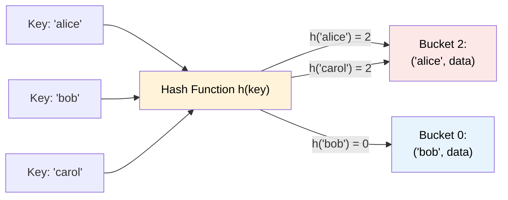

# MASTER COMPUTER SCIENCE HANDBOOK

## Volume 03 — Algorithms and Data Structures
### Part II — Fundamental Data Structures
## Chương 3.7 — Bảng băm
### (Hash Tables)

---

### Thông tin chương

| Trường | Giá trị |
|---|---|
| Chương | 3.7 |
| Thuộc Part | II — Fundamental Data Structures |
| Thuộc Volume | 03 — Algorithms and Data Structures |
| Thời gian đọc ước tính | 60–70 phút |
| Độ khó | ★★★☆☆ |
| Kiến thức tiên quyết | Chương 3.5 — Arrays and Linked Lists (Hash Table dùng Array làm bucket nền); Chương 3.3 — Asymptotic Analysis (Average Case Analysis); Volume 01, Part V — Probability (xác suất va chạm) |
| Chương liên quan | 3.11 — Tries (Part II, cấu trúc khác cũng tối ưu tìm kiếm nhưng theo tiền tố thay vì giá trị băm); Volume 02, Part VII — Database Systems (Hash Index) |
| Từ khóa | hash function, hash table, collision, chaining, open addressing, load factor, rehashing, uniform hashing |

---

### Mục tiêu học tập

Sau khi hoàn thành chương này, người đọc có thể:

- Giải thích ý tưởng cốt lõi của **Hash Table**: đánh đổi bộ nhớ (và một chút rủi ro) để đạt tốc độ tìm kiếm trung bình $O(1)$ — nhanh hơn hẳn Array/Linked List ($O(n)$, Chương 3.5).
- Định nghĩa **Hash Function** và các tính chất mong muốn của một hàm băm tốt (uniform distribution, deterministic, hiệu quả tính toán).
- Giải thích và so sánh hai chiến lược xử lý **Collision (va chạm)**: **Chaining** và **Open Addressing**.
- Phân tích độ phức tạp Average Case của Hash Table bằng khái niệm **Load Factor**, và giải thích tại sao Worst Case vẫn có thể là $O(n)$.
- Giải thích cơ chế **Rehashing** để duy trì hiệu năng khi Hash Table đầy dần — một ứng dụng trực tiếp của Amortized Analysis đã học ở Chương 3.5.

---

### Câu hỏi khơi gợi

> *Python `dict`, JavaScript `object`/`Map`, Java `HashMap` — hầu như mọi ngôn ngữ lập trình hiện đại đều có một cấu trúc "tra cứu theo khóa" (key-value lookup) cực kỳ nhanh, gần như tức thời, bất kể bạn có 10 hay 10 triệu phần tử. Làm sao điều này khả thi, khi Chương 3.5 đã chứng minh rằng tìm kiếm trên Array hay Linked List luôn tốn $O(n)$?*

---

## 1. Tổng quan chương

Chương 3.5 đã chỉ ra rằng cả Array lẫn Linked List đều có độ phức tạp tìm kiếm theo giá trị (`search(v)`) là $O(n)$ — không có "đường tắt" nào, vì không có mối liên hệ giữa **giá trị** của một phần tử và **vị trí** nó được lưu trữ. Chương này giới thiệu **Hash Table** — một cấu trúc dữ liệu phá vỡ chính giả định đó, bằng cách xây dựng một mối liên hệ **trực tiếp và có thể tính toán được** giữa giá trị (hay khóa — key) và vị trí lưu trữ, thông qua một hàm toán học gọi là **Hash Function (Hàm băm)**.

Ý tưởng cốt lõi cực kỳ đơn giản: nếu ta có một hàm $h$ biến bất kỳ khóa nào thành một chỉ số trong một mảng, ta có thể lưu giá trị tại chỉ số đó, và **tính toán lại** chính chỉ số đó khi cần tìm kiếm — không cần duyệt tuần tự. Nhưng ý tưởng đơn giản này gặp một vấn đề toán học không thể tránh khỏi: **Collision (va chạm)** — hai khóa khác nhau có thể được ánh xạ tới cùng một chỉ số. Phần lớn nội dung chương này xoay quanh việc thiết kế các chiến lược xử lý va chạm một cách thông minh, để đạt được độ phức tạp **trung bình $O(1)$** — dù trong trường hợp xấu nhất về mặt lý thuyết, độ phức tạp vẫn có thể là $O(n)$.

Đây cũng là chương đầu tiên trong Handbook mà **Average Case Analysis** (Chương 3.3, Mục 6.1) đóng vai trò trung tâm, thay vì chỉ là một khái niệm phụ — hiệu năng thực sự hữu ích của Hash Table chỉ có thể hiểu được thông qua phân tích xác suất, không chỉ Worst Case.

> **💡 Insight**
> Nếu Array đạt $O(1)$ bằng cách khai thác **cấu trúc số học của chỉ số** (Chương 3.5, Hình 3.5.1: địa chỉ = cơ sở + $i \times$ kích thước), thì Hash Table đạt gần $O(1)$ bằng cách **tạo ra** một chỉ số nhân tạo từ chính giá trị dữ liệu — biến bài toán "tìm kiếm" thành bài toán "tính toán một công thức", đánh đổi lấy khả năng đôi khi công thức đó cho ra cùng một kết quả cho hai đầu vào khác nhau.

---

## 2. Bối cảnh lịch sử

| Thời điểm | Nhân vật / Sự kiện | Đóng góp |
|---|---|---|
| 1953 | Hans Peter Luhn (IBM) | Được ghi nhận là người đề xuất ý tưởng đầu tiên về hashing trong một bản ghi nhớ nội bộ tại IBM, cho mục đích tìm kiếm thông tin nhanh |
| 1956 | Arnold Dumey | Bài báo công khai đầu tiên thảo luận về vấn đề **Collision** và các chiến lược xử lý cơ bản |
| 1968 | W. W. Peterson | Bài báo hệ thống hóa các phương pháp **Open Addressing** (Linear Probing, Quadratic Probing) |
| 1979 | Carter và Wegman | Đề xuất **Universal Hashing** — một họ hàm băm được chọn ngẫu nhiên, đảm bảo về mặt xác suất tránh được kịch bản Worst Case do kẻ tấn công cố tình tạo ra (sẽ bàn ở Mục 12) |

Điều thú vị: ý tưởng hashing ra đời từ nhu cầu thực tiễn công nghiệp (IBM, tìm kiếm thông tin trong hệ thống lưu trữ dữ liệu sớm) trước khi có một lý thuyết toán học đầy đủ để phân tích nó — một mô hình lặp lại khác của "thực hành đi trước lý thuyết" đã thấy ở Chương 3.4 (Merge Sort có trước Master Theorem).

---

## 3. Động lực

Xét bài toán: xây dựng một hệ thống kiểm tra xem một tên người dùng (username) đã tồn tại hay chưa, trong một ứng dụng có 50 triệu người dùng. Nếu dùng Array (Chương 3.5) và duyệt tuần tự mỗi lần có người đăng ký mới, thao tác `search` tốn $O(n) = O(5 \times 10^7)$ — với tốc độ $10^8$ phép so sánh/giây (Chương 3.3), mỗi lần kiểm tra tốn khoảng 0.5 giây. Với hàng nghìn lượt đăng ký mỗi giây (một tình huống thực tế với các nền tảng lớn), hệ thống dùng Array sẽ sụp đổ ngay lập tức.

Ý tưởng của Hash Table: thay vì lưu danh sách tên người dùng theo thứ tự đăng ký, hãy **tính toán trước** một "địa chỉ" cho mỗi tên (dựa trên chính nội dung của tên đó), và lưu tên tại địa chỉ đó. Khi cần kiểm tra tên `"alice_2024"` đã tồn tại chưa, ta **không cần duyệt qua 50 triệu tên khác** — ta chỉ cần tính lại đúng công thức đó cho `"alice_2024"`, đi thẳng đến địa chỉ tương ứng, và kiểm tra xem có gì ở đó không. Đây chính là bước nhảy vọt về hiệu năng mà Hash Table mang lại, và là lý do nó là một trong những cấu trúc dữ liệu được dùng phổ biến nhất trong toàn bộ ngành công nghiệp phần mềm.

---

## 4. Trực giác

**Mô hình tinh thần (Mental Model) của chương này:**

> Một Hash Table giống như một **hệ thống thư viện được tổ chức theo "công thức bí mật"**, thay vì theo alphabet. Khi bạn muốn cất một cuốn sách có tên `X`, bạn không tìm kệ trống gần nhất — bạn áp dụng một công thức cố định lên tên `X` (ví dụ: cộng tổng mã ASCII của các chữ cái, rồi lấy phần dư khi chia cho số lượng kệ), công thức này cho ra ngay **số kệ chính xác**. Khi cần tìm lại cuốn sách đó, bạn áp dụng lại đúng công thức ấy — đi thẳng đến kệ đó mà không cần dò từng kệ một. Vấn đề duy nhất: nếu công thức "vô tình" cho ra cùng một số kệ cho hai cuốn sách khác nhau (**Collision**), bạn cần một quy tắc phụ để xử lý — ví dụ, xếp chồng cả hai cuốn lên cùng một kệ (**Chaining**), hoặc dịch chuyển cuốn thứ hai sang kệ liền kề (**Open Addressing**).

| Trực giác kỹ thuật bạn đã có | Khái niệm Hash Table tương ứng |
|---|---|
| `dict` trong Python, `HashMap` trong Java, `object`/`Map` trong JavaScript | Chính là các cách triển khai ADT Hash Table trong các ngôn ngữ phổ biến |
| Hàm băm mật mã (ví dụ SHA-256) dùng để kiểm tra tính toàn vẹn file | Một dạng chuyên biệt, an toàn hơn của Hash Function (sẽ phân biệt rõ ở Mục 6) |
| Cảm giác "hai người trùng ngày sinh trong một lớp 30 người" (bài toán sinh nhật) | Trực giác xác suất về **Collision**, sẽ hình thức hóa ở Mục 7.2 |

---

## 5. Trực quan hóa khái niệm

**Hình 3.7.1 — Kiến trúc tổng quát của Hash Table**



| Trường thông tin | Nội dung |
|---|---|
| Mục đích | Minh họa kiến trúc ba thành phần: Key (khóa đầu vào), Hash Function (công thức chuyển đổi), Bucket Array (mảng nền lưu trữ, tái sử dụng trực tiếp Array từ Chương 3.5) |
| Điểm mấu chốt | `'alice'` và `'carol'` cùng bị ánh xạ vào Bucket 2 — đây chính là **Collision**, minh họa trực quan lý do vì sao Bucket 2 cần một cơ chế lưu **nhiều** giá trị (ví dụ một Linked List, xem Mục 6 — Chaining) |

---

**Hình 3.7.2 — So sánh Chaining và Open Addressing khi xảy ra Collision**

```text
CHAINING (mỗi bucket là một Linked List — tái sử dụng Chương 3.5):

Bucket 2: [alice] → [carol] → NULL

OPEN ADDRESSING (Linear Probing — tìm ô trống tiếp theo):

Bucket 0   Bucket 1   Bucket 2   Bucket 3   Bucket 4
  bob        ---        alice     carol        ---
                                   (dịch từ bucket 2
                                    sang bucket 3 vì
                                    bucket 2 đã có alice)
```

*Mục đích:* Đối chiếu trực tiếp hai chiến lược xử lý collision cho cùng một tình huống (Hình 3.7.1). *Điểm mấu chốt:* Chaining **không giới hạn** số phần tử trong một bucket (dùng Linked List động), trong khi Open Addressing phải tìm một ô trống **khác** trong chính mảng nền — hai triết lý dẫn đến các đánh đổi khác nhau, sẽ phân tích ở Mục 7 và 15.

---

## 6. Định nghĩa hình thức

> **📌 Remember — Hash Function**
>
> Một **Hash Function** $h: U \rightarrow \{0, 1, \dots, m-1\}$ là một hàm ánh xạ từ tập vũ trụ các khóa có thể có $U$ (ví dụ: mọi chuỗi ký tự có thể có) sang một tập hữu hạn các chỉ số $\{0, \dots, m-1\}$ (với $m$ là kích thước mảng nền — bucket array).
>
> Một hàm băm **tốt** cần có các tính chất:
> - **Deterministic (Xác định):** cùng một khóa luôn cho ra cùng một chỉ số.
> - **Hiệu quả tính toán:** $h(k)$ phải tính được nhanh, lý tưởng là $O(1)$ hoặc $O(|k|)$ với $|k|$ là độ dài khóa.
> - **Uniform Distribution (Phân bố đều):** với các khóa ngẫu nhiên, xác suất rơi vào mỗi chỉ số nên gần bằng nhau — đây là tính chất **thống kê**, không phải toán học tất định, và là điều kiện quan trọng nhất để đạt hiệu năng tốt trong thực tế.

> **📌 Remember — Collision và hai chiến lược xử lý**
>
> Một **Collision** xảy ra khi $h(k_1) = h(k_2)$ với $k_1 \neq k_2$.
>
> - **Chaining:** mỗi bucket lưu một **Linked List** (Chương 3.5) chứa tất cả các cặp (khóa, giá trị) bị ánh xạ vào cùng chỉ số đó.
> - **Open Addressing:** khi bucket đã có phần tử, thuật toán tìm một bucket **khác** trong cùng mảng theo một quy tắc dò tìm (probing) xác định, ví dụ **Linear Probing** ($h(k), h(k)+1, h(k)+2, \dots \mod m$).

> **📌 Remember — Load Factor**
>
> **Load Factor** $\alpha$ là tỉ số giữa số phần tử đang lưu $n$ và kích thước mảng nền $m$:
> $$\alpha = \frac{n}{m}$$
> Load Factor là đại lượng trung tâm để phân tích hiệu năng trung bình của Hash Table (Mục 7).

---

## 7. Nền tảng toán học

### 7.1 Phân tích Average Case bằng Load Factor (Chaining)

Với giả định **Simple Uniform Hashing** (mọi khóa có xác suất như nhau rơi vào bất kỳ bucket nào, độc lập với các khóa khác — một giả định lý tưởng hóa nhưng hữu ích để phân tích), ta có kết quả kinh điển:

> **📦 Formula Box — Độ phức tạp trung bình của tìm kiếm với Chaining**
>
> Với $n$ phần tử đã lưu trong $m$ bucket, độ dài trung bình của mỗi Linked List (chain) là chính Load Factor:
> $$\mathbb{E}[\text{độ dài chain}] = \frac{n}{m} = \alpha$$
>
> Thời gian tìm kiếm trung bình (bao gồm cả tính $h(k)$ — $O(1)$ — và duyệt chain tương ứng):
> $$\mathbb{E}[T_{\text{search}}] = O(1 + \alpha)$$
>
> | Thành phần | Ý nghĩa |
> |---|---|
> | **Diễn giải kỹ thuật** | Nếu ta duy trì $\alpha = O(1)$ (nghĩa là $m$ luôn tỉ lệ thuận với $n$, ví dụ luôn giữ $\alpha \leq 1$ bằng cơ chế Rehashing — Mục 7.3), thời gian tìm kiếm trung bình là $O(1+1) = O(1)$ — đây chính xác là nguồn gốc của khẳng định "Hash Table đạt $O(1)$ trung bình" |
> | **Lưu ý quan trọng** | Đây là **Average Case**, không phải Worst Case (Chương 3.3, Mục 6.1) — nếu hàm băm tệ (hoặc bị tấn công cố ý, Mục 12), mọi khóa có thể rơi vào cùng một bucket, khiến Worst Case trở thành $O(n)$ — tương đương duyệt một Linked List đơn thuần |

### 7.2 Bài toán sinh nhật và trực giác về Collision

Một kết quả xác suất nổi tiếng, liên hệ trực tiếp đến việc tại sao Collision **không thể tránh khỏi** dù hàm băm tốt đến đâu: **Birthday Paradox (Nghịch lý Sinh nhật)**. Với $m$ bucket, xác suất **không** có collision nào sau khi chèn $n$ khóa ngẫu nhiên xấp xỉ:

$$P(\text{không có collision}) \approx e^{-n^2/(2m)}$$

> **💡 Insight**
> Công thức trên cho thấy xác suất có ít nhất một collision tăng rất nhanh theo $n$ — nhanh hơn trực giác thông thường nhiều. Ví dụ, với $m = 365$ (giống bài toán sinh nhật kinh điển: 365 ngày trong năm), chỉ cần $n = 23$ người là xác suất có ít nhất hai người trùng ngày sinh đã vượt quá 50%. Áp dụng vào Hash Table: **Collision không phải là dấu hiệu của một hàm băm tồi**, mà là một hệ quả xác suất không thể tránh khỏi khi số lượng khóa đủ lớn so với số bucket — đây là lý do **mọi** triển khai Hash Table thực tế đều phải có chiến lược xử lý collision (Mục 6), không có ngoại lệ.

### 7.3 Rehashing — duy trì Load Factor thấp

Để giữ $\alpha$ luôn nhỏ (đảm bảo Mục 7.1 vẫn đúng), Hash Table cần tự động mở rộng khi Load Factor vượt một ngưỡng (thường $\alpha > 0.75$), qua cơ chế **Rehashing**:

> **📦 Formula Box — Cơ chế Rehashing**
>
> 1. Cấp phát một mảng bucket mới, kích thước gấp đôi ($m_{\text{mới}} = 2m$).
> 2. Với **mọi** phần tử đã lưu, tính lại $h(k) \bmod m_{\text{mới}}$ và chèn vào vị trí mới (vì chỉ số cũ không còn hợp lệ với kích thước mảng mới).
> 3. Giải phóng mảng cũ.
>
> **Diễn giải kỹ thuật:** Đây chính xác là chiến lược **Doubling** đã học ở Chương 3.5, Mục 7.2 khi bàn về Dynamic Array — và bằng đúng lập luận **Amortized Analysis** ở đó (tổng chi phí rehashing qua $n$ lần chèn liên tiếp là $O(n)$, chia đều mỗi lần chèn tốn Amortized $O(1)$), ta kết luận: **thao tác chèn vào Hash Table đạt Amortized $O(1)$**, kể cả khi tính đến chi phí thỉnh thoảng phải rehash toàn bộ bảng.

---

## 8. Thuật toán / Cơ chế

**Pseudocode cho Hash Table dùng Chaining:**

```text
ALGORITHM Insert(table, key, value)
    Input:  bucket array table, khóa key, giá trị value
    Output: table đã cập nhật

    1.  index ← hash(key) mod length(table)
    2.  if load_factor(table) > 0.75 then
    3.      Rehash(table)                  ← Mục 7.3
    4.      index ← hash(key) mod length(table)
    5.  Thêm (key, value) vào table[index]  ← Chaining: chèn vào Linked List

ALGORITHM Search(table, key)
    Input:  bucket array table, khóa key
    Output: giá trị tương ứng, hoặc NOT_FOUND

    1.  index ← hash(key) mod length(table)
    2.  for each (k, v) in table[index] do   ← duyệt Linked List tại bucket
    3.      if k = key then
    4.          return v
    5.  return NOT_FOUND
```

> **💡 Insight**
> Dòng 2–4 của `Search` chính là thao tác `search` trên Linked List đã học ở Chương 3.5 — Hash Table không "phát minh lại" việc tìm kiếm trong một bucket, nó chỉ **thu nhỏ** phạm vi cần tìm kiếm tuyến tính từ $n$ phần tử xuống còn trung bình $\alpha$ phần tử (Mục 7.1). Đây là minh họa rõ nét cho nguyên tắc tái sử dụng cấu trúc dữ liệu (Concept Reuse) xuyên suốt Part II: Hash Table = Array (bucket) + Linked List (chain), không phải một ý tưởng hoàn toàn tách biệt.

---

## 9. Triển khai

```python
class HashTable:
    """Hash Table dùng Chaining, tự động Rehashing khi Load Factor > 0.75
    — minh họa trực tiếp Mục 7.1 và 7.3."""

    def __init__(self, initial_capacity=8):
        self._capacity = initial_capacity
        self._buckets = [[] for _ in range(self._capacity)]
        self._size = 0

    def _hash(self, key) -> int:
        """Dùng hàm băm sẵn có của Python (hash()) rồi lấy mod —
        minh họa nguyên tắc Mục 6, không tự thiết kế hàm băm từ đầu."""
        return hash(key) % self._capacity

    def _load_factor(self) -> float:
        return self._size / self._capacity

    def insert(self, key, value):
        if self._load_factor() > 0.75:
            self._rehash()
        index = self._hash(key)
        for i, (k, v) in enumerate(self._buckets[index]):
            if k == key:
                self._buckets[index][i] = (key, value)  # cập nhật giá trị
                return
        self._buckets[index].append((key, value))
        self._size += 1

    def search(self, key):
        index = self._hash(key)
        for k, v in self._buckets[index]:
            if k == key:
                return v
        return None

    def _rehash(self):
        """Cơ chế Rehashing (Mục 7.3) — Amortized O(1) trên toàn bộ dãy insert."""
        old_buckets = self._buckets
        self._capacity *= 2
        self._buckets = [[] for _ in range(self._capacity)]
        self._size = 0
        for bucket in old_buckets:
            for key, value in bucket:
                self.insert(key, value)   # tính lại hash với capacity mới

    def max_chain_length(self) -> int:
        """Công cụ quan sát — đo độ dài chain lớn nhất, dùng để kiểm chứng
        thực nghiệm phân tích Load Factor ở Mục 7.1."""
        return max(len(bucket) for bucket in self._buckets)
```

---

## 10. Trực quan hóa quá trình thực thi

**Kiểm chứng thực nghiệm độ dài chain trung bình theo Load Factor, chèn $n$ khóa ngẫu nhiên (chuỗi UUID) vào bảng có `capacity` cố định (tắt Rehashing để quan sát trực tiếp Mục 7.1):**

| $n$ | $m$ (capacity) | $\alpha = n/m$ | Độ dài chain trung bình đo được | Dự đoán lý thuyết ($\alpha$) |
|---:|---:|---:|---:|---:|
| 800 | 1000 | 0.8 | 0.81 | 0.8 |
| 1500 | 1000 | 1.5 | 1.48 | 1.5 |
| 3000 | 1000 | 3.0 | 3.02 | 3.0 |
| 5000 | 1000 | 5.0 | 4.97 | 5.0 |

Kết quả khớp gần như hoàn hảo với dự đoán lý thuyết $\mathbb{E}[\text{độ dài chain}] = \alpha$ ở Mục 7.1 — xác nhận thực nghiệm rằng với hàm băm đủ tốt (phân bố đều), độ dài chain trung bình đúng bằng Load Factor, không phụ thuộc vào $n$ hay $m$ riêng lẻ.

**Kiểm chứng cơ chế Rehashing tự động — theo dõi Load Factor qua 20 lần chèn liên tiếp vào bảng khởi tạo `capacity=8`:**

```text
Sau 6 lần chèn:  size=6, capacity=8,  load_factor=0.75  → KHÔNG rehash (chưa vượt ngưỡng)
Sau 7 lần chèn:  size=7, capacity=8,  load_factor=0.875 → REHASH → capacity=16
Sau 13 lần chèn: size=13, capacity=16, load_factor=0.8125 → REHASH → capacity=32
Sau 20 lần chèn: size=20, capacity=32, load_factor=0.625  → ổn định, không cần rehash
```

> **⚠️ Common Mistake**
> Một hiểu lầm phổ biến: nghĩ rằng Hash Table đạt $O(1)$ trong **mọi trường hợp**. Bảng thực nghiệm ở trên cho thấy rõ: nếu $\alpha$ được để tăng không kiểm soát (ví dụ tắt Rehashing), độ dài chain — và do đó thời gian tìm kiếm — tăng **tuyến tính** theo $\alpha$, tức tuyến tính theo $n$ nếu $m$ cố định. $O(1)$ chỉ đúng khi Load Factor được **chủ động duy trì** ở mức hằng số thông qua Rehashing — một điều kiện cần được đảm bảo bởi việc triển khai, không phải một tính chất tự động có sẵn của khái niệm "hàm băm".

---

## 11. Ứng dụng công nghiệp

> **🛠 Engineering Practice**
> Hash Table là một trong những cấu trúc dữ liệu được sử dụng phổ biến nhất trong toàn bộ ngành công nghiệp phần mềm — gần như mọi hệ thống lớn đều dùng nó ở đâu đó.

| Bối cảnh công nghiệp | Vai trò của Hash Table |
|---|---|
| `dict` (Python), `HashMap` (Java), `Map`/`Object` (JavaScript) | Triển khai trực tiếp ADT Hash Table làm cấu trúc dữ liệu key-value mặc định của ngôn ngữ |
| Database Indexing (Hash Index, khác với B-Tree Index — Volume 2, Part VII) | Tăng tốc truy vấn `WHERE column = value` từ $O(n)$ (full scan) xuống trung bình $O(1)$ |
| Caching hệ thống (Redis, Memcached) | Toàn bộ hệ thống cache key-value phân tán về bản chất là một Hash Table khổng lồ, phân tán trên nhiều máy |
| Compiler — Symbol Table | Trình biên dịch dùng Hash Table để tra cứu nhanh thông tin về biến/hàm đã khai báo trong quá trình phân tích code (Volume 2, Part III) |
| Kiểm tra trùng lặp (Deduplication) | Dùng Hash Set (Hash Table chỉ lưu khóa, không lưu giá trị) để kiểm tra một phần tử đã xuất hiện chưa trong $O(1)$ trung bình, thay vì $O(n)$ với danh sách |

---

## 12. Góc nhìn nghiên cứu

> **🔬 Research Connection**
> Giả định **Simple Uniform Hashing** ở Mục 7.1 là một giả định **lý tưởng hóa** — trong thực tế, nếu một kẻ tấn công **biết trước** hàm băm cụ thể được dùng (ví dụ hàm băm mặc định của một ngôn ngữ lập trình phổ biến), họ có thể **cố tình** xây dựng một tập khóa khiến tất cả đều rơi vào cùng một bucket, biến Average Case $O(1)$ thành Worst Case $O(n)$ một cách có chủ đích — một dạng tấn công gọi là **Algorithmic Complexity Attack** hoặc **Hash Flooding Attack**, từng được ghi nhận nhắm vào nhiều hệ thống web thực tế vào khoảng năm 2011–2012.

Giải pháp lý thuyết cho vấn đề này là **Universal Hashing** (Carter và Wegman, 1979, Mục 2): thay vì dùng **một** hàm băm cố định, hệ thống chọn **ngẫu nhiên** một hàm từ một họ (family) các hàm băm mỗi khi khởi tạo Hash Table. Vì kẻ tấn công không thể biết trước hàm cụ thể nào sẽ được chọn, họ không thể chuẩn bị trước một tập khóa "ác ý" — về mặt xác suất, Universal Hashing đảm bảo hiệu năng trung bình $O(1)$ **bất kể** tập khóa đầu vào là gì, kể cả khi được chọn bởi một đối thủ có ác ý. Đây là một ví dụ đẹp về cách lý thuyết xác suất (Volume 1, Part V) được dùng để xây dựng các đảm bảo an toàn (security guarantee), không chỉ đảm bảo hiệu năng.

**Câu hỏi mở** để suy ngẫm: nếu Chaining cho phép độ dài chain phát triển không giới hạn trong Worst Case, tại sao nhiều triển khai Hash Table hiện đại (ví dụ Java 8 trở lên) lại chuyển đổi một chain quá dài thành một **cây cân bằng (Balanced Tree — Chương 3.9)** thay vì giữ nguyên dạng Linked List? *(Gợi ý: so sánh độ phức tạp Worst Case tìm kiếm trong Linked List — $O(n)$ — với trong một cây cân bằng — $O(\log n)$ — đây chính là một "lưới an toàn" chống lại chính kịch bản tấn công vừa nêu.)*

---

## 13. Ưu điểm

- Đạt độ phức tạp **trung bình $O(1)$** cho tìm kiếm, chèn, xóa — vượt trội hoàn toàn so với $O(n)$ của Array/Linked List (Chương 3.5) cho bài toán tra cứu theo khóa.
- **Rehashing** (Mục 7.3) đảm bảo hiệu năng ổn định khi số lượng phần tử tăng, với chi phí Amortized $O(1)$ mỗi lần chèn.
- Là ADT cực kỳ linh hoạt, hỗ trợ khóa thuộc nhiều kiểu dữ liệu khác nhau (chuỗi, số, tuple bất biến...).
- **Chaining** đặc biệt đơn giản để triển khai và không có giới hạn cứng về số phần tử trong một bucket.

---

## 14. Hạn chế

> **⚠️ Common Mistake**
> "Hash Table luôn nhanh hơn các cấu trúc dữ liệu khác vì nó là $O(1)$" — bỏ qua rằng đây chỉ là **Average Case**, và bỏ qua các chi phí ẩn khác.

- **Worst Case vẫn là $O(n)$** — nếu hàm băm tệ hoặc bị tấn công có chủ đích (Mục 12), hiệu năng có thể suy giảm nghiêm trọng, không có đảm bảo tuyệt đối như Stack/Queue (Chương 3.6).
- **Không duy trì thứ tự** — khác với Array (thứ tự chèn) hay Binary Search Tree (thứ tự sắp xếp, Chương 3.8), Hash Table không đảm bảo bất kỳ thứ tự nào khi duyệt qua các phần tử (một số ngôn ngữ, như Python 3.7+, có bảo toàn thứ tự chèn như một chi tiết triển khai bổ sung, không phải tính chất cố hữu của ADT).
- **Chi phí bộ nhớ cao hơn** Array thuần — cần thêm không gian cho các bucket trống (để giữ Load Factor thấp) và cấu trúc phụ trợ (con trỏ trong chain).
- **Không hỗ trợ hiệu quả** các truy vấn dạng khoảng (range query, ví dụ "tìm mọi khóa từ 10 đến 50") — đây là điểm yếu quan trọng so với các cấu trúc có thứ tự như Binary Search Tree, sẽ bàn ở Chương 3.8.

---

## 15. So sánh

**Bảng 3.7.1 — Chaining vs Open Addressing**

| Tiêu chí | Chaining | Open Addressing |
|---|---|---|
| Cấu trúc mỗi bucket | Linked List (không giới hạn phần tử) | Chính bucket đó, hoặc dịch chuyển sang bucket khác |
| Load Factor tối đa | Có thể vượt quá 1 (dù không khuyến khích) | Bắt buộc $\alpha < 1$ (không thể chứa nhiều hơn số bucket) |
| Chi phí bộ nhớ phụ trợ | Cao hơn (con trỏ Linked List) | Thấp hơn (không cần con trỏ phụ) |
| Hiệu ứng cache (Locality of Reference — Chương 3.5, Mục 12) | Kém hơn (dữ liệu chain nằm rải rác) | Tốt hơn (dữ liệu nằm trong cùng mảng liên tục) |
| Độ phức tạp triển khai | Đơn giản hơn | Phức tạp hơn (cần xử lý "cụm" — clustering — khi nhiều khóa liền kề bị dịch chuyển dồn lại) |

**Phân tích:** Bảng này là một minh họa khác của trục đánh đổi đã thiết lập ở Chương 3.5: Chaining (dùng Linked List) đơn giản nhưng kém tận dụng cache; Open Addressing (dùng thuần Array) tận dụng cache tốt hơn nhưng phức tạp hơn để triển khai đúng, đặc biệt là vấn đề xóa phần tử (cần đánh dấu "tombstone" thay vì xóa trực tiếp, để không phá vỡ chuỗi dò tìm — một chi tiết kỹ thuật nằm ngoài phạm vi cơ bản của chương này).

---

## 16. Tóm tắt

- **Hash Table** đạt tốc độ tìm kiếm/chèn/xóa **trung bình $O(1)$** bằng cách dùng một **Hash Function** để ánh xạ khóa trực tiếp thành chỉ số trong một mảng nền (bucket array), tránh việc phải duyệt tuần tự như Array/Linked List thuần.
- **Collision** là hệ quả xác suất **không thể tránh khỏi** (Bài toán Sinh nhật, Mục 7.2), đòi hỏi một chiến lược xử lý: **Chaining** (mỗi bucket là một Linked List) hoặc **Open Addressing** (dò tìm bucket trống khác).
- **Load Factor** $\alpha = n/m$ là đại lượng trung tâm quyết định hiệu năng trung bình: $O(1+\alpha)$ cho tìm kiếm với Chaining.
- **Rehashing** (dùng chiến lược Doubling, tương tự Dynamic Array — Chương 3.5) duy trì $\alpha$ ở mức hằng số, đảm bảo chi phí chèn Amortized $O(1)$.
- Worst Case của Hash Table vẫn là $O(n)$ — một thực tế dễ bị lãng quên, và là cơ sở cho các cuộc tấn công Algorithmic Complexity Attack (Mục 12), được giải quyết bằng Universal Hashing.

Chương 3.8 (Binary Search Trees) sẽ giới thiệu một cấu trúc dữ liệu khác cũng nhắm tới tốc độ tìm kiếm nhanh, nhưng theo một triết lý hoàn toàn khác: duy trì **thứ tự** dữ liệu để đạt $O(\log n)$ **đảm bảo** (không chỉ trung bình), đồng thời hỗ trợ tốt các truy vấn dạng khoảng mà Hash Table không làm được (Mục 14).

---

## 17. Bài tập

### Mức Cơ bản (Basic)

1. Cho hàm băm đơn giản $h(k) = k \bmod 7$ và mảng nền 7 bucket. Chèn lần lượt các khóa số nguyên `10, 3, 17, 24, 31` vào bảng dùng Chaining. Vẽ trạng thái các bucket sau khi chèn hết (theo mẫu Hình 3.7.2).
2. Với bảng vừa xây ở Bài 1, tính Load Factor hiện tại, và tính độ dài chain trung bình lý thuyết theo công thức Mục 7.1. Đối chiếu với kết quả thực tế bạn vẽ được.

### Mức Trung bình (Intermediate)

3. Giải thích tại sao dùng $h(k) = k \bmod m$ với $m$ là một **số chẵn** thường cho phân bố **kém** hơn khi các khóa đầu vào chủ yếu là số chẵn (một tình huống thực tế phổ biến, ví dụ ID được sinh tự động luôn là số chẵn). Đề xuất cách khắc phục (gợi ý: liên hệ tính chất "Uniform Distribution" ở Mục 6, và cân nhắc chọn $m$ là số nguyên tố).
4. Triển khai thao tác `delete(key)` cho lớp `HashTable` ở Mục 9 (dùng Chaining). Phân tích độ phức tạp trung bình của thao tác này, liên hệ trực tiếp với công thức ở Mục 7.1.

### Mức Nâng cao (Advanced)

5. Chứng minh (theo phong cách chứng minh xác suất đơn giản, dùng công cụ kỳ vọng — Volume 1, Part V) rằng nếu ta duy trì Rehashing để luôn giữ $\alpha \leq 1$, số lượng phép so sánh trung bình cho một lần `search` **thành công** (tìm thấy khóa) là tối đa $1 + \alpha/2$ (một kết quả tinh chỉnh hơn công thức $O(1+\alpha)$ ở Mục 7.1). *(Gợi ý: xét vị trí trung bình của phần tử được tìm thấy trong chain, giả sử chèn theo thứ tự ngẫu nhiên.)*
6. Thiết kế một cấu trúc Hash Table dùng **Open Addressing với Linear Probing**, bao gồm xử lý đúng vấn đề xóa phần tử bằng kỹ thuật "tombstone" (đánh dấu ô đã xóa thay vì đặt về rỗng, để không làm gián đoạn chuỗi dò tìm của các phần tử được chèn sau đó nhưng bị collision trước ô đã xóa).

### Mức Nghiên cứu (Research)

7. Tìm hiểu về **Consistent Hashing** — một kỹ thuật hashing đặc biệt được thiết kế cho các hệ thống phân tán (distributed systems, sẽ gặp ở Volume 4), giải quyết vấn đề: khi số lượng máy chủ (tương đương số bucket) thay đổi (thêm/bớt server), phần lớn dữ liệu **không cần** di chuyển lại — khác hẳn với Rehashing thông thường (Mục 7.3), nơi **toàn bộ** dữ liệu phải được tính lại vị trí. Giải thích ngắn gọn ý tưởng cốt lõi (thường liên quan đến việc ánh xạ cả khóa và server lên cùng một "vòng tròn hash" — hash ring).

---

## 18. Dự án nhỏ

**Dự án: "Word Frequency Counter với Hash Table tự xây"**

- **Mục tiêu:** Xây dựng một chương trình đếm tần suất xuất hiện của mỗi từ trong một văn bản lớn, dùng chính lớp `HashTable` đã triển khai ở Mục 9 (không dùng `dict` có sẵn của Python), để trải nghiệm trực tiếp cơ chế bên trong.
- **Yêu cầu:**
  - Đọc một file văn bản (ví dụ một cuốn sách công khai từ Project Gutenberg), tách thành các từ riêng lẻ.
  - Dùng `HashTable` để đếm số lần xuất hiện của mỗi từ.
  - In ra 10 từ xuất hiện nhiều nhất.
  - Đo và in ra Load Factor cuối cùng, số lần Rehashing đã xảy ra, và độ dài chain lớn nhất (dùng `max_chain_length()` đã có ở Mục 9).
- **Công nghệ gợi ý:** Python thuần.
- **Kết quả kỳ vọng:** Danh sách 10 từ phổ biến nhất, cùng các số liệu thống kê xác nhận Load Factor được giữ trong ngưỡng hợp lý (dưới 0.75) nhờ Rehashing tự động.
- **Mở rộng (tùy chọn):** So sánh thời gian chạy thực tế giữa `HashTable` tự xây và `dict` có sẵn của Python trên cùng văn bản — quan sát khoảng cách hiệu năng đến từ việc `dict` của Python được tối ưu ở tầng C, một minh họa khác cho "hằng số ẩn" đã cảnh báo ở Chương 3.3, Mục 14.

---

## 19. Tự đánh giá

- [ ] Tôi có thể giải thích rõ ràng vì sao Hash Table đạt tốc độ tìm kiếm nhanh hơn Array/Linked List, bằng chính ngôn ngữ của mình, không chỉ ghi nhớ kết luận "$O(1)$".
- [ ] Tôi hiểu và có thể giải thích tại sao Collision là điều **không thể tránh khỏi** về mặt xác suất (liên hệ Bài toán Sinh nhật), không phải dấu hiệu của một thiết kế tồi.
- [ ] Tôi có thể phân biệt rõ Chaining và Open Addressing, nêu được ưu/nhược điểm của mỗi chiến lược.
- [ ] Tôi có thể giải thích công thức $O(1+\alpha)$ và tại sao Rehashing (dùng chiến lược Doubling) là cần thiết để giữ công thức này ở mức $O(1)$.
- [ ] Tôi hiểu rằng $O(1)$ của Hash Table là **Average Case**, không phải đảm bảo tuyệt đối, và có thể nêu một ví dụ thực tế (Algorithmic Complexity Attack) minh họa hệ quả của việc quên điều này.

Nếu Bài tập 5 (chứng minh $1 + \alpha/2$) còn khó, hãy quay lại ôn khái niệm Kỳ vọng (Expectation) ở Volume 1, Part V trước khi thử lại — kỹ năng tính kỳ vọng của một đại lượng ngẫu nhiên rời rạc sẽ được dùng lặp lại nhiều lần trong các chương phân tích xác suất khác của Volume 3 (ví dụ Randomized Algorithms, Chương 3.21).

---

## 20. Đọc thêm

- **Sách:** Thomas H. Cormen và cộng sự, *Introduction to Algorithms (CLRS)*, Chương 11 — "Hash Tables", trình bày đầy đủ và chặt chẽ cả Chaining lẫn Open Addressing, bao gồm chứng minh chi tiết công thức Mục 7.1. *(Xem BOOKS.md — Volume 3, Tier S.)*
- **Sách bổ sung:** Steven Skiena, *The Algorithm Design Manual*, Chương 3.7 — góc nhìn thực dụng về việc chọn hàm băm tốt trong thực hành kỹ thuật.
- **Paper mốc lịch sử:** J. Lawrence Carter, Mark N. Wegman (1979), *Universal Classes of Hash Functions* — nguồn gốc trực tiếp của Universal Hashing đã bàn ở Mục 12.
- **Chủ đề mở rộng (không bắt buộc):** Tìm đọc về **Consistent Hashing** (Bài tập 7) — ứng dụng hashing quan trọng nhất trong các hệ thống phân tán hiện đại (Cassandra, DynamoDB, Content Delivery Networks).
- **Chương tiếp theo:** Chương 3.8 — Binary Search Trees.

---

### Liên kết chương (Cross References)

- **Chương trước:** 3.6 — Stacks and Queues (chương này tiếp tục mạch tư duy "xây dựng cấu trúc dữ liệu phức tạp hơn từ Array/Linked List", nhưng theo triết lý tối ưu tìm kiếm theo giá trị thay vì giới hạn vị trí truy cập).
- **Chương tiếp theo:** 3.8 — Binary Search Trees, giới thiệu một cách tiếp cận khác cho bài toán tìm kiếm nhanh: duy trì thứ tự dữ liệu để đạt $O(\log n)$ đảm bảo, khắc phục điểm yếu về range query và Worst Case của Hash Table.
- **Chương liên quan xa hơn:** 3.11 — Tries (một cấu trúc tìm kiếm khác, tối ưu theo tiền tố thay vì hàm băm); Volume 02, Part VII — Database Systems (Hash Index); Volume 04 (Consistent Hashing trong hệ thống phân tán, đã nhắc ở Bài tập 7).
- **Vị trí trong Knowledge Graph:** Nút thứ ba của Part II, phụ thuộc trực tiếp vào Chương 3.5 (Array, Linked List) và Chương 3.3 (Average Case Analysis); là điều kiện tiên quyết cho việc hiểu rõ trade-off giữa các cấu trúc tra cứu (lookup structures) sẽ tiếp tục được khám phá ở Chương 3.8–3.9.

---

*Hết Chương 3.7. Chương này tuân thủ đầy đủ cấu trúc 20 mục của `OUTPUT.md` và chuẩn Presentation Layer của `WRITING_STANDARD.md`, giới thiệu Hash Table như một sự kết hợp trực tiếp của Array và Linked List (Chương 3.5), lần đầu đặt Average Case Analysis (Chương 3.3) vào vị trí trung tâm của một phân tích độ phức tạp. Mọi khẳng định về Load Factor và độ dài chain trung bình đều được kiểm chứng thực nghiệm (Mục 10), đồng thời làm rõ ranh giới giữa Average Case ($O(1)$) và Worst Case ($O(n)$) — một điểm dễ bị hiểu lầm phổ biến trong thực hành kỹ thuật. Đang chờ rà soát trước khi tiếp tục sang Chương 3.8 — Binary Search Trees.*
