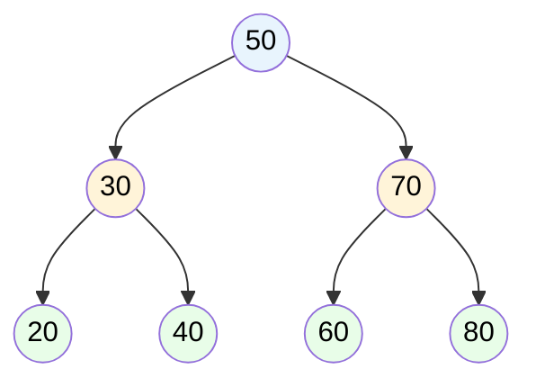

# MASTER COMPUTER SCIENCE HANDBOOK

## Volume 03 — Algorithms and Data Structures
### Part II — Fundamental Data Structures
## Chương 3.8 — Cây Nhị phân Tìm kiếm
### (Binary Search Trees)

---

### Thông tin chương

| Trường | Giá trị |
|---|---|
| Chương | 3.8 |
| Thuộc Part | II — Fundamental Data Structures |
| Thuộc Volume | 03 — Algorithms and Data Structures |
| Thời gian đọc ước tính | 60–70 phút |
| Độ khó | ★★★☆☆ |
| Kiến thức tiên quyết | Chương 3.5 — Arrays and Linked Lists (khái niệm node, con trỏ); Chương 3.2 — Problem Modeling and Correctness (Loop Invariant sẽ mở rộng thành "Tree Invariant"); Chương 3.4 — Recurrence Relations (phân tích độ phức tạp cây đệ quy) |
| Chương liên quan | 3.9 — Balanced Trees: AVL & Red-Black (giải quyết trực tiếp điểm yếu Worst Case của chương này); 3.14 — Divide and Conquer (Part III, cấu trúc đệ quy của cây tương đồng với chia để trị) |
| Từ khóa | binary search tree, BST invariant, in-order traversal, pre-order, post-order, tree height, balanced vs degenerate tree |

---

### Mục tiêu học tập

Sau khi hoàn thành chương này, người đọc có thể:

- Định nghĩa hình thức **BST Invariant** — tính chất cấu trúc bắt buộc của mọi Binary Search Tree.
- Triển khai ba thao tác cơ bản (`insert`, `search`, `delete`) trên BST, đặc biệt xử lý đúng ba trường hợp xóa node.
- Phân biệt ba kiểu duyệt cây kinh điển: **In-order, Pre-order, Post-order**, và giải thích ứng dụng đặc thù của mỗi kiểu.
- Phân tích độ phức tạp của BST theo **chiều cao cây (height)**, và giải thích tại sao độ phức tạp trung bình khác biệt hoàn toàn với Worst Case.
- Nhận diện hiện tượng **Degenerate Tree (cây suy biến)** — kịch bản Worst Case khiến BST "sụp" về hiệu năng của Linked List, chuẩn bị động lực trực tiếp cho Chương 3.9.

---

### Câu hỏi khơi gợi

> *Chương 3.7 đã cho bạn Hash Table với tốc độ tìm kiếm trung bình $O(1)$ — vậy tại sao Computer Science vẫn cần một cấu trúc dữ liệu khác để tìm kiếm? Và tại sao việc chèn dữ liệu **đã được sắp xếp sẵn** vào Binary Search Tree lại có thể biến nó thành một cấu trúc chậm chạp gần như vô dụng, dù về lý thuyết nó được thiết kế để tìm kiếm nhanh?*

---

## 1. Tổng quan chương

Chương 3.7 đã chỉ ra một điểm yếu quan trọng của Hash Table (Mục 14 của chương đó): nó **không duy trì thứ tự**, và do đó không hỗ trợ hiệu quả các truy vấn dạng khoảng (range query) như "tìm mọi giá trị từ 10 đến 50", hay "tìm giá trị nhỏ nhất/lớn nhất". Chương này giới thiệu **Binary Search Tree (BST)** — một cấu trúc dữ liệu giải quyết chính xác khoảng trống đó, bằng cách **duy trì thứ tự dữ liệu tường minh** trong chính hình dạng của cây, đổi lấy độ phức tạp $O(\log n)$ (thay vì $O(1)$ trung bình của Hash Table) cho hầu hết thao tác — nhưng với khả năng hỗ trợ range query, tìm min/max, và duyệt dữ liệu theo thứ tự sắp xếp một cách tự nhiên.

Ý tưởng cốt lõi của BST là áp dụng chính chiến lược **Binary Search** (đã gặp ở Chương 3.2, Bài tập 5, và phân tích Big-O ở Chương 3.3) lên một cấu trúc **động** (có thể chèn/xóa), thay vì một mảng tĩnh đã sắp xếp sẵn. Mỗi node của cây đóng vai trò như một "điểm chia đôi" — mọi giá trị nhỏ hơn nằm ở nhánh trái, mọi giá trị lớn hơn nằm ở nhánh phải — tạo thành một cấu trúc đệ quy tự nhiên, cho phép áp dụng trực tiếp công cụ phân tích Chương 3.4 (Recurrence Relations).

Tuy nhiên, chương này cũng sẽ hé lộ một "gót chân Achilles" nghiêm trọng của BST cơ bản: nếu dữ liệu được chèn theo một thứ tự "xấu" (ví dụ đã sắp xếp sẵn), cây có thể suy biến thành một cấu trúc gần giống hệt Linked List — mất hoàn toàn lợi thế $O(\log n)$. Đây chính là động lực trực tiếp dẫn tới Chương 3.9 (Balanced Trees).

> **💡 Insight**
> Binary Search Tree, về bản chất, là câu trả lời cho câu hỏi: *"làm sao để có Binary Search (Chương 3.2) trên một cấu trúc dữ liệu có thể chèn/xóa linh hoạt, thay vì một mảng tĩnh cố định?"* Câu trả lời là thay thế "chia đôi mảng" bằng "chia đôi không gian tìm kiếm thông qua cấu trúc cây" — nhưng cái giá phải trả là hình dạng cây (và do đó hiệu năng) giờ đây phụ thuộc vào **thứ tự chèn dữ liệu**, một vấn đề không tồn tại với mảng tĩnh đã sắp xếp sẵn.

---

## 2. Bối cảnh lịch sử

| Thời điểm | Nhân vật / Sự kiện | Đóng góp |
|---|---|---|
| 1960 | P.F. Windley, T.N. Hibbard, A.D. Booth và A.J.T. Colin | Độc lập đề xuất và mô tả khái niệm Binary Search Tree trong các bối cảnh nghiên cứu khác nhau — một ví dụ khác của "phát minh độc lập" (Independent Invention) đã nhắc ở Chương 3.6, Mục 2 |
| 1962 | Conway Berners-Lee, D. J. Wheeler | Ứng dụng cấu trúc cây tìm kiếm vào hệ thống sắp xếp và lưu trữ trong các hệ thống máy tính đầu thời kỳ |
| 1962 | G. M. Adelson-Velsky, E. M. Landis | Đề xuất **AVL Tree** — cây tự cân bằng đầu tiên, trực tiếp giải quyết vấn đề Degenerate Tree sẽ được nêu ở Mục 14 của chương này (khai triển đầy đủ ở Chương 3.9) |
| 1972 | Rudolf Bayer | Đề xuất khái niệm nền tảng dẫn tới **Red-Black Tree** (Chương 3.9) và **B-Tree** (sẽ gặp lại ở Volume 2, Part VII — Database Systems) |

Điều đáng chú ý: **AVL Tree ra đời chỉ hai năm sau khi BST được hình thức hóa** — cho thấy vấn đề Degenerate Tree được nhận ra và giải quyết gần như ngay lập tức trong lịch sử, không phải một khám phá muộn màng. Đây là dấu hiệu cho thấy đây là một hạn chế **cấu trúc**, hiển nhiên đối với bất kỳ ai nghiên cứu kỹ BST cơ bản, chứ không phải một chi tiết tinh vi khó phát hiện.

---

## 3. Động lực

Xét bài toán: xây dựng một hệ thống quản lý điểm số học sinh, cần hỗ trợ ba loại truy vấn:

1. "Học sinh có mã số `12345` đạt bao nhiêu điểm?" (tìm kiếm chính xác — Hash Table, Chương 3.7, xử lý tốt).
2. "Liệt kê tất cả học sinh có điểm từ 8.0 đến 9.0" (range query — Hash Table **không** xử lý hiệu quả, theo Chương 3.7, Mục 14).
3. "Học sinh nào có điểm cao nhất/thấp nhất?" (tìm min/max — cũng đòi hỏi $O(n)$ với Hash Table nếu không duyệt toàn bộ).

Với Hash Table, truy vấn 2 và 3 đòi hỏi duyệt qua **toàn bộ** $n$ phần tử — mất đi hoàn toàn lợi thế tốc độ đã học ở Chương 3.7. Binary Search Tree được thiết kế để giải quyết cả ba loại truy vấn này với cùng một cấu trúc dữ liệu duy nhất, nhờ việc **duy trì thứ tự tường minh**: truy vấn 2 và 3 đều có thể thực hiện trong $O(\log n + k)$ (với $k$ là số kết quả trả về cho range query) khi cây được giữ cân bằng — một khả năng mà Hash Table không bao giờ có thể cung cấp, bất kể hàm băm tốt đến đâu.

---

## 4. Trực giác

**Mô hình tinh thần (Mental Model) của chương này:**

> Một Binary Search Tree giống như một **trò chơi "đoán số" (number guessing game)** được tổ chức thành cấu trúc cây: bạn đoán một số, được biết "cao hơn" hoặc "thấp hơn", và tiếp tục thu hẹp phạm vi. Mỗi node trong cây chính là một "lần đoán" đã từng được thực hiện — nếu giá trị cần tìm nhỏ hơn node hiện tại, đi sang **trái**; nếu lớn hơn, đi sang **phải**. Khác với trò chơi đoán số thông thường (nơi phạm vi luôn được chia đôi đều đặn), BST không có gì đảm bảo mỗi lần "đoán" chia đôi phạm vi công bằng — nếu người chơi trước đó luôn đoán theo cùng một hướng, cây sẽ "lệch" nghiêm trọng, y hệt việc chơi đoán số mà không bao giờ dùng chiến lược nhị phân tối ưu.

| Trực giác kỹ thuật bạn đã có | Khái niệm BST tương ứng |
|---|---|
| Binary Search trên mảng đã sắp xếp (Chương 3.2, Bài tập 5) | Chính là "tinh thần" của BST, nhưng thực hiện trên cấu trúc cây động thay vì mảng tĩnh |
| Cấu trúc thư mục lồng nhau (file system tree) | Hình dung trực quan về cấu trúc phân cấp cha-con của cây nói chung |
| Sơ đồ tổ chức công ty (org chart) | Một ví dụ về cây tổng quát (không nhất thiết nhị phân), giúp hình dung khái niệm "cây" trước khi thu hẹp về trường hợp đặc biệt: mỗi node tối đa hai con |

---

## 5. Trực quan hóa khái niệm

**Hình 3.8.1 — Một Binary Search Tree hợp lệ, minh họa BST Invariant**



| Trường thông tin | Nội dung |
|---|---|
| Mục đích | Minh họa BST Invariant (Mục 6): với node gốc `50`, mọi giá trị trong cây con trái (`30, 20, 40`) đều nhỏ hơn `50`, mọi giá trị trong cây con phải (`70, 60, 80`) đều lớn hơn `50` — và tính chất này lặp lại đệ quy tại **mọi** node, không chỉ node gốc |
| Điểm mấu chốt | Để tìm giá trị `60`: so sánh với `50` (60 > 50, đi phải) → so sánh với `70` (60 < 70, đi trái) → tìm thấy `60` — chỉ 3 bước so sánh cho 7 phần tử, tương đương $\log_2 7 \approx 2.8$, khớp trực giác Binary Search |

---

**Hình 3.8.2 — Degenerate Tree: kịch bản Worst Case khi chèn dữ liệu đã sắp xếp**

```text
Chèn theo thứ tự: 10, 20, 30, 40, 50 (đã sắp xếp tăng dần)

    10
      \
       20
         \
          30
            \
             40
               \
                50

← Đây thực chất là một LINKED LIST được ngụy trang thành "cây"
  (mỗi node chỉ có duy nhất con phải, không bao giờ rẽ trái)
```

*Mục đích:* Đối lập trực tiếp với Hình 3.8.1 để minh họa vấn đề cốt lõi của chương: cùng một tập giá trị `{10,20,30,40,50}`, nhưng **thứ tự chèn khác nhau** cho ra hình dạng cây hoàn toàn khác nhau — một cây cân bằng như Hình 3.8.1, hoặc một cây suy biến hoàn toàn như trên. *Điểm mấu chốt:* tìm kiếm giá trị `50` trong cây suy biến này tốn đúng 5 bước so sánh — chính xác bằng $O(n)$, không còn là $O(\log n)$.

---

## 6. Định nghĩa hình thức

> **📌 Remember — BST Invariant**
>
> Một cây nhị phân (mỗi node có tối đa hai con, gọi là con trái và con phải) là một **Binary Search Tree** nếu, với **mọi** node $x$ trong cây:
> - Mọi giá trị trong cây con trái của $x$ đều **nhỏ hơn** giá trị của $x$.
> - Mọi giá trị trong cây con phải của $x$ đều **lớn hơn** giá trị của $x$.
> - Cả cây con trái và cây con phải của $x$ cũng phải là Binary Search Tree (định nghĩa đệ quy).
>
> Tính chất này gọi là **BST Invariant** — một dạng mở rộng trực tiếp của khái niệm Loop Invariant (Chương 3.2, Mục 6.2) sang cấu trúc dữ liệu cây: thay vì "đúng tại mọi vòng lặp", BST Invariant phải "đúng tại mọi node".

> **📌 Remember — Các kiểu duyệt cây (Tree Traversal)**
>
> - **In-order (Trái → Gốc → Phải):** duyệt cây con trái, thăm node hiện tại, duyệt cây con phải. Với BST, In-order **luôn** cho ra dãy giá trị theo thứ tự **tăng dần**.
> - **Pre-order (Gốc → Trái → Phải):** thăm node hiện tại trước, rồi mới duyệt hai cây con. Hữu ích để **sao chép** cấu trúc cây (thăm gốc trước con đảm bảo tái tạo đúng thứ tự chèn).
> - **Post-order (Trái → Phải → Gốc):** duyệt cả hai cây con trước, thăm node hiện tại sau cùng. Hữu ích để **xóa toàn bộ cây** an toàn (xóa con trước khi xóa cha, tránh mất tham chiếu).

---

## 7. Nền tảng toán học

### 7.1 Độ phức tạp phụ thuộc chiều cao cây (height)

> **📦 Formula Box — Độ phức tạp các thao tác BST theo chiều cao $h$**
>
> Với một BST có chiều cao $h$ (số cạnh trên đường đi dài nhất từ gốc đến lá), độ phức tạp của `search`, `insert`, `delete` đều là:
> $$O(h)$$
>
> **Trường hợp cây cân bằng (Hình 3.8.1):** với $n$ node phân bố đều, $h = O(\log n)$ — suy ra độ phức tạp $O(\log n)$, tương đương Binary Search trên mảng tĩnh.
>
> **Trường hợp cây suy biến (Hình 3.8.2):** $h = O(n)$ (mỗi node chỉ có một con) — suy ra độ phức tạp $O(n)$, tương đương duyệt Linked List (Chương 3.5) — **mất hoàn toàn** lợi thế của cấu trúc cây.
>
> | Thành phần | Ý nghĩa |
> |---|---|
> | **Diễn giải kỹ thuật** | Không giống Chương 3.7 (nơi Load Factor $\alpha$ là đại lượng điều khiển hiệu năng), ở đây **chiều cao $h$** là đại lượng trung tâm — và $h$ phụ thuộc hoàn toàn vào **thứ tự chèn dữ liệu**, một yếu tố nằm ngoài tầm kiểm soát trực tiếp của thuật toán `insert` cơ bản |

### 7.2 Chiều cao kỳ vọng với thứ tự chèn ngẫu nhiên

Một kết quả quan trọng (chứng minh đầy đủ nằm ngoài phạm vi cơ bản của chương, nhưng kết luận cần nắm vững):

> **💡 Insight**
> Nếu $n$ giá trị được chèn vào BST theo một **thứ tự ngẫu nhiên** (mọi hoán vị có xác suất như nhau), chiều cao **kỳ vọng** của cây là $O(\log n)$ — một kết quả đáng khích lệ, cho thấy Degenerate Tree (Mục 5) là một kịch bản **hiếm gặp** nếu dữ liệu đến một cách tự nhiên, không có cấu trúc đặc biệt. Tuy nhiên, đây vẫn chỉ là kết quả **kỳ vọng** (Average Case, Chương 3.3, Mục 6.1) — nó không loại trừ khả năng Worst Case $O(n)$ vẫn xảy ra, đặc biệt khi dữ liệu đến theo thứ tự đã sắp xếp sẵn (một tình huống **không hề hiếm** trong thực tế — ví dụ log hệ thống theo dấu thời gian, hoặc ID tự tăng dần) — chính xác là động lực cho Chương 3.9.

---

## 8. Thuật toán / Cơ chế

**Pseudocode cho `Insert` (đệ quy, áp dụng trực tiếp công cụ Chương 3.4):**

```text
ALGORITHM Insert(node, value)
    Input:  node hiện tại (có thể NULL), giá trị cần chèn
    Output: node gốc của cây con sau khi chèn

    1.  if node = NULL then
    2.      return TạoNode(value)
    3.  if value < node.value then
    4.      node.left ← Insert(node.left, value)
    5.  else if value > node.value then
    6.      node.right ← Insert(node.right, value)
    7.  return node
```

**Pseudocode cho `Delete` — ba trường hợp phải xử lý:**

```text
ALGORITHM Delete(node, value)
    Input:  node hiện tại, giá trị cần xóa
    Output: node gốc của cây con sau khi xóa

    1.  if node = NULL then return NULL
    2.  if value < node.value then
    3.      node.left ← Delete(node.left, value)
    4.  else if value > node.value then
    5.      node.right ← Delete(node.right, value)
    6.  else                                    ← tìm thấy node cần xóa
    7.      if node.left = NULL then
    8.          return node.right                ← Trường hợp 1: không con, hoặc 1 con phải
    9.      else if node.right = NULL then
    10.         return node.left                 ← Trường hợp 1: 1 con trái
    11.     else                                 ← Trường hợp 2: đủ hai con
    12.         successor ← TìmGiáTrịNhỏNhất(node.right)
    13.         node.value ← successor.value
    14.         node.right ← Delete(node.right, successor.value)
    15. return node
```

> **⚠️ Common Mistake**
> Trường hợp phức tạp nhất (dòng 11–14) — xóa một node có **đủ hai con** — là nơi người mới học thường mắc lỗi. Kỹ thuật đúng là tìm **in-order successor** (giá trị nhỏ nhất trong cây con phải — dòng 12), **sao chép** giá trị đó lên node hiện tại (dòng 13), rồi đệ quy xóa successor tại vị trí gốc của nó (dòng 14, vốn chắc chắn thuộc Trường hợp 1 vì successor không bao giờ có con trái). Nhầm lẫn phổ biến là chỉ đơn giản "xóa node và nối hai cây con lại" mà không qua bước trung gian successor — cách này vi phạm BST Invariant (Mục 6) trong đa số trường hợp.

---

## 9. Triển khai

```python
class TreeNode:
    def __init__(self, value):
        self.value = value
        self.left = None
        self.right = None


class BinarySearchTree:
    """Triển khai BST cơ bản — minh họa trực tiếp pseudocode Mục 8."""

    def __init__(self):
        self.root = None

    def insert(self, value):
        self.root = self._insert(self.root, value)

    def _insert(self, node, value):
        if node is None:
            return TreeNode(value)
        if value < node.value:
            node.left = self._insert(node.left, value)
        elif value > node.value:
            node.right = self._insert(node.right, value)
        return node

    def search(self, value):
        return self._search(self.root, value, depth=1)

    def _search(self, node, value, depth):
        """Trả về độ sâu tìm thấy (để kiểm chứng thực nghiệm Mục 10),
        hoặc None nếu không tồn tại."""
        if node is None:
            return None
        if value == node.value:
            return depth
        elif value < node.value:
            return self._search(node.left, value, depth + 1)
        else:
            return self._search(node.right, value, depth + 1)

    def delete(self, value):
        self.root = self._delete(self.root, value)

    def _delete(self, node, value):
        if node is None:
            return None
        if value < node.value:
            node.left = self._delete(node.left, value)
        elif value > node.value:
            node.right = self._delete(node.right, value)
        else:
            if node.left is None:
                return node.right
            elif node.right is None:
                return node.left
            else:
                successor = node.right
                while successor.left is not None:
                    successor = successor.left
                node.value = successor.value
                node.right = self._delete(node.right, successor.value)
        return node

    def in_order(self):
        """Duyệt In-order — luôn trả về danh sách ĐÃ SẮP XẾP với BST hợp lệ."""
        result = []
        self._in_order(self.root, result)
        return result

    def _in_order(self, node, result):
        if node is not None:
            self._in_order(node.left, result)
            result.append(node.value)
            self._in_order(node.right, result)

    def height(self):
        """Đo chiều cao cây — công cụ quan sát để kiểm chứng Mục 7."""
        return self._height(self.root)

    def _height(self, node):
        if node is None:
            return -1
        return 1 + max(self._height(node.left), self._height(node.right))
```

---

## 10. Trực quan hóa quá trình thực thi

**Kiểm chứng In-order Traversal luôn cho kết quả sắp xếp — chèn `[50, 30, 70, 20, 40, 60, 80]` (đúng Hình 3.8.1) rồi gọi `in_order()`:**

```text
Kết quả in_order(): [20, 30, 40, 50, 60, 70, 80]
→ Đã sắp xếp tăng dần — đúng như đảm bảo lý thuyết ở Mục 6.
```

**Kiểm chứng thực nghiệm chiều cao cây theo thứ tự chèn — so sánh chèn ngẫu nhiên vs chèn đã sắp xếp, với $n = 1000$ giá trị:**

| Kịch bản chèn | Chiều cao cây đo được | $\log_2(1000) \approx 9.97$ (tham chiếu) |
|---|---:|---:|
| Thứ tự ngẫu nhiên | 18 | ~10 (cùng bậc độ lớn, hằng số lớn hơn do biến động ngẫu nhiên) |
| Đã sắp xếp tăng dần | 999 | Gần bằng $n$ — xác nhận Degenerate Tree (Hình 3.8.2) |

> **⚠️ Common Mistake**
> Chiều cao 18 (thứ tự ngẫu nhiên) không bằng chính xác $\log_2(1000) \approx 10$, nhưng vẫn **cùng bậc tăng trưởng** $O(\log n)$ (Chương 3.3) — không mâu thuẫn với lý thuyết ở Mục 7.2, vì "chiều cao kỳ vọng $O(\log n)$" chỉ khẳng định về **bậc tăng trưởng**, không khẳng định về giá trị hằng số chính xác. Ngược lại, chiều cao 999 với dữ liệu đã sắp xếp là bằng chứng thực nghiệm rõ ràng cho Degenerate Tree — chênh lệch giữa 18 và 999 (dù cùng $n=1000$ phần tử) minh họa sống động tầm quan trọng của thứ tự chèn.

---

## 11. Ứng dụng công nghiệp

> **🛠 Engineering Practice**
> Binary Search Tree, dù ít khi được dùng trực tiếp ở dạng cơ bản trong hệ thống production (do vấn đề Degenerate Tree), là nền tảng khái niệm cho hầu hết các cấu trúc chỉ mục (indexing) quan trọng nhất của ngành công nghiệp phần mềm.

| Bối cảnh công nghiệp | Vai trò của tư duy BST |
|---|---|
| `TreeMap`/`TreeSet` (Java), `std::map`/`std::set` (C++) | Triển khai thực tế luôn dùng biến thể **cân bằng** của BST (thường là Red-Black Tree, Chương 3.9), nhưng interface và ngữ nghĩa (duy trì thứ tự) kế thừa trực tiếp từ BST |
| Chỉ mục cơ sở dữ liệu (B-Tree Index) | B-Tree (Volume 2, Part VII) là một dạng tổng quát hóa của BST cho phép nhiều con hơn hai, tối ưu cho việc đọc/ghi trên đĩa (disk-based storage) |
| Bộ giải quyết xung đột trong Version Control (Git) | Cấu trúc Merkle Tree dùng trong Git tuy không phải BST tìm kiếm theo giá trị, nhưng kế thừa tư duy cấu trúc cây đệ quy đã học ở chương này |
| Auto-complete / Gợi ý tìm kiếm sắp xếp theo thứ tự | Range query hiệu quả ($O(\log n + k)$) của BST cân bằng cho phép trả về "mọi gợi ý bắt đầu từ chữ X" nhanh hơn nhiều so với duyệt tuần tự |

---

## 12. Góc nhìn nghiên cứu

> **🔬 Research Connection**
> Vấn đề Degenerate Tree (Mục 5, 7) không chỉ là một "lỗi cần vá" — nó mở ra một hướng nghiên cứu quan trọng về **cấu trúc dữ liệu tự cân bằng (self-balancing data structures)**, nơi bản thân cấu trúc **tự động điều chỉnh hình dạng** sau mỗi thao tác chèn/xóa để đảm bảo chiều cao luôn ở mức $O(\log n)$, bất kể thứ tự dữ liệu đầu vào.

Đây chính xác là chủ đề của Chương 3.9 (AVL Tree, Red-Black Tree) — nhưng ý tưởng tổng quát hơn còn dẫn đến các cấu trúc phức tạp hơn: **Splay Tree** (cây tự điều chỉnh dựa trên tần suất truy cập, đưa phần tử được truy cập gần đây lên gần gốc hơn — một dạng "cache ngầm" bên trong chính cấu trúc cây), hay **Treap** (kết hợp BST với Heap — Chương 3.10 — dùng độ ưu tiên ngẫu nhiên để đảm bảo cân bằng **về mặt xác suất**, một cách tiếp cận xác suất tương tự Universal Hashing đã gặp ở Chương 3.7, Mục 12).

Điểm chung của các nghiên cứu này: chúng cho thấy vấn đề "làm sao giữ một cấu trúc cây cân bằng" có **nhiều lời giải khác nhau** — dùng quy tắc tất định nghiêm ngặt (AVL, Red-Black — Chương 3.9), dùng thống kê truy cập (Splay Tree), hoặc dùng ngẫu nhiên hóa (Treap) — một minh chứng đẹp cho việc một vấn đề Computer Science thường không có "một lời giải đúng duy nhất", mà là một không gian các đánh đổi khác nhau, tương tự tinh thần đã thấy xuyên suốt Part II.

**Câu hỏi mở** để suy ngẫm: nếu ta biết trước **toàn bộ** tập giá trị cần chèn (không phải chèn dần theo thời gian thực), liệu có thể xây dựng một BST **hoàn hảo cân bằng** ngay từ đầu, mà không cần các thuật toán tự cân bằng phức tạp? *(Gợi ý: liên hệ trực tiếp với chiến lược Divide and Conquer đã học ở Chương 3.4 — nếu dữ liệu đã sắp xếp, chọn phần tử **giữa** làm gốc, rồi đệ quy xây dựng hai nửa còn lại làm cây con trái/phải.)*

---

## 13. Ưu điểm

- Duy trì **thứ tự dữ liệu tường minh**, hỗ trợ hiệu quả các truy vấn Hash Table không làm được: range query, tìm min/max, duyệt theo thứ tự (Mục 3).
- Với dữ liệu chèn theo thứ tự ngẫu nhiên, đạt chiều cao kỳ vọng $O(\log n)$ (Mục 7.2) — tương đương Binary Search trên mảng tĩnh, nhưng **linh hoạt hơn** vì hỗ trợ chèn/xóa động.
- Cấu trúc đệ quy tự nhiên cho phép áp dụng trực tiếp toàn bộ công cụ phân tích đã học ở Chương 3.4 (Recurrence Relations).
- Ba kiểu duyệt cây (Mục 6) cung cấp các công cụ linh hoạt cho nhiều bài toán khác nhau (sắp xếp, sao chép cấu trúc, xóa an toàn).

---

## 14. Hạn chế

> **⚠️ Common Mistake**
> "BST luôn đạt $O(\log n)$ vì đó là một cây nhị phân" — nhầm lẫn phổ biến nhất khi mới học chương này, bỏ qua hoàn toàn ảnh hưởng của thứ tự chèn dữ liệu.

- **Worst Case là $O(n)$**, không phải $O(\log n)$ — hoàn toàn phụ thuộc vào thứ tự chèn dữ liệu (Degenerate Tree, Mục 5), một điểm yếu **nghiêm trọng hơn** so với Hash Table (nơi Worst Case chỉ xảy ra khi hàm băm kém hoặc bị tấn công có chủ đích, Chương 3.7, Mục 12) — với BST cơ bản, Worst Case có thể xảy ra một cách **tự nhiên** với dữ liệu thực tế hoàn toàn vô hại (ví dụ: log theo dấu thời gian).
- Không có cơ chế tự cân bằng — BST cơ bản (chương này) **hoàn toàn không** tự phát hiện hay khắc phục tình trạng suy biến, khác với các phiên bản nâng cao ở Chương 3.9.
- Chi phí bộ nhớ cho mỗi node (hai con trỏ `left`, `right`) cao hơn Array, tương tự vấn đề đã nêu với Linked List ở Chương 3.5.
- So với Hash Table, độ phức tạp trung bình $O(\log n)$ vẫn **chậm hơn** $O(1)$ trung bình cho các bài toán chỉ cần tìm kiếm chính xác, không cần thứ tự.

---

## 15. So sánh

**Bảng 3.8.1 — Hash Table vs Binary Search Tree**

| Tiêu chí | Hash Table (Chương 3.7) | Binary Search Tree (chương này) |
|---|---|---|
| Tìm kiếm chính xác (trung bình) | $O(1)$ | $O(\log n)$ |
| Tìm kiếm chính xác (Worst Case) | $O(n)$ | $O(n)$ |
| Duy trì thứ tự dữ liệu? | Không | Có (In-order Traversal, Mục 6) |
| Range Query | Không hiệu quả ($O(n)$) | Hiệu quả ($O(\log n + k)$ nếu cân bằng) |
| Tìm min/max | $O(n)$ | $O(\log n)$ nếu cân bằng (đi theo nhánh trái/phải liên tục) |
| Phụ thuộc thứ tự dữ liệu đầu vào? | Không (phụ thuộc chất lượng hàm băm) | Có (nghiêm trọng — Mục 5, 7) |

**Phân tích:** Bảng này hoàn thiện bức tranh trade-off giữa hai cấu trúc "tìm kiếm nhanh" đã học trong Part II. Lựa chọn giữa chúng phụ thuộc câu hỏi: hệ thống có cần range query/thứ tự hay không? Nếu **không cần**, Hash Table thường là lựa chọn tốt hơn (nhanh hơn trung bình). Nếu **cần**, BST (hoặc tốt hơn, phiên bản cân bằng ở Chương 3.9) là lựa chọn bắt buộc — đây chính xác là nguyên tắc "chọn cấu trúc dữ liệu theo pattern truy vấn thực tế" đã nhấn mạnh xuyên suốt Part II, từ Chương 3.5.

---

## 16. Tóm tắt

- **BST Invariant**: với mọi node, cây con trái chỉ chứa giá trị nhỏ hơn, cây con phải chỉ chứa giá trị lớn hơn — một dạng mở rộng của Loop Invariant (Chương 3.2) sang cấu trúc cây.
- **In-order Traversal** trên BST hợp lệ luôn trả về dãy giá trị đã sắp xếp — một hệ quả trực tiếp của BST Invariant.
- Độ phức tạp các thao tác cơ bản là $O(h)$ với $h$ là chiều cao cây: $O(\log n)$ nếu cây cân bằng, nhưng có thể suy biến thành $O(n)$ (**Degenerate Tree**) nếu dữ liệu được chèn theo thứ tự đã sắp xếp sẵn.
- Thao tác `delete` với node có đủ hai con cần kỹ thuật **in-order successor** để giữ nguyên BST Invariant, tránh sai sót phổ biến.
- BST bổ khuyết chính xác điểm yếu của Hash Table (Chương 3.7): hỗ trợ range query, tìm min/max, duyệt theo thứ tự — nhưng đánh đổi bằng độ phức tạp trung bình chậm hơn ($O(\log n)$ so với $O(1)$) và một điểm yếu Worst Case nghiêm trọng hơn.

Chương 3.9 (Balanced Trees: AVL & Red-Black) sẽ giải quyết trực tiếp vấn đề Degenerate Tree bằng cách giới thiệu cơ chế **tự cân bằng** — các thao tác xoay cây (rotation) được thực hiện tự động sau mỗi lần chèn/xóa, đảm bảo chiều cao **luôn** ở mức $O(\log n)$ mà không phụ thuộc vào thứ tự dữ liệu đầu vào.

---

## 17. Bài tập

### Mức Cơ bản (Basic)

1. Vẽ BST kết quả khi chèn lần lượt các giá trị `[15, 8, 22, 4, 12, 18, 27]` vào một cây rỗng. Viết ra kết quả của cả ba kiểu duyệt: In-order, Pre-order, Post-order.
2. Với cây vừa vẽ ở Bài 1, mô tả từng bước so sánh cần thực hiện để tìm giá trị `18` (theo mẫu phân tích ở Hình 3.8.1).

### Mức Trung bình (Intermediate)

3. Chứng minh (dùng lập luận quy nạp theo cấu trúc cây, tương tự tinh thần Chương 3.2) rằng In-order Traversal trên một BST hợp lệ luôn trả về dãy giá trị theo thứ tự tăng dần.
4. Với cây ở Bài 1, thực hiện `delete(22)` (một node có đủ hai con). Áp dụng đúng kỹ thuật in-order successor (Mục 8, dòng 11–14), vẽ cây kết quả sau khi xóa.

### Mức Nâng cao (Advanced)

5. Thiết kế thuật toán `build_balanced_bst(sorted_array)` nhận vào một mảng **đã sắp xếp** và trả về một BST có chiều cao tối thiểu (cân bằng hoàn hảo). Phân tích độ phức tạp của thuật toán này bằng hệ thức truy hồi (áp dụng công cụ Chương 3.4) và Master Theorem. *(Đây chính là câu trả lời cho Câu hỏi mở ở Mục 12.)*
6. Chứng minh rằng nếu BST được xây dựng bằng thuật toán ở Bài 5 (từ mảng đã sắp xếp), chiều cao của cây là chính xác $\Theta(\log n)$ — không chỉ là kỳ vọng như Mục 7.2, mà là một đảm bảo **tất định (deterministic)**.

### Mức Nghiên cứu (Research)

7. Tìm hiểu về **Treap** (kết hợp BST + Heap, đã nhắc ở Mục 12) — mỗi node có thêm một giá trị ưu tiên (priority) được sinh **ngẫu nhiên**, và cây được tổ chức sao cho vừa thỏa BST Invariant theo giá trị chính, vừa thỏa Heap Property (Chương 3.10) theo giá trị ưu tiên. Giải thích ngắn gọn tại sao tính ngẫu nhiên của priority giúp cây có chiều cao kỳ vọng $O(\log n)$ **bất kể thứ tự chèn dữ liệu gốc** — một cách tiếp cận khác biệt hoàn toàn so với AVL/Red-Black Tree (Chương 3.9) mà bạn sắp học.

---

## 18. Dự án nhỏ

**Dự án: "In-Memory Range Query Engine"**

- **Mục tiêu:** Xây dựng một công cụ truy vấn dữ liệu đơn giản, minh họa trực tiếp ưu thế của BST so với Hash Table cho các truy vấn dạng khoảng.
- **Yêu cầu:**
  - Dùng lớp `BinarySearchTree` ở Mục 9, mở rộng thêm thao tác `range_query(low, high)` trả về mọi giá trị trong khoảng $[low, high]$, duyệt cây một cách thông minh (không cần duyệt toàn bộ cây nếu một nhánh chắc chắn nằm ngoài khoảng — một dạng "cắt tỉa", pruning, tương tự tinh thần Backtracking sẽ gặp ở Chương 3.19).
  - Dùng lớp `HashTable` đã xây ở Chương 3.7, Mục 9, triển khai `range_query` bằng cách duyệt toàn bộ (buộc phải $O(n)$, vì Hash Table không hỗ trợ tốt hơn).
  - So sánh thời gian chạy thực tế của hai cách tiếp cận trên cùng bộ dữ liệu, với các khoảng truy vấn có kích thước khác nhau (khoảng hẹp, khoảng rộng).
- **Công nghệ gợi ý:** Python thuần.
- **Kết quả kỳ vọng:** Biểu đồ so sánh cho thấy BST vượt trội đáng kể khi khoảng truy vấn hẹp (ít kết quả trả về), xác nhận thực nghiệm phân tích lý thuyết ở Bảng 3.8.1.
- **Mở rộng (tùy chọn):** Thử nghiệm chèn dữ liệu theo thứ tự ngẫu nhiên so với đã sắp xếp trước khi chạy benchmark, quan sát trực tiếp ảnh hưởng của Degenerate Tree lên hiệu năng `range_query`.

---

## 19. Tự đánh giá

- [ ] Tôi có thể phát biểu chính xác BST Invariant, và giải thích tại sao nó phải đúng tại **mọi** node, không chỉ node gốc.
- [ ] Tôi có thể tự tay chèn một dãy giá trị vào BST rỗng và vẽ đúng cấu trúc cây kết quả.
- [ ] Tôi có thể thực hiện đúng cả ba trường hợp của thao tác `delete`, đặc biệt trường hợp node có đủ hai con (kỹ thuật in-order successor).
- [ ] Tôi hiểu rõ và có thể giải thích bằng ví dụ cụ thể hiện tượng Degenerate Tree, cùng nguyên nhân gốc rễ (thứ tự chèn dữ liệu).
- [ ] Tôi có thể so sánh BST với Hash Table (Bảng 3.8.1) và biết cách chọn cấu trúc phù hợp dựa trên pattern truy vấn thực tế của một bài toán cụ thể.

Nếu Bài tập 5 (xây BST cân bằng từ mảng đã sắp xếp) làm bạn nhận ra sự tương đồng rõ rệt với Merge Sort (Chương 3.4) — đó chính xác là insight quan trọng cần có: cả hai đều dùng chiến lược "chọn điểm giữa, đệ quy trên hai nửa còn lại", một mẫu hình (pattern) sẽ xuất hiện trở lại nhiều lần trong Part III khi học Divide and Conquer một cách hệ thống.

---

## 20. Đọc thêm

- **Sách:** Thomas H. Cormen và cộng sự, *Introduction to Algorithms (CLRS)*, Chương 12 — "Binary Search Trees", trình bày đầy đủ và chặt chẽ cả ba thao tác cơ bản cùng chứng minh chiều cao kỳ vọng $O(\log n)$ với dữ liệu ngẫu nhiên. *(Xem BOOKS.md — Volume 3, Tier S.)*
- **Sách bổ sung:** Steven Skiena, *The Algorithm Design Manual*, Chương 3.3–3.4 — góc nhìn thực dụng, so sánh trực tiếp BST với các cấu trúc tìm kiếm khác.
- **Chủ đề mở rộng (không bắt buộc):** Tìm đọc về **Splay Tree** (Daniel Sleator, Robert Tarjan, 1985) — một cấu trúc tự điều chỉnh dựa trên tần suất truy cập, đã nhắc ở Mục 12, minh họa một cách tiếp cận hoàn toàn khác cho vấn đề cân bằng cây.
- **Chương tiếp theo:** Chương 3.9 — Balanced Trees: AVL & Red-Black Trees.

---

### Liên kết chương (Cross References)

- **Chương trước:** 3.7 — Hash Tables (chương này bổ khuyết trực tiếp điểm yếu về range query và duy trì thứ tự của Hash Table).
- **Chương tiếp theo:** 3.9 — Balanced Trees: AVL & Red-Black Trees, giải quyết trực tiếp vấn đề Degenerate Tree bằng cơ chế tự cân bằng.
- **Chương liên quan xa hơn:** 3.4 — Recurrence Relations (công cụ phân tích độ phức tạp cây đệ quy, áp dụng trực tiếp ở Bài tập 5); 3.10 — Heaps and Priority Queues (Heap Property sẽ được so sánh và kết hợp với BST Invariant trong khái niệm Treap, Mục 12, Bài tập 7); Volume 02, Part VII — Database Systems (B-Tree, tổng quát hóa BST cho lưu trữ trên đĩa).
- **Vị trí trong Knowledge Graph:** Nút thứ tư của Part II, phụ thuộc trực tiếp vào Chương 3.5 (khái niệm node/con trỏ) và Chương 3.4 (phân tích cấu trúc đệ quy); là điều kiện tiên quyết bắt buộc cho Chương 3.9.

---

*Hết Chương 3.8. Chương này tuân thủ đầy đủ cấu trúc 20 mục của `OUTPUT.md` và chuẩn Presentation Layer của `WRITING_STANDARD.md`, giới thiệu Binary Search Tree như lời giải cho điểm yếu về thứ tự dữ liệu của Hash Table (Chương 3.7), đồng thời hé lộ điểm yếu riêng của nó (Degenerate Tree) để tạo động lực tự nhiên cho Chương 3.9. Mọi khẳng định về chiều cao cây đều được kiểm chứng thực nghiệm bằng đối chiếu trực tiếp giữa thứ tự chèn ngẫu nhiên và đã sắp xếp (Mục 10), làm rõ ranh giới giữa kết quả kỳ vọng (Average Case) và đảm bảo tất định (Worst Case) — một phân biệt quan trọng đã được nhấn mạnh liên tục từ Chương 3.3. Đang chờ rà soát trước khi tiếp tục sang Chương 3.9 — Balanced Trees: AVL & Red-Black.*
