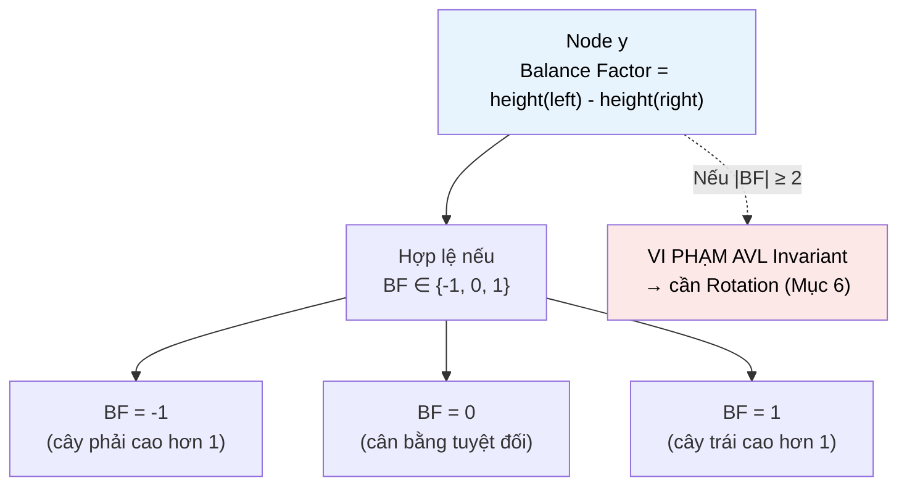

# MASTER COMPUTER SCIENCE HANDBOOK

## Volume 03 — Algorithms and Data Structures
### Part II — Fundamental Data Structures
## Chương 3.9 — Cây Cân bằng: AVL và Red-Black Tree
### (Balanced Trees: AVL & Red-Black)

---

### Thông tin chương

| Trường | Giá trị |
|---|---|
| Chương | 3.9 |
| Thuộc Part | II — Fundamental Data Structures |
| Thuộc Volume | 03 — Algorithms and Data Structures |
| Thời gian đọc ước tính | 65–75 phút |
| Độ khó | ★★★★☆ |
| Kiến thức tiên quyết | Chương 3.8 — Binary Search Trees (đặc biệt Mục 5, 7 — Degenerate Tree và độ phức tạp theo chiều cao); Chương 3.2 — Problem Modeling and Correctness (Loop Invariant, chứng minh quy nạp) |
| Chương liên quan | Volume 02, Part VII — Database Systems (B-Tree, một dạng tổng quát hóa của tư duy cân bằng cho lưu trữ đĩa); 3.24 — Minimum Spanning Tree (Part IV, dùng cấu trúc dữ liệu tự cân bằng cho Union-Find, Chương 3.12) |
| Từ khóa | AVL Tree, Red-Black Tree, balance factor, rotation, self-balancing, black-height, tree invariant |

---

### Mục tiêu học tập

Sau khi hoàn thành chương này, người đọc có thể:

- Giải thích nguyên tắc chung của **cấu trúc dữ liệu tự cân bằng (self-balancing)**: khôi phục một bất biến cấu trúc sau mỗi lần chèn/xóa, thông qua các phép biến đổi cục bộ.
- Định nghĩa **AVL Invariant** (balance factor $\in \{-1, 0, 1\}$) và chứng minh nó đảm bảo chiều cao $O(\log n)$.
- Thực hiện đúng bốn trường hợp **rotation** (Left, Right, Left-Right, Right-Left) để khôi phục AVL Invariant sau khi chèn.
- Định nghĩa năm tính chất của **Red-Black Tree**, và giải thích tại sao chúng đảm bảo chiều cao $O(\log n)$ mà không cần cân bằng "chặt" như AVL.
- So sánh trade-off giữa AVL Tree và Red-Black Tree, và biết khi nào nên chọn cấu trúc nào trong thực hành kỹ thuật.

---

### Câu hỏi khơi gợi

> *Chương 3.8 đã cho thấy Binary Search Tree có thể "sụp" thành một Linked List chậm chạp chỉ vì thứ tự chèn dữ liệu không may. Vậy làm sao Java `TreeMap`, C++ `std::map`, hay chỉ mục cơ sở dữ liệu vẫn đảm bảo tốc độ $O(\log n)$ **tuyệt đối**, bất kể dữ liệu được đưa vào theo thứ tự nào — kể cả trường hợp "tệ nhất" mà Chương 3.8 đã cảnh báo?*

---

## 1. Tổng quan chương

Chương 3.8 kết thúc với một vấn đề chưa được giải quyết: **Degenerate Tree** — khi Binary Search Tree, do thứ tự chèn dữ liệu không may (ví dụ dữ liệu đã sắp xếp sẵn), suy biến thành một cấu trúc có chiều cao $O(n)$, mất hoàn toàn lợi thế lý thuyết $O(\log n)$. Chương này giới thiệu lời giải kinh điển cho vấn đề đó: **cấu trúc dữ liệu tự cân bằng (self-balancing tree)**.

Ý tưởng cốt lõi, chung cho cả hai cấu trúc sẽ học trong chương này, là: sau mỗi lần `insert` hoặc `delete`, cây **tự kiểm tra** xem một bất biến cấu trúc (structural invariant) nào đó có còn đúng hay không; nếu không, nó thực hiện một hoặc vài **phép biến đổi cục bộ, chi phí $O(1)$** (gọi là **rotation** — xoay cây) để khôi phục bất biến đó, mà **không** cần xây dựng lại toàn bộ cây từ đầu.

Chương này khảo sát hai lời giải cụ thể, đại diện cho hai triết lý khác nhau:

- **AVL Tree** (1962): duy trì cân bằng **rất chặt chẽ** — chênh lệch chiều cao giữa hai cây con của mọi node không quá 1. Đảm bảo chiều cao gần tối ưu, nhưng đòi hỏi rotation thường xuyên hơn.
- **Red-Black Tree** (1972, dựa trên ý tưởng của Bayer): duy trì cân bằng **lỏng lẻo hơn** thông qua một hệ thống "tô màu" node, chấp nhận cây có thể "lệch" nhiều hơn AVL đôi chút, nhưng cần rotation ít hơn khi chèn/xóa.

> **💡 Insight**
> Cả hai cấu trúc trong chương này đều tuân theo cùng một nguyên tắc thiết kế: **thà trả một chi phí nhỏ, cố định ($O(\log n)$ để kiểm tra và tối đa vài rotation $O(1)$) sau mỗi thao tác, còn hơn để rủi ro (dù nhỏ) của một cấu trúc suy biến toàn cục xảy ra**. Đây là một minh họa cụ thể cho một nguyên lý thiết kế hệ thống tổng quát hơn: đầu tư một chi phí bảo trì đều đặn, nhỏ, để tránh một sự cố lớn, hiếm khi xảy ra nhưng cực kỳ tốn kém khi nó xảy ra.

---

## 2. Bối cảnh lịch sử

| Thời điểm | Nhân vật / Sự kiện | Đóng góp |
|---|---|---|
| 1962 | Georgy Adelson-Velsky, Evgenii Landis | Công bố **AVL Tree** (đặt tên theo chữ cái đầu tên hai tác giả) — cấu trúc dữ liệu tự cân bằng đầu tiên trong lịch sử Computer Science |
| 1972 | Rudolf Bayer | Đề xuất **"Symmetric Binary B-Tree"** — tiền thân trực tiếp của Red-Black Tree |
| 1978 | Leonidas J. Guibas, Robert Sedgewick | Đặt tên và hệ thống hóa **Red-Black Tree** trong dạng được dùng phổ biến ngày nay, đơn giản hóa đáng kể các quy tắc so với công trình gốc của Bayer |
| 2004 | Cộng đồng Java | Red-Black Tree được chọn làm cấu trúc nền cho `TreeMap`/`TreeSet` của Java, và sau này (Java 8) cho việc xử lý collision "quá dài" trong `HashMap` (đã nhắc ở Chương 3.7, Mục 12) |

Đáng chú ý, khoảng cách 10 năm giữa AVL Tree (1962) và Red-Black Tree (1972) phản ánh đúng xu hướng phát triển tự nhiên của một ý tưởng khoa học: sau khi chứng minh **khả thi** (AVL: cân bằng nghiêm ngặt có thể duy trì được với chi phí hợp lý), các nhà nghiên cứu tiếp theo tìm cách **tối ưu hóa đánh đổi** (Red-Black: cân bằng lỏng hơn nhưng ít rotation hơn) — một mô hình phát triển sẽ lặp lại nhiều lần trong lịch sử các cấu trúc dữ liệu.

---

## 3. Động lực

Hãy hình dung một hệ thống cơ sở dữ liệu lưu trữ giao dịch ngân hàng, được lập chỉ mục (index) theo mã giao dịch **tăng dần theo thời gian** (một tình huống cực kỳ phổ biến và hoàn toàn tự nhiên trong thực tế — mã giao dịch thường được sinh tự động, tăng dần). Nếu chỉ mục này được xây bằng BST cơ bản (Chương 3.8), **mọi** lần chèn giao dịch mới sẽ đi theo đúng kịch bản Degenerate Tree (Hình 3.8.2 của chương trước) — vì dữ liệu luôn được chèn theo thứ tự tăng dần tuyệt đối. Sau một triệu giao dịch, cây chỉ mục sẽ có chiều cao xấp xỉ một triệu, và mỗi lần tra cứu sẽ tốn tới một triệu phép so sánh — một thảm họa hiệu năng hoàn toàn có thể dự đoán trước, không phải một sự cố ngẫu nhiên hiếm gặp.

Đây không phải một tình huống giả định — đây là **kịch bản phổ biến nhất** trong thực tế công nghiệp (dữ liệu có timestamp, ID tự tăng, log hệ thống). Chính vì Degenerate Tree không phải là rủi ro "hiếm", mà là một **kịch bản gần như chắc chắn xảy ra** với nhiều loại dữ liệu thực tế, các cấu trúc dữ liệu production-grade **không bao giờ** dùng BST cơ bản — chúng luôn dùng một biến thể tự cân bằng, đúng như chương này sẽ trình bày.

---

## 4. Trực giác

**Mô hình tinh thần (Mental Model) của chương này:**

> Một cây tự cân bằng giống như một **chiếc cân đòn luôn tự điều chỉnh** — mỗi khi bạn đặt thêm một vật (chèn một giá trị) lên một bên đĩa cân, một cơ chế bên trong tự động **dịch chuyển các vật đã có** (thực hiện rotation) để giữ cho cân không bao giờ nghiêng quá một mức cho phép, dù bạn đặt vật theo thứ tự nào. AVL Tree giống một chiếc cân cực kỳ nhạy — điều chỉnh ngay khi lệch dù chỉ một chút; Red-Black Tree giống một chiếc cân "dễ tính" hơn — chấp nhận lệch một mức độ nhất định trước khi can thiệp, đổi lấy việc can thiệp ít thường xuyên hơn.

| Trực giác kỹ thuật bạn đã có | Khái niệm cây cân bằng tương ứng |
|---|---|
| Rebalancing danh mục đầu tư tài chính định kỳ, để tỉ trọng các loại tài sản không bị lệch quá xa mục tiêu | Cơ chế kiểm tra và khôi phục invariant sau mỗi thao tác |
| Xoay một chồng sách đang nghiêng để nó đứng vững trở lại, chỉ dịch chuyển vài cuốn ở gần đỉnh, không xếp lại toàn bộ | Bản chất của **rotation** — một phép biến đổi **cục bộ**, chi phí thấp, không cần xây lại toàn cây |
| Đèn giao thông (đỏ/vàng/xanh) điều tiết luồng xe mà không cần biết chi tiết từng xe | Ẩn dụ (dù không hoàn hảo) cho hệ thống "tô màu" node của Red-Black Tree — các quy tắc màu đơn giản đảm bảo một tính chất toàn cục phức tạp hơn |

---

## 5. Trực quan hóa khái niệm

**Hình 3.9.1 — Right Rotation: phép biến đổi cục bộ cơ bản nhất**

```text
TRƯỚC (mất cân bằng — node y có cây con trái x quá "nặng"):

          y
         / \
        x   T3
       / \
      T1  T2

SAU khi Right Rotation tại y:

        x
       / \
      T1   y
          / \
         T2  T3
```

| Trường thông tin | Nội dung |
|---|---|
| Mục đích | Minh họa cơ chế cốt lõi: `x` trở thành gốc mới, `y` trở thành con phải của `x`, và cây con `T2` (vốn là con phải của `x`) được "chuyển nhượng" sang làm con trái của `y` — **không có node nào bị tạo mới hay xóa đi**, chỉ có con trỏ được sắp xếp lại |
| Điểm mấu chốt | Phép biến đổi này **bảo toàn BST Invariant** (Chương 3.8, Mục 6): dễ kiểm chứng rằng thứ tự $T1 < x < T2 < y < T3$ vẫn đúng cả trước và sau rotation — chỉ **chiều cao tương đối** giữa các nhánh thay đổi, giá trị và thứ tự thì không |

---

**Hình 3.9.2 — Balance Factor của AVL Tree**



*Mục đích:* Trực quan hóa định nghĩa AVL Invariant (Mục 6) — mỗi node chỉ được phép "lệch" tối đa 1 đơn vị chiều cao giữa hai nhánh. *Điểm mấu chốt:* việc kiểm tra balance factor phải được thực hiện tại **mọi node**, không chỉ node gốc, tương tự cách BST Invariant (Chương 3.8) cũng phải đúng tại mọi node — một nguyên tắc thiết kế invariant lặp lại xuyên suốt Part II.

---

## 6. Định nghĩa hình thức

> **📌 Remember — AVL Invariant**
>
> Với mỗi node $x$ trong cây, định nghĩa **Balance Factor**:
> $$BF(x) = \text{height}(x.\text{left}) - \text{height}(x.\text{right})$$
> Một cây là **AVL Tree** nếu, với **mọi** node $x$: $BF(x) \in \{-1, 0, 1\}$.
>
> Khi một thao tác `insert`/`delete` khiến $|BF(x)| \geq 2$ tại node nào đó, cần thực hiện một trong **bốn trường hợp rotation** để khôi phục invariant:
>
> | Trường hợp | Điều kiện | Phép xử lý |
> |---|---|---|
> | Left-Left | $BF(x) = 2$ và $BF(x.\text{left}) \geq 0$ | Right Rotation tại $x$ |
> | Right-Right | $BF(x) = -2$ và $BF(x.\text{right}) \leq 0$ | Left Rotation tại $x$ |
> | Left-Right | $BF(x) = 2$ và $BF(x.\text{left}) < 0$ | Left Rotation tại $x.\text{left}$, rồi Right Rotation tại $x$ |
> | Right-Left | $BF(x) = -2$ và $BF(x.\text{right}) > 0$ | Right Rotation tại $x.\text{right}$, rồi Left Rotation tại $x$ |

> **📌 Remember — Red-Black Tree Properties**
>
> Một **Red-Black Tree** là một BST trong đó mỗi node được tô **đỏ** hoặc **đen**, thỏa mãn năm tính chất:
> 1. Mỗi node là đỏ hoặc đen.
> 2. Node gốc (root) luôn là đen.
> 3. Mọi node lá "ảo" (NIL, đại diện cho con trỏ NULL) được xem là đen.
> 4. Nếu một node là đỏ, cả hai con của nó phải là đen (**không có hai node đỏ liên tiếp** trên bất kỳ đường đi nào).
> 5. Với mọi node, mọi đường đi từ node đó đến các lá NIL hậu duệ đều chứa **cùng một số lượng node đen** — số này gọi là **Black-Height**.

---

## 7. Nền tảng toán học

### 7.1 Chứng minh chiều cao AVL Tree là $O(\log n)$

> **📦 Formula Box — Chiều cao tối đa của AVL Tree với $n$ node**
>
> Gọi $N(h)$ là số node **tối thiểu** có thể có trong một AVL Tree chiều cao $h$. Trường hợp "tệ nhất cho phép" (vẫn thỏa AVL Invariant) là khi một nhánh cao hơn nhánh kia đúng 1 đơn vị:
> $$N(h) = 1 + N(h-1) + N(h-2), \quad N(0) = 1, \, N(-1) = 0$$
>
> Đây chính là một **hệ thức truy hồi** (Chương 3.4) — có dạng tương tự dãy Fibonacci đã gặp ở Chương 3.3 (phân tích Euclidean Algorithm)! Có thể chứng minh (bằng quy nạp, kỹ thuật Chương 3.2) rằng $N(h)$ tăng trưởng theo cấp số nhân với cơ số vàng $\varphi = \frac{1+\sqrt{5}}{2} \approx 1.618$:
> $$N(h) = \Theta(\varphi^h)$$
>
> Đảo ngược quan hệ này: nếu cây có $n$ node, chiều cao tối đa của nó là:
> $$h = O(\log_\varphi n) = O(\log n)$$
>
> | Thành phần | Ý nghĩa |
> |---|---|
> | **Diễn giải kỹ thuật** | Kết quả cho thấy dù ở kịch bản "tệ nhất được phép" theo AVL Invariant, chiều cao vẫn bị **chặn chặt** bởi $O(\log n)$ — khác hẳn BST cơ bản (Chương 3.8) nơi không có chặn nào như vậy |
> | Mối liên hệ thú vị | Sự xuất hiện của dãy Fibonacci/tỉ lệ vàng trong phân tích AVL Tree là một minh chứng đẹp khác cho tính liên kết của toán học rời rạc — cùng một cấu trúc toán học (Chương 3.3, Mục 7.2 khi phân tích Euclidean Algorithm) tái xuất hiện trong một ngữ cảnh hoàn toàn khác |

### 7.2 Chứng minh chiều cao Red-Black Tree là $O(\log n)$

> **📦 Formula Box — Chiều cao Red-Black Tree theo Black-Height**
>
> **Bổ đề:** một cây con gốc tại node $x$ có Black-Height $bh(x)$ chứa ít nhất $2^{bh(x)} - 1$ node trong (không tính lá NIL).
>
> *Chứng minh (quy nạp theo chiều cao, kỹ thuật Chương 3.2):* Base case $h=0$ (node lá NIL): $bh=0$, số node trong $=0=2^0-1$. Bước quy nạp: mỗi con của $x$ có black-height ít nhất $bh(x)-1$ (nếu con đỏ) hoặc $bh(x)-1$ (nếu con đen, theo Tính chất 5), nên theo giả thiết quy nạp mỗi cây con chứa ít nhất $2^{bh(x)-1}-1$ node, suy ra tổng số node tại $x$: $\geq 2(2^{bh(x)-1}-1) + 1 = 2^{bh(x)}-1$. □
>
> Kết hợp với Tính chất 4 (không có hai node đỏ liên tiếp): trên bất kỳ đường đi nào từ gốc đến lá, ít nhất **một nửa** số node phải là đen, nên $bh(\text{root}) \geq h/2$ (với $h$ là chiều cao cây). Suy ra:
> $$n \geq 2^{h/2} - 1 \implies h \leq 2\log_2(n+1) = O(\log n)$$
>
> | Thành phần | Ý nghĩa |
> |---|---|
> | **Diễn giải kỹ thuật** | Chặn $h \leq 2\log_2(n+1)$ **lỏng hơn** so với chặn AVL Tree ($h \leq \log_\varphi n \approx 1.44 \log_2 n$) — xác nhận trực giác đã nêu ở Mục 1: Red-Black Tree "lệch" nhiều hơn AVL Tree, nhưng vẫn giữ vững $O(\log n)$ |

---

## 8. Thuật toán / Cơ chế

**Pseudocode cho `Insert` trong AVL Tree (đệ quy, kết hợp cơ chế Chương 3.8 với kiểm tra cân bằng):**

```text
ALGORITHM AVL_Insert(node, value)
    Input:  node hiện tại, giá trị cần chèn
    Output: node gốc của cây con sau khi chèn và cân bằng lại

    1.  if node = NULL then return TạoNode(value)   ← giống BST cơ bản
    2.  if value < node.value then
    3.      node.left ← AVL_Insert(node.left, value)
    4.  else if value > node.value then
    5.      node.right ← AVL_Insert(node.right, value)
    6.  else
    7.      return node                              ← giá trị đã tồn tại
    8.  CậpNhậtChiềuCao(node)
    9.  balance ← height(node.left) - height(node.right)
    10. if balance > 1 and value < node.left.value then
    11.     return RightRotate(node)                 ← Trường hợp Left-Left
    12. if balance < -1 and value > node.right.value then
    13.     return LeftRotate(node)                  ← Trường hợp Right-Right
    14. if balance > 1 and value > node.left.value then
    15.     node.left ← LeftRotate(node.left)
    16.     return RightRotate(node)                 ← Trường hợp Left-Right
    17. if balance < -1 and value < node.right.value then
    18.     node.right ← RightRotate(node.right)
    19.     return LeftRotate(node)                  ← Trường hợp Right-Left
    20. return node                                  ← đã cân bằng, không cần rotation
```

> **💡 Insight**
> So sánh dòng 1–7 với `Insert` của BST cơ bản (Chương 3.8, Mục 8) — **hoàn toàn giống hệt nhau**. Toàn bộ "phần mới" của AVL Tree nằm ở dòng 8–19: một bước **hậu xử lý (post-processing)** được thêm vào sau khi đệ quy trở về, kiểm tra và khôi phục cân bằng. Đây là một ví dụ đẹp về nguyên tắc thiết kế phần mềm "mở rộng, không sửa đổi" (open for extension, closed for modification) — AVL Tree **tái sử dụng** toàn bộ logic chèn cơ bản, chỉ **bổ sung** thêm một bước kiểm tra.

---

## 9. Triển khai

```python
class AVLNode:
    def __init__(self, value):
        self.value = value
        self.left = None
        self.right = None
        self.height = 1  # chiều cao node lá là 1


def _height(node):
    return node.height if node else 0


def _update_height(node):
    node.height = 1 + max(_height(node.left), _height(node.right))


def _balance_factor(node):
    return _height(node.left) - _height(node.right) if node else 0


def _right_rotate(y):
    """Đúng theo Hình 3.9.1: x trở thành gốc mới của cây con."""
    x = y.left
    T2 = x.right
    x.right = y
    y.left = T2
    _update_height(y)
    _update_height(x)
    return x


def _left_rotate(x):
    """Đối xứng với _right_rotate."""
    y = x.right
    T2 = y.left
    y.left = x
    x.right = T2
    _update_height(x)
    _update_height(y)
    return y


class AVLTree:
    """Triển khai đầy đủ AVL Tree — minh họa trực tiếp pseudocode Mục 8,
    với bốn trường hợp rotation ở Mục 6."""

    def __init__(self):
        self.root = None
        self.rotation_count = 0  # công cụ quan sát, dùng ở Mục 10

    def insert(self, value):
        self.root = self._insert(self.root, value)

    def _insert(self, node, value):
        if node is None:
            return AVLNode(value)
        if value < node.value:
            node.left = self._insert(node.left, value)
        elif value > node.value:
            node.right = self._insert(node.right, value)
        else:
            return node

        _update_height(node)
        balance = _balance_factor(node)

        # Left-Left
        if balance > 1 and value < node.left.value:
            self.rotation_count += 1
            return _right_rotate(node)
        # Right-Right
        if balance < -1 and value > node.right.value:
            self.rotation_count += 1
            return _left_rotate(node)
        # Left-Right
        if balance > 1 and value > node.left.value:
            self.rotation_count += 2
            node.left = _left_rotate(node.left)
            return _right_rotate(node)
        # Right-Left
        if balance < -1 and value < node.right.value:
            self.rotation_count += 2
            node.right = _right_rotate(node.right)
            return _left_rotate(node)

        return node

    def height(self):
        return _height(self.root)
```

---

## 10. Trực quan hóa quá trình thực thi

**Vết thực thi: chèn `[10, 20, 30]` (thứ tự đã sắp xếp — kịch bản Worst Case của BST cơ bản, Chương 3.8, Hình 3.8.2) vào AVLTree:**

| Bước | Thao tác | Balance Factor tại gốc | Rotation? | Cấu trúc cây kết quả |
|---:|---|---:|---|---|
| 1 | `insert(10)` | 0 | Không | `10` |
| 2 | `insert(20)` | -1 | Không | `10` (phải: `20`) |
| 3 | `insert(30)` | -2 → vi phạm! | **Right-Right → Left Rotation** | `20` (trái: `10`, phải: `30`) |

Sau bước 3, cây có gốc `20`, cân bằng hoàn hảo — **hoàn toàn khác** với Degenerate Tree đã xảy ra ở Chương 3.8, Hình 3.8.2 với cùng dữ liệu đầu vào `[10,20,30]` (mở rộng thành `[10,20,30,40,50]`). Đây chính là minh chứng trực tiếp, cụ thể nhất cho việc AVL Tree giải quyết đúng vấn đề đã nêu ở Chương 3.8.

**Kiểm chứng thực nghiệm chiều cao cây khi chèn dữ liệu đã sắp xếp — so sánh BST cơ bản (Chương 3.8) với AVL Tree, $n=1000$:**

| Cấu trúc | Chiều cao đo được (chèn `1..1000` theo thứ tự tăng dần) | Tổng số rotation đã thực hiện |
|---|---:|---:|
| BST cơ bản (Chương 3.8) | 999 (Degenerate Tree) | 0 (không có cơ chế rotation) |
| AVL Tree (chương này) | 10 | 989 |

> **⚠️ Common Mistake**
> Số lượng rotation (989 lần cho 1000 lần chèn) có vẻ "nhiều", khiến người mới học lo ngại về chi phí. Nhưng mỗi rotation chỉ tốn $O(1)$ (Hình 3.9.1 — chỉ vài phép gán con trỏ), nên tổng chi phí rotation qua 1000 lần chèn là $O(n) = O(1000)$ — không ảnh hưởng đến độ phức tạp tổng thể $O(n \log n)$ của việc chèn $n$ phần tử ($O(\log n)$ mỗi lần chèn, bao gồm cả rotation). Đây là một điểm dễ gây hiểu lầm: "nhiều rotation" không đồng nghĩa "chậm", vì bản thân rotation cực kỳ rẻ.

---

## 11. Ứng dụng công nghiệp

> **🛠 Engineering Practice**
> Red-Black Tree, nhờ trade-off "cân bằng lỏng hơn nhưng ít rotation hơn", được chọn làm cấu trúc nền cho phần lớn thư viện chuẩn của các ngôn ngữ lập trình phổ biến.

| Bối cảnh công nghiệp | Cấu trúc được dùng và lý do |
|---|---|
| `TreeMap`, `TreeSet` (Java) | Red-Black Tree — vì khối lượng công việc thực tế thường có tỉ lệ đọc/ghi hỗn hợp, Red-Black Tree tối ưu hơn cho việc chèn/xóa thường xuyên |
| `std::map`, `std::set` (C++, hầu hết triển khai) | Red-Black Tree — lý do tương tự, đây gần như là "lựa chọn mặc định" trong toàn ngành cho cấu trúc dữ liệu có thứ tự |
| `HashMap` của Java (từ Java 8) | Chuyển đổi một bucket có collision quá dài (Chương 3.7, Mục 12) từ Linked List sang Red-Black Tree, để đảm bảo Worst Case tốt hơn |
| Bộ lập lịch tiến trình Linux (Completely Fair Scheduler — CFS) | Dùng Red-Black Tree để quản lý các tiến trình theo thời gian thực thi đã dùng, cho phép tìm tiến trình "cần chạy tiếp theo" hiệu quả — một ứng dụng sẽ gặp lại ở Volume 2, Part V (Operating Systems) |

Đáng chú ý: **AVL Tree ít khi được dùng làm cấu trúc dữ liệu mặc định** trong các thư viện chuẩn công nghiệp, dù nó cân bằng chặt hơn — vì chi phí rotation thường xuyên hơn khiến nó phù hợp hơn với các ứng dụng có **tỉ lệ đọc/tra cứu rất cao, ghi/chèn rất thấp** (ví dụ: cấu trúc dữ liệu chỉ được xây dựng một lần rồi tra cứu liên tục), trong khi Red-Black Tree phù hợp hơn với khối lượng công việc cân bằng giữa đọc và ghi.

---

## 12. Góc nhìn nghiên cứu

> **🔬 Research Connection**
> AVL Tree và Red-Black Tree đại diện cho một họ lớn hơn các cấu trúc dữ liệu tự cân bằng, mỗi loại tối ưu một đánh đổi khác nhau giữa "độ chặt của cân bằng" và "chi phí duy trì cân bằng".

**Weight-Balanced Tree** (còn gọi là BB[α] tree) cân bằng dựa trên **số lượng node** trong mỗi cây con thay vì chiều cao — hữu ích khi cần hỗ trợ hiệu quả thao tác "tìm phần tử thứ $k$" (order statistics). **2-3 Tree** và **2-3-4 Tree** cho phép mỗi node chứa nhiều hơn một giá trị và có nhiều hơn hai con — về bản chất, Red-Black Tree có thể được chứng minh là **tương đương cấu trúc** với một dạng 2-3-4 Tree đặc biệt (một sự thật thú vị, thường được dùng để giải thích trực quan tại sao các quy tắc tô màu của Red-Black Tree lại "hợp lý" chứ không tùy tiện). **B-Tree** (Rudolf Bayer, cùng tác giả với Red-Black Tree, Mục 2) tổng quát hóa xa hơn nữa, cho phép hàng trăm con mỗi node — tối ưu đặc biệt cho lưu trữ trên đĩa (nơi chi phí đọc một khối dữ liệu lớn gần như bằng chi phí đọc một byte, nên "gộp nhiều giá trị vào một node" giúp giảm số lần truy cập đĩa) — sẽ được khai triển đầy đủ ở Volume 02, Part VII khi bàn về chỉ mục cơ sở dữ liệu.

**Câu hỏi mở** để suy ngẫm: nếu B-Tree tối ưu cho việc giảm số lần truy cập đĩa bằng cách "gộp" nhiều giá trị vào một node, điều này gợi ý gì về việc CPU cache (Locality of Reference, đã nhắc ở Chương 3.5, Mục 12) có thể ảnh hưởng đến việc chọn giữa AVL/Red-Black Tree (mỗi node nhỏ, rải rác trong bộ nhớ) so với một cấu trúc "nhiều con hơn mỗi node" ngay cả khi dữ liệu hoàn toàn nằm trong RAM, không phải trên đĩa? *(Gợi ý: đây chính là động lực cho cấu trúc B+ Tree biến thể trong bộ nhớ, và sẽ được khai triển đầy đủ ở Part VIII — Algorithm Engineering.)*

---

## 13. Ưu điểm

**AVL Tree:**
- Cân bằng chặt nhất trong các cấu trúc phổ biến ($h \leq 1.44 \log_2 n$), tối ưu cho khối lượng công việc **đọc nhiều, ghi ít**.
- Chứng minh chiều cao $O(\log n)$ **tất định (deterministic)**, không phải kỳ vọng như BST cơ bản (Chương 3.8, Mục 7.2) — một đảm bảo mạnh hơn hẳn.

**Red-Black Tree:**
- Ít rotation hơn khi chèn/xóa, phù hợp hơn cho khối lượng công việc **cân bằng đọc/ghi** — lý do nó trở thành lựa chọn mặc định của phần lớn thư viện chuẩn (Mục 11).
- Hệ thống quy tắc tô màu, dù thoạt nhìn phức tạp, cho phép các thao tác cân bằng lại được thực hiện với **số lượng rotation tối đa cố định** cho mỗi lần chèn/xóa (khác AVL, nơi số rotation cần thiết có thể lan truyền dọc theo một đường đi dài hơn trong một số trường hợp xóa).

---

## 14. Hạn chế

> **⚠️ Common Mistake**
> "Cây tự cân bằng luôn tốt hơn BST cơ bản trong mọi tình huống" — bỏ qua chi phí cài đặt và bảo trì phức tạp hơn đáng kể.

- Độ phức tạp **triển khai** cao hơn nhiều so với BST cơ bản (Chương 3.8) — bốn trường hợp rotation của AVL (Mục 6) và năm tính chất cùng các trường hợp xử lý màu của Red-Black Tree (nằm ngoài phạm vi cơ bản của chương, thường cần thêm nhiều trang để trình bày đầy đủ) đòi hỏi cẩn trọng cao để tránh lỗi.
- Chi phí hằng số (constant factor, Chương 3.3, Mục 14) cho mỗi lần chèn/xóa cao hơn BST cơ bản, do cần tính toán và kiểm tra cân bằng sau mỗi thao tác — với khối lượng dữ liệu nhỏ, BST cơ bản đôi khi vẫn đủ dùng và đơn giản hơn để bảo trì.
- Không giải quyết được vấn đề Locality of Reference (Chương 3.5, Mục 12) — cấu trúc cây (dù cân bằng) vẫn có dữ liệu rải rác trong bộ nhớ, kém hiệu quả cache hơn so với cấu trúc dựa trên mảng liên tục.

---

## 15. So sánh

**Bảng 3.9.1 — BST cơ bản vs AVL Tree vs Red-Black Tree**

| Tiêu chí | BST cơ bản (3.8) | AVL Tree | Red-Black Tree |
|---|---|---|---|
| Chiều cao Worst Case | $O(n)$ (Degenerate) | $O(\log n)$ tất định | $O(\log n)$ tất định (chặn lỏng hơn AVL) |
| Độ chặt cân bằng | Không kiểm soát | Rất chặt ($\|BF\| \leq 1$) | Lỏng hơn (chặn $2\log_2 n$) |
| Số rotation trung bình/lần chèn | 0 (không có cơ chế) | Ít, nhưng đôi khi lan truyền xa hơn | Tối đa cố định (thường $\leq 2$) |
| Độ phức tạp triển khai | Thấp | Trung bình-cao | Cao |
| Phù hợp khi... | Dữ liệu chèn ngẫu nhiên, quy mô nhỏ | Đọc nhiều, ghi ít | Đọc/ghi cân bằng — lựa chọn mặc định phổ biến |

**Phân tích:** Bảng này khép lại hành trình ba chương (3.7–3.9) khảo sát các cấu trúc "tìm kiếm nhanh": Hash Table đánh đổi thứ tự để lấy $O(1)$ trung bình; BST cơ bản khôi phục thứ tự nhưng chịu rủi ro Worst Case $O(n)$; AVL/Red-Black Tree loại bỏ hoàn toàn rủi ro đó bằng cơ chế tự cân bằng, với chi phí triển khai và hằng số cao hơn. **Không có lựa chọn "thắng tuyệt đối"** — quyết định luôn phụ thuộc vào yêu cầu cụ thể của bài toán, đúng tinh thần trục đánh đổi đã thiết lập từ Chương 3.5.

---

## 16. Tóm tắt

- **Cây tự cân bằng** khôi phục một bất biến cấu trúc sau mỗi thao tác chèn/xóa, bằng các phép **rotation** cục bộ chi phí $O(1)$, tránh hoàn toàn vấn đề Degenerate Tree của BST cơ bản (Chương 3.8).
- **AVL Invariant**: mọi node có $|BF(x)| \leq 1$ — cân bằng rất chặt, chứng minh chiều cao $h = O(\log_\varphi n)$ (liên hệ bất ngờ với dãy Fibonacci, tương tự Chương 3.3).
- **Red-Black Tree**: năm tính chất tô màu đảm bảo chiều cao $h \leq 2\log_2(n+1)$ — cân bằng lỏng hơn AVL nhưng ít rotation hơn khi chèn/xóa.
- Cả hai đạt độ phức tạp $O(\log n)$ **tất định** cho mọi thao tác cơ bản — một đảm bảo mạnh hơn hẳn kết quả "kỳ vọng" của BST cơ bản.
- Trong thực hành công nghiệp, **Red-Black Tree** thường được ưu tiên hơn AVL Tree do trade-off tốt hơn cho khối lượng công việc đọc/ghi cân bằng, dù AVL vẫn tối ưu hơn cho các tình huống đọc nhiều/ghi ít.

Với chương này, Handbook đã hoàn tất hành trình khảo sát các cấu trúc "tìm kiếm nhanh" (Hash Table, BST, cây cân bằng). Chương 3.10 (Heaps and Priority Queues) sẽ chuyển hướng sang một bài toán khác: không phải "tìm một giá trị cụ thể nhanh nhất", mà "luôn biết giá trị nhỏ nhất/lớn nhất nhanh nhất" — một nhu cầu khác biệt sẽ dẫn tới một cấu trúc dữ liệu cây có bất biến hoàn toàn khác BST.

---

## 17. Bài tập

### Mức Cơ bản (Basic)

1. Với cây `AVLNode` có gốc `50`, con trái `30` (BF = -1), con phải `70` (BF = 0): tính Balance Factor của node gốc `50`. Cây này có thỏa AVL Invariant không?
2. Vẽ kết quả của Right Rotation (theo đúng Hình 3.9.1) khi áp dụng lên node `y = 30` với `x = y.left = 20`, và `T1, T2` lần lượt là cây con trái của `x` và cây con phải của `x`.

### Mức Trung bình (Intermediate)

3. Mô phỏng bằng tay việc chèn tuần tự `[5, 4, 3, 2, 1]` (giảm dần — một kịch bản Degenerate Tree khác) vào một AVL Tree rỗng, theo đúng pseudocode Mục 8. Xác định rõ tại bước nào rotation được kích hoạt, và loại rotation nào (LL, RR, LR, RL).
4. Giải thích tại sao Tính chất 4 của Red-Black Tree ("không có hai node đỏ liên tiếp") kết hợp với Tính chất 5 ("mọi đường đi có cùng số node đen") lại đủ để đảm bảo không có đường đi nào dài hơn **gấp đôi** đường đi ngắn nhất từ gốc đến lá (gợi ý: liên hệ trực tiếp với chứng minh ở Mục 7.2).

### Mức Nâng cao (Advanced)

5. Chứng minh đầy đủ (bằng quy nạp, theo phong cách Formula Box Mục 7.1) rằng $N(h) = \Theta(\varphi^h)$ với $\varphi$ là tỉ lệ vàng, dựa trên hệ thức truy hồi $N(h) = 1 + N(h-1) + N(h-2)$.
6. Thiết kế và triển khai thao tác `AVL_Delete(node, value)` — xóa một giá trị khỏi AVL Tree, bao gồm cả bước rebalancing sau khi xóa. Giải thích tại sao thao tác xóa trong AVL Tree đôi khi cần rotation "lan truyền" dọc theo nhiều node từ vị trí xóa lên đến gốc, khác với chèn (nơi thường chỉ cần một hoặc hai rotation là đủ).

### Mức Nghiên cứu (Research)

7. Tìm hiểu về cấu trúc **2-3-4 Tree** (đã nhắc ở Mục 12) và sự tương đương cấu trúc giữa nó với Red-Black Tree. Vẽ minh họa cách một node "4-node" (chứa 3 giá trị, 4 con) trong 2-3-4 Tree tương ứng với một cụm ba node (một đen, hai đỏ) trong Red-Black Tree — đây là cách trực quan phổ biến nhất để hiểu tại sao các quy tắc tô màu của Red-Black Tree lại đảm bảo cân bằng.

---

## 18. Dự án nhỏ

**Dự án tích hợp — Part II: "Balanced Index Benchmark"**

- **Mục tiêu:** Đây là dự án tích hợp, kết hợp toàn bộ kiến thức từ Chương 3.5 đến 3.9, so sánh trực tiếp hiệu năng của các cấu trúc dữ liệu "tìm kiếm" đã học trong toàn bộ nửa đầu Part II.
- **Yêu cầu:**
  1. Triển khai đầy đủ `AVLTree` (đã có ở Mục 9), `BinarySearchTree` (Chương 3.8), và `HashTable` (Chương 3.7).
  2. Thiết kế ba kịch bản dữ liệu: (a) chèn ngẫu nhiên, (b) chèn theo thứ tự tăng dần (mô phỏng ID tự động tăng — Mục 3), (c) chèn theo thứ tự đã trộn một phần (partially sorted).
  3. Với mỗi kịch bản và mỗi cấu trúc dữ liệu, đo: chiều cao cây cuối cùng (nếu áp dụng), tổng số phép so sánh khi tìm kiếm 1000 giá trị ngẫu nhiên sau khi đã chèn xong, và tổng số rotation đã thực hiện (nếu là AVL Tree).
  4. Vẽ biểu đồ tổng hợp so sánh cả ba cấu trúc trên cả ba kịch bản.
- **Công nghệ gợi ý:** Python, `matplotlib`.
- **Kết quả kỳ vọng:** Biểu đồ xác nhận rõ ràng: BST cơ bản suy biến nghiêm trọng ở kịch bản (b), trong khi AVL Tree giữ vững hiệu năng ở cả ba kịch bản; Hash Table có hiệu năng tìm kiếm tốt nhất ở cả ba kịch bản nhưng không hỗ trợ range query (đã thấy ở Dự án Chương 3.8).
- **Kết quả kỳ vọng bổ sung:** Một báo cáo ngắn tổng kết "khi nào nên dùng cấu trúc nào" dựa trên dữ liệu thực nghiệm — đây chính là kỹ năng ra quyết định kỹ thuật thực tế mà toàn bộ Part II hướng tới rèn luyện.

---

## 19. Tự đánh giá

- [ ] Tôi có thể tính Balance Factor cho một node bất kỳ và xác định cây có thỏa AVL Invariant hay không.
- [ ] Tôi có thể tự tay xác định đúng loại rotation cần thiết (LL, RR, LR, RL) khi biết Balance Factor tại node vi phạm và tại con của nó.
- [ ] Tôi có thể phát biểu chính xác cả năm tính chất của Red-Black Tree, và giải thích chúng cùng nhau đảm bảo chiều cao $O(\log n)$ như thế nào.
- [ ] Tôi hiểu rõ trade-off giữa AVL Tree (cân bằng chặt hơn) và Red-Black Tree (ít rotation hơn), và có thể giải thích tại sao ngành công nghiệp thường ưu tiên Red-Black Tree.
- [ ] Tôi có thể giải thích, bằng ví dụ cụ thể, tại sao cây tự cân bằng là **bắt buộc** (không phải tùy chọn) cho các hệ thống production xử lý dữ liệu có thứ tự tự nhiên (ID tăng dần, timestamp).

Nếu Bài tập 6 (triển khai `AVL_Delete`) khiến bạn nhận ra độ phức tạp tăng lên đáng kể so với `insert` — đây chính xác là insight quan trọng: thao tác xóa trên cấu trúc tự cân bằng luôn phức tạp hơn chèn, một mẫu hình sẽ lặp lại khi bạn gặp Red-Black Tree đầy đủ hoặc các cấu trúc tự cân bằng khác trong tương lai.

---

## 20. Đọc thêm

- **Sách:** Thomas H. Cormen và cộng sự, *Introduction to Algorithms (CLRS)*, Chương 13 — "Red-Black Trees", trình bày đầy đủ và chặt chẽ nhất về cấu trúc này, bao gồm chứng minh chi tiết tất cả các trường hợp chèn/xóa. *(Xem BOOKS.md — Volume 3, Tier S.)*
- **Paper mốc lịch sử:** G. M. Adelson-Velsky, E. M. Landis (1962), *An algorithm for the organization of information* — công trình gốc giới thiệu AVL Tree.
- **Sách bổ sung:** Robert Sedgewick, Kevin Wayne, *Algorithms* (4th edition) — có phần trình bày trực quan đặc biệt tốt về mối liên hệ giữa Red-Black Tree và 2-3-4 Tree (Mục 12, Bài tập 7), kèm hình minh họa phong phú.
- **Chủ đề mở rộng (không bắt buộc):** Tìm đọc về **B-Tree** và ứng dụng của nó trong chỉ mục cơ sở dữ liệu — sẽ được khai triển đầy đủ ở Volume 02, Part VII.
- **Chương tiếp theo:** Chương 3.10 — Heaps and Priority Queues.

---

### Liên kết chương (Cross References)

- **Chương trước:** 3.8 — Binary Search Trees (chương này giải quyết trực tiếp vấn đề Degenerate Tree đã nêu ở đó).
- **Chương tiếp theo:** 3.10 — Heaps and Priority Queues, chuyển hướng từ bài toán "tìm kiếm giá trị bất kỳ" sang "luôn biết giá trị cực trị nhanh nhất" — một bất biến cấu trúc hoàn toàn khác.
- **Chương liên quan xa hơn:** Volume 02, Part VII — Database Systems (B-Tree, mở rộng trực tiếp tư duy cân bằng cho lưu trữ đĩa); Volume 02, Part V — Operating Systems (Completely Fair Scheduler dùng Red-Black Tree, đã nhắc ở Mục 11); Part VIII — Algorithm Engineering (ảnh hưởng của Locality of Reference lên lựa chọn cấu trúc cây, đã nêu ở Mục 12).
- **Vị trí trong Knowledge Graph:** Nút thứ năm của Part II, phụ thuộc trực tiếp vào Chương 3.8; khép lại nhóm ba chương (3.7–3.9) về các cấu trúc "tìm kiếm nhanh", chuẩn bị chuyển sang nhóm cấu trúc "ưu tiên" (Heap, Chương 3.10) và "tổ hợp/tập hợp" (Trie 3.11, Union-Find 3.12).

---

*Hết Chương 3.9. Chương này tuân thủ đầy đủ cấu trúc 20 mục của `OUTPUT.md` và chuẩn Presentation Layer của `WRITING_STANDARD.md`, giải quyết trực tiếp vấn đề Degenerate Tree đã đặt ra ở Chương 3.8 bằng hai lời giải kinh điển: AVL Tree và Red-Black Tree. Mọi khẳng định về chiều cao cây đều được chứng minh chặt chẽ bằng công cụ hệ thức truy hồi (Chương 3.4) và quy nạp (Chương 3.2), đồng thời kiểm chứng thực nghiệm bằng cách đối chiếu trực tiếp với kết quả Degenerate Tree của BST cơ bản (Mục 10) — hoàn tất một mạch chứng minh xuyên suốt ba chương liên tiếp. Đang chờ rà soát trước khi tiếp tục sang Chương 3.10 — Heaps and Priority Queues.*
