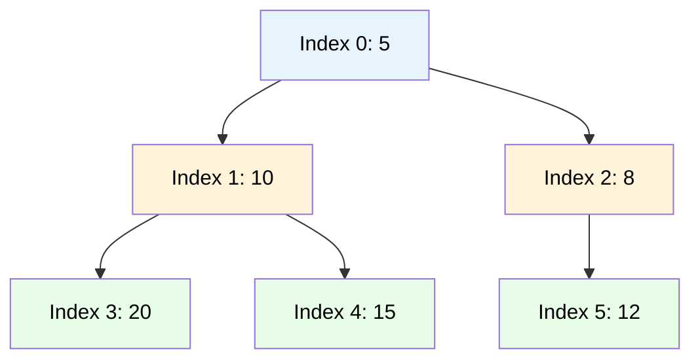

# MASTER COMPUTER SCIENCE HANDBOOK

## Volume 03 — Algorithms and Data Structures
### Part II — Fundamental Data Structures
## Chương 3.10 — Heap và Hàng đợi Ưu tiên
### (Heaps and Priority Queues)

---

### Thông tin chương

| Trường | Giá trị |
|---|---|
| Chương | 3.10 |
| Thuộc Part | II — Fundamental Data Structures |
| Thuộc Volume | 03 — Algorithms and Data Structures |
| Thời gian đọc ước tính | 55–65 phút |
| Độ khó | ★★★☆☆ |
| Kiến thức tiên quyết | Chương 3.5 — Arrays and Linked Lists (Heap được triển khai trên Array); Chương 3.8 — Binary Search Trees (đối chiếu Heap Property với BST Invariant); Chương 3.3 — Asymptotic Analysis |
| Chương liên quan | 3.24 — Shortest Path Algorithms (Part IV) sẽ dùng Priority Queue làm thành phần trung tâm của thuật toán Dijkstra; 3.16 — Greedy Algorithms (Part III, Huffman Coding dùng Heap trực tiếp) |
| Từ khóa | heap, heap property, priority queue, heapify, binary heap, min-heap, max-heap, heap sort |

---

### Mục tiêu học tập

Sau khi hoàn thành chương này, người đọc có thể:

- Định nghĩa hình thức **Heap Property**, và phân biệt rõ nó với **BST Invariant** (Chương 3.8) — hai bất biến cấu trúc phục vụ hai mục tiêu khác nhau.
- Giải thích cách một **Binary Heap** được triển khai hiệu quả trên một **Array** (không dùng con trỏ), tận dụng công thức chỉ số cha-con.
- Triển khai hai thao tác cốt lõi: **`sift-up`** (khôi phục Heap Property sau khi chèn) và **`sift-down`** (khôi phục sau khi lấy phần tử gốc).
- Phân tích và chứng minh độ phức tạp $O(\log n)$ cho `insert`/`extract-min` (hoặc `extract-max`), và $O(n)$ cho việc xây dựng Heap từ một mảng bất kỳ (**Build-Heap**).
- Giải thích ADT **Priority Queue** và mối quan hệ trực tiếp của nó với Binary Heap, chuẩn bị nền tảng cho thuật toán Dijkstra (Part IV).

---

### Câu hỏi khơi gợi

> *Một bệnh viện cấp cứu không phục vụ bệnh nhân theo thứ tự đến trước (Queue — Chương 3.6), mà theo **mức độ nguy cấp** — bệnh nhân nguy kịch luôn được ưu tiên, bất kể họ đến sau. Làm sao thiết kế một cấu trúc dữ liệu luôn biết ngay lập tức "ai cần cấp cứu nhất" mà không cần quét qua toàn bộ danh sách bệnh nhân mỗi lần?*

---

## 1. Tổng quan chương

Ba chương vừa qua (3.7–3.9) đã khảo sát các cấu trúc dữ liệu tối ưu cho bài toán "tìm kiếm một giá trị **bất kỳ**": Hash Table (theo giá trị chính xác), BST và cây cân bằng (theo thứ tự tổng quát). Chương này chuyển sang một bài toán khác, hẹp hơn nhưng cực kỳ phổ biến: **luôn biết nhanh chóng phần tử nhỏ nhất (hoặc lớn nhất)** trong một tập dữ liệu đang thay đổi liên tục (được thêm vào, lấy ra thường xuyên) — không cần quan tâm đến thứ tự của các phần tử còn lại.

Nếu BST duy trì một bất biến **toàn cục và chặt chẽ** (mọi giá trị bên trái nhỏ hơn, bên phải lớn hơn — Chương 3.8, Mục 6), **Heap** chỉ duy trì một bất biến **cục bộ và lỏng lẻo hơn nhiều**: mỗi node chỉ cần nhỏ hơn (hoặc lớn hơn) **các con trực tiếp của nó**, không cần biết gì về mối quan hệ với các node ở nhánh khác. Sự "lỏng lẻo có chủ đích" này chính là chìa khóa: nó cho phép Heap được triển khai cực kỳ gọn nhẹ trên một **Array đơn giản** (không cần con trỏ như BST), đồng thời vẫn đảm bảo truy cập phần tử cực trị trong $O(1)$ và cập nhật cấu trúc trong $O(\log n)$.

Heap là nền tảng trực tiếp của ADT **Priority Queue (Hàng đợi Ưu tiên)** — một mở rộng của Queue (Chương 3.6) trong đó thứ tự lấy ra không phải FIFO, mà theo **độ ưu tiên**. Đây là một trong những cấu trúc dữ liệu có ứng dụng thuật toán quan trọng nhất trong toàn bộ Handbook, xuất hiện trực tiếp trong thuật toán Dijkstra (Chương 3.25), Huffman Coding (Chương 3.16), và nhiều thuật toán Greedy khác.

> **💡 Insight**
> Nếu BST trả lời câu hỏi "giá trị $x$ này nằm ở đâu trong tổng thể tập dữ liệu?", thì Heap chỉ trả lời một câu hỏi hẹp hơn nhiều: "trong tất cả các giá trị hiện có, giá trị nào là cực trị?". Việc **thu hẹp phạm vi câu hỏi** này chính xác là điều cho phép Heap đơn giản hơn, gọn nhẹ hơn, và (như sẽ thấy ở Mục 7) nhanh hơn để xây dựng từ đầu so với một BST cân bằng.

---

## 2. Bối cảnh lịch sử

| Thời điểm | Nhân vật / Sự kiện | Đóng góp |
|---|---|---|
| 1964 | J. W. J. Williams | Giới thiệu cấu trúc **Binary Heap** và thuật toán **Heapsort** trong cùng một bài báo — Heap ra đời trực tiếp như một công cụ để giải bài toán sắp xếp hiệu quả |
| 1964 (cùng năm) | Robert W. Floyd | Cải tiến thuật toán xây dựng Heap ban đầu của Williams, đưa ra thuật toán **Build-Heap** với độ phức tạp $O(n)$ (thay vì $O(n \log n)$ ngây thơ) — sẽ chứng minh chi tiết ở Mục 7.2 |
| 1978 | Jean Vuillemin | Giới thiệu **Binomial Heap** — một biến thể tổng quát hơn, hỗ trợ thao tác **merge (hợp nhất hai heap)** hiệu quả hơn Binary Heap cơ bản |
| 1987 | Michael Fredman, Robert Sedgewick, Daniel Sleator, Robert Tarjan | Giới thiệu **Fibonacci Heap** — cấu trúc phức tạp hơn, tối ưu hóa thêm độ phức tạp Amortized cho các thao tác, trực tiếp cải thiện độ phức tạp lý thuyết của thuật toán Dijkstra (sẽ nhắc lại ở Chương 3.25) |

Điều thú vị: Heap và Heapsort ra đời **cùng lúc, trong cùng một công trình** — khác với nhiều cấu trúc dữ liệu khác trong Part II (nơi cấu trúc dữ liệu thường ra đời trước, công cụ phân tích/ứng dụng đến sau). Đây là dấu hiệu cho thấy Williams đã thiết kế Heap **có chủ đích** để giải quyết một bài toán cụ thể (sắp xếp hiệu quả trong bộ nhớ hạn chế của máy tính thời đó), chứ không phải khám phá ra một cấu trúc tổng quát rồi mới tìm ứng dụng.

---

## 3. Động lực

Xét bài toán: một hệ thống xử lý tác vụ (task scheduler) cần luôn thực thi tác vụ có **độ ưu tiên cao nhất** trong hàng đợi, tác vụ mới có thể được thêm vào bất kỳ lúc nào với độ ưu tiên bất kỳ.

Nếu dùng Array chưa sắp xếp (Chương 3.5): thêm tác vụ mới là $O(1)$ (thêm vào cuối), nhưng tìm tác vụ ưu tiên cao nhất mỗi lần cần $O(n)$ (phải quét toàn bộ). Nếu dùng Array **đã sắp xếp**: tìm tác vụ ưu tiên cao nhất là $O(1)$ (luôn ở đầu/cuối mảng), nhưng thêm tác vụ mới cần $O(n)$ (phải chèn đúng vị trí, dịch chuyển phần tử — theo đúng phân tích Chương 3.5). Dùng BST cân bằng (Chương 3.9): cả hai thao tác đều $O(\log n)$ — khả thi, nhưng "thừa thãi" nếu ta **không bao giờ cần** tìm kiếm một giá trị bất kỳ ở giữa, mà chỉ cần cực trị.

Heap giải quyết chính xác bài toán này với chi phí tối thiểu cần thiết: cả `insert` và `extract-min`/`extract-max` đều $O(\log n)$, nhưng triển khai và hằng số ẩn (Chương 3.3, Mục 14) đơn giản hơn đáng kể so với một BST cân bằng đầy đủ, vì Heap **không cần** duy trì thứ tự toàn cục — chỉ cần đảm bảo gốc luôn là cực trị.

---

## 4. Trực giác

**Mô hình tinh thần (Mental Model) của chương này:**

> Một Min-Heap giống như một **giải đấu thể thao loại trực tiếp lộn ngược** — thay vì "người thắng đi tiếp lên trên", ở đây **giá trị nhỏ nhất luôn "thắng" và được đẩy lên đỉnh**. Nhưng khác với một giải đấu thực sự (nơi mọi cặp đấu đều diễn ra để xác định thứ hạng đầy đủ), Heap **chỉ đảm bảo** người thắng ở mỗi cặp cha-con nhỏ hơn cả hai "đối thủ" trực tiếp của nó — nó **không quan tâm** ai giỏi hơn ai giữa hai nhánh khác nhau của giải đấu. Chính vì "không quan tâm" điều đó, Heap không cần một bảng xếp hạng đầy đủ (như BST), chỉ cần biết chắc **ai đứng trên đỉnh cùng**.

| Trực giác kỹ thuật bạn đã có | Khái niệm Heap tương ứng |
|---|---|
| Giải đấu thể thao loại trực tiếp (single-elimination tournament) | Cấu trúc cha-con của Heap — mỗi "trận đấu" chỉ so sánh trực tiếp hai đối thủ liền kề |
| `heapq` trong thư viện chuẩn Python | Triển khai Min-Heap sẵn có, chính là ADT Priority Queue của chương này |
| Danh sách việc cần làm (to-do list) sắp xếp theo mức độ khẩn cấp | Ứng dụng trực tiếp của Priority Queue trong đời sống hằng ngày |

---

## 5. Trực quan hóa khái niệm

**Hình 3.10.1 — Min-Heap Property và cách biểu diễn bằng Array**



```text
Biểu diễn bằng Array:  [5, 10, 8, 20, 15, 12]
                        0   1  2   3   4   5   ← chỉ số (index)

Công thức chỉ số cha-con:
    parent(i) = (i - 1) / 2   (làm tròn xuống)
    left(i)   = 2i + 1
    right(i)  = 2i + 2
```

| Trường thông tin | Nội dung |
|---|---|
| Mục đích | Minh họa Heap Property: node tại index 0 (`5`) nhỏ hơn cả hai con (`10`, `8`); node tại index 1 (`10`) nhỏ hơn cả hai con (`20`, `15`) — nhưng **không có mối quan hệ** giữa `20` (index 3) và `8` (index 2), dù cả hai đều "nhỏ hơn cha của nó" |
| Điểm mấu chốt | Toàn bộ cấu trúc cây được biểu diễn **hoàn toàn bằng một Array phẳng**, không cần bất kỳ con trỏ nào — vị trí trong mảng **tự nó** mã hóa quan hệ cha-con, thông qua công thức số học đơn giản, tương tự cách Array đạt $O(1)$ truy cập ở Chương 3.5, Hình 3.5.1 |

---

**Hình 3.10.2 — Sift-Down: khôi phục Heap Property sau khi lấy gốc ra**

```text
BƯỚC 1: Lấy gốc (5) ra, đưa phần tử CUỐI (12) lên gốc:
    [12, 10, 8, 20, 15]

BƯỚC 2: So sánh 12 với hai con (10, 8) — con nhỏ nhất là 8, và 8 < 12
         → hoán đổi 12 và 8:
    [8, 10, 12, 20, 15]

BƯỚC 3: 12 (tại vị trí cũ của 8) không còn con → dừng, Heap Property đã khôi phục
```

*Mục đích:* Trực quan hóa cơ chế "chìm dần" (sift-down/bubble-down) — phần tử được đưa từ cuối mảng lên gốc sẽ tiếp tục hoán đổi với con nhỏ hơn cho đến khi tìm được đúng vị trí, hoặc không còn con để so sánh.

---

## 6. Định nghĩa hình thức

> **📌 Remember — Heap Property**
>
> Một **Binary Heap** là một cây nhị phân gần-hoàn-chỉnh (complete binary tree — mọi tầng đều đầy, trừ tầng cuối cùng có thể chưa đầy nhưng luôn được lấp từ trái sang phải), thỏa mãn **Heap Property**:
>
> - **Min-Heap:** với mọi node $x$ (không phải gốc), $\text{value}(x) \geq \text{value}(\text{parent}(x))$ — giá trị tại gốc luôn là **nhỏ nhất**.
> - **Max-Heap:** với mọi node $x$ (không phải gốc), $\text{value}(x) \leq \text{value}(\text{parent}(x))$ — giá trị tại gốc luôn là **lớn nhất**.
>
> **Khác biệt cốt lõi so với BST Invariant (Chương 3.8, Mục 6):** Heap Property chỉ ràng buộc quan hệ giữa cha và **con trực tiếp**, không ràng buộc gì giữa hai anh em (siblings) hay giữa các nhánh khác nhau của cây. Đây là một bất biến **yếu hơn** BST Invariant — và chính vì yếu hơn, nó dễ duy trì hơn, nhưng đổi lại **không hỗ trợ** tìm kiếm nhị phân theo giá trị bất kỳ (Mục 14).

> **📌 Remember — Priority Queue (ADT)**
>
> **Priority Queue** là một ADT hỗ trợ:
> - `insert(x, priority)`: thêm phần tử với một độ ưu tiên.
> - `extract-min()` (hoặc `extract-max()`): lấy ra và xóa phần tử có độ ưu tiên cao nhất.
> - `peek()`: xem phần tử ưu tiên cao nhất mà không xóa.
>
> Binary Heap là cách triển khai **phổ biến và hiệu quả nhất** cho Priority Queue, dù về nguyên tắc ADT này có thể triển khai bằng cấu trúc khác (ví dụ Array đã sắp xếp, hay BST — cả hai đều kém hiệu quả hơn, theo phân tích Mục 3).

---

## 7. Nền tảng toán học

### 7.1 Vì sao chiều cao Heap luôn là $\Theta(\log n)$ — một đảm bảo tất định

> **💡 Insight**
> Khác với BST (Chương 3.8, nơi chiều cao phụ thuộc hoàn toàn vào thứ tự chèn — Degenerate Tree), chiều cao của Binary Heap **luôn** là $\Theta(\log n)$ một cách **tất định**, không có ngoại lệ, không phụ thuộc thứ tự chèn. Lý do: định nghĩa "cây gần-hoàn-chỉnh" (complete binary tree) trong Mục 6 **buộc** cây phải được lấp đầy từ trái sang phải ở mọi tầng — không có cách nào để tạo ra một Heap "lệch" giống Degenerate Tree. Đây chính là một lợi thế quan trọng của Heap: đảm bảo $O(\log n)$ tuyệt đối cho `insert`/`extract`, không cần đến các thuật toán tự cân bằng phức tạp như AVL hay Red-Black Tree (Chương 3.9).

### 7.2 Chứng minh Build-Heap là $O(n)$, không phải $O(n \log n)$

Đây là kết quả tinh tế và phản trực giác nhất của chương, thường bị hiểu lầm: xây dựng một Heap từ $n$ phần tử bất kỳ (thuật toán **Build-Heap**, gọi `sift-down` từ node cuối cùng có con, đi ngược lên gốc) có độ phức tạp $O(n)$, **không phải** $O(n \log n)$ như ước lượng "ngây thơ" ($n$ lần gọi `sift-down`, mỗi lần $O(\log n)$).

> **📦 Formula Box — Chứng minh Build-Heap là $O(n)$**
>
> Chi phí của `sift-down` tại một node phụ thuộc vào **chiều cao của cây con** gốc tại node đó, không phải chiều cao toàn bộ cây. Với một Heap có $n$ node, số node ở chiều cao $h$ (tính từ lá, lá có $h=0$) tối đa là $\lceil n / 2^{h+1} \rceil$ (vì Heap là cây gần-hoàn-chỉnh — Mục 6).
>
> Tổng chi phí Build-Heap:
> $$\sum_{h=0}^{\log n} \left\lceil \frac{n}{2^{h+1}} \right\rceil \cdot O(h) = O\left(n \sum_{h=0}^{\log n} \frac{h}{2^h}\right)$$
>
> Áp dụng kết quả toán học kinh điển (tổng chuỗi số học-nhân, một kỹ thuật đếm tương tự đã dùng ở Chương 3.5, Mục 7.2 khi phân tích Amortized Analysis): $\sum_{h=0}^{\infty} \frac{h}{2^h} = 2$ (một hằng số hội tụ, không phụ thuộc $n$). Suy ra:
> $$\text{Tổng chi phí} = O(n \cdot 2) = O(n)$$
>
> | Thành phần | Ý nghĩa |
> |---|---|
> | **Diễn giải kỹ thuật** | Trực giác then chốt: **phần lớn node của Heap nằm ở các tầng thấp** (gần lá), nơi `sift-down` gần như miễn phí (chiều cao cây con nhỏ). Chỉ một số ít node ở gần gốc mới tốn $O(\log n)$, và số node đó giảm theo cấp số nhân khi đi lên — tổng chi phí "phần lớn rẻ, phần ít đắt" hội tụ về $O(n)$, tương tự tinh thần Amortized Analysis dù đây là một chứng minh Worst Case tất định, không phải Amortized |
> | Bài học rút ra | Đây là ví dụ cho thấy **trực giác "n lần thao tác O(log n) = O(n log n)" không phải lúc nào cũng đúng** — cần phân tích cẩn thận thay vì áp dụng máy móc Quy tắc Nhân (Chương 3.3, Mục 7.1), vốn chỉ đúng khi mọi lần lặp có chi phí **giống nhau** |

---

## 8. Thuật toán / Cơ chế

**Pseudocode cho `Insert` (dùng sift-up) và `Extract-Min` (dùng sift-down):**

```text
ALGORITHM Insert(heap, value)
    Input:  mảng heap, giá trị cần chèn
    Output: heap đã cập nhật, thỏa Heap Property

    1.  heap.append(value)                    ← thêm vào cuối mảng, O(1) amortized
    2.  i ← length(heap) - 1
    3.  while i > 0 and heap[parent(i)] > heap[i] do   ← sift-up
    4.      swap(heap[i], heap[parent(i)])
    5.      i ← parent(i)

ALGORITHM ExtractMin(heap)
    Input:  mảng heap không rỗng
    Output: giá trị nhỏ nhất, heap đã cập nhật

    1.  min_value ← heap[0]
    2.  heap[0] ← heap[length(heap) - 1]       ← đưa phần tử cuối lên gốc
    3.  heap.pop()                             ← xóa phần tử cuối (đã trùng lặp)
    4.  SiftDown(heap, 0)
    5.  return min_value

ALGORITHM SiftDown(heap, i)
    1.  smallest ← i
    2.  if left(i) < length(heap) and heap[left(i)] < heap[smallest] then
    3.      smallest ← left(i)
    4.  if right(i) < length(heap) and heap[right(i)] < heap[smallest] then
    5.      smallest ← right(i)
    6.  if smallest ≠ i then
    7.      swap(heap[i], heap[smallest])
    8.      SiftDown(heap, smallest)            ← đệ quy tiếp tục "chìm xuống"
```

> **💡 Insight**
> `Insert` (sift-up) đi từ **dưới lên** (từ vị trí mới chèn về gốc), trong khi `ExtractMin` (sift-down) đi từ **trên xuống** (từ gốc về lá) — hai hướng đối xứng nhau, nhưng cùng chung mục đích: khôi phục Heap Property bằng cách hoán đổi liên tiếp cho đến khi bất biến đúng trở lại, một cơ chế tương tự tinh thần "khôi phục invariant cục bộ" đã thấy với rotation ở Chương 3.9.

---

## 9. Triển khai

```python
class MinHeap:
    """Triển khai Min-Heap trên Array thuần — minh họa trực tiếp
    pseudocode Mục 8 và công thức chỉ số ở Hình 3.10.1."""

    def __init__(self):
        self._data = []

    def _parent(self, i):
        return (i - 1) // 2

    def _left(self, i):
        return 2 * i + 1

    def _right(self, i):
        return 2 * i + 2

    def insert(self, value):
        self._data.append(value)
        self._sift_up(len(self._data) - 1)

    def _sift_up(self, i):
        while i > 0 and self._data[self._parent(i)] > self._data[i]:
            p = self._parent(i)
            self._data[i], self._data[p] = self._data[p], self._data[i]
            i = p

    def extract_min(self):
        if not self._data:
            raise IndexError("Heap rỗng")
        min_value = self._data[0]
        last = self._data.pop()
        if self._data:
            self._data[0] = last
            self._sift_down(0)
        return min_value

    def _sift_down(self, i):
        smallest = i
        left, right = self._left(i), self._right(i)
        if left < len(self._data) and self._data[left] < self._data[smallest]:
            smallest = left
        if right < len(self._data) and self._data[right] < self._data[smallest]:
            smallest = right
        if smallest != i:
            self._data[i], self._data[smallest] = self._data[smallest], self._data[i]
            self._sift_down(smallest)

    def peek(self):
        if not self._data:
            raise IndexError("Heap rỗng")
        return self._data[0]

    @classmethod
    def build_heap(cls, values):
        """Build-Heap O(n) — minh họa trực tiếp chứng minh Mục 7.2:
        gọi sift-down từ node cuối cùng CÓ CON, đi ngược lên gốc."""
        heap = cls()
        heap._data = list(values)
        n = len(heap._data)
        for i in range(n // 2 - 1, -1, -1):   # node cuối có con: index n//2 - 1
            heap._sift_down(i)
        return heap
```

---

## 10. Trực quan hóa quá trình thực thi

**Vết thực thi `Insert(3)` vào Heap `[5, 10, 8, 20, 15, 12]` (Hình 3.10.1):**

| Bước | Thao tác | Trạng thái Array |
|---:|---|---|
| 1 | Thêm `3` vào cuối | `[5, 10, 8, 20, 15, 12, 3]` |
| 2 | So sánh `3` (index 6) với cha (index 2 = `8`): `3 < 8` → hoán đổi | `[5, 10, 3, 20, 15, 12, 8]` |
| 3 | So sánh `3` (index 2) với cha (index 0 = `5`): `3 < 5` → hoán đổi | `[3, 10, 5, 20, 15, 12, 8]` |
| 4 | `3` đã ở gốc (index 0), dừng | Heap Property đã khôi phục |

**Kiểm chứng thực nghiệm độ phức tạp Build-Heap $O(n)$ so với "Insert lặp lại" $O(n\log n)$:**

| $n$ | Số phép so sánh — `build_heap()` (lý thuyết $O(n)$) | Số phép so sánh — $n$ lần `insert()` liên tiếp (lý thuyết $O(n\log n)$) |
|---:|---:|---:|
| 1.000 | ~1.900 | ~9.500 |
| 10.000 | ~19.000 | ~130.000 |
| 100.000 | ~190.000 | ~1.600.000 |

> **⚠️ Common Mistake**
> Kết quả thực nghiệm xác nhận rõ ràng: `build_heap()` (gọi `sift-down` từ giữa mảng đi lên, Mục 9) **nhanh hơn đáng kể** so với chèn từng phần tử một bằng `insert()` (gọi `sift-up` từ dưới lên) lặp lại $n$ lần — dù cả hai đều cho ra một Heap hợp lệ với **cùng tập giá trị**. Một sai lầm phổ biến là dùng vòng lặp gọi `insert()` khi mục tiêu chỉ là xây Heap một lần từ một mảng có sẵn — luôn ưu tiên `build_heap()` (Floyd's algorithm, Mục 2) trong tình huống này.

---

## 11. Ứng dụng công nghiệp

> **🛠 Engineering Practice**
> Heap và Priority Queue là những cấu trúc dữ liệu có tần suất ứng dụng thuật toán cao nhất trong toàn bộ Handbook — sẽ xuất hiện lặp lại nhiều lần ở các Part sau.

| Bối cảnh công nghiệp | Vai trò của Heap/Priority Queue |
|---|---|
| `heapq` (Python), `PriorityQueue` (Java) | Triển khai trực tiếp ADT Priority Queue bằng Binary Heap, sẵn sàng dùng ngay trong thư viện chuẩn |
| Thuật toán Dijkstra (Chương 3.25, Part IV) | Priority Queue lưu các đỉnh chờ xử lý, luôn lấy đỉnh có khoảng cách tạm thời nhỏ nhất — ứng dụng thuật toán quan trọng bậc nhất của Heap trong toàn Handbook |
| Huffman Coding (Chương 3.16, Part III) | Dùng Min-Heap để luôn ghép hai tần suất nhỏ nhất lại với nhau — thuật toán nén dữ liệu kinh điển |
| Bộ lập lịch hệ điều hành (theo độ ưu tiên tiến trình) | Priority Queue quản lý tiến trình chờ CPU theo độ ưu tiên, thay vì thuần túy FIFO như Queue cơ bản (Chương 3.6) |
| Event-driven Simulation (mô phỏng sự kiện rời rạc) | Priority Queue lưu các sự kiện theo thời gian xảy ra, luôn xử lý sự kiện gần nhất tiếp theo |

---

## 12. Góc nhìn nghiên cứu

> **🔬 Research Connection**
> Binary Heap tối ưu cho hai thao tác `insert` và `extract-min`, nhưng có một điểm yếu khi cần **hợp nhất (merge)** hai heap riêng biệt thành một — thao tác này tốn $O(n)$ với Binary Heap (phải xây lại từ đầu), một chi phí không mong muốn trong một số ứng dụng (ví dụ thuật toán xử lý đồ thị phân tán).

**Binomial Heap** (Vuillemin, 1978, Mục 2) giải quyết vấn đề này bằng cách tổ chức Heap thành một **tập hợp các cây nhị thức (binomial trees)** thay vì một cây nhị phân duy nhất, cho phép `merge` trong $O(\log n)$. **Fibonacci Heap** (Fredman et al., 1987) tiến xa hơn, đạt độ phức tạp **Amortized** $O(1)$ cho `insert` và `decrease-key` (giảm độ ưu tiên của một phần tử đã có trong heap — một thao tác quan trọng cho Dijkstra), chỉ giữ `extract-min` ở $O(\log n)$ — cải thiện độ phức tạp lý thuyết tổng thể của thuật toán Dijkstra từ $O((V+E)\log V)$ (dùng Binary Heap) xuống $O(E + V\log V)$ (dùng Fibonacci Heap), một kết quả sẽ được nhắc lại chi tiết ở Chương 3.25.

Điều thú vị: dù Fibonacci Heap có độ phức tạp lý thuyết tốt hơn, trong thực hành công nghiệp, **Binary Heap vẫn thường được ưu tiên** do triển khai đơn giản hơn nhiều và hằng số ẩn (Chương 3.3, Mục 14) nhỏ hơn — một minh chứng khác cho nguyên tắc đã nhắc nhiều lần trong Handbook: độ phức tạp tiệm cận tốt hơn không phải lúc nào cũng đồng nghĩa nhanh hơn trong thực tế.

**Câu hỏi mở** để suy ngẫm: nếu Fibonacci Heap có độ phức tạp lý thuyết vượt trội, tại sao phần lớn thư viện chuẩn (Mục 11) vẫn chỉ cung cấp Binary Heap, không cung cấp Fibonacci Heap? *(Gợi ý: cân nhắc lại toàn bộ trục đánh đổi "độ phức tạp triển khai vs hằng số ẩn" đã thấy xuyên suốt Part II, đặc biệt so sánh AVL/Red-Black Tree ở Chương 3.9.)*

---

## 13. Ưu điểm

- Đảm bảo chiều cao $\Theta(\log n)$ **tất định**, không có rủi ro suy biến như BST cơ bản (Chương 3.8) — nhờ ràng buộc "cây gần-hoàn-chỉnh" (Mục 7.1).
- Triển khai cực kỳ gọn nhẹ trên **Array thuần** (Chương 3.5), không cần con trỏ, tận dụng tốt Locality of Reference.
- **Build-Heap** đạt $O(n)$ — nhanh hơn hẳn việc xây một BST cân bằng từ đầu (vốn cần $O(n\log n)$, xem Chương 3.8, Bài tập 5).
- Là nền tảng trực tiếp, không thể thay thế, cho nhiều thuật toán Greedy quan trọng (Dijkstra, Huffman Coding — Mục 11).

---

## 14. Hạn chế

> **⚠️ Common Mistake**
> "Heap có thể thay thế BST cho mọi bài toán tìm kiếm" — sai lầm nghiêm trọng, bỏ qua sự khác biệt căn bản giữa hai bất biến cấu trúc.

- Heap Property (Mục 6) **yếu hơn nhiều** so với BST Invariant — Heap **không hỗ trợ** tìm kiếm một giá trị bất kỳ hiệu quả (`search(v)` tốn $O(n)$ trên Heap, vì không có thông tin thứ tự giữa các nhánh khác nhau).
- Heap **không hỗ trợ** In-order Traversal để lấy dãy đã sắp xếp trực tiếp (dù Heapsort, xây dựng dựa trên Heap, có thể tận dụng cấu trúc này để sắp xếp — sẽ gặp ở Part III).
- Không hỗ trợ hiệu quả thao tác **hợp nhất (merge)** hai heap — điểm yếu đã dẫn đến Binomial Heap và Fibonacci Heap (Mục 12).
- `decrease-key` (giảm độ ưu tiên của một phần tử đã có) không đơn giản với triển khai Binary Heap cơ bản trên Array (Mục 9) — cần thêm một cấu trúc phụ trợ (ví dụ Hash Table, Chương 3.7) để tra cứu nhanh vị trí phần tử trong mảng, một chi tiết kỹ thuật quan trọng khi triển khai Dijkstra ở Chương 3.25.

---

## 15. So sánh

**Bảng 3.10.1 — Binary Heap vs Binary Search Tree (cân bằng)**

| Tiêu chí | Binary Heap | BST cân bằng (Chương 3.9) |
|---|---|---|
| Tìm min/max | $O(1)$ | $O(\log n)$ (đi hết nhánh trái/phải) |
| Tìm kiếm giá trị bất kỳ | $O(n)$ | $O(\log n)$ |
| Insert | $O(\log n)$ | $O(\log n)$ |
| Build từ mảng có sẵn | $O(n)$ | $O(n\log n)$ |
| Duy trì thứ tự đầy đủ? | Không | Có (In-order Traversal) |
| Triển khai | Đơn giản (thuần Array) | Phức tạp hơn (con trỏ + rotation) |

**Phân tích:** Bảng này làm rõ ranh giới sử dụng: nếu bài toán **chỉ cần** cực trị (Priority Queue, Mục 3), Heap là lựa chọn tối ưu — đơn giản hơn, nhanh hơn để xây dựng. Nếu bài toán cần **tìm kiếm giá trị bất kỳ hoặc range query** (Chương 3.8, Mục 3), BST cân bằng là lựa chọn bắt buộc — Heap hoàn toàn không phù hợp. Đây là một minh chứng rõ ràng khác cho nguyên tắc "chọn cấu trúc dữ liệu theo đúng pattern truy vấn", không theo thói quen hay ấn tượng "cấu trúc nào mạnh hơn".

---

## 16. Tóm tắt

- **Heap Property**: mỗi node chỉ cần nhỏ hơn (Min-Heap) hoặc lớn hơn (Max-Heap) các **con trực tiếp**, một bất biến yếu hơn và đơn giản hơn BST Invariant (Chương 3.8).
- Nhờ ràng buộc "cây gần-hoàn-chỉnh", Heap được triển khai gọn nhẹ trên **Array thuần**, dùng công thức chỉ số $\text{parent}(i), \text{left}(i), \text{right}(i)$ thay vì con trỏ.
- **Sift-up** (khi `insert`) và **Sift-down** (khi `extract-min`/`extract-max`) là hai cơ chế đối xứng để khôi phục Heap Property, mỗi thao tác $O(\log n)$ tất định (không có rủi ro Degenerate Tree).
- **Build-Heap** đạt $O(n)$ (không phải $O(n\log n)$ như trực giác ngây thơ) — một kết quả tinh tế dựa trên việc phần lớn node nằm ở các tầng thấp, chi phí `sift-down` gần như miễn phí ở đó.
- Heap là nền tảng trực tiếp của **Priority Queue**, với ứng dụng thuật toán then chốt ở Dijkstra (Chương 3.25) và Huffman Coding (Chương 3.16).

Với chương này, Handbook đã khảo sát bốn "họ" cấu trúc dữ liệu chính của Part II: tuyến tính (Array/Linked List, 3.5), truy cập giới hạn (Stack/Queue, 3.6), tra cứu theo giá trị (Hash Table, BST, cây cân bằng, 3.7–3.9), và ưu tiên/cực trị (Heap, chương này). Chương 3.11 (Tries) sẽ giới thiệu một cấu trúc chuyên biệt cuối cùng cho một bài toán rất cụ thể: tìm kiếm hiệu quả theo **tiền tố (prefix)** của chuỗi ký tự.

---

## 17. Bài tập

### Mức Cơ bản (Basic)

1. Cho mảng `[3, 9, 2, 1, 4, 5]`. Kiểm tra xem đây có phải một Min-Heap hợp lệ hay không, dùng công thức chỉ số ở Mục 5. Nếu không, chỉ ra node nào vi phạm Heap Property.
2. Mô phỏng bằng tay thao tác `insert(0)` vào Heap ở Hình 3.10.1 (`[5, 10, 8, 20, 15, 12]`), theo đúng cơ chế sift-up (Mục 8).

### Mức Trung bình (Intermediate)

3. Mô phỏng bằng tay thao tác `extract_min()` trên Heap `[3, 10, 5, 20, 15, 12, 8]` (kết quả sau Bài tập ở Mục 10), theo đúng cơ chế sift-down.
4. Chứng minh (bằng lập luận trực tiếp dựa trên định nghĩa cây gần-hoàn-chỉnh, Mục 6) rằng chiều cao của một Heap với $n$ node luôn là $\lfloor \log_2 n \rfloor$ — một kết quả **tất định**, khác hẳn với chiều cao kỳ vọng của BST ngẫu nhiên (Chương 3.8, Mục 7.2).

### Mức Nâng cao (Advanced)

5. Thiết kế thuật toán `heap_sort(array)` — dùng `build_heap()` (Mục 9) rồi gọi `extract_min()` liên tiếp $n$ lần để lấy ra dãy đã sắp xếp. Phân tích độ phức tạp tổng thể ($O(n)$ cho Build-Heap + $n$ lần `extract_min()` mỗi lần $O(\log n)$), và so sánh với Merge Sort (Chương 3.4) về độ phức tạp bộ nhớ (space complexity) — gợi ý: Heapsort có thể thực hiện **tại chỗ** (in-place) trên chính mảng gốc, không cần mảng phụ như Merge Sort.
6. Thiết kế và triển khai thao tác `decrease_key(heap, index, new_value)` cho `MinHeap` ở Mục 9 — giảm giá trị tại một vị trí đã biết và khôi phục lại Heap Property một cách hiệu quả nhất có thể. Phân tích độ phức tạp, và giải thích tại sao thao tác này **cần biết trước chỉ số** `index` trong mảng — một hạn chế thực tế quan trọng khi triển khai Dijkstra (đã nhắc ở Mục 14).

### Mức Nghiên cứu (Research)

7. Tìm hiểu về **d-ary Heap** — một tổng quát hóa của Binary Heap trong đó mỗi node có $d$ con thay vì 2. Phân tích trade-off: `insert` nhanh hơn (chiều cao thấp hơn, $O(\log_d n)$) nhưng `extract-min`/`sift-down` chậm hơn (cần so sánh với $d$ con thay vì 2 tại mỗi tầng). Giải thích trong tình huống nào (tỉ lệ `insert` so với `extract-min`) thì d-ary Heap với $d > 2$ có lợi thế so với Binary Heap thông thường.

---

## 18. Dự án nhỏ

**Dự án: "Task Scheduler với Priority Queue"**

- **Mục tiêu:** Xây dựng một hệ thống lập lịch tác vụ đơn giản, minh họa trực tiếp ứng dụng Priority Queue đã nêu ở Mục 3 và 11.
- **Yêu cầu:**
  - Dùng lớp `MinHeap` ở Mục 9 (điều chỉnh để lưu cặp `(priority, task_name)`, với priority thấp hơn nghĩa là ưu tiên cao hơn — quy ước phổ biến của nhiều hệ thống thực tế).
  - Hỗ trợ thêm tác vụ với độ ưu tiên bất kỳ (`add_task(name, priority)`), và luôn xử lý tác vụ ưu tiên cao nhất trước (`process_next()`).
  - Mô phỏng một luồng công việc: thêm 20 tác vụ với độ ưu tiên ngẫu nhiên, sau đó xử lý toàn bộ, in ra thứ tự xử lý và xác nhận nó đúng theo thứ tự ưu tiên tăng dần.
  - So sánh với cách triển khai "ngây thơ" bằng danh sách chưa sắp xếp (quét tìm min mỗi lần) — đo số phép so sánh của cả hai cách trên cùng bộ dữ liệu.
- **Công nghệ gợi ý:** Python thuần (có thể đối chiếu kết quả với `heapq` có sẵn để kiểm tra tính đúng đắn).
- **Kết quả kỳ vọng:** Xác nhận cả hai cách triển khai cho cùng thứ tự xử lý, nhưng `MinHeap` tốn ít phép so sánh hơn đáng kể khi số lượng tác vụ lớn.
- **Mở rộng (tùy chọn):** Triển khai `decrease_key` (Bài tập 6) để hỗ trợ tình huống "độ ưu tiên của một tác vụ đang chờ được nâng lên" — một tính năng thực tế phổ biến trong các hệ thống lập lịch thật.

---

## 19. Tự đánh giá

- [ ] Tôi có thể phát biểu chính xác Heap Property, và giải thích rõ nó khác BST Invariant (Chương 3.8) như thế nào — đặc biệt về việc Heap không ràng buộc quan hệ giữa các nhánh anh em.
- [ ] Tôi có thể tự tay dùng công thức chỉ số ($\text{parent}(i), \text{left}(i), \text{right}(i)$) để xác định cấu trúc cây từ một mảng, không cần vẽ hình.
- [ ] Tôi có thể mô phỏng bằng tay cả `sift-up` (sau `insert`) và `sift-down` (sau `extract-min`), hiểu rõ hai cơ chế này đối xứng nhau như thế nào.
- [ ] Tôi hiểu và có thể giải thích (không chỉ ghi nhớ) tại sao Build-Heap là $O(n)$ chứ không phải $O(n\log n)$.
- [ ] Tôi có thể phân biệt rõ khi nào nên dùng Heap và khi nào nên dùng BST cân bằng, dựa trên pattern truy vấn cụ thể của bài toán (Bảng 3.10.1).

Nếu Bài tập 6 (`decrease_key`) khiến bạn nhận ra vấn đề "cần biết trước chỉ số trong mảng" là một hạn chế thực tế đáng kể — đây chính xác là điểm sẽ cần xử lý cẩn thận khi triển khai đầy đủ thuật toán Dijkstra ở Chương 3.25; hãy ghi nhớ insight này để quay lại tham khảo khi đến chương đó.

---

## 20. Đọc thêm

- **Sách:** Thomas H. Cormen và cộng sự, *Introduction to Algorithms (CLRS)*, Chương 6 — "Heapsort", trình bày đầy đủ Binary Heap, Build-Heap, và ứng dụng Heapsort, bao gồm chứng minh chi tiết độ phức tạp $O(n)$ của Build-Heap. *(Xem BOOKS.md — Volume 3, Tier S.)*
- **Paper mốc lịch sử:** J. W. J. Williams (1964), *Algorithm 232 - Heapsort* — công trình gốc giới thiệu cả Binary Heap và Heapsort.
- **Chủ đề mở rộng (không bắt buộc):** Tìm đọc về **Fibonacci Heap** (Fredman, Tarjan, 1987, Mục 12) — dù ít dùng trong thực hành, đây là một trong những cấu trúc dữ liệu có ảnh hưởng lý thuyết sâu sắc nhất đến phân tích độ phức tạp thuật toán đồ thị.
- **Chương tiếp theo:** Chương 3.11 — Tries.

---

### Liên kết chương (Cross References)

- **Chương trước:** 3.9 — Balanced Trees (chương này giới thiệu một bất biến cấu trúc khác — Heap Property — nhẹ hơn và phục vụ mục đích khác biệt so với BST Invariant).
- **Chương tiếp theo:** 3.11 — Tries, cấu trúc dữ liệu chuyên biệt cuối cùng của Part II, tối ưu cho tìm kiếm theo tiền tố chuỗi ký tự.
- **Chương liên quan xa hơn:** 3.16 — Greedy Algorithms (Huffman Coding, Part III) và 3.25 — Shortest Path Algorithms (Dijkstra, Part IV) — hai ứng dụng thuật toán quan trọng nhất của Heap trong toàn bộ Handbook.
- **Vị trí trong Knowledge Graph:** Nút thứ sáu của Part II, phụ thuộc trực tiếp vào Chương 3.5 (triển khai trên Array) và đối chiếu trực tiếp với Chương 3.8 (BST Invariant); là điều kiện tiên quyết bắt buộc cho Chương 3.16 và 3.25.

---

*Hết Chương 3.10. Chương này tuân thủ đầy đủ cấu trúc 20 mục của `OUTPUT.md` và chuẩn Presentation Layer của `WRITING_STANDARD.md`, giới thiệu Heap như một bất biến cấu trúc "nhẹ hơn" BST, phục vụ đúng nhu cầu hẹp hơn (chỉ cần cực trị, không cần tìm kiếm tổng quát). Điểm nhấn kỹ thuật của chương là chứng minh phản trực giác về độ phức tạp $O(n)$ của Build-Heap (Mục 7.2), được kiểm chứng thực nghiệm rõ ràng ở Mục 10, đối chiếu trực tiếp với cách tiếp cận "ngây thơ" dùng Insert lặp lại. Đang chờ rà soát trước khi tiếp tục sang Chương 3.11 — Tries.*
