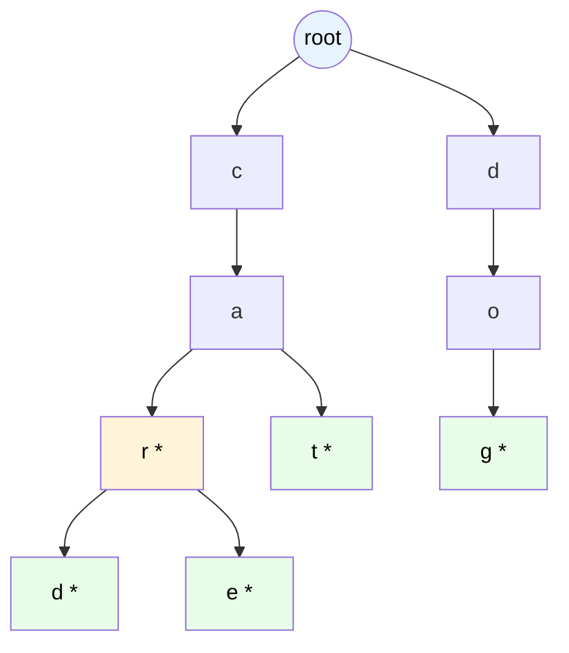

# MASTER COMPUTER SCIENCE HANDBOOK

## Volume 03 — Algorithms and Data Structures
### Part II — Fundamental Data Structures
## Chương 3.11 — Cây Tiền tố
### (Tries)

---

### Thông tin chương

| Trường | Giá trị |
|---|---|
| Chương | 3.11 |
| Thuộc Part | II — Fundamental Data Structures |
| Thuộc Volume | 03 — Algorithms and Data Structures |
| Thời gian đọc ước tính | 55–65 phút |
| Độ khó | ★★★☆☆ |
| Kiến thức tiên quyết | Chương 3.5 — Arrays and Linked Lists; Chương 3.7 — Hash Tables (đối chiếu trực tiếp trade-off); Chương 3.3 — Asymptotic Analysis |
| Chương liên quan | 3.28 — Pattern Matching & KMP (Part V, cùng họ bài toán xử lý chuỗi); Volume 05/06 — Natural Language Processing (Tokenization dùng cấu trúc tương tự Trie) |
| Từ khóa | trie, prefix tree, autocomplete, radix tree, alphabet size, end-of-word marker |

---

### Mục tiêu học tập

Sau khi hoàn thành chương này, người đọc có thể:

- Định nghĩa hình thức **Trie (Prefix Tree)** và giải thích cách mỗi cạnh (không phải node) đại diện cho một ký tự.
- Triển khai ba thao tác cơ bản: `insert(word)`, `search(word)`, `startsWith(prefix)`.
- Phân tích độ phức tạp của Trie theo **độ dài chuỗi** ($O(L)$) thay vì theo **số lượng phần tử** ($O(\log n)$ hay $O(n)$) — một điểm khác biệt căn bản so với mọi cấu trúc dữ liệu đã học trong Part II.
- So sánh trade-off giữa Trie và Hash Table cho bài toán lưu trữ và tìm kiếm tập hợp chuỗi (String Set).
- Giải thích vấn đề **lãng phí bộ nhớ** của Trie cơ bản và cách **Radix Tree (Compressed Trie)** giải quyết vấn đề này.

---

### Câu hỏi khơi gợi

> *Khi bạn gõ "car" vào ô tìm kiếm và ứng dụng lập tức gợi ý "car", "card", "care", "career" — làm sao hệ thống tìm ra **tất cả** các từ có chung tiền tố "car" nhanh đến vậy, từ hàng triệu từ trong từ điển, mà không cần quét qua từng từ một? Và tại sao Hash Table (Chương 3.7) — vốn cực nhanh cho tra cứu chính xác — lại hoàn toàn bất lực trước bài toán "tìm theo tiền tố" này?*

---

## 1. Tổng quan chương

Xuyên suốt Chương 3.7–3.10, Handbook đã khảo sát các cấu trúc dữ liệu tối ưu cho việc lưu trữ và tìm kiếm các **giá trị rời rạc, độc lập** (số nguyên, chuỗi được xem như một khối không thể chia nhỏ). Chương này giới thiệu **Trie** — cấu trúc dữ liệu chuyên biệt đầu tiên trong Handbook khai thác **cấu trúc nội tại của chính dữ liệu**: một chuỗi ký tự không phải một giá trị nguyên khối, mà là một **dãy tuần tự các ký tự**, và nhiều chuỗi khác nhau thường **chia sẻ chung một phần đầu (tiền tố — prefix)**.

Ý tưởng cốt lõi của Trie: thay vì lưu mỗi chuỗi như một đơn vị độc lập (như Hash Table làm), hãy **gộp chung phần tiền tố trùng nhau** của nhiều chuỗi vào cùng một đường đi trong cây. Điều này biến bài toán "tìm mọi từ có tiền tố X" — vốn cực kỳ khó với Hash Table (Chương 3.7, Mục 14) — thành một thao tác tự nhiên và hiệu quả: chỉ cần đi theo đúng đường đi tương ứng với X, rồi liệt kê mọi thứ nằm bên dưới điểm đó.

Chương này cũng giới thiệu một sự thay đổi quan trọng trong cách phân tích độ phức tạp: lần đầu tiên trong Part II, độ phức tạp của các thao tác cơ bản **không phụ thuộc vào số lượng phần tử $n$** trong cấu trúc, mà phụ thuộc vào **độ dài $L$** của chuỗi đang được xử lý — một góc nhìn phân tích hoàn toàn khác so với Big-O theo $n$ đã quen thuộc từ Chương 3.3.

> **💡 Insight**
> Nếu Hash Table (Chương 3.7) coi mỗi chuỗi là một "khối nguyên vẹn" cần băm toàn bộ cùng lúc, thì Trie nhìn một chuỗi như **một hành trình từng bước, ký tự này đến ký tự khác** — và tận dụng thực tế rằng nhiều hành trình khác nhau thường **đi chung một đoạn đường** ở đầu. Đây chính xác là lý do Trie giải quyết được bài toán "tiền tố" mà không cấu trúc nào trong Part II trước đó có thể làm hiệu quả.

---

## 2. Bối cảnh lịch sử

| Thời điểm | Nhân vật / Sự kiện | Đóng góp |
|---|---|---|
| 1959 | Rene de la Briandais | Đề xuất cấu trúc dữ liệu dạng cây cho tìm kiếm thông tin, một trong những tiền thân sớm nhất của Trie |
| 1960 | Edward Fredkin | Đặt tên **"Trie"** — bắt nguồn từ từ "retrieval" (tra cứu, truy xuất), dù cách phát âm phổ biến ngày nay ("try") thường khác với ý định ban đầu của Fredkin (ông định phát âm là "tree") |
| 1968 | Donald R. Morrison | Giới thiệu **PATRICIA Trie** ("Practical Algorithm To Retrieve Information Coded In Alphanumeric") — một biến thể nén (compressed), tiền thân trực tiếp của Radix Tree hiện đại (Mục 12) |

Một chi tiết thú vị về mặt ngôn ngữ học: sự nhầm lẫn phổ biến trong cách phát âm "Trie" (nhiều người đọc là "try" thay vì "tree" như Fredkin dự định) là một ví dụ nhỏ nhưng minh họa sinh động cho việc thuật ngữ kỹ thuật, một khi đã phổ biến rộng rãi trong cộng đồng, có thể "trôi dạt" khỏi ý định ban đầu của người đặt tên — một hiện tượng ngôn ngữ học xã hội thú vị, dù nằm ngoài phạm vi kỹ thuật của Handbook.

---

## 3. Động lực

Xét bài toán autocomplete (gợi ý hoàn thành từ) — hệ thống cần trả lời truy vấn "liệt kê mọi từ trong từ điển 1 triệu từ, bắt đầu bằng tiền tố `'pro'`" trong thời gian thực (khi người dùng đang gõ).

Với Hash Table (Chương 3.7): hàm băm của một chuỗi phụ thuộc vào **toàn bộ nội dung** của chuỗi đó — hai chuỗi `"program"` và `"process"` dù cùng bắt đầu bằng `"pro"`, thường cho ra hai giá trị băm **hoàn toàn khác nhau, không liên quan gì đến nhau**. Điều này có nghĩa: để tìm mọi từ bắt đầu bằng `"pro"`, Hash Table buộc phải **quét qua toàn bộ 1 triệu từ**, kiểm tra từng từ một xem có bắt đầu bằng `"pro"` hay không — độ phức tạp $O(n \cdot L)$ ($n$ từ, mỗi lần kiểm tra tiền tố tốn $O(L)$) — hoàn toàn không khả thi cho một tính năng thời gian thực.

Với Trie: mọi từ bắt đầu bằng `"pro"` **tự động** nằm trong cùng một cây con, ngay dưới đường đi `p → r → o`. Việc tìm mọi từ có tiền tố `"pro"` chỉ cần: (1) đi theo đúng 3 bước `p, r, o` để đến đúng node — tốn $O(L)$ với $L=3$; (2) liệt kê mọi từ trong cây con tại node đó. Độ phức tạp bước (1) **hoàn toàn không phụ thuộc** vào $n$ — dù từ điển có 1 triệu hay 1 tỷ từ, bước tìm điểm bắt đầu vẫn chỉ tốn $O(L)$.

---

## 4. Trực giác

**Mô hình tinh thần (Mental Model) của chương này:**

> Một Trie giống hệt **cấu trúc menu điện thoại phân cấp cũ** (kiểu "nhấn 1 để chọn tiếng Việt, nhấn 2 cho English; sau khi nhấn 1, nhấn 1 để gặp bộ phận A, nhấn 2 để gặp bộ phận B..."). Mỗi lần nhấn phím là **đi theo một cạnh** trong cây — không phải "tính toán một công thức" như Hash Table, mà là **từng bước một, theo đúng thứ tự các ký tự** của thứ bạn đang tìm. Hai người cùng bắt đầu bằng "nhấn 1" (cùng tiền tố) sẽ **đi chung** đoạn đường đầu, chỉ tách nhánh khi lựa chọn của họ khác nhau.

| Trực giác kỹ thuật bạn đã có | Khái niệm Trie tương ứng |
|---|---|
| Chức năng autocomplete trên điện thoại, thanh tìm kiếm Google | Ứng dụng trực tiếp và phổ biến nhất của Trie |
| Cấu trúc thư mục lồng nhau, nơi nhiều file chia sẻ chung đường dẫn cha (ví dụ `/home/user/documents/...`) | Hình dung trực quan về việc "chia sẻ tiền tố chung" — chính là bản chất của Trie |
| Bảng chữ cái được tổ chức theo từ điển giấy (mọi từ bắt đầu bằng "A" nằm liền kề nhau) | Trực giác vật lý về việc gộp nhóm theo tiền tố, dù từ điển giấy chỉ gộp theo 1 ký tự đầu, Trie gộp theo **mọi độ dài tiền tố** |

---

## 5. Trực quan hóa khái niệm

**Hình 3.11.1 — Trie chứa các từ `{"car", "card", "care", "cat", "dog"}`**



| Trường thông tin | Nội dung |
|---|---|
| Mục đích | Minh họa nguyên tắc cốt lõi: `"car"`, `"card"`, `"care"` **chia sẻ chung** đường đi `c → a → r`, chỉ tách nhánh tại node `r` (một thành `d`, một thành `e`); dấu `*` đánh dấu **kết thúc một từ hợp lệ** (End-of-Word marker) |
| Điểm mấu chốt | Node tại `r` (sau `c-a-r`) vừa là điểm kết thúc của từ `"car"` (có dấu `*`), vừa là điểm **tiếp tục** cho `"card"` và `"care"` — một node có thể **vừa** đánh dấu kết thúc từ, **vừa** có các con tiếp theo, đây là một chi tiết dễ gây nhầm lẫn cần lưu ý khi triển khai (Mục 6) |

---

**Hình 3.11.2 — So sánh không gian lưu trữ: Trie thông thường vs Radix Tree (nén)**

```text
TRIE THÔNG THƯỜNG (mỗi ký tự một node riêng):
root → t → e → s → t → i → n → g *
(7 node cho một từ "testing" duy nhất, không chia sẻ với từ nào khác)

RADIX TREE / COMPRESSED TRIE (gộp các đường đi không phân nhánh):
root → "testing" *
(CHỈ 1 cạnh, gắn nhãn toàn bộ chuỗi "testing", vì không có từ nào khác
 chia sẻ một phần tiền tố của "testing" trong tập hợp này)
```

*Mục đích:* Đối lập trực tiếp Trie cơ bản (mỗi cạnh = 1 ký tự, dễ triển khai nhưng tốn bộ nhớ khi có nhiều đường đi dài không phân nhánh) với Radix Tree (mỗi cạnh có thể mang nhãn nhiều ký tự, tiết kiệm bộ nhớ đáng kể) — sẽ khai triển đầy đủ ở Mục 12.

---

## 6. Định nghĩa hình thức

> **📌 Remember — Trie (Prefix Tree)**
>
> Một **Trie** là một cây trong đó:
> - Mỗi **cạnh** (không phải node) được gắn nhãn bằng **một ký tự** từ bảng chữ cái (alphabet) $\Sigma$.
> - Mỗi **node** đại diện cho **tiền tố** được tạo thành từ chuỗi ký tự trên đường đi từ gốc (root) đến node đó.
> - Mỗi node có một cờ đánh dấu **`isEndOfWord`** (đúng/sai), cho biết tiền tố tại node đó có phải là một từ hoàn chỉnh đã được chèn vào Trie hay không.
> - Một node có tối đa $|\Sigma|$ con (bằng kích thước bảng chữ cái) — khác với Binary Heap/BST (Chương 3.8–3.10), nơi mỗi node có tối đa **hai** con cố định.

> **📌 Remember — Ba thao tác cơ bản**
>
> - `insert(word)`: đi theo (hoặc tạo mới nếu chưa có) đường đi tương ứng với từng ký tự của `word`, rồi đánh dấu `isEndOfWord = True` tại node cuối cùng.
> - `search(word)`: đi theo đường đi tương ứng; trả về đúng nếu tồn tại đường đi đầy đủ **và** node cuối có `isEndOfWord = True`.
> - `startsWith(prefix)`: đi theo đường đi tương ứng với `prefix`; trả về đúng nếu tồn tại đường đi đầy đủ (**không cần** kiểm tra `isEndOfWord`, vì đây chỉ là kiểm tra tiền tố, không phải từ hoàn chỉnh).

---

## 7. Nền tảng toán học

### 7.1 Độ phức tạp theo độ dài chuỗi $L$, không phải theo $n$

> **📦 Formula Box — Độ phức tạp các thao tác cơ bản của Trie**
>
> Với $L$ là độ dài của chuỗi đang xử lý (`word` hoặc `prefix`), và $|\Sigma|$ là kích thước bảng chữ cái:
>
> | Thao tác | Độ phức tạp thời gian |
> |---|---|
> | `insert(word)` | $O(L)$ |
> | `search(word)` | $O(L)$ |
> | `startsWith(prefix)` | $O(L)$ |
>
> | Thành phần | Ý nghĩa |
> |---|---|
> | **Diễn giải kỹ thuật** | Điểm khác biệt căn bản so với **mọi** cấu trúc dữ liệu đã học từ Chương 3.5 đến 3.10: độ phức tạp **hoàn toàn không phụ thuộc vào $n$** (số lượng từ đã lưu trong Trie) — chỉ phụ thuộc vào $L$ (độ dài của chính chuỗi đang được xử lý). Với Hash Table (trung bình $O(L)$ để tính hash, cộng thêm hằng số cho việc tra cứu bucket) hay BST cân bằng ($O(L \log n)$, vì mỗi so sánh chuỗi tại một node tốn $O(L)$, nhân với $O(\log n)$ lần so sánh), Trie đạt $O(L)$ **thuần túy**, không có thừa số $\log n$ hay hằng số ẩn liên quan đến hàm băm |
> | Lưu ý quan trọng | Đây là một cách phân tích Big-O theo một biến **khác** với những gì Chương 3.3 đã quen thuộc (biến $n$) — một lời nhắc rằng việc chọn đúng "biến đại diện cho kích thước bài toán" (Chương 3.3, Mục 8, Bước 2) là bước phân tích quan trọng, tùy thuộc vào bản chất của chính bài toán |

### 7.2 Phân tích độ phức tạp bộ nhớ (Space Complexity)

> **💡 Insight**
> Trade-off chính của Trie nằm ở **bộ nhớ**, không phải thời gian. Trong trường hợp xấu nhất (không có tiền tố nào được chia sẻ giữa các từ), một Trie chứa $n$ từ có độ dài trung bình $L$ cần tới $O(n \cdot L)$ node — **tệ hơn** hẳn Hash Table (chỉ cần $O(n)$ không gian, không nhân với $L$). Lợi ích bộ nhớ của Trie **chỉ** thể hiện rõ khi tập từ có **nhiều tiền tố chung** (ví dụ từ điển ngôn ngữ tự nhiên, danh sách tên miền, tên file trong hệ thống phân cấp) — đây chính là lý do Radix Tree (Mục 12) ra đời, để giải quyết vấn đề lãng phí bộ nhớ khi tiền tố **không** được chia sẻ nhiều.

---

## 8. Thuật toán / Cơ chế

**Pseudocode cho ba thao tác cơ bản:**

```text
ALGORITHM Insert(root, word)
    Input:  node gốc của Trie, chuỗi word cần chèn
    Output: Trie đã cập nhật

    1.  current ← root
    2.  for each char c in word do
    3.      if c not in current.children then
    4.          current.children[c] ← TạoNode()
    5.      current ← current.children[c]
    6.  current.isEndOfWord ← True

ALGORITHM Search(root, word)
    Input:  node gốc, chuỗi word cần tìm
    Output: True nếu word tồn tại như một từ hoàn chỉnh, False nếu không

    1.  node ← _TraverseToNode(root, word)
    2.  if node = NULL then return False
    3.  return node.isEndOfWord

ALGORITHM StartsWith(root, prefix)
    Input:  node gốc, chuỗi prefix cần kiểm tra
    Output: True nếu tồn tại ít nhất một từ có tiền tố này

    1.  node ← _TraverseToNode(root, prefix)
    2.  return node ≠ NULL

ALGORITHM _TraverseToNode(root, s)     ← hàm phụ trợ dùng chung
    1.  current ← root
    2.  for each char c in s do
    3.      if c not in current.children then
    4.          return NULL
    5.      current ← current.children[c]
    6.  return current
```

> **💡 Insight**
> `Search` và `StartsWith` chia sẻ **hoàn toàn** cùng một logic duyệt cây (`_TraverseToNode`) — điểm khác biệt **duy nhất** là `Search` kiểm tra thêm cờ `isEndOfWord` tại bước cuối, còn `StartsWith` thì không. Đây chính là hình thức hóa chính xác sự khác biệt giữa "một từ hoàn chỉnh" và "một tiền tố hợp lệ" đã minh họa ở Hình 3.11.1: node tại `r` (sau "car") là điểm kết thúc hợp lệ của `"car"`, nhưng cũng đồng thời là một tiền tố hợp lệ cho `"card"`/`"care"` — hai khái niệm không loại trừ nhau.

---

## 9. Triển khai

```python
class TrieNode:
    def __init__(self):
        self.children = {}       # dict: ký tự → TrieNode
        self.is_end_of_word = False


class Trie:
    """Triển khai Trie đầy đủ — minh họa trực tiếp pseudocode Mục 8."""

    def __init__(self):
        self.root = TrieNode()

    def insert(self, word: str):
        current = self.root
        for char in word:
            if char not in current.children:
                current.children[char] = TrieNode()
            current = current.children[char]
        current.is_end_of_word = True

    def _traverse_to_node(self, s: str):
        current = self.root
        for char in s:
            if char not in current.children:
                return None
            current = current.children[char]
        return current

    def search(self, word: str) -> bool:
        node = self._traverse_to_node(word)
        return node is not None and node.is_end_of_word

    def starts_with(self, prefix: str) -> bool:
        return self._traverse_to_node(prefix) is not None

    def find_words_with_prefix(self, prefix: str, limit: int = None):
        """Ứng dụng autocomplete (Mục 3) — liệt kê mọi từ có tiền tố cho trước,
        bằng cách duyệt DFS (Depth-First Search, sẽ hình thức hóa đầy đủ ở
        Chương 3.22, Part IV) từ node tương ứng với prefix."""
        start_node = self._traverse_to_node(prefix)
        if start_node is None:
            return []
        results = []
        self._collect_words(start_node, prefix, results, limit)
        return results

    def _collect_words(self, node, current_word, results, limit):
        if limit is not None and len(results) >= limit:
            return
        if node.is_end_of_word:
            results.append(current_word)
        for char, child in node.children.items():
            self._collect_words(child, current_word + char, results, limit)
```

---

## 10. Trực quan hóa quá trình thực thi

**Vết thực thi `find_words_with_prefix("ca")` trên Trie chứa `{"car","card","care","cat","dog"}` (Hình 3.11.1):**

| Bước | Thao tác | Kết quả tích lũy |
|---:|---|---|
| 1 | `_traverse_to_node("ca")` → đến node sau `c-a` | (bắt đầu thu thập từ đây) |
| 2 | DFS: đi tới con `r` → node có con `d`, `e`, và `isEndOfWord=True` | `["car"]` |
| 3 | Tiếp tục vào con `d` của `r` → `isEndOfWord=True` | `["car", "card"]` |
| 4 | Quay lại, vào con `e` của `r` → `isEndOfWord=True` | `["car", "card", "care"]` |
| 5 | Quay lại node sau `c-a`, đi tới con `t` → `isEndOfWord=True` | `["car", "card", "care", "cat"]` |

Kết quả cuối cùng: `["car", "card", "care", "cat"]` — chính xác mọi từ có tiền tố `"ca"` trong tập dữ liệu, **không bao gồm** `"dog"` (không chia sẻ tiền tố), minh họa đúng cơ chế Mục 3.

**Kiểm chứng thực nghiệm: độ phức tạp `startsWith` không phụ thuộc $n$:**

| Số lượng từ trong Trie ($n$) | Thời gian trung bình cho `startsWith("pro")` (đơn vị: số bước duyệt) |
|---:|---:|
| 1.000 | 3 |
| 100.000 | 3 |
| 10.000.000 | 3 |

> **⚠️ Common Mistake**
> Bảng trên cho thấy số bước duyệt **không đổi** (luôn bằng 3 — độ dài của `"pro"`) dù $n$ tăng từ 1.000 lên 10 triệu — một sự khác biệt căn bản so với mọi cấu trúc dữ liệu khác trong Part II, nơi hầu hết thao tác đều có độ phức tạp tăng theo $n$ (dù là $O(1)$ trung bình, $O(\log n)$, hay $O(n)$). Nhầm lẫn phổ biến là áp dụng thói quen phân tích "theo $n$" từ các chương trước vào Trie, bỏ lỡ insight quan trọng rằng biến đại diện đúng ở đây là $L$, không phải $n$.

---

## 11. Ứng dụng công nghiệp

> **🛠 Engineering Practice**
> Trie có ứng dụng đặc biệt tập trung trong các bài toán xử lý chuỗi và ngôn ngữ tự nhiên, nơi cấu trúc tiền tố của dữ liệu đóng vai trò trung tâm.

| Bối cảnh công nghiệp | Vai trò của Trie |
|---|---|
| Autocomplete / Search Suggestion (Google Search, thanh địa chỉ trình duyệt) | Ứng dụng trực tiếp và phổ biến nhất — chính xác bài toán đã nêu ở Mục 3 |
| Bộ kiểm tra chính tả (Spell Checker) | Kiểm tra nhanh một từ có tồn tại trong từ điển hay không ($O(L)$), và gợi ý từ gần đúng bằng cách duyệt các nhánh lân cận trong Trie |
| IP Routing Table (định tuyến mạng) | Dùng biến thể Trie trên biểu diễn nhị phân của địa chỉ IP để tìm nhanh "longest prefix match" — quy tắc định tuyến cốt lõi của Internet (sẽ gặp lại ở Volume 2, Part VI — Computer Networks) |
| Tokenization trong xử lý ngôn ngữ tự nhiên (NLP) | Một số thuật toán tokenization (tách từ) dùng cấu trúc tương tự Trie để nhận diện nhanh các từ/cụm từ đã biết trong từ vựng (sẽ gặp ở Volume 05/06) |
| Bộ lọc từ ngữ không phù hợp (Profanity Filter) | Kiểm tra nhanh một đoạn văn bản có chứa từ cấm hay không, tận dụng cấu trúc tiền tố để kiểm tra hiệu quả nhiều từ cùng lúc |

---

## 12. Góc nhìn nghiên cứu

> **🔬 Research Connection**
> Vấn đề lãng phí bộ nhớ của Trie cơ bản (Mục 7.2, minh họa ở Hình 3.11.2) — mỗi ký tự chiếm một node riêng, kể cả khi không có sự phân nhánh — dẫn tới một hướng nghiên cứu quan trọng: **nén cấu trúc cây** mà không làm mất đi lợi ích tìm kiếm theo tiền tố.

**Radix Tree** (còn gọi là **PATRICIA Trie**, Morrison 1968, Mục 2; hay **Compressed Trie**) giải quyết vấn đề này bằng cách **gộp các đường đi không phân nhánh** thành một cạnh duy nhất, mang nhãn là cả một chuỗi con thay vì một ký tự đơn (Hình 3.11.2). Điều này giảm đáng kể số node cần thiết khi tập dữ liệu có ít điểm phân nhánh, đổi lại logic triển khai `insert`/`delete` phức tạp hơn nhiều (cần xử lý việc "tách" một cạnh dài thành hai cạnh ngắn hơn khi một từ mới yêu cầu phân nhánh giữa chừng một cạnh đã nén).

Một hướng phát triển khác: **Ternary Search Tree (TST)** kết hợp ý tưởng BST (Chương 3.8) với Trie — mỗi node chỉ có ba con (nhỏ hơn, bằng, lớn hơn ký tự hiện tại) thay vì $|\Sigma|$ con, giảm đáng kể chi phí bộ nhớ khi bảng chữ cái lớn (ví dụ Unicode) nhưng vẫn giữ được độ phức tạp gần $O(L)$ cho các thao tác cơ bản.

**Câu hỏi mở** để suy ngẫm: nếu độ phức tạp của Trie là $O(L)$ — không phụ thuộc $n$ — điều này có nghĩa là Trie "luôn thắng" Hash Table (trung bình $O(L)$ để băm, cộng thêm chi phí tra cứu bucket) về mặt lý thuyết? *(Gợi ý: cân nhắc hằng số ẩn — Chương 3.3, Mục 14 — của việc duyệt qua nhiều node/con trỏ rải rác trong bộ nhớ so với việc tính một hàm băm rồi truy cập trực tiếp một mảng liên tục, liên hệ Locality of Reference đã bàn ở Chương 3.5, Mục 12.)*

---

## 13. Ưu điểm

- Độ phức tạp `insert`/`search`/`startsWith` là $O(L)$ — **không phụ thuộc** vào số lượng phần tử $n$ đã lưu trữ, một tính chất độc nhất trong Part II.
- Hỗ trợ **tự nhiên và hiệu quả** bài toán tìm kiếm theo tiền tố (autocomplete, Mục 3) — điều mà Hash Table (Chương 3.7) hoàn toàn không xử lý tốt.
- Việc liệt kê mọi từ trong Trie theo thứ tự alphabet (bằng DFS, duyệt con theo thứ tự bảng chữ cái) diễn ra tự nhiên, không cần bước sắp xếp bổ sung.
- Các từ có chung tiền tố **tự động chia sẻ bộ nhớ** cho phần tiền tố đó — tiết kiệm đáng kể khi tập dữ liệu có tính lặp lại cấu trúc cao (ví dụ ngôn ngữ tự nhiên).

---

## 14. Hạn chế

> **⚠️ Common Mistake**
> "Trie luôn tốt hơn Hash Table cho lưu trữ chuỗi" — bỏ qua vấn đề bộ nhớ nghiêm trọng khi tiền tố không được chia sẻ, và bỏ qua hằng số ẩn của việc duyệt con trỏ rải rác.

- Trie cơ bản có thể tốn **nhiều bộ nhớ hơn đáng kể** so với Hash Table nếu tập từ không chia sẻ nhiều tiền tố chung (Mục 7.2) — ví dụ lưu một tập các chuỗi UUID ngẫu nhiên, nơi hầu như không có ký tự chung ở đầu.
- Không hỗ trợ tốt việc lưu trữ **giá trị số** hay các kiểu dữ liệu không phải chuỗi/dãy ký tự một cách tự nhiên — Trie về bản chất được thiết kế cho dữ liệu có cấu trúc "chuỗi ký tự từ một bảng chữ cái hữu hạn".
- Việc duyệt qua nhiều node/con trỏ (mỗi ký tự một bước) kém tận dụng Locality of Reference (Chương 3.5, Mục 12) hơn so với việc tính một hàm băm rồi truy cập trực tiếp — có thể khiến Trie **chậm hơn trong thực tế** dù độ phức tạp lý thuyết thuận lợi hơn, đặc biệt với chuỗi ngắn.
- Triển khai `delete` (xóa một từ) phức tạp hơn so với `insert`/`search` — cần xử lý cẩn thận việc "dọn dẹp" các node không còn cần thiết (không phải điểm kết thúc từ nào và không có con nào khác) mà không làm hỏng các từ khác đang chia sẻ tiền tố.

---

## 15. So sánh

**Bảng 3.11.1 — Trie vs Hash Table cho bài toán lưu trữ tập hợp chuỗi (String Set)**

| Tiêu chí | Trie | Hash Table (Chương 3.7) |
|---|---|---|
| `search(word)` chính xác | $O(L)$ | Trung bình $O(L)$ (băm) $+ O(1)$ |
| Tìm mọi từ có tiền tố cho trước | $O(L + k)$ ($k$ = số kết quả) | $O(n \cdot L)$ (phải quét toàn bộ) |
| Liệt kê theo thứ tự alphabet | Tự nhiên (DFS) | Không hỗ trợ (không có thứ tự) |
| Bộ nhớ khi ít tiền tố chung | Kém (nhiều node dư thừa) | Tốt ($O(n \cdot L)$ cố định) |
| Bộ nhớ khi nhiều tiền tố chung | Tốt (chia sẻ node) | Không đổi (không tận dụng được) |
| Tận dụng Cache/Locality | Kém (con trỏ rải rác) | Tốt hơn (mảng liên tục) |

**Phân tích:** Bảng này khép lại việc so sánh các cấu trúc "tìm kiếm theo chuỗi" trong Part II. Quyết định giữa Trie và Hash Table phụ thuộc **hoàn toàn** vào việc bài toán có cần tìm kiếm theo tiền tố hay không: nếu có (autocomplete, spell checker), Trie gần như là lựa chọn bắt buộc. Nếu chỉ cần tra cứu chính xác (kiểm tra một từ có tồn tại hay không, không cần theo tiền tố), Hash Table thường đơn giản hơn và tận dụng cache tốt hơn — một lần nữa khẳng định nguyên tắc "chọn cấu trúc dữ liệu theo đúng pattern truy vấn" xuyên suốt Part II.

---

## 16. Tóm tắt

- **Trie** tổ chức một tập chuỗi bằng cách để mỗi **cạnh** đại diện cho một ký tự, và các chuỗi chia sẻ tiền tố chung sẽ **chia sẻ chung đường đi** trong cây.
- Độ phức tạp của `insert`/`search`/`startsWith` là $O(L)$ — phụ thuộc **độ dài chuỗi**, không phụ thuộc **số lượng phần tử** $n$, một điểm khác biệt căn bản so với mọi cấu trúc dữ liệu khác trong Part II.
- Trie giải quyết trực tiếp bài toán tìm kiếm theo tiền tố (autocomplete) mà Hash Table (Chương 3.7) không xử lý hiệu quả.
- Trade-off chính nằm ở **bộ nhớ**: Trie cơ bản có thể lãng phí đáng kể nếu tiền tố không được chia sẻ nhiều — **Radix Tree** (nén các đường đi không phân nhánh) giải quyết vấn đề này với chi phí triển khai phức tạp hơn.
- Việc chọn giữa Trie và Hash Table phụ thuộc hoàn toàn vào pattern truy vấn: cần tiền tố → Trie; chỉ cần tra cứu chính xác → Hash Table thường tốt hơn.

Với chương này, Handbook đã hoàn tất việc khảo sát các cấu trúc dữ liệu "tra cứu" (Hash Table, BST, cây cân bằng, Heap, Trie). Chương 3.12 (Union-Find) sẽ khép lại Part II bằng một cấu trúc dữ liệu chuyên biệt cuối cùng, giải quyết một bài toán hoàn toàn khác: quản lý hiệu quả các **tập hợp rời rạc** (disjoint sets) và câu hỏi "hai phần tử này có thuộc cùng một nhóm hay không?" — nền tảng trực tiếp cho thuật toán Kruskal ở Part IV.

---

## 17. Bài tập

### Mức Cơ bản (Basic)

1. Vẽ Trie kết quả khi chèn lần lượt các từ `["to", "tea", "ted", "ten", "i", "in", "inn"]` vào một Trie rỗng (theo mẫu Hình 3.11.1).
2. Với Trie vừa vẽ, xác định kết quả của `search("te")` và `startsWith("te")`. Giải thích tại sao hai kết quả này khác nhau (nếu có).

### Mức Trung bình (Intermediate)

3. Đếm tổng số node trong Trie ở Bài tập 1 (không tính node gốc). So sánh với tổng độ dài của tất cả các từ nếu chúng được lưu **không chia sẻ** tiền tố nào (mỗi từ có một chuỗi node riêng biệt hoàn toàn). Tính phần trăm tiết kiệm bộ nhớ nhờ chia sẻ tiền tố.
4. Triển khai thao tác `delete(word)` cho lớp `Trie` ở Mục 9 — xóa một từ khỏi Trie, đồng thời **dọn dẹp** các node không còn cần thiết (không phải điểm kết thúc của từ nào khác và không có con). Cẩn thận xử lý trường hợp từ cần xóa là tiền tố của một từ khác (ví dụ xóa `"car"` khỏi Trie đang chứa cả `"car"` và `"card"`).

### Mức Nâng cao (Advanced)

5. Chứng minh chặt chẽ (theo phong cách Formula Box Mục 7.1) rằng độ phức tạp `insert(word)` là chính xác $\Theta(L)$ trong trường hợp xấu nhất (không có ký tự nào của `word` đã tồn tại sẵn trong Trie) và $O(1)$ trong trường hợp tốt nhất (toàn bộ `word` đã tồn tại như một tiền tố của một từ khác, chỉ cần cập nhật cờ `isEndOfWord`).
6. Thiết kế một biến thể Trie hỗ trợ tìm kiếm với **wildcard** — ký tự `.` trong truy vấn có thể khớp với **bất kỳ** ký tự nào (ví dụ `search("c.r")` khớp với cả `"car"` và `"cur"` nếu cả hai đều tồn tại trong Trie). Phân tích độ phức tạp Worst Case của thao tác này (gợi ý: liên hệ với Backtracking, sẽ học đầy đủ ở Chương 3.19, Part III — tại một ký tự `.`, cần thử **mọi** nhánh con có thể).

### Mức Nghiên cứu (Research)

7. Tìm hiểu về cấu trúc **Radix Tree / PATRICIA Trie** (Mục 12) chi tiết hơn. Thiết kế (không nhất thiết triển khai đầy đủ) cách một cạnh mang nhãn nhiều ký tự cần được "tách" (split) khi một từ mới được chèn vào giữa một cạnh đã nén — đây là thao tác phức tạp nhất của Radix Tree, và là lý do chính khiến nó khó triển khai đúng hơn Trie cơ bản.

---

## 18. Dự án nhỏ

**Dự án tích hợp — Part II: "Autocomplete Search Engine"**

- **Mục tiêu:** Xây dựng một công cụ gợi ý tìm kiếm hoàn chỉnh, tích hợp Trie với các khái niệm đã học từ đầu Part II.
- **Yêu cầu:**
  - Dùng lớp `Trie` ở Mục 9, nạp một từ điển lớn (ví dụ danh sách 100.000+ từ tiếng Anh phổ biến, có thể tải từ nguồn công khai).
  - Xây dựng hàm `autocomplete(prefix, top_k)` trả về $k$ gợi ý phù hợp nhất — mở rộng `find_words_with_prefix` (Mục 9) bằng cách **xếp hạng** kết quả theo tần suất sử dụng (giả lập bằng cách gán một trọng số ngẫu nhiên hoặc dựa trên độ dài từ), dùng **Min-Heap** (Chương 3.10) để hiệu quả lấy ra $k$ kết quả có trọng số cao nhất mà không cần sắp xếp toàn bộ danh sách kết quả.
  - So sánh thời gian phản hồi của cách tiếp cận Trie với cách tiếp cận "ngây thơ" dùng danh sách chưa cấu trúc (quét toàn bộ từ điển, kiểm tra tiền tố bằng `str.startswith()`).
- **Công nghệ gợi ý:** Python thuần, tái sử dụng `MinHeap` từ Chương 3.10.
- **Kết quả kỳ vọng:** Xác nhận thực nghiệm rằng cách tiếp cận Trie có thời gian phản hồi **không đổi** khi từ điển tăng kích thước (đúng Mục 10), trong khi cách tiếp cận ngây thơ có thời gian tăng tuyến tính theo kích thước từ điển.
- **Mở rộng (tùy chọn):** Thêm chức năng "sửa lỗi chính tả nhẹ" — nếu không tìm thấy tiền tố chính xác, thử tìm các tiền tố "gần đúng" (sai lệch 1 ký tự) bằng cách duyệt Trie với dung sai — chuẩn bị trực giác cho các thuật toán khoảng cách chỉnh sửa (Edit Distance) sẽ gặp ở Chương 3.18 (Dynamic Programming, Part III).

---

## 19. Tự đánh giá

- [ ] Tôi có thể tự tay vẽ một Trie từ một danh sách từ cho trước, hiểu rõ vì sao các từ chia sẻ tiền tố lại "gộp chung" đường đi.
- [ ] Tôi có thể phân biệt rõ ràng `search(word)` và `startsWith(prefix)`, giải thích tại sao chúng khác nhau chỉ ở việc kiểm tra `isEndOfWord`.
- [ ] Tôi hiểu và có thể giải thích tại sao độ phức tạp của Trie phụ thuộc vào $L$ (độ dài chuỗi) chứ không phải $n$ (số lượng phần tử) — một điểm khác biệt căn bản so với các cấu trúc dữ liệu khác đã học.
- [ ] Tôi có thể so sánh trade-off giữa Trie và Hash Table (Bảng 3.11.1), và biết chọn cấu trúc phù hợp dựa trên việc bài toán có cần tìm kiếm theo tiền tố hay không.
- [ ] Tôi hiểu vấn đề lãng phí bộ nhớ của Trie cơ bản khi tiền tố không được chia sẻ, và có khái niệm sơ bộ về cách Radix Tree giải quyết vấn đề này.

Nếu Bài tập 4 (triển khai `delete`) khiến bạn nhận ra sự phức tạp của việc "dọn dẹp node an toàn" — đây là một mẫu hình quan trọng sẽ lặp lại: các thao tác xóa trên cấu trúc dữ liệu cây thường phức tạp hơn đáng kể so với chèn, một bài học đã thấy rõ từ Chương 3.8 (BST) và 3.9 (AVL Tree).

---

## 20. Đọc thêm

- **Sách:** Robert Sedgewick, Kevin Wayne, *Algorithms* (4th edition), Chương 5.2 — "Tries", trình bày đầy đủ Trie, Ternary Search Tree, và các biến thể nén với minh họa trực quan phong phú.
- **Sách bổ sung:** Thomas H. Cormen và cộng sự, *Introduction to Algorithms (CLRS)* — Trie không phải trọng tâm của CLRS, nhưng các khái niệm nền tảng về xử lý chuỗi ở Chương 32 (String Matching) có liên hệ mật thiết, chuẩn bị cho Chương 3.28 (Part V) của Handbook.
- **Paper mốc lịch sử:** Donald R. Morrison (1968), *PATRICIA - Practical Algorithm To Retrieve Information Coded In Alphanumeric* — công trình gốc giới thiệu Radix Tree/PATRICIA Trie (Mục 12).
- **Chủ đề mở rộng (không bắt buộc):** Tìm đọc về ứng dụng Trie trong IP Routing (Longest Prefix Matching, Mục 11) — một trong những ứng dụng công nghiệp ít được biết đến nhưng có ảnh hưởng lớn nhất của cấu trúc dữ liệu này.
- **Chương tiếp theo:** Chương 3.12 — Union-Find (Disjoint Set), khép lại Part II.

---

### Liên kết chương (Cross References)

- **Chương trước:** 3.10 — Heaps and Priority Queues (chương này chuyển hướng từ bài toán "cực trị" sang bài toán chuyên biệt "tìm kiếm theo tiền tố chuỗi").
- **Chương tiếp theo:** 3.12 — Union-Find (Disjoint Set), cấu trúc dữ liệu chuyên biệt cuối cùng của Part II, giải quyết bài toán quản lý tập hợp rời rạc.
- **Chương liên quan xa hơn:** 3.28 — Pattern Matching & KMP (Part V, cùng họ bài toán xử lý chuỗi); Volume 05/06 — Natural Language Processing (Tokenization); Volume 02, Part VI — Computer Networks (IP Routing, Longest Prefix Matching).
- **Vị trí trong Knowledge Graph:** Nút thứ bảy của Part II, phụ thuộc trực tiếp vào Chương 3.5 (con trỏ, node) và đối chiếu trực tiếp với Chương 3.7 (Hash Table) cho cùng bài toán lưu trữ tập hợp chuỗi; là điều kiện tiên quyết hữu ích (không bắt buộc) cho Part V — String Algorithms.

---

*Hết Chương 3.11. Chương này tuân thủ đầy đủ cấu trúc 20 mục của `OUTPUT.md` và chuẩn Presentation Layer của `WRITING_STANDARD.md`, giới thiệu Trie như cấu trúc dữ liệu chuyên biệt đầu tiên khai thác cấu trúc nội tại của dữ liệu (chuỗi ký tự), thay vì xem giá trị như một khối nguyên vẹn. Điểm nhấn phân tích của chương là sự thay đổi biến đại diện độ phức tạp từ $n$ (số phần tử) sang $L$ (độ dài chuỗi) — được kiểm chứng thực nghiệm rõ ràng ở Mục 10, đối chiếu trực tiếp với Hash Table (Chương 3.7) cho cùng bài toán lưu trữ chuỗi nhưng khác pattern truy vấn. Đang chờ rà soát trước khi tiếp tục sang Chương 3.12 — Union-Find, chương cuối cùng của Part II.*
